# 🚀 ATS con IA 

## 📌 Descripción Breve  
Nuestro **ATS con IA** es un sistema de gestión de talento que optimiza el proceso de reclutamiento mediante **automatización inteligente y algoritmos de Machine Learning**. Desde la publicación de vacantes hasta la selección del candidato ideal, la IA acelera y mejora cada etapa del proceso.  

## 🎯 Valor Añadido  
- **Reducción del tiempo de contratación** hasta en un **50%** mediante filtros y matching inteligente.  
- **Mejora en la calidad de los candidatos seleccionados**, gracias a la IA predictiva basada en NLP.  
- **Automatización del proceso de selección**, minimizando tareas manuales para RRHH.  

## 🔥 Ventajas Competitivas  
- 🧠 **Matching Inteligente:** IA que aprende y mejora la selección de talento con cada contratación.  
- ⚡ **Parsing avanzado de CVs:** Extrae y organiza información clave en segundos.  
- 🤖 **Automatización de comunicación:** Respuestas rápidas y personalizadas con chatbots y correos automáticos.  
- 🔗 **Integraciones con LinkedIn y bolsas de empleo:** Publicación de vacantes en múltiples plataformas con un solo clic.  

## 🚀 Funciones Principales (MVP)  
1. **Gestión de Vacantes y Publicación Automatizada**  
   - Creación y edición de ofertas de empleo.  
   - Multiposting en plataformas de empleo y redes sociales.  
   - **Optimización de descripciones con IA**.  

2. **Recepción y Almacenamiento Inteligente de Candidatos**  
   - Captura y centralización de CVs desde diversas fuentes.  
   - **Parsing automático de CVs** para extraer experiencia, habilidades y educación.  

3. **Filtro y Priorización de Candidatos con IA**  
   - Búsqueda avanzada con filtros dinámicos.  
   - **Matching predictivo** basado en habilidades, experiencia y cultura de empresa.  

# 📌 Lean Canvas - ATS con IA

## 1️⃣ Problema  
- Reclutadores invierten demasiado tiempo en filtrar candidatos manualmente.  
- Los ATS tradicionales tienen filtros rígidos y poco eficientes.  
- Las empresas pierden talento porque los candidatos no reciben respuesta rápida.  

## 2️⃣ Segmento de Clientes  
- Empresas de tamaño medio y grande con alta rotación o contratación recurrente.  
- Agencias de reclutamiento que necesitan optimizar sus procesos.  
- Startups con crecimiento acelerado y equipos pequeños de RRHH.  

## 3️⃣ Propuesta de Valor Única  
🚀 **ATS potenciado con IA** que agiliza el proceso de selección con **matching inteligente y automatización**.  
⚡ Reducción del **tiempo de contratación** hasta un 50%.  
💡 Mejora en la **calidad de los candidatos seleccionados** gracias a algoritmos de NLP y Machine Learning.  

## 4️⃣ Solución  
✅ Publicación automatizada de vacantes con optimización de contenido por IA.  
✅ Parsing y clasificación inteligente de CVs en segundos.  
✅ Matching predictivo entre vacantes y candidatos basado en experiencia, habilidades y cultura.  

## 5️⃣ Canales  
- Integraciones con LinkedIn, Indeed y bolsas de empleo.  
- Email marketing y LinkedIn Ads dirigidos a RRHH.  
- Eventos y partnerships con agencias de reclutamiento.  

## 6️⃣ Flujo de Ingresos  
💰 **SaaS por suscripción mensual** según número de vacantes y usuarios.  
💰 Planes premium con funcionalidades avanzadas de IA y reportes personalizados.  
💰 Integraciones pagadas con sistemas de RRHH y ERPs.  

## 7️⃣ Estructura de Costos  
- Desarrollo y mantenimiento de IA y plataforma web.  
- Infraestructura en la nube (AWS, GCP, Azure).  
- Marketing y adquisición de clientes.  

## 8️⃣ Métricas Clave  
📊 % de reducción en tiempo de contratación.  
📊 Cantidad de vacantes cerradas con éxito.  
📊 Tasa de retención de usuarios (churn rate).  

## 9️⃣ Ventaja Competitiva / Moat  
🧠 **IA especializada en reclutamiento**, con capacidad de aprender y mejorar en cada proceso.  
⚙️ **Automatización completa**, reduciendo la carga operativa de RRHH.  
🔗 **Integración fluida con herramientas populares** (LinkedIn, CRMs, ERPs).  

---

## 🎯 Diferenciación frente a la competencia  

| Característica       | ATS Tradicional | ATS con IA 🚀 |
|---------------------|----------------|--------------|
| Filtros básicos    | ✅              | 🔥 IA Predictiva |
| Parsing de CVs    | ✅              | 🔥 NLP avanzado |
| Matching inteligente | ❌              | ✅ Basado en ML |
| Automatización de respuestas | ❌ | ✅ Chatbots y correos personalizados |
| Optimización de vacantes | ❌ | ✅ IA genera descripciones atractivas |

## Casos de uso del MVP

# 📌 Diagrama de Caso de Uso: Publicación Automatizada y Optimización de Vacantes  

## 🎯 Descripción  
Este diagrama representa el flujo de **publicación automatizada de vacantes** en el **ATS con IA**. Se describe cómo un **reclutador** puede crear una vacante, optimizar su contenido con IA y publicarla automáticamente en diversas plataformas de empleo.  

## 🏗️ Elementos del Diagrama  
### **Actores**  
- 👤 **Reclutador:** Usuario que crea y gestiona las vacantes dentro del ATS.  

### **Casos de Uso**  
1. **Crear Vacante:** El reclutador genera una nueva oferta de empleo dentro del sistema.  
2. **Optimizar Descripción con IA:** El ATS analiza la oferta y sugiere mejoras para aumentar su atractivo.  
3. **Seleccionar Canales de Publicación:** El reclutador elige en qué plataformas desea publicar la vacante.  
4. **Publicar Vacante Automáticamente:** El sistema distribuye la oferta a los canales seleccionados.  
5. **Recibir Postulaciones:** La plataforma de empleo recibe las solicitudes de los candidatos y las redirige al ATS.  

### **Sistemas Externos**  
- 🖥️ **Plataforma de Empleo:** Representada como una **entidad externa**, es el sistema donde se publican las vacantes y se reciben las postulaciones.  

## 📌 Representación en PlantUML  
El siguiente código **PlantUML** representa visualmente el flujo del caso de uso:  

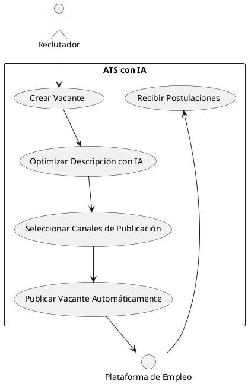

# 📌 Diagrama de Caso de Uso: Procesamiento Inteligente y Organización de CVs  

## 🎯 Descripción  
Este diagrama representa el flujo de **procesamiento automatizado de CVs** en el **ATS con IA**. La funcionalidad permite a los reclutadores recibir currículums desde múltiples fuentes y estructurar automáticamente la información de los candidatos en la base de datos del sistema.  

## 🏗️ Elementos del Diagrama  
### **Actores**  
- 👤 **Reclutador:** Usuario que gestiona los CVs de los candidatos dentro del ATS.  
- 📄 **Candidato:** Persona que envía su CV para postularse a una vacante.  

### **Casos de Uso**  
1. **Recibir CV desde Múltiples Fuentes:** Los candidatos envían sus CVs por correo, LinkedIn, portales de empleo u otros medios.  
2. **Extraer Información con IA:** El sistema analiza el contenido del CV y extrae datos clave como experiencia, educación y habilidades.  
3. **Clasificar y Organizar Candidatos:** La IA etiqueta y almacena los perfiles en la base de datos del ATS para facilitar la búsqueda y el filtrado.  
4. **Permitir Búsqueda de Candidatos:** El reclutador puede acceder a los perfiles filtrando por criterios específicos.  

### **Sistemas Externos**  
- 📧 **Correo Electrónico / LinkedIn / Portales de Empleo:** Representados como **entidades externas**, son los medios desde donde los candidatos envían sus CVs al ATS.  

## 📌 Representación en PlantUML  
El siguiente código **PlantUML** representa visualmente el flujo del caso de uso:  

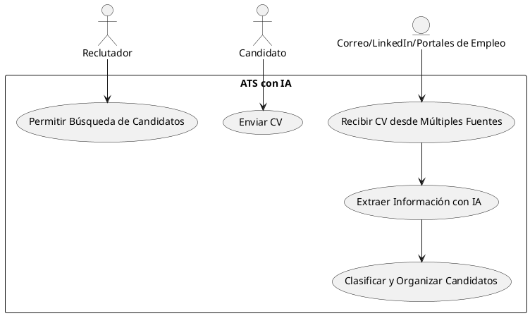
# 📌 Diagrama de Caso de Uso: Filtrado Inteligente y Priorización de Candidatos  

## 🎯 Descripción  
Este diagrama representa el flujo de **filtrado y priorización automática de candidatos** en el **ATS con IA**. La funcionalidad permite a los reclutadores recibir recomendaciones optimizadas de candidatos según los criterios de la vacante, reduciendo el tiempo de revisión manual y mejorando la selección de perfiles.  

## 🏗️ Elementos del Diagrama  
### **Actores**  
- 👤 **Reclutador:** Usuario que gestiona los procesos de selección dentro del ATS.  

### **Casos de Uso**  
1. **Analizar Requisitos de la Vacante:** La IA interpreta los criterios clave del puesto (experiencia, habilidades, ubicación, etc.).  
2. **Filtrar Candidatos Relevantes:** Se comparan los CVs almacenados con los requisitos de la vacante para descartar perfiles no alineados.  
3. **Priorizar Candidatos con IA:** Se asigna una puntuación a cada candidato según su grado de compatibilidad con la vacante.  
4. **Mostrar Ranking de Candidatos:** Se presenta al reclutador una lista ordenada de los candidatos más adecuados.  

### **Sistemas Externos**  
- 🔍 **Base de Datos del ATS:** Representada como **una entidad externa**, almacena la información de los candidatos para su análisis y comparación.  

## 📌 Representación en PlantUML  
El siguiente código **PlantUML** representa visualmente el flujo del caso de uso:  

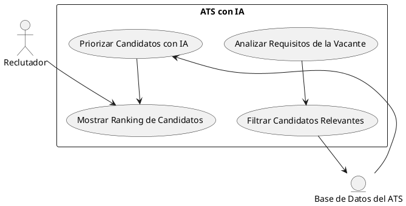

# 📌 Modelo de Datos: Publicación Automatizada y Optimización de Vacantes  

## 🎯 Descripción  
Este modelo de datos define las entidades y sus relaciones para el flujo de **creación, optimización y publicación de vacantes** dentro del **ATS con IA**.  

## 🏗️ Entidades y Atributos  

### **📌 Reclutador**  
Representa a los usuarios que crean y administran las vacantes en el sistema.  

| Atributo       | Tipo            | Descripción                            |
|---------------|----------------|----------------------------------------|
| `id`         | `UUID`          | Identificador único del reclutador.   |
| `nombre`     | `VARCHAR(255)`  | Nombre del reclutador.                |
| `email`      | `VARCHAR(255)`  | Correo electrónico del reclutador.    |
| `empresa_id` | `UUID`          | Referencia a la empresa.              |

### **📌 Empresa**  
Almacena información sobre las empresas que usan el ATS.  

| Atributo      | Tipo            | Descripción                              |
|--------------|----------------|------------------------------------------|
| `id`        | `UUID`          | Identificador único de la empresa.      |
| `nombre`    | `VARCHAR(255)`  | Nombre de la empresa.                   |
| `industria` | `VARCHAR(255)`  | Sector o industria de la empresa.       |

### **📌 Vacante**  
Contiene la información de una oferta de trabajo creada en el sistema.  

| Atributo             | Tipo            | Descripción                                       |
|---------------------|----------------|--------------------------------------------------|
| `id`              | `UUID`          | Identificador único de la vacante.              |
| `titulo`          | `VARCHAR(255)`  | Título del puesto.                              |
| `descripcion`     | `TEXT`          | Descripción completa de la vacante.             |
| `ubicacion`       | `VARCHAR(255)`  | Ubicación de la oferta (remoto, presencial).    |
| `salario`         | `DECIMAL(10,2)` | Rango salarial de la posición.                  |
| `estado`         | `ENUM('borrador', 'publicada', 'cerrada')` | Estado de la vacante. |
| `reclutador_id`   | `UUID`          | Referencia al reclutador que creó la vacante.   |

### **📌 Optimización IA**  
Almacena sugerencias de mejora generadas por IA para cada vacante.  

| Atributo        | Tipo            | Descripción                                     |
|----------------|----------------|----------------------------------------------|
| `id`          | `UUID`          | Identificador único del análisis.           |
| `vacante_id`  | `UUID`          | Referencia a la vacante analizada.          |
| `sugerencias` | `TEXT`          | Texto con las mejoras recomendadas.        |
| `fecha`       | `DATETIME`      | Fecha en que se generó la optimización.    |

### **📌 Plataforma de Empleo**  
Representa las plataformas externas donde se publican las vacantes.  

| Atributo        | Tipo            | Descripción                                  |
|----------------|----------------|---------------------------------------------|
| `id`          | `UUID`          | Identificador único de la plataforma.      |
| `nombre`      | `VARCHAR(255)`  | Nombre de la plataforma (LinkedIn, Indeed). |
| `url`        | `VARCHAR(255)`  | URL de la plataforma.                       |

### **📌 Publicación**  
Registra en qué plataformas y cuándo se publicó una vacante.  

| Atributo        | Tipo            | Descripción                                   |
|----------------|----------------|----------------------------------------------|
| `id`          | `UUID`          | Identificador único de la publicación.      |
| `vacante_id`  | `UUID`          | Referencia a la vacante publicada.         |
| `plataforma_id` | `UUID`        | Referencia a la plataforma externa.         |
| `fecha`       | `DATETIME`      | Fecha de publicación.                      |

## 🔗 Relaciones entre Entidades  
- Un **Reclutador** pertenece a una **Empresa**.  
- Un **Reclutador** puede crear múltiples **Vacantes**.  
- Una **Vacante** puede tener una única **Optimización IA**.  
- Una **Vacante** puede ser publicada en múltiples **Plataformas de Empleo**.  
- Una **Plataforma de Empleo** puede contener múltiples **Publicaciones**.  

## 📌 Representación en PlantUML  
El siguiente código **PlantUML** representa visualmente el modelo de datos:  

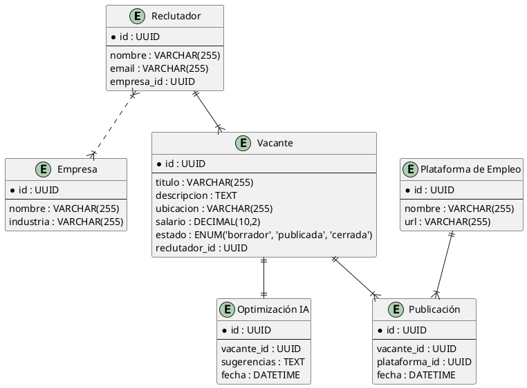

# 📌 Modelo de Datos: Gestión de Postulaciones y Seguimiento de Candidatos  

## 🎯 Descripción  
Este modelo de datos cubre la funcionalidad de **gestión de postulaciones y seguimiento de candidatos** en el **ATS con IA**. Define cómo los reclutadores pueden recibir, evaluar y hacer seguimiento a los candidatos que aplican a sus vacantes.  

## 🏗️ Entidades y Atributos  

### **📌 Candidato**  
Representa a los postulantes que aplican a una vacante.  

| Atributo       | Tipo            | Descripción                            |
|---------------|----------------|----------------------------------------|
| `id`         | `UUID`          | Identificador único del candidato.    |
| `nombre`     | `VARCHAR(255)`  | Nombre completo del candidato.        |
| `email`      | `VARCHAR(255)`  | Correo electrónico del candidato.     |
| `telefono`   | `VARCHAR(20)`   | Número de contacto.                   |
| `cv_url`     | `VARCHAR(255)`  | URL del currículum vitae.             |

### **📌 Postulación**  
Registra cada aplicación de un candidato a una vacante.  

| Atributo        | Tipo            | Descripción                                   |
|----------------|----------------|----------------------------------------------|
| `id`          | `UUID`          | Identificador único de la postulación.      |
| `candidato_id` | `UUID`          | Referencia al candidato que aplica.         |
| `vacante_id`   | `UUID`          | Referencia a la vacante a la que aplica.    |
| `fecha`       | `DATETIME`      | Fecha en que se envió la postulación.       |
| `estado`      | `ENUM('pendiente', 'en revisión', 'rechazado', 'aceptado')` | Estado actual de la postulación. |

### **📌 Evaluación**  
Registra el proceso de evaluación de los candidatos postulados.  

| Atributo        | Tipo            | Descripción                                  |
|----------------|----------------|---------------------------------------------|
| `id`          | `UUID`          | Identificador único de la evaluación.      |
| `postulacion_id` | `UUID`       | Referencia a la postulación evaluada.      |
| `reclutador_id`  | `UUID`       | Referencia al reclutador que evaluó.       |
| `comentarios`  | `TEXT`         | Notas del reclutador sobre el candidato.   |
| `calificacion` | `DECIMAL(3,2)` | Puntuación asignada al candidato (0-10).   |
| `fecha`       | `DATETIME`      | Fecha de la evaluación.                    |

### **📌 Seguimiento**  
Almacena el historial de interacciones con el candidato dentro del proceso de selección.  

| Atributo        | Tipo            | Descripción                                  |
|----------------|----------------|---------------------------------------------|
| `id`          | `UUID`          | Identificador único del seguimiento.       |
| `postulacion_id` | `UUID`       | Referencia a la postulación.               |
| `accion`      | `VARCHAR(255)`  | Acción realizada (ej. "Entrevista agendada"). |
| `fecha`       | `DATETIME`      | Fecha de la acción.                        |

## 🔗 Relaciones entre Entidades  
- Un **Candidato** puede realizar múltiples **Postulaciones**.  
- Una **Postulación** pertenece a una **Vacante**.  
- Una **Postulación** puede tener una o más **Evaluaciones**.  
- Una **Postulación** puede tener múltiples **Seguimientos**.  

## 📌 Representación en PlantUML  

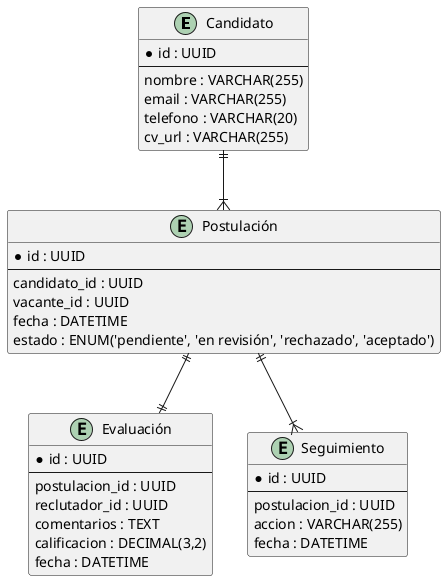

# 📌 Modelo de Datos: Programación y Gestión de Entrevistas  

## 🎯 Descripción  
Este modelo de datos cubre la funcionalidad de **programación y gestión de entrevistas** dentro del **ATS con IA**. Permite a los reclutadores agendar, modificar y hacer seguimiento a las entrevistas de los candidatos, incluyendo notificaciones y almacenamiento de resultados.  

## 🏗️ Entidades y Atributos  

### **📌 Candidato**  
Representa a los postulantes que participan en el proceso de entrevistas.  

| Atributo       | Tipo            | Descripción                            |
|---------------|----------------|----------------------------------------|
| `id`         | `UUID`          | Identificador único del candidato.    |
| `nombre`     | `VARCHAR(255)`  | Nombre completo del candidato.        |
| `email`      | `VARCHAR(255)`  | Correo electrónico del candidato.     |
| `telefono`   | `VARCHAR(20)`   | Número de contacto.                   |

### **📌 Entrevista**  
Registra las entrevistas agendadas para los candidatos.  

| Atributo        | Tipo            | Descripción                                   |
|----------------|----------------|----------------------------------------------|
| `id`          | `UUID`          | Identificador único de la entrevista.       |
| `candidato_id` | `UUID`          | Referencia al candidato entrevistado.       |
| `vacante_id`   | `UUID`          | Referencia a la vacante asociada.           |
| `reclutador_id` | `UUID`         | Referencia al reclutador que la realiza.    |
| `fecha_hora`  | `DATETIME`      | Fecha y hora de la entrevista.              |
| `modo`        | `ENUM('presencial', 'virtual')` | Tipo de entrevista. |
| `estado`      | `ENUM('pendiente', 'completada', 'cancelada')` | Estado de la entrevista. |

### **📌 Notificación**  
Guarda los recordatorios y alertas enviadas a candidatos y reclutadores.  

| Atributo        | Tipo            | Descripción                                  |
|----------------|----------------|---------------------------------------------|
| `id`          | `UUID`          | Identificador único de la notificación.    |
| `entrevista_id` | `UUID`        | Referencia a la entrevista.                |
| `usuario_id`   | `UUID`         | Persona que recibe la notificación.        |
| `tipo`        | `ENUM('email', 'SMS', 'push')` | Tipo de notificación. |
| `mensaje`     | `TEXT`          | Contenido del mensaje.                      |
| `enviada`     | `BOOLEAN`       | Indica si la notificación fue enviada.     |

### **📌 Evaluación de Entrevista**  
Almacena los resultados de la entrevista.  

| Atributo        | Tipo            | Descripción                                  |
|----------------|----------------|---------------------------------------------|
| `id`          | `UUID`          | Identificador único de la evaluación.      |
| `entrevista_id` | `UUID`        | Referencia a la entrevista evaluada.      |
| `reclutador_id` | `UUID`        | Referencia al reclutador que evalúa.      |
| `comentarios`  | `TEXT`         | Notas sobre el desempeño del candidato.   |
| `calificacion` | `DECIMAL(3,2)` | Puntuación asignada (0-10).                |

## 🔗 Relaciones entre Entidades  
- Un **Candidato** puede tener múltiples **Entrevistas**.  
- Una **Entrevista** está asociada a una **Vacante** y a un **Reclutador**.  
- Una **Entrevista** puede generar varias **Notificaciones**.  
- Una **Entrevista** puede tener una **Evaluación de Entrevista**.  

## 📌 Representación en PlantUML  

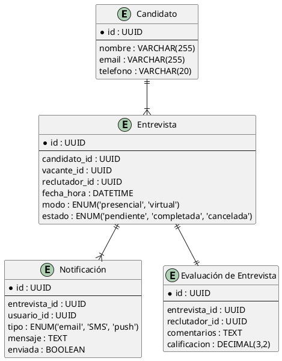

# 📌 Propuesta de Alto Nivel para el MVP del ATS con IA  

## 🎯 Visión General  
Este documento describe la arquitectura de alto nivel del **MVP del ATS con IA**, utilizando el **patrón MVC (Modelo-Vista-Controlador)** para garantizar una separación clara de responsabilidades y una estructura escalable.  

---

## 🏗️ **Arquitectura General**  
El sistema se dividirá en **tres capas principales**:  

1. **Modelo (M)**: Representa la capa de datos y lógica de negocio. Se encarga de gestionar la persistencia en la base de datos y aplicar reglas de negocio.  
2. **Vista (V)**: Define la interfaz de usuario (UI), permitiendo la interacción con el sistema a través de una aplicación web responsiva.  
3. **Controlador (C)**: Actúa como intermediario entre la Vista y el Modelo, procesando las solicitudes y aplicando la lógica antes de actualizar la UI o modificar los datos.  

---

## 🛠️ **Componentes Clave del MVP**  

### **1️⃣ Módulo de Gestión de Vacantes y Postulaciones**  
📌 **Descripción**: Permite a los reclutadores publicar vacantes y a los candidatos postularse.  

🔹 **Modelo**:  
- `Vacante`: Define el título, descripción, requisitos y estado.  
- `Postulación`: Relaciona candidatos con vacantes y almacena su estado.  
- `Candidato`: Contiene la información del postulante.  

🔹 **Vista**:  
- Formulario de creación y edición de vacantes.  
- Listado de vacantes disponibles.  
- Formulario de postulación con carga de CV.  

🔹 **Controlador**:  
- `VacanteController`: Crea, edita y elimina vacantes.  
- `PostulacionController`: Permite a los candidatos postularse y rastrear el estado.  

---

### **2️⃣ Módulo de Evaluación y Seguimiento de Candidatos**  
📌 **Descripción**: Los reclutadores pueden evaluar y hacer seguimiento a los candidatos postulados.  

🔹 **Modelo**:  
- `Evaluacion`: Contiene la calificación y comentarios sobre un candidato.  
- `Seguimiento`: Registra el historial de interacciones con el postulante.  

🔹 **Vista**:  
- Panel de evaluaciones con comentarios y puntuaciones.  
- Historial de interacciones del candidato.  

🔹 **Controlador**:  
- `EvaluacionController`: Guarda las evaluaciones de los reclutadores.  
- `SeguimientoController`: Registra cambios de estado y comunicaciones.  

---

### **3️⃣ Módulo de Programación y Gestión de Entrevistas**  
📌 **Descripción**: Facilita la programación y gestión de entrevistas entre candidatos y reclutadores.  

🔹 **Modelo**:  
- `Entrevista`: Define fecha, hora, modo (presencial/virtual) y estado.  
- `Notificacion`: Envía recordatorios a candidatos y reclutadores.  

🔹 **Vista**:  
- Calendario de entrevistas con disponibilidad.  
- Notificaciones y recordatorios automáticos.  

🔹 **Controlador**:  
- `EntrevistaController`: Programa y gestiona entrevistas.  
- `NotificacionController`: Envía alertas a los participantes.  

---

## 🧠 **Integración de IA como Ventaja Competitiva**  
Para diferenciar el ATS en el mercado, se integrará **inteligencia artificial** en las siguientes áreas:  

✅ **Análisis Automático de CVs**: Clasificación y recomendación de candidatos según los requisitos de la vacante.  
✅ **Predicción de Ajuste**: Evaluación de compatibilidad basada en historial de contratación y evaluación previa.  
✅ **Automatización de Seguimiento**: Sugerencias inteligentes para optimizar el proceso de selección.  

---

## 🔌 **Tecnologías y Herramientas Sugeridas**  

🛠 **Backend**: Laravel (PHP) + MySQL/PostgreSQL  
🎨 **Frontend**: Vue.js / React.js  
📦 **Infraestructura**: Docker + AWS/GCP  
🤖 **IA/ML**: Python (FastAPI) para análisis de CVs  

---

## 📅 **Roadmap del MVP**  

✅ **Semana 1-2**: Definición de modelos y base de datos.  
✅ **Semana 3-4**: Desarrollo de controladores y vistas básicas.  
✅ **Semana 5-6**: Integración de IA para análisis de CVs.  
✅ **Semana 7-8**: Pruebas, ajustes y despliegue inicial.  

---

# 📌 Diagrama de Arquitectura del MVP (MVC + IA)

Este diagrama representa la arquitectura del MVP del **ATS con IA**, destacando la separación en **Modelo-Vista-Controlador (MVC)** y la integración de inteligencia artificial.

---

## 📍 **Diagrama en PlantUML**
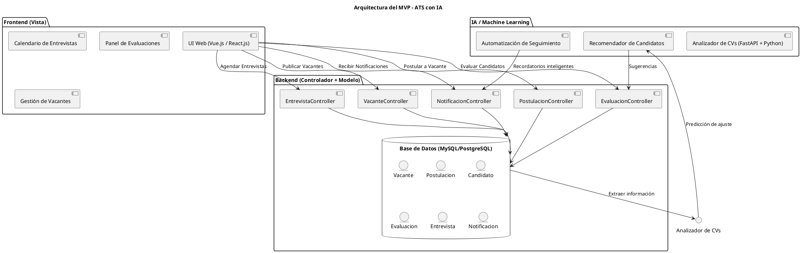
# Diagrama C4 para el Sistema ATS con IA

## Nivel 1: Diagrama de Contexto

Este es el **diagrama de contexto (Nivel 1)** del sistema ATS con IA, que muestra los actores principales y las interacciones generales con el sistema.

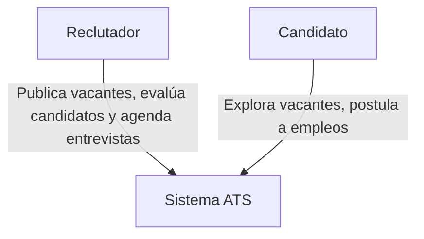

### Descripción del Diagrama de Contexto

Este diagrama muestra los actores externos y el sistema principal:

- **Reclutador**: Publica vacantes, evalúa candidatos y agenda entrevistas.
- **Candidato**: Explora vacantes y postula a empleos.
- **Sistema ATS**: Es el sistema principal que gestiona las vacantes y postulaciones.

El propósito de este diagrama es definir los límites del sistema y su relación con los actores principales sin entrar en detalles de su arquitectura interna.

## Nivel 2: Diagrama de Contenedores

Este es el **diagrama de contenedores (Nivel 2)** que muestra los contenedores internos del sistema y cómo interactúan entre sí.

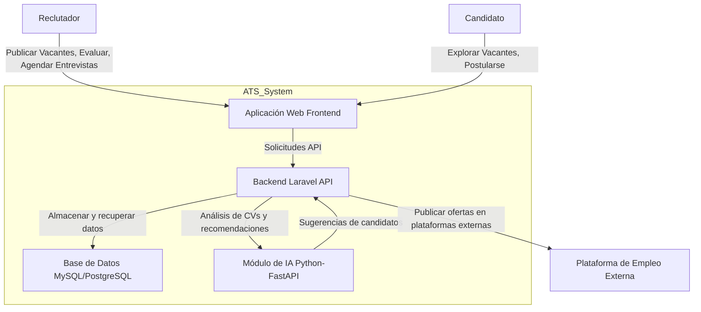
## Descripción del Diagrama de Contenedores

Este diagrama detalla los contenedores dentro del sistema y sus interacciones:

- **Aplicación Web Frontend**: Interfaz de usuario para que reclutadores y candidatos interactúen con el sistema.
- **Backend Laravel API**: Procesa la lógica del negocio y la comunicación con la base de datos y el módulo de IA.
- **Base de Datos MySQL/PostgreSQL**: Almacena los datos persistentes del sistema.
- **Módulo de IA Python-FastAPI**: Analiza los CVs de los candidatos y genera recomendaciones.
- **Plataforma de Empleo Externa**: Publica las vacantes en sitios de empleo externos.

# Nivel 3: Diagrama de Componentes
Este es el **diagrama de componentes (Nivel 3)** del Backend Laravel API, que desglosa los componentes principales de la API.

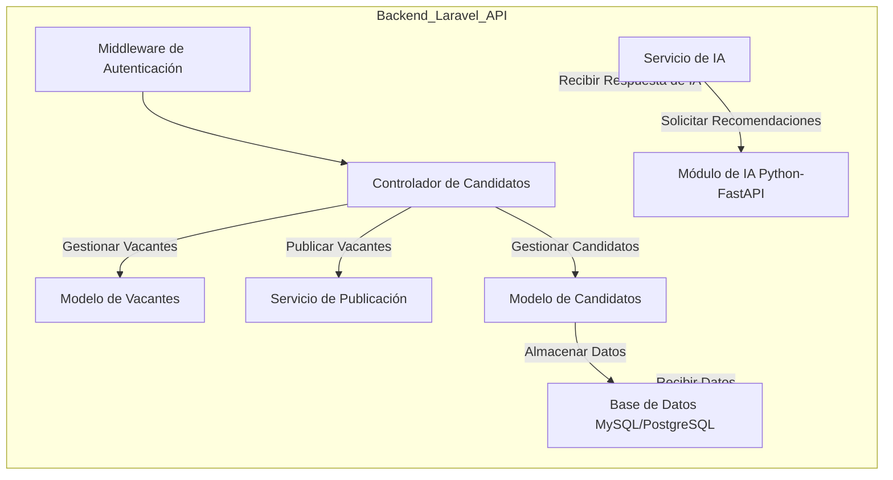
## Descripción del Diagrama de Componentes (Nivel 3)

Este diagrama desglosa el **Servicio de Publicación** dentro del **Backend Laravel API**. Los componentes principales son:

- **Controlador de Vacantes**: Gestiona las solicitudes de publicación de vacantes.
- **Servicio de Publicación**: Lógica principal para interactuar con las plataformas de empleo externas.
- **Validador de Vacantes**: Valida los datos de las vacantes antes de enviarlas.
- **Modelo de Vacantes**: Representa y maneja los datos de las vacantes en la base de datos.
- **Logger y Sistema de Logs**: Registra las acciones y errores del servicio de publicación.
- **API de Plataforma Externa**: Interactúa con las plataformas de empleo externas para publicar vacantes.

# Nivel 4: Diagrama de Clases

Este es el **diagrama de componentes (Nivel 4)**, que desglosa los detalles del Servicio de Publicación.

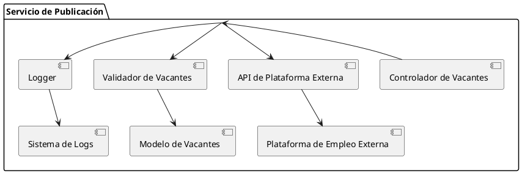
## Descripción del Diagrama de Componentes (Nivel 4)

En este diagrama se detallan las interacciones internas del **Servicio de Publicación**:

- El **Controlador de Vacantes** invoca el **Servicio de Publicación**.
- El **Servicio de Publicación** valida las vacantes mediante el **Validador de Vacantes** y luego las envía a las plataformas externas mediante el **API de Plataforma Externa**.
- Se registra cada acción mediante el **Logger** y se almacenan los logs en el **Sistema de Logs**.
