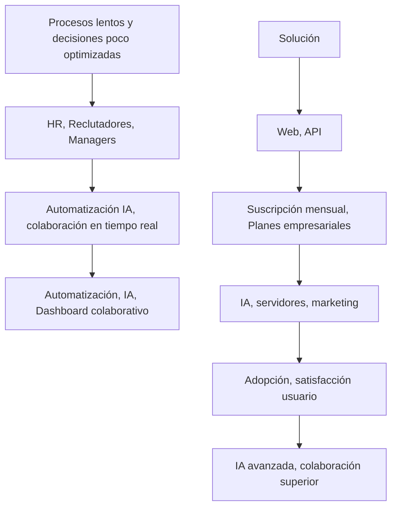
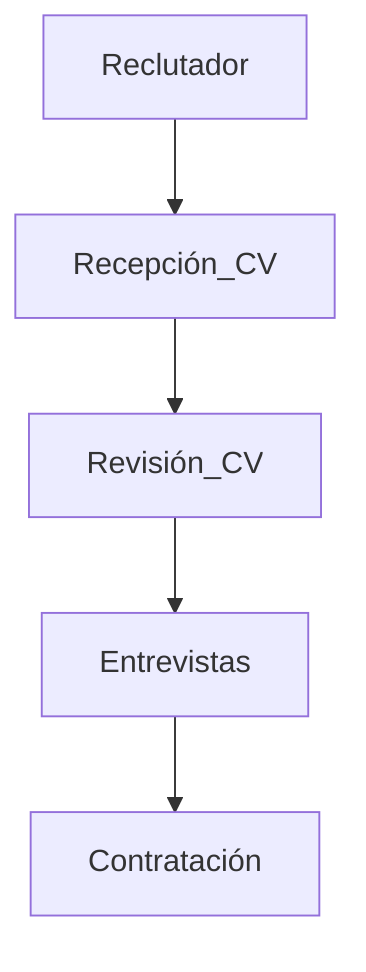
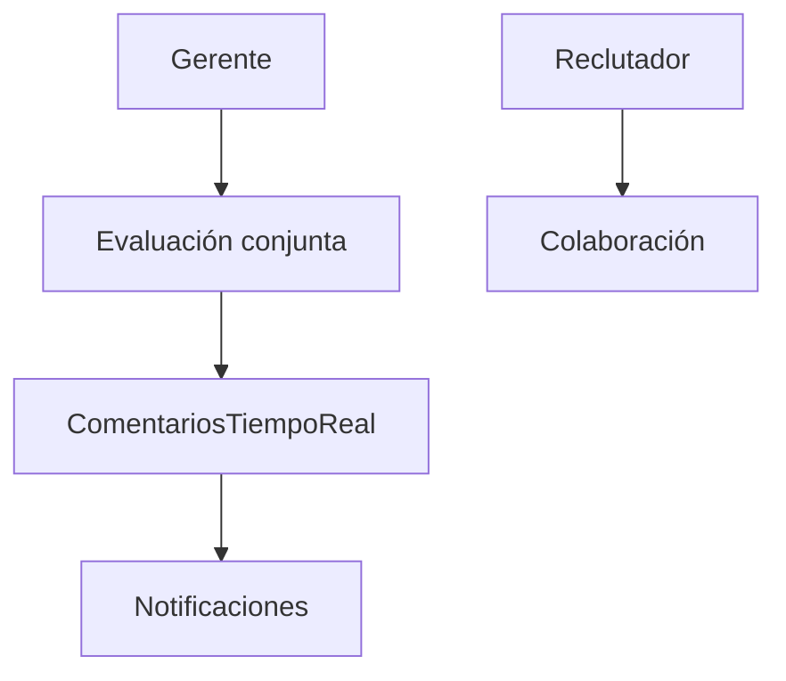
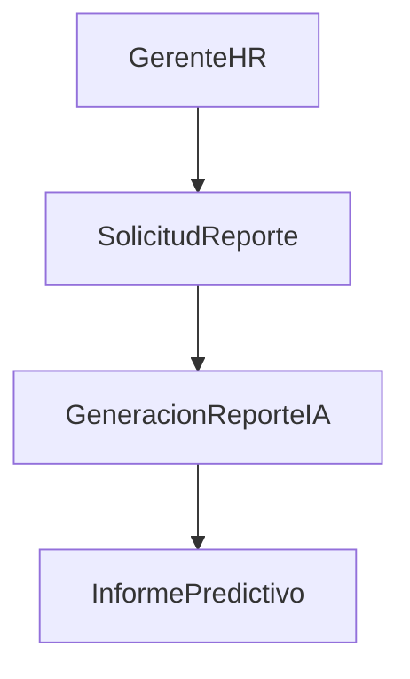
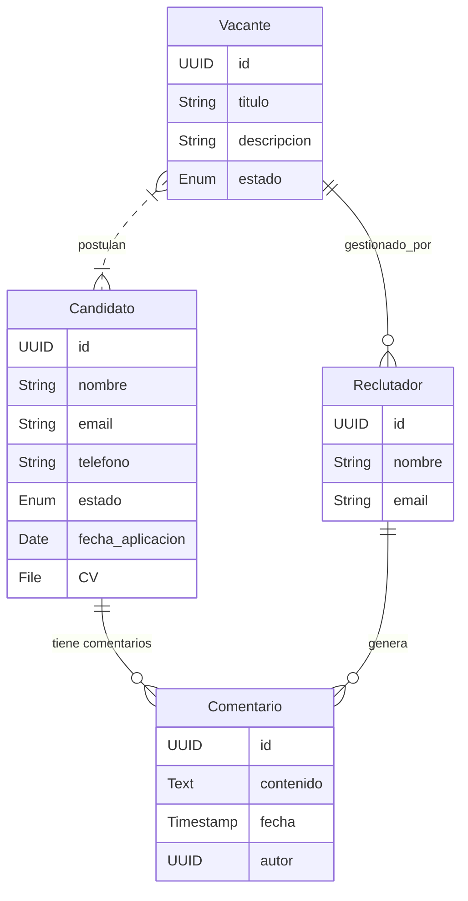
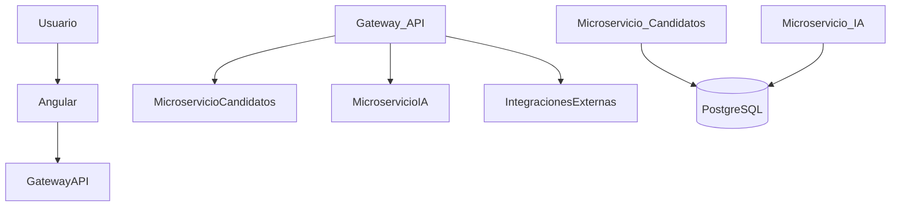
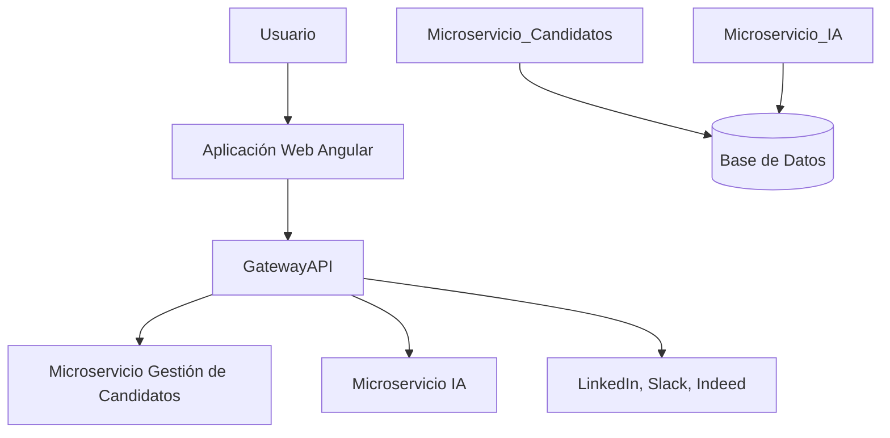
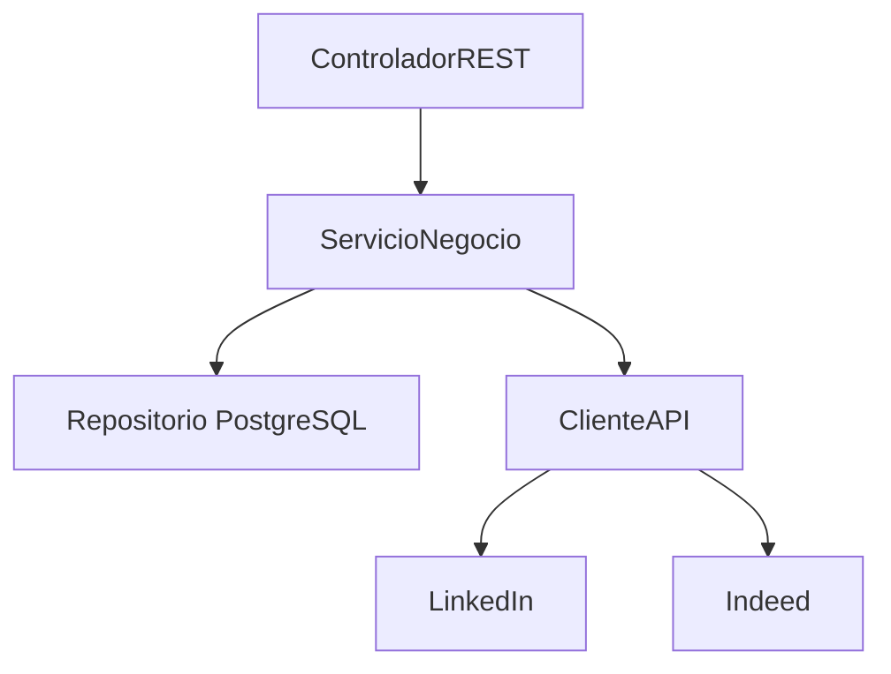

# Documentación Proyecto LTI

## Descripción del Software

El software LTI es un sistema avanzado de seguimiento de candidatos (ATS - Applicant Tracking System) diseñado para revolucionar el proceso de reclutamiento. Maximiza eficiencia, fomenta la colaboración en tiempo real, automatiza tareas repetitivas y brinda asistencia inteligente con IA.

### Valor añadido y ventajas competitivas
- **Automatización inteligente:** Reducción de tareas manuales.
- **Colaboración en tiempo real:** Comunicación fluida entre equipos.
- **Asistencia IA:** Análisis predictivos y recomendaciones para selección.
- **Interfaz intuitiva:** Experiencia de usuario mejorada.

## Funciones Principales

- Gestión integral de candidatos
- Automatización de reclutamiento
- Colaboración en tiempo real
- Reportes avanzados
- Integraciones externas (LinkedIn, Indeed, Slack)

## Lean Canvas

| Problema | Clientes | Propuesta de valor |
|----------|----------|---------------------|
| Procesos lentos y decisiones poco optimizadas | HR, Reclutadores, Managers | Automatización IA y colaboración en tiempo real |

| Solución | Canales | Ingresos |
|----------|---------|----------|
| Automatización, IA, Dashboard | Web, API | Suscripción mensual, planes empresariales |

| Costes | Métricas | Ventajas injustas |
|--------|----------|-------------------|
| IA, servidores, marketing | Adopción, satisfacción usuario | IA avanzada y colaboración superior |


## Casos de Uso Principales

### Caso de Uso 1: Gestión de candidatos
- Actor: Reclutador
- Descripción: Maneja candidatos desde recepción de CV hasta contratación.


### Caso de uso 2: Colaboración en tiempo real
- Actor: Gerente, Reclutador
- Descripción: Evaluación conjunta de candidatos mediante comentarios en tiempo real.


### Caso de uso 3: Reportes Inteligentes
- Actor: Gerente HR
- Descripción: Generación automática de informes predictivos usando IA.



## Modelo de datos

- **Candidato:**
  - ID (UUID)
  - Nombre (String)
  - Email (String)
  - Teléfono (String)
  - Estado (Enum)
  - Fecha de aplicación (Date)
  - CV (File)

- **Vacante:**
  - ID (UUID)
  - Título (String)
  - Descripción (Text)
  - Estado (Enum)

- **Reclutador:**
  - ID (UUID)
  - Nombre (String)
  - Email (String)

- **Comentario:**
  - ID (UUID)
  - Contenido (Text)
  - Fecha (Timestamp)
  - Autor (UUID)

### Relaciones:
- Vacante → Reclutador (1 a muchos)
- Vacante ↔ Candidato (muchos a muchos)
- Candidato → Comentario (1 a muchos)
- Reclutador → Comentario (1 a muchos)



## Diseño del Sistema Alto Nivel

Arquitectura basada en microservicios:

- **Front-end:** Angular
- **Back-end:** Microservicios REST con Java Spring Boot
- **Base de datos:** PostgreSQL
- **Seguridad:** JWT, OAuth2
- **Integraciones:** APIs externas


### Diagrama Alto Nivel
```
Usuario (Reclutador/Gerente) --> Front-end (Angular) --> Gateway (API)
                         |
                         --> Microservicio Candidatos
                         --> Microservicio Reportes IA
                         |
                         --> Base de datos PostgreSQL
                         |
                         --> Integraciones Externas
```



## Diagrama C4

### Nivel 1: Sistema (Contexto)

- **LTI ATS:** Aplicación web para reclutamiento
  - **Usuarios:** Reclutadores, Gerentes
  - **Sistemas externos:** LinkedIn, Slack, Indeed

### Nivel 2: Contenedores

- **Web App (Angular)**
- **Microservicio Gestión de Candidatos (Spring Boot)**
- **Microservicio IA (Spring Boot)**
- **Base de datos (PostgreSQL)**



### Nivel 2: Componentes

- **Controlador REST:** Peticiones HTTP.
- **Servicio de Negocio:** Gestión lógica.
- **Repositorio Datos:** Acceso PostgreSQL.
- **Cliente API:** Integración con externos.

### Nivel 3: Componentes específicos

- **CandidatoService:** Gestión lógica candidatos.
- **ComentarioService:** Gestión comentarios.
- **EmailNotificationService:** Emails automáticos.



