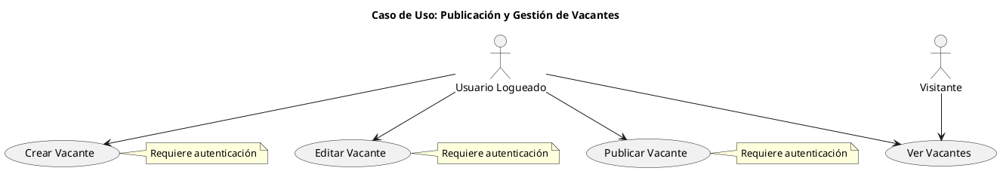
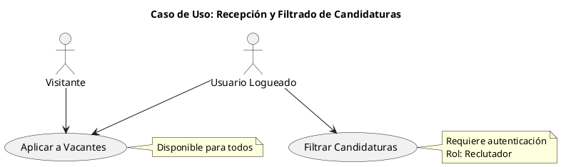
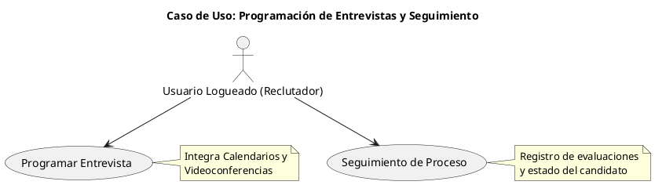
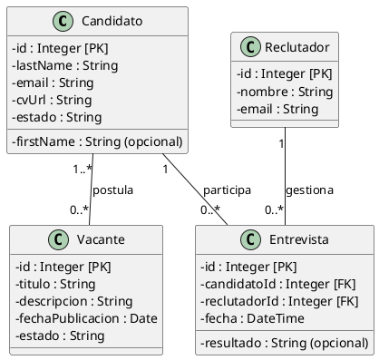
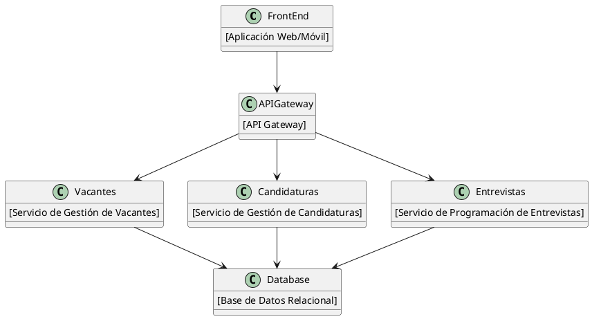

# LTI - Sistema de Gestión de Candidatos (ATS)
**Iniciales:** ACBG

## 1. Descripción Breve del Software

**LTI** es un sistema de gestión de candidatos (ATS) diseñado para modernizar y optimizar el proceso de reclutamiento. Se enfoca en automatizar tareas repetitivas y proporcionar métricas que ayuden a reducir costos y tiempo en la selección de personal, a la vez que mejora la experiencia tanto de candidatos como de reclutadores.

**Ventajas Competitivas:**
- **Eficiencia:** Automatización de tareas repetitivas y reducción de carga administrativa.
- **Experiencia del Usuario:** Interfaz intuitiva, accesible desde cualquier dispositivo.
- **Analítica Avanzada:** Dashboards con métricas (Time-to-Hire, Cost-per-Hire, tasa de conversión, etc.).
- **Escalabilidad:** Arquitectura basada en microservicios, que permite crecer y adaptarse a distintos volúmenes de contratación.

**Funciones Principales:**
- Publicación y gestión de vacantes.  
- Recepción y filtrado de candidaturas.  
- Programación de entrevistas y seguimiento de procesos.

---

## Lean Canvas (Modelo de Negocio)

### Resumen Lean Canvas
- **Problema:** Procesos de reclutamiento ineficientes y costosos.
- **Segmento de Clientes:** Empresas que buscan optimizar su proceso de contratación.
- **Propuesta de Valor:** ATS LTI que automatiza y mejora la experiencia de reclutamiento.
- **Solución:** Publicación de vacantes, recepción y filtrado de candidaturas, y coordinación de entrevistas.
- **Canales:** Plataforma web, integraciones con portales de empleo, redes sociales.
- **Estructura de Costos:** Desarrollo, mantenimiento e infraestructura cloud.
- **Fuentes de Ingresos:** Suscripción, modelo freemium y servicios adicionales.

**Diagrama de Lean Canvas (Formato HTML)**

<table style="width: 100%; border: 2px solid black; border-collapse: collapse; text-align: center;">
  <!-- Fila 1: Socios Clave (8), Actividades Clave (7), Propuesta de Valor (2) -->
  <tr style="border: 1px solid black;">
    <!-- Socios Clave (8) con rowspan=2 -->
    <td rowspan="2" style="background-color:#5D268C; color:#fff; border:1px solid black; width:15%;">
      <strong>8. Socios Clave</strong><br/>
      <em>Portales de empleo, proveedores de videoconferencia, socios de IA</em>
    </td>
    <!-- Actividades Clave (7) -->
    <td style="background-color:#5D268C; color:#fff; border:1px solid black; width:20%;">
      <strong>7. Actividades Clave</strong><br/>
      <em>Publicación de vacantes, recepción y filtrado de candidaturas, programación de entrevistas</em>
    </td>
    <!-- Propuesta de Valor (2) con rowspan=2 -->
    <td rowspan="2" style="background-color:#4FC3F7; color:#000; border:1px solid black; width:25%;">
      <strong>2. Propuesta de Valor</strong><br/>
      <em>ATS LTI que automatiza y mejora la experiencia de reclutamiento</em>
    </td>
  </tr>
  <!-- Fila 1 (parte 2): Recursos Clave (5) -->
  <tr style="border:1px solid black;">
    <td style="background-color:#5D268C; color:#fff; border:1px solid black;">
      <strong>5. Recursos Clave</strong><br/>
      <em>Desarrollo de software, infraestructura cloud, base de datos, integraciones con ML</em>
    </td>
  </tr>
  <!-- Fila 2: Relaciones con Clientes (6), Canales (3), Segmentos de Mercado (1) -->
  <tr style="border:1px solid black;">
    <td style="background-color:#F06292; color:#000; border:1px solid black;">
      <strong>6. Relaciones con Clientes</strong><br/>
      <em>Automatización, panel colaborativo, soporte y notificaciones</em>
    </td>
    <td style="background-color:#F06292; color:#000; border:1px solid black;">
      <strong>3. Canales</strong><br/>
      <em>Plataforma web, integraciones con portales de empleo, redes sociales</em>
    </td>
    <td style="background-color:#F06292; color:#000; border:1px solid black;">
      <strong>1. Segmentos de Mercado</strong><br/>
      <em>Empresas que buscan optimizar su proceso de contratación</em>
    </td>
  </tr>
  <!-- Fila 3: Estructura de Costos (9) y Fuentes de Ingresos (4) -->
  <tr style="border:1px solid black;">
    <!-- Estructura de Costos (9) con colspan=2 -->
    <td colspan="2" style="background-color:#A4D869; color:#000; border:1px solid black;">
      <strong>9. Estructura de Costos</strong><br/>
      <em>Desarrollo, mantenimiento e infraestructura cloud</em>
    </td>
    <!-- Fuentes de Ingresos (4) -->
    <td style="background-color:#A4D869; color:#000; border:1px solid black;">
      <strong>4. Fuentes de Ingresos</strong><br/>
      <em>Suscripción, modelo freemium y servicios adicionales</em>
    </td>
  </tr>
</table>


**Explicación del Lean Canvas:**  
Este diagrama ilustra el modelo de negocio de LTI, evidenciando cómo resolvemos el problema de procesos de reclutamiento ineficientes a través de una propuesta de valor que integra automatización y analíticas avanzadas. Nuestros segmentos de clientes se componen de empresas que buscan optimizar la contratación, y monetizamos mediante un modelo de suscripción o servicios premium.

---

## 2. Casos de Uso Principales
A continuación, presentamos tres casos de uso principales, cada uno con su propio diagrama en PlantUML, basado en un análisis realista de los roles y acciones en el sistema.
Se incluyen notas para remarcar la lógica o dependencias.

 
### 2.1 Publicación y Gestión de Vacantes

**Descripción**
Permite a los usuarios (visitantes y logueados) **ver** las vacantes disponibles. Sin embargo, solo el **usuario logueado** puede **crear**, **editar** o **publicar** nuevas vacantes, debido a que estas acciones requieren autenticación.


**Nota**

	- “Ver Vacantes” es libre, mientras que “Crear”, “Editar” y “Publicar” solo están disponibles para usuarios logueados.
	- Se asume un **control de acceso** que valida el rol y la sesión del usuario.

### 2.2 Recepción y Filtrado de Candidaturas

**Descripción:**
Cualquier usuario (visitante o logueado) puede aplicar a una vacante, subiendo su información y CV. El **filtrado de candidaturas** (por palabras clave o IA) es accesible únicamente para usuarios logueados con rol de reclutador o similar, y el sistema lo procesa de manera automatizada.




*Nota:* 
	- El filtrado utiliza un componente de machine learning que evalúa la idoneidad de cada candidato.
	- Las candidaturas se almacenan en la base de datos y pueden ser revisadas posteriormente por el equipo de RR. HH.


### 2.3 Programación de Entrevistas y Seguimiento
**Descripción:** 
Este caso de uso se orienta a usuarios logueados con rol de reclutador o manager. Permite programar entrevistas, integrándose con calendarios externos, y hacer un seguimiento continuo del proceso (desde la invitación hasta la evaluación final).



*Nota:* 
	- La programación de entrevistas **envía notificaciones** y actualiza automáticamente el estado del candidato en el sistema.
	- El seguimiento brinda una **visión global** del proceso de reclutamiento, permitiendo a los reclutadores compartir notas y evaluaciones internas.


## 3. Modelo de Datos
Basado en la guía de UML Diagramming and Database Modeling, hemos definido las entidades, atributos y relaciones relevantes para LTI.

**Candidato:**

	- **id:** Integer (PK)
	- **firstName:** String (opcional)
	- **lastName:** String
	- **email:** String
	- **cvUrl:** String
	- **estado:** String (Ej. "nuevo", "en revisión", "entrevista", etc.)
	
**Vacante:**

	- **id:** Integer (PK)
	- **titulo:** String
	- **descripcion:** String
	- **fechaPublicacion:** Date
	- **estado:** String (Ej. "activa", "cerrada")
	
**Reclutador:**

	- **id:** Integer (PK)
	- **nombre:** String
	- **email:** String
	
**Entrevista:**

	- **id:** Integer (PK)
	- **candidatoId:** Integer (FK)
	- **reclutadorId:** Integer (FK)
	- **fecha:** DateTime
	- **resultado:** String (opcional)
	

	
**Descripción**

	- Candidato: Representa a la persona que aplica a una vacante.
	- Vacante: Oferta de trabajo con título, descripción, fecha de publicación y estado.
	- Reclutador: Usuario que gestiona las vacantes y entrevistas.
	- Entrevista: Registro que asocia un candidato con un reclutador y una fecha para la evaluación.
	
**Relaciones**

	- Un candidato puede postular a varias vacantes (N:M).
	- Un reclutador gestiona múltiples entrevistas.
	- Una vacante puede tener muchas candidaturas

*Nota:* Para las relaciones de muchos a muchos (N:M), como la de candidatos y vacantes, se implementará una tabla intermedia que gestione estas asociaciones de manera eficiente.


## 4. Diseño del Sistema a Alto Nivel

**Explicación:**

Basado en una arquitectura de microservicios, el *El sistema LTI* se divide en servicios independientes (Vacantes, Candidaturas, Entrevistas), con un API Gateway que encamina peticiones al servicio correspondiente. Un front-end web/móvil interactúa con el Gateway. La base de datos almacena la información de candidatos, vacantes y entrevistas de forma relacional.

*Nota de Diseño:* Además de los componentes presentados, se implementarán mecanismos de seguridad (como encriptación, autenticación y control de acceso) y se adoptarán prácticas de escalabilidad (uso de microservicios, balanceo de carga y arquitectura en la nube) para garantizar la robustez y el crecimiento del sistema.


**Diagrama de Arquitectura de Alto Nivel (PlantUML - Diagrama de Componentes):**


**Notas**

	- **Seguridad y Escalabilidad:** Se utilizan tokens JWT para autenticación, balanceadores de carga y contenedores Docker/Kubernetes para el despliegue.
	- **Integraciones Externas:** Calendarios, plataformas de videoconferencia y redes sociales de empleo se consumen vía API.


## 5. Diagrama C4 en Profundidad

**Componente Seleccionado: Recepción y Filtrado de Candidaturas**
Basado en [C4-PlantUML](https://lukemerrett.com/c4-diagrams-as-code-architectural-joy/), este diagrama profundiza en el componente de Recepción y Filtrado. Se ilustra cómo interactúa con el API Gateway, la base de datos y el servicio de machine learning para evaluar a los candidatos.

**Diagrama C4 (PlantUML con C4-PlantUML):**
```plantuml
@startuml
!include https://raw.githubusercontent.com/plantuml-stdlib/C4-PlantUML/master/C4_Container.puml

LAYOUT_TOP_DOWN()

Container(frontend, "Front-end Web/Móvil", "React/Angular", "Interfaz de usuario")
Container(api, "API Gateway", "Node.js/Express", "Encamina las peticiones")
Container(recepcion, "Servicio de Recepción de Candidaturas", "Java/Python", "Procesa y almacena solicitudes")
Container(ml, "Servicio de Filtrado y Evaluación", "Python", "Analiza y califica candidatos con IA")
Container(db, "Base de Datos", "PostgreSQL", "Almacena información de candidatos y vacantes")

Rel(frontend, api, "HTTP/HTTPS")
Rel(api, recepcion, "REST API")
Rel(api, ml, "REST API")
Rel(recepcion, db, "Lee/Escribe datos de candidaturas")
Rel(ml, db, "Lee/Escribe evaluaciones")

@enduml
```
**Descripción**

1. Front-end envía la solicitud de candidatura al API Gateway.
2. API Gateway redirige la petición al Servicio de Recepción.
3. Servicio de Recepción almacena la información en la base de datos y solicita al Servicio de Filtrado una evaluación inicial.
4. Servicio de Filtrado (IA) analiza la candidatura y genera un puntaje o evaluación, actualizándolo en la base de datos.
5. El reclutador puede acceder a esta información para agilizar la criba de candidatos.


## 6. Conclusiones y Próximos Pasos

Con esta documentación, se ofrece un análisis detallado del sistema LTI. Los diagramas no solo muestran una estética cuidada, sino que reflejan las necesidades reales del negocio y la arquitectura propuesta:

1. **Casos de Uso**

	- Claramente diferenciados entre visitantes y usuarios logueados, mostrando dependencias y requisitos de autenticación.
	
2. **Modelo de Datos**

	- Basado en un diagrama de clases/entidad-relación con relaciones N:M y FK para reflejar la realidad del ATS.
	
3. **Diseño de Arquitectura**

	- Un diagrama de componentes que ilustra la separación en microservicios y un diagrama C4 que profundiza en el servicio crítico de recepción y filtrado.
	
**Próximos Pasos**

	- Validar estos artefactos con stakeholders (RR. HH., reclutadores, equipo de TI).
	- Refinar el modelo de datos y los flujos de casos de uso según feedback.
	- Implementar los microservicios de manera iterativa, comenzando por el componente de Recepción y Filtrado.
	- Configurar la infraestructura en la nube y los contenedores para escalabilidad.
	
Este documento (LTI-ACBG.md) consolida el análisis y diseño del sistema, sirviendo de base para la fase de implementación y futuras iteraciones.