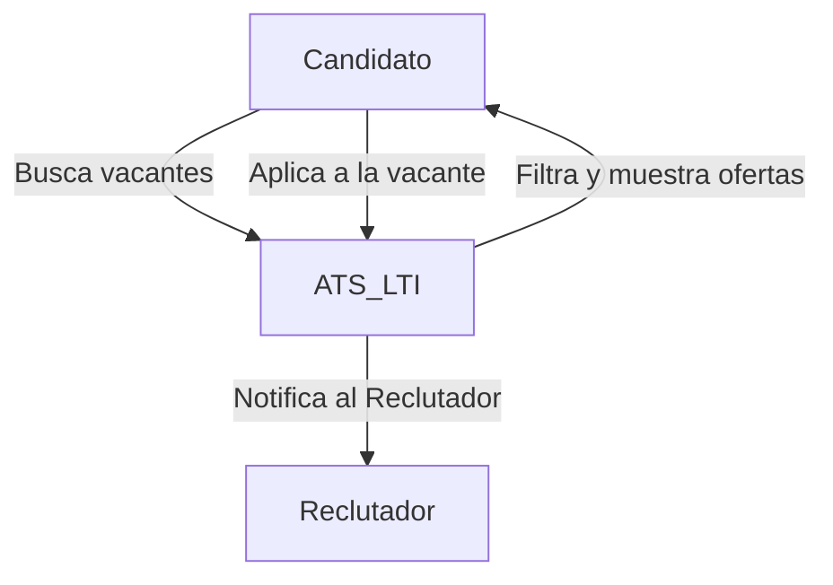
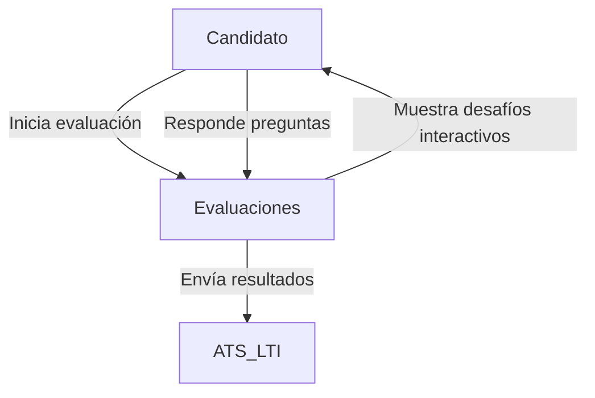
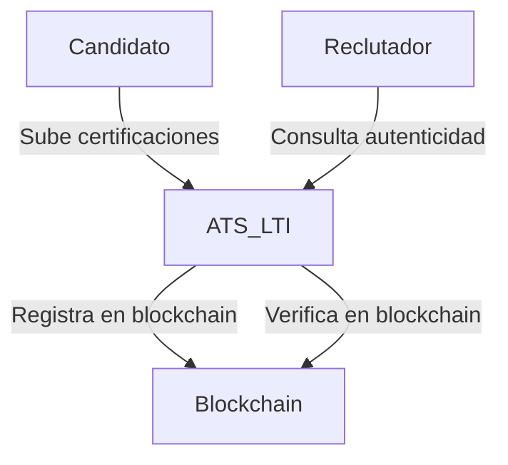
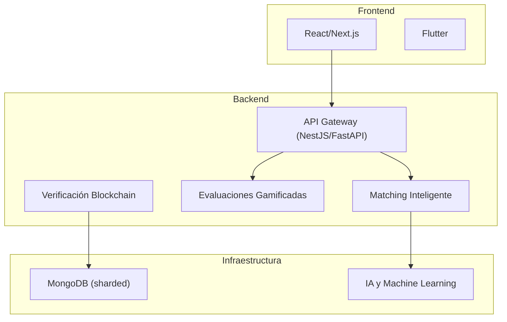

# 📌 ATS LTI - Documentación Técnica

## 1️⃣ Descripción y Propuesta de Valor

**LTI** es un **Sistema de Seguimiento de Candidatos (ATS)** que integra tecnologías avanzadas como **gamificación en evaluaciones, verificación de credenciales con blockchain y matching inteligente con IA**.  
A diferencia de otros ATS, **LTI no solo administra procesos de reclutamiento**, sino que también **mejora la precisión en la selección, optimiza la experiencia del candidato y reduce sesgos**.

### 🚀 **Valor Añadido y Ventajas Competitivas**

✅ **Matching Inteligente** con IA explicable y NLP para una selección más precisa.  
✅ **Evaluaciones Gamificadas**, haciendo el proceso más interactivo y atractivo.  
✅ **Verificación con Blockchain**, asegurando autenticidad en credenciales y experiencia.  
✅ **Automatización con IA**, reduciendo tiempos en el filtrado de candidatos.  
✅ **Escalabilidad y Microservicios**, asegurando alto rendimiento.  

---

## 2️⃣ Lean Canvas

📌 **Lean Canvas en Canvanizer:**  
🔗 [Ver diagrama en Canvanizer](https://next.canvanizer.com/canvas/ruWKRRzlv8MEV)

---

## 3️⃣ Funciones Principales

### 🏆 **1. Matching Inteligente**  
Utiliza IA y NLP para analizar descripciones de empleo y currículums, encontrando los candidatos con mejor ajuste.  

### 🎮 **2. Evaluaciones Gamificadas**  
Pruebas interactivas que miden habilidades técnicas y blandas, mejorando la experiencia del candidato.  

### 🔐 **3. Verificación con Blockchain**  
Asegura autenticidad en certificaciones y experiencia laboral, reduciendo fraudes en CVs.  

---

## 4️⃣ Casos de Uso

### 4.1 Caso de Uso: Aplicación a una Vacante

📌 **Descripción:** Un candidato navega por las ofertas publicadas y decide aplicar a una vacante.  
📌 **Actores Involucrados:** Candidato, ATS LTI, Reclutador.  



📌 **Flujo del Caso de Uso:**  
1️⃣ El candidato accede a la plataforma de LTI.  
2️⃣ Busca vacantes disponibles usando filtros de búsqueda avanzados.  
3️⃣ Selecciona una vacante de interés y revisa los detalles.  
4️⃣ Aplica a la vacante enviando su CV y datos adicionales.  
5️⃣ El ATS LTI registra la aplicación y notifica al reclutador.  
6️⃣ El reclutador revisa la aplicación y decide si avanza al siguiente paso.  

---

### 4.2 Caso de Uso: Evaluación Gamificada

📌 **Descripción:** Un candidato completa una evaluación interactiva para demostrar sus habilidades.  
📌 **Actores Involucrados:** Candidato, ATS LTI, Motor de Evaluaciones.  



📌 **Flujo del Caso de Uso:**  
1️⃣ El candidato recibe una invitación para completar una evaluación gamificada.  
2️⃣ Accede a la plataforma de evaluaciones dentro de LTI.  
3️⃣ Se presentan desafíos interactivos basados en habilidades técnicas y blandas.  
4️⃣ El candidato completa las pruebas y envía sus respuestas.  
5️⃣ El motor de evaluaciones procesa los resultados y los envía al ATS LTI.  
6️⃣ El reclutador recibe un informe detallado con los resultados del candidato.  

---

### 4.3 Caso de Uso: Verificación de Credenciales con Blockchain

📌 **Descripción:** LTI valida la autenticidad de certificaciones y experiencia laboral mediante blockchain.  
📌 **Actores Involucrados:** Candidato, ATS LTI, Red Blockchain.  



📌 **Flujo del Caso de Uso:**  
1️⃣ El candidato sube sus certificaciones y experiencia laboral.  
2️⃣ LTI valida la autenticidad y registra la información en la blockchain.  
3️⃣ Un reclutador revisa el perfil del candidato y verifica sus credenciales.  
4️⃣ LTI consulta la blockchain para confirmar la autenticidad de los documentos.  
5️⃣ El reclutador recibe un informe con el estado de verificación de credenciales.  

---

## 5️⃣ Modelo de Datos (ERD)

```mermaid
erDiagram
    CANDIDATES {
        int id PK
        varchar name
        varchar email UNIQUE
        varchar phone
        text resume
        timestamp created_at
    }

    JOBS {
        int id PK
        varchar title
        text description
        varchar location
        enum job_type ["Full-time", "Part-time", "Freelance"]
        timestamp created_at
    }

    APPLICATIONS {
        int id PK
        int candidate_id FK
        int job_id FK
        enum status ["Pending", "Accepted", "Rejected"]
        timestamp applied_at
    }

    EVALUATIONS {
        int id PK
        int candidate_id FK
        int job_id FK
        varchar type
        float score
        timestamp completed_at
    }

    CREDENTIALS {
        int id PK
        int candidate_id FK
        varchar institution
        varchar certification
        date issued_date
        varchar blockchain_hash UNIQUE
    }

    RECRUITERS {
        int id PK
        varchar name
        varchar email UNIQUE
        varchar company
        timestamp created_at
    }

    RECRUITER_JOBS {
        int id PK
        int recruiter_id FK
        int job_id FK
    }

    BIAS_ANALYSIS {
        int id PK
        int job_id FK
        float bias_score
        text recommendations
        timestamp analyzed_at
    }

    CANDIDATES ||--o{ APPLICATIONS : applies
    JOBS ||--o{ APPLICATIONS : receives
    CANDIDATES ||--o{ EVALUATIONS : takes
    JOBS ||--o{ EVALUATIONS : requires
    CANDIDATES ||--o{ CREDENTIALS : owns
    CREDENTIALS ||--o{ APPLICATIONS : validates
    RECRUITERS ||--o{ RECRUITER_JOBS : manages
    JOBS ||--o{ RECRUITER_JOBS : listed_by
    JOBS ||--o{ BIAS_ANALYSIS : analyzed_for
```

---

## 6️⃣ Diseño del Sistema

### 6.1 Visión de Alto Nivel



---

## 7️⃣ Descripción del Módulo de Matching Inteligente

### 🚀 **Objetivo**  
Utilizar IA y NLP para analizar y emparejar candidatos con vacantes de forma precisa y sin sesgos.  

### ⚙ **Funcionamiento**  

✅ **Preprocesamiento:** Limpieza y análisis semántico de CVs y ofertas de trabajo.  
✅ **Análisis NLP:** Identificación de habilidades clave y experiencia relevante.  
✅ **Modelo de IA:** Algoritmo de aprendizaje profundo para emparejamiento óptimo.  
✅ **Explicabilidad:** Transparencia en la puntuación de candidatos.  

---

## 8️⃣ Diagrama C4 - Matching Inteligente

```mermaid
C4Context
    Person(Candidato, "Candidato")
    Person(Reclutador, "Reclutador")
    
    System_Boundary(LTI, "ATS LTI") {
        Container(MatchingService, "Matching Inteligente", "ML + NLP")
        Container(DB, "MongoDB", "Base de Datos")
        Container(MLModels, "IA", "TensorFlow")
    }
    
    Candidato --> LTI
    Reclutador --> LTI
    MatchingService --> DB
    MatchingService --> MLModels
```

---

## 9️⃣ Beneficios del Diseño

✅ **Alta precisión con IA y NLP**  
✅ **Explicabilidad del matching**  
✅ **Escalabilidad con microservicios**  
✅ **Reducción de sesgos en la selección**  

---

📌 **Fin de la documentación.**  