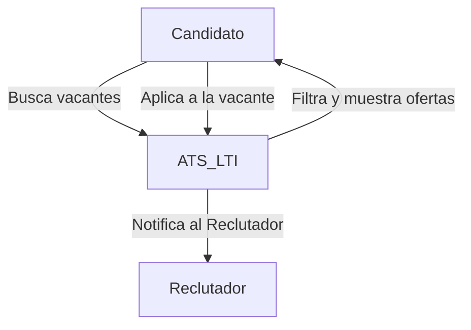
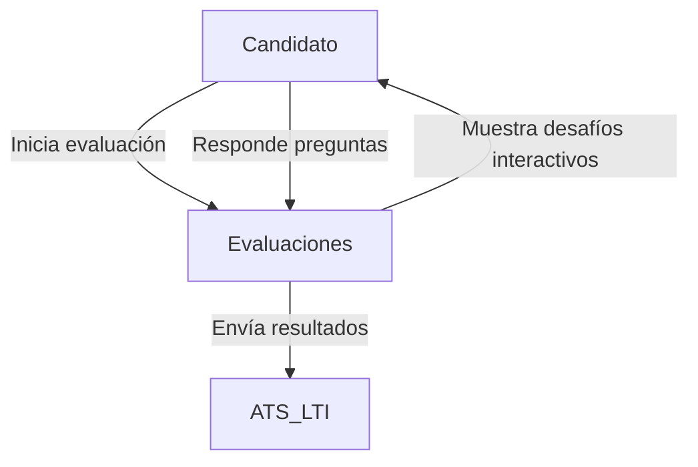
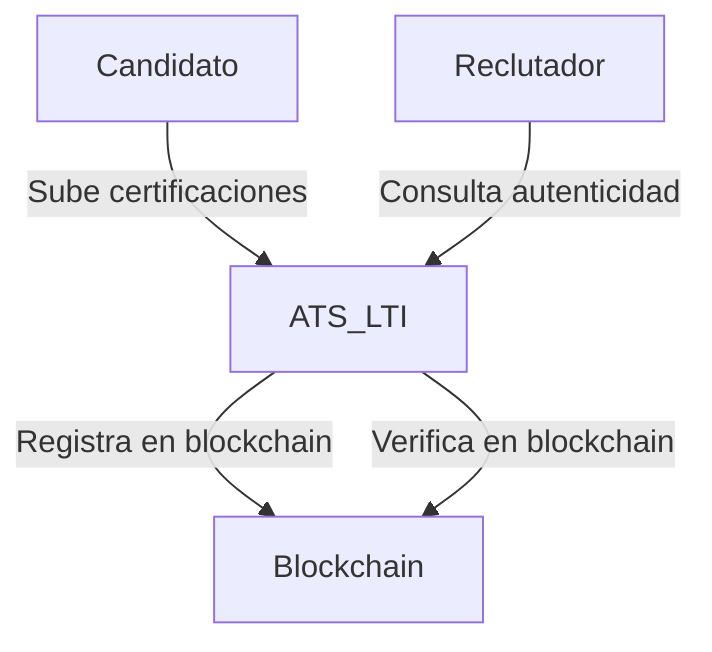
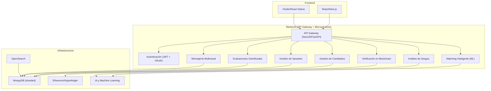

# 📌 ATS LTI - Documentación Técnica

## 1️⃣ Descripción y Propuesta de Valor

**LTI** es un **Sistema de Seguimiento de Candidatos (ATS)** que integra tecnologías avanzadas como **gamificación en evaluaciones, verificación de credenciales con blockchain y matching inteligente con IA**.  
A diferencia de otros ATS, **LTI no solo administra procesos de reclutamiento**, sino que también **mejora la precisión en la selección, optimiza la experiencia del candidato y reduce sesgos**.

### 🚀 **Valor Añadido y Ventajas Competitivas**

✅ **Matching Inteligente** con IA explicable y NLP para una selección más precisa.  
✅ **Evaluaciones Gamificadas**, haciendo el proceso más interactivo y atractivo.  
✅ **Verificación con Blockchain**, asegurando autenticidad en credenciales y experiencia.  
✅ **Automatización con IA**, reduciendo tiempos en el filtrado de candidatos.  
✅ **Escalabilidad y Microservicios**, asegurando alto rendimiento.  

---

## 2️⃣ Lean Canvas

📌 **Lean Canvas en Canvanizer:**  
🔗 [Ver diagrama en Canvanizer](https://next.canvanizer.com/canvas/ruWKRRzlv8MEV)

---

## 3️⃣ Funciones Principales

### 🏆 **1. Matching Inteligente**  
Utiliza IA y NLP para analizar descripciones de empleo y currículums, encontrando los candidatos con mejor ajuste.  

### 🎮 **2. Evaluaciones Gamificadas**  
Pruebas interactivas que miden habilidades técnicas y blandas, mejorando la experiencia del candidato.  

### 🔐 **3. Verificación con Blockchain**  
Asegura autenticidad en certificaciones y experiencia laboral, reduciendo fraudes en CVs.  

---

## 4️⃣ Casos de Uso

### 4.1 Caso de Uso: Aplicación a una Vacante

📌 **Descripción:** Un candidato navega por las ofertas publicadas y decide aplicar a una vacante.  
📌 **Actores Involucrados:** Candidato, ATS LTI, Reclutador.  



📌 **Flujo del Caso de Uso:**  
1️⃣ El candidato accede a la plataforma de LTI.  
2️⃣ Busca vacantes disponibles usando filtros de búsqueda avanzados.  
3️⃣ Selecciona una vacante de interés y revisa los detalles.  
4️⃣ Aplica a la vacante enviando su CV y datos adicionales.  
5️⃣ El ATS LTI registra la aplicación y notifica al reclutador.  
6️⃣ El reclutador revisa la aplicación y decide si avanza al siguiente paso.  

---

### 4.2 Caso de Uso: Evaluación Gamificada

📌 **Descripción:** Un candidato completa una evaluación interactiva para demostrar sus habilidades.  
📌 **Actores Involucrados:** Candidato, ATS LTI, Motor de Evaluaciones.  



📌 **Flujo del Caso de Uso:**  
1️⃣ El candidato recibe una invitación para completar una evaluación gamificada.  
2️⃣ Accede a la plataforma de evaluaciones dentro de LTI.  
3️⃣ Se presentan desafíos interactivos basados en habilidades técnicas y blandas.  
4️⃣ El candidato completa las pruebas y envía sus respuestas.  
5️⃣ El motor de evaluaciones procesa los resultados y los envía al ATS LTI.  
6️⃣ El reclutador recibe un informe detallado con los resultados del candidato.  

---

### 4.3 Caso de Uso: Verificación de Credenciales con Blockchain

📌 **Descripción:** LTI valida la autenticidad de certificaciones y experiencia laboral mediante blockchain.  
📌 **Actores Involucrados:** Candidato, ATS LTI, Red Blockchain.  



📌 **Flujo del Caso de Uso:**  
1️⃣ El candidato sube sus certificaciones y experiencia laboral.  
2️⃣ LTI valida la autenticidad y registra la información en la blockchain.  
3️⃣ Un reclutador revisa el perfil del candidato y verifica sus credenciales.  
4️⃣ LTI consulta la blockchain para confirmar la autenticidad de los documentos.  
5️⃣ El reclutador recibe un informe con el estado de verificación de credenciales.  

---

## 5️⃣ Modelo de Datos (ERD)

```mermaid
erDiagram
    CANDIDATES {
        int id PK
        varchar name
        varchar email UNIQUE
        varchar phone
        text resume
        timestamp created_at
    }

    JOBS {
        int id PK
        varchar title
        text description
        varchar location
        enum job_type ["Full-time", "Part-time", "Freelance"]
        timestamp created_at
    }

    APPLICATIONS {
        int id PK
        int candidate_id FK
        int job_id FK
        enum status ["Pending", "Accepted", "Rejected"]
        timestamp applied_at
    }

    EVALUATIONS {
        int id PK
        int candidate_id FK
        int job_id FK
        varchar type
        float score
        timestamp completed_at
    }

    CREDENTIALS {
        int id PK
        int candidate_id FK
        varchar institution
        varchar certification
        date issued_date
        varchar blockchain_hash UNIQUE
    }

    RECRUITERS {
        int id PK
        varchar name
        varchar email UNIQUE
        varchar company
        timestamp created_at
    }

    RECRUITER_JOBS {
        int id PK
        int recruiter_id FK
        int job_id FK
    }

    BIAS_ANALYSIS {
        int id PK
        int job_id FK
        float bias_score
        text recommendations
        timestamp analyzed_at
    }

    CANDIDATES ||--o{ APPLICATIONS : applies
    JOBS ||--o{ APPLICATIONS : receives
    CANDIDATES ||--o{ EVALUATIONS : takes
    JOBS ||--o{ EVALUATIONS : requires
    CANDIDATES ||--o{ CREDENTIALS : owns
    CREDENTIALS ||--o{ APPLICATIONS : validates
    RECRUITERS ||--o{ RECRUITER_JOBS : manages
    JOBS ||--o{ RECRUITER_JOBS : listed_by
    JOBS ||--o{ BIAS_ANALYSIS : analyzed_for
```

---

## 6️⃣ Diseño del Sistema

### 6.1 Visión de Alto Nivel



---

## 7️⃣ Descripción del Módulo de Matching Inteligente

### 🚀 **Objetivo**  
Utilizar IA y NLP para analizar y emparejar candidatos con vacantes de forma precisa y sin sesgos.  

### ⚙ **Funcionamiento**  

✅ **Preprocesamiento:** Limpieza y análisis semántico de CVs y ofertas de trabajo.  
✅ **Análisis NLP:** Identificación de habilidades clave y experiencia relevante.  
✅ **Modelo de IA:** Algoritmo de aprendizaje profundo para emparejamiento óptimo.  
✅ **Explicabilidad:** Transparencia en la puntuación de candidatos.  

---

## 8️⃣ Diagrama C4 - Matching Inteligente

```mermaid
C4Context
    Person(Candidato, "Candidato")
    Person(Reclutador, "Reclutador")
    
    System_Boundary(LTI, "ATS LTI") {
        Container(MatchingService, "Matching Inteligente", "ML + NLP")
        Container(DB, "MongoDB", "Base de Datos")
        Container(MLModels, "IA", "TensorFlow")
    }
    
    Candidato --> LTI
    Reclutador --> LTI
    MatchingService --> DB
    MatchingService --> MLModels
```

Voy a profundizar en el Módulo de Matching Inteligente, ya que es un diferenciador clave de LTI y usa machine learning (ML) para recomendar candidatos basándose en habilidades, experiencia y compatibilidad cultural.

⸻

🔍 1. Explicación del Módulo de Matching Inteligente

Este módulo utiliza procesamiento de lenguaje natural (NLP), modelos de machine learning y reglas de negocio para analizar candidatos y encontrar las mejores coincidencias para cada vacante.

🔹 Flujo de trabajo
	1.	Ingreso de datos:
	•	El sistema extrae información de los perfiles de candidatos, incluyendo currículum, experiencia, educación, habilidades y certificaciones.
	•	Se usa NLP para analizar texto no estructurado (descripciones de CV y ofertas de trabajo).
	2.	Procesamiento y enriquecimiento:
	•	Se normalizan habilidades con ontologías de competencias (ejemplo: un perfil con “Java” también podría incluir “Spring Boot”).
	•	Se calculan puntajes de similitud con técnicas como TF-IDF, Word Embeddings y modelos tipo BERT.
	•	Se tienen en cuenta datos de evaluaciones gamificadas.
	3.	Cálculo del Match Score:
	•	Se aplica un modelo de ML basado en Redes Neuronales o Random Forest, que asigna un puntaje de compatibilidad basado en:
	•	Similitud de habilidades (Hard Skills y Soft Skills)
	•	Resultados en evaluaciones
	•	Historial de experiencias pasadas (empleos previos, industrias similares)
	•	Factores culturales (analizados mediante encuestas y NLP)
	4.	Presentación de recomendaciones:
	•	El sistema ordena a los candidatos según el Match Score y presenta los mejores perfiles a los reclutadores.
	•	También da explicaciones sobre por qué un candidato es recomendado (para evitar “caja negra” en la IA).

⸻

📌 2. Diagrama de Arquitectura Tipo C4 (Módulo de Matching Inteligente)

Nivel 1 - Contexto

Muestra cómo el Módulo de Matching Inteligente se relaciona con otros componentes del sistema.

C4Context
    title "Módulo de Matching Inteligente - Nivel Contexto"

    Person(Candidato, "Candidato", "Usuario que aplica a vacantes en LTI")
    Person(Reclutador, "Reclutador", "Usuario que publica vacantes y busca talento")
    
    System_Boundary(LTI, "ATS LTI") {
        Container(MatchingService, "Matching Inteligente", "ML + NLP", "Calcula la mejor coincidencia entre candidatos y vacantes")
        Container(DB, "Base de Datos (MongoDB)", "Almacena perfiles de candidatos y vacantes")
        Container(MLModels, "Modelos de IA", "TensorFlow/PyTorch", "Ejecuta el modelo de matching y ajusta puntuaciones")
    }
    
    Candidato --> LTI : Aplica a una vacante
    Reclutador --> LTI : Revisa candidatos recomendados
    MatchingService --> DB : Consulta información de candidatos y vacantes
    MatchingService --> MLModels : Ejecuta modelo de IA para calcular Match Score


⸻

Nivel 2 - Contenedores

Muestra los componentes internos que forman el Módulo de Matching Inteligente y su interacción con el backend.

C4Container
    title "Módulo de Matching Inteligente - Nivel Contenedor"

    Container(MatchingService, "Matching Inteligente", "FastAPI / NestJS", "Orquestador de la lógica de matching")
    ContainerDB(DB, "MongoDB", "Base de datos", "Almacena perfiles, vacantes y resultados de evaluaciones")
    Container(FeatureEngineering, "Feature Engineering", "Python", "Extrae y transforma datos para ML")
    Container(MLModel, "Modelo de Matching", "TensorFlow/PyTorch", "Modelo de ML que calcula la compatibilidad candidato-vacante")
    Container(Explainability, "Módulo de Explicabilidad", "SHAP/LIME", "Explica por qué un candidato es recomendado")

    MatchingService --> DB : Obtiene datos de candidatos y vacantes
    MatchingService --> FeatureEngineering : Extrae características relevantes
    FeatureEngineering --> MLModel : Procesa datos y ejecuta el modelo de ML
    MLModel --> Explainability : Genera explicaciones de las recomendaciones
    MatchingService --> Explainability : Devuelve razones del matching al reclutador


⸻

Nivel 3 - Componentes

Muestra los módulos internos del Matching Service y cómo interactúan entre sí.

C4Component
    title "Módulo de Matching Inteligente - Nivel Componente"

    Component(MatchingAPI, "API de Matching", "FastAPI", "Expone endpoints para buscar candidatos ideales")
    Component(NLPProcessor, "Procesador NLP", "spaCy / BERT", "Analiza texto de CVs y vacantes")
    Component(FeatureExtractor, "Extracción de Features", "Python", "Convierte datos en características para ML")
    Component(MLScoring, "Modelo de Matching", "TensorFlow", "Calcula el puntaje de compatibilidad")
    Component(Explainability, "Explicabilidad de IA", "SHAP/LIME", "Genera explicaciones sobre los resultados del modelo")

    MatchingAPI --> NLPProcessor : Analiza texto de vacantes y CVs
    NLPProcessor --> FeatureExtractor : Extrae habilidades y experiencia relevante
    FeatureExtractor --> MLScoring : Procesa datos para predicción
    MLScoring --> Explainability : Explica los resultados de compatibilidad
    MatchingAPI --> MLScoring : Devuelve la lista de candidatos recomendados


⸻

🚀 3. Beneficios del Diseño

✅ Alta precisión: Usa ML avanzado y NLP para entender mejor los perfiles.
✅ Explicabilidad: No es una “caja negra”; los reclutadores pueden entender las recomendaciones.
✅ Escalabilidad: Se basa en microservicios y modelos de IA que pueden entrenarse con más datos.
✅ Reducción de sesgos: Ajustes de fairness en ML para mejorar diversidad en la selección.

⸻

Este módulo es una de las piezas más innovadoras del ATS LTI, ya que permite seleccionar talento de manera más precisa e inteligente.

📌 ¿Quieres que refine algún detalle o agregue más profundidad en alguna parte?

---

## 9️⃣ Beneficios del Diseño

✅ **Alta precisión con IA y NLP**  
✅ **Explicabilidad del matching**  
✅ **Escalabilidad con microservicios**  
✅ **Reducción de sesgos en la selección**  

---

📌 **Fin de la documentación.**  