# 📌 ATS LTI - Documentación Técnica

## 1️⃣ Descripción y Propuesta de Valor

**LTI** es un **Sistema de Seguimiento de Candidatos (ATS)** que integra tecnologías avanzadas como **gamificación en evaluaciones, verificación de credenciales con blockchain y matching inteligente con IA**.  
A diferencia de otros ATS, **LTI no solo administra procesos de reclutamiento**, sino que también **mejora la precisión en la selección, optimiza la experiencia del candidato y reduce sesgos**.

### 🚀 **Valor Añadido y Ventajas Competitivas**

✅ **Matching Inteligente** con IA explicable y NLP para una selección más precisa.  
✅ **Evaluaciones Gamificadas**, haciendo el proceso más interactivo y atractivo.  
✅ **Verificación con Blockchain**, asegurando autenticidad en credenciales y experiencia.  
✅ **Automatización con IA**, reduciendo tiempos en el filtrado de candidatos.  
✅ **Escalabilidad y Microservicios**, asegurando alto rendimiento.  

---

## 2️⃣ Lean Canvas
Lean Canvas – LTI

1. Problema
	•	Sesgos inconscientes en el reclutamiento que afectan la diversidad.
	•	Dificultad para validar credenciales de los candidatos.
	•	Métodos tradicionales de evaluación poco dinámicos y precisos.

2. Segmento de Clientes
	•	Empresas de tecnología y startups en crecimiento.
	•	Corporaciones con políticas de diversidad e inclusión.
	•	Agencias de reclutamiento que buscan procesos más eficientes.

3. Propuesta de Valor
	•	Evaluaciones gamificadas que mejoran la precisión y engagement.
	•	Verificación automática y confiable de credenciales con blockchain.
	•	AI para eliminar sesgos y optimizar el proceso de selección.

4. Solución
	•	Plataforma con pruebas interactivas y personalizadas.
	•	Integración con redes blockchain para autenticación de credenciales.
	•	Herramientas de análisis que detectan y corrigen sesgos en reclutamiento.

5. Canales
	•	Sitio web y marketing de contenido.
	•	Asociaciones con empresas de recursos humanos.
	•	Integración con LinkedIn y plataformas de empleo.

6. Fuentes de Ingreso
	•	Suscripción mensual para empresas.
	•	Modelo “pago por uso” en validación de credenciales.
	•	Venta de módulos premium (evaluaciones avanzadas, reportes personalizados).

7. Métricas Clave
	•	Tiempo promedio de contratación reducido.
	•	% de sesgos detectados y corregidos en procesos de selección.
	•	Cantidad de credenciales verificadas con blockchain.

8. Ventaja Competitiva
	•	Integración única de gamificación, blockchain e IA en un solo ATS.
	•	Capacidad de personalización y adaptabilidad a múltiples industrias.
	•	Data-driven insights para mejorar continuamente la selección de talento.

📌 **Lean Canvas en Canvanizer:**  
🔗 [Ver diagrama en Canvanizer](https://next.canvanizer.com/canvas/ruWKRRzlv8MEV)

---

## 3️⃣ Funciones Principales

### 🏆 **1. Matching Inteligente**  
Utiliza IA y NLP para analizar descripciones de empleo y currículums, encontrando los candidatos con mejor ajuste.  

### 🎮 **2. Evaluaciones Gamificadas**  
Pruebas interactivas que miden habilidades técnicas y blandas, mejorando la experiencia del candidato.  

### 🔐 **3. Verificación con Blockchain**  
Asegura autenticidad en certificaciones y experiencia laboral, reduciendo fraudes en CVs.  

---

## 4️⃣ Casos de Uso

### 4.1 Caso de Uso: Aplicación a una Vacante

📌 **Descripción:** Un candidato navega por las ofertas publicadas y decide aplicar a una vacante.  
📌 **Actores Involucrados:** Candidato, ATS LTI, Reclutador.  


📌 **Flujo del Caso de Uso:**  
1️⃣ El candidato accede a la plataforma de LTI.  
2️⃣ Busca vacantes disponibles usando filtros de búsqueda avanzados.  
3️⃣ Selecciona una vacante de interés y revisa los detalles.  
4️⃣ Aplica a la vacante enviando su CV y datos adicionales.  
5️⃣ El ATS LTI registra la aplicación y notifica al reclutador.  
6️⃣ El reclutador revisa la aplicación y decide si avanza al siguiente paso.  

---

### 4.2 Caso de Uso: Evaluación Gamificada

📌 **Descripción:** Un candidato completa una evaluación interactiva para demostrar sus habilidades.  
📌 **Actores Involucrados:** Candidato, ATS LTI, Motor de Evaluaciones.  


📌 **Flujo del Caso de Uso:**  
1️⃣ El candidato recibe una invitación para completar una evaluación gamificada.  
2️⃣ Accede a la plataforma de evaluaciones dentro de LTI.  
3️⃣ Se presentan desafíos interactivos basados en habilidades técnicas y blandas.  
4️⃣ El candidato completa las pruebas y envía sus respuestas.  
5️⃣ El motor de evaluaciones procesa los resultados y los envía al ATS LTI.  
6️⃣ El reclutador recibe un informe detallado con los resultados del candidato.  

---

### 4.3 Caso de Uso: Verificación de Credenciales con Blockchain

📌 **Descripción:** LTI valida la autenticidad de certificaciones y experiencia laboral mediante blockchain.  
📌 **Actores Involucrados:** Candidato, ATS LTI, Red Blockchain.  


📌 **Flujo del Caso de Uso:**  
1️⃣ El candidato sube sus certificaciones y experiencia laboral.  
2️⃣ LTI valida la autenticidad y registra la información en la blockchain.  
3️⃣ Un reclutador revisa el perfil del candidato y verifica sus credenciales.  
4️⃣ LTI consulta la blockchain para confirmar la autenticidad de los documentos.  
5️⃣ El reclutador recibe un informe con el estado de verificación de credenciales.  

---

## 5️⃣ Modelo de Datos (ERD)

```mermaid
erDiagram
    CANDIDATES {
        int id PK
        varchar name
        varchar email UNIQUE
        varchar phone
        text resume
        timestamp created_at
    }

    JOBS {
        int id PK
        varchar title
        text description
        varchar location
        enum job_type ["Full-time", "Part-time", "Freelance"]
        timestamp created_at
    }

    APPLICATIONS {
        int id PK
        int candidate_id FK
        int job_id FK
        enum status ["Pending", "Accepted", "Rejected"]
        timestamp applied_at
    }

    EVALUATIONS {
        int id PK
        int candidate_id FK
        int job_id FK
        varchar type
        float score
        timestamp completed_at
    }

    CREDENTIALS {
        int id PK
        int candidate_id FK
        varchar institution
        varchar certification
        date issued_date
        varchar blockchain_hash UNIQUE
    }

    RECRUITERS {
        int id PK
        varchar name
        varchar email UNIQUE
        varchar company
        timestamp created_at
    }

    RECRUITER_JOBS {
        int id PK
        int recruiter_id FK
        int job_id FK
    }

    BIAS_ANALYSIS {
        int id PK
        int job_id FK
        float bias_score
        text recommendations
        timestamp analyzed_at
    }

    CANDIDATES ||--o{ APPLICATIONS : applies
    JOBS ||--o{ APPLICATIONS : receives
    CANDIDATES ||--o{ EVALUATIONS : takes
    JOBS ||--o{ EVALUATIONS : requires
    CANDIDATES ||--o{ CREDENTIALS : owns
    CREDENTIALS ||--o{ APPLICATIONS : validates
    RECRUITERS ||--o{ RECRUITER_JOBS : manages
    JOBS ||--o{ RECRUITER_JOBS : listed_by
    JOBS ||--o{ BIAS_ANALYSIS : analyzed_for
```
Explicación del modelo
	1.	CANDIDATES: Contiene los datos de los candidatos, incluyendo su información personal y su currículum.
	2.	JOBS: Representa las vacantes publicadas, incluyendo el título, descripción, tipo de empleo y ubicación.
	3.	APPLICATIONS: Registra las solicitudes de los candidatos a diferentes vacantes y su estado en el proceso de selección.
	4.	EVALUATIONS: Contiene los resultados de las pruebas gamificadas realizadas por los candidatos.
	5.	CREDENTIALS: Almacena las certificaciones y títulos verificados con blockchain, vinculados a los candidatos.
	6.	RECRUITERS: Guarda la información de los reclutadores que administran las vacantes.
	7.	RECRUITER_JOBS: Relación entre reclutadores y las vacantes que gestionan.
	8.	BIAS_ANALYSIS: Almacena el puntaje de sesgo detectado en una oferta de trabajo y las recomendaciones para mejorar la inclusión.

---

## 6️⃣ Diseño del Sistema

### 6.1 Visión de Alto Nivel

```mermaid
graph TD;
    subgraph "Frontend"
        WebApp["React/Next.js"]
        MobileApp["Flutter/React Native"]
    end

    subgraph "Backend (API Gateway + Microservicios)"
        API["API Gateway (NestJS/FastAPI)"]
        AuthService["Autenticación (JWT + OAuth)"]
        CandidatesService["Gestión de Candidatos"]
        JobsService["Gestión de Vacantes"]
        EvaluationService["Evaluaciones Gamificadas"]
        MatchingService["Matching Inteligente (ML)"]
        CommunicationService["Mensajería Multicanal"]
        BiasAnalysisService["Análisis de Sesgos"]
        BlockchainService["Verificación en Blockchain"]
    end

    subgraph "Infraestructura"
        DB["MongoDB (sharded)"]
        Search["OpenSearch"]
        Blockchain["Ethereum/Hyperledger"]
        MLModels["IA y Machine Learning"]
    end

    WebApp --> API
    MobileApp --> API
    API --> AuthService
    API --> CandidatesService
    API --> JobsService
    API --> EvaluationService
    API --> MatchingService
    API --> CommunicationService
    API --> BiasAnalysisService
    API --> BlockchainService

    CandidatesService --> DB
    JobsService --> DB
    EvaluationService --> DB
    CommunicationService --> DB
    BlockchainService --> Blockchain
    MatchingService --> MLModels
    BiasAnalysisService --> MLModels
    Search --> DB
```

LTI es un Sistema de Seguimiento de Candidatos (ATS) diseñado para mejorar la selección de talento con tecnologías avanzadas como gamificación, blockchain e inteligencia artificial. Su arquitectura se basa en una estructura modular y escalable, permitiendo integraciones flexibles con otros sistemas de recursos humanos y gestión de talento.

⸻

1. Arquitectura General

LTI sigue una arquitectura basada en microservicios para garantizar escalabilidad, resiliencia y facilidad de mantenimiento.

1.1 Componentes Clave
	•	Frontend: Aplicación web y móvil basada en React/Next.js, optimizada para reclutadores y candidatos.
	•	Backend: API basada en Node.js con NestJS o Python con FastAPI, diseñada para manejar autenticación, flujos de candidatos y procesos de evaluación.
	•	Base de Datos: MongoDB (sharded en DigitalOcean) para manejar la alta cantidad de datos no estructurados de candidatos y evaluaciones.
	•	Motor de Búsqueda: OpenSearch para consultas rápidas de candidatos y ofertas de empleo.
	•	Blockchain: Validación de credenciales con Ethereum (smart contracts) o un servicio como Hyperledger.
	•	IA & Análisis de Sesgos: Modelos de ML en Python/TensorFlow para mejorar las recomendaciones y reducir sesgos en el reclutamiento.

⸻

2. Módulos Principales

2.1 Módulo de Gestión de Candidatos

Permite a los candidatos registrarse, cargar su CV y aplicar a ofertas de empleo. También incluye el sistema de verificación de credenciales con blockchain.

2.2 Módulo de Publicación de Vacantes

Permite a los reclutadores crear y administrar vacantes, con análisis de sesgos basado en IA para mejorar la inclusión.

2.3 Módulo de Evaluaciones Gamificadas

Sistema de pruebas dinámicas basado en escenarios interactivos y juegos que evalúan habilidades técnicas y blandas.

2.4 Módulo de Matching Inteligente

Un motor de recomendación basado en ML que sugiere los mejores candidatos para una vacante en función de habilidades, experiencia y compatibilidad cultural.

2.5 Módulo de Comunicación y Automatización

Incluye mensajería multicanal (WhatsApp, email, SMS) para agilizar la comunicación con candidatos y automatizar notificaciones de estado.



---

## 7️⃣ Descripción del Módulo de Matching Inteligente

### 🚀 **Objetivo**  
Utilizar IA y NLP para analizar y emparejar candidatos con vacantes de forma precisa y sin sesgos.  

### ⚙ **Funcionamiento**  

✅ **Preprocesamiento:** Limpieza y análisis semántico de CVs y ofertas de trabajo.  
✅ **Análisis NLP:** Identificación de habilidades clave y experiencia relevante.  
✅ **Modelo de IA:** Algoritmo de aprendizaje profundo para emparejamiento óptimo.  
✅ **Explicabilidad:** Transparencia en la puntuación de candidatos.  

---

## 8️⃣ Diagrama C4 - Matching Inteligente

Nivel 1 - Contexto

Muestra cómo el Módulo de Matching Inteligente se relaciona con otros componentes del sistema.
```mermaid
C4Context
    title "Módulo de Matching Inteligente - Nivel Contexto"

    Person(Candidato, "Candidato", "Usuario que aplica a vacantes en LTI")
    Person(Reclutador, "Reclutador", "Usuario que publica vacantes y busca talento")
    
    System_Boundary(LTI, "ATS LTI") {
        Container(MatchingService, "Matching Inteligente", "ML + NLP", "Calcula la mejor coincidencia entre candidatos y vacantes")
        Container(DB, "Base de Datos (MongoDB)", "Almacena perfiles de candidatos y vacantes")
        Container(MLModels, "Modelos de IA", "TensorFlow/PyTorch", "Ejecuta el modelo de matching y ajusta puntuaciones")
    }
    
    Candidato --> LTI : Aplica a una vacante
    Reclutador --> LTI : Revisa candidatos recomendados
    MatchingService --> DB : Consulta información de candidatos y vacantes
    MatchingService --> MLModels : Ejecuta modelo de IA para calcular Match Score
```

Nivel 2 - Contenedores

Muestra los componentes internos que forman el Módulo de Matching Inteligente y su interacción con el backend.
```mermaid
C4Container
    title "Módulo de Matching Inteligente - Nivel Contenedor"

    Container(MatchingService, "Matching Inteligente", "FastAPI / NestJS", "Orquestador de la lógica de matching")
    ContainerDB(DB, "MongoDB", "Base de datos", "Almacena perfiles, vacantes y resultados de evaluaciones")
    Container(FeatureEngineering, "Feature Engineering", "Python", "Extrae y transforma datos para ML")
    Container(MLModel, "Modelo de Matching", "TensorFlow/PyTorch", "Modelo de ML que calcula la compatibilidad candidato-vacante")
    Container(Explainability, "Módulo de Explicabilidad", "SHAP/LIME", "Explica por qué un candidato es recomendado")

    MatchingService --> DB : Obtiene datos de candidatos y vacantes
    MatchingService --> FeatureEngineering : Extrae características relevantes
    FeatureEngineering --> MLModel : Procesa datos y ejecuta el modelo de ML
    MLModel --> Explainability : Genera explicaciones de las recomendaciones
    MatchingService --> Explainability : Devuelve razones del matching al reclutador
```
Nivel 3 - Componentes

Muestra los módulos internos del Matching Service y cómo interactúan entre sí.
```mermaid
C4Component
    title "Módulo de Matching Inteligente - Nivel Componente"

    Component(MatchingAPI, "API de Matching", "FastAPI", "Expone endpoints para buscar candidatos ideales")
    Component(NLPProcessor, "Procesador NLP", "spaCy / BERT", "Analiza texto de CVs y vacantes")
    Component(FeatureExtractor, "Extracción de Features", "Python", "Convierte datos en características para ML")
    Component(MLScoring, "Modelo de Matching", "TensorFlow", "Calcula el puntaje de compatibilidad")
    Component(Explainability, "Explicabilidad de IA", "SHAP/LIME", "Genera explicaciones sobre los resultados del modelo")

    MatchingAPI --> NLPProcessor : Analiza texto de vacantes y CVs
    NLPProcessor --> FeatureExtractor : Extrae habilidades y experiencia relevante
    FeatureExtractor --> MLScoring : Procesa datos para predicción
    MLScoring --> Explainability : Explica los resultados de compatibilidad
    MatchingAPI --> MLScoring : Devuelve la lista de candidatos recomendados
```

---

## 9️⃣ Beneficios del Diseño

✅ **Alta precisión con IA y NLP**  
✅ **Explicabilidad del matching**  
✅ **Escalabilidad con microservicios**  
✅ **Reducción de sesgos en la selección**  

---

📌 **Fin de la documentación.**  