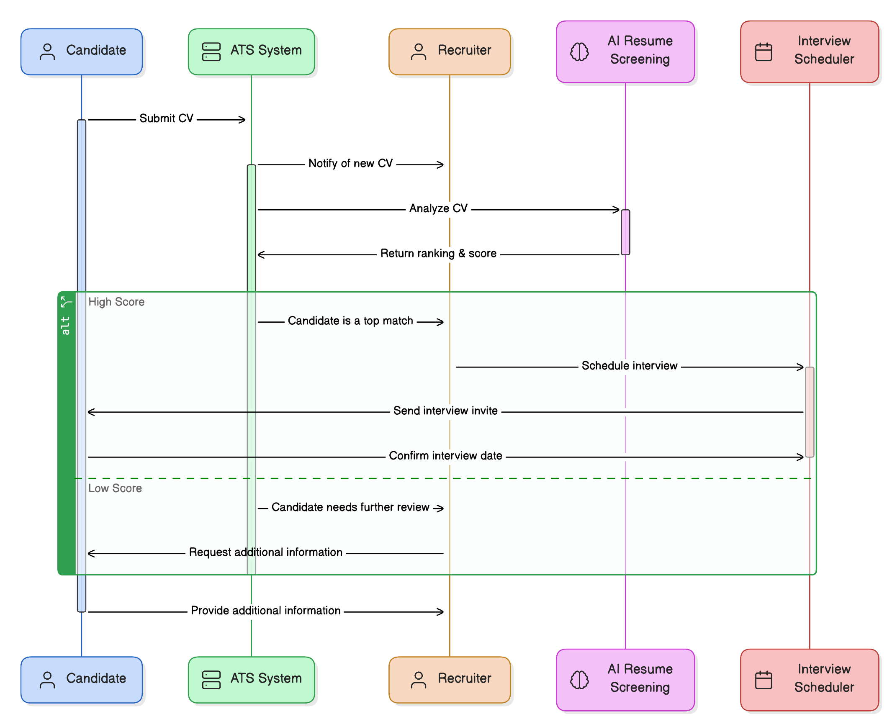
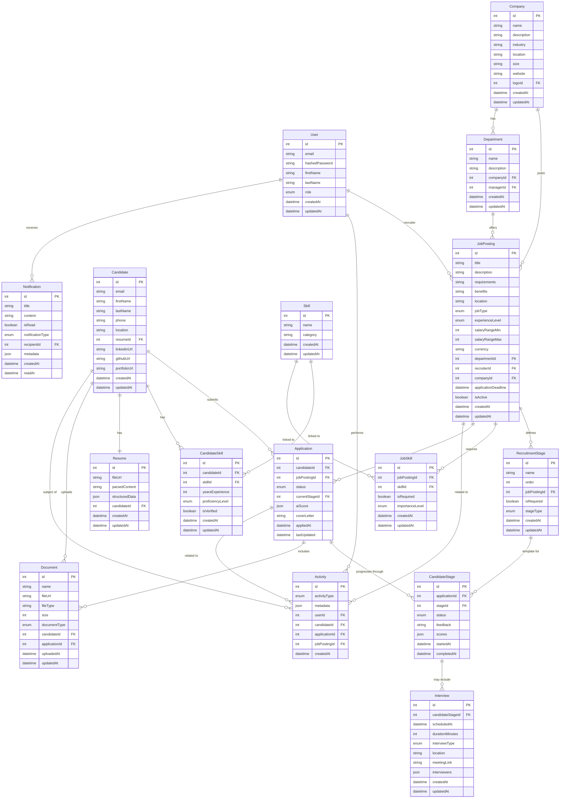
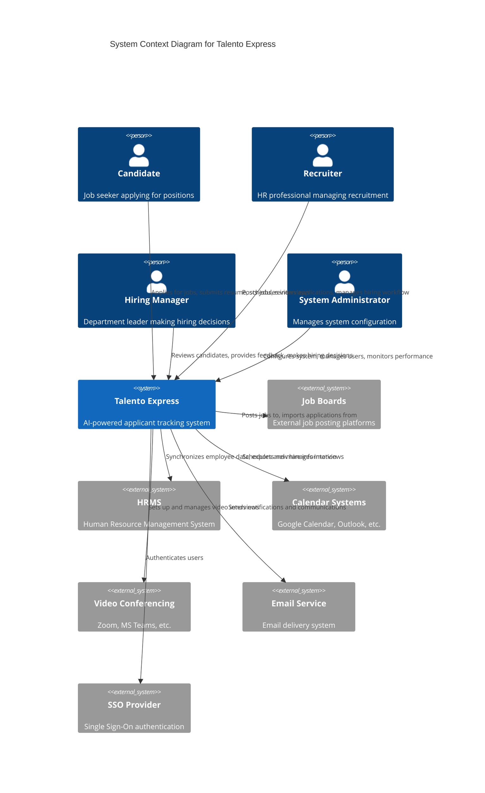
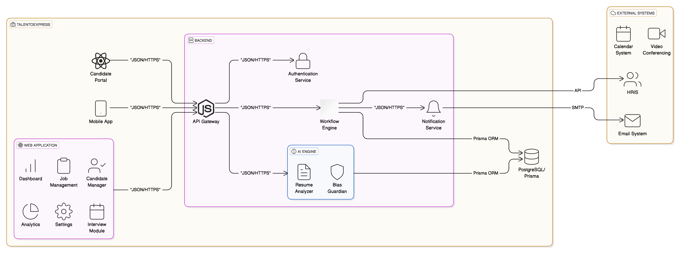

# 🚀 Talento Express: Next-Generation Applicant Tracking System

_Revolutionizing recruitment through AI-powered talent acquisition_

## Table of Contents

- [🚀 1. Introduction](#1-introduction)
- [🔍 2. Market Analysis](#2-market-analysis)
- [🚧 3. Solution Overview](#3-solution-overview)
- [🔍 4. Data Model](#4-data-model)
- [🚀 5. Lean Canvas Business Model](#5-lean-canvas-business-model)
- [🚧 6. Architecture](#6-architecture)
- [🚀 7. Competitive Analysis](#7-competitive-analysis)
- [🚨 8. Risk Assessment](#8-risk-assessment)
- [🚀 9. Market Entry Strategy](#9-market-entry-strategy)
- [🚧 10. Development Roadmap](#10-development-roadmap)
- [💰 11. Cost Estimation](#11-cost-estimation)
- [🚀 12. KPI Framework](#12-kpi-framework)
- [🚧 13. Cloud Infrastructure](#13-cloud-infrastructure)
- [🚧 14. Technical Implementation](#14-technical-implementation)
- [🚧 15. Workflow Diagrams](#15-workflow-diagrams)
- [🚀 16. Conclusion](#16-conclusion)

## 1. Introduction

Talento Express is a cutting-edge Applicant Tracking System (ATS) designed to transform how organizations attract, evaluate, and hire talent. Built with a strong emphasis on artificial intelligence and human collaboration, Talento Express streamlines the entire recruitment process from job posting to onboarding.

### 1.1 Vision

Talento Express aims to be the market-leading ATS for modern enterprises, balancing powerful AI capabilities with essential human judgment to create more efficient, fair, and effective hiring processes.

### ✨ 1.2 Key Differentiators

- 🤖 **AI-First Approach**: Deep integration of AI throughout the recruitment workflow
- 👥 **Human-in-the-Loop Design**: AI augments human decision-making rather than replacing it
- 🔄 **Unified Experience**: Seamless platform for all stakeholders (candidates, recruiters, hiring managers)
- 📊 **Data-Driven Insights**: Actionable analytics to continuously improve hiring outcomes
- 🚀 **Enterprise-Grade Scalability**: Architecture designed to support organizations of all sizes

## 2. Market Analysis

The global recruitment software market faces several critical challenges that impact efficiency and effectiveness:

### 🔎 2.1 Current Market Problems

- 📚 **Information Overload**: Recruiters struggle to process high volumes of applications efficiently
- 🎯 **Poor Candidate Quality Matching**: Difficulty identifying truly qualified candidates among applicants
- ⏱️ **Manual Process Inefficiency**: Excessive time spent on administrative tasks rather than strategic hiring
- 💬 **Communication Gaps**: Slow feedback loops between recruiters, hiring managers, and candidates
- 📉 **Lack of Data-Driven Decisions**: Reliance on intuition rather than analytics for hiring decisions
- ⚖️ **Bias in Selection**: Unconscious prejudices affecting candidate evaluation and selection
- 🔌 **Integration Challenges**: Disconnected systems creating information silos and redundant work

### 2.2 Market Size and Growth

The global applicant tracking system market was valued at $2.35 billion in 2021 and is projected to reach $3.97 billion by 2027, with a CAGR of 6.7% during the forecast period. The growth is primarily driven by:

- Digital transformation initiatives across industries
- Increasing adoption of cloud-based recruitment solutions
- Growing focus on improving candidate experience
- Rising need for analytics-driven recruitment decisions
- Expansion of remote work and global talent acquisition

## 3. Solution Overview

Talento Express addresses market challenges through an integrated platform powered by sophisticated AI capabilities and designed for seamless human collaboration.

### 3.1 Core Solution Components

1. **AI-Enhanced Screening and Matching**: Automated CV analysis and candidate ranking based on job requirements
2. **Structured Assessment Framework**: Standardized evaluation methods to ensure objective candidate assessment
3. **Intelligent Workflow Automation**: Streamlined processes for approvals, communications, and status updates
4. **Collaborative Decision Support**: Tools for recruiters and hiring managers to coordinate effectively
5. **Data-Driven Recruitment Analytics**: Insights into recruitment effectiveness, diversity metrics, and process optimization

### 3.2 Key System Roles

1. **Candidate** - Job seekers applying for positions
2. **Job Posting** - Open positions with requirements and descriptions
3. **Recruiter** - HR professionals managing the hiring process
4. **Interview** - Assessment sessions with candidates
5. **AI Agent Screening** - Automated initial CV evaluation
6. **AI Agent Resume** - AI system that analyzes and extracts CV data
7. **Application** - A candidate's submission for a specific job
8. **Notification** - Automated communications to candidates and recruiters
9. **Integration (External Systems)** - Connections to job boards, HRIS, etc.
10. **Analytics & Reporting** - Data insights on recruitment metrics

### 3.3 Core Functionalities

#### 3.3.1 End-to-End Candidate Management

- Automated CV collection from job portals, email, and API integrations
- Advanced CV parsing with automatic information extraction
- Centralized dashboard for candidate management
- Real-time tracking of application status updates

#### 3.3.2 AI-Powered Screening

- Smart matching between candidates and job postings
- Semantic CV analysis to identify relevant experience and skills
- Candidate ranking based on customizable criteria
- Automatic filtering of non-relevant applications

#### 3.3.3 Collaborative Hiring Workflow

- Automatic assignment of applications to recruiters
- Real-time comments and feedback on candidate profiles
- Automated status updates in the hiring pipeline (e.g., "Selected for Interview," "Offer Sent")
- Progress tracking dashboard for each open position

#### 3.3.4 Interview Process Automation

- Integration with calendars (Google, Outlook) for interview scheduling
- Automatic invitation and reminder emails for candidates
- Support for video interviews via Zoom/MS Teams integration
- Automatic generation of post-interview reports

#### 3.3.5 Predictive Analytics & Reporting

- Customizable reports on hiring performance, timelines, and candidate sources
- Predictive analysis to estimate a candidate's success probability
- Insights into conversion rates to optimize recruitment strategies

#### 3.3.6 Integration with External Systems

- Seamless connection with LinkedIn, Indeed, and other job boards
- Data export in Excel, PDF, and external databases
- Single Sign-On (SSO) authentication for enterprise access
- API connectivity for integrating ATS with internal HR systems

### 3.4 Human-in-the-Loop Approach

Talento Express leverages AI-powered recruitment processes while maintaining human oversight at critical decision points. This Human-in-the-Loop (HITL) approach ensures that AI-driven automation enhances efficiency without replacing human expertise.

#### 3.4.1 AI and Human Collaboration

| Process Stage              | AI Responsibilities                                                                                                         | Human Role                                                                                                                      |
| -------------------------- | --------------------------------------------------------------------------------------------------------------------------- | ------------------------------------------------------------------------------------------------------------------------------- |
| Resume Screening           | Extract information from CVs, analyze skills/experience match, rank applications based on job fit, flag potential concerns  | Review AI recommendations, override rankings when necessary, make final screening decisions, adjust matching criteria           |
| Candidate Matching         | Generate candidate shortlists, predict success probability, identify skill gaps, suggest interview questions                | Evaluate AI-generated matches, consider cultural fit factors, approve/reject recommendations, provide feedback to improve AI    |
| Interview Scheduling       | Optimize interview slots, manage calendar conflicts, suggest best times based on availability patterns                      | Confirm scheduling preferences, handle special scheduling needs, manage rescheduling requests, override automated suggestions   |
| Candidate Engagement       | Answer FAQs via chatbot, send automated updates, personalize communication templates, detect sentiment in responses         | Handle complex inquiries, provide personalized feedback, address concerns/complaints, build relationships with top candidates   |
| Predictive Hiring Insights | Forecast time-to-hire, predict candidate success probability, identify process bottlenecks, suggest optimization strategies | Interpret predictive insights, make final hiring decisions, balance data with intuition, provide context for unusual situations |

#### 3.4.2 AI Workflow Integration

The workflow illustrates how AI components work alongside human decision-makers. AI handles the data-intensive tasks of parsing, analyzing, and ranking, while humans provide oversight, make final decisions, and handle the interpersonal aspects of recruitment.

## 4. Data Model

The Talento Express data model captures all essential entities and relationships required for a comprehensive ATS.

This comprehensive data model captures the core entities of the ATS system and their relationships, including:

1. **User Management**: Users with different roles (admin, recruiter, hiring manager)
2. **Company Structure**: Companies, departments, and organizational hierarchy
3. **Job Management**: Job postings with requirements, skills, and stages
4. **Candidate Information**: Candidates, their resumes, skills, and documents
5. **Application Process**: Applications and their progression through recruitment stages
6. **Interview Management**: Interview scheduling, feedback, and scoring
7. **Activity Tracking**: System-wide activity logging for auditing and analytics
8. **Notification System**: User notifications for important events

The model supports advanced features like skill matching, multi-stage recruitment processes, and comprehensive analytics.

## 5. Lean Canvas Business Model

### 5.1 Lean Canvas Overview

| Problem                                                                                                                                                                                    | Solution                                                                                                                                            | Unique Value Proposition                                                                                                                          | Unfair Advantage                                                                                                                                                  | Customer Segments                                                                                                                                                                                                          |
| ------------------------------------------------------------------------------------------------------------------------------------------------------------------------------------------ | --------------------------------------------------------------------------------------------------------------------------------------------------- | ------------------------------------------------------------------------------------------------------------------------------------------------- | ----------------------------------------------------------------------------------------------------------------------------------------------------------------- | -------------------------------------------------------------------------------------------------------------------------------------------------------------------------------------------------------------------------- |
| • Information overload in recruitment • Inefficient screening processes • Bias in candidate selection • Poor collaboration between stakeholders • Lack of data-driven insights | • AI-powered CV screening and ranking • Human-in-the-loop oversight system • Collaborative workflow tools • Predictive analytics dashboard | **Talento Express combines AI efficiency with human judgment to transform recruitment from a time-consuming process into a strategic advantage.** | • Proprietary AI algorithms developed specifically for recruitment • Human-in-the-loop design expertise • Integration capabilities with existing HR systems | **Primary:** • Mid to large enterprises (500+ employees) • High-volume recruiters • Tech-forward companies  **Secondary:** • SMBs with growth plans • Staffing agencies • Educational institutions |

| Key Metrics                                                                                                                                                                     | Channels                                                                                                                                           | Cost Structure                                                                                                                                | Revenue Streams                                                                                                                                                                                                                                         |
| ------------------------------------------------------------------------------------------------------------------------------------------------------------------------------- | -------------------------------------------------------------------------------------------------------------------------------------------------- | --------------------------------------------------------------------------------------------------------------------------------------------- | ------------------------------------------------------------------------------------------------------------------------------------------------------------------------------------------------------------------------------------------------------- |
| • Monthly recurring revenue • Customer acquisition cost • User adoption rate • Time-to-hire reduction • Retention rate • NPS score • AI effectiveness metrics | • Direct sales team • Digital marketing • Strategic partnerships • Industry conferences • Partner referrals • Free trials and demos | • Product development (40%) • Sales and marketing (30%) • Infrastructure and operations (15%) • Customer success (10%) • G&A (5%) | **Primary:** • Subscription model (per seat/month) • Enterprise licensing  **Secondary:** • Implementation services • Premium support packages • Add-on modules (advanced analytics, integration connectors) • API access tiers |

### 5.2 Value Proposition Detail

Talento Express delivers exceptional value through:

1. **Time Efficiency**: Reduces time-to-hire by 40% through automated screening and workflow optimization
2. **Quality Improvement**: Enhances candidate quality by using AI to objectively identify the best matches
3. **Cost Reduction**: Lowers recruitment costs by streamlining processes and reducing manual effort
4. **Better Experience**: Creates a superior experience for both candidates and recruiters
5. **Data Intelligence**: Provides actionable insights to continuously improve recruitment strategies

## 6. Architecture

### 6.1 C4 Architecture Diagrams

#### 6.1.1 Context Diagram

#### 6.1.2 Container Diagram

```mermaid
C4Container
    title Container Diagram for Talento Express

    Person(candidate, "Candidate", "Job seeker applying for positions")
    Person(recruiter, "Recruiter", "HR professional managing recruitment")
    Person(hiringManager, "Hiring Manager", "Department leader making hiring decisions")
    Person(admin, "System Administrator", "Manages system configuration")

    System_Boundary(talentoExpressBoundary, "Talento Express") {
        Container(webApp, "Web Application", "React", "Provides all functionality to users via web browser")
        Container(mobileApp, "Mobile Application", "React Native", "Provides limited functionality to candidates and recruiters on mobile devices")

        Container(apiGateway, "API Gateway", "Node.js, Express", "Handles API requests, authentication, and routing")
        Container(authService, "Authentication Service", "Node.js, TypeScript", "Manages user authentication and authorization")
        Container(userService, "User Service", "Node.js, TypeScript", "Manages user accounts and profiles")
        Container(jobService, "Job Service", "Node.js, TypeScript", "Manages job postings and applications")
        Container(candidateService, "Candidate Service", "Node.js, TypeScript", "Manages candidate profiles and documents")
        Container(workflowService, "Workflow Service", "Node.js, TypeScript", "Manages recruitment stages and workflows")
        Container(interviewService, "Interview Service", "Node.js, TypeScript", "Manages interview scheduling and feedback")
        Container(notificationService, "Notification Service", "Node.js, TypeScript", "Manages notifications and communications")
        Container(integrationService, "Integration Service", "Node.js, TypeScript", "Manages connections with external systems")
        Container(analyticsService, "Analytics Service", "Node.js, TypeScript", "Generates reports and insights")

        Container(aiGateway, "AI Gateway", "Node.js, TypeScript", "Coordinates AI services and human collaboration")
        Container(cvParsingService, "CV Parsing Service", "Python, OCR", "Extracts structured data from resumes")
        Container(matchingEngine, "Matching Engine", "Python, ML", "Matches candidates to jobs based on skills and requirements")
        Container(nlpService, "NLP Service", "Python, NLP", "Processes and analyzes text content")
        Container(predictionService, "Prediction Service", "Python, ML", "Generates predictive insights")

        ContainerDb(primaryDB, "Primary Database", "PostgreSQL", "Stores core application data")
        ContainerDb(analyticsDB, "Analytics Database", "PostgreSQL", "Stores analytics and reporting data")
        ContainerDb(cacheDB, "Cache", "Redis", "Caches frequently accessed data")
        ContainerDb(documentStore, "Document Store", "S3", "Stores resumes and other documents")
    }

    System_Ext(jobBoards, "Job Boards", "External job posting platforms")
    System_Ext(hrms, "HRMS", "Human Resource Management System")
    System_Ext(calendarSystems, "Calendar Systems", "Google Calendar, Outlook, etc.")
    System_Ext(videoConferencing, "Video Conferencing", "Zoom, MS Teams, etc.")
    System_Ext(emailService, "Email Service", "Email delivery system")
    System_Ext(ssoProvider, "SSO Provider", "Single Sign-On authentication")

    Rel(candidate, webApp, "Uses", "HTTPS")
    Rel(candidate, mobileApp, "Uses", "HTTPS")
    Rel(recruiter, webApp, "Uses", "HTTPS")
    Rel(recruiter, mobileApp, "Uses", "HTTPS")
    Rel(hiringManager, webApp, "Uses", "HTTPS")
    Rel(admin, webApp, "Uses", "HTTPS")

    Rel(webApp, apiGateway, "Makes API calls to", "JSON/HTTPS")
    Rel(mobileApp, apiGateway, "Makes API calls to", "JSON/HTTPS")

    Rel(apiGateway, authService, "Routes authentication requests to", "JSON/HTTPS")
    Rel(apiGateway, userService, "Routes user requests to", "JSON/HTTPS")
    Rel(apiGateway, jobService, "Routes job requests to", "JSON/HTTPS")
    Rel(apiGateway, candidateService, "Routes candidate requests to", "JSON/HTTPS")
    Rel(apiGateway, workflowService, "Routes workflow requests to", "JSON/HTTPS")
    Rel(apiGateway, interviewService, "Routes interview requests to", "JSON/HTTPS")
    Rel(apiGateway, notificationService, "Routes notification requests to", "JSON/HTTPS")
    Rel(apiGateway, integrationService, "Routes integration requests to", "JSON/HTTPS")
    Rel(apiGateway, analyticsService, "Routes analytics requests to", "JSON/HTTPS")
    Rel(apiGateway, aiGateway, "Routes AI requests to", "JSON/HTTPS")

    Rel(aiGateway, cvParsingService, "Coordinates with", "JSON/HTTPS")
    Rel(aiGateway, matchingEngine, "Coordinates with", "JSON/HTTPS")
    Rel(aiGateway, nlpService, "Coordinates with", "JSON/HTTPS")
    Rel(aiGateway, predictionService, "Coordinates with", "JSON/HTTPS")

    Rel(userService, primaryDB, "Reads from and writes to", "SQL")
    Rel(jobService, primaryDB, "Reads from and writes to", "SQL")
    Rel(candidateService, primaryDB, "Reads from and writes to", "SQL")
    Rel(workflowService, primaryDB, "Reads from and writes to", "SQL")
    Rel(interviewService, primaryDB, "Reads from and writes to", "SQL")
    Rel(notificationService, primaryDB, "Reads from and writes to", "SQL")
    Rel(integrationService, primaryDB, "Reads from and writes to", "SQL")

    Rel(analyticsService, analyticsDB, "Reads from and writes to", "SQL")
    Rel(analyticsService, primaryDB, "Reads from", "SQL")

    Rel(candidateService, documentStore, "Stores documents in", "API")
    Rel(cvParsingService, documentStore, "Reads documents from", "API")

    Rel_U(apiGateway, cacheDB, "Caches data in", "Redis Protocol")
    Rel(authService, ssoProvider, "Authenticates via", "HTTPS")
    Rel(notificationService, emailService, "Sends emails via", "SMTP")
    Rel(integrationService, jobBoards, "Integrates with", "API")
    Rel(integrationService, hrms, "Integrates with", "API")
    Rel(interviewService, calendarSystems, "Schedules via", "API")
    Rel(interviewService, videoConferencing, "Sets up meetings via", "API")
```

#### 6.1.3 Component Diagram (AI Gateway Example)

```mermaid
C4Component
    title Component Diagram for AI Gateway

    Container_Boundary(aiGateway, "AI Gateway") {
        Component(requestRouter, "Request Router", "TypeScript", "Routes incoming requests to appropriate AI services")
        Component(confidenceAnalyzer, "Confidence Analyzer", "TypeScript", "Evaluates AI confidence scores and determines human review needs")
        Component(aiOrchestrator, "AI Service Orchestrator", "TypeScript", "Coordinates multiple AI services for complex operations")
        Component(humanLoopManager, "Human Loop Manager", "TypeScript", "Manages human review workflow")
        Component(resultAggregator, "Result Aggregator", "TypeScript", "Combines results from multiple services")
        Component(auditLogger, "Audit Logger", "TypeScript", "Logs all AI decisions for compliance and improvement")
        Component(serviceRegistry, "Service Registry", "TypeScript", "Maintains registry of available AI services")
        Component(featureStore, "Feature Store", "TypeScript", "Manages AI model features and parameters")
    }

    Container(cvParsingService, "CV Parsing Service", "Python, OCR", "Extracts structured data from resumes")
    Container(matchingEngine, "Matching Engine", "Python, ML", "Matches candidates to jobs based on skills and requirements")
    Container(nlpService, "NLP Service", "Python, NLP", "Processes and analyzes text content")
    Container(predictionService, "Prediction Service", "Python, ML", "Generates predictive insights")

    System_Ext(humanReviewers, "Human Reviewers", "Recruiters and hiring managers who review AI outputs")

    Rel(requestRouter, serviceRegistry, "Consults", "JSON/HTTPS")
    Rel(requestRouter, aiOrchestrator, "Routes complex requests to", "JSON/HTTPS")
    Rel(requestRouter, cvParsingService, "Routes CV parsing requests to", "JSON/HTTPS")
    Rel(requestRouter, matchingEngine, "Routes matching requests to", "JSON/HTTPS")
    Rel(requestRouter, nlpService, "Routes NLP requests to", "JSON/HTTPS")
    Rel(requestRouter, predictionService, "Routes prediction requests to", "JSON/HTTPS")

    Rel(aiOrchestrator, cvParsingService, "Coordinates with", "JSON/HTTPS")
    Rel(aiOrchestrator, matchingEngine, "Coordinates with", "JSON/HTTPS")
    Rel(aiOrchestrator, nlpService, "Coordinates with", "JSON/HTTPS")
    Rel(aiOrchestrator, predictionService, "Coordinates with", "JSON/HTTPS")

    Rel(aiOrchestrator, resultAggregator, "Sends results to", "JSON/HTTPS")
    Rel(cvParsingService, resultAggregator, "Sends results to", "JSON/HTTPS")
    Rel(matchingEngine, resultAggregator, "Sends results to", "JSON/HTTPS")
    Rel(nlpService, resultAggregator, "Sends results to", "JSON/HTTPS")
    Rel(predictionService, resultAggregator, "Sends results to", "JSON/HTTPS")

    Rel(resultAggregator, confidenceAnalyzer, "Sends aggregated results to", "JSON/HTTPS")
    Rel(confidenceAnalyzer, humanLoopManager, "Triggers human review if needed", "JSON/HTTPS")
    Rel(humanLoopManager, humanReviewers, "Notifies and collects feedback from", "JSON/HTTPS")

    Rel_U(confidenceAnalyzer, featureStore, "Uses features from", "JSON/HTTPS")
    Rel(aiOrchestrator, featureStore, "Uses features from", "JSON/HTTPS")

    Rel_U(requestRouter, auditLogger, "Logs requests in", "JSON/HTTPS")
    Rel_U(confidenceAnalyzer, auditLogger, "Logs confidence scores in", "JSON/HTTPS")
    Rel_U(humanLoopManager, auditLogger, "Logs human decisions in", "JSON/HTTPS")
    Rel_U(resultAggregator, auditLogger, "Logs results in", "JSON/HTTPS")
```

## 7. Competitive Analysis

### 7.1 Market Position

Talento Express enters a competitive market with established players, but differentiates through superior AI capabilities, user experience, and the innovative AI Gateway pattern.

### 7.2 Detailed Competitive Comparison

| Feature                       | Talento Express | Workday Recruiting | Oracle Taleo | SmartRecruiters | Greenhouse |
| ----------------------------- | --------------- | ------------------ | ------------ | --------------- | ---------- |
| **AI-powered screening**      | ✓✓✓             | ✓✓                 | ✓            | ✓✓              | ✓✓         |
| **Real-time collaboration**   | ✓✓✓             | ✓                  | ✓✓           | ✓✓              | ✓✓✓        |
| **Predictive analytics**      | ✓✓✓             | ✓                  | ✗            | ✓✓              | ✓          |
| **Third-party integrations**  | ✓✓              | ✓✓✓                | ✓            | ✓✓              | ✓✓✓        |
| **Customizability**           | ✓✓              | ✓                  | ✓✓           | ✓               | ✓✓         |
| **User experience**           | ✓✓✓             | ✓                  | ✓            | ✓✓              | ✓✓✓        |
| **Implementation complexity** | ✓               | ✓✓✓                | ✓✓✓          | ✓               | ✓✓         |
| **Mobile capabilities**       | ✓✓✓             | ✓✓                 | ✓            | ✓✓              | ✓✓         |
| **Human-in-the-loop AI**      | ✓✓✓             | ✓                  | ✗            | ✓               | ✓          |
| **Resume parsing accuracy**   | ✓✓✓             | ✓✓                 | ✓✓           | ✓✓              | ✓✓         |
| **Candidate experience**      | ✓✓✓             | ✓✓                 | ✓            | ✓✓✓             | ✓✓✓        |
| **Time-to-implement**         | ✓✓              | ✗                  | ✗            | ✓✓              | ✓✓         |
| **Pricing**                   | $$              | $$$                | $$$          | $$              | $$         |

Legend:

- ✓✓✓: Exceptional
- ✓✓: Strong
- ✓: Adequate
- ✗: Weak/Missing
- $: Low cost
- $$: Medium cost
- $$$: High cost

### 7.3 Target Customer Segments

| Competitor             | Primary Target Segments                                                                         | Secondary Target Segments                                                     |
| ---------------------- | ----------------------------------------------------------------------------------------------- | ----------------------------------------------------------------------------- |
| **Talento Express**    | • Mid to large enterprises • Tech companies • Organizations with high-volume hiring       | • SMBs with growth plans • Staffing agencies • Educational institutions |
| **Workday Recruiting** | • Fortune 500 companies • Enterprise customers • Existing Workday customers               | • Government organizations • Healthcare systems                            |
| **Oracle Taleo**       | • Enterprise customers • Existing Oracle customers • Highly regulated industries          | • Government • Organizations needing compliance focus                      |
| **SmartRecruiters**    | • Mid-market companies • Enterprise clients • Companies prioritizing candidate experience | • Staffing agencies • Global organizations                                 |
| **Greenhouse**         | • Tech companies • Startups and scale-ups • Companies with strong DE&I focus              | • Mid-market enterprises • Creative industries                             |

### 7.4 Key Strengths and Weaknesses

#### Talento Express

**Strengths:**

- Superior AI capabilities with human oversight
- Unified AI Gateway for intelligent processing
- Modern, intuitive user interface
- Balanced approach to automation and human judgment
- Advanced predictive analytics

**Weaknesses:**

- New entrant without established market presence
- Smaller partner ecosystem initially
- Limited industry-specific templates at launch

#### Workday Recruiting

**Strengths:**

- Strong integration with Workday HCM suite
- Established enterprise presence
- Robust reporting capabilities
- Well-developed partner ecosystem

**Weaknesses:**

- Complex implementation and configuration
- Less intuitive user interface
- Limited AI capabilities
- Higher cost of ownership

#### Oracle Taleo

**Strengths:**

- Established market presence
- Comprehensive compliance features
- Deep integration with Oracle systems
- Strong in large enterprise deployments

**Weaknesses:**

- Dated user interface
- Limited innovation in recent years
- Complex implementation
- Weak AI and predictive capabilities

#### SmartRecruiters

**Strengths:**

- Strong candidate experience
- Modern user interface
- Good marketplace of integrations
- Solid mobile capabilities

**Weaknesses:**

- Less advanced AI capabilities
- Limited predictive analytics
- Less customizable than competitors

#### Greenhouse

**Strengths:**

- Excellent user experience
- Strong structured interview approach
- Good diversity and inclusion features
- Popular in tech industry

**Weaknesses:**

- Less sophisticated AI capabilities
- Limited advanced analytics
- Higher cost per hire for smaller companies

### 7.5 Technology Differences

| Competitor             | Tech Stack                             | Architecture                   | Data Analytics                           | Mobile Approach                    |
| ---------------------- | -------------------------------------- | ------------------------------ | ---------------------------------------- | ---------------------------------- |
| **Talento Express**    | Node.js, React, PostgreSQL, Redis, AWS | Microservices with AI Gateway  | Advanced ML-based predictive analytics   | Responsive web + native mobile app |
| **Workday Recruiting** | Proprietary platform                   | Monolithic with some services  | Strong reporting, limited predictive     | Mobile web-based                   |
| **Oracle Taleo**       | Java, Oracle DB                        | Monolithic                     | Comprehensive reporting, weak predictive | Limited mobile capabilities        |
| **SmartRecruiters**    | Java, React, AWS                       | SOA architecture               | Good reporting, emerging predictive      | Mobile-first approach              |
| **Greenhouse**         | Ruby, React, PostgreSQL, AWS           | Microservices with API Gateway | Advanced analytics with ML integration   | Responsive web + native mobile app |

Claude 3.7 thinking
DiagramGPT
