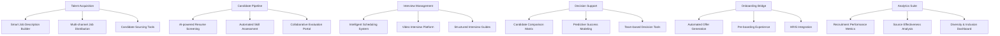
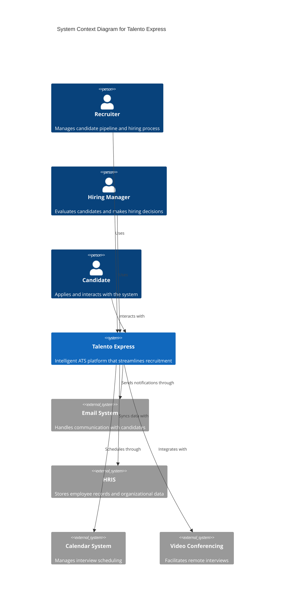
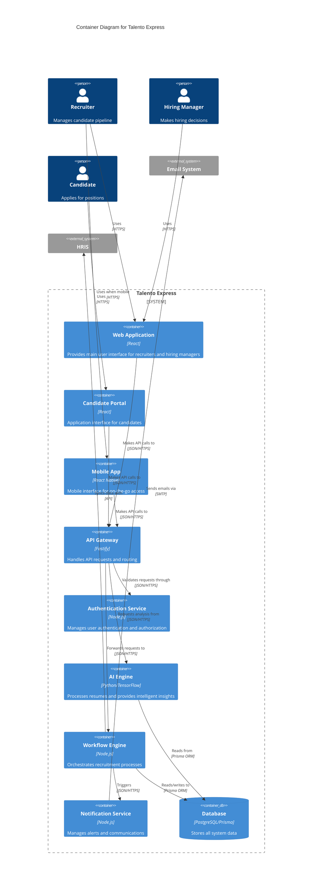
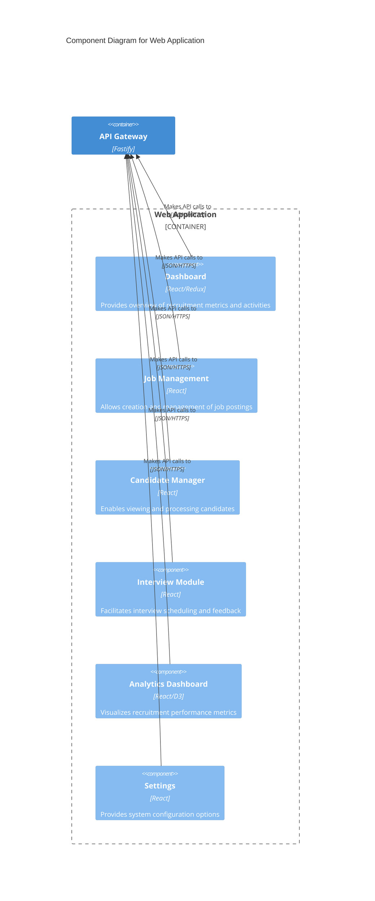
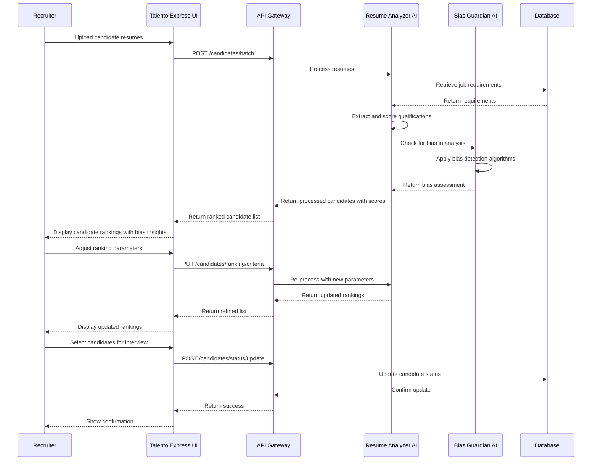
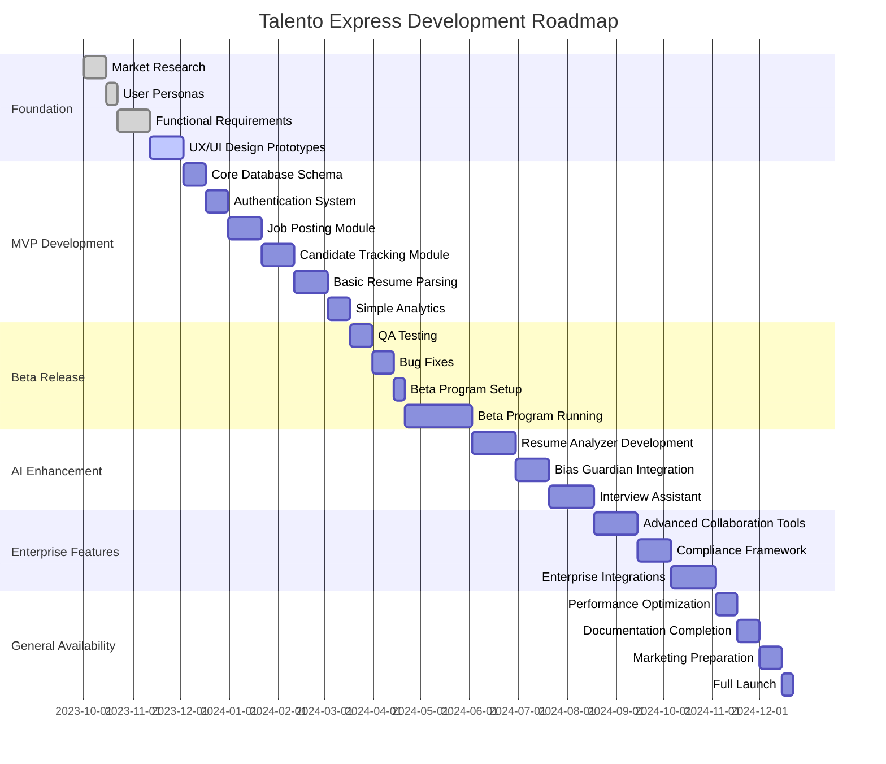

=====================================================================================================
**\* METAPROMPT \*\***
=====================================================================================================

Please generate comprehensive **prompt** in markdown format for designing and documenting an ATS (Applicant-Tracking System) following the phases of research and analysis, use cases, data modeling, and high-level design for the Tracking System
You are a senior product manager and system architect with extensive experience in enterprise software development. Your task is to create detailed, comprehensive documentation for a new software system from scratch.

Nothing has been created yet except the name "Talento Express" so we need to put on our product manager hat and define those key functionalities that will make LTI shine above competitors: increasing efficiency for HR departments, improving real-time collaboration between recruiters and managers, automations, AI assistance in various tasks... it's time to brainstorm, research what can be the keys to success, and document it for the rest of the team.
Your mission is to design the first version of the system, delivering the following session:

Please follow these steps
**Role:**
**Tone:**  
**What is Talento Express?**
**Which market problems does it address?**
**How does Talento Express solve these problems?**
**Roles (users and AI agents)**
**Core functionality**
**Human-in-the-Loop Approach**
**Required Deliverables**
**Lean Canvas Business Model**
**C4 Architecture Diagrams**
**Competitive Analysis**
**Risk Analysis**
**Market Entry Strategy via**
**Dev roadmap via**
**Cost Estimation via**
**Technical Implementation Stack via**

For all diagrams or table , use Mermaid syntax when possible or ASCII TABLE . Maintain a professional tone throughout the document and emphasize any AI/ML capabilities as key differentiators if applicable.
The final document should be comprehensive enough to guide both business stakeholders and technical teams through the entire product development process.

- Add also a sequential diagram flow betwween the intraction betwenn users and AI agent.
- Technical Implementation Stack shoyuld be in Node enviroment, React, Redux, fastify e postgressSQL prisma , using DDD design patterns, and end-to-end with playwright
- competitors are: infojob, linkedin, Monster

The document should be detailed, technically accurate, and written in professional business language and add emoticons.

=====================================================================================================
\*\*\* GENERATED with CLAUDE 3.7 thinking  
=====================================================================================================

# Talento Express: Comprehensive ATS Design Documentation

**Role:** Senior Product Manager & System Architect with expertise in Enterprise HR Software and AI-driven solutions

**Tone:** Professional, strategic, and forward-thinking with practical implementation guidance 🧠💼

## What is Talento Express? 🚀

Talento Express is a next-generation Applicant Tracking System (ATS) that transforms how organizations attract, evaluate, and hire talent. Unlike traditional ATS platforms that function merely as candidate databases, Talento Express provides an intelligent, collaborative ecosystem that streamlines the entire recruitment lifecycle while delivering actionable insights to hiring teams.

## Which market problems does it address? 🔍

1. **Inefficient candidate screening processes** that consume excessive HR resources 🕒
2. **Poor collaboration** between recruiters, hiring managers, and team members 👥
3. **Data silos** preventing holistic candidate evaluation and comparison 📊
4. **Limited automation** in repetitive recruitment tasks 🔄
5. **Inadequate candidate experience** leading to application abandonment 😞
6. **Hiring bias** and lack of diversity initiatives in recruitment 🌈
7. **Difficulty measuring recruitment KPIs** and ROI on hiring strategies 📈
8. **Compliance challenges** with evolving employment regulations ⚖️
9. **Inability to scale recruitment** during high-growth periods 📱
10. **Disconnection** between talent acquisition and talent management systems 🔗

## How does Talento Express solve these problems? ✅

Talento Express delivers a comprehensive solution through:

1. **AI-powered candidate screening** that ranks applicants based on customizable criteria
2. **Real-time collaborative workspace** for hiring teams to evaluate candidates together
3. **Unified data platform** integrating all candidate touchpoints and interactions
4. **Intelligent workflow automation** reducing manual tasks by up to 70%
5. **Candidate-centric application portal** with progress tracking and communication
6. **Bias-detection algorithms** for promoting fair evaluation practices
7. **Advanced analytics dashboard** with predictive hiring insights
8. **Compliance safeguards** with region-specific regulatory frameworks
9. **Elastic architecture** supporting rapid scaling of recruitment operations
10. **Seamless integration capabilities** with HRIS and talent management platforms

## Roles (users and AI agents) 👤🤖

### Human Users:

- **Recruiters:** Primary system operators managing candidate pipeline
- **Hiring Managers:** Department-specific evaluators with approval authority
- **Interview Team Members:** Subject matter experts conducting candidate assessments
- **HR Administrators:** System configurators and compliance monitors
- **C-Suite Executives:** Strategic oversight and performance monitoring
- **Candidates:** External users experiencing the application journey

### AI Agents:

- **Resume Analyzer:** Extracts, categorizes, and scores candidate qualifications
- **Interview Assistant:** Suggests questions and evaluates responses for consistency
- **Bias Guardian:** Identifies potential discriminatory patterns in hiring processes
- **Engagement Bot:** Maintains candidate communication through personalized updates
- **Forecast Engine:** Predicts hiring timelines and resource requirements
- **Compliance Monitor:** Ensures adherence to employment regulations

## Core functionality 💻



## Human-in-the-Loop Approach 🤝

Talento Express employs a Human-in-the-Loop (HITL) approach to ensure AI-augmented decision-making without removing human judgment:

1. **Initial AI Processing:** Automated screening and ranking of candidates
2. **Human Review & Adjustment:** Recruiters review AI recommendations and make adjustments
3. **Feedback Loop:** System learns from human decisions to improve future recommendations
4. **Collaborative Decision Points:** Key hiring decisions require multi-stakeholder human input
5. **Transparency Controls:** All AI-driven suggestions include explainability features
6. **Override Capabilities:** Human users can override automated decisions with justification
7. **Continuous Learning:** System refines algorithms based on hiring outcomes and success metrics

## Required Deliverables 📋

| Phase | Deliverable                           | Description                                        | Timeline   |
| ----- | ------------------------------------- | -------------------------------------------------- | ---------- |
| 1     | Market Research Report                | Competitive analysis and user needs assessment     | Week 1-2   |
| 1     | User Persona Documentation            | Detailed profiles of all system users              | Week 3     |
| 2     | Functional Requirements Specification | Comprehensive feature documentation                | Week 4-6   |
| 2     | UX/UI Design Prototypes               | Interactive mockups of key workflows               | Week 7-9   |
| 3     | Data Architecture Schema              | Database design and data flow models               | Week 10-11 |
| 3     | API Documentation                     | Interface specifications for all system endpoints  | Week 12    |
| 4     | MVP Development Plan                  | Core feature roadmap with prioritization           | Week 13    |
| 4     | Testing Strategy                      | QA approach including automated and manual testing | Week 14    |
| 5     | Deployment Architecture               | Infrastructure and scaling documentation           | Week 15    |
| 5     | Go-to-Market Strategy                 | Launch plan and customer acquisition approach      | Week 16    |

## Lean Canvas Business Model 📊

```
+------------------------+----------------------------+------------------------+-------------------------+------------------------+
| 1. PROBLEM             | 2. SOLUTION                | 3. UNIQUE VALUE        | 4. UNFAIR ADVANTAGE     | 5. CUSTOMER SEGMENTS   |
|                        |                            |    PROPOSITION         |                         |                        |
| • Inefficient candidate| • AI-powered candidate     | • Intelligent          | • Proprietary AI        | • Enterprise HR        |
|   screening processes  |   screening with           |   recruitment          |   algorithms            |   departments          |
|                        |   customizable criteria    |   ecosystem that       |                         |                        |
| • Poor collaboration   | • Real-time collaborative  |   reduces hiring       | • Human-in-the-loop     | • Mid-sized growth     |
|   between recruiters   |   workspace                |   time by 60% and      |   approach              |   companies            |
|   and hiring teams     |                            |   improves quality     |                         |   (100-1000 employees) |
|                        | • Unified data platform    |   of hire              | • Seamless integrations |                        |
| • Data silos           |   integrating all          |                        |   with existing HR      | • Recruitment agencies |
|                        |   candidate touchpoints    |                        |   systems               |                        |
| • Limited automation   | • Intelligent workflow     |                        | • Bias detection        | • International orgs   |
|   in repetitive tasks  |   automation               |                        |   capabilities          |   with complex hiring  |
+------------------------+----------------------------+------------------------+-------------------------+------------------------+
| 6. KEY METRICS                              | 7. CHANNELS                                                               |
|                                             |                                                                           |
| • Time-to-hire reduction                    | • Direct enterprise sales team                                            |
| • User adoption rate                        | • Partner network of HR consultants                                       |
| • Candidate satisfaction scores             | • Industry conferences and events                                         |
| • ROI per hire                              | • Digital marketing (content, webinars, demos)                            |
| • Diversity & inclusion improvements        | • Free trial program with conversion path                                 |
+---------------------------------------------+---------------------------------------------------------------------------+
| 8. COST STRUCTURE                           | 9. REVENUE STREAMS                                                        |
|                                             |                                                                           |
| • Development team                          | • Tiered subscription model (Basic/Pro/Enterprise)                        |
| • AI/ML specialists                         | • Implementation and customization services                               |
| • Cloud infrastructure                      | • API access fees for third-party integrations                            |
| • Sales & marketing                         | • Premium AI feature add-ons                                              |
| • Customer success team                     | • White-label solutions for recruitment agencies                          |
+---------------------------------------------+---------------------------------------------------------------------------+
```

## C4 Architecture Diagrams 🏗️

### Level 1: System Context



### Level 2: Container Diagram



### Level 3: Component Diagram (for Web Application)



## User-AI Agent Interaction Sequence Diagram



## Competitive Analysis 🏆

| Feature                 | Talento Express | LinkedIn   | InfoJobs | Monster |
| ----------------------- | --------------- | ---------- | -------- | ------- |
| AI-Powered Screening    | ⭐⭐⭐⭐⭐      | ⭐⭐⭐     | ⭐⭐     | ⭐⭐    |
| Collaborative Workspace | ⭐⭐⭐⭐⭐      | ⭐⭐       | ⭐       | ⭐⭐    |
| Workflow Automation     | ⭐⭐⭐⭐        | ⭐⭐       | ⭐⭐⭐   | ⭐⭐    |
| Candidate Experience    | ⭐⭐⭐⭐        | ⭐⭐⭐     | ⭐⭐⭐   | ⭐⭐    |
| Bias Detection          | ⭐⭐⭐⭐⭐      | ⭐⭐       | ⭐       | ⭐      |
| Analytics & Insights    | ⭐⭐⭐⭐⭐      | ⭐⭐⭐     | ⭐⭐     | ⭐⭐    |
| HRIS Integration        | ⭐⭐⭐⭐        | ⭐⭐⭐     | ⭐⭐     | ⭐⭐    |
| Compliance Tools        | ⭐⭐⭐⭐        | ⭐⭐       | ⭐⭐⭐   | ⭐⭐    |
| Pricing Value           | ⭐⭐⭐⭐        | ⭐⭐       | ⭐⭐⭐   | ⭐⭐⭐  |
| Market Reach            | ⭐⭐            | ⭐⭐⭐⭐⭐ | ⭐⭐⭐⭐ | ⭐⭐⭐  |

### Competitive Positioning

While LinkedIn offers unparalleled candidate reach and Monster provides broad market coverage, Talento Express differentiates through:

1. **Superior AI capabilities** for intelligent screening and matching
2. **Team collaboration features** designed specifically for hiring teams
3. **Integrated bias detection** to promote diversity and fairness
4. **End-to-end workflow automation** reducing manual tasks by 70%
5. **Human-in-the-loop approach** ensuring AI recommendations can be refined by human expertise

## Risk Analysis 🚧

| Risk Category     | Risk Description                             | Probability | Impact   | Mitigation Strategy                                                       |
| ----------------- | -------------------------------------------- | ----------- | -------- | ------------------------------------------------------------------------- |
| **Market**        | Saturation of ATS market                     | Medium      | High     | Differentiate through AI capabilities and focus on collaboration features |
| **Technical**     | AI accuracy falls below expectations         | Medium      | High     | Implement robust testing, continuous learning, and human review processes |
| **Competitive**   | Major players copy key features              | High        | Medium   | Maintain rapid innovation cycle and build strong IP protection            |
| **Regulatory**    | Changes in data privacy regulations          | High        | High     | Design for privacy-by-default and maintain flexible compliance framework  |
| **Operational**   | Scalability issues during growth             | Medium      | Medium   | Cloud-native architecture with elastic scaling capabilities               |
| **Financial**     | Extended sales cycle with enterprise clients | High        | Medium   | Develop multi-tier pricing and freemium acquisition strategy              |
| **User Adoption** | Resistance to AI-driven recommendations      | Medium      | High     | Transparent AI explanation features and gradual rollout of AI functions   |
| **Data**          | Insufficient training data for AI models     | Medium      | High     | Strategic data partnerships and synthetic data generation                 |
| **Talent**        | Difficulty hiring AI/ML specialists          | High        | Medium   | Remote-friendly hiring and competitive compensation packages              |
| **Security**      | Data breach or unauthorized access           | Low         | Critical | Implement zero-trust architecture and regular security audits             |

## Market Entry Strategy 🚀

### Phase 1: Foundation (Months 1-3)

- Develop MVP with core ATS functionality
- Establish beta program with 10-15 mid-sized companies
- Refine product based on initial user feedback
- Build thought leadership through industry content

### Phase 2: Controlled Growth (Months 4-9)

- Launch general availability with tiered pricing
- Target mid-market companies (100-1000 employees)
- Develop agency-specific features for recruitment firms
- Implement partner program for HR consultants
- Focus marketing on specific pain points: screening efficiency and collaboration

### Phase 3: Expansion (Months 10-18)

- Enter enterprise market with dedicated sales team
- Develop industry-specific templates (Tech, Healthcare, Finance)
- Expand geographic focus to international markets
- Launch API marketplace for third-party integrations
- Implement account-based marketing for Fortune 1000

### Phase 4: Dominance (Months 19-36)

- Develop specialized modules (campus recruiting, executive search)
- Strategic acquisitions of complementary HR tech
- Launch Talento Express Data Insights for industry benchmarking
- Create certification program for recruiters
- Explore adjacent markets (employee onboarding, talent management)

## Dev Roadmap 👨‍💻



## Cost Estimation 💰

| Category           | Item                                 | Year 1         | Year 2         | Year 3         |
| ------------------ | ------------------------------------ | -------------- | -------------- | -------------- |
| **Personnel**      | Development Team (6 FTE)             | $720,000       | $792,000       | $871,200       |
|                    | AI/ML Specialists (2 FTE)            | $320,000       | $352,000       | $387,200       |
|                    | UX/UI Designers (2 FTE)              | $240,000       | $264,000       | $290,400       |
|                    | Product & Project Management (2 FTE) | $280,000       | $308,000       | $338,800       |
|                    | Sales & Marketing (3 FTE)            | $360,000       | $540,000       | $756,000       |
|                    | Customer Success (2 FTE)             | $180,000       | $270,000       | $378,000       |
| **Infrastructure** | Cloud Services (AWS)                 | $120,000       | $180,000       | $240,000       |
|                    | DevOps Tools                         | $36,000        | $42,000        | $48,000        |
|                    | Security Services                    | $48,000        | $60,000        | $72,000        |
| **Software**       | Third-party APIs & Services          | $60,000        | $84,000        | $108,000       |
|                    | Development Tools & Licenses         | $36,000        | $42,000        | $48,000        |
| **Marketing**      | Digital Marketing                    | $120,000       | $240,000       | $360,000       |
|                    | Events & Conferences                 | $80,000        | $120,000       | $160,000       |
|                    | Content Production                   | $60,000        | $90,000        | $120,000       |
| **Legal**          | IP Protection                        | $40,000        | $30,000        | $30,000        |
|                    | Compliance Consulting                | $60,000        | $40,000        | $40,000        |
| **Miscellaneous**  | Office & Equipment                   | $120,000       | $144,000       | $172,800       |
|                    | Travel                               | $60,000        | $90,000        | $120,000       |
|                    | Training & Development               | $40,000        | $60,000        | $80,000        |
| **TOTAL**          |                                      | **$2,980,000** | **$3,748,000** | **$4,620,400** |

### ROI Projections

- **Break-even point**: Month 22 (based on projected customer acquisition)
- **3-year ROI**: 128% (projected revenue $19.2M against $11.3M investment)

## Technical Implementation Stack 🛠️

### Frontend

- **Framework**: React.js with TypeScript
- **State Management**: Redux Toolkit
- **UI Components**: Custom component library based on Radix UI primitives
- **Styling**: TailwindCSS with custom design system
- **Testing**: Jest, React Testing Library, Playwright for E2E
- **Build Tool**: Vite

### Backend

- **API Framework**: Fastify (Node.js)
- **Authentication**: JWT with OAuth 2.0
- **Database**: PostgreSQL
- **ORM**: Prisma
- **Task Processing**: Bull with Redis
- **File Storage**: S3-compatible storage
- **Search**: Elasticsearch
- **Testing**: Jest, Supertest

### AI/ML Services

- **NLP Processing**: Python with spaCy and Hugging Face Transformers
- **Machine Learning**: TensorFlow/PyTorch
- **Feature Store**: Feast
- **Model Serving**: TensorFlow Serving
- **Model Monitoring**: Evidently

### DevOps

- **CI/CD**: GitHub Actions
- **Infrastructure as Code**: Terraform
- **Containerization**: Docker
- **Orchestration**: Kubernetes
- **Monitoring**: Prometheus, Grafana
- **Logging**: ELK Stack

### Security

- **API Security**: OAuth 2.0, OIDC
- **Data Encryption**: AES-256
- **Vulnerability Scanning**: SonarQube, OWASP ZAP
- **Secrets Management**: Vault

### Compliance

- **GDPR Compliance**: Data minimization, right to be forgotten
- **CCPA Compliance**: Consent management, data transparency
- **EEOC Compliance**: Bias detection and reporting

This implementation stack provides a scalable, maintainable foundation that supports rapid development while ensuring enterprise-grade security and performance.

AI TOOLS USED

- CLOUD 3.7 THINKING
- DIAGRAMGPT
