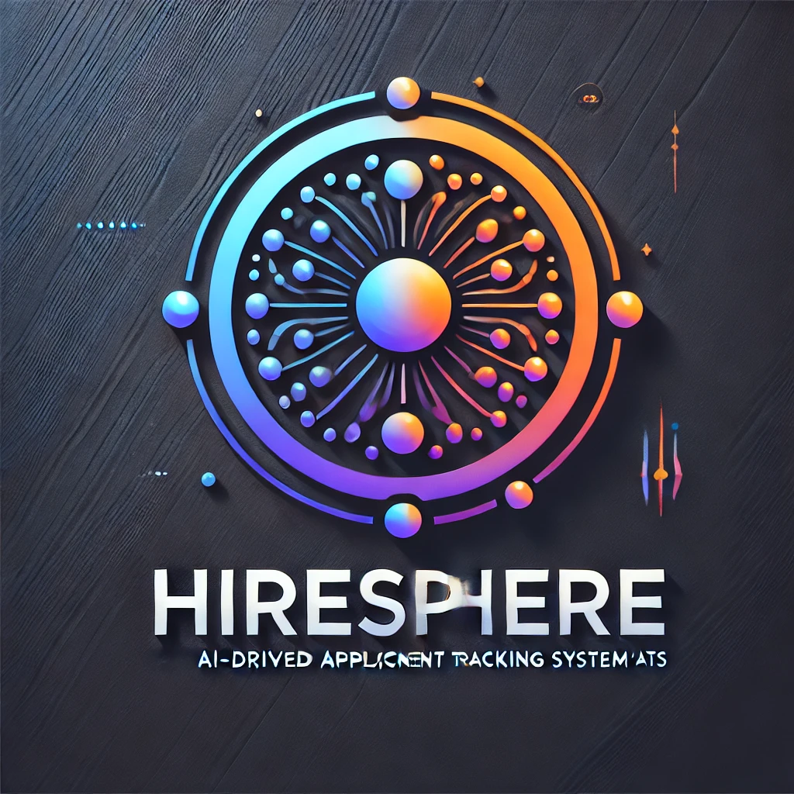
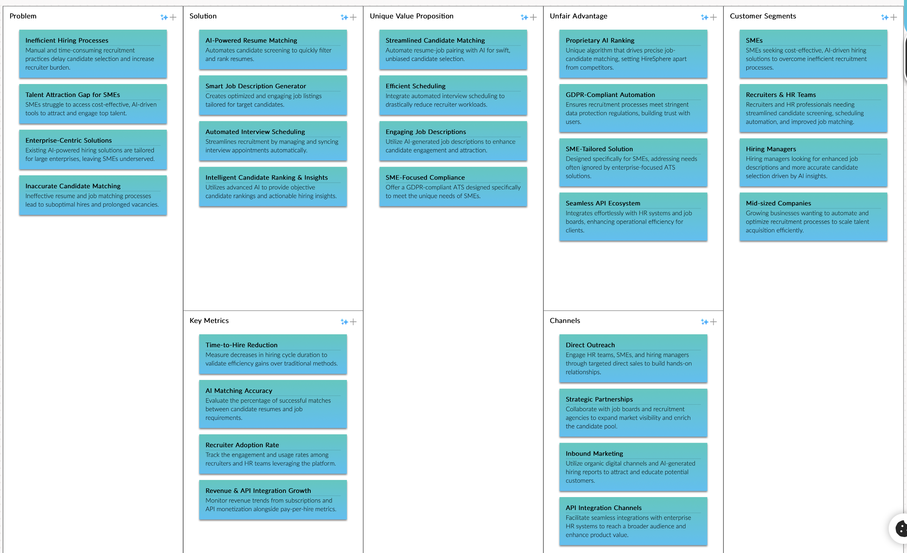
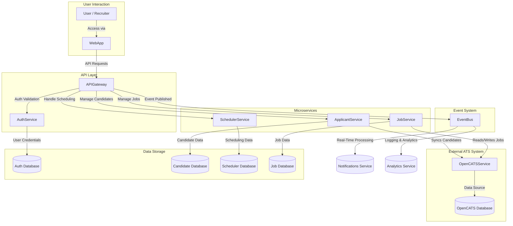
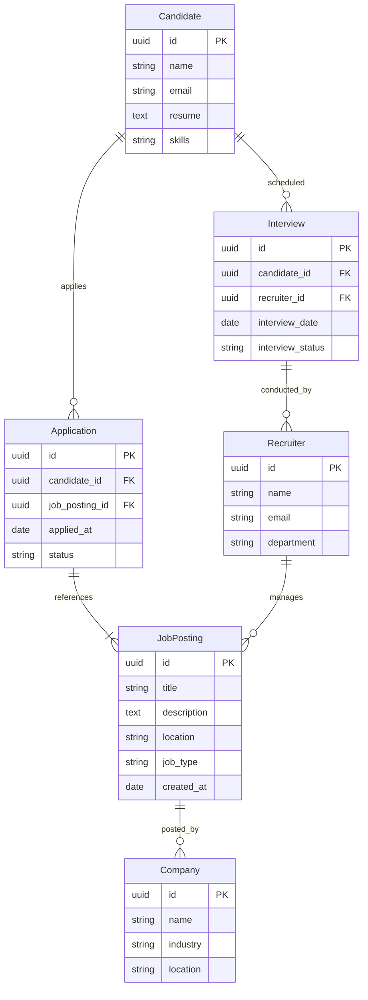
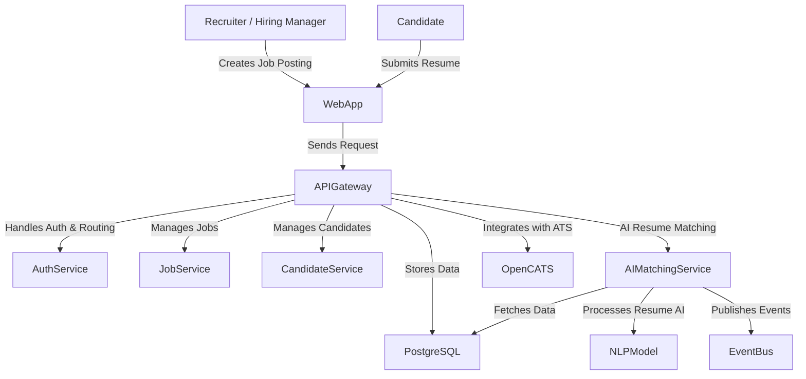
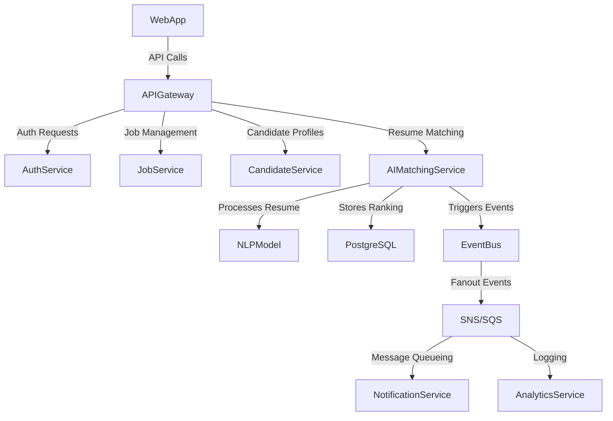
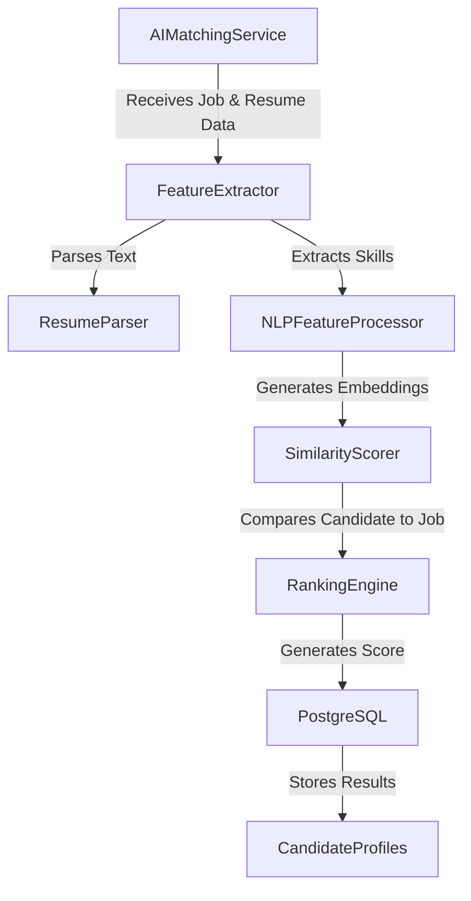
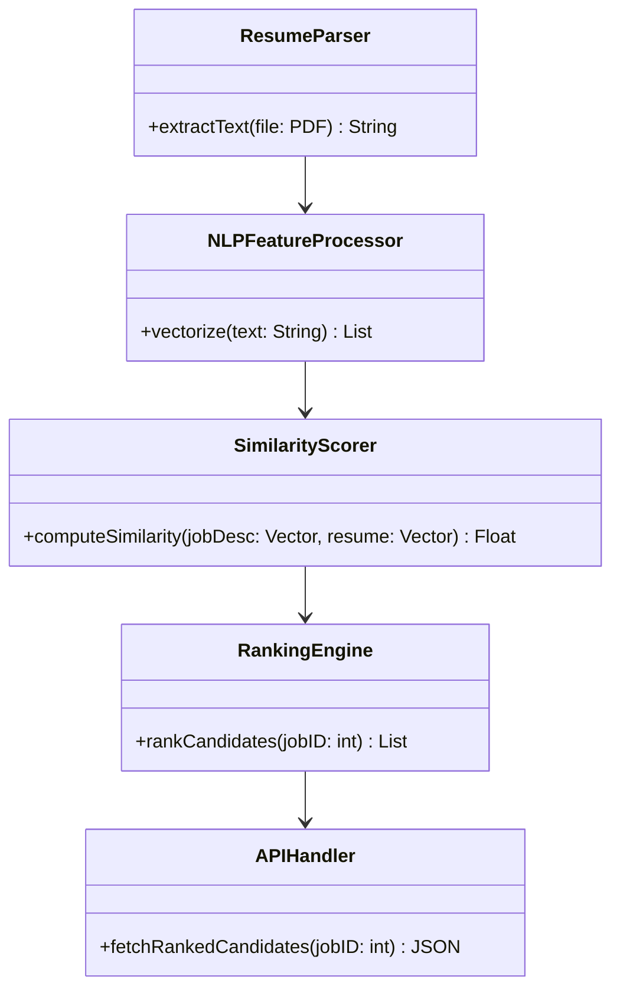

# HireSphere - Developing an ATS Tracking system

## Introduction

### What is an ATS?

An Applicant Tracking System (ATS) is a software solution designed to streamline and automate the hiring process. It enables organizations to manage the entire lifecycle of a job position, from creation and publication to applicant tracking and final hiring decisions. By leveraging technology, ATS platforms reduce manual workload, improve efficiency, and enhance candidate experience.

Modern ATS platforms integrate AI-driven functionalities, such as resume parsing, automated interview scheduling, and predictive analytics, to help HR teams make informed decisions faster. These systems are widely used by enterprises, staffing agencies, and recruitment firms to optimize hiring workflows, ensuring a seamless experience for both recruiters and candidates.

### Why Build a Next-Gen ATS?

The hiring landscape is evolving rapidly, with increased demand for AI-driven insights, automation, and data-driven decision-making. Many existing ATS solutions lack the agility to incorporate real-time AI advancements or provide a truly seamless and intuitive user experience.

Our goal is to build an ATS that:

- **Enhances Efficiency**: Reduces manual effort by automating repetitive tasks.

- **Improves Candidate Experience**: Provides a streamlined and personalized application process.

- **Empowers Recruiters**: Uses AI-powered insights to identify top talent quickly.

- **Integrates with the Modern Tech Stack**: Seamlessly connects with LinkedIn, Slack, Google Calendar, and HR tools.

- **Adapts to the Future of Work**: Supports remote and hybrid hiring, asynchronous interviews, and data-driven hiring strategies.

By leveraging AI, automation, and a user-centric design, we aim to redefine how organizations manage talent acquisition.

## Market analysis

### Target Audience

It will be a two sided platform where we will address to Applicants (Job Seekers) and SMEs (Job posters), where the offer (SMEs will take precedence)

#### Applicants (Job Seekers)

Demographics: Early-career professionals, mid-career specialists, and senior executives looking for better job opportunities.

- Pain Points:
    1.Lengthy and complex job application processes.
    2.Poor communication from employers.
    3.Lack of transparency in hiring workflows.

- Needs:
    1. A seamless and mobile-friendly application process.
    2. Better job matching via AI recommendations.
    3. Clear interview scheduling and feedback mechanisms.

#### Small & Medium Enterprises (SMEs)

Demographics Company Size: 10-500 employees (primary focus), up to 1,000 employees (secondary focus).

- Pain Points:
    1. High hiring costs with limited HR budgets.
    2. Inefficiencies in tracking candidates and managing job postings.
    3. Compliance and GDPR-related complexities in Europe.

- Needs:
    1. Affordable ATS with a simple UI/UX.
    2. Automation of manual recruitment tasks.
    3. AI-powered shortlisting and screening to save time.

### Market size (TAM, SAM, SOM)

Total Number of SMEs in Europe: ~25 million SMEs (Eurostat, 2024).
Estimated SME Adoption Rate of ATS: 35% (growing trend).

Total Number of Job Seekers in Europe: ~200 million (active and passive job seekers).

#### TAM (Total Addressable Market)

25M SMEs × Average ATS subscription ($5,000 per year) = $125 billion/year.

#### SAM (Serviceable Available Market)

Focused on SMEs with active hiring (30% of total SMEs):

7.5M SMEs × $5,000/year = $37.5 billion/year.

#### SOM (Serviceable Obtainable Market)

Targeting 2% market penetration in the first 5 years:
150,000 SMEs × $5,000/year = $750 million/year revenue potential.

## Competitors Analysis

Notable players:

- SAP SuccessFactors - Enterprise HR suite with an ATS module.
- Greenhouse - Best-in-class user experience and structured hiring.
- Workday Recruiting - Integrated ATS with Workday HCM.
- SmartRecruiters - User-friendly and AI-enhanced recruiting.
- Oracle Taleo/Oracle Recruiting Cloud - Long-standing enterprise ATS.
- iCIMS - Strong in mid-large enterprises.
- Bullhorn - Market leader in staffing agency solutions.
- Jobvite - AI-driven talent acquisition and CRM.
- Workable - Ideal for SMBs with strong AI-powered sourcing.
- Zoho Recruit - Budget-friendly ATS with deep Zoho integrations.

### Relevant players SWOT analysis

#### **SAP SuccessFactors**

| **Strengths**            | **Weaknesses**         | **Opportunities**        | **Threats**                   |
|--------------------------|-----------------------|--------------------------|--------------------------------|
| ✅ Enterprise HR Suite   | ❌ Complex Interface | 🚀 AI & UX Overhaul      | ⚠️ Competition with Workday/Oracle |
| ✅ Global Compliance     | ❌ Expensive for SMEs | 🚀 Mid-Market Expansion  | ⚠️ Slow AI Adoption           |

---

#### **Greenhouse**

| **Strengths**                 | **Weaknesses**           | **Opportunities**       | **Threats**                        |
|--------------------------------|-------------------------|-------------------------|-------------------------------------|
| ✅ User-Friendly Interface    | ❌ Limited Enterprise Features | 🚀 Expansion into Enterprise Market | ⚠️ Competition from Suite-Based ATS |
| ✅ Strong Collaboration Tools | ❌ Basic Reporting      | 🚀 AI & CRM Enhancements | ⚠️ Cost Pressure from Low-Cost ATS |

---

#### **Workday Recruiting**

| **Strengths**                 | **Weaknesses**         | **Opportunities**       | **Threats**                         |
|--------------------------------|-----------------------|-------------------------|--------------------------------------|
| ✅ Unified HCM Suite         | ❌ Complex Workflow   | 🚀 Mid-Market Growth    | ⚠️ Competition with Best-of-Breed ATS |
| ✅ Advanced Analytics        | ❌ High Pricing       | 🚀 Improved AI Matching | ⚠️ Limited SMB Presence             |

## Opportunities

### Combined Market Opportunities & Actions

| **Opportunity** | **Specific Action** |
|---------------|------------------|
| **UX Optimization** | Develop an intuitive, recruiter-friendly UI to compete with legacy enterprise ATS. |
| **AI-Powered Hiring** | Offer AI-driven job matching, automated screening, and predictive analytics for better hiring decisions. |
| **SME-Focused ATS** | Build an affordable, easy-to-implement ATS with pay-as-you-go pricing for SMEs. |
| **Seamless Integrations** | Provide pre-built integrations with HRIS, Slack, and assessment tools for plug-and-play adoption. |
| **Compliance & GDPR Support** | Automate GDPR workflows and AI-driven candidate data compliance tools. |
| **Recruitment Automation** | Automate interview scheduling, candidate messaging, and follow-ups with AI. |
| **Self-Service & No-Code Customization** | Offer no-code ATS configuration so SMEs can tailor workflows easily. |
| **Embedded Video & AI Chatbots** | Integrate video interviewing and AI chatbots to engage candidates better. |
| **Data-Driven Insights** | Deliver real-time hiring metrics, diversity analytics, and recruiter efficiency reports. |
| **Subscription Flexibility** | Provide monthly and per-hire pricing models to appeal to different business sizes. |

## **MVP Definition**

### Why HireSphere

📌 Name: HireSphere
🔹 Tagline: AI-Driven Talent Matching for the Future

Why This Name?
 • “Hire” represents the core function of the ATS—streamlining the hiring process.
 • “Sphere” conveys a global, interconnected ecosystem where recruiters and candidates meet seamlessly.
 • The name is modern, professional, and AI-friendly, aligning with the automation & intelligence focus of your ATS.

### Value proposition

🚀 Problem Statement
 • Hiring is inefficient & time-consuming → SMEs lack automation & AI-driven tools.
 • SMEs struggle to attract top talent → They compete against enterprises with better hiring systems.
 • AI-powered ATS solutions are mostly enterprise-focused → No AI-first ATS tailored for SMEs.

⭐ Unique Value Proposition

“AI-powered hiring automation for SMEs – faster, smarter, and bias-free recruitment.”
 • AI-driven resume & candidate matching → Automates ranking, saves recruiter time.
 • Smart job description generator → Helps SMEs create optimized job listings quickly.
 • Automated interview scheduling → Reduces manual coordination, boosting efficiency.
 • GDPR-compliant, AI-first ATS → Ensures regulatory compliance and inclusivity.

(Created with <https://canvanizer.com>)

### **🔹 Must-Have Features (Core ATS Functionalities)**

We want to build a **scalable and automated** ATS platform to minimizing human intervention (recruiting and support) to keep prices low and affordable while ensure a minimal core functionalities:

| **Category**           | **Functionality**                                      |
|------------------------|-------------------------------------------------------|
| **User Management**    | Authentication, Role-Based Access Control, GDPR Compliance |
| **Job Management**     | Job Posting, Multi-Channel Distribution, Approval Workflows |
| **Candidate Management** | Resume Parsing, Candidate Status Tracking, Application Management |
| **Communication**      | Automated Notifications, Email/SMS Integration, Interview Scheduling |
| **Interview & Assessment** | Video Interviews, AI Scoring, Skills Assessments |
| **Offer & Hiring**     | Offer Letter Generation, E-signatures, Hiring Workflow Tracking |
| **Reporting & Compliance** | KPI Dashboards, Diversity Analytics, GDPR Data Management |

---

### **🚀 Development Approach & Time-to-Market Optimization**

To accelerate development and reduce time-to-market, we will **leverage existing open-source solutions** instead of building everything from scratch:

- **Core ATS Functionality**: Based on [OpenCATS](https://opencats.org) or [Recruity](https://github.com/recruity/recruity).
- **Job Posting Automation**: We will integrate an **external API compatible with [JobHunt](https://github.com/jobhunt/jobhunt)** to ensure seamless connectivity with third-party tools and job boards.
- **Scalability**: Automation-first approach to **minimize manual intervention**, ensuring the system remains efficient as it grows.

---

### **📌 MVP Prioritization & Roadmap**

#### **1️⃣ Deploy OpenCATS & Create External API for JobHunt Compatibility**  

✅ **Why?**  

- Significantly **reduces time to market** while ensuring compatibility with existing HR tools.  
- Establishes a **solid foundation** for our ATS without reinventing the wheel.

### **2️⃣ AI-Driven Resume & Candidate Matching**  

✅ **Why?**  

- **Saves recruiters hours** by ranking applicants automatically.  
- Helps **SMEs with limited resources** make **faster, smarter hiring decisions**.  
- Enhances **OpenCATS’ resume parsing capabilities** with AI.

### **3️⃣ Smart Interview Scheduling Assistant**  

✅ **Why?**  

- **Automates interview scheduling**, reducing manual coordination efforts.  
- Eliminates **back-and-forth emails** between recruiters and candidates.  
- Seamlessly **integrates with Google Calendar & Outlook APIs**.

### **4️⃣ AI-Powered Job Description Generator**  

✅ **Why?**  

- Helps **SMEs quickly create optimized job postings** without effort.  
- **Improves SEO** and **attracts better candidates**.  
- **Reduces hiring bias** by ensuring **inclusive job descriptions**.

### **5️⃣ Embeddable Job Posting Widget**  

✅ **Why?**  

- Allows job postings to be **embedded anywhere** (company websites, career portals).  
- **Increases visibility** outside of major platforms like LinkedIn and Indeed.  
- Gives SMEs more **control over their recruitment strategy**.

## System Design

### High Level system design

Our ATS system follows an Event-Driven Microservices Architecture using an API Gateway to route requests and enforce security.
 • Users (Recruiters & Applicants) interact with the Web Application.
 • API Gateway handles authentication, authorization, and event publishing before forwarding requests to services.
 • Microservices handle specific functionalities:
 • Auth Service: Manages authentication & user roles.
 • Applicant/Candidate Service: Stores candidate profiles & applications.
 • Scheduler Service: Handles interview scheduling & calendar integration.
 • Job Service: Manages job postings & workflows.
 • OpenCATS Service: Acts as the primary ATS data provider.
 • Event Bus (EventBridge + SQS) captures all system events for real-time processing.

🛠 System Flow

 1. User accesses the Web Application → Authenticated via the Auth Service.
 2. Web App sends requests to API Gateway:
 • API Gateway validates authentication & permissions.
 • API Gateway publishes an event before forwarding the request.
 3. Requests are routed to microservices:
 • Job postings → Job Service (which updates OpenCATS).
 • Candidate applications → Applicant Service.
 • Scheduling interviews → Scheduler Service.
 4. OpenCATS Service acts as the main data source, queried by other services as needed.
 5. All updates trigger an event → Used for notifications, analytics, or async processing.

#### System design diagram

### Database ERD model for MVP features

#### **Scope**

This ERD covers the **top 3 AI-powered MVP functionalities**:

1. **AI-Driven Resume & Candidate Matching**
2. **Smart Interview Scheduling Assistant**
3. **AI-Powered Job Description Generator**

## **C4 Model for AI-Driven Resume & Candidate Matching**

### **1️⃣ Context Diagram (L1) – High-Level Overview**

### **2️⃣ Container Diagram (L2) – System Components**

### **3️⃣ Component Diagram (L3) – AI Resume Matching Microservice**

### **4️⃣ Code Diagram (L4) – Internal AI Matching Engine**

## **ADR: Architecture Decision Records**

### **ADR-001: Database Selection**

#### **Context**

We need a **scalable, reliable, and cost-effective database solution** to store ATS-related data, including:

- Job postings and applications
- Candidate profiles and resumes
- Recruiter workflows and job tracking
- AI-driven insights

#### **Decision**

We have chosen **PostgreSQL** as our primary database solution.

#### **Rationale**

✅ **Relational Structure:** Perfect for structured ATS workflows, candidate tracking, and relationships.  
✅ **Scalability:** Can handle growing data needs, supporting indexing and full-text search.  
✅ **Open-source & Cost-effective:** No licensing costs, supported by a strong ecosystem.  
✅ **Compliance:** Supports **GDPR-compliant** data handling and **audit logging**.  
✅ **Integration:** Compatible with OpenCATS and microservices-based architecture.  

#### **Consequences**

- Requires **schema design for optimal performance**.  
- We need **backup & replication strategies** for reliability.  

---

### **ADR-002: Open-Source ATS Integration**

#### **ADR-002 Context**

Building an ATS from scratch is costly. We need **a solid foundation** to accelerate development.

#### **ADR-002 Decision**

We will integrate **OpenCATS** as the core ATS platform and extend it with custom functionalities.

#### **ADR-002 Rationale**

✅ **Saves development time** by leveraging existing ATS functionalities.  
✅ **Open-source & extensible**, reducing vendor lock-in.  
✅ **Supports API-based integrations**, making it compatible with our architecture.  
✅ **Used by SMEs**, aligning with our market focus.  

#### **ADR-002 Consequences**

- We must **extend OpenCATS APIs** for job posting automation.  
- Requires **additional security layers** for **GDPR compliance**.  

---

### **ADR-003: Architecture & Integration Paradigm**

#### **ADR-003 Context**

Our ATS system must support:

- **Custom AI-driven features** (AI resume matching, job description generator, interview scheduling)
- **Core ATS functionality from OpenCATS**
- **Scalability & flexibility for future integrations**

#### **ADR-003 Decision**

We will use an **Event-Driven Microservices Architecture** with an **API Gateway** to integrate with OpenCATS.

#### **ADR-003 Rationale**

✅ **Modular & Scalable:** Microservices allow independent feature scaling.  
✅ **Decoupling:** Custom ATS features run as separate services, reducing OpenCATS dependencies.  
✅ **Asynchronous Processing:** Enables event-driven automation, like candidate ranking and interview scheduling.  
✅ **API Gateway:** Unifies integrations, exposing **REST APIs** to external tools (JobHunt, Slack, HR platforms).  
✅ **Real-Time Event Publishing:** ATS activities trigger events (e.g., "New Application Received" → Notification Service).  

#### **ADR-003 Consequences**

- Requires **event queue management (e.g., Kafka, SQS)**.  
- OpenCATS will act as a **data provider**, not a direct API consumer.  
- We must ensure **security and authentication** for inter-service communications.  

### **ADR-004: API Definition Compatible with JobHunt**

#### **ADR-004 Context**

To ensure **wider job board compatibility**, our ATS needs **a standard API** that aligns with **JobHunt** specifications.

#### **ADR-004 Decision**

We will build an API **compatible with JobHunt** to allow seamless job posting.

#### **ADR-004 Rationale**

✅ **Instant integration** with job boards and external recruitment tools.  
✅ **Standardized data structure**, improving interoperability.  
✅ **Simplifies expansion**, reducing custom API needs for third-party integrations.  

#### **ADR-004 Consequences**

- Requires **mapping OpenCATS data to JobHunt API format**.  
- We must define **API versioning** for future-proofing.  

### **ADR-005: API Gateway for Throttling & Abstraction**

#### **ADR-005 Context**

To ensure scalability, security, and seamless integration with OpenCATS, our system needs an API Gateway layer.

#### **ADR-005 Decision**

We will implement an API Gateway to manage throttling, authentication, and provide an abstraction layer between microservices and OpenCATS.

#### **ADR-005 Rationale**

✅ Security & Throttling: Ensures rate limiting and protects against excessive API calls.
✅ Abstraction Layer: Decouples services from direct OpenCATS dependency.
✅ Unified API Management: Centralized authentication, logging, and monitoring.
✅ Integration Flexibility: Allows modification of OpenCATS integration without affecting other services.

#### **ADR-005 Consequences**

Requires additional monitoring & logging setup.
Slightly increases latency due to request routing.
Add a default timeout of 30s to all requests

### **ADR-006: Event-Driven Architecture with EventBridge, SNS & SQS**

#### **ADR-006 Context**

Our ATS requires an event-based architecture to support real-time automation, asynchronous communication, and resilience against failures.

#### **ADR-006 Decision**

We will use AWS EventBridge, SNS, and SQS to implement an event-driven fanout pattern with Dead Letter Queues (DLQ) for failure handling.

#### **ADR-006 Rationale**

✅ Decoupling: Services can operate independently, reducing dependencies.
✅ Scalability: Allows processing large volumes of events asynchronously.
✅ Reliability: DLQ ensures failed messages are retried or logged for debugging.
✅ Real-Time Processing: Enables instant notifications and service updates (e.g., job applications, interview scheduling).
✅ Fanout Pattern: One event can trigger multiple services (e.g., "New Application Received" → triggers OpenCATS update, recruiter notification, and analytics logging).

#### **ADR-006 Consequences**

Increased complexity: Requires event schema definitions and error handling strategies.

Monitoring overhead: Needs observability tools to track failed messages and processing times.
  
##**LTI Exercise Conclusions**

### Time used

It took me around 4 hours to finish the excercies

- 1 hour to plan exactly the process i want to follow
- 2,5 hours to execute all the process
- 0,5 hours to format and generate the final output

### Doubts and reflections

- There was some time consumed mainly:
  - Moving information between tools
  - Adjusting responses and outputs from LLMs
  - Adjusting formatting (even some of it it si still not correct like the swot analysis)
- I would like to generate partial documentation of a psecific project on a CI/CD project.
- With a new blank project it is easier to implment than in an existing project
- I would like to use a specific documentation page or tool, and a hierachy
- The script process should find automatically new patterns, and modify the documentation, for example create new DAR
