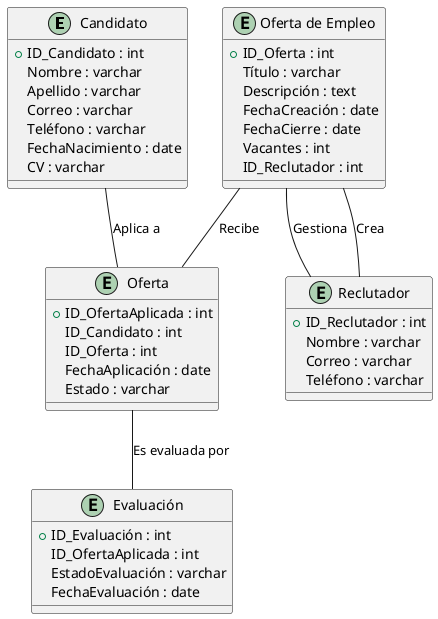
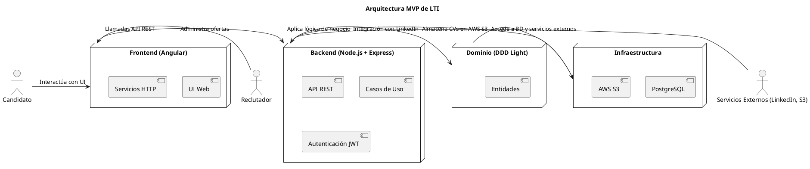

# LTI: Applicant Tracking System (ATS)

## Descripción del software
LTI es un sistema ATS (Applicant Tracking System) diseñado para revolucionar la gestión de procesos de selección mediante tecnología avanzada. Su enfoque innovador se basa en la inteligencia artificial para filtrar y recomendar candidatos, la automatización de procesos repetitivos y una interfaz altamente intuitiva que reduce la curva de aprendizaje.


###Valor añadido y ventajas competitivas
- **IA y Machine Learning**: Filtrado inteligente de candidatos según patrones de éxito anteriores.
- **Automatización avanzada**: Reducción del tiempo de contratación con flujos de trabajo personalizables.
- **Integraciones flexibles**: Conexión con LinkedIn, Indeed y APIs de RRHH.
- **Colaboración en tiempo real**: Panel de control compartido para reclutadores y managers.
- **Métricas y analíticas**: Reportes detallados para optimizar decisiones de selección.


## Funciones principales
1. **Gestor de candidaturas**: Panel de control con pipeline visual para seguimiento de candidatos.
2. **Parser de CVs con IA**: Extracción automática de información relevante.
3. **Entrevistas automatizadas**: Videoentrevistas con evaluación automática por IA.
4. **Publicación de ofertas multi-plataforma**: Sincronización con portales de empleo.
5. **Automatización de flujos de trabajo**: Reglas personalizables para notificaciones y seguimientos.
6. **Análisis y reportes**: KPIs de contratación, tasa de conversión y eficiencia de selección.
7. **Integración con herramientas de RRHH**: Conexión con ERP y CRM.


### Lean Canvas

Este diseño provee una visión clara del modelo de negocio y funcionalidad de LTI, permitiendo su desarrollo ágil y enfocado en el MVP.


---

## Principales casos de uso para el MVP

Para un proyecto ATS innovador como LTI, los tres casos de uso más importantes, de mayor a menor prioridad, serían:

### 1. **Registrar Candidatos**
   **Descripción Detallada**: 
   - El candidato ingresa su información personal (nombre, dirección, teléfono, correo, etc.).
   - Adjunta su CV en un formato permitido.
   - El sistema valida la entrada de datos y guarda la información del candidato en la base de datos.
   - El candidato recibe una confirmación de registro exitoso.

   **Diagrama PlantUML**:
   ```plantuml
   @startuml
   actor "Candidato" as C
   actor "Sistema de Validación" as V
   actor "Base de Datos" as DB
   rectangle "Sistema ATS" {
       usecase "Registrar Candidato" as UC1
       usecase "Validar Datos del Candidato" as UC1A
       usecase "Guardar Datos en Base de Datos" as UC1B
       usecase "Confirmar Registro" as UC1C
   }
   
   C -> UC1 : Ingresa datos personales y CV
   UC1 -> UC1A : Valida los datos del candidato
   UC1A -> V : Verifica formato y requisitos
   V --> UC1A : Datos válidos
   UC1A --> UC1B : Guarda datos en la base de datos
   UC1B --> DB : Almacena datos del candidato
   UC1B --> UC1C : Envia confirmación al candidato
   UC1C --> C : Muestra confirmación de registro exitoso
   @enduml
   ```

   

### 2. **Gestionar Ofertas de Empleo**
   **Descripción Detallada**: 
   - El reclutador crea una oferta de empleo, ingresando título, descripción, requisitos y fecha límite de la oferta.
   - El sistema guarda la oferta en la base de datos.
   - El reclutador puede ver todas las ofertas publicadas y gestionar su estado (abierta, cerrada, etc.).
   - Los candidatos pueden aplicar a las ofertas.

   **Diagrama PlantUML**:
   ```plantuml
   @startuml
   actor "Reclutador" as R
   actor "Sistema de Publicación" as SP
   actor "Base de Datos" as DB
   actor "Candidato" as C
   rectangle "Sistema ATS" {
       usecase "Crear Oferta de Empleo" as UC2
       usecase "Guardar Oferta" as UC2A
       usecase "Ver Ofertas Publicadas" as UC2B
       usecase "Aplicar a Oferta" as UC2C
   }
   
   R -> UC2 : Ingresa detalles de la oferta
   UC2 -> UC2A : Guarda oferta en la base de datos
   UC2A --> DB : Almacena oferta en la base de datos
   UC2 --> UC2B : Muestra lista de ofertas publicadas
   C -> UC2C : Aplica a la oferta
   UC2C --> DB : Almacena aplicación del candidato
   @enduml
   ```

   

### 3. **Evaluar y Filtrar Candidatos**
   **Descripción Detallada**: 
   - El reclutador accede a la lista de candidatos que han aplicado a una oferta.
   - El reclutador puede aplicar filtros (por experiencia, habilidades, etc.) para encontrar candidatos adecuados.
   - El sistema muestra los candidatos filtrados.
   - El reclutador puede revisar el perfil de cada candidato y asignar una evaluación (aprobado, rechazado, en espera).

   **Diagrama PlantUML**:
   ```plantuml
   @startuml
   actor "Reclutador" as R
   actor "Sistema de Filtrado" as SF
   actor "Base de Datos" as DB
   actor "Candidato" as C
   rectangle "Sistema ATS" {
       usecase "Filtrar Candidatos" as UC3
       usecase "Aplicar Filtros" as UC3A
       usecase "Mostrar Resultados Filtrados" as UC3B
       usecase "Evaluar Candidato" as UC3C
   }
   
   R -> UC3 : Accede a la lista de candidatos
   UC3 -> UC3A : Aplica filtros de selección
   UC3A --> SF : Filtra candidatos por criterios
   SF --> UC3B : Muestra los candidatos filtrados
   R -> UC3C : Asigna evaluación a candidato
   UC3C --> DB : Guarda la evaluación
   @enduml
   ```

   


## Modelo Entidad-Relación

El siguiente diagrama representa las entidades más importantes del sistema LTI así como sus relaciones entre ellas y atributos más importantes:




## Arquitectura general del sistema LTI 

### **Arquitectura del MVP de LTI - Enfoque Pragmático**  

Para desarrollar un **MVP (Minimum Viable Product)** de LTI, la arquitectura debe ser **simple pero escalable**, evitando la sobre-ingeniería. **Mi elección es una arquitectura basada en "Clean Architecture" pero simplificada**, con una estructura modular y clara, usando **DDD de manera pragmática**.  

### **Elección de Arquitectura: Clean Architecture Simplificada**  
✅ **Razones por las que elegimos esta arquitectura:**  
- **Simplicidad:** No introduce capas innecesarias.  
- **Escalabilidad:** Se puede mejorar sin reescribir todo el código.  
- **Separación de responsabilidades:** Permite mantenimiento y crecimiento a futuro.  
- **Facilidad de desarrollo:** Cualquier desarrollador puede entenderlo rápidamente.  

---

### **1. Estructura General del Sistema**  
El MVP de LTI se divide en **cuatro capas principales**:  

1. **Capa de Presentación (Frontend - Angular)**  
   - Aplicación web con Angular.  
   - Comunicación con el backend vía API REST.  

2. **Capa de Aplicación (Backend - Node.js + Express)**  
   - Exposición de endpoints REST.  
   - Orquestación de lógica de negocio.  

3. **Capa de Dominio (Reglas de Negocio - DDD Light)**  
   - Entidades y lógica de negocio.  
   - Casos de uso sin dependencias externas.  

4. **Capa de Infraestructura (Persistencia y Servicios Externos)**  
   - Base de datos (PostgreSQL con Sequelize).  
   - Almacenamiento de CVs en AWS S3.  
   - Autenticación con JWT.  

---

### **2. Diagrama de Arquitectura Simplificada**  


---

### **3. Diseño de Componentes**  

### **📌 3.1 Frontend (Angular)**
- **Tecnología:** Angular + Angular Material.  
- **Manejo de Estado:** Simple con servicios RxJS.  
- **Comunicación con Backend:** HTTP (REST API).  

### **📌 3.2 Backend (Node.js + Express)**
- **Framework:** Express.js para endpoints REST.  
- **Middleware:** Autenticación con JWT.  
- **Validación de Datos:** Joi o Zod.  
- **Casos de Uso:** Servicios que manejan la lógica de negocio.  

Ejemplo de **controlador** en Express:
```typescript
import { Request, Response } from "express";
import { CrearOfertaUseCase } from "../application/CrearOfertaUseCase";

export class OfertaController {
  constructor(private crearOferta: CrearOfertaUseCase) {}

  async crear(req: Request, res: Response) {
    const oferta = await this.crearOferta.execute(req.body);
    return res.status(201).json(oferta);
  }
}
```

---

### **📌 3.3 Capa de Dominio (DDD Light)**
- **Entidades:** Modelan los datos principales (`Oferta`, `Candidato`, `Evaluación`).  
- **Casos de Uso:** Encapsulan la lógica específica del negocio.  
- **Repositorios (Interfaces):** Definen cómo acceder a los datos, sin depender de la BD.  

Ejemplo de **entidad Oferta**:
```typescript
export class Oferta {
  constructor(
    public id: string,
    public titulo: string,
    public descripcion: string,
    public vacantes: number,
    public fechaCierre: Date
  ) {}

  esValida(): boolean {
    return this.vacantes > 0 && this.fechaCierre > new Date();
  }
}
```

Ejemplo de **caso de uso**:
```typescript
export class CrearOfertaUseCase {
  constructor(private ofertaRepo: OfertaRepository) {}

  async execute(data: CrearOfertaDTO) {
    const oferta = new Oferta(
      crypto.randomUUID(),
      data.titulo,
      data.descripcion,
      data.vacantes,
      data.fechaCierre
    );
    return await this.ofertaRepo.guardar(oferta);
  }
}
```

---

### **📌 3.4 Capa de Infraestructura (Persistencia y Servicios Externos)**
- **Base de Datos:** PostgreSQL con Sequelize.  
- **Almacenamiento de Archivos:** AWS S3 para CVs.  
- **Autenticación:** JWT para sesiones seguras.  

Ejemplo de **repositorio con Sequelize**:
```typescript
import { Oferta } from "../../domain/Oferta";
import { OfertaModel } from "../db/models/OfertaModel";

export class SequelizeOfertaRepository {
  async guardar(oferta: Oferta): Promise<Oferta> {
    return await OfertaModel.create(oferta);
  }
}
```

---

### **4. Integración con Sistemas Externos**
| **Servicio**       | **Tecnología**      | **Propósito** |
|--------------------|--------------------|--------------|
| **Autenticación**  | JWT + bcrypt       | Manejo de sesiones |
| **Base de Datos**  | PostgreSQL + Sequelize | Persistencia |
| **Almacenamiento** | AWS S3             | Guardar CVs |
| **LinkedIn API**   | OAuth2             | Importar perfiles |

Ejemplo de **autenticación con JWT**:
```typescript
import jwt from "jsonwebtoken";
export function generarToken(usuarioId: string) {
  return jwt.sign({ id: usuarioId }, "secreto", { expiresIn: "1h" });
}
```

---

### **5. Patrón de Comunicación**
- **Frontend → Backend:** REST API con JSON.  
- **Backend → Base de Datos:** Sequelize ORM.  
- **Backend → AWS S3:** SDK oficial de AWS.  
- **Backend → LinkedIn API:** OAuth2 + REST.  

---

## Diagrama C4 de la arquitectura

Aquí figura un diagrama C4 para el sistema ATS (Applicant Tracking System) llamado **LTI**. Lo describiré en los cuatro niveles:

---

### **Nivel 1: Diagrama de Contexto**  
Este nivel muestra la relación del sistema **LTI** con los usuarios y sistemas externos.

- **Usuarios:**  
  - **Reclutador:** Publica ofertas de empleo, gestiona candidatos.  
  - **Candidato:** Aplica a ofertas de empleo y revisa su estado.  
  - **Administrador:** Gestiona configuraciones del sistema.  
- **Sistemas externos:**  
  - **API de LinkedIn y Indeed:** Para importar candidatos.  
  - **Servicio de Correos Electrónicos:** Para notificaciones.  

---

### **Nivel 2: Diagrama de Contenedores**  
Define los principales contenedores del sistema **LTI**.

- **Frontend (Angular/React)** → Interfaz de usuario.  
- **Backend (Node.js + Express + DDD)** → Expone APIs REST.  
- **Base de Datos (PostgreSQL o MongoDB)** → Almacena candidatos, ofertas, evaluaciones.  
- **Servicio de Scraping** → Extrae datos de LinkedIn e Indeed.  
- **Servicio de Notificaciones** → Envía emails a los candidatos.  

---

### **Nivel 3: Diagrama de Componentes**  
Describe los componentes internos del backend.

- **Módulo de Gestión de Ofertas**  
- **Módulo de Gestión de Candidatos**  
- **Módulo de Evaluaciones**  
- **Módulo de Notificaciones**  
- **Módulo de Integraciones**  

---

### **Nivel 4: Diagrama de Código**  
(Se omite en esta etapa, ya que se detallaría a nivel de clases y funciones).  

---

![diagrama C4](https://plantuml.online/png/jLLDSzCm4BtdLwYvaCwKvCA9Mve6w13QqgJ3SCgivKsgLfRCIkuNmm_YmAa_8N-CbMm7cGGEp939mR5st-w-zrOvK4RgAiUAjBZsldIlHoE2--5Q-UiggnoIjCQZyKDfYz6baa2vFLDOeXvDNhsyq63yrOVPg03daVZLSXBY7_omh0hTE_WlyA0CKbsWzqASA5WJ521o5B8kRdkpyUVpgyLoF5_EtqyNatU3mzu5ahDcG2YfKens9FgNoDrvo2tr-TULgu2K5Lyg56jqNba3GeCJTo2v3tJYKMZh1F_8LGxUkluMjNs7Z3DfpmFekDGybTW18WIjda0uN5UgK4o1vI1NYPAiH6V3D0urIgaspuOBpH-PWc8mNimZQeGrNYm8vAqoQr6VXv9p5Pv0b42m7OG4QY6LrBRbYS135tmvVV03hSmjviemq2m-dfe0ob9uM5cgUIRCGwChT05RYyghC4tU55L5QSbppH9ffJIwRWbkJkcaKGQSM29aRgSyiITkIaccDyGWtId9gaHWOxrQyU3ymZ2DN4L4i2x-ZSsMcMKhXRv38zn1A895gT5sft62_O9a-25MAAiiC4jRhHYwTuawzKsjmTlM8erYRX-n8JFnHgjUuud43zSWCJL3aniJ4adECy_7AABzOi7KZDkCbk6fkTlys4kRZ8IdEHtMQXOw9EpPD8EyEkXwswLS7jlAv42F0_3khpuz55zxWZ_RrC4zPXpEIMyeOkVY4sPnXSowqX1Nz9GFQ0LFjLQqNTz8OOUABZQKYhEFkOM0Exuu3M1dDiVXJNJPzA5aPfZ_scoD5pH_Dy_hG0HRXulmzG1w1vnBGWOEOmM7WPsJs4Mqd_Dhmld7MPn45ompMsQFV4Uf6rfBxTHgbGpEgrS3qoLXnBEErd65IWh47rlh-wbl-KB0u8_cHeWBo0M_xVXzgynOIkHO4EpnkyttE06Jf5fLE73Ny_-GtQRKiZKcTfQjf3p_cpW1JM0CIFYV8J9xw2IfZFVTf65_eAv6XOIAxhQa4CaYiYIkqfpNNd7fVTZD-jjY_UfnRtk_xN4Zai3EBNdu4m00)


