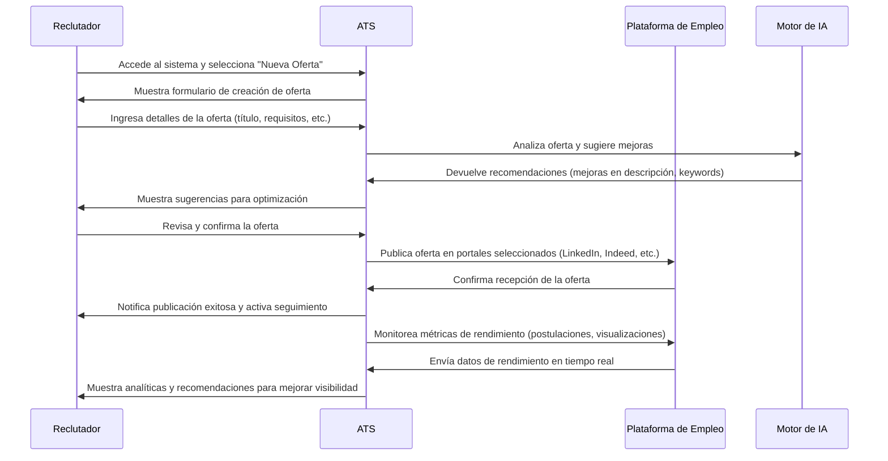
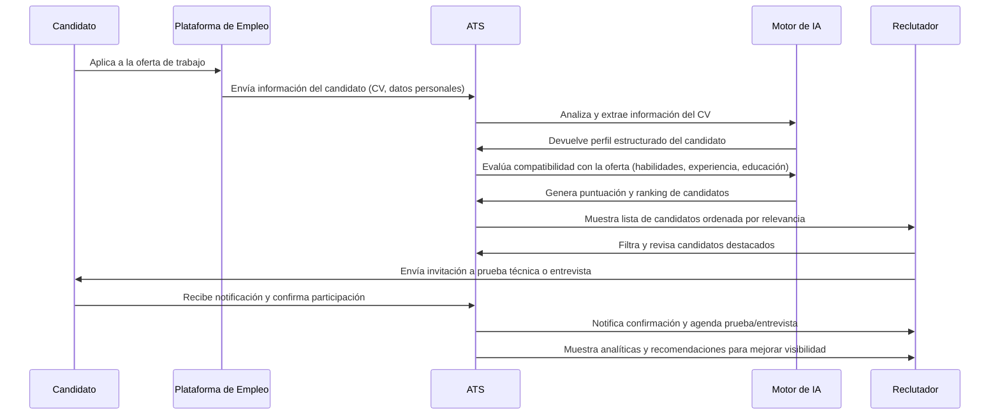
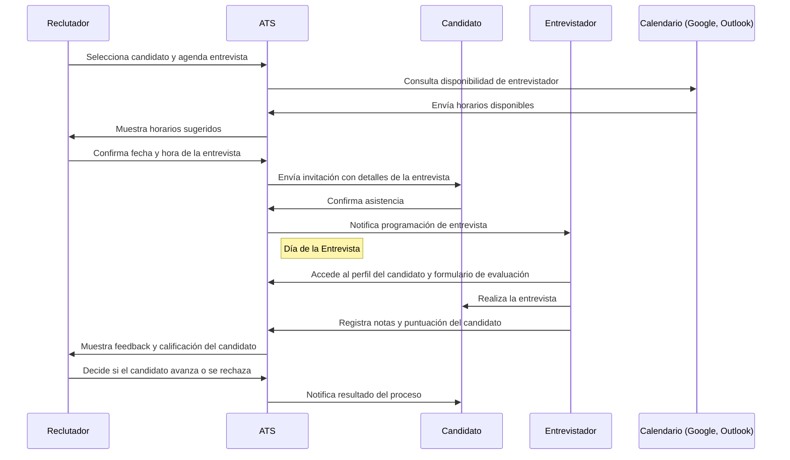

# **LTI ATS - Sistema Inteligente de Gestión de Talento**

## **Descripción**
LTI ATS es un sistema avanzado de gestión de candidatos (Applicant Tracking System) diseñado para optimizar el proceso de reclutamiento y selección de talento en empresas de todos los tamaños. A través de la automatización, inteligencia artificial y análisis de datos, LTI ATS permite a los equipos de recursos humanos identificar, evaluar y contratar a los mejores candidatos de manera eficiente y estratégica.  

Nuestro sistema centraliza la información de los postulantes, facilita la comunicación con los candidatos y agiliza cada fase del proceso de selección, desde la publicación de ofertas hasta la contratación final. Con una interfaz intuitiva y una integración fluida con herramientas de terceros, LTI ATS mejora la experiencia tanto para reclutadores como para candidatos.  

## **Valor Añadido**
LTI ATS no es solo un software de seguimiento de candidatos, sino una plataforma integral que transforma la forma en que las empresas gestionan su talento. Algunas de sus principales aportaciones incluyen:

- **Optimización con Inteligencia Artificial:** LTI ATS analiza perfiles, evalúa compatibilidades y recomienda los mejores candidatos basándose en datos históricos y criterios personalizados.  
- **Automatización de Procesos:** Reduce el tiempo dedicado a tareas repetitivas mediante flujos de trabajo automáticos, permitiendo a los reclutadores enfocarse en la toma de decisiones estratégicas.  
- **Experiencia del Candidato Mejorada:** Proporciona a los postulantes un portal con actualizaciones en tiempo real sobre el estado de su aplicación, lo que mejora su percepción de la empresa.  
- **Analítica Predictiva:** Dashboards avanzados y reportes en tiempo real permiten medir la efectividad del proceso de selección, optimizando la toma de decisiones.  
- **Integración Completa:** Conectividad con plataformas de empleo, redes sociales, herramientas de evaluación y sistemas ERP/HRMS para una sincronización perfecta.  

## **Ventajas Competitivas**
LTI ATS se diferencia en el mercado gracias a sus innovaciones y capacidades avanzadas:

### **1. Inteligencia Artificial para Selección Inteligente**
- Algoritmos de **matching** que sugieren candidatos ideales para cada puesto.  
- Evaluación automática de currículums con análisis semántico.  
- Análisis de sentimiento en entrevistas y respuestas escritas.  

### **2. Personalización Total**
- Configuración flexible de pipelines de selección según necesidades de cada empresa.  
- Personalización de workflows y reglas automatizadas.  
- Creación de reportes y métricas adaptadas a cada negocio.  

### **3. Automatización que Ahorra Tiempo**
- Creación y publicación de ofertas en múltiples plataformas con un solo clic.  
- Programación automática de entrevistas con integración en calendarios.  
- Generación de emails automatizados para candidatos en cada fase del proceso.  

### **4. Experiencia del Candidato Mejorada**
- Portal interactivo donde los postulantes pueden ver el estado de su aplicación en tiempo real.  
- Chatbot integrado para resolver dudas frecuentes y mejorar la comunicación.  
- Proceso ágil y sin fricciones que mejora la percepción de la marca empleadora.  

### **5. Analítica y Toma de Decisiones Basadas en Datos**
- **Paneles de control con KPIs clave** para evaluar tiempos de contratación, rendimiento de fuentes de reclutamiento y efectividad de entrevistas.  
- **Predicción de tasas de éxito** de candidatos en función de datos históricos.  
- **Análisis de diversidad e inclusión** para garantizar procesos equitativos.  

### **6. Integraciones y Adaptabilidad**
- API abierta para integraciones personalizadas con sistemas internos.  
- Conectividad con herramientas de evaluación técnica (HackerRank, Codility).  
- Integraciones nativas con LinkedIn, Indeed, Glassdoor y plataformas de RRHH.  

LTI ATS **revoluciona la gestión del talento**, proporcionando a las empresas una ventaja competitiva clave en un mercado donde la captación del mejor talento es fundamental para el éxito. 🚀  

# Casos de uso principales

## **1. Publicación de una Oferta de Trabajo y Difusión Automática**
### **Descripción**
Este caso de uso permite a los **reclutadores** crear, personalizar y publicar ofertas de trabajo en múltiples plataformas, asegurando la máxima visibilidad de las vacantes.

### **Actores**
- **Reclutador** (actor principal)
- **Plataformas de empleo** (actor secundario, interactúa con el sistema)

### **Flujo de Eventos**
1. El **reclutador** accede al ATS y elige la opción de **crear una nueva oferta**.  
2. Introduce los detalles del puesto, incluyendo **descripción, requisitos, ubicación y tipo de contrato**.  
3. Define las plataformas donde desea publicar la oferta (**LinkedIn, Indeed, Glassdoor, etc.**).  
4. El ATS genera automáticamente una vista previa y sugiere mejoras en base a patrones de éxito anteriores.  
5. Una vez validada, la oferta se publica en las plataformas seleccionadas.  
6. Se activa un **seguimiento automático** que mide el rendimiento de la oferta y recopila métricas como número de postulaciones e interacciones.  
7. El sistema **envía notificaciones** al reclutador con insights y recomendaciones para mejorar la publicación si el rendimiento es bajo.  

### **Diagrama secuencia**

## **2. Selección y Evaluación de Candidatos con IA**
### **Descripción**
Los reclutadores pueden recibir y evaluar automáticamente a los candidatos según su perfil y compatibilidad con la oferta de trabajo, reduciendo el tiempo de revisión manual.

### **Actores**
- **Reclutador** (actor principal)
- **Candidato** (actor secundario, interactúa con el sistema)
- **Motor de Inteligencia Artificial** (actor interno)

### **Flujo de Eventos**
1. Los **candidatos** aplican a la oferta a través de la plataforma de empleo o directamente en el ATS.  
2. El ATS **extrae información del currículum** (parsing) y la estructura en un perfil digital.  
3. El motor de **IA analiza la compatibilidad** de cada candidato basándose en:  
   - **Experiencia laboral y educación**  
   - **Habilidades clave** (comparadas con los requisitos del puesto)  
   - **Historial de éxito de perfiles similares**  
4. El sistema genera un **ranking de candidatos** con puntuaciones basadas en su ajuste con la vacante.  
5. Los reclutadores pueden:  
   - Filtrar candidatos por puntuación, experiencia o habilidades.  
   - Ver recomendaciones personalizadas sobre los perfiles más prometedores.  
   - Solicitar pruebas técnicas o entrevistas automáticamente.  
6. Los candidatos reciben notificaciones sobre el estado de su aplicación y posibles próximos pasos.  

### **Diagrama secuencia**

## **3. Coordinación de Entrevistas y Feedback Colaborativo**
### **Descripción**
Facilita la organización de entrevistas con integración de calendarios y permite a los reclutadores evaluar a los candidatos de forma estructurada.

### **Actores**
- **Reclutador** (actor principal)
- **Candidato** (actor secundario)
- **Entrevistadores** (pueden ser otros miembros del equipo)
- **Calendarios (Google, Outlook, etc.)** (actor secundario)

### **Flujo de Eventos**
1. El reclutador selecciona un candidato y **agenda una entrevista** dentro del ATS.  
2. El sistema propone horarios disponibles según la agenda del reclutador y los entrevistadores.  
3. Se envía automáticamente un **correo de invitación** con un enlace de videollamada si la entrevista es remota (Zoom, Teams, Google Meet).  
4. Antes de la entrevista, los reclutadores pueden adjuntar un **formulario de evaluación** con criterios predefinidos.  
5. Durante la entrevista, los entrevistadores pueden **tomar notas y calificar al candidato** dentro del sistema.  
6. Una vez finalizada, los reclutadores pueden:  
   - **Comparar evaluaciones** de diferentes entrevistadores.  
   - Generar un **reporte de feedback consolidado**.  
   - Decidir si el candidato avanza a la siguiente fase o si se envía una **respuesta automática** con feedback.  
7. Si el candidato es seleccionado, el ATS genera automáticamente una **oferta de empleo**, integrándose con el sistema de RRHH para iniciar el proceso de contratación.  

### **Diagrama secuencia**

# Modelo de datos

### **Explicación del Modelo de Datos**
1. **Candidato**  
   - Representa a las personas que aplican a ofertas de trabajo.  
   - Relación con **Postulación**, **Entrevista**, **Evaluación** e **IAAnalisis**.  

2. **Oferta**  
   - Contiene información de la vacante publicada por la empresa.  
   - Se conecta con **Postulación**, **Entrevista**, **Publicación** e **IAAnalisis**.  

3. **Postulación**  
   - Relación entre **Candidato** y **Oferta**.  
   - Contiene **fecha de postulación**, **estado** y **puntuación IA**.  

4. **Evaluación**  
   - Permite a los **entrevistadores** calificar el desempeño de los **candidatos** en una **entrevista**.  

5. **Entrevista**  
   - Relaciona **Candidato**, **Reclutador** y **Entrevistador**.  
   - Puede ser **presencial** o **online**, con enlace a videollamada.  

6. **Reclutador y Entrevistador**  
   - Usuarios del sistema con roles distintos.  
   - **Reclutador** publica ofertas y agenda entrevistas.  
   - **Entrevistador** evalúa a los candidatos.  

7. **Plataforma de Empleo y Publicación**  
   - Relaciona la **Oferta** con la plataforma donde se publica.  

8. **IAAnalisis**  
   - Evalúa la compatibilidad entre un **candidato** y una **oferta**.  
   - Registra **puntuaciones y observaciones** generadas por el motor de IA.  

# Arquitectura

