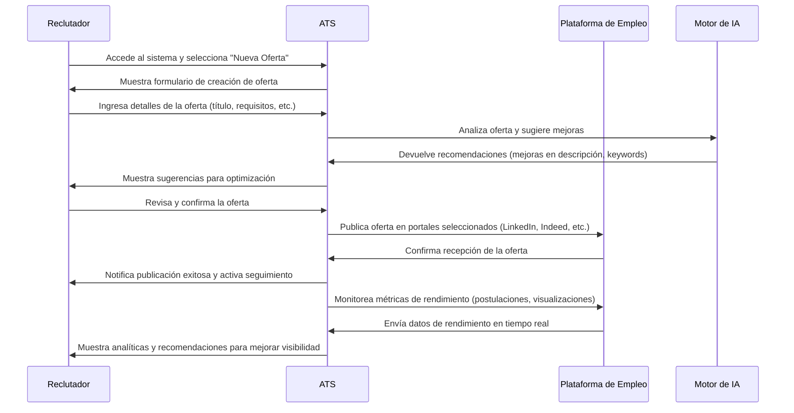

## Herramientas usadas

**ChatGPT 4o**: Desarrollo de documentación y análisis de casos de uso con funcionalidades.

**Mermaid.live**: Generación de imágenes de los esquemas de modelos de datos y diagramas de secuencia.

**Diagramgpt**: Generación de esquema de arquitectura de servicios para levantar la aplicación.

**leancanvas.business**: Generación de tablero Lean Canvas. https://leancanvas.business/


## Primer prompt

```
Eres un experto analista de software con conocimientos como product manager.
La compañía LTI nos han pedido que generemos la documentación de un nuevo proyecto de software ATS para la gestión de candidatos a trabajos. 

Debemos generar la siguiente documentación:

Descripción breve del software ATS, valor añadido y ventajas competitivas. Explicación de las funciones principales. Añadir un diagrama Lean Canvas para entender el modelo de negocio Descripción de los 3 casos de uso principales, con el diagrama asociado a cada uno Modelo de datos que cubra entidades, atributos (nombre y tipo) y relaciones Diseño del sistema a alto nivel, tanto explicado como diagrama adjunto Diagrama C4 que llegue en profundidad a uno de los componentes del sistema, el que prefieras Utiliza el asistente que prefieras: ChatGPT, Google Gemini, Microsoft Copilot, Claude...

Vamos a empezar haciendo un brainstorming.  Indícame las funcionalidades clave que debe tener el software para ser competitivo en el mercado teniendo en cuenta la competencia actual.


--- Respuesta ---

¡Vamos a ello! Para que el ATS (Applicant Tracking System) de LTI sea competitivo, debemos analizar las funcionalidades clave que lo harán destacar en el mercado actual. Aquí están las principales funcionalidades que debemos incluir:

---

### **1. Gestión de Candidatos**  
- Creación y administración de perfiles de candidatos.  
- Importación de currículums desde múltiples formatos (PDF, Word, LinkedIn).  
- Parsing automático de currículums para extraer información clave.  
- Seguimiento del estado de cada candidato dentro del pipeline de reclutamiento.  
- Evaluación y ranking de candidatos según criterios personalizados.  

---

### **2. Publicación y Distribución de Ofertas**  
- Creación de ofertas de empleo personalizadas.  
- Distribución automática en portales de empleo (LinkedIn, Indeed, Glassdoor, etc.).  
- Integración con redes sociales para maximizar la visibilidad.  
- Creación de páginas de carrera personalizadas para empresas.  

---

### **3. Gestión del Proceso de Selección**  
- Pipeline visual (Kanban) del proceso de selección.  
- Programación de entrevistas con integración de calendarios (Google, Outlook).  
- Envío de correos automáticos y recordatorios.  
- Feedback estructurado y evaluaciones colaborativas.  

---

### **4. Automatización e Inteligencia Artificial**  
- Algoritmos de matching entre candidatos y vacantes.  
- Recomendaciones inteligentes basadas en históricos de contratación.  
- Análisis de sentimiento en respuestas de entrevistas y cartas de presentación.  
- Automatización de tareas repetitivas con workflows personalizados.  

---

### **5. Evaluación y Pruebas de Habilidades**  
- Creación de pruebas técnicas y psicométricas.  
- Integración con plataformas de evaluación (HackerRank, Codility, etc.).  
- Análisis de desempeño en pruebas y feedback inmediato.  

---

### **6. Comunicación y Experiencia del Candidato**  
- Portal de candidatos con estado de aplicación en tiempo real.  
- Chatbots y asistentes virtuales para preguntas frecuentes.  
- Envío de notificaciones automáticas sobre el proceso.  

---

### **7. Integraciones y API**  
- Conexión con HRMS/ERP para sincronización de datos.  
- Integración con herramientas de videollamadas (Zoom, Microsoft Teams).  
- API abierta para desarrollos personalizados.  

---

### **8. Reportes y Analítica Avanzada**  
- Dashboards en tiempo real con KPIs clave.  
- Análisis de tiempos de contratación y eficiencia del proceso.  
- Medición de la diversidad e inclusión en el proceso de selección.  
- Generación de reportes exportables en PDF, Excel y Power BI.  

---

**Diferenciadores Clave para Competir:**  
✅ **Automatización con IA** para selección y ranking de candidatos.  
✅ **Interfaz intuitiva y adaptable** a diferentes tipos de empresas.  
✅ **Personalización avanzada** en pipelines y workflows.  
✅ **Integraciones robustas** con los principales sistemas de RRHH.  
✅ **Enfoque en experiencia del candidato** con seguimiento en tiempo real.  

---

¿Te gustaría priorizar alguna funcionalidad o crees que podemos añadir algo más? 🚀

```


## Prompt 2

```
Perfecto. Contemplando todas esas funcionalidades, ahora tal y como nos han pedido, vamos a desarrollar la descripción breve del software, valor añadido y ventajas competitivas. Detalla todo lo posible estos puntos y devuélvelo en formato markdown.


--- Respuesta ---

# **LTI ATS - Sistema Inteligente de Gestión de Talento**

## **Descripción Breve**
LTI ATS es un sistema avanzado de gestión de candidatos (Applicant Tracking System) diseñado para optimizar el proceso de reclutamiento y selección de talento en empresas de todos los tamaños. A través de la automatización, inteligencia artificial y análisis de datos, LTI ATS permite a los equipos de recursos humanos identificar, evaluar y contratar a los mejores candidatos de manera eficiente y estratégica.  

Nuestro sistema centraliza la información de los postulantes, facilita la comunicación con los candidatos y agiliza cada fase del proceso de selección, desde la publicación de ofertas hasta la contratación final. Con una interfaz intuitiva y una integración fluida con herramientas de terceros, LTI ATS mejora la experiencia tanto para reclutadores como para candidatos.  

---

## **Valor Añadido**
LTI ATS no es solo un software de seguimiento de candidatos, sino una plataforma integral que transforma la forma en que las empresas gestionan su talento. Algunas de sus principales aportaciones incluyen:

- **Optimización con Inteligencia Artificial:** LTI ATS analiza perfiles, evalúa compatibilidades y recomienda los mejores candidatos basándose en datos históricos y criterios personalizados.  
- **Automatización de Procesos:** Reduce el tiempo dedicado a tareas repetitivas mediante flujos de trabajo automáticos, permitiendo a los reclutadores enfocarse en la toma de decisiones estratégicas.  
- **Experiencia del Candidato Mejorada:** Proporciona a los postulantes un portal con actualizaciones en tiempo real sobre el estado de su aplicación, lo que mejora su percepción de la empresa.  
- **Analítica Predictiva:** Dashboards avanzados y reportes en tiempo real permiten medir la efectividad del proceso de selección, optimizando la toma de decisiones.  
- **Integración Completa:** Conectividad con plataformas de empleo, redes sociales, herramientas de evaluación y sistemas ERP/HRMS para una sincronización perfecta.  

---

## **Ventajas Competitivas**
LTI ATS se diferencia en el mercado gracias a sus innovaciones y capacidades avanzadas:

### **1. Inteligencia Artificial para Selección Inteligente**
- Algoritmos de **matching** que sugieren candidatos ideales para cada puesto.  
- Evaluación automática de currículums con análisis semántico.  
- Análisis de sentimiento en entrevistas y respuestas escritas.  

### **2. Personalización Total**
- Configuración flexible de pipelines de selección según necesidades de cada empresa.  
- Personalización de workflows y reglas automatizadas.  
- Creación de reportes y métricas adaptadas a cada negocio.  

### **3. Automatización que Ahorra Tiempo**
- Creación y publicación de ofertas en múltiples plataformas con un solo clic.  
- Programación automática de entrevistas con integración en calendarios.  
- Generación de emails automatizados para candidatos en cada fase del proceso.  

### **4. Experiencia del Candidato Mejorada**
- Portal interactivo donde los postulantes pueden ver el estado de su aplicación en tiempo real.  
- Chatbot integrado para resolver dudas frecuentes y mejorar la comunicación.  
- Proceso ágil y sin fricciones que mejora la percepción de la marca empleadora.  

### **5. Analítica y Toma de Decisiones Basadas en Datos**
- **Paneles de control con KPIs clave** para evaluar tiempos de contratación, rendimiento de fuentes de reclutamiento y efectividad de entrevistas.  
- **Predicción de tasas de éxito** de candidatos en función de datos históricos.  
- **Análisis de diversidad e inclusión** para garantizar procesos equitativos.  

### **6. Integraciones y Adaptabilidad**
- API abierta para integraciones personalizadas con sistemas internos.  
- Conectividad con herramientas de evaluación técnica (HackerRank, Codility).  
- Integraciones nativas con LinkedIn, Indeed, Glassdoor y plataformas de RRHH.  

---

LTI ATS **revoluciona la gestión del talento**, proporcionando a las empresas una ventaja competitiva clave en un mercado donde la captación del mejor talento es fundamental para el éxito. 🚀  


```


## Prompt 3

```

Ahora, como experto analista de software indícame los principales casos de uso del software


--- Respuesta ---
Para un **ATS (Applicant Tracking System)** como el que estamos diseñando, los principales **casos de uso** se centran en la gestión del proceso de reclutamiento y selección de talento. A continuación, describo los **tres principales casos de uso**, incluyendo los actores involucrados y las actividades clave en cada uno.

---

## **1. Publicación de una Oferta de Trabajo y Difusión Automática**
### **Descripción**
Este caso de uso permite a los **reclutadores** crear, personalizar y publicar ofertas de trabajo en múltiples plataformas, asegurando la máxima visibilidad de las vacantes.

### **Actores**
- **Reclutador** (actor principal)
- **Plataformas de empleo** (actor secundario, interactúa con el sistema)

### **Flujo de Eventos**
1. El **reclutador** accede al ATS y elige la opción de **crear una nueva oferta**.  
2. Introduce los detalles del puesto, incluyendo **descripción, requisitos, ubicación y tipo de contrato**.  
3. Define las plataformas donde desea publicar la oferta (**LinkedIn, Indeed, Glassdoor, etc.**).  
4. El ATS genera automáticamente una vista previa y sugiere mejoras en base a patrones de éxito anteriores.  
5. Una vez validada, la oferta se publica en las plataformas seleccionadas.  
6. Se activa un **seguimiento automático** que mide el rendimiento de la oferta y recopila métricas como número de postulaciones e interacciones.  
7. El sistema **envía notificaciones** al reclutador con insights y recomendaciones para mejorar la publicación si el rendimiento es bajo.  

---

## **2. Selección y Evaluación de Candidatos con IA**
### **Descripción**
Los reclutadores pueden recibir y evaluar automáticamente a los candidatos según su perfil y compatibilidad con la oferta de trabajo, reduciendo el tiempo de revisión manual.

### **Actores**
- **Reclutador** (actor principal)
- **Candidato** (actor secundario, interactúa con el sistema)
- **Motor de Inteligencia Artificial** (actor interno)

### **Flujo de Eventos**
1. Los **candidatos** aplican a la oferta a través de la plataforma de empleo o directamente en el ATS.  
2. El ATS **extrae información del currículum** (parsing) y la estructura en un perfil digital.  
3. El motor de **IA analiza la compatibilidad** de cada candidato basándose en:  
   - **Experiencia laboral y educación**  
   - **Habilidades clave** (comparadas con los requisitos del puesto)  
   - **Historial de éxito de perfiles similares**  
4. El sistema genera un **ranking de candidatos** con puntuaciones basadas en su ajuste con la vacante.  
5. Los reclutadores pueden:  
   - Filtrar candidatos por puntuación, experiencia o habilidades.  
   - Ver recomendaciones personalizadas sobre los perfiles más prometedores.  
   - Solicitar pruebas técnicas o entrevistas automáticamente.  
6. Los candidatos reciben notificaciones sobre el estado de su aplicación y posibles próximos pasos.  

---

## **3. Coordinación de Entrevistas y Feedback Colaborativo**
### **Descripción**
Facilita la organización de entrevistas con integración de calendarios y permite a los reclutadores evaluar a los candidatos de forma estructurada.

### **Actores**
- **Reclutador** (actor principal)
- **Candidato** (actor secundario)
- **Entrevistadores** (pueden ser otros miembros del equipo)
- **Calendarios (Google, Outlook, etc.)** (actor secundario)

### **Flujo de Eventos**
1. El reclutador selecciona un candidato y **agenda una entrevista** dentro del ATS.  
2. El sistema propone horarios disponibles según la agenda del reclutador y los entrevistadores.  
3. Se envía automáticamente un **correo de invitación** con un enlace de videollamada si la entrevista es remota (Zoom, Teams, Google Meet).  
4. Antes de la entrevista, los reclutadores pueden adjuntar un **formulario de evaluación** con criterios predefinidos.  
5. Durante la entrevista, los entrevistadores pueden **tomar notas y calificar al candidato** dentro del sistema.  
6. Una vez finalizada, los reclutadores pueden:  
   - **Comparar evaluaciones** de diferentes entrevistadores.  
   - Generar un **reporte de feedback consolidado**.  
   - Decidir si el candidato avanza a la siguiente fase o si se envía una **respuesta automática** con feedback.  
7. Si el candidato es seleccionado, el ATS genera automáticamente una **oferta de empleo**, integrándose con el sistema de RRHH para iniciar el proceso de contratación.  

---

### **Resumen de los Casos de Uso Principales**
| **#** | **Caso de Uso** | **Actores Principales** | **Beneficio Clave** |
|---|---|---|---|
| 1 | Publicación de ofertas de trabajo | Reclutador, Plataformas de empleo | Difusión rápida y optimizada de vacantes |
| 2 | Selección y evaluación con IA | Reclutador, Candidato, Motor de IA | Priorización de candidatos sin esfuerzo manual |
| 3 | Coordinación de entrevistas | Reclutador, Candidato, Entrevistadores | Agiliza la programación y mejora la calidad del feedback |

---

Estos **tres casos de uso representan el núcleo funcional del ATS**, pero el sistema puede ampliarse con más automatizaciones y optimizaciones. 🚀  

¿Qué opinas? ¿Quieres que detallemos más algún caso o añadamos otros escenarios? 😊

```


## Prompt 4


```
Ahora vamos a desarrollar el diagrama del caso de uso 1. Utiliza el formato mermaid como diagrama de secuencia

--- Respuesta ---

Aquí tienes el **diagrama de secuencia en formato Mermaid** para el **caso de uso 1: Publicación de una Oferta de Trabajo y Difusión Automática**.  



### **Explicación del Diagrama**
1. **El reclutador inicia el proceso** accediendo al ATS y seleccionando la opción de "Nueva Oferta".
2. **El sistema muestra un formulario** donde el reclutador ingresa detalles clave de la oferta.
3. **El Motor de IA analiza la oferta** y sugiere mejoras en la descripción, palabras clave y optimización SEO para mejorar su visibilidad.
4. **El reclutador revisa y confirma la publicación**.
5. **El ATS publica la oferta** en las plataformas de empleo seleccionadas.
6. **El sistema activa el monitoreo de rendimiento** y recopila datos sobre postulaciones e interacciones.
7. **El reclutador recibe reportes** con métricas clave y recomendaciones para mejorar la efectividad de la oferta.

---

Este diagrama representa de manera visual y estructurada el **flujo de interacción entre los actores clave** en la publicación de una oferta de trabajo. ¿Te gustaría hacer algún ajuste o agregar más detalles? 🚀
```


## Prompt 5


```
Ahora vamos a desarrollar el diagrama del caso de uso 1. Utiliza el formato mermaid como diagrama de secuencia

--- Respuesta ---

Aquí tienes el **diagrama de secuencia en formato Mermaid** para el **caso de uso 1: Publicación de una Oferta de Trabajo y Difusión Automática**.  

```mermaid
sequenceDiagram
    participant Reclutador
    participant ATS
    participant PlataformaEmpleo as Plataforma de Empleo
    participant MotorIA as Motor de IA
    
    Reclutador->>ATS: Accede al sistema y selecciona "Nueva Oferta"
    ATS->>Reclutador: Muestra formulario de creación de oferta
    Reclutador->>ATS: Ingresa detalles de la oferta (título, requisitos, etc.)
    ATS->>MotorIA: Analiza oferta y sugiere mejoras
    MotorIA->>ATS: Devuelve recomendaciones (mejoras en descripción, keywords)
    ATS->>Reclutador: Muestra sugerencias para optimización
    Reclutador->>ATS: Revisa y confirma la oferta
    ATS->>PlataformaEmpleo: Publica oferta en portales seleccionados (LinkedIn, Indeed, etc.)
    PlataformaEmpleo->>ATS: Confirma recepción de la oferta
    ATS->>Reclutador: Notifica publicación exitosa y activa seguimiento
    ATS->>PlataformaEmpleo: Monitorea métricas de rendimiento (postulaciones, visualizaciones)
    PlataformaEmpleo->>ATS: Envía datos de rendimiento en tiempo real
    ATS->>Reclutador: Muestra analíticas y recomendaciones para mejorar visibilidad


### **Explicación del Diagrama**
1. **El reclutador inicia el proceso** accediendo al ATS y seleccionando la opción de "Nueva Oferta".
2. **El sistema muestra un formulario** donde el reclutador ingresa detalles clave de la oferta.
3. **El Motor de IA analiza la oferta** y sugiere mejoras en la descripción, palabras clave y optimización SEO para mejorar su visibilidad.
4. **El reclutador revisa y confirma la publicación**.
5. **El ATS publica la oferta** en las plataformas de empleo seleccionadas.
6. **El sistema activa el monitoreo de rendimiento** y recopila datos sobre postulaciones e interacciones.
7. **El reclutador recibe reportes** con métricas clave y recomendaciones para mejorar la efectividad de la oferta.

---

Este diagrama representa de manera visual y estructurada el **flujo de interacción entre los actores clave** en la publicación de una oferta de trabajo. ¿Te gustaría hacer algún ajuste o agregar más detalles? 🚀
```

## Prompt5

```
Teniendo ahora en cuenta estos 3 casos de uso, desarrolla un diagrama de modelo de datos (classDiagram) incluyendo los campos y atributos de cada entidad afectada. Devuélvelo en formato mermaid para poder usarlo en la documentación.

Aquí tienes el **diagrama del modelo de datos** en formato **Mermaid (classDiagram)**, basado en los **tres casos de uso** que hemos desarrollado.  

```mermaid
classDiagram
    class Candidato {
        +UUID id
        +string nombre
        +string apellido
        +string email
        +string telefono
        +string direccion
        +string linkedin
        +date fecha_aplicacion
        +string estado_aplicacion
        +text cv_url
    }

    class Oferta {
        +UUID id
        +string titulo
        +string descripcion
        +string requisitos
        +string ubicacion
        +string tipo_contrato
        +float salario
        +date fecha_publicacion
        +date fecha_cierre
        +string estado
    }

    class Postulacion {
        +UUID id
        +UUID candidato_id
        +UUID oferta_id
        +date fecha_postulacion
        +string estado
        +float puntuacion_ia
    }

    class Evaluacion {
        +UUID id
        +UUID candidato_id
        +UUID entrevistador_id
        +UUID entrevista_id
        +int puntuacion
        +text comentarios
        +date fecha
    }

    class Entrevista {
        +UUID id
        +UUID candidato_id
        +UUID oferta_id
        +UUID reclutador_id
        +UUID entrevistador_id
        +date fecha_entrevista
        +string metodo (presencial/online)
        +string enlace_videollamada
    }

    class Reclutador {
        +UUID id
        +string nombre
        +string email
        +string telefono
        +string empresa
    }

    class Entrevistador {
        +UUID id
        +string nombre
        +string email
        +string telefono
        +string departamento
    }

    class PlataformaEmpleo {
        +UUID id
        +string nombre
        +string url
    }

    class Publicacion {
        +UUID id
        +UUID oferta_id
        +UUID plataforma_id
        +date fecha_publicacion
        +int numero_postulaciones
        +int numero_visualizaciones
    }

    class IAAnalisis {
        +UUID id
        +UUID candidato_id
        +UUID oferta_id
        +float compatibilidad
        +text observaciones
        +date fecha_analisis
    }

    % Relaciones
    Candidato "1" -- "0..*" Postulacion : aplica a
    Oferta "1" -- "0..*" Postulacion : recibe postulaciones
    Candidato "1" -- "0..*" Evaluacion : tiene evaluaciones
    Entrevistador "1" -- "0..*" Evaluacion : realiza evaluaciones
    Entrevista "1" -- "0..*" Evaluacion : pertenece a
    Reclutador "1" -- "0..*" Entrevista : agenda
    Candidato "1" -- "0..*" Entrevista : asiste a
    Entrevistador "1" -- "0..*" Entrevista : conduce
    PlataformaEmpleo "1" -- "0..*" Publicacion : publica en
    Oferta "1" -- "0..*" Publicacion : se publica en
    Candidato "1" -- "0..*" IAAnalisis : es analizado por
    Oferta "1" -- "0..*" IAAnalisis : es evaluada para

---

### **Explicación del Modelo de Datos**
1. **Candidato**  
   - Representa a las personas que aplican a ofertas de trabajo.  
   - Relación con **Postulación**, **Entrevista**, **Evaluación** e **IAAnalisis**.  

2. **Oferta**  
   - Contiene información de la vacante publicada por la empresa.  
   - Se conecta con **Postulación**, **Entrevista**, **Publicación** e **IAAnalisis**.  

3. **Postulación**  
   - Relación entre **Candidato** y **Oferta**.  
   - Contiene **fecha de postulación**, **estado** y **puntuación IA**.  

4. **Evaluación**  
   - Permite a los **entrevistadores** calificar el desempeño de los **candidatos** en una **entrevista**.  

5. **Entrevista**  
   - Relaciona **Candidato**, **Reclutador** y **Entrevistador**.  
   - Puede ser **presencial** o **online**, con enlace a videollamada.  

6. **Reclutador y Entrevistador**  
   - Usuarios del sistema con roles distintos.  
   - **Reclutador** publica ofertas y agenda entrevistas.  
   - **Entrevistador** evalúa a los candidatos.  

7. **Plataforma de Empleo y Publicación**  
   - Relaciona la **Oferta** con la plataforma donde se publica.  

8. **IAAnalisis**  
   - Evalúa la compatibilidad entre un **candidato** y una **oferta**.  
   - Registra **puntuaciones y observaciones** generadas por el motor de IA.  

---

Este **modelo de datos** está diseñado para cubrir los **tres casos de uso principales**, asegurando escalabilidad y eficiencia. 🚀  

¿Te gustaría realizar alguna modificación o añadir más detalles? 😊

```

## Prompt 6 arquitectura Diagramgpt

```
    [input con todo lo generado anteriormente]

    Desarrolla un esquema de arquitectura cloud en AWS para el sistema.
    Usaremos react para el front.
    Usaremos nodejs para el back con typescript.
    Usaremos bases de datos relacionales
    Debemos establecer un balanceador de carga.
    Almacenaremos los datos en un bucket de s3.

```

