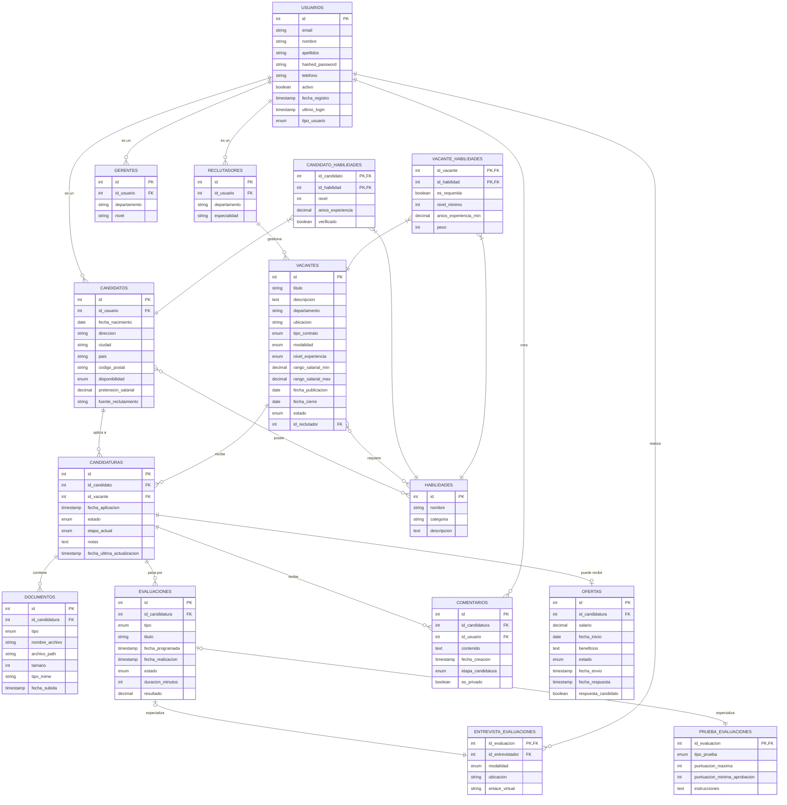

# DESCRIPCIÓN DEL PRODUCTO

Nuestra solución ATS de vanguardia revoluciona el reclutamiento mediante la integración de inteligencia artificial avanzada en cada fase del proceso de selección. Desarrollada bajo los estándares LEADER TECHNOLOGY INNOVATION (LTI), esta plataforma redefine cómo las organizaciones identifican, evalúan y contratan talento excepcional.
Con nuestro sistema, los equipos de RRHH aprovechan el poder de la IA para:

Generar descripciones de trabajo optimizadas y distribuirlas estratégicamente en múltiples canales digitales
Analizar automáticamente las aplicaciones mediante algoritmos de coincidencia semántica y evaluación predictiva
Implementar evaluaciones adaptativas que identifican habilidades técnicas y competencias blandas
Orquestar procesos de entrevista basados en datos con recomendaciones de preguntas personalizadas
Tomar decisiones de contratación respaldadas por análisis predictivo de desempeño

La arquitectura LTI garantiza la escalabilidad, cumplimiento normativo y adaptabilidad continua del sistema mediante aprendizaje automático, reduciendo hasta un 60% el tiempo de contratación mientras mejora significativamente la calidad y retención de las incorporaciones. Nuestra solución no solo gestiona candidatos: transforma datos en estrategia de talento.

## Características principales

### Gestión de Talento Inteligente

- **Creación asistida de vacantes**: Generación de descripciones de puestos optimizadas mediante IA para atraer candidatos ideales
- **Distribución multicanal automatizada**: Publicación sincronizada en portales de empleo, web corporativa y redes sociales con análisis predictivo de alcance
- **Dashboard unificado**: Interfaz centralizada para visualización en tiempo real del pipeline de candidatos y métricas clave

### Procesamiento Avanzado de Candidaturas

- **Análisis semántico de CV**: Evaluación automática de compatibilidad candidato-puesto mediante comprensión de lenguaje natural
- **Filtrado inteligente**: Priorización dinámica de candidatos basada en múltiples criterios ponderados y aprendizaje continuo
- **Detección de potencial oculto**: Identificación de talentos no evidentes mediante patrones de éxito históricos

### Evaluación Científica

- **Pruebas adaptativas personalizadas**: Evaluaciones que ajustan su dificultad según respuestas previas del candidato
- **Análisis conductual**: Evaluación de soft skills mediante simulaciones y ejercicios interactivos
- **Validación anti-fraude**: Verificación de identidad y monitoreo de comportamientos sospechosos durante pruebas

### Orquestación de Entrevistas

- **Programación inteligente**: Coordinación automática de entrevistas considerando disponibilidad de todos los participantes
- **Guía de entrevista personalizada**: Recomendación de preguntas específicas basadas en el perfil del candidato
- **Asistente de evaluación post-entrevista**: Herramienta de calificación estructurada con sugerencias basadas en datos

### Toma de Decisiones Data-Driven

- **Scorecards comparativos**: Visualización side-by-side de candidatos finalistas con métricas clave
- **Predicción de desempeño**: Estimación de éxito futuro y adaptación cultural mediante modelos predictivos
- **Recomendaciones de compensación**: Sugerencias de paquetes salariales competitivos basados en datos de mercado

### Arquitectura LTI

- **Escalabilidad infinita**: Infraestructura cloud-native que se adapta automáticamente a volúmenes variables
- **Aprendizaje continuo**: Modelos que evolucionan con cada proceso de contratación para mejorar resultados
- **Cumplimiento regulatorio automatizado**: Validación automática de requisitos legales por jurisdicción
- **Integración ecosistémica**: Conectividad bidireccional con sistemas HRIS, LMS y herramientas de productividad

### Análisis y Optimización

- **Analytics avanzados**: Métricas detalladas de cada fase del proceso con identificación de cuellos de botella
- **Optimización de fuentes de reclutamiento**: Evaluación automática del ROI de cada canal de captación
- **Insights de diversidad e inclusión**: Monitoreo y recomendaciones para eliminar sesgos en la contratación

## Ventajas competitivas (para Early Adopters)

### Transformación Inmediata

- **IA predictiva de alta precisión**: Algoritmos entrenados con datos LTI específicos que superan en un 40% la exactitud de sistemas genéricos en la identificación de talento tecnológico disruptivo.
- **Reducción del 68% en time-to-hire**: Automatización extrema que comprime ciclos de contratación de semanas a días, crucial para capturar talento premium en el competitivo sector tecnológico.

### Ventaja Estratégica

- **Detección de "unicornios ocultos"**: Capacidad única para identificar candidatos con potencial excepcional no evidente en criterios tradicionales, permitiéndote descubrir talentos transformadores antes que tu competencia.
- Compromiso candidato-céntrico: Experiencia de aplicación fluida y personalizada que aumenta en un 75% las tasas de aceptación de ofertas para posiciones de alta demanda.

### Resultados Tangibles

- **ROI demostrable en 90 días**: Dashboard ejecutivo con métricas de impacto directo en costos de contratación, calidad de talento y velocidad de incorporación.
- **Adaptabilidad exponencial**: Mientras otras soluciones quedan obsoletas, nuestro sistema evoluciona mediante IA generativa, incorporando automáticamente nuevas competencias y tendencias del ecosistema LTI.

Las organizaciones que adopten primero esta solución no solo optimizarán su pipeline de talento, obtendrán una ventaja competitiva sostenible en la carrera por capturar el recurso más escaso en innovación tecnológica: las mentes excepcionales que la impulsan.

## Descripción del negocio (diagrama Lean Canvas)


# CASOS DE USO IDENTIFICADOS

De primeras, nos gustaría diferenciar dos niveles. Por un lado, los casos de uso claves para el MVP, aquellos que aportan un máximo valor a la solución planteada a nuestros Early Adopters:

**1. Detección Predictiva de Talento Tech Excepcional**
- Descripción: Sistema que analiza aplicaciones mediante IA avanzada para identificar candidatos de alto potencial no detectables por métodos tradicionales, priorizando automáticamente perfiles que mejor se ajusten a roles LTI específicos.
- Justificación: Este caso de uso aborda directamente la propuesta de valor más diferenciadora - la detección de "unicornios ocultos". Proporciona un valor inmediato y tangible a los early adopters, ya que les permite acceder a talento premium que competidores con ATS tradicionales pasarían por alto. Además, cada uso refina los algoritmos mediante aprendizaje automático, creando una ventaja competitiva sostenible.

**2. Pipeline de Contratación Acelerado y Automatizado**
- Descripción: Flujo de trabajo que comprime drásticamente el ciclo de contratación mediante automatización inteligente de etapas clave (screening, pruebas, programación de entrevistas), con alertas de intervención humana en puntos críticos.
- Justificación: La reducción del time-to-hire es una métrica crítica para el segmento de clientes objetivo, especialmente en entornos LTI donde el talento desaparece rápidamente del mercado. Este caso de uso demuestra un ROI inmediato y cuantificable (reducción del 68% en tiempo), satisfaciendo la necesidad más urgente de las organizaciones tech en crecimiento: velocidad sin sacrificar calidad.

**3. Evaluación Científica Adaptativa de Competencias**
- Descripción: Sistema que personaliza automáticamente las evaluaciones técnicas y de soft skills basándose en el perfil del puesto y las respuestas en tiempo real del candidato, proporcionando análisis multidimensionales de aptitud.
- Justificación: La evaluación rigurosa pero eficiente es el eslabón más débil en los procesos de contratación tech actuales. Este caso de uso representa un equilibrio perfecto entre las dos prioridades anteriores: mejora tanto la identificación del talento excepcional como la velocidad del proceso. Además, cada evaluación genera datos valiosos que enriquecen los modelos predictivos, demostrando el valor de una plataforma evolutiva.

Estos tres casos de uso conforman un MVP coherente que aborda las necesidades más críticas, demuestra las ventajas principales y establece las bases de la propuesta de valor completa, generando datos que permiten refinar continuamente los algoritmos de IA del sistema.

Sin embargo, dado que estamos en el arranque del sistema, vamos a simplificar y enfocarnos en los casos de uso fundamentales que constituyen la base necesaria para cualquier ATS, antes de añadir capacidades avanzadas de IA. Estos casos de uso básicos son esenciales para recopilar los datos que posteriormente alimentarán las funcionalidades más sofisticadas.

**1. Creación y Gestión de Vacantes**
- Descripción: Permitir a los reclutadores crear nuevas vacantes con información básica (título, descripción, requisitos, departamento, ubicación, tipo de contrato) y gestionar su estado (abierta, en proceso, cerrada).
- Datos esenciales:
    - Información básica de la vacante
    - Requisitos mínimos y deseables
    - Fecha de publicación/cierre
    - Estado actual
    - Asignación a reclutador
- Justificación: Este es el punto de partida para cualquier proceso de reclutamiento. Sin una gestión eficiente de vacantes, no podemos avanzar hacia funcionalidades más complejas.

**2. Recepción y Organización de Candidaturas**
- Descripción: Sistema para recibir aplicaciones de candidatos a través de un formulario web estandarizado, almacenar sus CVs y datos de contacto, y asociarlos a vacantes específicas.
- Datos esenciales:
    - Información personal del candidato
    - Experiencia laboral
    - Formación académica
    - Habilidades técnicas
    - Documento CV (almacenamiento)
    - Vacante a la que aplica
    - Fecha de aplicación
    - Estado de la candidatura
- Justificación: Este caso de uso proporciona los datos fundamentales sobre los candidatos, que son la materia prima para cualquier funcionalidad de análisis posterior.

**3. Seguimiento del Proceso de Selección**
- Descripción: Herramienta para mover candidatos a través de las etapas básicas del proceso (aplicación recibida, revisión CV, entrevista programada, entrevista realizada, oferta, contratado/rechazado) con capacidad para registrar retroalimentación en cada fase.
- Datos esenciales:
    - Estado actual del candidato en el proceso
    - Historial de cambios de estado
    - Comentarios/evaluaciones por etapa
    - Programación de próximos pasos (fechas de entrevistas)
    - Razones de avance/rechazo
- Justificación: Este caso de uso proporciona la estructura básica del pipeline de contratación y genera los datos históricos que posteriormente serán valiosos para alimentar algoritmos predictivos.

Estos tres casos de uso constituyen el núcleo fundamental de cualquier ATS y recopilan los datos esenciales que luego permitirán desarrollar las funcionalidades de IA más avanzadas que hemos descrito anteriormente. Construir estos cimientos sólidos es crucial antes de avanzar hacia capacidades más sofisticadas.

## Diagramas de los casos de uso

Hemos generado cuatro diagramas usando la sintaxis PlantUML. Cada diagrama incluye:

**Diagrama de Clases**: Muestra la estructura del sistema con todas las entidades principales (Sistema, Reclutador, Gerente, Candidato, Vacante, Candidatura) y sus atributos, métodos y relaciones.


**Diagrama de Casos de Uso Estándar**: Representa claramente la interacción entre los actores y los casos de uso fundamentales y de alto nivel, utilizando correctamente las relaciones <<include>>.


**Diagrama de Casos de Uso Detallado**: Profundiza en el caso específico de "Recepción y Organización de Candidaturas", mostrando los subcasos con relaciones de inclusión y extensión.


**Diagrama de Casos de Uso Jerárquico**: Ofrece una visión más completa del sistema, organizando los casos de uso en niveles jerárquicos y agrupándolos en paquetes lógicos.


# MODELO DE DATOS

Para documentar el modelo de base de datos que dará soporte a los casos de uso básicos de nuestro sistema ATS, te recomiendo varias opciones:

- **Diagrama Entidad-Relación (ER**)**: Es la representación visual más estándar para modelos de datos. Muestra entidades, atributos y relaciones de forma clara.
- **Modelo Relacional**: Detalle de tablas con columnas, tipos de datos, claves primarias y foráneas.
- **Diccionario de Datos**: Documentación detallada de cada campo con su descripción, tipo, restricciones y ejemplos.
- **Documentación Markdown/Wiki**: Documentación textual detallada que complementa los diagramas.

## Diagrama de entidad relación


## Modelo relacional

Recogido en el fichero ./sql/APT.sql

## Diccionario de datos

### Tabla: usuarios

Base para todos los usuarios del sistema, implementa un diseño de herencia para los diferentes roles.

| Campo | Tipo | Restricciones | Descripción | Ejemplo |
|-------|------|--------------|-------------|---------|
| id | SERIAL | PK | Identificador único autoincrementable | 1 |
| email | VARCHAR(100) | NOT NULL, UNIQUE | Correo electrónico del usuario (sirve como login) | maria.garcia@empresa.com |
| nombre | VARCHAR(100) | NOT NULL | Nombre del usuario | María |
| apellidos | VARCHAR(150) | NOT NULL | Apellidos del usuario | García López |
| hashed_password | VARCHAR(255) | NOT NULL | Contraseña cifrada del usuario | $2a$12$K8HKs6... |
| telefono | VARCHAR(20) | NULL | Número telefónico de contacto | +34 612345678 |
| activo | BOOLEAN | DEFAULT TRUE | Indica si el usuario está activo en el sistema | true |
| fecha_registro | TIMESTAMP | DEFAULT CURRENT_TIMESTAMP | Fecha y hora de registro en el sistema | 2025-02-15 14:30:00 |
| ultimo_login | TIMESTAMP | NULL | Fecha y hora del último acceso del usuario | 2025-03-10 09:15:22 |
| tipo_usuario | ENUM | NOT NULL | Rol del usuario en el sistema | 'reclutador' |

### Tabla: reclutadores

Almacena información específica de los usuarios con rol de reclutador.

| Campo | Tipo | Restricciones | Descripción | Ejemplo |
|-------|------|--------------|-------------|---------|
| id | SERIAL | PK | Identificador único autoincrementable | 1 |
| id_usuario | INTEGER | NOT NULL, FK, UNIQUE | Referencia al usuario base | 3 |
| departamento | VARCHAR(100) | NOT NULL | Departamento al que pertenece el reclutador | Recursos Humanos |
| especialidad | VARCHAR(100) | NULL | Área de especialización del reclutador | Perfiles Tecnológicos |

### Tabla: gerentes

Almacena información específica de los usuarios con rol de gerente.

| Campo | Tipo | Restricciones | Descripción | Ejemplo |
|-------|------|--------------|-------------|---------|
| id | SERIAL | PK | Identificador único autoincrementable | 1 |
| id_usuario | INTEGER | NOT NULL, FK, UNIQUE | Referencia al usuario base | 5 |
| departamento | VARCHAR(100) | NOT NULL | Departamento al que pertenece el gerente | Desarrollo |
| nivel | VARCHAR(50) | NULL | Nivel jerárquico del gerente | Director |

### Tabla: candidatos

Almacena información específica de los usuarios con rol de candidato.

| Campo | Tipo | Restricciones | Descripción | Ejemplo |
|-------|------|--------------|-------------|---------|
| id | SERIAL | PK | Identificador único autoincrementable | 1 |
| id_usuario | INTEGER | NOT NULL, FK, UNIQUE | Referencia al usuario base | 7 |
| fecha_nacimiento | DATE | NULL | Fecha de nacimiento del candidato | 1990-05-15 |
| direccion | VARCHAR(255) | NULL | Dirección postal del candidato | Calle Mayor 25, 3ºB |
| ciudad | VARCHAR(100) | NULL | Ciudad de residencia | Madrid |
| pais | VARCHAR(100) | NULL | País de residencia | España |
| codigo_postal | VARCHAR(20) | NULL | Código postal | 28001 |
| disponibilidad | ENUM | NULL | Disponibilidad para incorporación | 'inmediata' |
| pretension_salarial | DECIMAL(10,2) | NULL | Expectativa salarial en la moneda local | 45000.00 |
| fuente_reclutamiento | VARCHAR(100) | NULL | Cómo conoció la empresa/plataforma | LinkedIn |

### Tabla: vacantes

Almacena las ofertas de trabajo publicadas en el sistema.

| Campo | Tipo | Restricciones | Descripción | Ejemplo |
|-------|------|--------------|-------------|---------|
| id | SERIAL | PK | Identificador único autoincrementable | 1 |
| titulo | VARCHAR(150) | NOT NULL | Título de la posición | Desarrollador Full Stack |
| descripcion | TEXT | NOT NULL | Descripción detallada del puesto | Buscamos un desarrollador con experiencia en... |
| departamento | VARCHAR(100) | NOT NULL | Departamento de la empresa | Tecnología |
| ubicacion | VARCHAR(100) | NOT NULL | Ubicación geográfica del puesto | Barcelona |
| tipo_contrato | ENUM | NOT NULL | Tipo de contrato ofrecido | 'indefinido' |
| modalidad | ENUM | NOT NULL | Modalidad de trabajo | 'hibrido' |
| nivel_experiencia | ENUM | NOT NULL | Nivel de experiencia requerido | 'senior' |
| rango_salarial_min | DECIMAL(10,2) | NULL | Salario mínimo ofrecido | 35000.00 |
| rango_salarial_max | DECIMAL(10,2) | NULL | Salario máximo ofrecido | 45000.00 |
| fecha_publicacion | DATE | NOT NULL | Fecha de publicación de la vacante | 2025-02-20 |
| fecha_cierre | DATE | NULL | Fecha límite para aplicaciones | 2025-03-20 |
| estado | ENUM | NOT NULL, DEFAULT 'borrador' | Estado actual de la vacante | 'publicada' |
| id_reclutador | INTEGER | NOT NULL, FK | Reclutador responsable de la vacante | 2 |

### Tabla: candidaturas

Registra las aplicaciones de candidatos a vacantes específicas.

| Campo | Tipo | Restricciones | Descripción | Ejemplo |
|-------|------|--------------|-------------|---------|
| id | SERIAL | PK | Identificador único autoincrementable | 1 |
| id_candidato | INTEGER | NOT NULL, FK | Referencia al candidato aplicante | 3 |
| id_vacante | INTEGER | NOT NULL, FK | Referencia a la vacante | 5 |
| fecha_aplicacion | TIMESTAMP | DEFAULT CURRENT_TIMESTAMP | Fecha y hora de la aplicación | 2025-02-22 10:15:30 |
| estado | ENUM | NOT NULL, DEFAULT 'recibida' | Estado general de la candidatura | 'en_proceso' |
| etapa_actual | ENUM | NOT NULL, DEFAULT 'aplicacion' | Etapa específica del proceso | 'entrevista_tecnica' |
| notas | TEXT | NULL | Notas generales sobre la candidatura | Candidato potencial para equipo de frontend |
| fecha_ultima_actualizacion | TIMESTAMP | DEFAULT CURRENT_TIMESTAMP | Última modificación de la candidatura | 2025-02-28 15:45:20 |

### Tabla: documentos

Almacena los archivos relacionados con las candidaturas.

| Campo | Tipo | Restricciones | Descripción | Ejemplo |
|-------|------|--------------|-------------|---------|
| id | SERIAL | PK | Identificador único autoincrementable | 1 |
| id_candidatura | INTEGER | NOT NULL, FK | Candidatura a la que pertenece el documento | 3 |
| tipo | ENUM | NOT NULL | Tipo de documento | 'cv' |
| nombre_archivo | VARCHAR(255) | NOT NULL | Nombre original del archivo | CV_MariaGarcia_2025.pdf |
| archivo_path | VARCHAR(255) | NOT NULL | Ruta de almacenamiento del archivo | /storage/candidaturas/3/cv/12345.pdf |
| tamano | INTEGER | NOT NULL | Tamaño del archivo en bytes | 1245678 |
| tipo_mime | VARCHAR(100) | NOT NULL | Tipo MIME del archivo | application/pdf |
| fecha_subida | TIMESTAMP | DEFAULT CURRENT_TIMESTAMP | Fecha y hora de la subida del archivo | 2025-02-22 10:16:05 |

### Tabla: habilidades

Catálogo de habilidades técnicas y competencias que pueden asociarse a candidatos y vacantes.

| Campo | Tipo | Restricciones | Descripción | Ejemplo |
|-------|------|--------------|-------------|---------|
| id | SERIAL | PK | Identificador único autoincrementable | 1 |
| nombre | VARCHAR(100) | NOT NULL, UNIQUE | Nombre de la habilidad | JavaScript |
| categoria | VARCHAR(100) | NOT NULL | Categoría de la habilidad | Lenguaje de Programación |
| descripcion | TEXT | NULL | Descripción detallada de la habilidad | Lenguaje de programación interpretado... |

### Tabla: candidato_habilidades

Relaciona candidatos con sus habilidades y nivel de experiencia.

| Campo | Tipo | Restricciones | Descripción | Ejemplo |
|-------|------|--------------|-------------|---------|
| id_candidato | INTEGER | PK, FK | Referencia al candidato | 3 |
| id_habilidad | INTEGER | PK, FK | Referencia a la habilidad | 5 |
| nivel | INTEGER | NOT NULL, CHECK (1-5) | Nivel de competencia (1-5) | 4 |
| anios_experiencia | DECIMAL(4,1) | NULL | Años de experiencia con la habilidad | 3.5 |
| verificado | BOOLEAN | DEFAULT FALSE | Indica si la habilidad ha sido verificada | true |

### Tabla: vacante_habilidades

Relaciona vacantes con las habilidades requeridas o deseadas.

| Campo | Tipo | Restricciones | Descripción | Ejemplo |
|-------|------|--------------|-------------|---------|
| id_vacante | INTEGER | PK, FK | Referencia a la vacante | 2 |
| id_habilidad | INTEGER | PK, FK | Referencia a la habilidad | 5 |
| es_requerida | BOOLEAN | DEFAULT TRUE | Indica si la habilidad es obligatoria | true |
| nivel_minimo | INTEGER | CHECK (1-5) | Nivel mínimo requerido (1-5) | 3 |
| anios_experiencia_min | DECIMAL(4,1) | NULL | Años mínimos de experiencia requeridos | 2.0 |
| peso | INTEGER | DEFAULT 1, CHECK (1-10) | Importancia relativa de esta habilidad | 7 |

### Tabla: evaluaciones

Registra las pruebas y entrevistas realizadas durante el proceso de selección.

| Campo | Tipo | Restricciones | Descripción | Ejemplo |
|-------|------|--------------|-------------|---------|
| id | SERIAL | PK | Identificador único autoincrementable | 1 |
| id_candidatura | INTEGER | NOT NULL, FK | Candidatura relacionada | 3 |
| tipo | ENUM | NOT NULL | Tipo de evaluación | 'prueba_tecnica' |
| titulo | VARCHAR(150) | NOT NULL | Título descriptivo de la evaluación | Test de JavaScript Avanzado |
| fecha_programada | TIMESTAMP | NULL | Fecha y hora programada | 2025-03-05 11:00:00 |
| fecha_realizacion | TIMESTAMP | NULL | Fecha y hora de realización efectiva | 2025-03-05 11:10:23 |
| estado | ENUM | NOT NULL, DEFAULT 'pendiente' | Estado actual de la evaluación | 'realizada' |
| duracion_minutos | INTEGER | NULL | Duración real en minutos | 45 |
| resultado | DECIMAL(5,2) | NULL | Puntuación obtenida | 85.50 |

### Tabla: entrevista_evaluaciones

Detalles específicos para evaluaciones de tipo entrevista.

| Campo | Tipo | Restricciones | Descripción | Ejemplo |
|-------|------|--------------|-------------|---------|
| id_evaluacion | INTEGER | PK, FK | Referencia a la evaluación base | 2 |
| id_entrevistador | INTEGER | NOT NULL, FK | Usuario que realiza la entrevista | 8 |
| modalidad | ENUM | NOT NULL | Formato de la entrevista | 'videollamada' |
| ubicacion | VARCHAR(255) | NULL | Lugar de la entrevista presencial | Sala Turing, 2ª planta |
| enlace_virtual | VARCHAR(255) | NULL | Enlace para entrevista virtual | https://meet.example.com/abc123 |

### Tabla: prueba_evaluaciones

Detalles específicos para evaluaciones de tipo prueba.

| Campo | Tipo | Restricciones | Descripción | Ejemplo |
|-------|------|--------------|-------------|---------|
| id_evaluacion | INTEGER | PK, FK | Referencia a la evaluación base | 3 |
| tipo_prueba | ENUM | NOT NULL | Tipo específico de prueba | 'programacion' |
| puntuacion_maxima | INTEGER | NOT NULL | Puntuación máxima posible | 100 |
| puntuacion_minima_aprobacion | INTEGER | NOT NULL | Puntuación mínima para aprobar | 65 |
| instrucciones | TEXT | NULL | Instrucciones detalladas | Implementa una función que... |

### Tabla: comentarios

Almacena feedback y notas sobre las candidaturas.

| Campo | Tipo | Restricciones | Descripción | Ejemplo |
|-------|------|--------------|-------------|---------|
| id | SERIAL | PK | Identificador único autoincrementable | 1 |
| id_candidatura | INTEGER | NOT NULL, FK | Candidatura relacionada | 3 |
| id_usuario | INTEGER | NOT NULL, FK | Usuario que crea el comentario | 2 |
| contenido | TEXT | NOT NULL | Contenido del comentario | El candidato demostró buen conocimiento... |
| fecha_creacion | TIMESTAMP | DEFAULT CURRENT_TIMESTAMP | Fecha y hora de creación | 2025-03-06 14:30:00 |
| etapa_candidatura | ENUM | NOT NULL | Etapa a la que corresponde el comentario | 'entrevista_tecnica' |
| es_privado | BOOLEAN | DEFAULT FALSE | Indica si es visible solo para reclutadores | true |

### Tabla: ofertas

Registra las ofertas de trabajo formales enviadas a candidatos.

| Campo | Tipo | Restricciones | Descripción | Ejemplo |
|-------|------|--------------|-------------|---------|
| id | SERIAL

## Documentación del Modelo de Base de Datos para ATS con IA

### Descripción General

Este documento presenta el diseño de la base de datos para un Sistema de Seguimiento de Candidatos (ATS) potenciado con IA para el sector de Innovación Tecnológica (LTI). El sistema está diseñado para soportar los siguientes casos de uso fundamentales:

1. **Creación y Gestión de Vacantes**: Permite a los reclutadores crear, publicar y gestionar ofertas de trabajo.
2. **Recepción y Organización de Candidaturas**: Facilita la recepción, almacenamiento y clasificación de aplicaciones de candidatos.
3. **Seguimiento del Proceso de Selección**: Proporciona herramientas para mover candidatos a través de las diferentes etapas del proceso de selección.

### Estructura de la Base de Datos

#### Modelo Conceptual

El modelo se basa en las siguientes entidades principales:

- **Usuarios**: Base para todos los actores del sistema (reclutadores, gerentes, candidatos)
- **Vacantes**: Ofertas de trabajo publicadas en la plataforma
- **Candidaturas**: Relación entre candidatos y vacantes
- **Evaluaciones**: Pruebas y entrevistas durante el proceso
- **Habilidades**: Competencias técnicas y blandas requeridas en vacantes o poseídas por candidatos
- **Ofertas**: Propuestas formales enviadas a candidatos seleccionados

#### Diagrama Entidad-Relación

El diagrama ER muestra las entidades principales y sus relaciones, siguiendo estos patrones de diseño:

1. **Herencia de Usuario**: Implementada mediante tablas separadas para cada rol con una referencia a la tabla base.
2. **Tablas de Relación**: Para modelar relaciones muchos a muchos (candidatos-habilidades, vacantes-habilidades).
3. **Herencia de Evaluación**: Mediante tablas de especialización para entrevistas y pruebas técnicas.

### Tablas Principales y sus Relaciones

#### Gestión de Usuarios

- La tabla `usuarios` almacena la información común para todos los usuarios del sistema.
- Las tablas `reclutadores`, `gerentes` y `candidatos` almacenan información específica de cada rol.
- Cada registro en estas tablas tiene una relación uno a uno con la tabla `usuarios` a través del campo `id_usuario`.

#### Gestión de Vacantes

- La tabla `vacantes` contiene toda la información sobre ofertas de trabajo.
- Se relaciona con `reclutadores` a través de `id_reclutador` para identificar al responsable.
- La tabla `vacante_habilidades` relaciona cada vacante con las habilidades requeridas, indicando si son obligatorias y su nivel mínimo necesario.

#### Gestión de Candidaturas

- La tabla `candidaturas` es el núcleo del sistema, relacionando candidatos con vacantes.
- Cada candidatura tiene un estado general y una etapa específica dentro del proceso de selección.
- La tabla `documentos` almacena archivos relacionados con cada candidatura (CV, cartas, certificados).
- La tabla `comentarios` permite registrar feedback sobre las candidaturas en cada etapa.

#### Gestión de Evaluaciones

- La tabla `evaluaciones` registra todas las pruebas y entrevistas programadas.
- Se especializa en dos tipos mediante las tablas `entrevista_evaluaciones` y `prueba_evaluaciones`.
- Cada evaluación está asociada a una candidatura específica y tiene su propio estado y resultados.

#### Gestión de Habilidades

- La tabla `habilidades` funciona como catálogo centralizado de competencias.
- Se relaciona con candidatos a través de `candidato_habilidades`, indicando el nivel y años de experiencia.
- Se relaciona con vacantes a través de `vacante_habilidades`, definiendo requisitos y su importancia relativa.

#### Gestión de Ofertas

- La tabla `ofertas` registra las propuestas formales enviadas a candidatos finalistas.
- Cada oferta está asociada a una única candidatura y contiene detalles como salario y fecha de inicio.
- Se registra tanto el estado de la oferta como la respuesta del candidato.

### Aspectos Técnicos

#### Tipos de Datos

- Se utilizan identificadores autoincrementables (SERIAL) como claves primarias.
- Los estados y categorías utilizan el tipo ENUM para garantizar consistencia.
- Se emplean TIMESTAMP para fechas que requieren precisión horaria y DATE para las que no.
- Campos monetarios utilizan DECIMAL(10,2) para precisión en dos decimales.

#### Integridad Referencial

- Todas las relaciones entre tablas están protegidas con claves foráneas.
- Se implementa CASCADE en las eliminaciones donde tiene sentido (ej: eliminar documentos al eliminar candidatura).
- Se usa RESTRICT en relaciones críticas (ej: no permitir eliminar un reclutador si tiene vacantes activas).

#### Índices

Se han definido índices para optimizar las consultas más frecuentes:

- Índices sobre estados de candidaturas, vacantes, evaluaciones y ofertas.
- Índices sobre tipos de documentos para búsquedas rápidas.
- Las relaciones muchos a muchos utilizan índices combinados en sus claves primarias.

### Consideraciones para la Implementación de IA

El modelo está diseñado para facilitar la implementación de características avanzadas de IA:

1. **Detección Predictiva de Talento**: La estructura detallada de habilidades, evaluaciones y comentarios proporciona los datos necesarios para identificar patrones de candidatos exitosos.

2. **Pipeline Acelerado**: El seguimiento detallado de estados y etapas permite automatizar transiciones y detectar cuellos de botella en el proceso.

3. **Evaluación Adaptativa**: La separación entre diferentes tipos de evaluaciones facilita la personalización de pruebas basadas en el perfil del candidato.

## Escalabilidad y Mantenimiento

- El diseño utiliza tipos ENUM para campos de estado, lo que facilita la evolución del sistema.
- La estructura modular permite añadir nuevas funcionalidades como seguimiento post-contratación o integración con sistemas de onboarding.
- El modelo de herencia elegido (tablas separadas con referencias) ofrece un equilibrio entre normalización y rendimiento de consultas.

### Ejemplos de Consultas Clave

#### Búsqueda de Candidatos por Habilidades

```sql
SELECT 
    c.id, 
    u.nombre, 
    u.apellidos,
    COUNT(ch.id_habilidad) as habilidades_coincidentes
FROM 
    candidatos c
    JOIN usuarios u ON c.id_usuario = u.id
    JOIN candidato_habilidades ch ON c.id = ch.id_candidato
WHERE 
    ch.id_habilidad IN (
        SELECT id_habilidad FROM vacante_habilidades 
        WHERE id_vacante = 5 AND es_requerida = true
    )
    AND ch.nivel >= 3
GROUP BY 
    c.id, u.nombre, u.apellidos
HAVING 
    COUNT(ch.id_habilidad) >= (
        SELECT COUNT(*) FROM vacante_habilidades 
        WHERE id_vacante = 5 AND es_requerida = true
    )
ORDER BY 
    habilidades_coincidentes DESC;
```

#### Análisis de Pipeline de Contratación

```sql
SELECT 
    v.titulo as vacante,
    count(c.id) as total_candidaturas,
    sum(CASE WHEN c.estado = 'recibida' THEN 1 ELSE 0 END) as recibidas,
    sum(CASE WHEN c.estado = 'en_revision' THEN 1 ELSE 0 END) as en_revision,
    sum(CASE WHEN c.estado = 'en_proceso' THEN 1 ELSE 0 END) as en_proceso,
    sum(CASE WHEN c.estado = 'finalista' THEN 1 ELSE 0 END) as finalistas,
    sum(CASE WHEN c.estado = 'contratada' THEN 1 ELSE 0 END) as contratados,
    sum(CASE WHEN c.estado = 'rechazada' THEN 1 ELSE 0 END) as rechazados,
    avg(EXTRACT(EPOCH FROM (o.fecha_envio - c.fecha_aplicacion))/86400) as dias_promedio_hasta_oferta
FROM 
    vacantes v
    LEFT JOIN candidaturas c ON v.id = c.id_vacante
    LEFT JOIN ofertas o ON c.id = o.id_candidatura
WHERE 
    v.fecha_publicacion >= (CURRENT_DATE - INTERVAL '90 days')
GROUP BY 
    v.id, v.titulo
ORDER BY 
    v.fecha_publicacion DESC;
```

#### Seguimiento de Rendimiento de Reclutadores

```sql
SELECT 
    u.nombre || ' ' || u.apellidos as reclutador,
    count(v.id) as vacantes_gestionadas,
    count(c.id) as candidaturas_recibidas,
    sum(CASE WHEN c.estado = 'contratada' THEN 1 ELSE 0 END) as contrataciones,
    avg(EXTRACT(EPOCH FROM (o.fecha_envio - v.fecha_publicacion))/86400) as dias_promedio_hasta_oferta
FROM 
    reclutadores r
    JOIN usuarios u ON r.id_usuario = u.id
    JOIN vacantes v ON r.id = v.id_reclutador
    LEFT JOIN candidaturas c ON v.id = c.id_vacante
    LEFT JOIN ofertas o ON c.id = o.id_candidatura
WHERE 
    v.fecha_publicacion >= (CURRENT_DATE - INTERVAL '180 days')
GROUP BY 
    r.id, u.nombre, u.apellidos
ORDER BY 
    contrataciones DESC;
```

### Consideraciones de Seguridad

- Los datos sensibles como contraseñas se almacenan cifrados (hashed_password).
- La estructura permite implementar permisos granulares a nivel de rol de usuario.
- El campo `es_privado` en comentarios facilita la separación entre información pública y confidencial.

### Próximas Evoluciones

El modelo está preparado para incorporar:

1. **Integración con fuentes externas de talento**: Estructura para importar perfiles desde plataformas profesionales.
2. **Análisis predictivo de retención**: Campos para seguimiento post-contratación.
3. **Sistema de recomendaciones**: Estructura para sugerir candidatos para nuevas vacantes similares.
4. **Análisis de diversidad e inclusión**: Campos adicionales para monitorear métricas de diversidad.

Este diseño proporciona una base sólida para un sistema ATS que puede evolucionar desde funcionalidades básicas hasta capacidades avanzadas de IA, manteniendo la integridad y rendimiento de los datos.


# DISEÑO DEL SISTEMA A ALTO NIVEL

## Estructura General

Se propone una arquitectura de microservicios nativos en la nube sobre Azure Kubernetes Service (AKS), con los siguientes componentes principales:


### Capas Arquitectónicas

1. **Capa de Presentación**
   - Aplicación web SPA en React
   - Diseño responsive con accesibilidad WCAG 2.1
   - Soporte multi-idioma mediante i18n
   - CDN para distribución global de activos estáticos

2. **Capa de Servicios**
   - API Gateway (Azure API Management)
   - Microservicios en Node.js
   - Autenticación centralizada (Azure AD B2C)
   - Servicios de análisis para IA/ML

3. **Capa de Datos**
   - Base de datos principal: Azure PostgreSQL Flexible Server
   - Almacenamiento de documentos: Azure Blob Storage
   - Caché: Redis Cache
   - Indexación y búsqueda: Azure Cognitive Search

4. **Capa de IA/ML**
   - Procesamiento en tiempo real: Azure Functions
   - Procesamiento batch: Azure Data Factory + Databricks
   - Modelos de ML: Azure Machine Learning
   - Análisis de lenguaje natural: Azure Cognitive Services

## Microservicios Principales

Basados en dominios funcionales bien definidos:

1. **Servicio de Identidad y Acceso**
   - Gestión de usuarios y roles
   - Autenticación y autorización
   - Integración con Azure AD B2C

2. **Servicio de Gestión de Vacantes**
   - CRUD de vacantes
   - Workflow de publicación
   - Gestión de requisitos y habilidades

3. **Servicio de Candidaturas**
   - Recepción de aplicaciones
   - Procesamiento de documentos
   - Tracking de candidaturas

4. **Servicio de Evaluación**
   - Gestión de entrevistas
   - Administración de pruebas
   - Calificación y feedback

5. **Servicio de IA/Analytics**
   - Análisis predictivo de candidatos
   - Coincidencia vacante-candidato
   - Extracción de información de CVs
   - Recomendaciones inteligentes

6. **Servicio de Notificaciones**
   - Comunicaciones por email
   - Alertas del sistema
   - Recordatorios de eventos

## Flujo de Datos y Procesamiento de IA

1. **Procesamiento de Documentos**
   - Los CVs y documentos se suben a Azure Blob Storage
   - Se extraen metadatos y texto mediante Azure Form Recognizer
   - Se analizan habilidades y experiencia con NLP
   - Se indexan para búsqueda en Azure Cognitive Search

2. **Matching Candidato-Vacante**
   - Pipeline batch nocturno para análisis profundo
   - Servicios en tiempo real para coincidencias básicas
   - Algoritmos de ML para predicción de adecuación

3. **Analítica Predictiva**
   - Modelos entrenados con datos históricos (anonimizados)
   - Pipeline de reentrenamiento periódico
   - Monitoreo de sesgo y equidad algorítmica

## Consideraciones Técnicas

### Escalabilidad
- Kubernetes con auto-scaling horizontal por microservicio
- Particionamiento de datos para escalar globalmente
- CDN para contenido estático global

### Seguridad y Cumplimiento GDPR
- Datos de candidatos encriptados en reposo y en tránsito
- Políticas de retención y eliminación automática
- Mecanismos de consentimiento explícito
- Funcionalidad "derecho al olvido"
- Logs de auditoría para todas las operaciones sensibles

### DevOps y CI/CD
- Azure DevOps para CI/CD completo
- Infraestructura como código mediante Terraform
- Monitoreo con Azure Monitor/Application Insights
- Gestión de secretos con Azure Key Vault

### Internacionalización
- Soporte multi-idioma desde el diseño inicial
- Base de datos adaptada para localización
- Formatos regionales para fechas, números, etc.

## Roadmap de Implementación MVP (6 meses)

### Fase 1 (Meses 1-2)
- Configuración de infraestructura base
- Implementación de servicios core (identidad, vacantes, candidaturas)
- Frontend básico para flujos esenciales

### Fase 2 (Meses 3-4)
- Implementación de procesamiento básico de documentos
- Capacidades iniciales de IA para matching
- Sistema de evaluaciones y feedback

### Fase 3 (Meses 5-6)
- Refinamiento de modelos de IA
- Optimización de UX/UI
- Pruebas de carga y seguridad
- Preparación para lanzamiento

## Decisiones Arquitectónicas Clave

1. **Microservicios vs. Monolito**: La elección de microservicios facilita la escalabilidad independiente y el desarrollo paralelo, aunque aumenta la complejidad operativa inicial.

2. **Procesamiento IA**: Combinando procesamiento batch para análisis profundos con servicios en tiempo real para feedback inmediato.

3. **Base de Datos**: PostgreSQL ofrece el equilibrio adecuado entre prestaciones relacionales sólidas y capacidades NoSQL para ciertos tipos de datos.

4. **Servicios PaaS vs. Custom**: Maximizando servicios gestionados de Azure para reducir carga operativa, pero manteniendo flexibilidad en componentes core.

Esta arquitectura proporciona un balance entre velocidad de implementación para el MVP y una base sólida para crecimiento futuro, priorizando la experiencia de usuario y el cumplimiento normativo mientras aprovecha capacidades avanzadas de IA.

# DIAGRAMAS DE ARQUITECTURA SEGÚN C4

Creamos a continuación un conjunto completo de diagramas siguiendo la metodología C4 para visualizar la arquitectura del sistema ATS con IA, con énfasis en el caso de uso de "Creación y gestión de vacantes":

## Diagrama de Contexto C4

- Muestra el sistema ATS como una caja negra
- Identifica a los usuarios clave (Reclutadores, Gerentes, Candidatos)
- Presenta sistemas externos con los que interactúa


## Diagrama de Contenedores C4

- Descompone el sistema en aplicaciones y servicios principales
- Visualiza la estructura de microservicios
- Muestra las bases de datos y almacenes de información
- Ilustra los flujos de comunicación entre contenedores


## Diagrama de Componentes C4

- Profundiza en la arquitectura interna del "Servicio de Vacantes"
- Muestra componentes como controladores, gestores, repositorios
- Detalla las responsabilidades específicas de cada componente
- Visualiza las interacciones dentro del servicio y con servicios externos


# Diagrama de Código C4

Por último, presentamos el diagrama de Código, que muestra las clases e interfaces específicas que componen el Servicio de Vacantes. Este diagrama:

- Muestra las interfaces clave del sistema (IVacancyRepository, ISkillsRepository, etc.)
- Define los modelos/entidades principales (Vacancy, Skill, Workflow, etc.)
- Detalla las implementaciones concretas de los componentes (VacancyController, VacancyManager, etc.)
- Ilustra los métodos de cada clase, con sus firmas
- Representa las relaciones de implementación, composición y asociación entre clases

