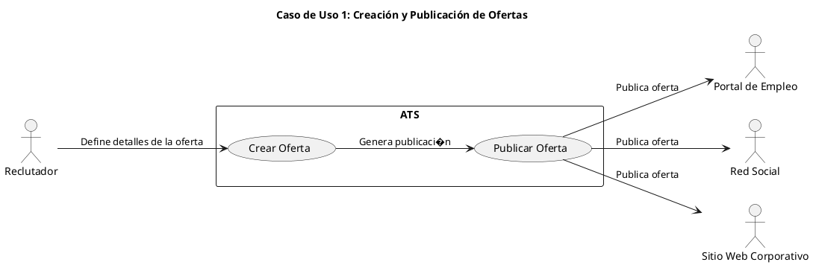
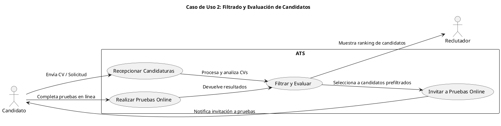
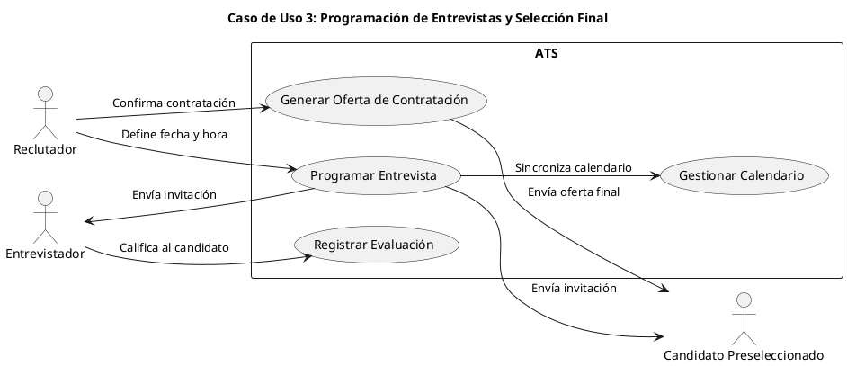
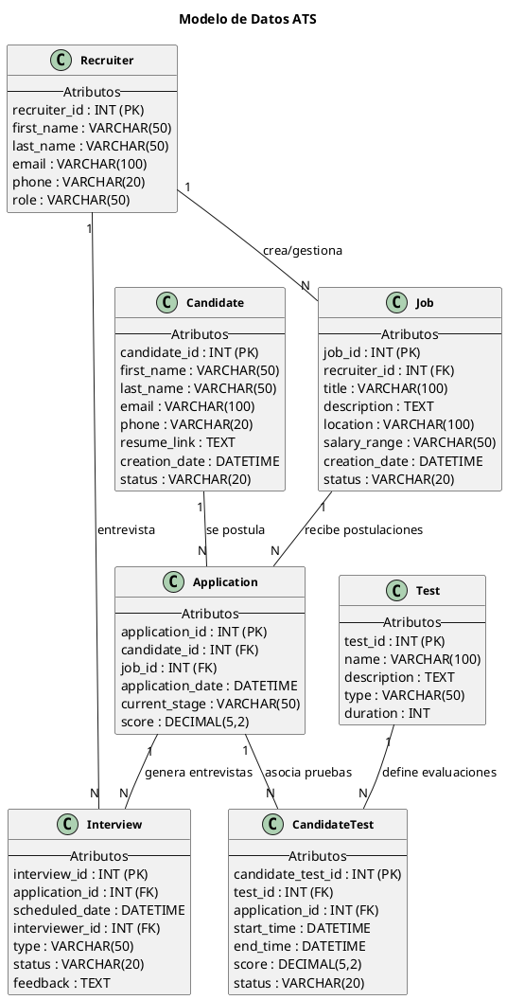
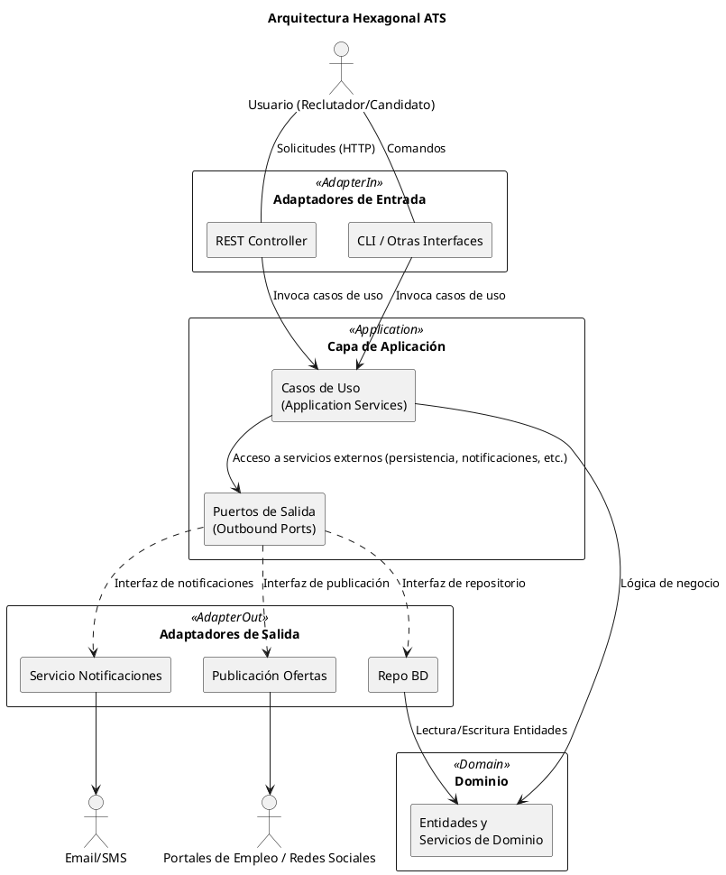

# --------DESCRIPCIÓN INICIAL--------

# Propuesta de Sistema ATS (Applicant Tracking System)

A continuación, se presenta la propuesta de un sistema ATS tomando como base el diagrama circular adjunto, que muestra el flujo general de funcionamiento de la aplicación.

---

## 1. Descripción del Funcionamiento del Software

El diagrama describe un ciclo continuo con los siguientes pasos:

1. **Creación de Ofertas**: Se definen y configuran las posiciones vacantes dentro de la empresa.
2. **Publicación de Ofertas**: Las ofertas se publican en portales de empleo, redes sociales y el sitio web corporativo.
3. **Recepción de Candidaturas**: El sistema centraliza y almacena todas las solicitudes de empleo.
4. **Revisión de Aplicaciones**: Se aplican filtros y criterios preestablecidos para la preselección de candidatos.
5. **Realización de Pruebas Online**: Los candidatos preseleccionados pueden someterse a pruebas técnicas, psicométricas u otras.
6. **Programación de Entrevistas**: Se gestionan y coordinan entrevistas (presenciales o virtuales) con los candidatos que superan las pruebas.
7. **Selección y Contratación**: Se eligen los candidatos idóneos y se les hace la oferta laboral, completando así el ciclo.

Este flujo se repite de manera cíclica para cada nueva posición vacante, permitiendo a la empresa mantener un proceso de reclutamiento continuo y optimizado.

---

## 2. Valor Añadido y Ventajas Competitivas

- **Automatización Integral**: Disminuye la carga de trabajo manual en cada etapa del proceso de reclutamiento.  
- **Centralización de Datos**: Un repositorio único para toda la información de los candidatos y vacantes.  
- **Filtrado Inteligente y Evaluaciones Online**: Herramientas de IA para preseleccionar candidatos de manera más efectiva.  
- **Experiencia de Candidato Optimizada**: Comunicaciones automáticas y seguimiento personalizado que mejoran la percepción de la empresa.  
- **Análisis y Mejora Continua**: Métricas e informes en tiempo real que ayudan a refinar la estrategia de reclutamiento.

---

## 3. Funciones Principales del Software

1. **Creación y Gestión de Ofertas**  
   Permite diseñar y gestionar las ofertas de empleo, estableciendo los requisitos y criterios de selección.

2. **Publicación en Múltiples Canales**  
   Se integra con portales de empleo, redes sociales y el sitio web corporativo para una mayor difusión.

3. **Recepción y Almacenamiento de Candidaturas**  
   Centraliza toda la información de los aspirantes, facilitando la búsqueda y organización de CVs.

4. **Revisión y Filtrado Automatizado**  
   Utiliza algoritmos de IA para preseleccionar candidatos basados en criterios como experiencia, habilidades y otros parámetros configurables.

5. **Pruebas Online y Evaluaciones**  
   Ofrece la posibilidad de realizar test técnicos, psicométricos u otros, dentro de la misma plataforma.

6. **Programación de Entrevistas**  
   Permite coordinar y agendar entrevistas con sincronización de calendarios y recordatorios automáticos.

7. **Gestión de Contratación**  
   Asiste en la fase final de selección, generando ofertas y recopilando la documentación necesaria para la incorporación.

8. **Reportes y Análisis**  
   Proporciona indicadores clave (tiempo promedio de contratación, tasa de conversión, etc.) para tomar decisiones basadas en datos.

---

## 4. Lean Canvas - Modelo de Negocio

| **Sección**               | **Contenido**                                                                                                                                         |
|---------------------------|-------------------------------------------------------------------------------------------------------------------------------------------------------|
| **Problema**              | - Procesos de selección lentos y costosos.<br>- Falta de visibilidad y centralización de las aplicaciones.<br>- Dificultad para identificar a los mejores candidatos de forma rápida. |
| **Segmentos de Clientes** | - Empresas de todos los tamaños (startups, PYMES y grandes corporaciones).<br>- Agencias de reclutamiento.<br>- Departamentos de RRHH y Talent Acquisition. |
| **Propuesta de Valor Único** | Plataforma integral que simplifica el reclutamiento de principio a fin, incorporando pruebas online, filtrado automatizado y un sistema de analítica avanzada para mejorar la calidad de contratación. |
| **Solución**              | - Creación y publicación de ofertas en múltiples canales.<br>- Filtrado inteligente de candidatos y pruebas online.<br>- Seguimiento en tiempo real y analítica de todo el proceso. |
| **Canales**               | - Marketing digital y SEO.<br>- Redes sociales y webinars.<br>- Alianzas con plataformas de empleo y consultoras de RRHH.<br>- Participación en ferias y eventos de talento. |
| **Fuentes de Ingresos**   | - Modelo de suscripción (SaaS).<br>- Servicios premium: consultoría, soporte personalizado, integraciones a medida.                                     |
| **Estructura de Costos**  | - Desarrollo y mantenimiento de la plataforma.<br>- Infraestructura en la nube.<br>- Marketing y ventas.<br>- Soporte al cliente y actualizaciones. |
| **Métricas Clave**        | - Tiempo promedio de contratación.<br>- Tasa de conversión de candidatos a empleados.<br>- Nivel de satisfacción de los clientes (NPS).               |
| **Ventaja Injusta**       | - Integraciones profundas con múltiples portales de empleo y redes profesionales.<br>- Algoritmos propios de IA y Machine Learning para el matching de candidatos.<br>- Equipo con experiencia en desarrollo de software de RRHH y analítica. |

---

# -------CASOS DE USO--------

# Casos de Uso Principales del Sistema ATS

A continuación, se describen los tres casos de uso principales en los que el sistema ATS (Applicant Tracking System) aporta un mayor valor para las organizaciones:

---

## 1. Creación y Publicación de Ofertas

**Descripción:**  
El usuario (generalmente un reclutador o gerente de RRHH) ingresa al sistema para **crear una nueva oferta de trabajo**, especificando el título, descripción, requisitos, ubicación, salario, etc. Una vez finalizada la creación, el sistema **publica automáticamente** la oferta en diversos canales (portales de empleo, redes sociales y el sitio web corporativo).

**Flujo de Actividades:**
1. El reclutador accede al módulo de creación de ofertas.
2. Completa los campos obligatorios (título, descripción, requisitos).
3. Configura la fecha de inicio y fin de la publicación, así como el presupuesto o tipo de publicación (si aplica).
4. El sistema valida la información y registra la oferta en la base de datos.
5. El sistema publica la oferta en los canales seleccionados y notifica al reclutador.

**Beneficios Clave:**
- Ahorro de tiempo al evitar la publicación manual en múltiples plataformas.
- Mayor alcance de la oferta al difundirla en diferentes canales.
- Posibilidad de personalizar y segmentar cada publicación según el público objetivo.

---

## 2. Filtrado y Evaluación de Candidatos

**Descripción:**  
Cuando los candidatos comienzan a postularse, el sistema ATS **recibe y almacena** todos los CVs y datos en un repositorio central. Posteriormente, un **algoritmo de filtrado** (basado en criterios predefinidos o inteligencia artificial) clasifica a los candidatos, priorizando aquellos que cumplen mejor con los requisitos del puesto. Además, el sistema puede incluir **pruebas online** para evaluar habilidades técnicas o competencias específicas.

**Flujo de Actividades:**
1. El reclutador o el sistema revisa las solicitudes entrantes.
2. El algoritmo analiza las palabras clave y la experiencia del candidato (o se aplican criterios de filtrado manuales).
3. Se genera un ranking de los candidatos más adecuados.
4. Los candidatos preseleccionados reciben notificaciones o invitaciones para completar pruebas online.
5. Los resultados de las pruebas se añaden al perfil del candidato, alimentando el ranking y permitiendo un filtrado aún más preciso.

**Beneficios Clave:**
- Ahorro de tiempo y recursos al reducir la revisión manual de grandes volúmenes de CVs.
- Mayor objetividad en la preselección, evitando sesgos y errores humanos.
- Evaluación más completa del candidato al incluir pruebas específicas y técnicas.

---

## 3. Programación de Entrevistas y Selección Final

**Descripción:**  
Una vez identificados los candidatos más prometedores, el reclutador **programa las entrevistas** directamente desde el sistema, integrando calendarios y herramientas de videoconferencia. Los candidatos reciben invitaciones y recordatorios automáticos. Tras las entrevistas, el reclutador **registra los comentarios** y calificaciones en el ATS, lo que facilita la **toma de decisiones** sobre la contratación final.

**Flujo de Actividades:**
1. El reclutador selecciona los candidatos a entrevistar desde el módulo de gestión de candidatos.
2. Se elige la fecha, hora y modalidad de la entrevista (presencial o virtual).
3. El sistema envía invitaciones y recordatorios al candidato y al entrevistador.
4. Tras la entrevista, el reclutador o entrevistador registra sus impresiones y calificaciones en el sistema.
5. Se realiza la selección final del candidato y se genera la oferta laboral desde el ATS, cerrando así el proceso.

**Beneficios Clave:**
- Coordinación eficiente de agendas y reducción de tiempos muertos.
- Seguimiento detallado de cada entrevista y retroalimentación inmediata.
- Toma de decisiones centralizada y basada en información objetiva (calificaciones, notas, etc.).

---






# --------ENTIDADES--------




# ------ALTO NIVEL--------

# Arquitectura Hexagonal para el Sistema ATS

En este documento se presenta una **reestructuración** de la arquitectura del ATS (Applicant Tracking System) siguiendo los **principios de la arquitectura hexagonal**. También conocida como **Arquitectura de Puertos y Adaptadores**, este enfoque busca aislar el **núcleo del negocio** (dominio) de los **detalles de implementación**, de modo que los cambios en las interfaces de usuario, bases de datos o servicios externos no afecten la lógica fundamental de la aplicación.

---

## 1. Principios Básicos de la Arquitectura Hexagonal

1. **Dominio como Núcleo**  
   - Contiene las **entidades** y la **lógica de negocio** principal.  
   - No depende de detalles de infraestructura (frameworks, BD, servicios externos).

2. **Puertos (Ports)**  
   - **Interfaces** que el **dominio** expone o requiere para interactuar con el mundo exterior.  
   - Se clasifican en **puertos de entrada (inbound)** y **puertos de salida (outbound)**.

3. **Adaptadores (Adapters)**  
   - **Implementaciones** concretas de los puertos, conectando el **núcleo** con tecnologías específicas (interfaces web, repositorios de datos, servicios externos, etc.).  
   - Permiten la **inversión de dependencias**: el dominio define la interfaz, y el adaptador la implementa.

4. **Separación de Responsabilidades**  
   - El **dominio** permanece limpio y enfocado en la **lógica de negocio**.  
   - Los **adaptadores** se encargan de la **comunicación** con el exterior (UI, DB, servicios externos).  
   - Los **casos de uso** o **servicios de aplicación** coordinan la interacción entre el dominio y los adaptadores.

---

## 2. Componentes Principales

Siguiendo la filosofía hexagonal, podemos dividir el ATS en las siguientes capas y componentes:

1. **Dominio (Domain Core)**  
   - **Entidades de Negocio**: Ofertas (Job), Candidatos (Candidate), Aplicaciones (Application), Entrevistas (Interview), etc.  
   - **Servicios de Dominio**: Lógica pura que define reglas de filtrado, asignación de entrevistas, cálculo de puntuaciones, etc.  
   - **Agrega valor**: Se centra en **qué** hace el sistema, sin importar **cómo** se implementa la persistencia o la interfaz de usuario.

2. **Aplicación (Application Services / Use Cases)**  
   - **Casos de Uso**: Representan las acciones principales (crear oferta, filtrar candidatos, programar entrevista, etc.).  
   - **Coordina** la interacción entre el **dominio** y los **puertos** de entrada/salida.  
   - Invoca a los **servicios de dominio** cuando se requiere lógica de negocio especializada.  
   - Define los **puertos de entrada** (inbound) y de salida (outbound) que necesita para cumplir cada caso de uso.

3. **Puertos y Adaptadores**  
   - **Puertos de Entrada (Inbound Ports)**:  
     - Exponen los **casos de uso** del sistema a la interfaz de usuario u otros clientes.  
     - Ejemplos: Controladores REST, Controladores GraphQL, CLI, etc.  
   - **Puertos de Salida (Outbound Ports)**:  
     - Interfaces definidas por la aplicación para interactuar con componentes externos (persistencia, servicios de notificación, portales de empleo, etc.).  
     - Ejemplos: Repositorios para guardar y recuperar entidades, servicios de mensajería, integraciones con redes sociales, etc.  
   - **Adaptadores de Entrada**:  
     - Implementan los puertos de entrada, traduciendo las solicitudes del usuario (HTTP, CLI, etc.) a llamadas a los casos de uso.  
   - **Adaptadores de Salida**:  
     - Implementan los puertos de salida, encargándose de la **persistencia** en base de datos, la **publicación** de ofertas en portales externos, el **envío** de correos/SMS, etc.

4. **Infraestructura**  
   - Alojamiento de la aplicación, configuración de bases de datos, contenedores, escalado, etc.  
   - Normalmente no se representa en la arquitectura hexagonal como parte del dominio, sino como detalles externos que pueden variar.

---

## 3. Diagrama de Arquitectura Hexagonal (PlantUML)

El siguiente diagrama ilustra la organización a alto nivel de los componentes, mostrando cómo se encapsula la **lógica de negocio** y cómo se conectan los **adaptadores** (de entrada y salida) mediante los **puertos** correspondientes:



# ----DIAGRAMA C4----

# Diagrama C4 (Contenedores + Componentes) con Desglose de Código para `Interview Entity`

A continuación se presenta un **diagrama C4** que **combina** varios niveles de la metodología:

- **Nivel de Contenedores (C4 Nivel 2)** para mostrar la arquitectura global del ATS (Front-End, Capa de Aplicación, Dominio, Base de Datos, Sistemas Externos).  
- **Nivel de Componentes (C4 Nivel 3)** para detallar las **Entidades y Servicios** dentro del **Domain Model**.  
- **Nivel de Código (C4 Nivel 4)** **exclusivamente** para la **`Interview Entity`**, mostrando su estructura interna (clases, enums, value objects, etc.).

> **Nota**: En C4 se recomienda mantener cada nivel en **diagramas separados**. Aquí se unifica en un **solo diagrama** a petición, lo cual **no** es la práctica habitual, pero sirve para mostrar toda la jerarquía en una única vista.

```plantuml
@startuml
' -------------------------------------------------------------------
' Importamos la librería C4-PlantUML (Contenedores y Componentes)
' -------------------------------------------------------------------
!include https://raw.githubusercontent.com/RicardoNiepel/C4-PlantUML/master/C4_Container.puml
!include https://raw.githubusercontent.com/RicardoNiepel/C4-PlantUML/master/C4_Component.puml
!include https://raw.githubusercontent.com/RicardoNiepel/C4-PlantUML/master/C4_Code.puml

LAYOUT_TOP_DOWN()
title C4 - ATS System con Desglose de Interview Entity (Código)

' -------------------------------------------------------------------
' Actores (Person)
' -------------------------------------------------------------------
Person(recruiter, "Reclutador/Administrador", "Crea y gestiona ofertas, revisa candidatos")
Person(candidate, "Candidato", "Se postula a ofertas y revisa su estado")

' -------------------------------------------------------------------
' Sistemas Externos
' -------------------------------------------------------------------
System_Ext(jobBoard, "Job Boards / Redes Sociales", "Plataformas externas para publicar ofertas (LinkedIn, Indeed, etc.)")
System_Ext(notifService, "Servicio de Notificaciones", "Plataforma externa para enviar correos, SMS, etc.")

' -------------------------------------------------------------------
' System Boundary para el ATS
' -------------------------------------------------------------------
System_Boundary(ATS_Boundary, "ATS System") {
  
  ' Contenedor: Front-End
  Container(frontend, "Front-End (Web UI)", "Framework JS (React, Angular, Vue...)", 
    "Proporciona la interfaz de usuario para Reclutadores y Candidatos")
  
  ' Contenedor: Capa de Aplicación (Use Cases)
  Container(appService, "Application Service", "Capa de Aplicación / Casos de Uso",
    "Orquesta la lógica y coordina la interacción con el dominio y sistemas externos")
  
  ' Contenedor: Base de Datos
  Container(database, "Database", "SQL/NoSQL", 
    "Almacena entidades (Jobs, Candidates, Applications, Interviews, etc.)")

  '
  ' Contenedor-Boundary del Domain Model (arquitectura hexagonal/clean)
  '
  Container_Boundary(domainContainer, "Domain Model", "Contiene las entidades y servicios de negocio") {

    ' -----------------------------------------
    ' Nivel de Componentes dentro del Dominio
    ' -----------------------------------------
    Component(jobEntity, "Job Entity", "Entidad/Agregado", 
      "Representa una oferta de empleo (título, descripción, estado, etc.)")
    Component(candidateEntity, "Candidate Entity", "Entidad/Agregado", 
      "Datos de un candidato (nombre, email, CV, etc.)")
    Component(applicationEntity, "Application Entity", "Entidad/Agregado", 
      "Vincula a un Candidate con un Job y gestiona estados (Applied, Interview, Offer, etc.)")
    Component(testEntity, "Test Entity", "Entidad/Agregado",
      "Pruebas asignadas a un candidato (técnicas, psicométricas) y sus resultados")

    Component(recruitmentService, "Recruitment Service", "Domain Service",
      "Orquesta la lógica de negocio entre múltiples entidades")
    Component(notificationPolicy, "Notification Policy", "Domain Service/Policy",
      "Determina cuándo y cómo disparar notificaciones")

    '
    ' Componente-Boundary específico para Interview Entity,
    ' en el que se desglosa la lógica de código (Nivel 4).
    '
    Component_Boundary(interviewBoundary, "Interview Entity", "Entidad/Agregado") {
      ' A nivel de código (C4-Code)
      Code(interviewClass, "Interview", "Clase principal", 
        "Atributos: dateTime, interviewerId, feedback, status\nMétodos: schedule(), complete(), cancel()")
      Code(interviewStatusEnum, "InterviewStatus", "Enum", 
        "Valores: SCHEDULED, COMPLETED, CANCELED, NO_SHOW, etc.")
      Code(feedbackValueObject, "Feedback", "Value Object", 
        "Información sobre la entrevista (comentarios, calificación, etc.)")
    }
  }
}

' -------------------------------------------------------------------
' Relaciones (Interacciones)
' -------------------------------------------------------------------
' Actores -> Front-End
Rel(recruiter, frontend, "Gestiona ofertas, revisa candidatos", "HTTP(S)")
Rel(candidate, frontend, "Aplica a ofertas, revisa su estado", "HTTP(S)")

' Front-End -> Capa de Aplicación
Rel(frontend, appService, "Invoca casos de uso", "HTTP/REST o GraphQL")

' Capa de Aplicación -> Base de Datos
Rel(appService, database, "Lee/Escribe datos", "SQL/ORM")

' Capa de Aplicación -> Dominio
Rel(appService, domainContainer, "Invoca lógica de negocio (entidades, servicios)", "Llamadas internas")

' Dominio (componentes) -> Relación entre entidades
Rel(jobEntity, applicationEntity, "Una oferta puede tener múltiples postulaciones")
Rel(candidateEntity, applicationEntity, "Un candidato puede tener múltiples postulaciones")
Rel(applicationEntity, interviewBoundary, "Una postulación puede generar varias entrevistas")
Rel(applicationEntity, testEntity, "Una postulación puede asociar varias pruebas")

Rel(recruitmentService, jobEntity, "Crea/actualiza ofertas, valida reglas")
Rel(recruitmentService, applicationEntity, "Gestiona estados de la postulación")
Rel(notificationPolicy, recruitmentService, "Decide cuándo disparar notificaciones (evento de dominio)")

' Relación del Dominio con la DB (si se gestionan repositorios)
Rel(domainContainer, database, "Persistencia de Entidades vía Repositorios")

' Sistemas Externos
Rel(appService, jobBoard, "Publica ofertas", "API Externa")
Rel(appService, notifService, "Envía notificaciones (correos, SMS)", "API Externa")

@enduml

```