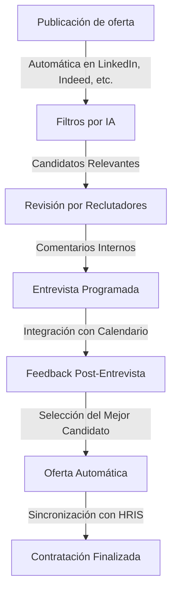
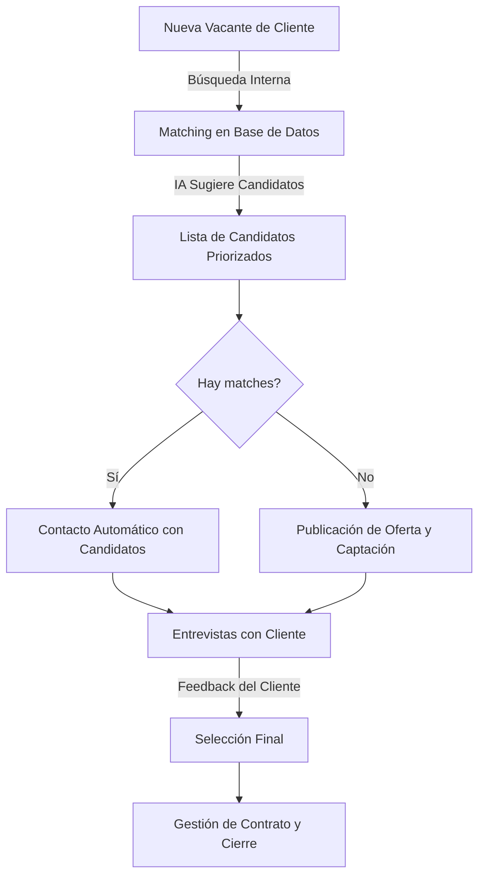
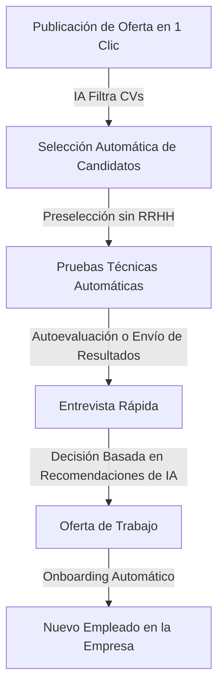
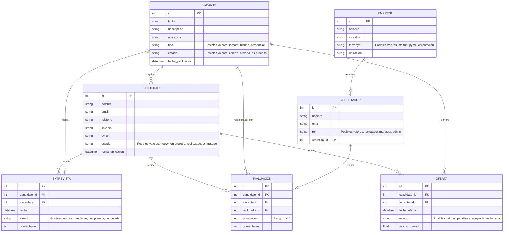
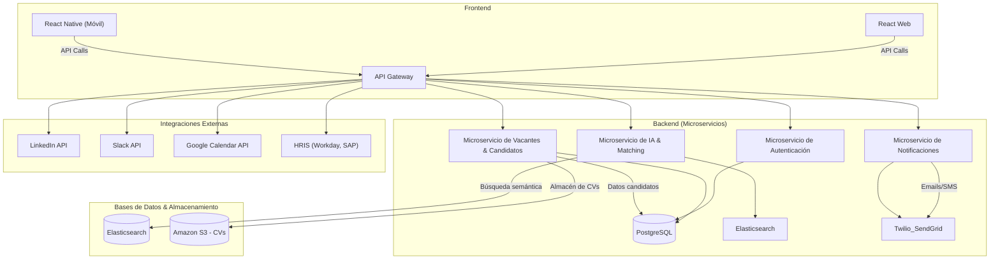
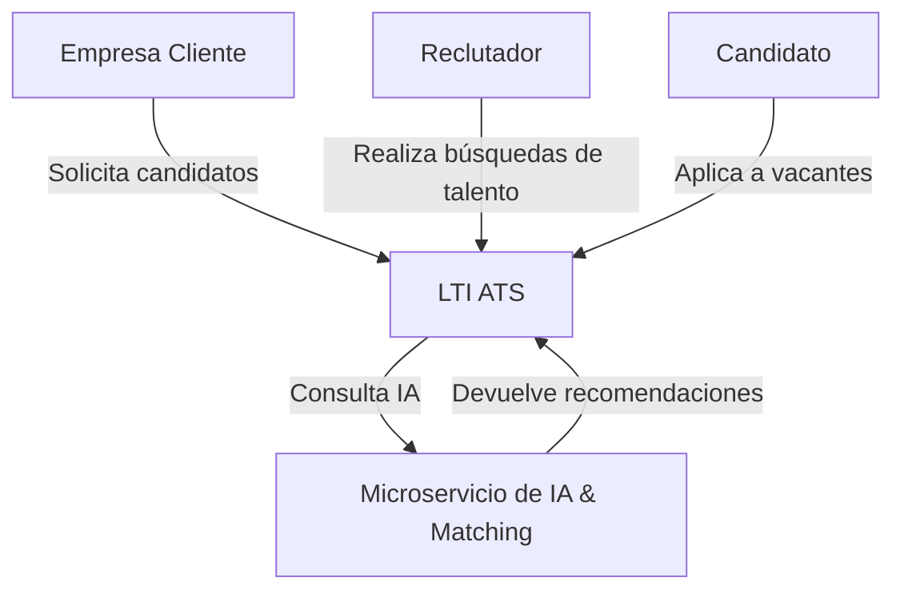
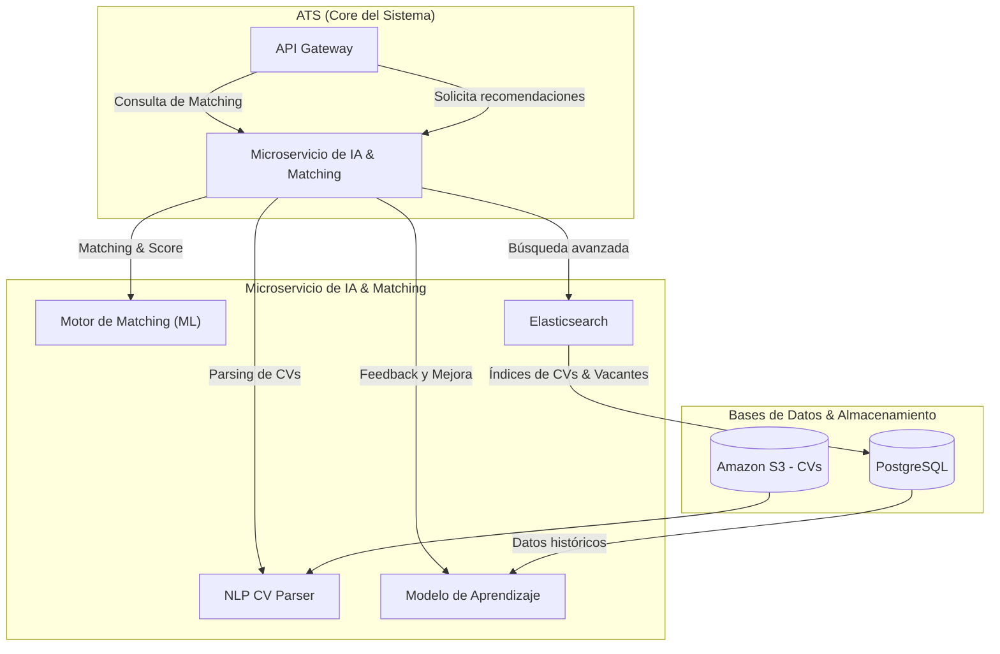
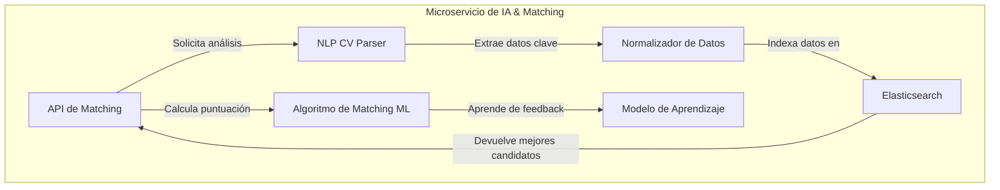

# LTI ATS

## Tabla de Contenidos

1. [Introducción](#introducción)  
   - [Valor añadido](#valor-añadido)  
   - [Ventajas competitivas](#ventajas-competitivas)  
   - [Funciones principales](#funciones-principales)  

2. [Lean Canvas - LTI ATS](#lean-canvas---lti-ats)  

3. [Casos de Uso](#casos-de-uso)  
   - [Caso de Uso 1: Empresa Mediana/Grande](#caso-de-uso-1-empresa-medianagrande-1000-empleados-con-proceso-de-contratación-complejo)  
   - [Caso de Uso 2: Agencia de Reclutamiento](#caso-de-uso-2-agencia-de-reclutamiento-con-gran-volumen-de-candidatos)  
   - [Caso de Uso 3: Startup sin Infraestructura HR](#caso-de-uso-3-startup-que-necesita-contratar-rápido-sin-infraestructura-hr)  

4. [Modelo de Datos](#modelo-de-datos)  

5. [Arquitectura de Alto Nivel](#arquitectura-de-alto-nivel)  
   - [Descripción](#descripción)  
   - [Diagrama](#diagrama)  

6. [Componente: Microservicio de IA & Matching](#componente-microservicio-de-ia--matching)  
   - [Nivel 1 - Contexto](#nivel-1---contexto)  
   - [Nivel 2 - Contenedores](#nivel-2---contenedores)  
   - [Nivel 3 - Componentes](#nivel-3---componentes)  
   - [Nivel 4 - Código](#nivel-4---código)  

7. [Conclusión](#conclusión)  


## Introducción

LTI ATS es un sistema de seguimiento de candidatos (ATS) diseñado para revolucionar el proceso de contratación mediante el uso de inteligencia artificial, automatización avanzada e integraciones fluidas con las herramientas empresariales más utilizadas. Su enfoque en la experiencia de usuario, la eficiencia y la escalabilidad lo convierten en la mejor opción para empresas de todos los tamaños.

### **Valor añadido**  
- **Optimización del tiempo de contratación**: Reducción significativa del tiempo y esfuerzo en la gestión de candidatos.  
- **Automatización inteligente**: IA avanzada para filtrar, analizar y sugerir los mejores perfiles.  
- **Experiencia colaborativa**: Facilita el trabajo en equipo con comentarios en tiempo real y feedback estructurado.  
- **Flexibilidad y escalabilidad**: Adaptable a startups, agencias de reclutamiento y grandes corporaciones.  

### **Ventajas competitivas**  
✅ **IA con NLP avanzado** que analiza y comprende CVs, detectando habilidades y experiencia de manera precisa.  
✅ **Pipeline visual tipo Kanban**, facilitando el seguimiento de candidatos en cada etapa del proceso.  
✅ **Integraciones nativas con Slack, LinkedIn, Google Calendar, Notion y sistemas HRIS**.  
✅ **Automatización del outreach** con respuestas automáticas y seguimientos inteligentes.  
✅ **Experiencia móvil fluida**, permitiendo gestionar contrataciones desde cualquier dispositivo.  

### **Funciones principales**  
- **Publicación de ofertas** en múltiples plataformas con un solo clic.  
- **Filtrado y recomendación de candidatos** mediante IA y machine learning.  
- **Gestión del pipeline de contratación** con un flujo de trabajo visual y personalizable.  
- **Automatización del proceso de entrevistas** con programación inteligente e integración en calendarios.  
- **Colaboración en equipo** con comentarios, evaluaciones y decisiones centralizadas.  
- **Reportes y analíticas en tiempo real** para optimizar la toma de decisiones.  

LTI ATS no es solo un software de reclutamiento, es una plataforma que transforma la contratación en un proceso más tiempo real para optimizar la ágil, efectivo e inteligente.

### Lean Canvas - LTI ATS

| **Sección**            | **Descripción** |
|------------------------|----------------|
| **Problema**          | - Los ATS tradicionales son complejos, poco intuitivos y tardan demasiado en filtrar candidatos. <br> - Falta de automatización real en la gestión de candidatos. <br> - Dificultades en la integración con herramientas de trabajo diarias (Slack, Notion, HRIS, etc.). |
| **Segmento de Clientes** | - Empresas medianas y grandes con procesos de contratación complejos. <br> - Agencias de reclutamiento que gestionan grandes volúmenes de candidatos. <br> - Startups con necesidades de contratación rápidas sin un equipo HR dedicado. |
| **Propuesta de Valor Única** | - **ATS inteligente, intuitivo y automatizado.** <br> - **Reducción del tiempo de contratación mediante IA y automatización avanzada.** <br> - **Integración perfecta con herramientas de trabajo y HRIS.** |
| **Solución**          | - Algoritmo de IA que filtra y recomienda candidatos óptimos. <br> - UX/UI intuitiva con gestión visual tipo Kanban. <br> - Automatización del outreach, entrevistas y onboarding. <br> - Integraciones nativas con herramientas clave. |
| **Canales**          | - Marketing digital (SEO, SEM, LinkedIn Ads). <br> - Partnerships con consultoras de RRHH y empresas tecnológicas. <br> - Eventos de reclutamiento y HR Tech. <br> - Programa de referidos para clientes actuales. |
| **Estructura de Costes** | - Desarrollo y mantenimiento de software. <br> - Infraestructura en la nube (AWS/GCP). <br> - Marketing y adquisición de clientes. <br> - Costes de soporte y customer success. |
| **Flujo de Ingresos** | - Suscripción SaaS mensual/anual por número de usuarios o vacantes activas. <br> - Modelos premium con funcionalidades avanzadas de IA y analítica. <br> - Implementación y soporte premium para grandes empresas. |
| **Ventaja Competitiva** | - Algoritmo de IA con NLP para análisis y filtrado preciso. <br> - UX moderna y adaptada a equipos no técnicos. <br> - Integraciones sin fricción con herramientas clave. <br> - Escalabilidad para startups, agencias y corporaciones. |


## Casos de uso

### **Caso de Uso 1: Empresa Mediana/Grande (1000+ empleados) con Proceso de Contratación Complejo**  
**Problema:**  
Las grandes empresas manejan cientos de aplicaciones para múltiples vacantes simultáneamente. Los procesos suelen ser largos, involucran a múltiples reclutadores y gerentes, y requieren coordinación eficiente.  

**Solución con LTI ATS:**  
- **Automatización del filtrado**: Algoritmo de IA analiza CVs, filtra candidatos y sugiere los más adecuados según criterios personalizables.  
- **Integración con HRIS y otras herramientas**: Se conecta con Workday, SAP, Slack y Outlook para agilizar procesos.  
- **Colaboración en equipo**: Feedback centralizado en tiempo real para que managers y reclutadores tomen decisiones más rápidas.  
- **Reportes y analíticas**: KPI sobre el tiempo de contratación, calidad de los candidatos, y sesgos detectados.  

**Ejemplo de flujo:**  
1. Se publica una oferta de empleo en el ATS y automáticamente se distribuye en LinkedIn, Indeed y portales internos.  
2. Candidatos aplican y la IA filtra automáticamente los perfiles más relevantes.  
3. Reclutadores revisan los perfiles y envían comentarios internos.  
4. Se programan entrevistas mediante la integración con el calendario corporativo.  
5. Se recopila feedback post-entrevista y se selecciona al mejor candidato.  
6. ATS envía la oferta de empleo automáticamente y, tras la aceptación, sincroniza con el sistema HRIS.  



---

### **Caso de Uso 2: Agencia de Reclutamiento con Gran Volumen de Candidatos**  
**Problema:**  
Las agencias manejan grandes bases de datos de candidatos para múltiples clientes y posiciones, lo que dificulta el seguimiento y matching preciso.  

**Solución con LTI ATS:**  
- **Búsqueda semántica avanzada**: ElasticSearch + NLP para encontrar el mejor match entre candidatos y vacantes.  
- **Base de datos de talento proactiva**: Almacena y categoriza candidatos previamente contactados para futuras oportunidades.  
- **Gestión multiempresa**: Permite manejar clientes distintos con portales de empleo personalizados.  
- **Automatización de outreach**: Mensajes automáticos a candidatos adecuados cuando aparece una vacante relevante.  

**Ejemplo de flujo:**  
1. La agencia recibe un nuevo encargo de contratación de un cliente.  
2. ATS analiza la base de datos y sugiere candidatos ya existentes.  
3. Si no hay buenos matches, se lanza una campaña de captación en LinkedIn y otras plataformas.  
4. Reclutadores contactan a candidatos automáticamente mediante email/SMS integrados.  
5. Candidatos interesados son programados para entrevistas con el cliente final.  
6. Se recopilan evaluaciones y se gestiona la contratación final.  



---

### **Caso de Uso 3: Startup que Necesita Contratar Rápido sin Infraestructura HR**  
**Problema:**  
Las startups suelen tener equipos pequeños y no cuentan con un equipo de RRHH dedicado. Necesitan contratar rápido sin complicaciones.  

**Solución con LTI ATS:**  
- **Interfaz ultrafácil**: Configuración rápida sin necesidad de expertos en HR.  
- **Plantillas y automatización**: Publicación de ofertas en un clic y automatización del seguimiento de candidatos.  
- **Recomendación de candidatos basada en cultura**: IA aprende de los valores de la startup y sugiere candidatos afines.  
- **Pipeline visual tipo Kanban**: Seguimiento claro de cada candidato en el proceso de selección.  

**Ejemplo de flujo:**  
1. El CEO o CTO publica una oferta en minutos usando plantillas predefinidas.  
2. La IA filtra automáticamente los mejores perfiles sin que el equipo tenga que revisar cientos de CVs.  
3. Los candidatos seleccionados reciben pruebas técnicas automáticas (si aplican).  
4. Se agendan entrevistas con un par de clics mediante integración con Google Calendar.  
5. Se toma una decisión rápida basada en las recomendaciones de la IA y feedback de los entrevistadores.  
6. El onboarding se gestiona automáticamente con integraciones en Notion, Slack y Google Workspace.  



## Modelo de Datos


- **CANDIDATO**: Representa a los postulantes con información de contacto, CV y estado del proceso.  
- **VACANTE**: Define la oferta de trabajo, su descripción, ubicación y estado.  
- **EMPRESA**: Representa a la organización que usa el ATS.  
- **RECLUTADOR**: Son los usuarios del ATS que gestionan el proceso de selección.  
- **ENTREVISTA**: Registro de cada encuentro entre candidato y reclutador.  
- **EVALUACION**: Feedback estructurado de los reclutadores sobre un candidato en una vacante.  
- **OFERTA**: Registro de las propuestas de empleo enviadas a candidatos.  




## Arquitectura de Alto Nivel

### Descripción
LTI ATS está diseñado como un **sistema SaaS escalable en la nube**, con una arquitectura basada en microservicios para garantizar **flexibilidad, rendimiento y alta disponibilidad**. Se compone de:

1. **Frontend (Aplicación Web & Móvil)**  
   - Desarrollado en **React** (Web) y **React Native** (Móvil).  
   - UI moderna con UX optimizada para reclutadores y candidatos.  
   - Conexión vía API REST y WebSockets con el backend.  

2. **Backend (Microservicios con Node.js & Python)**  
   - **API Gateway** centraliza la gestión de peticiones.  
   - **Microservicio de Autenticación** con JWT y OAuth2.  
   - **Microservicio de Gestión de Vacantes y Candidatos**.  
   - **Microservicio de IA** para filtrado y recomendación de candidatos (NLP + Machine Learning).  
   - **Microservicio de Notificaciones** para emails, SMS y alertas en Slack.  

3. **Base de Datos & Almacenamiento**  
   - **PostgreSQL** para almacenamiento relacional de candidatos, vacantes y entrevistas.  
   - **Elasticsearch** para búsqueda semántica avanzada.  
   - **Amazon S3** para almacenar CVs y documentos de candidatos.  

4. **Servicios Externos & Integraciones**  
   - Integraciones con **LinkedIn, Slack, Google Calendar, HRIS (Workday, SAP)**.  
   - Notificaciones a través de **Twilio (SMS), SendGrid (Emails), Webhooks**.  
   - Autenticación con **OAuth2 (Google, LinkedIn, Microsoft)**.  

---

### Diagrama



## Componente: Microservicio de IA & Matching

### **Descripción del Microservicio**
El **Microservicio de IA & Matching** es el núcleo del ATS en lo que respecta a la selección y recomendación de candidatos. Utiliza **Procesamiento de Lenguaje Natural (NLP)** y **Machine Learning** para analizar CVs, evaluar coincidencias con las vacantes y mejorar continuamente mediante feedback de reclutadores.

#### **Principales Funcionalidades**
✅ **Parsing y normalización de CVs**: Extrae datos estructurados de archivos PDF, DOCX y TXT.  
✅ **Análisis semántico**: Identifica experiencia, habilidades y palabras clave en base a modelos NLP.  
✅ **Matching de candidatos con vacantes**: Algoritmo que asigna un score de compatibilidad.  
✅ **Aprendizaje continuo**: Ajuste del algoritmo basado en decisiones previas de los reclutadores.  
✅ **Búsqueda semántica avanzada**: Motor de búsqueda basado en Elasticsearch y embeddings de texto.  

---

### **Nivel 1 - Contexto**



### **Nivel 2 - Contenedores**



### **Nivel 3 - Componentes**



### **Nivel 4 - Código**

```python
from sklearn.metrics.pairwise import cosine_similarity
from sentence_transformers import SentenceTransformer
import numpy as np

# Modelo de embeddings de texto
model = SentenceTransformer('all-MiniLM-L6-v2')

def calcular_matching(cv_text, job_desc):
    """Calcula la similitud entre un CV y una descripción de trabajo."""
    emb_cv = model.encode(cv_text)
    emb_job = model.encode(job_desc)
    
    score = cosine_similarity([emb_cv], [emb_job])[0][0]
    return round(score * 100, 2)

# Ejemplo de uso
cv = "Desarrollador Python con experiencia en NLP y Machine Learning."
job = "Buscamos un ingeniero de software especializado en procesamiento de lenguaje natural."

print(f"Matching Score: {calcular_matching(cv, job)}%")
```

## Conclusión

LTI ATS representa una evolución en los sistemas de seguimiento de candidatos, abordando los desafíos clave del reclutamiento moderno con una combinación de **inteligencia artificial, automatización y diseño centrado en el usuario**. Desde su arquitectura escalable basada en microservicios hasta sus avanzadas capacidades de búsqueda semántica y matching, el sistema está diseñado para ofrecer una experiencia de contratación eficiente, precisa y libre de fricciones.

Los casos de uso analizados demuestran cómo LTI ATS **se adapta a las necesidades de empresas de diferentes tamaños**, permitiendo a grandes corporaciones gestionar procesos de contratación complejos, a agencias de reclutamiento optimizar la gestión de talento y a startups contratar con rapidez sin necesidad de un equipo de RRHH dedicado. Su modelo de datos bien estructurado y su integración con herramientas clave como Slack, LinkedIn y Google Calendar garantizan una experiencia fluida y altamente funcional.

El uso de IA en el procesamiento y análisis de candidatos, junto con un **motor de matching basado en NLP**, convierte a LTI ATS en un sistema de nueva generación que no solo **automatiza el reclutamiento, sino que lo optimiza continuamente** mediante aprendizaje automático y feedback en tiempo real.

Con una arquitectura **segura, escalable y flexible**, LTI ATS está preparado para convertirse en el **ATS del futuro**, ofreciendo a las empresas una herramienta potente para encontrar y seleccionar el mejor talento con la máxima eficiencia.