# LTI-ATS: El Sistema de Seguimiento de Candidatos del Futuro

## Descripción del Software

LTI-ATS es un sistema de seguimiento de candidatos (Applicant Tracking System) revolucionario diseñado para transformar la forma en que las empresas gestionan sus procesos de reclutamiento y selección. A diferencia de los ATS tradicionales que se centran principalmente en la automatización de tareas administrativas, LTI-ATS pone el foco en la colaboración en tiempo real, la toma de decisiones basada en datos y la experiencia tanto del reclutador como del candidato.

Nuestra plataforma integra tecnologías avanzadas de inteligencia artificial y aprendizaje automático para no solo filtrar candidatos, sino para predecir su rendimiento potencial, encaje cultural y probabilidad de permanencia a largo plazo. Todo esto presentado en una interfaz intuitiva y atractiva que elimina la curva de aprendizaje típica de los sistemas empresariales.

## Lean Canvas de Modelo de Negocio

```
+------------------------+------------------------+------------------------+------------------------+
| PROBLEMA               | SOLUCIÓN               | PROPUESTA DE VALOR     | VENTAJA COMPETITIVA    |
|                        |                        |                        |                        |
| - Procesos de          | - IA predictiva para   | - Reducción del 40%    | - IA conversacional    |
|   reclutamiento lentos |   evaluación de        |   en tiempo de         |   integrada            |
| - Decisiones basadas   |   candidatos           |   contratación         | - Plataforma           |
|   en intuición, no     | - Colaboración en      | - Mejora en calidad    |   omnicanal            |
|   en datos             |   tiempo real          |   de contrataciones    | - Personalización      |
| - Mala experiencia     | - Automatización       | - Experiencia superior |   sin código           |
|   del candidato        |   inteligente          |   para candidatos      | - Ecosistema abierto   |
| - Falta de             | - Análisis predictivo  | - Colaboración         | - Modelo de precios    |
|   colaboración entre   |   y recomendaciones    |   efectiva entre       |   transparente         |
|   departamentos        |   accionables          |   equipos              | - Enfoque en           |
|                        |                        |                        |   diversidad e         |
|                        |                        |                        |   inclusión            |
+------------------------+------------------------+------------------------+------------------------+
| SEGMENTOS DE CLIENTES  | MÉTRICAS CLAVE         | CANALES                | ESTRUCTURA DE COSTOS   |
|                        |                        |                        |                        |
| - Empresas medianas    | - Tasa de adopción     | - Ventas directas      | - Desarrollo de        |
|   (50-500 empleados)   | - Tiempo promedio de   | - Marketing digital    |   producto             |
| - Empresas grandes     |   contratación         | - Partnerships con     | - Infraestructura      |
|   (500+ empleados)     | - Calidad de           |   consultoras HR       |   cloud                |
| - Sectores de alto     |   contrataciones       | - Webinars y eventos   | - Ventas y marketing   |
|   crecimiento          | - NPS de candidatos    |   del sector           | - Soporte al cliente   |
| - Industrias con       | - Retención de         | - Programa de          | - Investigación y      |
|   escasez de talento   |   clientes             |   referidos            |   desarrollo           |
|                        |                        |                        |                        |
+------------------------+------------------------+------------------------+------------------------+
|                        FUENTES DE INGRESOS                               |
|                                                                          |
| - Suscripción base por número de usuarios                                |
| - Tarifas por volumen de contrataciones                                  |
| - Módulos premium (IA avanzada, análisis predictivo)                     |
| - Servicios de implementación y personalización                          |
| - Formación y certificación                                              |
|                                                                          |
+--------------------------------------------------------------------------+
```

### Conclusión

LTI-ATS representa un salto cualitativo en la forma en que las empresas abordan el reclutamiento y la selección de personal. Al combinar tecnologías avanzadas con un profundo entendimiento de las necesidades reales de los equipos de recursos humanos, nuestra plataforma no solo automatiza procesos, sino que transforma fundamentalmente la experiencia de contratación para todos los involucrados.

En un mercado laboral cada vez más competitivo, donde el talento es el factor diferencial más importante para el éxito empresarial, LTI-ATS proporciona las herramientas necesarias para identificar, atraer y retener a los mejores profesionales de manera eficiente y efectiva. 

## Valor Añadido

LTI-ATS aporta un valor diferencial en varios aspectos clave:

1. **Reducción drástica del tiempo de contratación**: Nuestros algoritmos de IA acortan el ciclo de reclutamiento hasta en un 40%, permitiendo a las empresas asegurar el mejor talento antes que la competencia.

2. **Mejora en la calidad de las contrataciones**: El sistema de evaluación predictiva identifica a los candidatos con mayor potencial de éxito en la organización, reduciendo la rotación y los costos asociados.

3. **Experiencia del candidato superior**: Interfaz amigable, comunicación personalizada y feedback continuo que mejora la percepción de la marca empleadora.

4. **Colaboración efectiva**: Herramientas de trabajo en equipo que permiten a reclutadores y gerentes tomar decisiones conjuntas en tiempo real, eliminando los silos departamentales.

5. **Insights accionables**: Análisis avanzado que no solo muestra lo que ha pasado, sino que predice tendencias y recomienda acciones específicas para optimizar el proceso.

## Ventajas Competitivas

LTI-ATS se distingue de la competencia por:

1. **IA Conversacional Integrada**: Asistente virtual que guía tanto a reclutadores como a candidatos a través del proceso, respondiendo preguntas y proporcionando recomendaciones personalizadas.

2. **Plataforma Verdaderamente Omnicanal**: Experiencia consistente y fluida a través de web, móvil, email y mensajería, permitiendo interacciones desde cualquier dispositivo o canal.

3. **Personalización Sin Código**: Los usuarios pueden adaptar completamente el sistema a sus necesidades específicas sin conocimientos técnicos o dependencia de desarrolladores.

4. **Ecosistema Abierto**: Arquitectura API-first que permite integraciones nativas con cualquier herramienta del stack tecnológico de la empresa.

5. **Modelo de Precios Transparente**: Estructura de costos clara basada en el valor generado, sin sorpresas ni costos ocultos.

6. **Enfoque en Diversidad e Inclusión**: Herramientas específicas para eliminar sesgos inconscientes en el proceso de selección y promover equipos diversos.

## Funciones Principales

### 1. Sourcing Inteligente
- Búsqueda proactiva de candidatos en múltiples fuentes
- Recomendación automática de candidatos pasivos
- Enriquecimiento de perfiles con datos públicos relevantes

### 2. Gestión Avanzada de Candidatos
- Pipeline visual personalizable
- Seguimiento automatizado de interacciones
- Sistema de etiquetado y categorización flexible

### 3. Colaboración en Tiempo Real
- Espacios de trabajo compartidos para equipos de contratación
- Herramientas de comunicación integradas
- Sistema de votación y consenso para decisiones grupales

### 4. Evaluación Predictiva
- Análisis de compatibilidad con la cultura organizacional
- Predicción de rendimiento basada en datos históricos
- Identificación de habilidades transferibles no evidentes

### 5. Automatización Inteligente
- Flujos de trabajo personalizables
- Comunicaciones automatizadas pero personalizadas
- Programación inteligente de entrevistas

### 6. Análisis y Reportes Avanzados
- Dashboards personalizables en tiempo real
- Predicciones de tendencias de contratación
- Recomendaciones accionables para optimización

### 7. Experiencia del Candidato Premium
- Portal del candidato intuitivo y atractivo
- Comunicación transparente sobre el estado del proceso
- Feedback constructivo automatizado

### 8. Integración con el Ecosistema HR
- Conexión nativa con sistemas HRIS, nómina y onboarding
- Integraciones con herramientas de productividad (Slack, Teams, etc.)
- API abierta para desarrollos personalizados

## Casos de Uso Principales

Basándonos en las características diferenciales de LTI-ATS, hemos identificado los tres casos de uso más importantes que demuestran el valor único de nuestra plataforma.

### 1. Evaluación Predictiva de Candidatos

Este caso de uso representa una de las principales innovaciones de LTI-ATS: el uso de inteligencia artificial avanzada para evaluar a los candidatos no solo por su experiencia y habilidades evidentes, sino por su potencial de éxito en la organización.

**Descripción:** El sistema analiza datos estructurados (CV, formularios) y no estructurados (entrevistas, respuestas a preguntas abiertas) de los candidatos, combinándolos con datos históricos de contrataciones exitosas en la empresa. Mediante algoritmos de aprendizaje automático, predice el rendimiento potencial, encaje cultural y probabilidad de retención a largo plazo de cada candidato.

**Actores involucrados:**
- Reclutador/RRHH
- Gerente de contratación
- Candidato
- Sistema de IA
- Base de conocimiento de contrataciones previas

**Diagrama de Caso de Uso:**

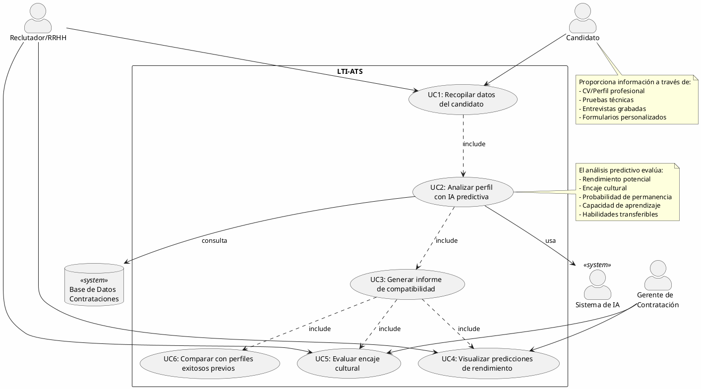
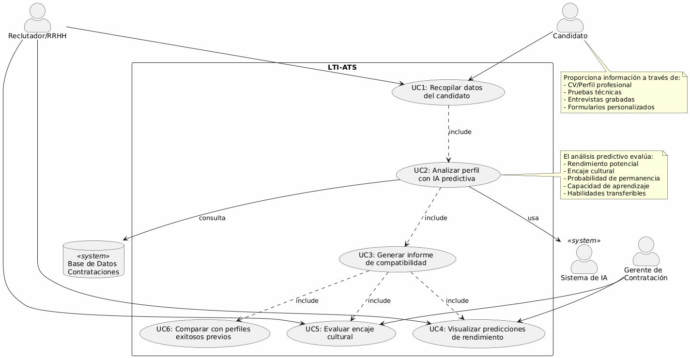

### 2. Colaboración en Tiempo Real para Toma de Decisiones

Este caso de uso destaca la capacidad de LTI-ATS para eliminar los silos departamentales y facilitar la toma de decisiones colaborativa entre todos los involucrados en el proceso de contratación.

**Descripción:** El sistema proporciona un espacio de trabajo compartido donde reclutadores, gerentes y cualquier otra persona relevante en el proceso puede evaluar candidatos, dejar comentarios, votar y tomar decisiones en tiempo real, sin importar su ubicación física. Incluye notificaciones instantáneas, sesiones de evaluación sincronizadas y herramientas de consenso para acelerar el proceso de decisión.

**Actores involucrados:**
- Reclutador/RRHH
- Gerente de contratación
- Equipo entrevistador
- Director/Ejecutivo
- Sistema de notificaciones

**Diagrama de Caso de Uso:**

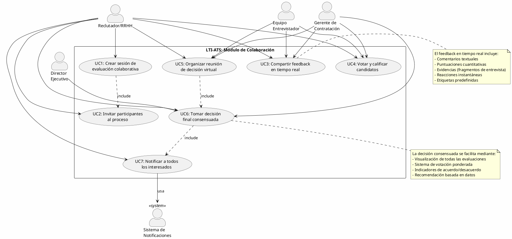
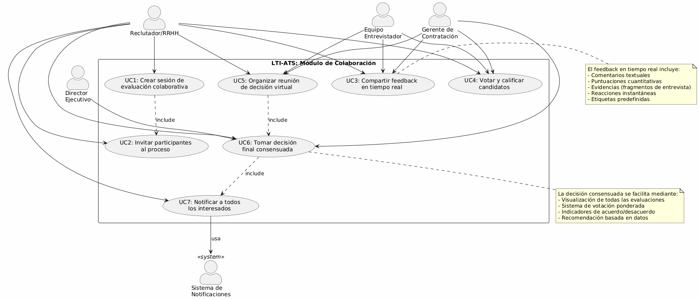


### 3. Experiencia Omnicanal del Candidato

Este caso de uso representa la visión de LTI-ATS sobre una experiencia de candidato superior y fluida a través de todos los canales y dispositivos, mejorando significativamente la percepción de la marca empleadora.

**Descripción:** El sistema ofrece una experiencia consistente y personalizada para los candidatos a través de múltiples canales (web, móvil, email, mensajería instantánea), permitiéndoles interactuar con la empresa desde cualquier dispositivo. Incluye comunicación proactiva, actualizaciones de estado en tiempo real, feedback constructivo y un asistente virtual para resolver dudas en cualquier momento.

**Actores involucrados:**
- Candidato
- Reclutador/RRHH
- Asistente Virtual IA
- Sistemas de comunicación (email, SMS, chat)
- Plataformas de dispositivos (web, móvil, tablet)

**Diagrama de Caso de Uso:**

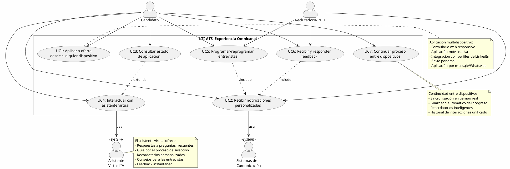
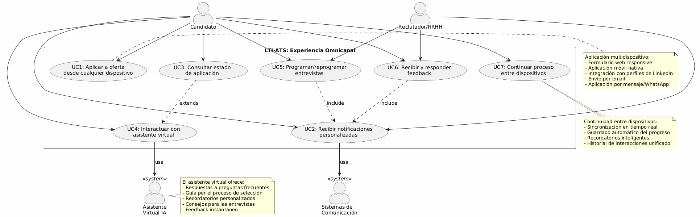

## Modelo de Datos

El siguiente modelo de datos ha sido diseñado para soportar los tres casos de uso principales del sistema LTI-ATS: Evaluación Predictiva de Candidatos, Colaboración en Tiempo Real y Experiencia Omnicanal del Candidato.

### Diagrama de Entidades

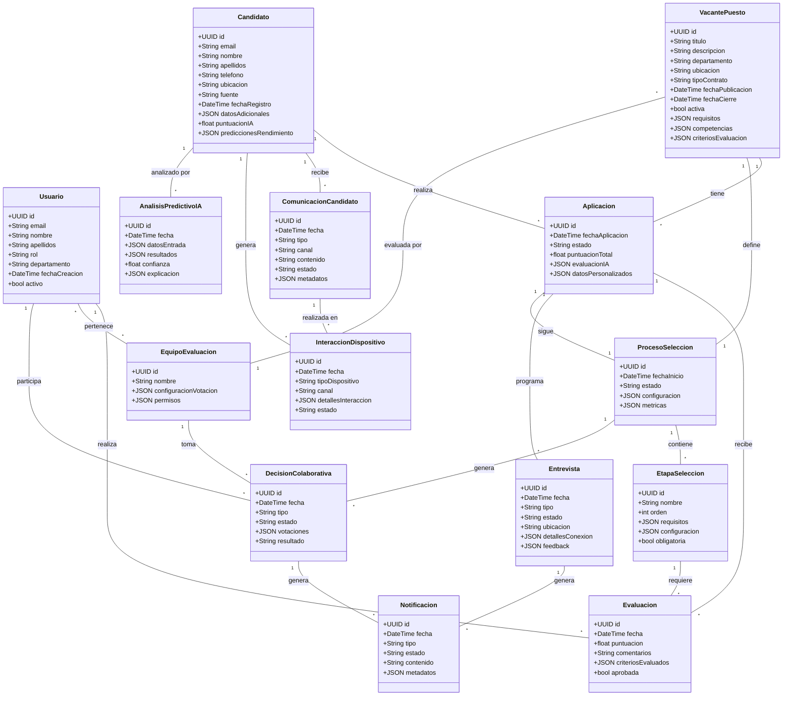
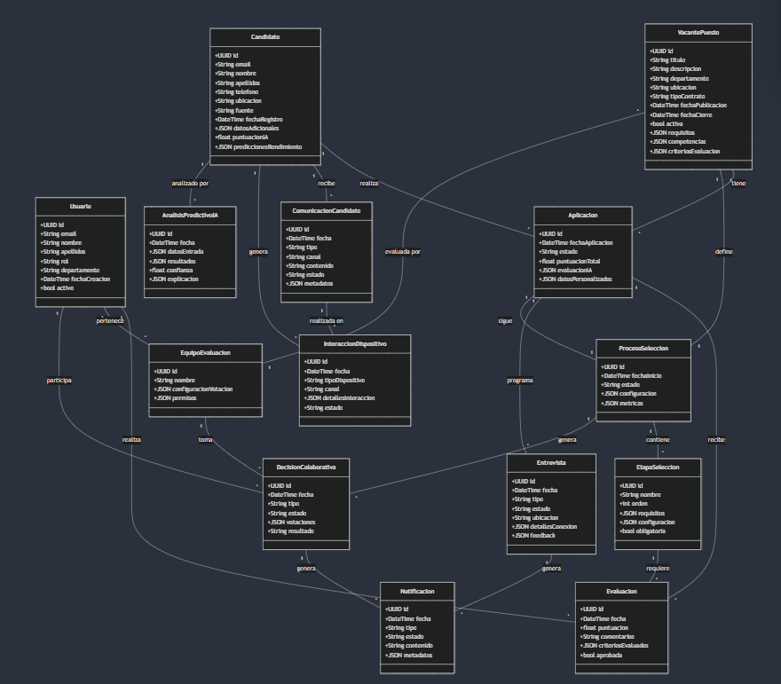

### Descripción de Entidades y Relaciones

#### Entidades Principales

1. **Usuario**
   - Representa a todos los usuarios del sistema (reclutadores, gerentes, evaluadores)
   - Almacena información básica y permisos
   - Roles diferenciados para distintos niveles de acceso

2. **Candidato**
   - Información completa del candidato
   - Incluye campos para evaluación predictiva
   - Almacena histórico de interacciones

3. **VacantePuesto**
   - Detalles completos de la posición
   - Criterios de evaluación
   - Requisitos y competencias necesarias

4. **Aplicacion**
   - Vincula candidatos con vacantes
   - Seguimiento del proceso
   - Evaluaciones y puntuaciones

5. **ProcesoSeleccion**
   - Define el flujo completo de selección
   - Configurable por vacante
   - Métricas y seguimiento

#### Entidades de Evaluación y Colaboración

6. **Evaluacion**
   - Registra evaluaciones individuales
   - Criterios específicos por etapa
   - Puntuaciones y comentarios

7. **EquipoEvaluacion**
   - Grupos de evaluadores
   - Configuración de votación
   - Permisos específicos

8. **DecisionColaborativa**
   - Registro de decisiones grupales
   - Sistema de votación
   - Resultados y justificaciones

#### Entidades de IA y Análisis

9. **AnalisisPredictivoIA**
   - Resultados de evaluación IA
   - Predicciones de rendimiento
   - Explicabilidad de decisiones

#### Entidades de Comunicación y Experiencia

10. **ComunicacionCandidato**
    - Registro de todas las interacciones
    - Múltiples canales
    - Estado y seguimiento

11. **InteraccionDispositivo**
    - Seguimiento omnicanal
    - Experiencia consistente
    - Métricas de uso

12. **Notificacion**
    - Sistema centralizado de notificaciones
    - Múltiples canales
    - Personalización por tipo

### Consideraciones Técnicas

1. **Escalabilidad**
   - Uso de UUIDs para identificadores
   - Campos JSON para flexibilidad
   - Diseño para alto volumen de datos

2. **Flexibilidad**
   - Campos personalizables
   - Configuración por proceso
   - Extensibilidad mediante JSON

3. **Seguridad**
   - Segregación por roles
   - Auditoría de cambios
   - Protección de datos sensibles

4. **Rendimiento**
   - Índices optimizados
   - Relaciones eficientes
   - Campos calculados cuando necesario

## Diseño del Sistema y Arquitectura

Tras analizar los requisitos funcionales, casos de uso y modelo de datos para LTI-ATS, se ha diseñado una arquitectura que maximiza la escalabilidad, resiliencia, flexibilidad y capacidad de evolución del sistema.

### Selección del Patrón Arquitectónico

Para LTI-ATS, hemos seleccionado una **arquitectura de microservicios basada en eventos** como patrón arquitectónico principal, complementada con elementos de arquitectura hexagonal (ports & adapters) para cada microservicio. Esta elección se fundamenta en:

1. **Escalabilidad independiente**: Cada componente funcional puede escalar según sus propias necesidades.
2. **Despliegue independiente**: Actualizaciones y mejoras pueden implementarse por servicio sin afectar al sistema completo.
3. **Resistencia a fallos**: El aislamiento entre servicios evita que los fallos se propaguen a todo el sistema.
4. **Flexibilidad tecnológica**: Cada microservicio puede utilizar las tecnologías más adecuadas para su función específica.
5. **Desarrollo en paralelo**: Equipos diferentes pueden trabajar simultáneamente en distintos microservicios.
6. **Comunicación asíncrona**: Esencial para la colaboración en tiempo real y la experiencia omnicanal.

### Diagrama de Arquitectura del Sistema

```mermaid
graph TB
    subgraph "Frontend Layer"
        W[Web App]
        M[Mobile App]
        CB[Chatbot/Widget]
        API[API Gateway]
    end

    subgraph "Backend Services"
        subgraph "Core Services"
            CS[Candidate Service]
            VS[Vacancy Service]
            AS[Application Service]
            PS[Process Service]
        end

        subgraph "Collaboration Services"
            ES[Evaluation Service]
            TS[Team Service]
            DS[Decision Service]
            NS[Notification Service]
        end

        subgraph "AI & Analytics Services"
            PA[Predictive Analytics]
            RC[Recommendation Engine]
            NLP[NLP Processing]
            BI[BI & Reporting]
        end

        subgraph "Communication Services"
            CM[Communication Manager]
            EM[Email Service]
            SMS[SMS Service]
            PS2[Push Notification]
        end

        subgraph "Integration Services"
            IS[Integration Service]
            WH[Webhook Manager]
            ESB[Event Service Bus]
        end
    end

    subgraph "Shared Infrastructure"
        DB[(Databases)]
        ES2[Event Store]
        FS[File Storage]
        CD[Cache & Redis]
        SH[Search Engine]
    end

    subgraph "External Systems"
        JB[Job Boards]
        SM[Social Media]
        HR[HR Systems]
        CL[Calendar Systems]
        VD[Video Platforms]
    end

    %% Conexiones principales
    W & M & CB --> API
    API --> CS & VS & AS & PS & ES & TS & DS & NS & PA & CM
    
    %% Event Bus conecta todos los servicios
    CS & VS & AS & PS & ES & TS & DS & NS & PA & RC & NLP & BI & CM & EM & SMS & PS2 & IS <--> ESB
    
    %% Conexiones con infraestructura compartida
    CS & VS & AS & PS & ES & TS & DS & NS & PA & RC & NLP & BI & CM --> DB
    ESB <--> ES2
    CS & VS & AS & PS --> FS
    CS & VS & AS & PS & ES & TS & DS & NS & PA & RC --> CD
    CS & VS & AS & PS & PA --> SH
    
    %% Conexiones con sistemas externos
    IS --> JB & SM & HR & CL & VD
    WH --> JB & SM & HR
```
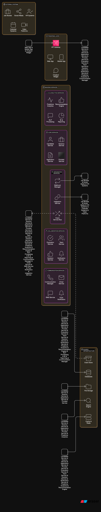

### Descripción de Componentes

#### 1. Capa de Frontend

- **Web App**: Aplicación web responsive para acceso desde navegadores.
- **Mobile App**: Aplicaciones nativas para iOS y Android.
- **Chatbot/Widget**: Interfaz conversacional embebible en sitios web o aplicaciones.
- **API Gateway**: Punto único de entrada para todas las interacciones con el backend, maneja autenticación, enrutamiento y agregación de datos.

#### 2. Servicios Core

- **Candidate Service**: Gestión de toda la información relacionada con candidatos, perfiles y habilidades.
- **Vacancy Service**: Administración de puestos vacantes, requisitos y descripciones.
- **Application Service**: Manejo de aplicaciones de candidatos a puestos específicos.
- **Process Service**: Orquestación de los procesos de selección y sus etapas.

#### 3. Servicios de Colaboración

- **Evaluation Service**: Gestión de evaluaciones, calificaciones y feedback.
- **Team Service**: Administración de equipos de evaluación y permisos.
- **Decision Service**: Facilitación de decisiones colaborativas y votaciones.
- **Notification Service**: Distribución de notificaciones a todos los actores del sistema.

#### 4. Servicios de IA y Analítica

- **Predictive Analytics**: Algoritmos para la evaluación predictiva de candidatos.
- **Recommendation Engine**: Sistema de recomendación para candidatos y acciones.
- **NLP Processing**: Procesamiento de lenguaje natural para análisis de CV y entrevistas.
- **BI & Reporting**: Generación de informes y análisis avanzados.

#### 5. Servicios de Comunicación

- **Communication Manager**: Orquestador central de todas las comunicaciones multicanal.
- **Email Service**: Gestión de correos electrónicos, plantillas y seguimiento.
- **SMS Service**: Envío y seguimiento de mensajes SMS.
- **Push Notification**: Gestión de notificaciones push para dispositivos móviles.

#### 6. Servicios de Integración

- **Integration Service**: Gestión de integraciones con sistemas externos.
- **Webhook Manager**: Administración de webhooks para eventos externos.
- **Event Service Bus**: Bus de eventos central para la comunicación asíncrona entre servicios.

#### 7. Infraestructura Compartida

- **Databases**: Bases de datos políglotas (relacionales, documentales, grafos) según necesidades.
- **Event Store**: Almacenamiento persistente de eventos para event sourcing.
- **File Storage**: Almacenamiento de archivos (CV, documentos, videos).
- **Cache & Redis**: Capa de caché para acceso rápido a datos frecuentes.
- **Search Engine**: Motor de búsqueda para búsquedas avanzadas de candidatos y vacantes.


### Patrones de Diseño Implementados

1. **API Gateway**: Punto único de entrada para clientes externos.
2. **Event Sourcing**: Almacenamiento de eventos como fuente de verdad.
3. **CQRS**: Separación de operaciones de lectura y escritura para optimizar rendimiento.
4. **Circuit Breaker**: Prevención de fallos en cascada entre servicios.
5. **Saga Pattern**: Gestión de transacciones distribuidas.
6. **Hexagonal Architecture**: Para cada microservicio, separando lógica de negocio de adaptadores externos.
7. **Publisher-Subscriber**: Comunicación asíncrona a través del bus de eventos.
8. **Domain-Driven Design**: Modelado de dominios complejos (evaluación, colaboración).

### Consideraciones Técnicas

#### Escalabilidad y Alta Disponibilidad

- Arquitectura cloud-native diseñada para autoescalado.
- Despliegue en múltiples zonas/regiones para alta disponibilidad.
- Sistemas de balanceo de carga automáticos.
- Bases de datos particionadas para crecimiento horizontal.

#### Seguridad

- Implementación de OAuth 2.0 y OpenID Connect para autenticación y autorización.
- Cifrado de datos en tránsito y en reposo.
- Segmentación de red y principio de mínimo privilegio.
- Auditoría completa y registro de acciones sensibles.
- Protección contra ataques comunes (OWASP Top 10).

#### Rendimiento

- Estrategia de cachés en múltiples niveles.
- Optimización de consultas y almacenamiento.
- Procesamiento asíncrono para tareas intensivas.
- Monitorización continua de rendimiento.

#### Observabilidad

- Logging centralizado con análisis en tiempo real.
- Trazas distribuidas para seguimiento de transacciones.
- Métricas detalladas de rendimiento y uso.
- Dashboards operativos y alertas automatizadas.

### Tecnologías Recomendadas

- **Backend**: Node.js, Go, Python
- **Frontend**: React, Vue.js
- **Bases de datos**: PostgreSQL, MongoDB, Redis
- **Búsqueda**: Elasticsearch
- **Event Bus**: Kafka, RabbitMQ
- **Infraestructura**: Kubernetes, Docker
- **Cloud**: AWS, Azure, GCP
- **IA/ML**: TensorFlow, PyTorch, scikit-learn

### Estrategia de Despliegue

La arquitectura está diseñada para soportar CI/CD con despliegues frecuentes e incrementales:

1. **Gestión de configuración** mediante GitOps
2. **Pruebas automatizadas** en cada nivel (unitarias, integración, sistema)
3. **Despliegues canary** para validar cambios con tráfico real limitado
4. **Rollbacks automatizados** en caso de detección de problemas
5. **Entornos de desarrollo, pruebas, staging y producción** claramente separados

## Diagrama C4: Colaboración en Tiempo Real

Para profundizar en la arquitectura, desarrollaremos un diagrama C4 del componente "Servicios de Colaboración", que es clave para uno de nuestros casos de uso principales.

### Nivel 1: Contexto del Sistema

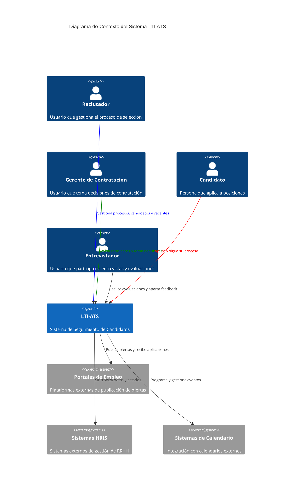


### Nivel 2: Contenedores

```mermaid
C4Container
    title Contenedores del Sistema LTI-ATS
    
    Person(recruiter, "Reclutador", "Usuario que gestiona el proceso de selección")
    Person(hiringManager, "Gerente de Contratación", "Usuario que toma decisiones de contratación")
    Person(interviewer, "Entrevistador", "Usuario que participa en entrevistas y evaluaciones")
    
    System_Boundary(ltiAts, "LTI-ATS") {
        Container(webApp, "Aplicación Web", "React, NextJS", "Interfaz principal para usuarios internos")
        Container(mobileApp, "Aplicación Móvil", "React Native", "Interfaz móvil para usuarios internos")
        Container(candidatePortal, "Portal del Candidato", "React, NextJS", "Interfaz para candidatos")
        
        Container(apiGateway, "API Gateway", "Node.js, Express", "Punto de entrada único a servicios backend")
        
        Container(coreServices, "Servicios Core", "Node.js, Go", "Gestión de candidatos, vacantes, aplicaciones")
        Container(collaborationServices, "Servicios de Colaboración", "Node.js", "Evaluación, decisiones y notificaciones")
        Container(aiServices, "Servicios de IA", "Python, TensorFlow", "Análisis predictivo y recomendaciones")
        Container(communicationServices, "Servicios de Comunicación", "Go", "Gestión de comunicaciones multicanal")
        
        ContainerDb(databases, "Bases de Datos", "PostgreSQL, MongoDB", "Almacenamiento persistente de datos")
        ContainerDb(eventStore, "Event Store", "Kafka, Redis", "Almacenamiento de eventos y mensajería")
        ContainerDb(fileStorage, "Almacenamiento de Archivos", "S3, MinIO", "Almacenamiento de documentos y archivos")
    }
    
    Rel(recruiter, webApp, "Utiliza", "HTTPS")
    Rel(recruiter, mobileApp, "Utiliza en movilidad", "HTTPS")
    Rel(hiringManager, webApp, "Utiliza", "HTTPS")
    Rel(hiringManager, mobileApp, "Utiliza en movilidad", "HTTPS")
    Rel(interviewer, webApp, "Utiliza", "HTTPS")
    Rel(interviewer, mobileApp, "Utiliza en movilidad", "HTTPS")
    
    Rel(webApp, apiGateway, "Realiza peticiones a", "JSON/HTTPS")
    Rel(mobileApp, apiGateway, "Realiza peticiones a", "JSON/HTTPS")
    Rel(candidatePortal, apiGateway, "Realiza peticiones a", "JSON/HTTPS")
    
    Rel(apiGateway, coreServices, "Enruta peticiones a", "JSON/HTTPS")
    Rel(apiGateway, collaborationServices, "Enruta peticiones a", "JSON/HTTPS")
    Rel(apiGateway, aiServices, "Enruta peticiones a", "JSON/HTTPS")
    Rel(apiGateway, communicationServices, "Enruta peticiones a", "JSON/HTTPS")
    
    Rel(coreServices, databases, "Lee/Escribe", "SQL/NoSQL")
    Rel(collaborationServices, databases, "Lee/Escribe", "SQL/NoSQL")
    Rel(aiServices, databases, "Lee", "SQL/NoSQL")
    Rel(communicationServices, databases, "Lee", "SQL/NoSQL")
    
    Rel(coreServices, eventStore, "Publica/Suscribe", "Events")
    Rel(collaborationServices, eventStore, "Publica/Suscribe", "Events")
    Rel(aiServices, eventStore, "Suscribe", "Events")
    Rel(communicationServices, eventStore, "Suscribe", "Events")
    
    Rel(coreServices, fileStorage, "Lee/Escribe", "API")
    Rel(collaborationServices, fileStorage, "Lee", "API")
    
    UpdateRelStyle(apiGateway, collaborationServices, $textColor="blue", $lineColor="blue", $lineStyle="bold")
    UpdateRelStyle(collaborationServices, databases, $textColor="blue", $lineColor="blue", $lineStyle="bold")
    UpdateRelStyle(collaborationServices, eventStore, $textColor="blue", $lineColor="blue", $lineStyle="bold")
```


### Nivel 3: Componentes de los Servicios de Colaboración

```mermaid
C4Component
    title Componentes de los Servicios de Colaboración
    
    Container_Boundary(collaborationServices, "Servicios de Colaboración") {
        Component(evaluationService, "Servicio de Evaluación", "Node.js, Express", "Gestiona las evaluaciones y resultados de entrevistas")
        Component(teamService, "Servicio de Equipos", "Node.js, Express", "Gestiona equipos de evaluación y sus configuraciones")
        Component(decisionService, "Servicio de Decisiones", "Node.js, Express", "Gestiona proceso de toma de decisiones colaborativas")
        Component(notificationService, "Servicio de Notificaciones", "Node.js, Express", "Gestiona y distribuye notificaciones")
        
        Component(evaluationAPI, "API de Evaluación", "REST/GraphQL", "API para operaciones relacionadas con evaluaciones")
        Component(teamAPI, "API de Equipos", "REST/GraphQL", "API para operaciones relacionadas con equipos")
        Component(decisionAPI, "API de Decisiones", "REST/GraphQL", "API para operaciones de toma de decisiones")
        Component(notificationAPI, "API de Notificaciones", "REST/GraphQL", "API para gestión de notificaciones")
        
        Component(evaluationRepo, "Repositorio de Evaluaciones", "Repository Pattern", "Acceso a datos de evaluaciones")
        Component(teamRepo, "Repositorio de Equipos", "Repository Pattern", "Acceso a datos de equipos")
        Component(decisionRepo, "Repositorio de Decisiones", "Repository Pattern", "Acceso a datos de decisiones")
        Component(notificationRepo, "Repositorio de Notificaciones", "Repository Pattern", "Acceso a datos de notificaciones")
        
        Component(eventPublisher, "Publicador de Eventos", "Publisher Pattern", "Publica eventos al bus de eventos")
        Component(eventSubscriber, "Suscriptor de Eventos", "Subscriber Pattern", "Procesa eventos del bus de eventos")
        
        Component(realTimeHub, "Hub de Tiempo Real", "WebSockets", "Gestiona comunicaciones en tiempo real")
    }
    
    Container(apiGateway, "API Gateway", "Node.js, Express", "Punto de entrada único a servicios backend")
    ContainerDb(databases, "Bases de Datos", "PostgreSQL, MongoDB", "Almacenamiento persistente")
    ContainerDb(eventStore, "Event Store", "Kafka", "Bus de eventos")
    Container(coreServices, "Servicios Core", "Node.js", "Servicios principales del sistema")
    
    Rel(apiGateway, evaluationAPI, "Enruta peticiones a", "JSON/HTTPS")
    Rel(apiGateway, teamAPI, "Enruta peticiones a", "JSON/HTTPS")
    Rel(apiGateway, decisionAPI, "Enruta peticiones a", "JSON/HTTPS")
    Rel(apiGateway, notificationAPI, "Enruta peticiones a", "JSON/HTTPS")
    
    Rel(evaluationAPI, evaluationService, "Usa", "Method Calls")
    Rel(teamAPI, teamService, "Usa", "Method Calls")
    Rel(decisionAPI, decisionService, "Usa", "Method Calls")
    Rel(notificationAPI, notificationService, "Usa", "Method Calls")
    
    Rel(evaluationService, evaluationRepo, "Usa", "Method Calls")
    Rel(teamService, teamRepo, "Usa", "Method Calls")
    Rel(decisionService, decisionRepo, "Usa", "Method Calls")
    Rel(notificationService, notificationRepo, "Usa", "Method Calls")
    
    Rel(evaluationRepo, databases, "Lee/Escribe", "SQL/NoSQL")
    Rel(teamRepo, databases, "Lee/Escribe", "SQL/NoSQL")
    Rel(decisionRepo, databases, "Lee/Escribe", "SQL/NoSQL")
    Rel(notificationRepo, databases, "Lee/Escribe", "SQL/NoSQL")
    
    Rel(evaluationService, eventPublisher, "Publica eventos", "Method Calls")
    Rel(teamService, eventPublisher, "Publica eventos", "Method Calls")
    Rel(decisionService, eventPublisher, "Publica eventos", "Method Calls")
    Rel(notificationService, eventPublisher, "Publica eventos", "Method Calls")
    
    Rel(eventPublisher, eventStore, "Envía eventos a", "Apache Kafka")
    Rel(eventStore, eventSubscriber, "Consume eventos de", "Apache Kafka")
    
    Rel(eventSubscriber, evaluationService, "Notifica", "Method Calls")
    Rel(eventSubscriber, teamService, "Notifica", "Method Calls")
    Rel(eventSubscriber, decisionService, "Notifica", "Method Calls")
    Rel(eventSubscriber, notificationService, "Notifica", "Method Calls")
    
    Rel(notificationService, realTimeHub, "Envía actualizaciones a", "WebSockets")
    Rel(apiGateway, realTimeHub, "Conecta con", "WebSockets")
    
    Rel(coreServices, eventStore, "Publica eventos en", "Apache Kafka")
    
    UpdateRelStyle(decisionService, decisionRepo, $textColor="red", $lineColor="red", $lineStyle="bold")
    UpdateRelStyle(decisionRepo, databases, $textColor="red", $lineColor="red", $lineStyle="bold")
    UpdateRelStyle(decisionService, eventPublisher, $textColor="red", $lineColor="red", $lineStyle="bold")
    UpdateRelStyle(eventPublisher, eventStore, $textColor="red", $lineColor="red", $lineStyle="bold")
    UpdateRelStyle(notificationService, realTimeHub, $textColor="blue", $lineColor="blue", $lineStyle="bold")
```


### Nivel 4: Código del Servicio de Decisiones

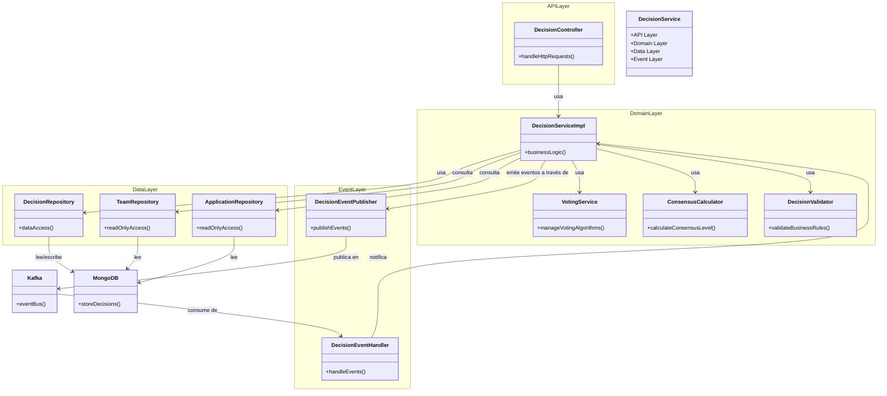
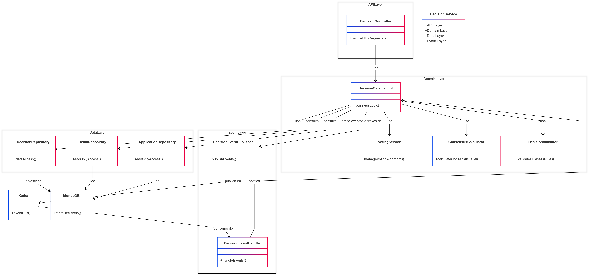

### Flujo de Toma de Decisiones Colaborativas

1. Un reclutador o gerente de contratación inicia una sesión de decisión colaborativa a través de la aplicación web o móvil.
2. El API Gateway enruta la solicitud al Servicio de Decisiones.
3. El Servicio de Decisiones crea una nueva sesión de decisión en la base de datos y emite un evento "DecisionSessionCreated".
4. El Servicio de Notificaciones recibe este evento y envía notificaciones a todos los miembros del equipo a través de múltiples canales.
5. Los miembros del equipo se unen a la sesión y envían sus evaluaciones y votos.
6. El Servicio de Decisiones calcula en tiempo real el nivel de consenso y actualiza el estado de la decisión.
7. Cuando se alcanza un umbral predefinido o todos los miembros han votado, el Servicio de Decisiones marca la decisión como finalizada y emite un evento "DecisionCompleted".
8. Este evento desencadena actualizaciones en otros servicios, como actualizar el estado de la aplicación del candidato en el Servicio de Aplicaciones.
9. El Servicio de Notificaciones informa a todos los participantes sobre el resultado final.

### Conclusiones sobre la Arquitectura

La arquitectura propuesta para LTI-ATS proporciona:

1. **Flexibilidad excepcional** para evolucionar y extender el sistema según cambien las necesidades del negocio.
2. **Escalabilidad** para manejar desde pequeñas empresas hasta grandes corporaciones con millones de candidatos.
3. **Resiliencia** ante fallos, evitando puntos únicos de fallo y permitiendo la degradación elegante de funcionalidades.
4. **Observabilidad completa** para monitorizar y diagnosticar problemas rápidamente.
5. **Seguridad por diseño** en todos los niveles de la arquitectura.
6. **Soporte para innovación** con capacidad para integrar rápidamente nuevas tecnologías y algoritmos de IA.
7. **Experiencia omnicanal consistente** para todos los usuarios del sistema.

Esta arquitectura está diseñada no solo para cumplir con los requisitos actuales, sino para adaptarse a los cambios futuros en el panorama del reclutamiento y la selección de personal, garantizando que LTI-ATS mantenga su ventaja competitiva a largo plazo.