# Log de Prompts - Proyecto LTI-ATS

## Prompt 1
**Fecha:** 16 de marzo de 2025
**Modelo:** Claude 3.7 Sonnet-thinking

**Usuario:** 
Eres un experto en producto, con experiencia en sistemas ATS.
- ¿Qué funcionalidades básicas tiene un ATS? Descríbemelas en un listado, ordenado de mayor a menor prioridad
- ¿Qué beneficios obtiene el cliente de un ATS para considerar su uso?
- ¿Qué alternativas tiene a usar un ATS y cuando pueden ser relevantes?
- ¿Cómo es el customer journey normal de un cliente que usa un ATS? Descríbeme paso a paso todas las interacciones
 

Ten en cuenta que la idea es crear un nuevo software que revolucione el dia a dia del recruiting y destaque por encima de todos sus actuales competidores. Para ello si es necesario haz un analisis de la competencia:
- ¿Qué ATS open source son más conocidos?
- ¿Qué ATS comerciales son más conocidos? Compáralos en función de sus 3 pricipales funcionalidades
- ¿Como pdríamos destacar frente a ellos?


Una vez realizadas estas tareas anteriores, necesitamos describir el software de LTI, valor añadido y ventajas competitivas, asi como la explicación de las funciones principales y añadir un diagrama Lean Canvas para entender el modelo de negocio.

**Asistente:**
Veo que necesito investigar sobre sistemas ATS para un proyecto nuevo. Permíteme realizar algunas búsquedas para proporcionar la información más actualizada.

# Funcionalidades básicas de un ATS (ordenadas por prioridad)

1. **Gestión y seguimiento de candidatos** - Sistema centralizado para organizar perfiles, currículums y estados de los candidatos a lo largo del proceso de selección.

2. **Publicación y difusión de ofertas de empleo** - Capacidad para publicar vacantes en múltiples plataformas (portales de empleo, redes sociales, página web corporativa) con un solo clic.

3. **Filtrado y búsqueda inteligente de candidatos** - Herramientas para filtrar aplicaciones según requisitos específicos, palabras clave y competencias relevantes.

4. **Automatización de comunicaciones** - Envío automatizado de correos de confirmación, actualizaciones de estado y seguimiento a candidatos.

5. **Programación y gestión de entrevistas** - Herramientas para coordinar entrevistas, enviar invitaciones y sincronizar con calendarios.

6. **Evaluación colaborativa de candidatos** - Sistemas para recopilar feedback estructurado del equipo sobre los candidatos entrevistados.

7. **Análisis y reportes de métricas de contratación** - Datos sobre tiempo de contratación, fuentes de candidatos, costos y otros KPIs relevantes.

8. **Integración con herramientas de RRHH** - Compatibilidad con sistemas de gestión de personal, nómina y onboarding.

9. **Cumplimiento normativo y protección de datos** - Funciones para garantizar el cumplimiento de normativas como RGPD.

10. **Herramientas de IA y análisis semántico** - Capacidades avanzadas para analizar perfiles, encontrar coincidencias y evaluar candidatos con mayor precisión.

# Beneficios de un ATS para el cliente

1. **Ahorro de tiempo** - Automatización de tareas repetitivas que antes requerían horas de trabajo manual.

2. **Reducción de costos** - Menor necesidad de personal dedicado a tareas administrativas y menor costo por contratación.

3. **Mejora en la calidad de contrataciones** - Selección más precisa basada en datos objetivos y criterios bien definidos.

4. **Experiencia del candidato mejorada** - Procesos más rápidos, comunicación fluida y feedback oportuno.

5. **Centralización de información** - Todos los datos relevantes en un solo lugar, accesibles para los involucrados.

6. **Decisiones basadas en datos** - Análisis y métricas para optimizar el proceso de contratación.

7. **Mejora del employer branding** - La eficiencia del proceso proyecta una imagen positiva de la empresa.

8. **Cumplimiento normativo** - Gestión segura de datos personales conforme a regulaciones.

9. **Colaboración mejorada** - Facilita la participación de diferentes departamentos en el proceso.

10. **Reducción del tiempo para cubrir vacantes** - Aceleración del proceso completo de reclutamiento.

# Alternativas a usar un ATS

1. **Hojas de cálculo y correo electrónico** - Para empresas pequeñas con pocas contrataciones.
   - **Cuándo es relevante**: Startups o negocios con menos de 5-10 contrataciones anuales.
   - **Limitaciones**: Ineficiente para volúmenes mayores, difícil seguimiento, no centralizado.

2. **Sistemas CRM adaptados** - Usar un CRM existente para gestionar candidatos.
   - **Cuándo es relevante**: Cuando ya se cuenta con un CRM robusto y hay recursos para adaptarlo.
   - **Limitaciones**: No diseñado específicamente para reclutamiento, falta funcionalidades específicas.

3. **Tercerización completa del reclutamiento** - Contratar agencias externas.
   - **Cuándo es relevante**: Cuando se requiere expertise especial o hay picos puntuales de contratación.
   - **Limitaciones**: Mayor costo, menor control sobre el proceso.

4. **Redes sociales profesionales** - LinkedIn Recruiter y herramientas similares.
   - **Cuándo es relevante**: Para búsquedas específicas de perfiles profesionales.
   - **Limitaciones**: No gestiona todo el proceso, enfocado en sourcing más que en seguimiento.

# Customer Journey de un cliente que usa ATS

1. **Identificación de necesidad** - La empresa reconoce que su proceso manual ya no es eficiente.

2. **Investigación de soluciones** - Búsqueda de alternativas ATS que se ajusten a sus necesidades.

3. **Evaluación y prueba** - Solicitud de demos, pruebas gratuitas y comparación de funcionalidades.

4. **Implementación** - Configuración de la plataforma, personalización según necesidades.

5. **Migración de datos** - Traslado de información existente al nuevo sistema.

6. **Capacitación del equipo** - Formación a los usuarios sobre el funcionamiento del ATS.

7. **Uso inicial** - Primeras contrataciones usando el sistema, ajustes según feedback.

8. **Optimización** - Refinamiento de flujos de trabajo, plantillas y automatizaciones.

9. **Integración con otras herramientas** - Conexión con sistemas de RRHH, evaluación, etc.

10. **Análisis de resultados** - Medición de impacto: reducción de tiempo, costos y mejora en calidad.

11. **Escalado** - Expansión del uso a otras áreas, más vacantes o localizaciones.

12. **Renovación o cambio** - Evaluación periódica para determinar si el sistema sigue cubriendo las necesidades.

# ATS Open Source más conocidos

1. **FreeATS** - Sistema de código abierto con versión gratuita que permite hasta 3 posiciones abiertas.

# ATS comerciales más conocidos y sus funcionalidades principales

1. **Greenhouse**
   - Enfoque en colaboración en el proceso de contratación
   - Sistema estructurado de entrevistas
   - Análisis avanzado de diversidad e inclusión

2. **Workable**
   - Publicación en múltiples bolsas de empleo
   - Acceso a una base de datos de más de 400 millones de perfiles
   - Excelente interfaz para volumen de contratación

3. **BambooHR**
   - ATS integrado en suite completa de RRHH
   - Optimizado para equipos híbridos y remotos
   - Ideal para empresas medianas

4. **Pinpoint**
   - Enfoque en experiencia del candidato
   - Precios transparentes
   - Excelente servicio al cliente

5. **Manatal**
   - Funcionalidades de IA a precio asequible
   - Útil tanto para empresas como para agencias
   - Buena relación calidad-precio

# Cómo destacar frente a la competencia

Para que LTI destaque sobre los competidores existentes, podríamos enfocarnos en:

1. **Integración de IA avanzada** - No solo para filtrar candidatos, sino para predecir rendimiento y encaje cultural.

2. **Experiencia de usuario excepcional** - Tanto para reclutadores como para candidatos, con interfaces intuitivas y flujos de trabajo claros.

3. **Colaboración en tiempo real** - Herramientas que faciliten la toma de decisiones conjunta entre reclutadores y gerentes.

4. **Análisis predictivo** - No solo reportes de lo sucedido sino predicciones de tendencias, tiempos y resultados.

5. **Integración con ecosistema de herramientas modernas** - Conexión nativa con plataformas modernas de trabajo como Slack, Microsoft Teams, etc.

6. **Automatización inteligente** - No solo de tareas básicas sino de procesos complejos adaptados a cada organización.

7. **Enfoque en diversidad e inclusión** - Herramientas específicas para reducir sesgos y promover equipos diversos.

8. **Personalización extrema** - Capacidad de adaptar cada aspecto del sistema sin necesidad de desarrolladores.

9. **Modelo de precios transparente y flexible** - Sin costos ocultos y con escalabilidad según necesidades reales.

10. **Comunidad activa y soporte excepcional** - Crear un ecosistema de usuarios que comparten mejores prácticas.

## Prompt 2
**Fecha:** 16 de marzo de 2025
**Modelo:** Claude 3.7 Sonnet

**Usuario:** 
Creo que has realizado un analisis exceppcional, procedamos con la descripción del software LTI y el diagrama Lean Canvas para enteder el modelo de negocio. 
Genera el fichero LTI-DAD.md, dentro de la carpeta **LTI-DAD** con todo ello.


Aparte necesitamos un documento markdown de log de los prompts de nuestra interacción llamado prompts.md. Este deberá tener un formato como el siguiente:

 ```
      ## Prompt [Número]
      **Fecha:** [fecha y hora]
      **Modelo:** [modelo de IA utilizado]

      **Usuario:** 
      [prompt introducido por el usuario]
      
      **Asistente:**
      [prompt completo de salida del agente]
```
Traspasa ahi toda nuestra interacción ya realizada.

**Asistente:**
Voy a crear los archivos solicitados con la información que hemos trabajado.

## Prompt 3
**Fecha:** 16 de marzo de 2025
**Modelo:** Claude 3.7 Sonnet-thinking

**Usuario:**
Basandonos en toda la información obtenida en el anterior paso por nuestro experto en producto y el fichero generado @LTI-DAD.md , toma el rol de un brillante analista de software experto y enumera y describe brevemente los 3 casos de uso más principales a implementar de nuestro sistema. 
Representa estos casos de uso en el tipo de diagrama más adecuado usando el formato platUML, diferenciando entre todos los usuarios involucrados. 
Recuerda definir y describir todo lo que sea necesario acorde a la sintaxis y buenas prácticas UML.

Una vez finalizado actualiza el fichero @prompts.md 

**Asistente:**
He analizado cuidadosamente la información sobre el sistema LTI-ATS y he identificado los tres casos de uso más relevantes que deberían implementarse de manera prioritaria:

1. **Evaluación Predictiva de Candidatos**: Este caso de uso aprovecha la IA avanzada para analizar tanto datos estructurados como no estructurados de los candidatos, y predecir su rendimiento potencial, encaje cultural y permanencia en la organización.

2. **Colaboración en Tiempo Real para Toma de Decisiones**: Este caso de uso facilita la coordinación entre todos los stakeholders del proceso de contratación, permitiendo evaluaciones sincronizadas, votaciones y decisiones consensuadas en tiempo real.

3. **Experiencia Omnicanal del Candidato**: Este caso de uso proporciona una experiencia fluida y consistente para los candidatos a través de múltiples dispositivos y canales de comunicación, mejorando significativamente la percepción de la marca empleadora.

He representado estos casos de uso mediante diagramas UML en formato PlantUML, siguiendo las mejores prácticas:
- Uso de actores claramente diferenciados (humanos y sistemas)
- Relaciones apropiadas entre casos de uso (include, extends)
- Notas explicativas para clarificar funcionalidades
- Estilo visual mejorado con parámetros de personalización

Los diagramas se han incorporado al archivo LTI-DAD.md junto con descripciones detalladas de cada caso de uso y los actores involucrados en cada uno. 

## Prompt 4
**Fecha:** 16 de marzo de 2025
**Modelo:** Claude 3.7 Sonnet

**Usuario:**
Basandonos en toda la informacion obtenida en los anteriores pasos y generada en @LTI-DAD.md, toma el rol de un arquitecto de software experto, capaz de diseña, explicar y diagramar los diferentes aspectos de un sistema software.
Necesitamos que definas todas las entidades de modelo de datos que debería tener nuestro software ATS para cubrir los 3 casos de uso anteriormente definidos y las relacciones entre ellas.
Necesitamos reflejar la definición de este modelo de datos en un diagrama mermaid.
Profundiza al máximo detalle en ello.

**Asistente:**
Como arquitecto de software, he diseñado un modelo de datos completo y detallado que cubre los tres casos de uso principales del sistema LTI-ATS. El modelo incluye:

1. **14 entidades principales** cuidadosamente diseñadas para cubrir todos los aspectos del sistema:
   - Entidades base (Usuario, Candidato, VacantePuesto)
   - Entidades de proceso (Aplicacion, ProcesoSeleccion, EtapaSeleccion)
   - Entidades de evaluación (Evaluacion, EquipoEvaluacion, DecisionColaborativa)
   - Entidades de IA y análisis (AnalisisPredictivoIA)
   - Entidades de comunicación (ComunicacionCandidato, Notificacion, InteraccionDispositivo)

2. **Relaciones detalladas** entre todas las entidades, especificando cardinalidad y roles.

3. **Campos específicos** para cada entidad, incluyendo:
   - Identificadores UUID para escalabilidad
   - Campos JSON para flexibilidad y extensibilidad
   - Campos de auditoría y seguimiento
   - Campos específicos para IA y análisis predictivo

4. **Consideraciones técnicas** sobre:
   - Escalabilidad del modelo
   - Flexibilidad para personalizaciones
   - Seguridad y protección de datos
   - Optimización de rendimiento

El modelo ha sido representado en un diagrama mermaid que muestra claramente todas las entidades y sus relaciones, y se ha incluido una descripción detallada de cada componente en el archivo LTI-DAD.md.

## Prompt 5
**Fecha:** 16 de marzo de 2025
**Modelo:** Claude 3.7 Sonnet

**Usuario:**
Con toda la informacion ya generada y actualizada en @LTI-DAD.md necesitamos ahora realizar el diseño de nuestro sistema y su arquitectura a alto nivel, para ello como nuestro experto arquitecto de software necesitamos que nos ayudes a definir el mejor patron de arquitectura para nuestro sistema. 
Una vez elegido, siguiendo sus mejores practicas, procederemos a diseñar el sistema y su arquitectura a alto nivel.

**Asistente:**
Como arquitecto de software, he diseñado una arquitectura completa para el sistema LTI-ATS basada en microservicios orientados a eventos, complementada con elementos de arquitectura hexagonal.

He seleccionado este patrón arquitectónico por sus ventajas clave para nuestro sistema:
- Escalabilidad independiente de cada componente
- Despliegue independiente de actualizaciones
- Resistencia a fallos mediante aislamiento
- Flexibilidad tecnológica para cada microservicio
- Desarrollo en paralelo por equipos distintos
- Comunicación asíncrona esencial para colaboración en tiempo real

La arquitectura incluye:

1. **Capa de Frontend**: Web App, Mobile App, Chatbot/Widget y API Gateway

2. **Servicios Backend**:
   - **Servicios Core**: Candidate, Vacancy, Application y Process Services
   - **Servicios de Colaboración**: Evaluation, Team, Decision y Notification Services
   - **Servicios de IA**: Predictive Analytics, Recommendation Engine, NLP y BI
   - **Servicios de Comunicación**: Communication Manager, Email, SMS y Push Notifications
   - **Servicios de Integración**: Integration Service, Webhook Manager y Event Service Bus

3. **Infraestructura Compartida**: Databases, Event Store, File Storage, Cache y Search Engine

Para ilustrar la arquitectura propuesta, he creado varios diagramas:
- Diagrama general de arquitectura del sistema
- Diagrama C4 de 4 niveles, profundizando en los Servicios de Colaboración:
  - Nivel 1: Contexto del Sistema
  - Nivel 2: Contenedores del Sistema
  - Nivel 3: Componentes de los Servicios de Colaboración
  - Nivel 4: Detalle del código del Servicio de Decisiones

También he detallado el flujo completo para el caso de uso de Toma de Decisiones Colaborativas, y he incluido consideraciones técnicas sobre escalabilidad, seguridad, rendimiento y observabilidad.

Esta arquitectura proporciona la flexibilidad, escalabilidad y resiliencia necesarias para que LTI-ATS destaque en el mercado y pueda adaptarse a los cambios futuros del sector.

## Prompt 6
**Fecha:** 16 de marzo de 2025
**Modelo:** Claude 3.7 Sonnet

**Usuario:**
¿Qué métricas de rendimiento o requisitos de monitorización deberíamos priorizar para la arquitectura?

**Asistente:**
Como arquitecto de software, recomiendo priorizar las siguientes métricas y requisitos de monitorización, organizados en cinco categorías principales:

1. **Métricas de Experiencia de Usuario**
   - Tiempo de respuesta end-to-end
   - Latencia por dispositivo/canal
   - Tasas de abandono
   - Puntuaciones de satisfacción del candidato (NPS, CSAT)

2. **Métricas de Rendimiento de Microservicios**
   - Latencia de servicios individuales
   - Tasas de throughput
   - Tasas de error
   - Tiempos de procesamiento de eventos

3. **Métricas de Integración Externa**
   - Disponibilidad de APIs
   - Latencia de integraciones
   - Tasas de éxito
   - Tiempos de sincronización

4. **Métricas de Infraestructura**
   - Utilización de recursos (CPU, memoria)
   - Tiempos de respuesta de bases de datos
   - Latencia del bus de eventos
   - Salud del cluster

5. **Métricas de Negocio Accionables**
   - Tiempo medio de contratación
   - Precisión de predicciones de IA
   - Eficiencia en toma de decisiones colaborativas
   - Métricas de diversidad e inclusión

Recomiendo implementar:
- Dashboards operativos en tiempo real enfocados en latencia, tasas de error y throughput
- Dashboards de experiencia de usuario y valor de negocio
- Enfoque de observabilidad basado en logs estructurados, métricas de series temporales y trazas distribuidas

## Prompt 7
**Fecha:** 16 de marzo de 2025
**Modelo:** Claude 3.7 Sonnet

**Usuario:**
¿Qué tecnologías prefieres para los servicios de IA y análisis?

**Asistente:**
Basándome en los casos de uso y requisitos de LTI-ATS, recomiendo la siguiente combinación de tecnologías:

1. **TensorFlow**
   - Ideal para análisis predictivo y procesamiento de entrevistas en video
   - Excelente escalabilidad y capacidades de despliegue con TF Serving
   - Herramientas robustas para explicabilidad de modelos
   - TensorFlow Extended (TFX) para pipelines de entrenamiento continuo

2. **PyTorch + Hugging Face**
   - Perfecto para procesamiento de CV y análisis de respuestas de entrevistas
   - Integración superior con modelos pre-entrenados de NLP
   - Flexibilidad para adaptarse a terminología específica del sector
   - Excelente para prototipado rápido

3. **scikit-learn + Algoritmos Personalizados**
   - Base sólida para motor de recomendaciones inicial
   - Implementación rápida de funcionalidades básicas
   - Algoritmos personalizados para matching especializado
   - Alta interpretabilidad para insights accionables

**Tecnologías Complementarias:**
- MLflow para gestión del ciclo de vida de modelos
- SHAP/LIME para explicabilidad de decisiones
- Elasticsearch para capacidades avanzadas de búsqueda

**Estrategia de Implementación:**
1. Comenzar con implementaciones básicas usando scikit-learn
2. Integrar modelos pre-entrenados NLP con PyTorch/Hugging Face
3. Desarrollar modelos más sofisticados con TensorFlow conforme se acumulen datos
4. Optimizar con algoritmos personalizados para ventajas competitivas únicas

Esta combinación permitirá implementar eficientemente los casos de uso principales mientras mantenemos flexibilidad para evolución futura.

{
    "id": "051d11fb-82ff-46c0-__________________________________________________________________________________________________________________________

Externamente, hemos utilizado Diagram GPT para la generacion del diagrama de nuestra arquitectura, para lo cual le pasamos la definición de esta en nuestro archivo **LTI-DAD.md**

```
### Selección del Patrón Arquitectónico

Para LTI-ATS, hemos seleccionado una **arquitectura de microservicios basada en eventos** como patrón arquitectónico principal, complementada con elementos de arquitectura hexagonal (ports & adapters) para cada microservicio. Esta elección se fundamenta en:

1. **Escalabilidad independiente**: Cada componente funcional puede escalar según sus propias necesidades.
2. **Despliegue independiente**: Actualizaciones y mejoras pueden implementarse por servicio sin afectar al sistema completo.
3. **Resistencia a fallos**: El aislamiento entre servicios evita que los fallos se propaguen a todo el sistema.
4. **Flexibilidad tecnológica**: Cada microservicio puede utilizar las tecnologías más adecuadas para su función específica.
5. **Desarrollo en paralelo**: Equipos diferentes pueden trabajar simultáneamente en distintos microservicios.
6. **Comunicación asíncrona**: Esencial para la colaboración en tiempo real y la experiencia omnicanal.

### Diagrama de Arquitectura del Sistema

```mermaid
graph TB
    subgraph "Frontend Layer"
        W[Web App]
        M[Mobile App]
        CB[Chatbot/Widget]
        API[API Gateway]
    end

    subgraph "Backend Services"
        subgraph "Core Services"
            CS[Candidate Service]
            VS[Vacancy Service]
            AS[Application Service]
            PS[Process Service]
        end

        subgraph "Collaboration Services"
            ES[Evaluation Service]
            TS[Team Service]
            DS[Decision Service]
            NS[Notification Service]
        end

        subgraph "AI & Analytics Services"
            PA[Predictive Analytics]
            RC[Recommendation Engine]
            NLP[NLP Processing]
            BI[BI & Reporting]
        end

        subgraph "Communication Services"
            CM[Communication Manager]
            EM[Email Service]
            SMS[SMS Service]
            PS2[Push Notification]
        end

        subgraph "Integration Services"
            IS[Integration Service]
            WH[Webhook Manager]
            ESB[Event Service Bus]
        end
    end

    subgraph "Shared Infrastructure"
        DB[(Databases)]
        ES2[Event Store]
        FS[File Storage]
        CD[Cache & Redis]
        SH[Search Engine]
    end

    subgraph "External Systems"
        JB[Job Boards]
        SM[Social Media]
        HR[HR Systems]
        CL[Calendar Systems]
        VD[Video Platforms]
    end

    %% Conexiones principales
    W & M & CB --> API
    API --> CS & VS & AS & PS & ES & TS & DS & NS & PA & CM
    
    %% Event Bus conecta todos los servicios
    CS & VS & AS & PS & ES & TS & DS & NS & PA & RC & NLP & BI & CM & EM & SMS & PS2 & IS <--> ESB
    
    %% Conexiones con infraestructura compartida
    CS & VS & AS & PS & ES & TS & DS & NS & PA & RC & NLP & BI & CM --> DB
    ESB <--> ES2
    CS & VS & AS & PS --> FS
    CS & VS & AS & PS & ES & TS & DS & NS & PA & RC --> CD
    CS & VS & AS & PS & PA --> SH
    
    %% Conexiones con sistemas externos
    IS --> JB & SM & HR & CL & VD
    WH --> JB & SM & HR
```



### Descripción de Componentes

#### 1. Capa de Frontend

- **Web App**: Aplicación web responsive para acceso desde navegadores.
- **Mobile App**: Aplicaciones nativas para iOS y Android.
- **Chatbot/Widget**: Interfaz conversacional embebible en sitios web o aplicaciones.
- **API Gateway**: Punto único de entrada para todas las interacciones con el backend, maneja autenticación, enrutamiento y agregación de datos.

#### 2. Servicios Core

- **Candidate Service**: Gestión de toda la información relacionada con candidatos, perfiles y habilidades.
- **Vacancy Service**: Administración de puestos vacantes, requisitos y descripciones.
- **Application Service**: Manejo de aplicaciones de candidatos a puestos específicos.
- **Process Service**: Orquestación de los procesos de selección y sus etapas.

#### 3. Servicios de Colaboración

- **Evaluation Service**: Gestión de evaluaciones, calificaciones y feedback.
- **Team Service**: Administración de equipos de evaluación y permisos.
- **Decision Service**: Facilitación de decisiones colaborativas y votaciones.
- **Notification Service**: Distribución de notificaciones a todos los actores del sistema.

#### 4. Servicios de IA y Analítica

- **Predictive Analytics**: Algoritmos para la evaluación predictiva de candidatos.
- **Recommendation Engine**: Sistema de recomendación para candidatos y acciones.
- **NLP Processing**: Procesamiento de lenguaje natural para análisis de CV y entrevistas.
- **BI & Reporting**: Generación de informes y análisis avanzados.

#### 5. Servicios de Comunicación

- **Communication Manager**: Orquestador central de todas las comunicaciones multicanal.
- **Email Service**: Gestión de correos electrónicos, plantillas y seguimiento.
- **SMS Service**: Envío y seguimiento de mensajes SMS.
- **Push Notification**: Gestión de notificaciones push para dispositivos móviles.

#### 6. Servicios de Integración

- **Integration Service**: Gestión de integraciones con sistemas externos.
- **Webhook Manager**: Administración de webhooks para eventos externos.
- **Event Service Bus**: Bus de eventos central para la comunicación asíncrona entre servicios.

#### 7. Infraestructura Compartida

- **Databases**: Bases de datos políglotas (relacionales, documentales, grafos) según necesidades.
- **Event Store**: Almacenamiento persistente de eventos para event sourcing.
- **File Storage**: Almacenamiento de archivos (CV, documentos, videos).
- **Cache & Redis**: Capa de caché para acceso rápido a datos frecuentes.
- **Search Engine**: Motor de búsqueda para búsquedas avanzadas de candidatos y vacantes.

### Patrones de Diseño Implementados

1. **API Gateway**: Punto único de entrada para clientes externos.
2. **Event Sourcing**: Almacenamiento de eventos como fuente de verdad.
3. **CQRS**: Separación de operaciones de lectura y escritura para optimizar rendimiento.
4. **Circuit Breaker**: Prevención de fallos en cascada entre servicios.
5. **Saga Pattern**: Gestión de transacciones distribuidas.
6. **Hexagonal Architecture**: Para cada microservicio, separando lógica de negocio de adaptadores externos.
7. **Publisher-Subscriber**: Comunicación asíncrona a través del bus de eventos.
8. **Domain-Driven Design**: Modelado de dominios complejos (evaluación, colaboración).

### Consideraciones Técnicas

#### Escalabilidad y Alta Disponibilidad

- Arquitectura cloud-native diseñada para autoescalado.
- Despliegue en múltiples zonas/regiones para alta disponibilidad.
- Sistemas de balanceo de carga automáticos.
- Bases de datos particionadas para crecimiento horizontal.

#### Seguridad

- Implementación de OAuth 2.0 y OpenID Connect para autenticación y autorización.
- Cifrado de datos en tránsito y en reposo.
- Segmentación de red y principio de mínimo privilegio.
- Auditoría completa y registro de acciones sensibles.
- Protección contra ataques comunes (OWASP Top 10).

#### Rendimiento

- Estrategia de cachés en múltiples niveles.
- Optimización de consultas y almacenamiento.
- Procesamiento asíncrono para tareas intensivas.
- Monitorización continua de rendimiento.

#### Observabilidad

- Logging centralizado con análisis en tiempo real.
- Trazas distribuidas para seguimiento de transacciones.
- Métricas detalladas de rendimiento y uso.
- Dashboards operativos y alertas automatizadas.

### Tecnologías Recomendadas

- **Backend**: Node.js, Go, Python
- **Frontend**: React, Vue.js
- **Bases de datos**: PostgreSQL, MongoDB, Redis
- **Búsqueda**: Elasticsearch
- **Event Bus**: Kafka, RabbitMQ
- **Infraestructura**: Kubernetes, Docker
- **Cloud**: AWS, Azure, GCP
- **IA/ML**: TensorFlow, PyTorch, scikit-learn

### Estrategia de Despliegue

La arquitectura está diseñada para soportar CI/CD con despliegues frecuentes e incrementales:

1. **Gestión de configuración** mediante GitOps
2. **Pruebas automatizadas** en cada nivel (unitarias, integración, sistema)
3. **Despliegues canary** para validar cambios con tráfico real limitado
4. **Rollbacks automatizados** en caso de detección de problemas
5. **Entornos de desarrollo, pruebas, staging y producción** claramente separados
```

Nos realizo varias preguntas con posibles elecciones las cuales pasamos a nuestro agente respondiendo:
- What specific types of interactions or integrations do you envision between the core services and external systems?
 -Job Boards
 -Social Media
 -HR Systems
 -Calendar Systems
 -Video Platforms
 
- Are there particular performance metrics or monitoring requirements that you would like to prioritize for the architecture?
 -User engagement metrics
 -Response time
 -Error rate
 -System uptime
 -Resource utilization
 
-What considerations do you have regarding the technology preferences for the AI and analytics services?
 -Tensorflow
 -PyTorch
 -scikit-learn 
 -Custom algorithms
 -Other techynologies if any...
