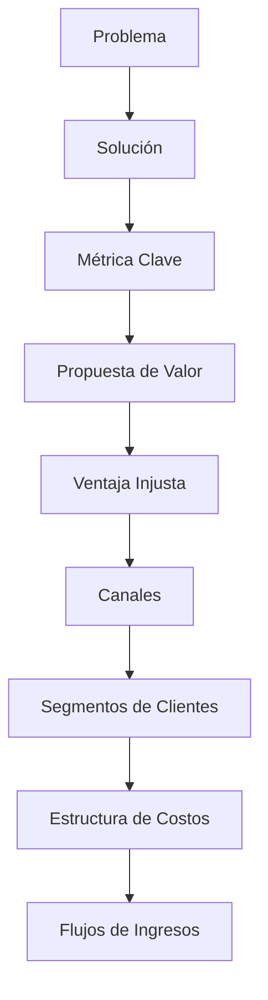
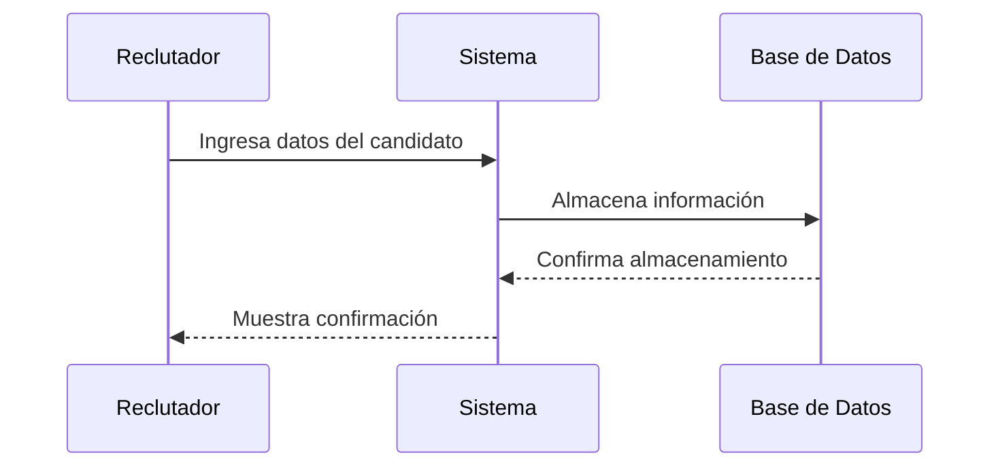
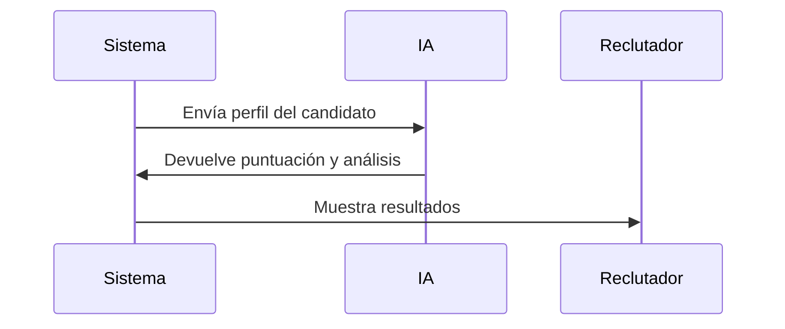
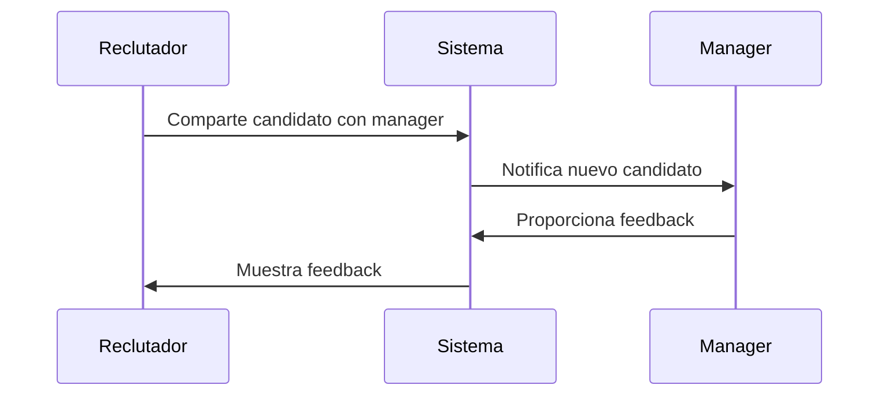
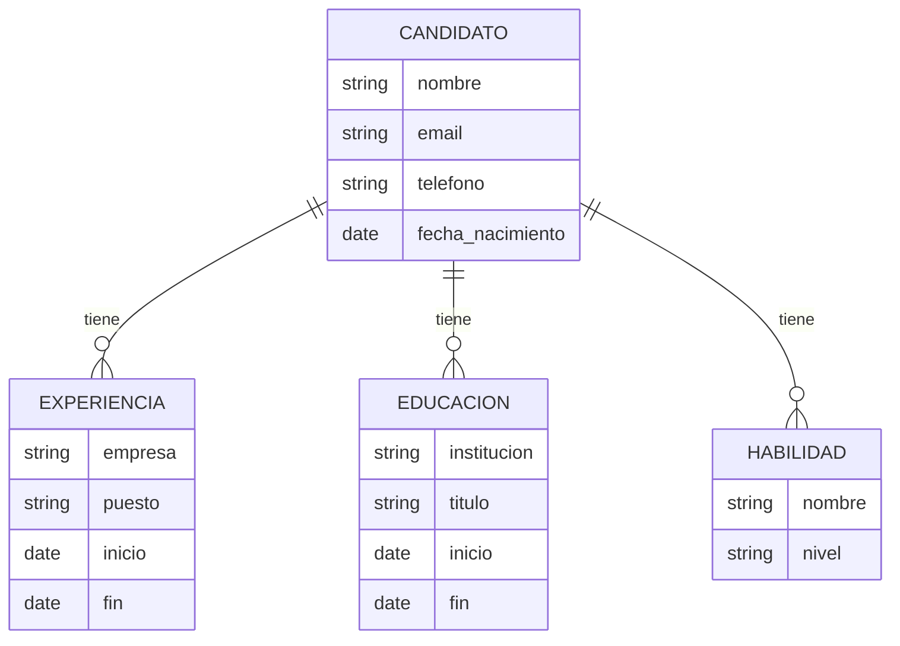
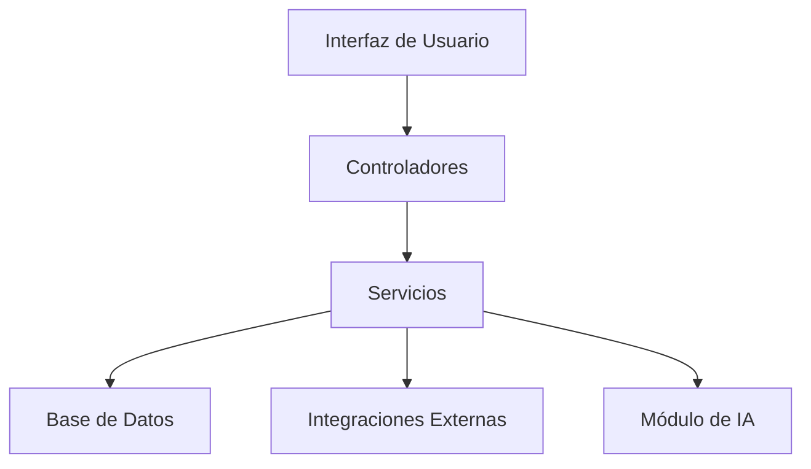
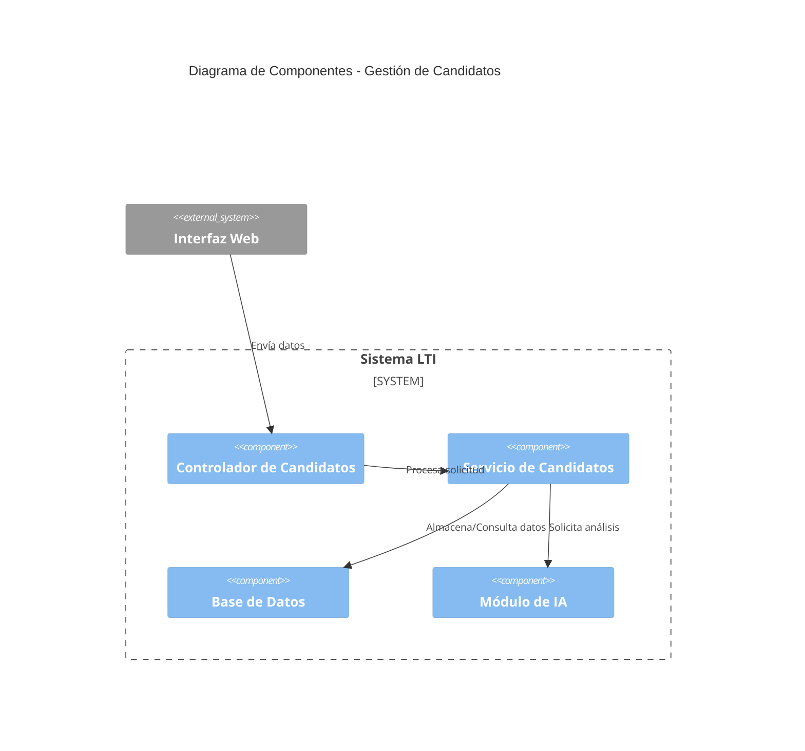

# LTI - Sistema de Seguimiento de Candidatos (ATS)

## Descripción del Software
LTI es un ATS innovador que busca revolucionar el proceso de reclutamiento mediante:
- Automatización inteligente de tareas repetitivas
- Colaboración en tiempo real entre reclutadores y managers
- Asistencia de IA para selección y evaluación de candidatos
- Integración con múltiples plataformas de búsqueda de talento

**Ventajas Competitivas:**
1. Mayor eficiencia en procesos de HR
2. Reducción de tiempo en ciclos de contratación
3. Mejora en la calidad de las contrataciones
4. Experiencia de usuario intuitiva y moderna

## Funciones Principales
1. Gestión centralizada de candidatos
2. Automatización de flujos de trabajo
3. Análisis predictivo de candidatos
4. Herramientas de colaboración en equipo
5. Integración con redes profesionales

## Lean Canvas

## Casos de Uso Principales

### 1. Registro de Nuevo Candidato

### 2. Evaluación Automatizada de Candidatos

### 3. Colaboración en Proceso de Selección

## Modelo de Datos

## Diseño de Alto Nivel

## Diagrama C4 - Componente de Gestión de Candidatos
