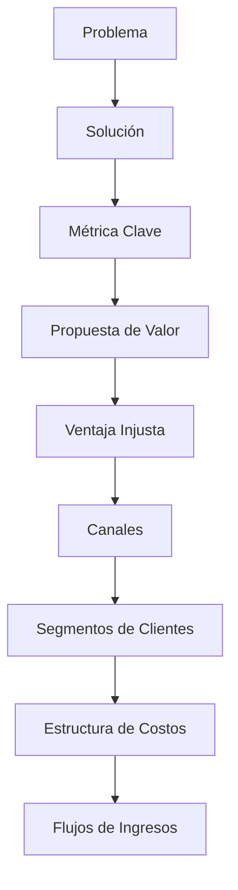
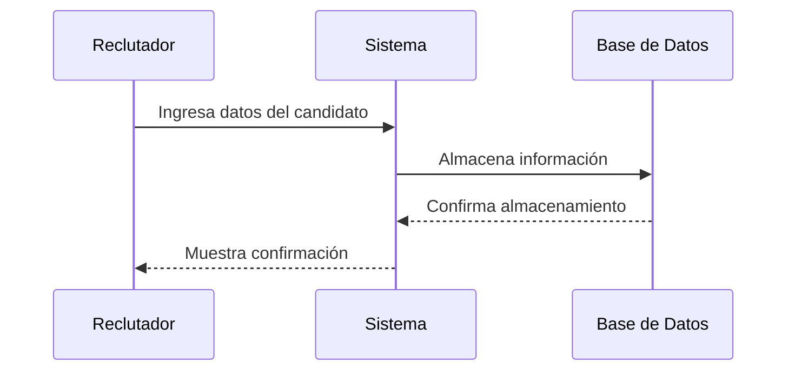
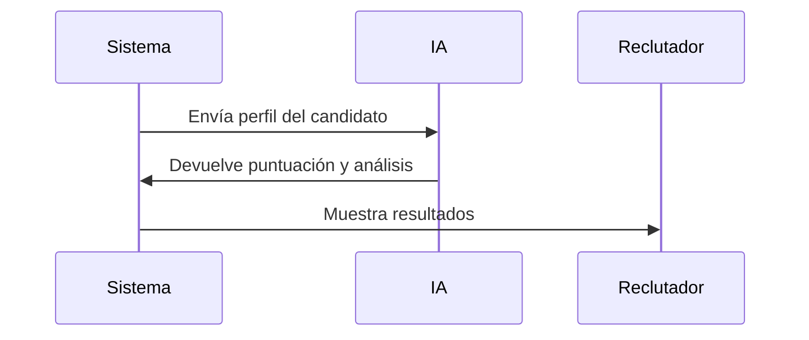
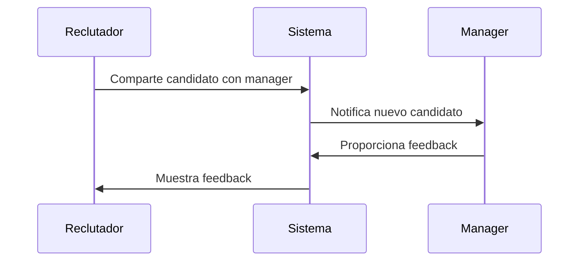
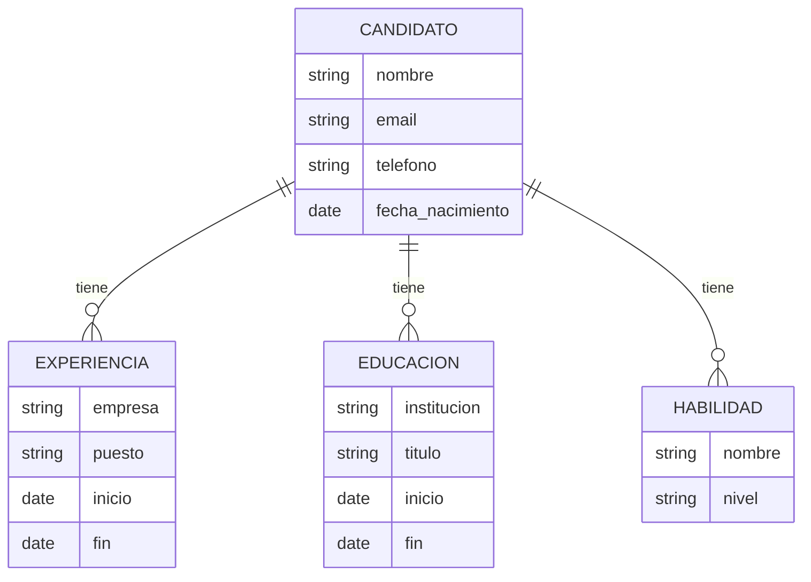
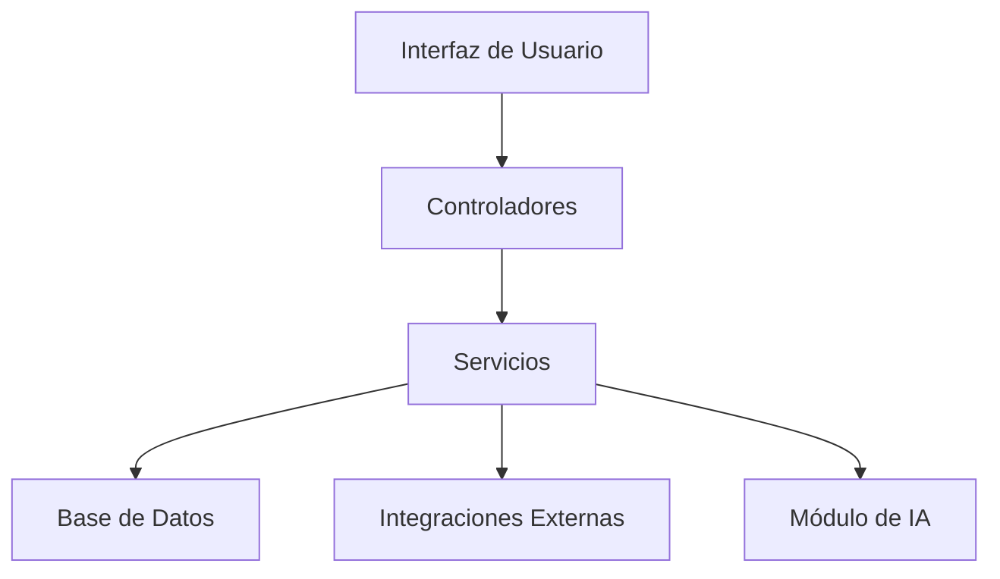
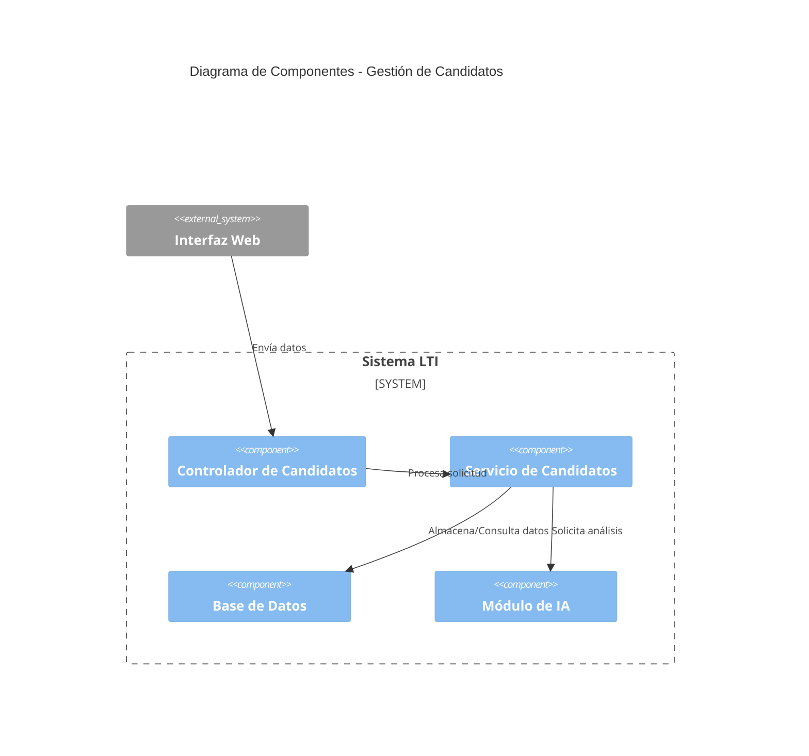

# Asistente
    Cursor, Agent (deepseek-v3)

# Prompt
Fui a lo simple, indicándole quién es, pasándole el Readme, dándole los objetivos tal cual vienen en la tarea y diciéndole donde debe guardar el archivo

```
@ReadMe.md
Como diseñador de software, en base a la documentación aportada:
Tu misión es diseñar la primera versión del sistema, entregando los siguientes artefactos:

Descripción breve del software LTI, valor añadido y ventajas competitivas. Explicación de las funciones principales. Añadir un diagrama Lean Canvas para entender el modelo de negocio
Descripción de los 3 casos de uso principales, con el diagrama asociado a cada uno
Modelo de datos que cubra entidades, atributos (nombre y tipo) y relaciones
Diseño del sistema a alto nivel, tanto explicado como diagrama adjunto
Diagrama C4 que llegue en profundidad a uno de los componentes del sistema, el que prefieras

Documenta todo en un único documento markdown (.md) con el nombre LTI-DCA.md
```

## Respuesta

Claro, aquí tienes una guía para diseñar la primera versión del sistema LTI basado en los requisitos proporcionados:
```markdown
# LTI - Sistema de Seguimiento de Candidatos (ATS)

## Descripción del Software
LTI es un ATS innovador que busca revolucionar el proceso de reclutamiento mediante:
- Automatización inteligente de tareas repetitivas
- Colaboración en tiempo real entre reclutadores y managers
- Asistencia de IA para selección y evaluación de candidatos
- Integración con múltiples plataformas de búsqueda de talento

**Ventajas Competitivas:**
1. Mayor eficiencia en procesos de HR
2. Reducción de tiempo en ciclos de contratación
3. Mejora en la calidad de las contrataciones
4. Experiencia de usuario intuitiva y moderna

## Funciones Principales
1. Gestión centralizada de candidatos
2. Automatización de flujos de trabajo
3. Análisis predictivo de candidatos
4. Herramientas de colaboración en equipo
5. Integración con redes profesionales

## Lean Canvas


## Casos de Uso Principales

### 1. Registro de Nuevo Candidato


### 2. Evaluación Automatizada de Candidatos


### 3. Colaboración en Proceso de Selección


## Modelo de Datos


## Diseño de Alto Nivel


## Diagrama C4 - Componente de Gestión de Candidatos
```mermaid
C4Component
    Component_UI[Interfaz de Usuario] --> Component_Controller[Controlador]
    Component_Controller --> Component_Service[Servicio de Candidatos]
    Component_Service --> Component_DB[Base de Datos]
    Component_Service --> Component_IA[Módulo de IA]
```
```

# Corrección
El Markdown Preview de Cursor daba un error con el diagrama C4, y se lo indiqué para corregirlo

## Diagrama C4 original
```mermaid
C4Component
    Component_UI[Interfaz de Usuario] --> Component_Controller[Controlador]
    Component_Controller --> Component_Service[Servicio de Candidatos]
    Component_Service --> Component_DB[Base de Datos]
    Component_Service --> Component_IA[Módulo de IA]
```


## prompt
```
hay un problema con el diagrama C4, corrígelo
```

## Diagrama C4 obtenido
