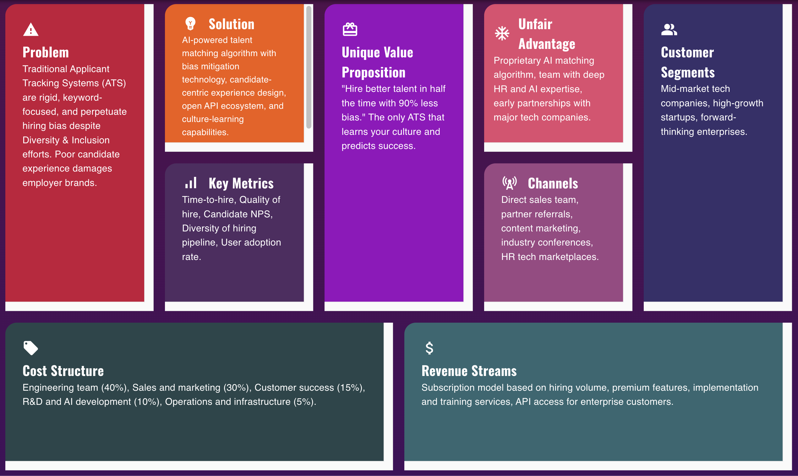
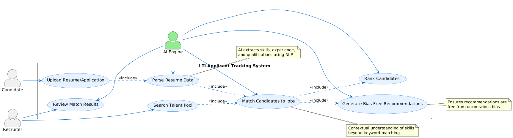
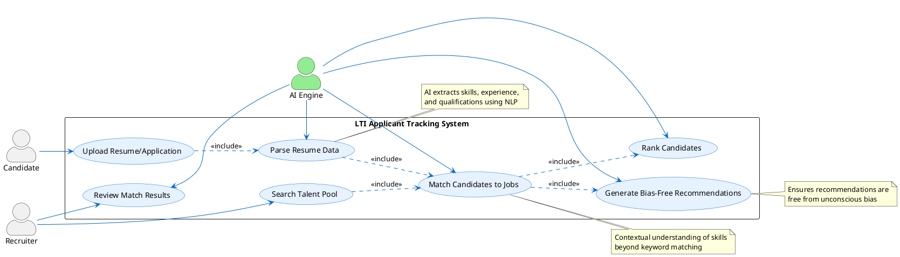
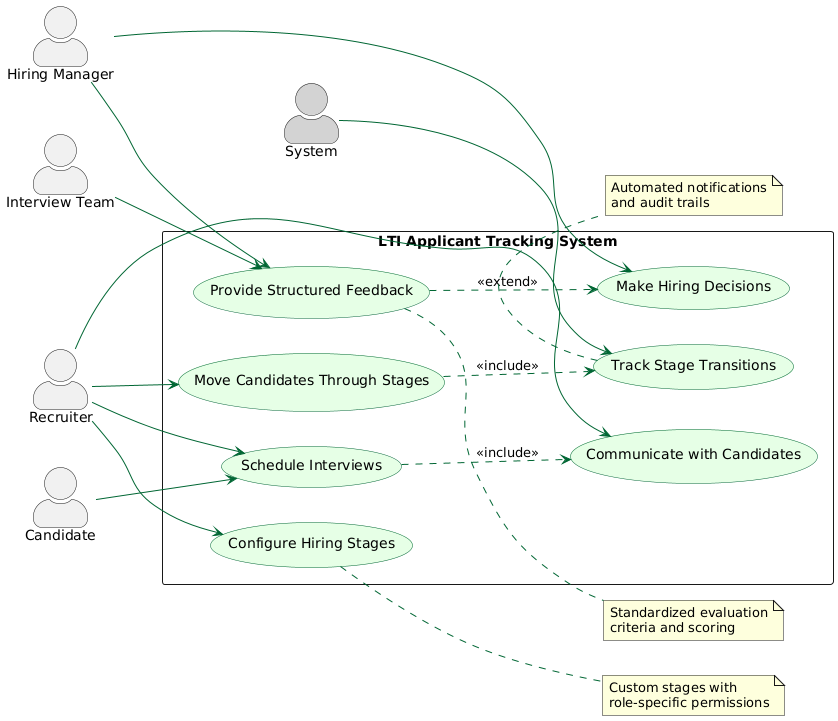
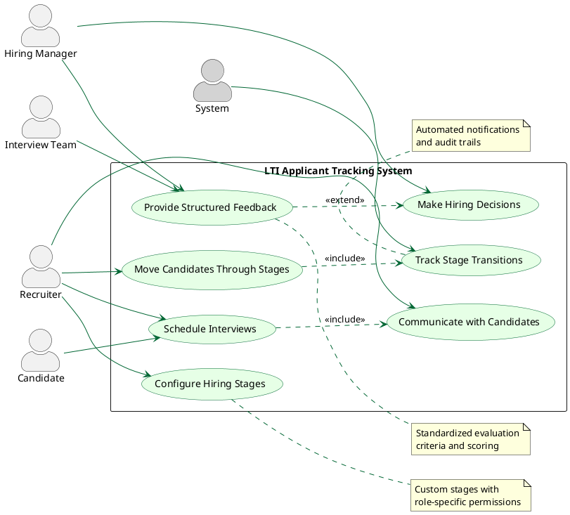
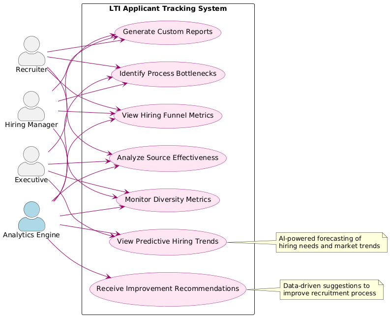
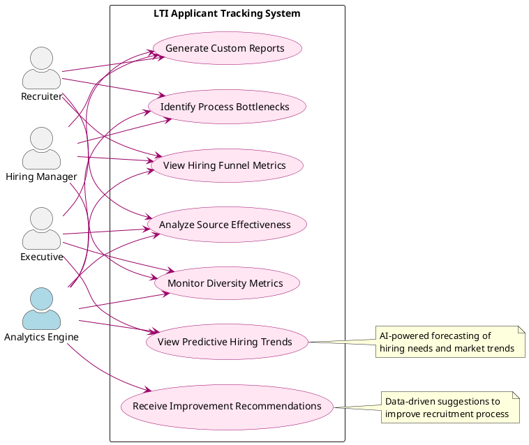
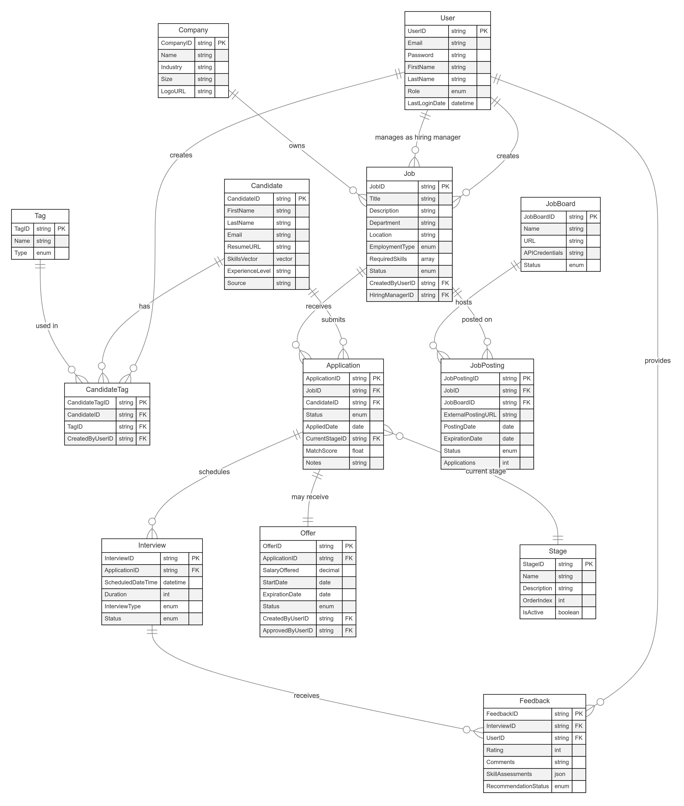
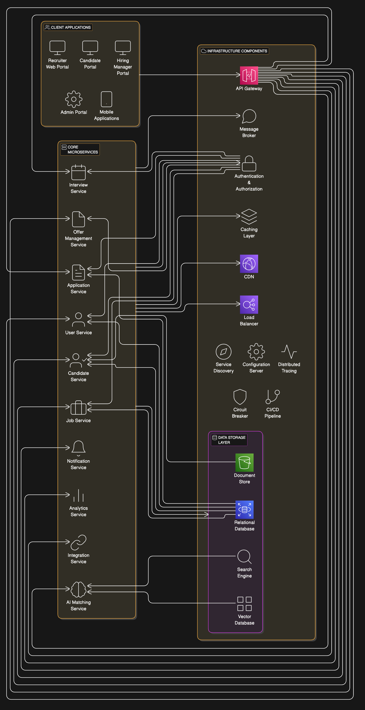

# 1. Descripción breve del software LTI, valor añadido y ventajas competitivas. Explicación de las funciones principales. Añadir un diagrama Lean Canvas para entender el modelo de negocio

## LTI: The Next-Generation Applicant Tracking System

### Short Description of LTI Software

LTI (Talent Intelligence) is an AI-powered applicant tracking system designed for the future of work. It combines traditional ATS functionality with advanced machine learning capabilities to create a more intelligent, predictive, and human-centered recruitment platform. LTI focuses on matching the right talent to the right opportunities while eliminating bias, reducing administrative burden, and providing actionable insights throughout the hiring process.

### Added Value and Competitive Advantages

1. AI-Driven Talent Matching
   - Proprietary algorithm that goes beyond keyword matching to understand skills context and potential
   - Predicts candidate success based on holistic evaluation of capabilities, not just resume keywords
   - Reduces time-to-hire by 40% through intelligent candidate prioritization

2. Bias Mitigation Technology
   - Built-in bias detection and correction throughout the hiring workflow
   - Anonymous screening options that focus on capabilities over demographic factors
   - Regular bias audits with actionable recommendations for improvement

3. Candidate-Centric Experience
   - Interactive and transparent application process with real-time status updates
   - Personalized communication based on candidate preferences and behavior
   - Feedback loops that provide value to all applicants, not just those selected

4. Seamless Integration Ecosystem
   - Open API architecture that connects with existing HR tech stack
   - Pre-built integrations with major HRIS, background check, and assessment platforms
   - Custom workflow builder that adapts to company-specific processes

5. Predictive Analytics Dashboard
   - Forecasting tools for hiring needs based on historical data and business growth
   - Source effectiveness analysis with ROI calculations
   - Talent market insights specific to your industry and location

### Explanation of Main Functions

#### 1. Intelligent Candidate Sourcing

- Multi-channel job distribution with optimization recommendations
- Passive candidate identification through social and professional networks
- Employee referral gamification system with progress tracking
- Talent pool nurturing with automated engagement campaigns

#### 2. Smart Screening and Assessment

- AI-powered resume parsing and qualification matching
- Customizable screening questions with sentiment analysis
- Video interview platform with expression and language analysis
- Skills-based assessment integration with major testing providers

#### 3. Collaborative Hiring Workflow

- Customizable hiring stages with automation triggers
- Team-based evaluation with structured feedback templates
- Mobile-optimized interface for on-the-go hiring decisions
- Interview scheduling with AI-powered availability matching

#### 4. Data-Driven Decision Support

- Real-time hiring funnel analytics with bottleneck identification
- Diversity and inclusion metrics with benchmark comparisons
- Hiring quality metrics tracking post-placement performance
- Competitive intelligence on market salary and benefits trends

#### 5. Seamless Onboarding Transition

- Digital offer management with e-signature capabilities
- Pre-boarding engagement to maintain candidate excitement
- Automated document collection and verification
- Personalized onboarding plan generation based on role and experience

### Lean Canvas for LTI



```plaintext
+------------------------+------------------------+------------------------+------------------------+
| PROBLEM                | SOLUTION               | UNIQUE VALUE           | UNFAIR ADVANTAGE      |
|                        |                        | PROPOSITION            |                        |
| - Traditional ATS      | - AI-powered talent    | - "Hire better talent  | - Proprietary AI      |
|   systems are rigid    |   matching algorithm   |   in half the time     |   matching algorithm  |
|   and keyword-focused  | - Bias mitigation      |   with 90% less bias"  | - Team with deep HR   |
| - Hiring bias persists |   technology           |                        |   and AI expertise    |
|   despite D&I efforts  | - Candidate-centric    | - The only ATS that    | - Early partnerships  |
| - Poor candidate       |   experience design    |   learns your culture  |   with major tech     |
|   experience damages   | - Open API ecosystem   |   and predicts success |   companies           |
|   employer brand       |                        |                        |                        |
+------------------------+------------------------+------------------------+------------------------+
| KEY METRICS            |                        | CHANNELS               | CUSTOMER SEGMENTS     |
|                        |                        |                        |                        |
| - Time-to-hire         |                        | - Direct sales team    | - Mid-market tech     |
| - Quality of hire      |                        | - Partner referrals    |   companies           |
| - Candidate NPS        |                        | - Content marketing    | - High-growth         |
| - Diversity of         |                        | - Industry conferences |   startups            |
|   hiring pipeline      |                        | - HR tech marketplaces | - Forward-thinking    |
| - User adoption rate   |                        |                        |   enterprises         |
|                        |                        |                        |                        |
+------------------------+------------------------+------------------------+------------------------+
| COST STRUCTURE                                  | REVENUE STREAMS                                 |
|                                                 |                                                 |
| - Engineering team (40%)                        | - Subscription model based on hiring volume     |
| - Sales and marketing (30%)                     | - Premium features (advanced analytics,         |
| - Customer success (15%)                        |   custom integrations)                          |
| - R&D and AI development (10%)                  | - Implementation and training services          |
| - Operations and infrastructure (5%)            | - API access for enterprise customers           |
|                                                 |                                                 |
+-------------------------------------------------+-------------------------------------------------+
```


# 2. Descripción de los 3 casos de uso principales, con el diagrama asociado a cada uno

## Three Most Critical Use Cases for LTI

### 1. AI-Driven Candidate Sourcing and Matching

This use case encompasses the intelligent matching of candidates to job opportunities using LTI's proprietary AI algorithm. It goes beyond traditional keyword matching to understand skills context and potential, predicting candidate success based on a holistic evaluation.

Key Functionality:

- Intelligent parsing of resumes and applications to extract skills, experience, and qualifications
- Matching candidates to job requirements using contextual understanding of skills and experience
- Ranking candidates based on predicted success factors
- Identifying passive candidates from talent pools who match new job openings
- Providing bias-free candidate recommendations with explanation of match quality

This is critical because it represents LTI's core competitive advantage and directly addresses the primary pain point of finding the right talent efficiently.





### 2. Collaborative Hiring Workflow Management

This use case covers the end-to-end process of moving candidates through customized hiring stages with team-based evaluation and decision-making.

Key Functionality:

- Configurable hiring stages with role-specific permissions
- Structured feedback collection from multiple stakeholders
- Automated status updates and next steps
- Interview scheduling with calendar integration
- Centralized communication and document sharing
- Decision tracking with audit trails

This is critical because it streamlines the entire hiring process, involves all stakeholders effectively, and ensures consistent evaluation practices.





### 3. Analytics and Insights Dashboard

This use case provides data-driven decision support through comprehensive analytics on the recruitment process and outcomes.

Key Functionality:

- Real-time hiring funnel metrics and bottleneck identification
- Source effectiveness analysis with ROI calculations
- Diversity and inclusion metrics with benchmark comparisons
- Predictive analytics for hiring needs and market trends
- Custom reporting with visualization options
- Actionable recommendations for process improvement
This is critical because it enables continuous improvement of the hiring process, demonstrates ROI to stakeholders, and leverages data to make better hiring decisions.

These three use cases represent the foundation of LTI's value proposition and would be the priority focus areas for initial development and implementation.






# 3. Modelo de datos que cubra entidades, atributos (nombre y tipo) y relaciones

## Essential Data Model Entities for LTI Applicant Tracking System

Based on the information about LTI as a next-generation applicant tracking system, here are the essential data model entities with their key fields and relationships:

### Core Entities

#### 1. User

- UserID (PK)
- Email
- Password (hashed)
- FirstName
- LastName
- Role (Recruiter, Hiring Manager, Admin, etc.)
- Department
- LastLoginDate
- CreatedAt
- UpdatedAt

#### 2. Candidate

- CandidateID (PK)
- FirstName
- LastName
- Email
- Phone
- ResumeURL
- LinkedInProfile
- SkillsVector (for AI matching)
- ExperienceLevel
- CurrentJobTitle
- CurrentCompany
- PreferredLocation
- AvailabilityDate
- Source
- CreatedAt
- UpdatedAt

#### 3. Job

- JobID (PK)
- Title
- Description
- Department
- Location
- EmploymentType (Full-time, Part-time, Contract)
- ExperienceLevel
- RequiredSkills
- PreferredSkills
- SalaryRange
- Status (Draft, Open, Closed, On Hold)
- CreatedByUserID (FK to User)
- HiringManagerID (FK to User)
- PostingDate
- ClosingDate
- CreatedAt
- UpdatedAt

#### 4. Application

- ApplicationID (PK)
- JobID (FK to Job)
- CandidateID (FK to Candidate)
- Status (Applied, Screening, Interview, Offer, Hired, Rejected)
- AppliedDate
- CurrentStageID (FK to Stage)
- MatchScore (AI-generated compatibility score)
- RejectionReason
- Notes
- CreatedAt
- UpdatedAt

#### 5. Stage

- StageID (PK)
- Name (e.g., "Resume Screening", "Phone Interview", "Technical Assessment")
- Description
- OrderIndex (for sequence)
- IsActive
- DefaultDuration (expected time in this stage)
- CreatedAt
- UpdatedAt

#### 6. Interview

- InterviewID (PK)
- ApplicationID (FK to Application)
- ScheduledDateTime
- Duration
- InterviewType (Phone, Video, In-person)
- Location/Link
- Status (Scheduled, Completed, Cancelled, Rescheduled)
- CreatedAt
- UpdatedAt

#### 7. Feedback

- FeedbackID (PK)
- InterviewID (FK to Interview)
- UserID (FK to User - who provided feedback)
- Rating
- Comments
- SkillAssessments (JSON or related table)
- RecommendationStatus (Reject, Hold, Proceed)
- CreatedAt
- UpdatedAt

#### 8. Offer

- OfferID (PK)
- ApplicationID (FK to Application)
- SalaryOffered
- BenefitsPackage
- StartDate
- ExpirationDate
- Status (Draft, Sent, Accepted, Rejected, Negotiating)
- CreatedByUserID (FK to User)
- ApprovedByUserID (FK to User)
- CreatedAt
- UpdatedAt

### Supporting Entities

#### 9. Company

- CompanyID (PK)
- Name
- Industry
- Size
- LogoURL
- CareerPageURL
- CreatedAt
- UpdatedAt

#### 10. JobBoard

- JobBoardID (PK)
- Name
- URL
- APICredentials (encrypted)
- Status (Active, Inactive)
- CreatedAt
- UpdatedAt

#### 11. JobPosting

- JobPostingID (PK)
- JobID (FK to Job)
- JobBoardID (FK to JobBoard)
- ExternalPostingURL
- PostingDate
- ExpirationDate
- Status (Active, Expired, Removed)
- CostPerClick
- Impressions
- Clicks
- Applications
- CreatedAt
- UpdatedAt

#### 12. Tag

- TagID (PK)
- Name
- Type (Skill, Location, Source, etc.)
- CreatedAt
- UpdatedAt

#### 13. CandidateTag

- CandidateTagID (PK)
- CandidateID (FK to Candidate)
- TagID (FK to Tag)
- CreatedByUserID (FK to User)
- CreatedAt

### Relationships

1. A User can create multiple Jobs (1:N)
2. A User (as hiring manager) can be responsible for multiple Jobs (1:N)
3. A Job can receive multiple Applications (1:N)
4. A Candidate can submit multiple Applications (1:N)
5. An Application goes through multiple Stages (M:N through ApplicationStage junction table)
6. An Application can have multiple Interviews (1:N)
7. An Interview can receive multiple Feedback entries (1:N)
8. An Application can receive one Offer (1:1)
9. A Job can be posted to multiple JobBoards (M:N through JobPosting)
10. A Candidate can have multiple Tags (M:N through CandidateTag)
This data model provides the foundation for LTI's core functionality while supporting the AI-driven matching, collaborative workflow, and analytics capabilities that differentiate the system from traditional applicant tracking systems.

### Diagram



```mermaid
erDiagram
    User ||--o{ Job : "creates"
    User ||--o{ Job : "manages as hiring manager"
    User ||--o{ Feedback : "provides"
    User ||--o{ CandidateTag : "creates"
    
    Candidate ||--o{ Application : "submits"
    Candidate ||--o{ CandidateTag : "has"
    
    Job ||--o{ Application : "receives"
    Job ||--o{ JobPosting : "posted on"
    
    Application ||--o{ Interview : "schedules"
    Application ||--|| Offer : "may receive"
    Application }o--|| Stage : "current stage"
    
    Interview ||--o{ Feedback : "receives"
    
    JobBoard ||--o{ JobPosting : "hosts"
    
    Tag ||--o{ CandidateTag : "used in"
    
    Company ||--o{ Job : "owns"
    
    %% Entity definitions with key attributes
    User {
        PK UserID
        string Email
        string Password
        string FirstName
        string LastName
        enum Role
        datetime LastLoginDate
    }
    
    Candidate {
        PK CandidateID
        string FirstName
        string LastName
        string Email
        string ResumeURL
        vector SkillsVector
        string ExperienceLevel
        string Source
    }
    
    Job {
        PK JobID
        string Title
        string Description
        string Department
        string Location
        enum EmploymentType
        array RequiredSkills
        enum Status
        FK CreatedByUserID
        FK HiringManagerID
    }
    
    Application {
        PK ApplicationID
        FK JobID
        FK CandidateID
        enum Status
        date AppliedDate
        FK CurrentStageID
        float MatchScore
        string Notes
    }
    
    Stage {
        PK StageID
        string Name
        string Description
        int OrderIndex
        boolean IsActive
    }
    
    Interview {
        PK InterviewID
        FK ApplicationID
        datetime ScheduledDateTime
        int Duration
        enum InterviewType
        enum Status
    }
    
    Feedback {
        PK FeedbackID
        FK InterviewID
        FK UserID
        int Rating
        string Comments
        json SkillAssessments
        enum RecommendationStatus
    }
    
    Offer {
        PK OfferID
        FK ApplicationID
        decimal SalaryOffered
        date StartDate
        date ExpirationDate
        enum Status
        FK CreatedByUserID
        FK ApprovedByUserID
    }
    
    Company {
        PK CompanyID
        string Name
        string Industry
        string Size
        string LogoURL
    }
    
    JobBoard {
        PK JobBoardID
        string Name
        string URL
        string APICredentials
        enum Status
    }
    
    JobPosting {
        PK JobPostingID
        FK JobID
        FK JobBoardID
        string ExternalPostingURL
        date PostingDate
        date ExpirationDate
        enum Status
        int Applications
    }
    
    Tag {
        PK TagID
        string Name
        enum Type
    }
    
    CandidateTag {
        PK CandidateTagID
        FK CandidateID
        FK TagID
        FK CreatedByUserID
    }
```

This diagram illustrates the core entities of the LTI applicant tracking system and their relationships. The diagram follows the entity-relationship model conventions with primary keys (PK), foreign keys (FK), and cardinality notations showing how entities relate to each other (one-to-many, one-to-one, etc.).

Key relationships shown include:

- Users creating and managing jobs
- Candidates submitting applications for jobs
- Applications progressing through stages and scheduling interviews
- Feedback being provided on interviews
- Jobs being posted to multiple job boards
- Candidates being tagged for easier categorization and searching

The diagram provides a visual representation of the data architecture that will support LTI's AI-driven matching capabilities, collaborative workflows, and analytics features.


# 4. Diseño del sistema a alto nivel, tanto explicado como diagrama adjunto

Based on the information about LTI as a next-generation applicant tracking system, here's a proposed microservices architecture with the necessary components:

## Core Microservices

1. User Service
   
   - Handles user authentication, authorization, and profile management
   - Manages role-based access control
   - Integrates with SSO providers
   - Stores user preferences and settings

2. Candidate Service
   
   - Manages candidate profiles and data
   - Handles resume parsing and storage
   - Maintains candidate history and interactions
   - Manages talent pools and candidate tags

3. Job Service
   
   - Manages job requisitions and descriptions
   - Handles job approval workflows
   - Maintains job status and lifecycle
   - Manages job templates and categories

4. Application Service
   
   - Processes job applications
   - Tracks application status and pipeline movement
   - Manages application workflows and stages
   - Handles application communications

5. Interview Service
   
   - Manages interview scheduling and coordination
   - Handles interview feedback collection
   - Maintains interview templates and scorecards
   - Integrates with calendar systems

6. AI Matching Service
   
   - Implements the proprietary matching algorithm
   - Processes skills extraction and analysis
   - Generates candidate rankings and match scores
   - Provides bias detection and mitigation

7. Analytics Service
   
   - Collects and processes recruitment metrics
   - Generates reports and dashboards
   - Provides predictive analytics and insights
   - Handles data visualization

8. Notification Service
   
   - Manages email and in-app notifications
   - Handles communication templates
   - Provides scheduled and triggered alerts
   - Tracks communication history

9. Integration Service
   
   - Manages connections with external job boards
   - Handles integrations with HRIS and other systems
   - Provides webhook management
   - Supports API gateway functionality

10. Offer Management Service
    
    - Handles offer creation and approval workflows
    - Manages offer negotiations and status
    - Integrates with document signing services
    - Tracks offer metrics and conversion rates

## Infrastructure Components

1. API Gateway
   
   - Provides a unified entry point for client applications
   - Handles request routing to appropriate microservices
   - Implements rate limiting and security policies
   - Manages API versioning and documentation

2. Service Discovery
   
   - Enables microservices to find and communicate with each other
   - Handles service registration and health monitoring
   - Provides load balancing capabilities
   - Supports dynamic scaling

3. Message Broker
   
   - Enables asynchronous communication between services
   - Supports event-driven architecture patterns
   - Handles event sourcing and message queuing
   - Provides reliable message delivery

4. Configuration Server
   
   - Centralizes configuration management
   - Supports environment-specific configurations
   - Enables dynamic configuration updates
   - Manages secrets and sensitive information

5. Distributed Tracing
   
   - Tracks request flows across microservices
   - Provides performance monitoring and bottleneck identification
   - Supports debugging and troubleshooting
   - Enables service dependency visualization

6. Circuit Breaker
   
   - Prevents cascading failures across services
   - Implements fallback mechanisms
   - Provides self-healing capabilities
   - Monitors service health and availability

7. Data Storage Layer
   
   - Combination of relational databases for transactional data
   - Document stores for unstructured content (resumes, etc.)
   - Search engine for advanced candidate and job searching
   - Vector database for AI matching capabilities

8. Caching Layer
   
   - Improves performance for frequently accessed data
   - Reduces database load
   - Supports distributed caching
   - Enables session management

9. Authentication & Authorization
   
   - Implements OAuth/OpenID Connect for authentication
   - Provides JWT token management
   - Handles role-based access control
   - Supports multi-tenancy for enterprise clients

10. CI/CD Pipeline
    
    - Enables automated testing and deployment
    - Supports containerization (Docker)
    - Provides infrastructure as code capabilities
    - Enables blue-green deployments and canary releases

## Client Applications

1. Recruiter Web Portal
   
   - Primary interface for recruiters and HR professionals
   - Provides comprehensive ATS functionality
   - Supports advanced analytics and reporting

2. Hiring Manager Portal
   
   - Streamlined interface for hiring managers
   - Focuses on candidate review and feedback
   - Provides approval workflows and notifications

3. Candidate Portal
   
   - Public-facing career site and application system
   - Provides application status tracking
   - Supports document uploads and profile management

4. Mobile Applications
   
   - Native apps for recruiters and hiring managers
   - Supports on-the-go candidate review and feedback
   - Provides push notifications for important updates

5. Admin Portal
   
   - System configuration and management
   - User administration and role management
   - Integration setup and monitoring




# 5. Diagrama C4 que llegue en profundidad a uno de los componentes del sistema, el que prefieras


```plantuml
@startuml LTI User Service - C4 Component Diagram

!include https://raw.githubusercontent.com/plantuml-stdlib/C4-PlantUML/master/C4_Container.puml
!include https://raw.githubusercontent.com/plantuml-stdlib/C4-PlantUML/master/C4_Component.puml

LAYOUT_WITH_LEGEND()

title LTI User Service - Component Diagram

Person(recruiter, "Recruiter", "HR professional who manages the recruitment process")
Person(hiringManager, "Hiring Manager", "Department manager who needs to hire new staff")
Person(admin, "System Administrator", "Manages system configuration and user access")

System_Boundary(lti, "LTI Applicant Tracking System") {
    Container(webApp, "Web Application", "React, TypeScript", "Provides recruitment functionality to internal users")
    Container(mobileApp, "Mobile Application", "React Native", "Allows on-the-go access to recruitment functions")
    
    Container_Boundary(userService, "User Service") {
        Component(authController, "Authentication Controller", "Spring Boot REST Controller", "Handles user login, logout, and session management")
        Component(userController, "User Controller", "Spring Boot REST Controller", "Manages user profiles and settings")
        Component(roleController, "Role Controller", "Spring Boot REST Controller", "Handles role assignments and permissions")
        Component(ssoIntegration, "SSO Integration", "Spring Security", "Enables authentication via external identity providers")
        Component(userService_comp, "User Service", "Spring Service", "Implements user management business logic")
        Component(roleService, "Role Service", "Spring Service", "Implements role management business logic")
        Component(userRepository, "User Repository", "Spring Data JPA", "Provides access to user data")
        Component(roleRepository, "Role Repository", "Spring Data JPA", "Provides access to role data")
        Component(preferencesRepository, "Preferences Repository", "Spring Data JPA", "Provides access to user preferences data")
    }
    
    ContainerDb(userDb, "User Database", "Amazon RDS PostgreSQL", "Stores user accounts, roles, and preferences")
    
    Container(apiGateway, "API Gateway", "AWS API Gateway", "Handles API routing, authentication, and rate limiting")
    Container(notificationService, "Notification Service", "Microservice", "Manages email and in-app notifications")
    Container(candidateService, "Candidate Service", "Microservice", "Manages candidate profiles and applications")
}

System_Ext(identityProvider, "Identity Provider", "External SSO service (Google, Microsoft, Okta)")
System_Ext(emailService, "Email Service", "AWS SES", "Sends emails to users")

Rel(recruiter, webApp, "Uses", "HTTPS")
Rel(recruiter, mobileApp, "Uses", "HTTPS")
Rel(hiringManager, webApp, "Uses", "HTTPS")
Rel(hiringManager, mobileApp, "Uses", "HTTPS")
Rel(admin, webApp, "Uses", "HTTPS")

Rel(webApp, apiGateway, "Makes API calls to", "JSON/HTTPS")
Rel(mobileApp, apiGateway, "Makes API calls to", "JSON/HTTPS")
Rel(apiGateway, userService, "Routes requests to", "JSON/HTTPS")

Rel(authController, userService_comp, "Uses")
Rel(userController, userService_comp, "Uses")
Rel(roleController, roleService, "Uses")
Rel(userService_comp, userRepository, "Uses")
Rel(userService_comp, preferencesRepository, "Uses")
Rel(roleService, roleRepository, "Uses")
Rel(userRepository, userDb, "Reads from and writes to")
Rel(roleRepository, userDb, "Reads from and writes to")
Rel(preferencesRepository, userDb, "Reads from and writes to")

Rel(ssoIntegration, identityProvider, "Authenticates via", "OAuth/SAML")
Rel(userService_comp, notificationService, "Publishes user events to", "Async/Kafka")
Rel(notificationService, emailService, "Sends emails via", "SMTP")
Rel(userService, candidateService, "Provides user context to", "JSON/HTTPS")

@enduml
```

## Explanation of the Diagram

This C4 component diagram illustrates the User Service within the LTI applicant tracking system. Here's a breakdown of what's shown:

### Users

- Recruiters and Hiring Managers interact with the system through web and mobile applications
- System Administrators manage user access and system configuration

### Containers

- Web Application and Mobile Application provide the user interface
- API Gateway routes requests to appropriate microservices
- User Service (our focus) handles all user-related functionality
- Notification Service manages communications
- Candidate Service represents one of the other microservices that interacts with User Service

### Components within User Service

1. Controllers :
   
   - Authentication Controller: Handles login/logout flows
   - User Controller: Manages user profiles
   - Role Controller: Handles permissions and access control

2. Services :
   
   - User Service: Core business logic for user management
   - Role Service: Business logic for role management

3. Repositories :
   
   - User Repository: Data access for user accounts
   - Role Repository: Data access for roles and permissions
   - Preferences Repository: Data access for user settings

4. Integration :
   
   - SSO Integration: Connects with external identity providers

### External Systems

- Identity Provider : External SSO services like Google, Microsoft, or Okta
- Email Service : AWS SES for sending emails

### Relationships

The diagram shows how these components interact with each other, including:

- How user requests flow through the system
- How the User Service connects to its database
- How it integrates with external systems
- How it communicates with other microservices

This C4 component diagram provides a clear visualization of the User Service architecture, showing both its internal structure and its place within the broader LTI system. 
