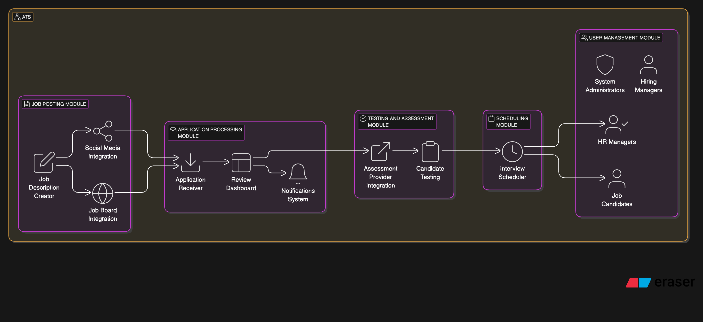

**LTI Applicant Tracking System (ATS) Overview**

### **Brief Description**
LTI is an Applicant Tracking System (ATS) designed to streamline and enhance the hiring process for companies and HR professionals. It provides an end-to-end recruitment workflow, from job posting to final hiring, ensuring efficiency, transparency, and better candidate selection.

### **Added Value & Competitive Advantages**
1. **Efficiency:** Automates job postings, candidate screening, and interview scheduling.
2. **Better Candidate Quality:** Built-in capacity tests help HR teams select the best-fit candidates.
3. **Seamless Collaboration:** Enables HR teams and hiring managers to work together on candidate evaluations.
4. **Integration with Social Media & Job Boards:** Expands job reach and increases applicant volume.
5. **AI-Powered Insights:** Provides analytics to optimize hiring strategies.

### **Key Features**
- **Job Posting & Social Media Integration:** HR professionals can create and distribute job descriptions.
- **Candidate Application Management:** Tracks applications and provides structured candidate profiles.
- **Automated Candidate Screening:** Uses customizable filters and tests to shortlist candidates.
- **Built-in Assessment Tests:** Candidates complete competency exams within the platform.
- **Interview Scheduling System:** Automatically coordinates meetings with shortlisted candidates.
- **Hiring Decision Support:** Aggregates all candidate evaluations for informed decision-making.
- **Analytics & Reporting:** Provides HR teams with insights into hiring efficiency and performance.

---
### **Lean Canvas: Business Model Overview**

**Problem:**
- Lengthy and inefficient hiring processes.
- Poor candidate filtering leading to bad hires.
- Limited insights for HR decision-making.

**Customer Segments:**
- Small to large enterprises with active hiring needs.
- HR professionals and hiring managers.

**Unique Value Proposition:**
- End-to-end hiring automation with AI-driven insights.
- Seamless candidate experience with integrated assessments.

**Solution:**
- A centralized ATS that automates job postings, filtering, testing, and hiring workflows.

**Revenue Streams:**
- Subscription-based SaaS model with different tiers.
- Premium features such as AI-enhanced analytics and custom integrations.

**Channels:**
- Direct sales to HR departments.
- Online marketing and partnerships with job boards.

**Key Metrics:**
- Number of job postings and applications.
- Time-to-hire reduction.
- User engagement and satisfaction.

**Cost Structure:**
- Development and maintenance.
- Cloud infrastructure.
- Marketing and customer acquisition.

**Unfair Advantage:**
- AI-powered candidate ranking and predictive hiring analytics.
- Seamless integration with major job platforms and HR software.

---

### **Main Use Cases & Diagrams**

#### **Use Case 1: Job Posting & Candidate Application**
**Actors:** HR Manager, Candidate
**Flow:**
1. HR Manager creates and publishes a job description.
2. The job is shared on social media and job boards.
3. Candidates find and apply for the job.
4. The system stores candidate applications for HR review.

**Sequence Diagram:**
```
HR Manager -> System: Create Job Description
System -> Social Media/Job Boards: Publish Job Posting
Candidate -> System: Apply for Job
System -> HR Manager: Store and Display Application
```

#### **Use Case 2: Candidate Screening & Testing**
**Actors:** HR Manager, Candidate, System
**Flow:**
1. The system filters candidates based on predefined criteria.
2. Selected candidates receive capacity test invitations.
3. Candidates complete the test.
4. The system evaluates results and ranks candidates.

**Sequence Diagram:**
```
System -> HR Manager: Display Filtered Candidates
HR Manager -> System: Select Candidates for Test
System -> Candidate: Send Test Invitation
Candidate -> System: Complete Test
System -> HR Manager: Rank and Display Results
```

#### **Use Case 3: Interview Scheduling & Hiring**
**Actors:** HR Manager, Candidate, System
**Flow:**
1. HR selects candidates for interviews.
2. The system offers available time slots to candidates.
3. Candidate selects a slot, and the system schedules the meeting.
4. After the interview, HR updates hiring decisions in the system.
5. The system finalizes the hiring process and notifies the selected candidate.

**Sequence Diagram:**
```
HR Manager -> System: Select Candidates for Interview
System -> Candidate: Send Available Time Slots
Candidate -> System: Select Time Slot
System -> HR Manager: Schedule Interview
HR Manager -> System: Update Hiring Decision
System -> Candidate: Send Hiring Confirmation
```

---

### **Data Model**

#### **Entities & Attributes**

This is the SQL initial script that should be used to create the database:

create table company (
    id uuid primary key,
    name text not null,
    industry text,
    location text
);

create table jobposting (
    id uuid primary key,
    title text not null,
    description text,
    location text,
    companyid uuid references company (id),
    createdat timestamp default current_timestamp,
    status text check (status in ('OPEN', 'CLOSED')) not null
);

create table candidate (
    id uuid primary key,
    name text not null,
    email text unique not null,
    resume text
);

create table application (
    id uuid primary key,
    candidateid uuid references candidate (id),
    jobid uuid references jobposting (id),
    status text check (status in ('PENDING', 'REJECTED', 'ACCEPTED')) not null,
    appliedat timestamp default current_timestamp
);

create table assessment (
    id uuid primary key,
    applicationid uuid references application (id),
    score float,
    status text check (status in ('PASSED', 'FAILED')) not null
);

create table interview (
    id uuid primary key,
    applicationid uuid references application (id),
    interviewdate timestamp,
    status text check (status in ('SCHEDULED', 'COMPLETED')) not null
);

create table hiringdecision (
    id uuid primary key,
    applicationid uuid references application (id),
    decision text check (decision in ('HIRED', 'REJECTED')) not null,
    decisiondate timestamp
);

And this is the entity relationship diagram:


#### **High-Level System Design**


#### **C4 diagram**
UML Diagram:
@startuml
' Define Context Level
rectangle "LTI ATS" {
actor "HR Manager" as HR
actor "Candidate" as Candidate
HR --> "LTI ATS"
Candidate --> "LTI ATS"
rectangle "External Integrations" {
rectangle "Social Media"
rectangle "Job Boards"
}
"LTI ATS" --> "Social Media"
"LTI ATS" --> "Job Boards"
}

' Define Container Level
rectangle "LTI ATS Containers" {
rectangle "Web Frontend (React)" as FE
rectangle "API Gateway (Spring Boot)" as API
rectangle "Job Service (Spring Boot)" as JobService
rectangle "Candidate Service (Spring Boot)" as CandidateService
database "Database (PostgreSQL)" as DB
FE --> API
API --> JobService
API --> CandidateService
JobService --> DB
CandidateService --> DB
}

' Define Component Level (Job Service)
rectangle "Job Service Components" {
rectangle "Job Posting Controller" as Controller
rectangle "Job Posting Service" as Service
rectangle "Job Repository" as Repository
rectangle "Notification Service" as Notification
rectangle "External Job Board Integration" as ExternalIntegration
Controller --> Service
Service --> Repository
Service --> Notification
Service --> ExternalIntegration
}

' Define Code Level (Job Posting Service)
rectangle "Job Posting Service Code" {
class "JobPostingController" {
+createJob()
+getJobs()
}
class "JobPostingService" {
+saveJob()
+filterJobs()
}
class "JobRepository" {
+storeJob()
+fetchJob()
}
class "NotificationService" {
+sendNotification()
}
class "ExternalJobBoardIntegration" {
+publishJob()
}
"JobPostingController" --> "JobPostingService"
"JobPostingService" --> "JobRepository"
"JobPostingService" --> "NotificationService"
"JobPostingService" --> "ExternalJobBoardIntegration"
}
@enduml


