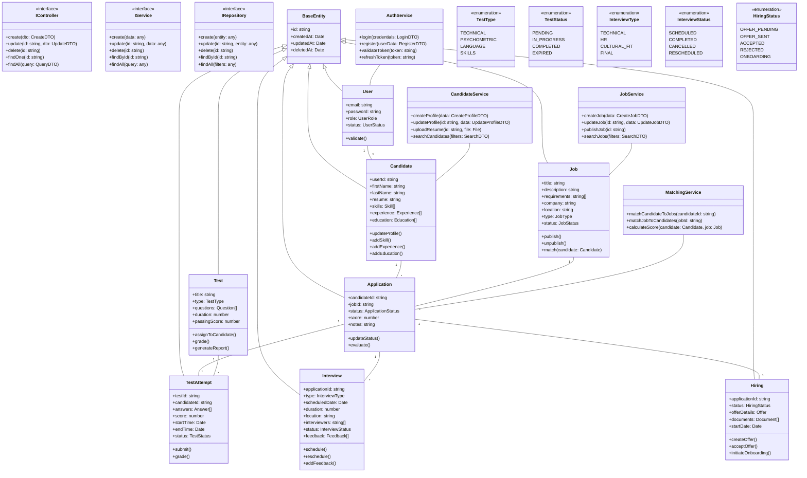

# Diagrama de Código

Este diagrama muestra la estructura de clases y sus relaciones en los servicios principales.

## Estructura de Clases

### Entidades Base
- **BaseEntity**: Clase base con campos comunes
- **IController**: Interfaz base para controladores
- **IService**: Interfaz base para servicios
- **IRepository**: Interfaz base para repositorios

### Entidades de Dominio
- **User**: Gestión de usuarios y autenticación
- **Candidate**: Información de candidatos
- **Job**: Información de empleos
- **Application**: Gestión de postulaciones

### Entidades de Evaluación
- **Test**: Definición de pruebas
- **TestAttempt**: Intentos de pruebas
- **Interview**: Gestión de entrevistas
- **Hiring**: Proceso de contratación

### Servicios Principales
- **AuthService**: Lógica de autenticación
- **CandidateService**: Gestión de candidatos
- **JobService**: Gestión de empleos
- **MatchingService**: Lógica de matching

## Patrones de Diseño

1. **Domain-Driven Design**
   - Entidades ricas en comportamiento
   - Agregados bien definidos
   - Servicios de dominio

2. **Repository Pattern**
   - Abstracción de persistencia
   - Operaciones CRUD base
   - Queries especializadas

3. **Factory Pattern**
   - Creación de entidades
   - Validación de datos
   - Inicialización consistente

4. **Strategy Pattern**
   - Algoritmos de evaluación
   - Procesos de matching
   - Flujos de trabajo
