# Diagrama de Componentes

Este diagrama muestra la estructura interna de los principales servicios del sistema ATS.

```mermaid
C4Component
    title Sistema ATS - Diagrama de Componentes

    Container_Boundary(api, "API Gateway") {
        Component(router, "Router", "Express.js", "Enrutamiento de peticiones")
        Component(auth_middleware, "Auth Middleware", "JWT", "Validación de tokens")
        Component(rate_limiter, "Rate Limiter", "Express-rate-limit", "Control de peticiones")
        Component(validator, "Validator", "Express-validator", "Validación de datos")
    }

    Container_Boundary(auth, "Servicio de Autenticación") {
        Component(auth_controller, "Auth Controller", "TypeScript", "Lógica de autenticación")
        Component(user_service, "User Service", "TypeScript", "Gestión de usuarios")
        Component(token_service, "Token Service", "JWT", "Gestión de tokens")
        Component(password_service, "Password Service", "Bcrypt", "Gestión de contraseñas")
    }

    Container_Boundary(candidates, "Servicio de Candidatos") {
        Component(candidate_controller, "Candidate Controller", "TypeScript", "API de candidatos")
        Component(profile_service, "Profile Service", "TypeScript", "Gestión de perfiles")
        Component(application_service, "Application Service", "TypeScript", "Gestión de aplicaciones")
        Component(resume_parser, "Resume Parser", "TypeScript", "Análisis de CV")
    }

    Container_Boundary(jobs, "Servicio de Empleos") {
        Component(job_controller, "Job Controller", "TypeScript", "API de empleos")
        Component(posting_service, "Posting Service", "TypeScript", "Gestión de publicaciones")
        Component(search_service, "Search Service", "Elasticsearch", "Búsqueda de empleos")
        Component(integration_service, "Integration Service", "TypeScript", "Integración con job boards")
    }

    Container_Boundary(matching, "Servicio de Matching") {
        Component(matching_controller, "Matching Controller", "TypeScript", "API de matching")
        Component(scoring_service, "Scoring Service", "TypeScript", "Evaluación de candidatos")
        Component(recommendation_engine, "Recommendation Engine", "TypeScript", "Motor de recomendaciones")
        Component(skills_analyzer, "Skills Analyzer", "TypeScript", "Análisis de habilidades")
    }

    ContainerDb(db, "Base de Datos", "PostgreSQL")
    ContainerDb(cache, "Cache", "Redis")
    Container(queue, "Cola de Mensajes", "RabbitMQ")

    %% Relaciones API Gateway
    Rel(router, auth_middleware, "Usa")
    Rel(router, rate_limiter, "Usa")
    Rel(router, validator, "Usa")

    %% Relaciones Auth Service
    Rel(auth_controller, user_service, "Usa")
    Rel(auth_controller, token_service, "Usa")
    Rel(user_service, password_service, "Usa")
    Rel(user_service, db, "Lee/Escribe")

    %% Relaciones Candidate Service
    Rel(candidate_controller, profile_service, "Usa")
    Rel(candidate_controller, application_service, "Usa")
    Rel(profile_service, resume_parser, "Usa")
    Rel(profile_service, db, "Lee/Escribe")
    Rel(application_service, queue, "Publica eventos")

    %% Relaciones Job Service
    Rel(job_controller, posting_service, "Usa")
    Rel(job_controller, search_service, "Usa")
    Rel(posting_service, integration_service, "Usa")
    Rel(posting_service, db, "Lee/Escribe")
    Rel(search_service, cache, "Usa")

    %% Relaciones Matching Service
    Rel(matching_controller, scoring_service, "Usa")
    Rel(matching_controller, recommendation_engine, "Usa")
    Rel(scoring_service, skills_analyzer, "Usa")
    Rel(recommendation_engine, db, "Lee")
```

## Componentes por Servicio

### API Gateway
- **Router**: Enrutamiento y distribución de peticiones
- **Auth Middleware**: Validación de autenticación
- **Rate Limiter**: Control de tasa de peticiones
- **Validator**: Validación de datos de entrada

### Servicio de Autenticación
- **Auth Controller**: Manejo de endpoints de autenticación
- **User Service**: Lógica de negocio de usuarios
- **Token Service**: Gestión de JWT
- **Password Service**: Encriptación y validación

### Servicio de Candidatos
- **Candidate Controller**: API de gestión de candidatos
- **Profile Service**: Gestión de perfiles
- **Application Service**: Gestión de postulaciones
- **Resume Parser**: Análisis de currículums

### Servicio de Empleos
- **Job Controller**: API de gestión de empleos
- **Posting Service**: Gestión de publicaciones
- **Search Service**: Motor de búsqueda
- **Integration Service**: Integración con portales

### Servicio de Matching
- **Matching Controller**: API de matching
- **Scoring Service**: Evaluación de candidatos
- **Recommendation Engine**: Sistema de recomendaciones
- **Skills Analyzer**: Análisis de habilidades

## Patrones Implementados

1. **MVC**
   - Controladores para la lógica de API
   - Servicios para la lógica de negocio
   - Modelos en la capa de datos

2. **Repository Pattern**
   - Abstracción de la capa de datos
   - Servicios independientes de la BD
   - Facilidad de testing

3. **Service Layer**
   - Separación de responsabilidades
   - Reutilización de lógica
   - Mantenibilidad mejorada 