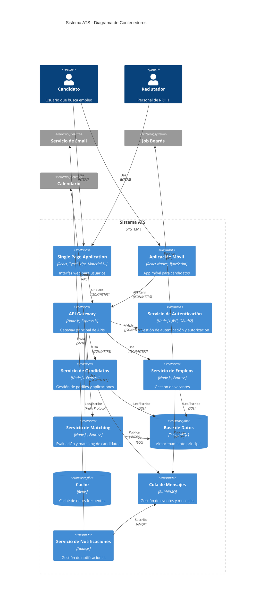

# Diagrama de Contenedores

Este diagrama muestra la arquitectura de alto nivel del sistema ATS y sus principales componentes.

## Componentes Principales

### Frontend
- **Single Page Application**: Interfaz web principal
- **Aplicación Móvil**: Versión móvil para candidatos

### Backend
- **API Gateway**: Punto de entrada único para todas las peticiones
- **Servicios Core**:
  - Autenticación
  - Gestión de Candidatos
  - Gestión de Empleos
  - Sistema de Matching
  - Notificaciones

### Almacenamiento
- **PostgreSQL**: Base de datos principal
- **Redis**: Sistema de caché

### Mensajería
- **RabbitMQ**: Sistema de colas para eventos

## Patrones de Diseño Implementados

1. **API Gateway**
   - Punto único de entrada
   - Manejo de autenticación
   - Rate limiting
   - Logging centralizado

2. **Microservicios**
   - Servicios independientes
   - Bases de datos por servicio
   - Comunicación asíncrona

3. **Event-Driven**
   - Publicación/Suscripción de eventos
   - Procesamiento asíncrono
   - Desacoplamiento de servicios

4. **Caching**
   - Caché de datos frecuentes
   - Mejora de rendimiento
   - Reducción de carga en BD 