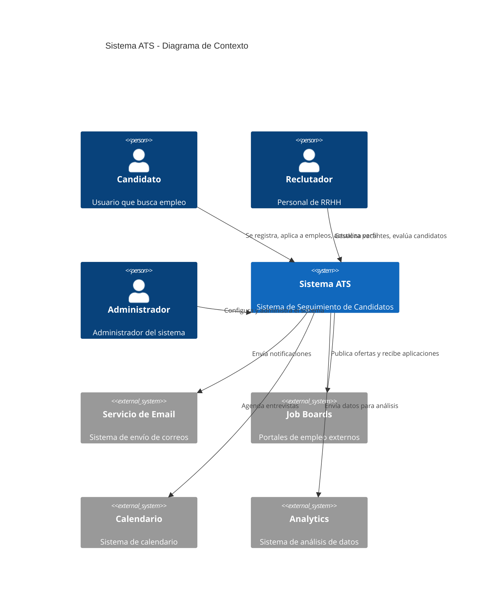

# Diagrama de Contexto

Este diagrama muestra la visión general del sistema ATS y su interacción con usuarios externos y sistemas.

## Elementos Principales

### Usuarios
- **Candidatos**: Personas que buscan empleo y aplican a las vacantes
- **Reclutadores**: Personal de RRHH que gestiona el proceso de selección
- **Administradores**: Responsables de la configuración y gestión del sistema

### Sistemas Externos
- **Servicio de Email**: Manejo de comunicaciones por correo electrónico
- **Job Boards**: Integración con portales de empleo
- **Calendario**: Gestión de agenda y entrevistas
- **Analytics**: Análisis de datos y reportes

## Responsabilidades

### Sistema ATS
1. Gestión de perfiles de candidatos
2. Publicación y gestión de vacantes
3. Proceso de selección automatizado
4. Comunicación con candidatos
5. Reportes y análisis
6. Agenda de entrevistas
7. Evaluación de candidatos 