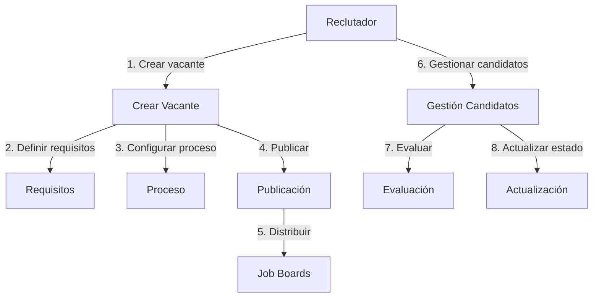
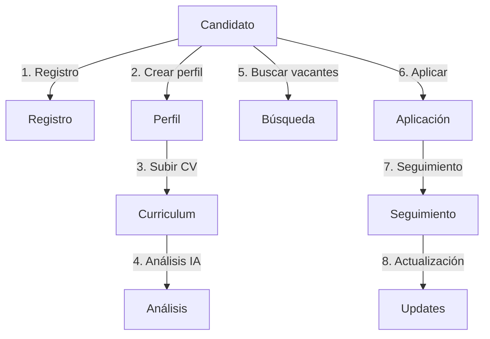
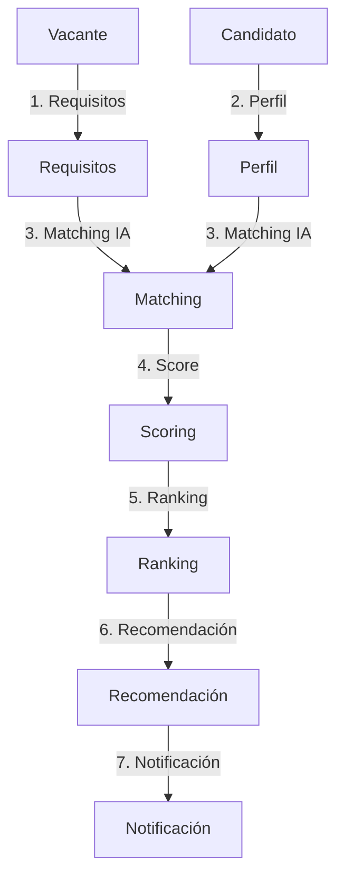
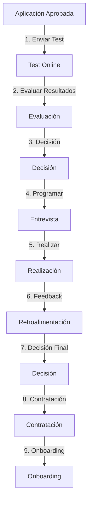

# Casos de Uso Principales

## 1. Publicación y Gestión de Vacantes

### Descripción
1. El reclutador crea una nueva vacante en el sistema
2. Define requisitos, habilidades y experiencia necesaria
3. Configura el proceso de selección (etapas, evaluaciones)
4. Publica la vacante
5. El sistema distribuye automáticamente a job boards
6. Gestiona candidatos que aplican
7. Evalúa perfiles y actualiza estados

## 2. Aplicación y Seguimiento de Candidatos

### Descripción
1. Candidato se registra en la plataforma
2. Crea/actualiza su perfil profesional
3. Sube su CV para análisis
4. Sistema analiza automáticamente sus habilidades
5. Busca vacantes compatibles
6. Aplica a posiciones
7. Realiza seguimiento de sus aplicaciones
8. Recibe actualizaciones automáticas

## 3. Matching y Evaluación Automatizada

### Descripción
1. Sistema recibe requisitos de vacante
2. Analiza perfiles de candidatos
3. Aplica algoritmos de matching
4. Calcula scores de compatibilidad
5. Genera ranking de candidatos
6. Recomienda mejores matches
7. Notifica a reclutadores y candidatos

## 4. Evaluación y Proceso de Contratación

### Descripción
1. Sistema envía test online al candidato
2. Candidato completa evaluación técnica/psicométrica
3. Sistema evalúa resultados automáticamente
4. Reclutador programa entrevistas según disponibilidad
5. Se realizan entrevistas (virtuales o presenciales)
6. Equipo proporciona retroalimentación
7. Se toma decisión final
8. Proceso de contratación
9. Inicio de onboarding

### Características Principales
- Tests automatizados con tiempo límite
- Calendario integrado para entrevistas
- Evaluación colaborativa del equipo
- Workflow de aprobaciones
- Integración con sistema de RRHH
- Documentación digital del proceso

### Automatizaciones
- Envío automático de tests según perfil
- Recordatorios de entrevistas
- Consolidación de evaluaciones
- Generación de contratos
- Notificaciones en cada etapa

## Actores Principales

### Reclutador
- Gestiona vacantes
- Evalúa candidatos
- Gestiona proceso de selección

### Candidato
- Gestiona perfil
- Aplica a vacantes
- Realiza seguimiento

### Sistema
- Análisis automático
- Matching
- Notificaciones
- Integración con externos

## Actores Adicionales

### Evaluador Técnico
- Diseña tests técnicos
- Evalúa resultados
- Participa en entrevistas

### Equipo de RRHH
- Gestiona proceso de contratación
- Coordina documentación
- Maneja onboarding

### Sistema
- Gestión de tests online
- Calendario de entrevistas
- Workflow de aprobaciones
- Integración con sistemas externos 