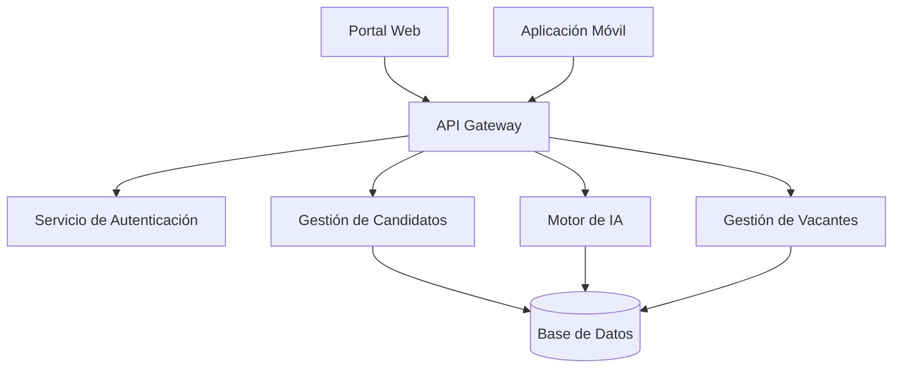
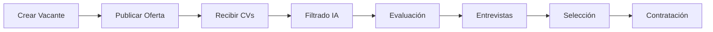
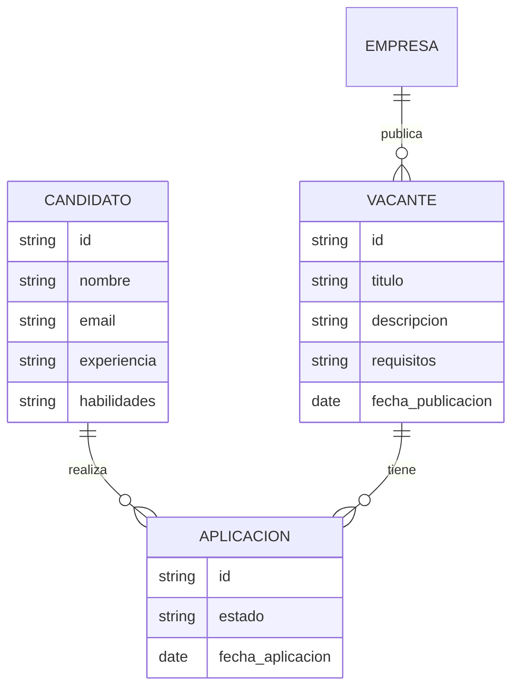
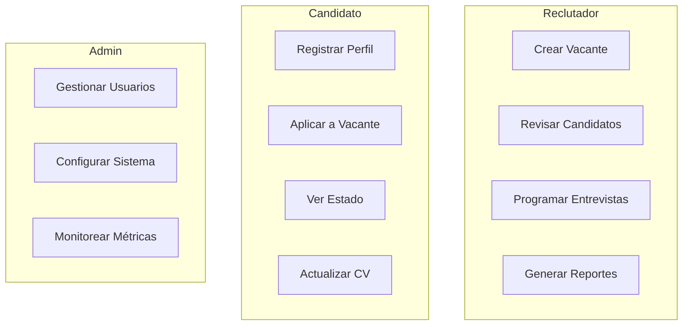
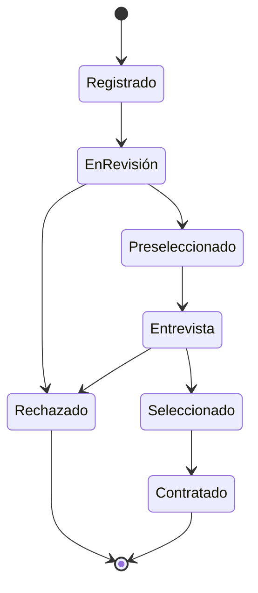
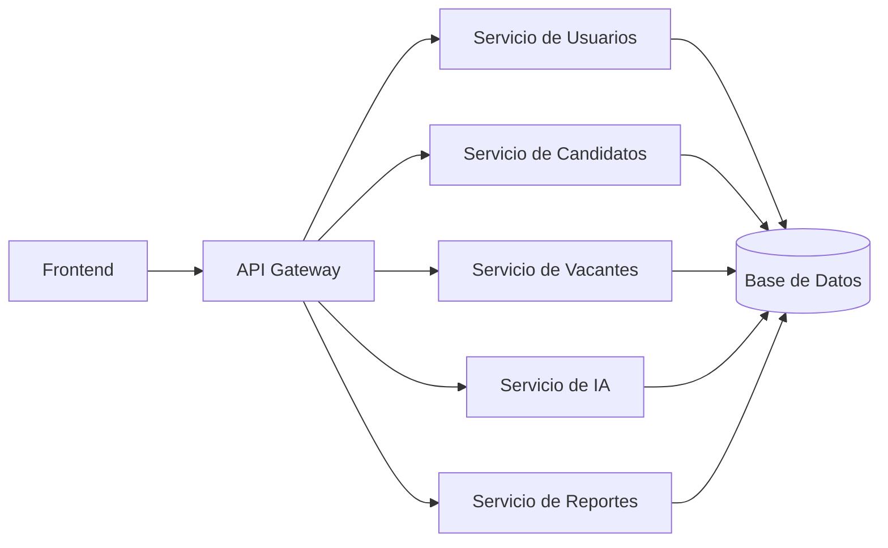
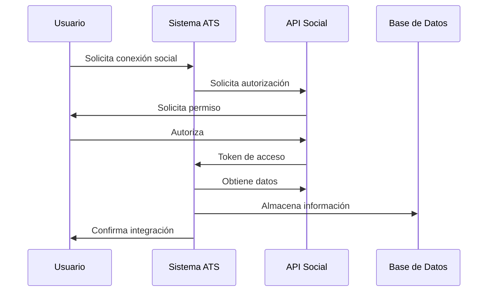
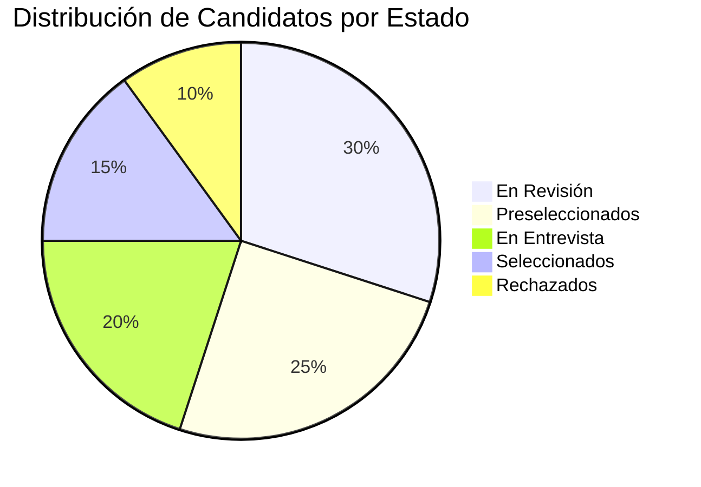
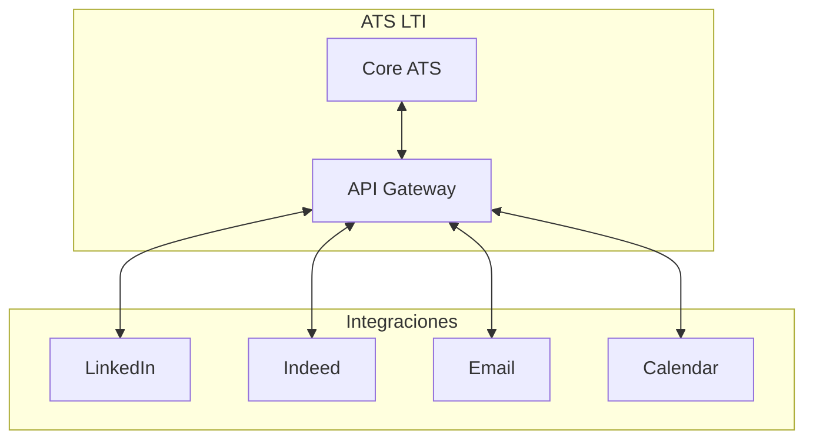
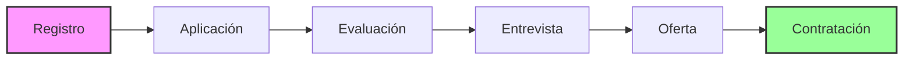

# Diagramas del Sistema ATS LTI

## 1. Arquitectura del Sistema

## 2. Flujo del Proceso de Reclutamiento

## 3. Modelo de Datos Simplificado

## 4. Casos de Uso

## 5. Proceso de Evaluación de Candidatos

## 6. Arquitectura de Microservicios

## 7. Flujo de Integración con Redes Sociales

## 8. Dashboard y Métricas

## 9. Integración con Sistemas Externos

## 10. Ciclo de Vida del Candidato

---

Estos diagramas proporcionan una visión completa de la arquitectura, flujos y procesos del sistema ATS de LTI. Los diagramas están creados usando la sintaxis Mermaid, que se renderiza automáticamente en plataformas como GitHub y GitLab.

Para visualizar estos diagramas correctamente, asegúrate de usar un visor de Markdown que soporte Mermaid, como GitHub, GitLab, o VSCode con la extensión adecuada. 