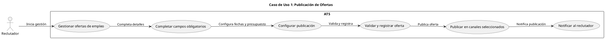
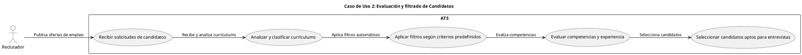
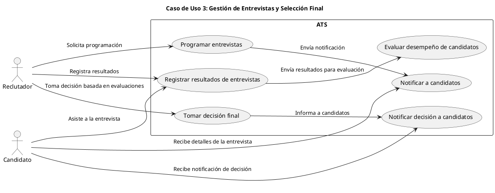
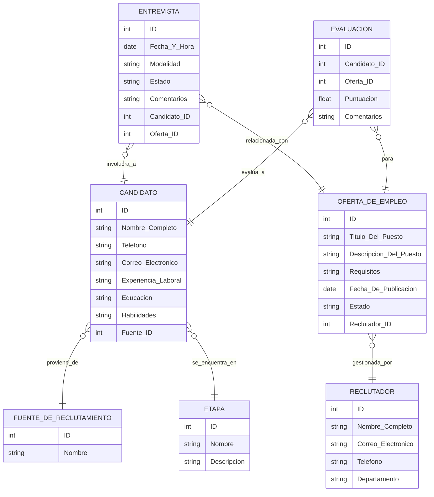
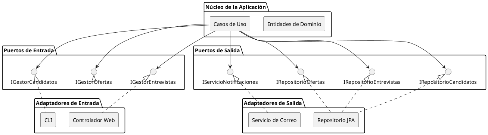
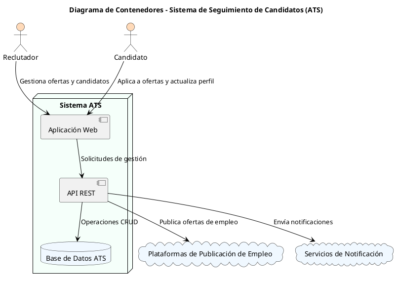
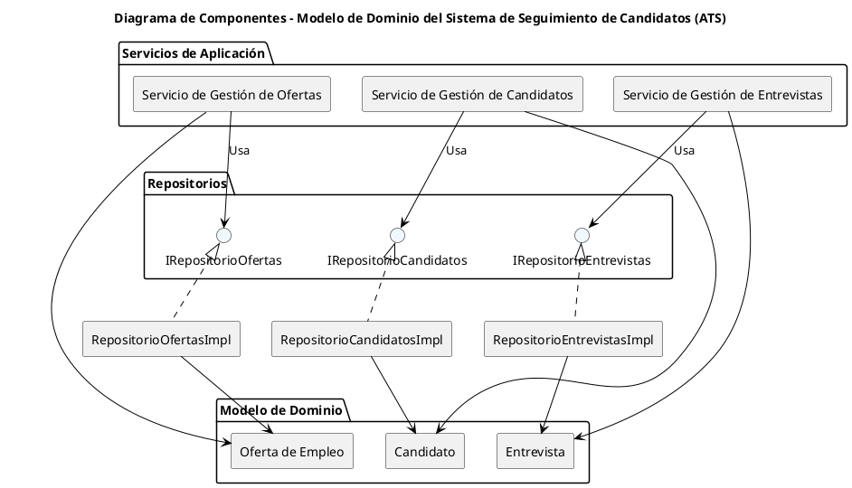
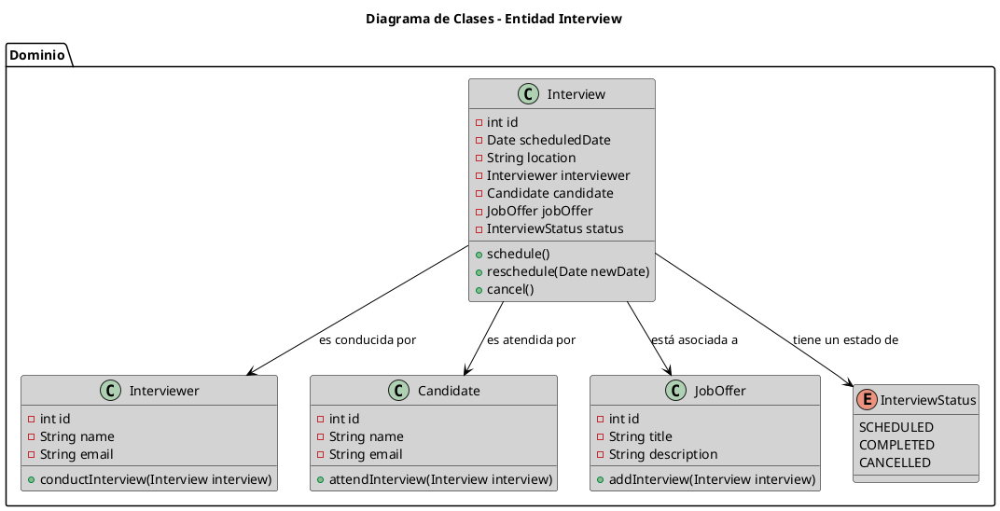

# --------DESCRIPCIÓN--------

# LTI: Applicant Tracking System (ATS)

LTI es un sistema de seguimiento de candidatos (ATS) es una herramienta de software que permite a las empresas y reclutadores gestionar, filtrar y automatizar el proceso de selección de personal

---

## 1. Funcionamiento del Software

El diagrama describe un ciclo continuo con los siguientes pasos:

1. **Publicación de ofertas de empleo**: Permite a los reclutadores crear y difundir vacantes en múltiples plataformas y portales de empleo desde una única interfaz.
2. **Recepción y almacenamiento de candidaturas**: Se recoge y organiza automáticamente las solicitudes de los candidatos en una base de datos centralizada.
3. **Filtrado y búsqueda de candidatos**: Se facilita la aplicación de filtros y la realización de búsquedas avanzadas para identificar a los candidatos que cumplen con los requisitos del puesto.
4. **Comunicación con candidatos**: Gestiona el envío de correos electrónicos automatizados para confirmar la recepción de solicitudes, informar sobre el estado del proceso o coordinar entrevistas.
5. **Programación de entrevistas**: Ofrece herramientas para coordinar y agendar entrevistas con los candidatos, integrándose con calendarios y plataformas de videoconferencia.
6. **Seguimiento del proceso de selección**: Permite asignar estados a los candidatos (por ejemplo, pendiente, en entrevista, rechazado, contratado) y realizar un seguimiento de su progreso en el proceso de selección.
7. **Generación de informes y métricas**: Proporciona estadísticas y análisis sobre el proceso de contratación, como el tiempo medio de contratación, la fuente de las candidaturas o la tasa de aceptación de ofertas.
8. **Gestión de la base de datos de candidatos**: Mantiene un registro actualizado de todos los candidatos que han participado en procesos anteriores, facilitando futuras contrataciones

---

## 2. Ventajas Competitivas en comparación con aquellas que no utilizan este tipo de sistemas

- **Aumento de la eficiencia en el proceso de contratación**: Automatizan tareas repetitivas como la publicación de ofertas de empleo, el filtrado de currículums y la programación de entrevistas, lo que reduce el tiempo dedicado a estas actividades y permite a los reclutadores enfocarse en tareas estratégicas.
- **Reducción de costos operativos**: Al optimizar y acelerar el proceso de selección, se disminuyen los recursos necesarios para contratar, lo que conlleva una reducción en los costos asociados al reclutamiento.
- **Mejora en la calidad de las contrataciones**: La capacidad de filtrar y clasificar automáticamente a los candidatos según criterios predefinidos permite centrar los esfuerzos en aquellos perfiles que mejor se ajustan a las necesidades de la empresa, elevando la calidad de las contrataciones.
- **Experiencia optimizada para los candidatos**: Facilita una comunicación fluida y profesional con los postulantes, mejorando su percepción de la empresa y fortaleciendo la marca empleadora.
- **Centralización y organización de la información**: Estos sistemas almacenan todos los datos y comunicaciones relacionadas con los candidatos en una única plataforma, lo que simplifica el acceso a la información y reduce el riesgo de errores.
- **Toma de decisiones basada en datos**: Se ofrecen herramientas de análisis y generación de informes que permiten evaluar la eficacia de las estrategias de reclutamiento y realizar ajustes informados para mejorar continuamente el proceso.
- **Cumplimiento normativo y seguridad de datos**: Garantizan que la gestión de la información de los candidatos cumpla con las regulaciones de protección de datos, reduciendo riesgos legales y fortaleciendo la confianza en la empresa.
---

## 3. Funciones Principales del Software

1. **Publicación y gestión de ofertas de empleo**  
   Permite crear y distribuir anuncios de trabajo en múltiples plataformas, como bolsas de empleo y redes sociales, desde una única interfaz.

2. **Almacenamiento centralizado de candidaturas**  
   Recopila y organiza todas las solicitudes en una base de datos central, facilitando el acceso y la gestión de la información de los candidatos.

3. **Filtrado y clasificación de candidatos**  
   Utiliza algoritmos para analizar currículums y perfiles, identificando a los candidatos que mejor se ajustan a los requisitos del puesto

4. **Seguimiento del proceso de seleccióno**  
   Monitorea en tiempo real el estado de cada candidatura, desde la recepción hasta la contratación, proporcionando una visión clara del pipeline de selección

5. **Automatización de la comunicación**  
   Facilita la interacción con los candidatos mediante el envío automático de correos electrónicos, confirmaciones y actualizaciones sobre el estado de su postulación.

6. **Programación de Entrevistas**  
   Ofrece herramientas para coordinar y agendar entrevistas, integrándose con calendarios y enviando recordatorios tanto a candidatos como a entrevistadores

7. **Generación de informes y análisis**  
   Proporciona métricas e informes personalizados que ayudan a evaluar la eficacia de las estrategias de reclutamiento y a identificar áreas de mejora.

8. **Cumplimiento normativo y seguridad de datos**  
   Garantiza que el proceso de contratación cumpla con las regulaciones legales vigentes en materia de protección de datos y prácticas de empleo justas.

9. **Mejora de la colaboración interna**  
   Facilita la comunicación y colaboración entre los miembros del equipo de recursos humanos, permitiendo compartir notas y evaluaciones de candidatos en una plataforma centralizada.

---

## 4. Lean Canvas - Modelo de Negocio

Este diseño provee una visión clara del modelo de negocio y funcionalidad de LTI, permitiendo su desarrollo ágil y enfocado en el MVP

---

# -------CASOS DE USO--------

# Casos de Uso Principales del Sistema ATS

A continuación, se describen los tres casos de uso principales en los que el sistema ATS.

---

## 1. Publicar ofertas de empleo

**Descripción:**  
Permite al reclutador crear y difundir vacantes en múltiples plataformas.

**Flujo de Actividades:**
1. El reclutador gestiona las ofertas de empleo y el proceso de selección
2. Completa los campos obligatorios (título, descripción, requisitos).
3. Configura la fecha de inicio y fin de la publicación, así como el presupuesto o tipo de publicación (si aplica).
4. El sistema valida la información y registra la oferta en la base de datos.
5. El sistema publica la oferta en los canales seleccionados y notifica al reclutador.

---

## 2. Evaluación y filtrado de Candidatos

**Descripción:**  
Cuando los candidatos comienzan a postularse, el sistema ATS **recibe y almacena** todos los CVs y datos en un repositorio central. Posteriormente, un **algoritmo de filtrado** (basado en criterios predefinidos o inteligencia artificial) clasifica a los candidatos, priorizando aquellos que cumplen mejor con los requisitos del puesto. Además, el sistema puede incluir **pruebas online** para evaluar habilidades técnicas o competencias específicas.

**Flujo de Actividades:**
1. El reclutador o el sistema revisa las solicitudes entrantes.
2. El algoritmo analiza las palabras clave y la experiencia del candidato (o se aplican criterios de filtrado manuales).
3. Se genera un ranking de los candidatos más adecuados.
4. Los candidatos preseleccionados reciben notificaciones o invitaciones para completar pruebas online.
5. Los resultados de las pruebas se añaden al perfil del candidato, alimentando el ranking y permitiendo un filtrado aún más preciso.

---

## 3. Gestión de Entrevistas y Selección Final

**Descripción:**  
Una vez identificados los candidatos más prometedores, el reclutador **programa las entrevistas** directamente desde el sistema, integrando calendarios y herramientas de videoconferencia. Los candidatos reciben invitaciones y recordatorios automáticos. Tras las entrevistas, el reclutador **registra los comentarios** y calificaciones en el ATS, lo que facilita la **toma de decisiones** sobre la contratación final.

**Flujo de Actividades:**
1. El reclutador selecciona los candidatos a entrevistar desde el módulo de gestión de candidatos.
2. Se elige la fecha, hora y modalidad de la entrevista (presencial o virtual).
3. El sistema envía invitaciones y recordatorios al candidato y al entrevistador.
4. Tras la entrevista, el reclutador o entrevistador registra sus impresiones y calificaciones en el sistema.
5. Se realiza la selección final del candidato y se genera la oferta laboral desde el ATS, cerrando así el proceso.

---

# --------MODELO ENTIDAD-RELACIÓN--------

# ------ALTO NIVEL--------

# Arquitectura Hexagonal para el Sistema ATS

La arquitectura del ATS (Applicant Tracking System) está siguiendo los **principios de la arquitectura hexagonal**.

---

## 1. Principios Básicos de la Arquitectura Hexagonal

1. **Dominio como Núcleo**
    - Contiene las **entidades** y la **lógica de negocio** principal.
    - No depende de detalles de infraestructura (frameworks, BD, servicios externos).

2. **Puertos (Ports)**
    - **Interfaces** que el **dominio** expone o requiere para interactuar con el mundo exterior.
    - Se clasifican en **puertos de entrada (inbound)** y **puertos de salida (outbound)**.

3. **Adaptadores (Adapters)**
    - **Implementaciones** concretas de los puertos, conectando el **núcleo** con tecnologías específicas (interfaces web, repositorios de datos, servicios externos, etc.).
    - Permiten la **inversión de dependencias**: el dominio define la interfaz, y el adaptador la implementa.

4. **Separación de Responsabilidades**
    - El **dominio** permanece limpio y enfocado en la **lógica de negocio**.
    - Los **adaptadores** se encargan de la **comunicación** con el exterior (UI, DB, servicios externos).
    - Los **casos de uso** o **servicios de aplicación** coordinan la interacción entre el dominio y los adaptadores.

---

## 2. Componentes Principales

Siguiendo la filosofía hexagonal, podemos dividir el ATS en las siguientes capas y componentes:

1. **Dominio (Domain Core)**
    - **Entidades de Negocio**: Ofertas (Job), Candidatos (Candidate), Aplicaciones (Application), Entrevistas (Interview), etc.
    - **Servicios de Dominio**: Lógica pura que define reglas de filtrado, asignación de entrevistas, cálculo de puntuaciones, etc.
    - **Agrega valor**: Se centra en **qué** hace el sistema, sin importar **cómo** se implementa la persistencia o la interfaz de usuario.

2. **Aplicación (Application Services / Use Cases)**
    - **Casos de Uso**: Representan las acciones principales (crear oferta, filtrar candidatos, programar entrevista, etc.).
    - **Coordina** la interacción entre el **dominio** y los **puertos** de entrada/salida.
    - Invoca a los **servicios de dominio** cuando se requiere lógica de negocio especializada.
    - Define los **puertos de entrada** (inbound) y de salida (outbound) que necesita para cumplir cada caso de uso.

3. **Puertos y Adaptadores**
    - **Puertos de Entrada (Inbound Ports)**:
        - Exponen los **casos de uso** del sistema a la interfaz de usuario u otros clientes.
        - Ejemplos: Controladores REST, Controladores GraphQL, CLI, etc.
    - **Puertos de Salida (Outbound Ports)**:
        - Interfaces definidas por la aplicación para interactuar con componentes externos (persistencia, servicios de notificación, portales de empleo, etc.).
        - Ejemplos: Repositorios para guardar y recuperar entidades, servicios de mensajería, integraciones con redes sociales, etc.
    - **Adaptadores de Entrada**:
        - Implementan los puertos de entrada, traduciendo las solicitudes del usuario (HTTP, CLI, etc.) a llamadas a los casos de uso.
    - **Adaptadores de Salida**:
        - Implementan los puertos de salida, encargándose de la **persistencia** en base de datos, la **publicación** de ofertas en portales externos, el **envío** de correos/SMS, etc.

4. **Infraestructura**
    - Alojamiento de la aplicación, configuración de bases de datos, contenedores, escalado, etc.
    - Normalmente no se representa en la arquitectura hexagonal como parte del dominio, sino como detalles externos que pueden variar.

---

## Diagramas C4
**Diagrama c4 del contenedor de ATS System**

**Diagrama c4 del componente Domain**

**Diagrama c4 del componente Interview Entity**

