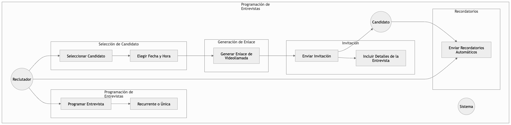
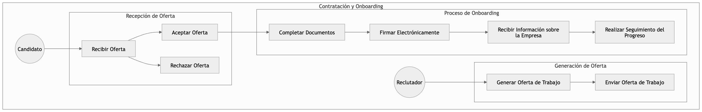
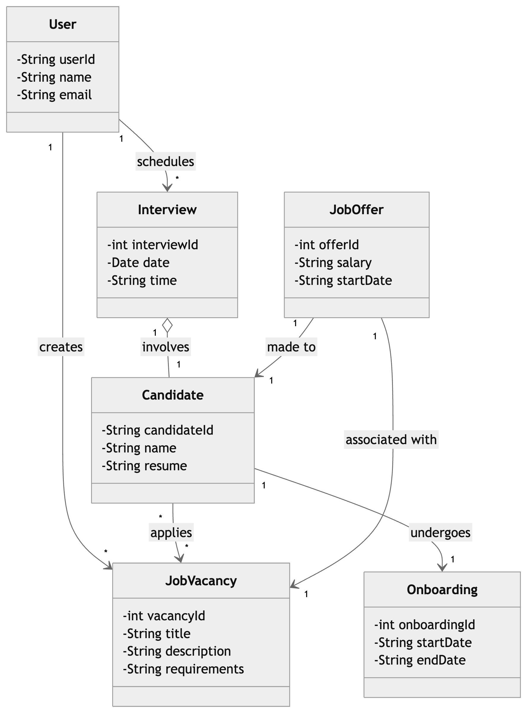

# 1) Descripción breve del software LTI, valor añadido y ventajas competitivas. Explicación de las funciones principales. Añadir un diagrama Lean Canvas para entender el modelo de negocio

LTI (Leads Talent Integration) es una plataforma innovadora de gestión de talento diseñada especialmente para pequeñas empresas, que automatiza y optimiza el proceso de reclutamiento y gestión de candidatos. A través de su interfaz intuitiva y su integración sencilla con plataformas de empleo, videoconferencia y herramientas de gestión de tareas, LTI ayuda a las pequeñas empresas a reducir el tiempo y los costos asociados con la contratación, asegurando un proceso eficiente, transparente y fácil de gestionar.

## Valor añadido y ventajas competitivas

### Accesibilidad y Simplicidad:
- LTI está diseñado para ser fácil de usar, incluso para empresas que no tienen un departamento de recursos humanos grande.
- La interfaz es intuitiva, permitiendo a los reclutadores manejar el proceso de contratación sin complicaciones.

### Automatización:
- La automatización de tareas como la publicación de vacantes, filtrado de candidatos, programación de entrevistas y envío de ofertas reduce significativamente el tiempo invertido en procesos repetitivos.

### Precios escalables:
- LTI ofrece un modelo de precios escalables, lo que permite que pequeñas empresas accedan a funcionalidades avanzadas sin un gran desembolso inicial. Los planes se adaptan al tamaño de la empresa y sus necesidades.

### Integración con plataformas externas:
- LTI se integra fácilmente con plataformas de empleo como LinkedIn, Indeed, Glassdoor y herramientas de videoconferencia como Zoom y Google Meet, asegurando que las vacantes sean publicadas rápidamente y que las entrevistas se realicen de manera eficiente.

### Gestión de talento integral:
- Ofrece un enfoque integral que no solo cubre la contratación, sino también el onboarding de nuevos empleados, con una experiencia fluida desde la contratación hasta la incorporación.

### Análisis de rendimiento:
- LTI proporciona informes detallados sobre el desempeño de las vacantes y los procesos de selección, permitiendo mejorar la eficiencia de futuras contrataciones.

## Funciones principales de LTI

### Gestión de Vacantes:
- Creación y publicación de vacantes de forma sencilla.
- Integración con plataformas de empleo para publicar vacantes automáticamente en sitios como LinkedIn, Indeed, etc.

### Filtrado de Candidatos:
- Filtrado automático de aplicaciones según requisitos establecidos (habilidades, experiencia, etc.), facilitando la preselección de candidatos.

### Programación de Entrevistas:
- Integración con Calendly para programar entrevistas de manera eficiente, permitiendo a los reclutadores y candidatos seleccionar horarios que les convengan.

### Automatización del Proceso de Selección:
- Envío automático de correos de confirmación y notificaciones sobre el estado de la postulación a los candidatos.

### Onboarding Digital:
- Automatización del onboarding para que los nuevos empleados puedan completar sus documentos y tareas previas a la incorporación de manera eficiente.

### Análisis y Reportes:
- Generación de informes visuales sobre el proceso de contratación, lo que permite a los reclutadores tomar decisiones informadas basadas en datos clave como el tiempo de contratación y las fuentes de candidatos.

## Conclusión:
LTI es una plataforma potente para pequeñas empresas, que les permite gestionar todo el ciclo de reclutamiento de manera eficaz y económica. Gracias a su automatización, integración con plataformas externas y enfoque en la experiencia del usuario, LTI ayuda a las pequeñas empresas a atraer y seleccionar el mejor talento de forma eficiente, mientras reduce el tiempo y los costos asociados con los procesos de contratación.

---

## 2) Descripción de los 3 casos de uso principales, con el diagrama asociado a cada uno

### Caso 1: Publicación de Vacantes y Recepción de Aplicaciones
**Título de la Historia de Usuario:** Publicación de Vacantes y Recepción de Aplicaciones

**Como reclutador,**
quiero crear y publicar vacantes de trabajo en múltiples plataformas,
para que los candidatos puedan postularse y se facilite el proceso de selección.

**Criterios de Aceptación:**
- El reclutador puede crear una vacante con campos como título, descripción, requisitos y ubicación.
- La vacante se publica automáticamente en plataformas de empleo externas (LinkedIn, Indeed, Glassdoor, etc.).
- Los candidatos pueden postularse a la vacante directamente desde la plataforma LIT.
- El reclutador puede filtrar las aplicaciones recibidas según criterios como habilidades y experiencia.

**Notas Adicionales:**
- El reclutador puede revisar las aplicaciones de forma centralizada desde la plataforma LIT.

**Historias de Usuario Relacionadas:**
- Programación de entrevistas.
- Gestión de candidatos.

### Caso 2: Programación de Entrevistas
**Título de la Historia de Usuario:** Programación de Entrevistas

**Como reclutador,**
quiero programar entrevistas con los candidatos seleccionados,
para que pueda evaluar sus habilidades y determinar si son adecuados para el puesto.

**Criterios de Aceptación:**
- El reclutador puede seleccionar un candidato y elegir una fecha y hora para la entrevista.
- El sistema genera un enlace para videollamada a través de plataformas como Zoom o Google Meet.
- El candidato recibe una invitación con los detalles de la entrevista y el enlace de acceso.
- El reclutador y el candidato reciben recordatorios automáticos antes de la entrevista.

**Notas Adicionales:**
- Se pueden programar entrevistas de forma recurrente o única, dependiendo de las necesidades.

**Historias de Usuario Relacionadas:**
- Publicación de vacantes y recepción de aplicaciones.
- Contratación y onboarding digital.

### Caso 3: Contratación y Onboarding Digital
**Título de la Historia de Usuario:** Contratación y Onboarding Digital

**Como reclutador,**
quiero generar y enviar ofertas de trabajo a los candidatos seleccionados,
para que puedan aceptar la oferta y comenzar el proceso de incorporación.

**Criterios de Aceptación:**
- El reclutador puede generar una oferta de trabajo con detalles como salario, beneficios y términos de empleo.
- El candidato recibe la oferta y tiene la opción de aceptarla o rechazarla.
- Si la oferta es aceptada, el candidato comienza el proceso de onboarding, que incluye completar documentos, firmar electrónicamente y recibir información sobre la empresa.
- El sistema realiza un seguimiento del progreso del onboarding del candidato.

**Notas Adicionales:**
- El onboarding incluye un conjunto de tareas y documentos específicos que deben completarse antes del primer día de trabajo.

**Historias de Usuario Relacionadas:**
- Programación de entrevistas.
- Publicación de vacantes y recepción de aplicaciones.

---

## 3) Modelo de datos que cubra entidades, atributos (nombre y tipo) y relaciones

El modelo de datos de LIT (Leads Talent Integration) está diseñado para cubrir todas las necesidades de la plataforma de gestión de talento y reclutamiento, organizando y estructurando la información de manera eficiente. A continuación, se detallan las entidades principales, sus atributos y las relaciones entre ellas, que permiten gestionar el proceso de reclutamiento desde la publicación de vacantes hasta el onboarding de nuevos empleados.

### Entidades y Atributos:

#### Empresa
- **ID (integer, PK):** Identificador único de la empresa.
- **Nombre (string):** Nombre de la empresa.
- **Sector (string):** Sector o industria de la empresa.
- **Tamaño (enum: micro, pequeña, mediana, grande, gigante):** Tamaño de la empresa según el número de empleados.
- **Relación:** Una empresa puede tener muchas vacantes.
- **Relación:** Empresa.ID → Vacante.Empresa_ID

#### Vacante
- **ID (integer, PK):** Identificador único de la vacante.
- **Nombre del Puesto (string):** Nombre del puesto para la vacante.
- **Descripción (text):** Descripción detallada del puesto de trabajo.
- **Requisitos (text):** Requisitos específicos para el puesto.
- **Fecha de Publicación (date):** Fecha en la que se publicó la vacante.
- **Estado (enum: abierta, cerrada, en proceso):** Estado de la vacante (si está abierta, cerrada o en proceso de selección).
- **Empresa_ID (integer, FK):** Relación con la entidad Empresa, para saber a qué empresa pertenece la vacante.
- **Relación:** Una vacante puede tener muchas aplicaciones de candidatos.
- **Relación:** Vacante.ID → Candidato.Vacante_ID

#### Candidato
- **ID (integer, PK):** Identificador único del candidato.
- **Nombre (string):** Nombre completo del candidato.
- **Correo Electrónico (string):** Correo electrónico del candidato.
- **Teléfono (string):** Número de teléfono del candidato.
- **Fecha de Nacimiento (date):** Fecha de nacimiento del candidato.
- **Curriculum Vitae (file):** Archivo que contiene el CV del candidato.
- **Estado de Aplicación (enum: pendiente, rechazado, seleccionado):** Estado de la aplicación del candidato para una vacante (pendiente, rechazado o seleccionado).
- **Vacante_ID (integer, FK):** Relación con la entidad Vacante, para saber a qué vacante está aplicando el candidato.
- **Relación:** Un candidato puede ser seleccionado para muchas entrevistas.
- **Relación:** Candidato.ID → Entrevista.Candidato_ID

#### Entrevista
- **ID (integer, PK):** Identificador único de la entrevista.
- **Fecha (datetime):** Fecha y hora en que se realiza la entrevista.
- **Ubicación (string):** Ubicación de la entrevista, ya sea física o virtual.
- **Candidato_ID (integer, FK):** Relación con la entidad Candidato, para saber quién está siendo entrevistado.
- **Vacante_ID (integer, FK):** Relación con la entidad Vacante, para saber para qué puesto se realiza la entrevista.
- **Estado (enum: programada, completada, cancelada):** Estado de la entrevista (programada, completada o cancelada).
- **Relación:** Una entrevista se lleva a cabo con un candidato para una vacante específica.

#### Oferta de Trabajo
- **ID (integer, PK):** Identificador único de la oferta de trabajo.
- **Fecha de Oferta (date):** Fecha en la que se realiza la oferta.
- **Salario Propuesto (decimal):** El salario propuesto para el puesto.
- **Beneficios (text):** Beneficios adicionales ofrecidos al candidato seleccionado.
- **Estado (enum: enviada, aceptada, rechazada):** Estado de la oferta (enviada, aceptada o rechazada).
- **Candidato_ID (integer, FK):** Relación con el Candidato al que se le realiza la oferta.
- **Vacante_ID (integer, FK):** Relación con la Vacante a la que está asociada la oferta.
- **Relación:** Una oferta de trabajo se hace a un candidato para una vacante.

#### Contratación
- **ID (integer, PK):** Identificador único de la contratación.
- **Fecha de Contratación (date):** Fecha en la que se realiza la contratación.
- **Candidato_ID (integer, FK):** Relación con el Candidato que ha sido contratado.
- **Vacante_ID (integer, FK):** Relación con la Vacante para la cual se realiza la contratación.
- **Contrato (file):** Archivo con el contrato firmado del candidato.
- **Relación:** Un candidato puede ser contratado para una vacante específica.

#### Onboarding
- **ID (integer, PK):** Identificador único del proceso de onboarding.
- **Fecha de Inicio (date):** Fecha en que comienza el onboarding.
- **Candidato_ID (integer, FK):** Relación con el Candidato que está siendo incorporado.
- **Empresa_ID (integer, FK):** Relación con la Empresa para saber en qué empresa está ocurriendo el onboarding.
- **Documentos de Onboarding (file):** Archivos asociados con el proceso de onboarding (manuales, políticas de la empresa, etc.).
- **Relación:** Un candidato pasa por el proceso de onboarding después de ser contratado.

### Relaciones Entre las Entidades:
- **Empresa tiene muchas Vacantes:** Relación 1:N (Una empresa puede tener muchas vacantes).
- **Vacante puede tener muchas Aplicaciones de Candidatos:** Relación 1:N (Una vacante puede recibir muchas aplicaciones).
- **Candidato puede ser entrevistado en muchas Entrevistas:** Relación 1:N (Un candidato puede ser entrevistado muchas veces).
- **Vacante puede generar muchas Entrevistas:** Relación 1:N (Una vacante puede generar muchas entrevistas para diferentes candidatos).
- **Candidato puede recibir muchas Ofertas de Trabajo:** Relación 1:N (Un candidato puede recibir varias ofertas).
- **Vacante puede generar muchas Ofertas de Trabajo:** Relación 1:N (Una vacante puede generar muchas ofertas a diferentes candidatos).
- **Candidato puede ser contratado en una Vacante:** Relación 1:1 (Un candidato es contratado para una vacante).
- **Candidato puede pasar por un Onboarding:** Relación 1:1 (Un candidato pasa por el onboarding una vez contratado).

---

## 4) Diseño del sistema a alto nivel, tanto explicado como diagrama adjunto

Para LIT (Leads Talent Integration), una plataforma de gestión de talento y reclutamiento para pequeñas empresas, te recomendaría una arquitectura escalable y modular basada en los principios de microservicios y utilizando los servicios gestionados de AWS para facilitar el desarrollo, la escalabilidad y la alta disponibilidad.

### Arquitectura de Alto Nivel para LIT en AWS

#### Frontend (Aplicación Web)
- **Amazon S3:** Para alojar la aplicación frontend (HTML, CSS, JavaScript) de manera estática, utilizando Amazon S3 como almacenamiento.
- **Amazon CloudFront:** Para la distribución global del contenido estático, aprovechando la CDN de CloudFront para mejorar el tiempo de respuesta y la experiencia del usuario.

#### API Backend (Microservicios)
- **Amazon API Gateway:** Gestiona las peticiones HTTP(S) y las enruta a los servicios correspondientes. Permite escalar de forma automática y gestionar la seguridad (autenticación y autorización).
- **AWS Lambda:** Funciones sin servidor que manejan la lógica de negocio, como la creación de vacantes, filtrado de candidatos, programación de entrevistas y generación de ofertas de trabajo. Lambda permite escalar automáticamente según la demanda y solo paga por el uso real de recursos.
- **Amazon Cognito:** Para gestionar la autenticación y autorización de usuarios (reclutadores, candidatos, administradores), con opciones como inicio de sesión social (Google, Facebook) y protección contra fraudes.

#### Base de Datos
- **Amazon RDS (PostgreSQL o MySQL):** Para almacenar datos estructurados como vacantes, candidatos, entrevistas, ofertas y procesos de onboarding. RDS proporciona una solución gestionada que escala automáticamente y ofrece alta disponibilidad y backups automáticos.
- **Amazon DynamoDB:** Usado para almacenamiento de datos no estructurados, como logs de eventos, seguimiento de candidatos, o cualquier dato que no requiera relaciones complejas.

#### Almacenamiento de Archivos
- **Amazon S3:** Para almacenar archivos estáticos (como CVs, documentos de contratación, entrevistas grabadas), que luego pueden ser accesibles a través de una URL pública o privada.
- **Amazon Glacier:** Para almacenar archivos de forma archivada y a largo plazo, como registros históricos o documentos antiguos de onboarding.

#### Integración con Plataformas Externas
- **AWS Lambda + API Gateway:** Para integrar con plataformas externas de empleo como LinkedIn, Indeed, Glassdoor, etc., para la publicación de vacantes, utilizando API Gateway y funciones Lambda para la automatización de estos procesos.
- **Amazon SNS o Amazon SQS:** Usados para la comunicación entre microservicios y plataformas externas, lo que permite gestionar eventos de manera asíncrona (por ejemplo, cuando se publica una vacante o se programa una entrevista).

#### Videoconferencia
- **Amazon Chime SDK o integración con Zoom API:** Para permitir la integración de videollamadas directamente en la plataforma LIT, ofreciendo soporte para entrevistas virtuales. Amazon Chime es una opción escalable y fácil de integrar, pero también se puede utilizar Zoom API para integrar videoconferencias si se prefiere una plataforma externa.

#### Seguridad
- **AWS WAF (Web Application Firewall):** Para proteger la aplicación de vulnerabilidades comunes en las aplicaciones web y ataques de denegación de servicio (DDoS).
- **IAM (Identity and Access Management):** Para controlar el acceso a los recursos de AWS, asegurando que solo los usuarios autorizados puedan acceder a los servicios y datos críticos.
- **AWS Shield:** Protección adicional contra DDoS.

#### Automatización de Infraestructura
- **AWS CloudFormation:** Para gestionar la infraestructura como código, permitiendo la creación y el mantenimiento de todos los servicios de AWS de forma reproducible y automatizada.
- **Amazon CloudWatch:** Para monitorear y obtener métricas detalladas de los servicios, funciones Lambda y la base de datos, permitiendo alertas y registros en tiempo real.

#### Escalabilidad y Alta Disponibilidad
- **Amazon EC2 Auto Scaling:** Para gestionar la capacidad de las instancias EC2 y asegurarse de que la infraestructura se ajuste a la demanda, reduciendo costos y garantizando alta disponibilidad.
- **Amazon RDS Multi-AZ:** Para la base de datos, asegurando que haya una réplica en una zona de disponibilidad diferente para mejorar la disponibilidad.
- **Elastic Load Balancer (ELB):** Para distribuir el tráfico entre instancias backend y garantizar que el sistema sea escalable y resiliente.

---

## 5) Diagrama C4 que llegue en profundidad a uno de los componentes del sistema, el que prefieras

### Arquitectura de Alto Nivel para LIT en AWS

#### Frontend (Aplicación Web)
- **Amazon S3:** Para alojar la aplicación frontend (HTML, CSS, JavaScript) de manera estática, utilizando Amazon S3 como almacenamiento.
- **Amazon CloudFront:** Para la distribución global del contenido estático, aprovechando la CDN de CloudFront para mejorar el tiempo de respuesta y la experiencia del usuario.

#### API Backend (Microservicios)
- **Amazon API Gateway:** Gestiona las peticiones HTTP(S) y las enruta a los servicios correspondientes. Permite escalar de forma automática y gestionar la seguridad (autenticación y autorización).
- **AWS Lambda:** Funciones sin servidor que manejan la lógica de negocio, como la creación de vacantes, filtrado de candidatos, programación de entrevistas y generación de ofertas de trabajo. Lambda permite escalar automáticamente según la demanda y solo paga por el uso real de recursos.
- **Amazon Cognito:** Para gestionar la autenticación y autorización de usuarios (reclutadores, candidatos, administradores), con opciones como inicio de sesión social (Google, Facebook) y protección contra fraudes.

#### Base de Datos
- **Amazon RDS (PostgreSQL o MySQL):** Para almacenar datos estructurados como vacantes, candidatos, entrevistas, ofertas y procesos de onboarding. RDS proporciona una solución gestionada que escala automáticamente y ofrece alta disponibilidad y backups automáticos.
- **Amazon DynamoDB:** Usado para almacenamiento de datos no estructurados, como logs de eventos, seguimiento de candidatos, o cualquier dato que no requiera relaciones complejas.

#### Almacenamiento de Archivos
- **Amazon S3:** Para almacenar archivos estáticos (como CVs, documentos de contratación, entrevistas grabadas), que luego pueden ser accesibles a través de una URL pública o privada.
- **Amazon Glacier:** Para almacenar archivos de forma archivada y a largo plazo, como registros históricos o documentos antiguos de onboarding.

#### Integración con Plataformas Externas
- **AWS Lambda + API Gateway:** Para integrar con plataformas externas de empleo como LinkedIn, Indeed, Glassdoor, etc., para la publicación de vacantes, utilizando API Gateway y funciones Lambda para la automatización de estos procesos.
- **Amazon SNS o Amazon SQS:** Usados para la comunicación entre microservicios y plataformas externas, lo que permite gestionar eventos de manera asíncrona (por ejemplo, cuando se publica una vacante o se programa una entrevista).

#### Videoconferencia
- **Amazon Chime SDK o integración con Zoom API:** Para permitir la integración de videollamadas directamente en la plataforma LIT, ofreciendo soporte para entrevistas virtuales. Amazon Chime es una opción escalable y fácil de integrar, pero también se puede utilizar Zoom API para integrar videoconferencias si se prefiere una plataforma externa.

#### Seguridad
- **AWS WAF (Web Application Firewall):** Para proteger la aplicación de vulnerabilidades comunes en las aplicaciones web y ataques de denegación de servicio (DDoS).
- **IAM (Identity and Access Management):** Para controlar el acceso a los recursos de AWS, asegurando que solo los usuarios autorizados puedan acceder a los servicios y datos críticos.
- **AWS Shield:** Protección adicional contra DDoS.

#### Automatización de Infraestructura
- **AWS CloudFormation:** Para gestionar la infraestructura como código, permitiendo la creación y el mantenimiento de todos los servicios de AWS de forma reproducible y automatizada.
- **Amazon CloudWatch:** Para monitorear y obtener métricas detalladas de los servicios, funciones Lambda y la base de datos, permitiendo alertas y registros en tiempo real.

#### Escalabilidad y Alta Disponibilidad
- **Amazon EC2 Auto Scaling:** Para gestionar la capacidad de las instancias EC2 y asegurarse de que la infraestructura se ajuste a la demanda, reduciendo costos y garantizando alta disponibilidad.
- **Amazon RDS Multi-AZ:** Para la base de datos, asegurando que haya una réplica en una zona de disponibilidad diferente para mejorar la disponibilidad.
- **Elastic Load Balancer (ELB):** Para distribuir el tráfico entre instancias backend y garantizar que el sistema sea escalable y resiliente.

