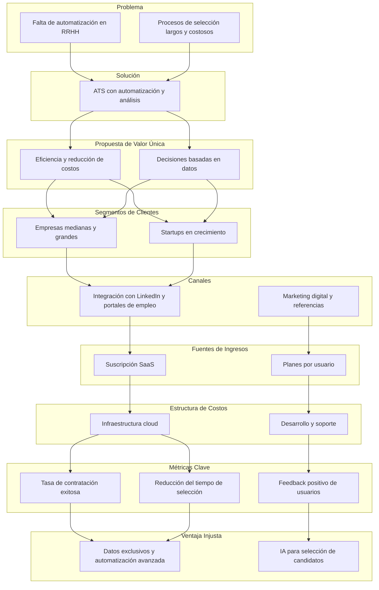
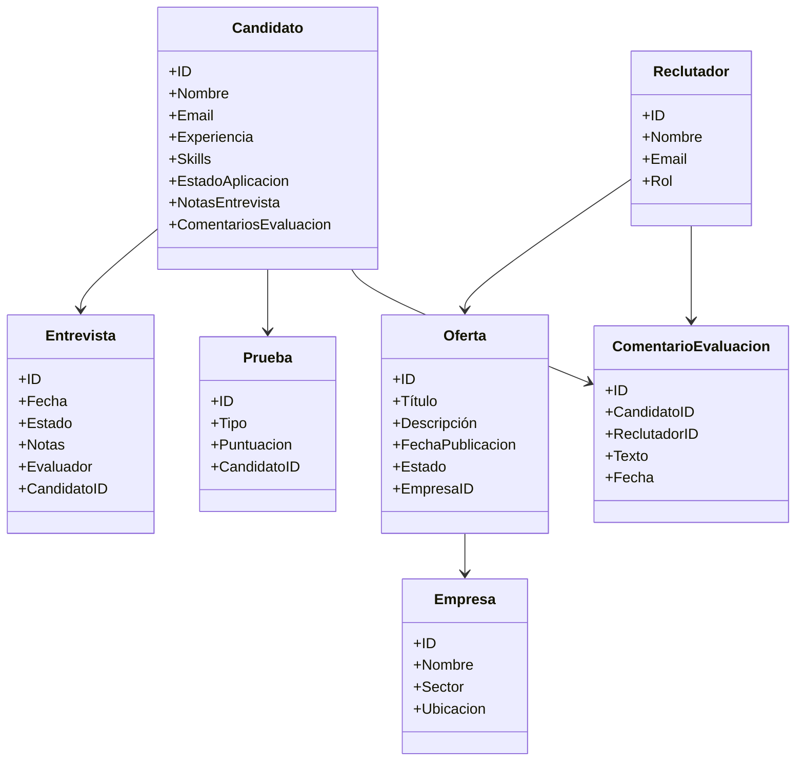
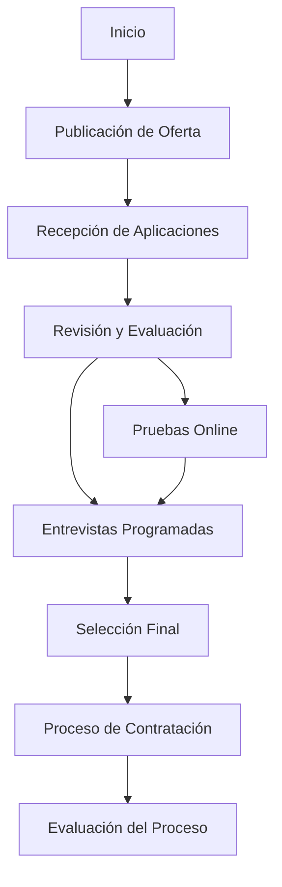

# Diseño del Sistema de Gestión de Candidatos - LTI

## 1. Descripción del Software

LTI es un Applicant-Tracking System (ATS) innovador diseñado para optimizar el proceso de contratación mediante automatización avanzada. Su valor añadido radica en la mejora de la eficiencia de los departamentos de Recursos Humanos, la colaboración en tiempo real entre reclutadores y managers, y la capacidad de automatizar tareas repetitivas.

### **Ventajas Competitivas**

- **Automatización inteligente**: Reducción del trabajo manual con flujos de trabajo automatizados.
- **Colaboración en tiempo real**: Espacio compartido entre reclutadores y managers con comentarios y evaluaciones.
- **Integraciones clave**: Conexión con LinkedIn, portales de empleo y herramientas de entrevista.
- **Análisis avanzado**: Generación de reportes con insights de contratación.

## 2. Funcionalidades Principales

1. **Publicación y gestión de ofertas de empleo**
2. **Seguimiento automatizado de candidatos**
3. **Colaboración en tiempo real**
4. **Integraciones con plataformas externas**
5. **Generación de reportes y análisis de datos**
6. **Manejo de entrevistas y pruebas automáticas**
7. **Retroalimentación estructurada entre equipos de reclutamiento**

## 3. Lean Canvas



## 4. Modelo de Datos Mejorado



## 5. Arquitectura del Sistema Mejorada

```mermaid
graph TD;
    UI[Frontend Web (React)] -->|API Requests| API[Backend (Node.js + Express)]
    API -->|Gestión de Datos| DB[PostgreSQL]
    API -->|Integración| EXT[LinkedIn, Portales de Empleo]
    API -->|Gestión de Entrevistas y Pruebas| TEST[Módulo de Evaluación]
    API -->|Generación de Reportes| REPORT[BI y Análisis]
    API -->|Microservicio de Notificaciones| NOTIF[Gestión de Notificaciones]
    API -->|Autenticación| AUTH[Microservicio de Autenticación]
```

## 6. Flujo de Procesos Mejorado

