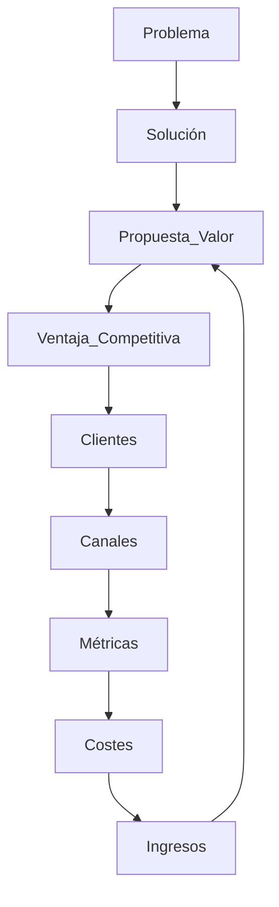
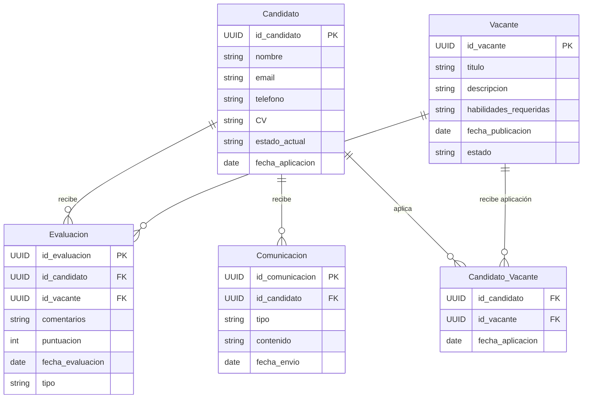
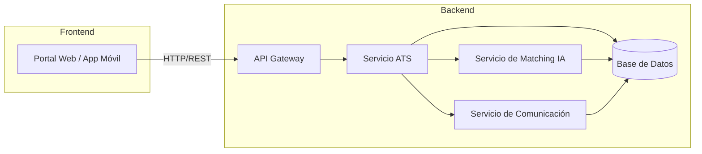

## 🚀 ATS de LTI: Applicant-Tracking System del Futuro

El Applicant-Tracking System (ATS) desarrollado por LTI es una solución innovadora diseñada para facilitar la gestión del reclutamiento, mejorando la eficiencia de los departamentos de Recursos Humanos mediante inteligencia artificial y un diseño centrado en el usuario. Se presenta como un sistema escalable, adaptado tanto a startups como grandes empresas, destacando por su simplicidad de uso y automatización inteligente en cada paso del proceso.

#### 🌟 Valor añadido y ventajas competitivas:

- Matching inteligente con IA: Emparejamiento automático preciso entre candidatos y vacantes.

- Comunicación Omnicanal Automática: Automatización del contacto personalizado con candidatos por WhatsApp y Email.

- Experiencia de usuario (UX) intuitiva, clara y amigable tanto para reclutadores como candidatos.

#### 🛠️ Funciones Principales (MVP):

- Publicación automática de ofertas de trabajo en múltiples canales (multiposting).

- Parsing inteligente de CVs para extracción automática de información clave.

- Matching automatizado candidato-vacante basado en IA con puntuación de idoneidad.

- Gestión centralizada y visual del pipeline de reclutamiento.

- Comunicación automatizada y seguimiento omnicanal (WhatsApp, Email) con los candidatos.

- Dashboard sencillo y transparente mostrando métricas clave del reclutamiento.

### 🗒️ Lean Canvas

| Elemento                     | Descripción                                                                                                                     |
| ---------------------------- | ------------------------------------------------------------------------------------------------------------------------------- |
| **Problema**                 | - Procesos lentos y repetitivos - Filtrado de candidatos ineficiente - Mala experiencia del usuario                       |
| **Solución**                 | Publicación automática multicanal, Parsing inteligente de CV, Matching automatizado con IA, Comunicación omnicanal automatizada |
| **Propuesta Única de Valor** | ATS intuitivo con IA para acelerar procesos y mejorar la experiencia del usuario                                                |
| **Ventaja Competitiva**      | IA accesible, UX superior, automatizaciones eficaces                                                                            |
| **Segmentos de Clientes**    | Startups, PYMEs y grandes empresas                                                                                              |
| **Canales**                  | Sitio web propio, Marketing digital, Demo y prueba gratuita                                                                     |
| **Estructura de Costes**     | Desarrollo del software, Mantenimiento de infraestructura tecnológica, Soporte técnico y atención al cliente                    |
| **Fuentes de Ingreso**       | Suscripción mensual, Modelo freemium, Planes escalables por uso                                                                 |

## 📌 Caso de Uso 1: Gestión y seguimiento integral del candidato durante todo su Customer Journey

Descripción:
El sistema ATS de LTI facilita la gestión integral del proceso de reclutamiento, cubriendo todas las interacciones clave entre reclutadores, managers y candidatos. Desde que la candidatura es recibida hasta la decisión final, el ATS simplifica y automatiza el seguimiento en tiempo real, la comunicación personalizada y la transparencia del proceso.

#### 🎯 Actores involucrados:

- Reclutador: Gestiona y coordina el proceso completo de reclutamiento.
- Manager: Participa consultando información y proporcionando feedback durante la evaluación de candidatos.
- Candidato: Recibe información constante sobre el estado de su proceso y puede consultar directamente el estado de su candidatura.

#### 🚦 Flujo de Caso de Uso (integrado):

- El candidato aplica a una oferta publicada y recibe automáticamente una confirmación inmediata (email/WhatsApp).
- El reclutador revisa la candidatura en el ATS, visualizando la información extraída automáticamente del CV (parsing inteligente).
- El ATS mueve automáticamente al candidato a la etapa inicial del pipeline, activando la comunicación automatizada.
- El candidato consulta el estado actual de su candidatura en el portal específico ofrecido por el ATS.
- El reclutador avanza al candidato a la siguiente fase (por ejemplo, entrevista inicial), y registra notas o evaluaciones.
- El candidato recibe una notificación automática con información de la siguiente etapa (entrevista, prueba técnica, etc.).
- El manager consulta los detalles del candidato antes de las entrevistas o evaluación, pudiendo añadir comentarios o valoraciones.
- El reclutador actualiza el estado de la candidatura tras evaluar conjuntamente con el manager, moviendo al candidato hacia fases finales o al descarte.
- Finalmente, el candidato recibe una comunicación automática sobre el resultado final del proceso (selección o rechazo), garantizando la transparencia total.

#### 📌 Diagrama UML completo (formato PlantUML):

## Caso de Uso 2: Matching Inteligente Automático basado en IA

Descripción del Caso de Uso:
El ATS de LTI usa algoritmos de inteligencia artificial para emparejar automáticamente candidatos y ofertas laborales, asignando una puntuación precisa a cada candidato según la adecuación de su perfil a los requisitos de la vacante publicada. Esto permite al reclutador centrarse en los candidatos más prometedores desde el principio, reduciendo considerablemente el tiempo del proceso.

#### 🎯 Actores involucrados:

- eclutador: Recibe automáticamente una lista priorizada de candidatos adecuados para cada vacante.
- Manager: Consulta y revisa candidatos sugeridos.
- Candidato: Envía su candidatura y recibe una puntuación de adecuación automática.
- Sistema IA (Sistema): Realiza el análisis automático y matching inteligente.

#### 🔄 Flujo del caso de uso integrado:

- El Reclutador crea y publica una nueva vacante en el ATS, indicando claramente requisitos y habilidades clave.
- El Candidato envía su candidatura a través del portal del ATS, adjuntando su CV.
- El ATS (IA) procesa automáticamente el CV mediante parsing inteligente, extrae información clave (habilidades, experiencia, estudios).
- El ATS (IA) compara automáticamente los datos extraídos del CV con los requisitos de la oferta laboral recién creada, generando una puntuación o ranking de adecuación.
- El ATS actualiza automáticamente el pipeline de candidatos, indicando la puntuación de cada uno.
- El Reclutador consulta el ranking generado por el sistema para priorizar la revisión de los candidatos mejor puntuados.
- El Manager puede acceder al ranking y la información relevante, colaborando en la toma de decisiones sobre entrevistas o siguiente fase.
  Basándose en la información proporcionada por el sistema, el Reclutador mueve candidatos al siguiente paso o los descarta con rapidez.

#### 📌 Diagrama UML (PlantUML):

## Caso de Uso 3: Comunicación Omnicanal Automatizada con Candidatos

#### 📌 Descripción del Caso de Uso:

El ATS de LTI automatiza la comunicación con los candidatos durante todo el proceso de reclutamiento mediante múltiples canales (principalmente Email y WhatsApp). Esto asegura una comunicación constante, personalizada y transparente, mejorando la experiencia del candidato y optimizando el trabajo del reclutador al reducir tareas repetitivas.

#### 🎯 Actores implicados:

- Reclutador (usuario que gestiona las interacciones automatizadas)
- Candidato (recibe comunicaciones automatizadas)
- ATS (Sistema) (automatiza y ejecuta las comunicaciones)

#### 🔄 Flujo integrado del caso de uso:

- El Reclutador configura los mensajes automatizados predeterminados en el ATS para distintas etapas del proceso de selección (confirmación recepción CV, invitaciones entrevistas, comunicaciones de seguimiento, decisión final).
- El Candidato aplica a una vacante, y recibe inmediatamente una confirmación automática personalizada por el canal elegido (email, WhatsApp).
- Al avanzar en las etapas del proceso (entrevista, pruebas técnicas, oferta), el ATS envía automáticamente mensajes personalizados de actualización del estado del candidato.
- El Candidato interactúa con los mensajes recibidos, pudiendo responder directamente a través del canal seleccionado si se requiere confirmación o aclaración adicional.
- El Reclutador tiene acceso a un historial completo de comunicaciones entre el candidato y el ATS, asegurando trazabilidad completa y transparencia en todo momento.

#### 📌 Diagrama UML (PlantUML correcto y buenas prácticas):

## 📚 Modelo de datos del ATS de LTI (MVP) – Revisado y Correcto

#### 🗃️ Entidades y atributos principales:

- Candidato
  - id_candidato: UUID
  - nombre: String
  - email: String
  - telefono: String
  - CV: Texto
  - estado_actual: Enum (Postulado, Entrevista, Evaluación técnica, Oferta, Contratado, Descartado)
  - fecha_aplicacion: Fecha
- Vacante
  - id_vacante: UUID
  - titulo: String
  - descripcion: Texto
  - habilidades_requeridas: Texto
  - fecha_publicacion: Fecha
  - estado: Enum (Abierta, Cerrada)
- Evaluacion
  - id_evaluacion: UUID
  - id_candidato: UUID (referencia al candidato)
  - id_vacante: UUID (vacante específica para la cual se evalúa)
  - comentarios: Texto
  - puntuacion: Entero (0-100) [Puntuación asignada por IA]
  - fecha_evaluacion: Fecha
  - tipo: Enum (Automática IA, Manual Usuario)
- Comunicacion
  - id_comunicacion: UUID
  - id_candidato: UUID
  - tipo: Enum (WhatsApp, Email)
  - contenido: Texto
  - fecha_envio: Fecha
- Usuario (Reclutador/Manager)
  - id_usuario: UUID
  - nombre: Texto
  - rol: Enum (Reclutador, Manager)
  - email: String
  - password: Texto (encriptado)

#### 🔄 Relaciones entre entidades principales (correctas y completas)

- Un Candidato aplica a múltiples Vacantes (relación N:M).
- Cada Evaluacion está asociada a exactamente un - Candidato y una Vacante específica (relación N:1 con ambas entidades).
- Un Candidato recibe múltiples Comunicaciones automáticas (relación 1:N).
- Un Usuario (Reclutador o Manager) puede realizar múltiples evaluaciones manuales o revisar evaluaciones automáticas generadas por IA (relación opcional).
- La IA del ATS genera evaluaciones automáticas para candidatos según la vacante a la que aplican.

#### 📌 Diagrama actualizado en Mermaid (plantUML compatible con Markdown)

## Diseño del Sistema a Alto Nivel

El ATS de LTI está diseñado con una arquitectura de microservicios que permite escalabilidad, mantenibilidad y evolución modular. A continuación se describen las principales capas y componentes:

1. Interfaz de Usuario (Frontend):

   - Portal Web / App Móvil:
     - Proporciona una experiencia intuitiva y personalizada para candidatos, reclutadores y managers.
     - Permite consultar el estado de la candidatura, gestionar el pipeline y visualizar informes de desempeño.

2. API Gateway:
   - Punto de entrada único para todas las solicitudes (HTTP/REST) provenientes de la interfaz de usuario.
   - Encargado de la autenticación, autorización, enrutamiento y balanceo de carga.
3. Servicio ATS (Core Service):
   - Lógica central que gestiona la creación y actualización de vacantes, candidatos, evaluaciones y comunicaciones.
   - Proporciona endpoints para la gestión del proceso de selección y orquesta la interacción con otros servicios.
4. Servicio de Matching con IA:
   - Servicio especializado que ejecuta algoritmos de inteligencia artificial para analizar CVs y requisitos de vacantes.
   - Genera un ranking o puntuación de idoneidad para cada candidato, facilitando la toma de decisiones.
5. Servicio de Comunicación:
   - Gestiona el envío de mensajes automatizados (Emails y WhatsApp) a lo largo del proceso de selección.
   - Registra las comunicaciones enviadas y permite el seguimiento y trazabilidad del proceso.
6. Base de Datos:
   - Almacena de forma centralizada todas las entidades críticas: candidatos, vacantes, evaluaciones, comunicaciones y usuarios.
   - Garantiza la persistencia y consulta rápida de la información.

#### Diagrama del Diseño a Alto Nivel

## Diagrama C4 del Sistema

A continuación, te presento el Diagrama C4 completo del sistema, abarcando las 4 capas (niveles) del C4 y haciendo foco en el Servicio de Matching con IA. He utilizado PlantUML con la librería C4-PlantUML para asegurar que cada nivel se representa de forma clara y siguiendo las buenas prácticas.

#### Nivel 1: Contexto del Sistema

#### Nivel 2: Diagrama de Contenedores

#### Nivel 3: Diagrama de Componentes (Servicio de Matching con IA)

#### Nivel 4: Diagrama de Código (Nivel Detallado para el Matching Engine)

#### Explicación General

- Nivel 1 (Contexto del Sistema): Se identifican los actores externos (Reclutador/Manager y Candidato) y se sitúa el ATS de LTI en su contexto, mostrando cómo interactúan con él.
- Nivel 2 (Contenedores): Se detalla la arquitectura de alto nivel del sistema, dividiéndolo en contenedores (Frontend, API Gateway, Servicios Core, Servicio de Matching, Servicio de Comunicación y Base de Datos) y se muestran sus interacciones.
- Nivel 3 (Componentes): Se profundiza en el Servicio de Matching con IA, descomponiéndolo en componentes clave que gestionan el parsing de CV, el matching propiamente dicho, el cálculo de ranking y la integración con modelos de ML, junto con la comunicación con la base de datos.
- Nivel 4 (Código): Se muestra un diagrama de clases simplificado que ilustra la estructura interna del Matching Engine, destacando la relación con el Ranking Service y el ML Model Service.
