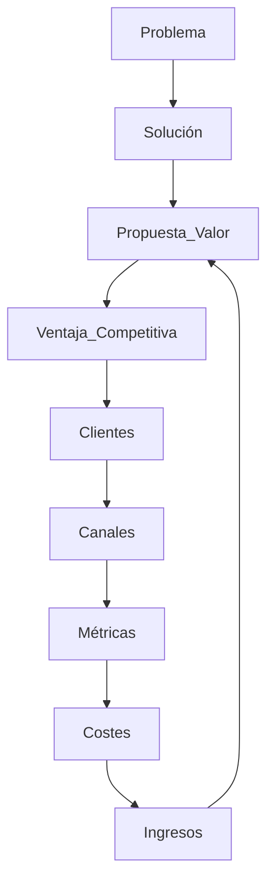
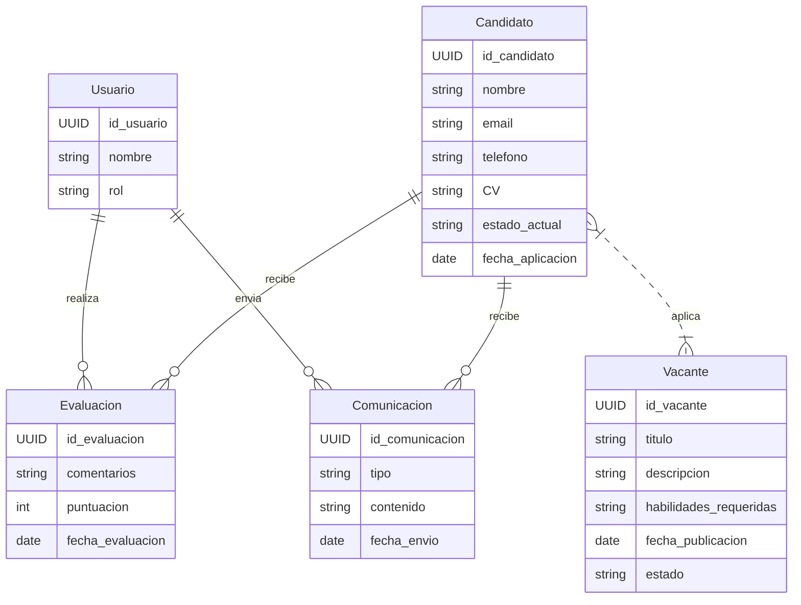
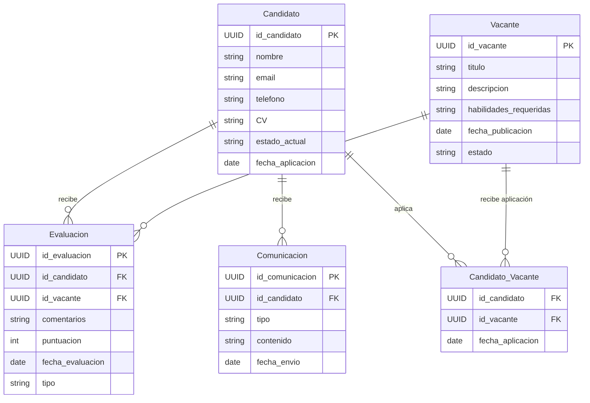
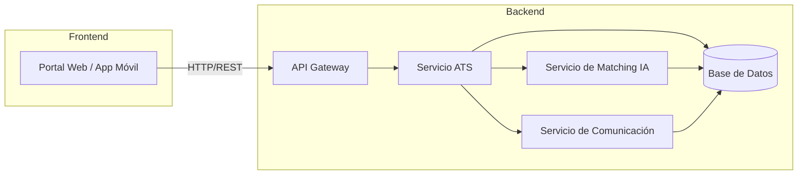
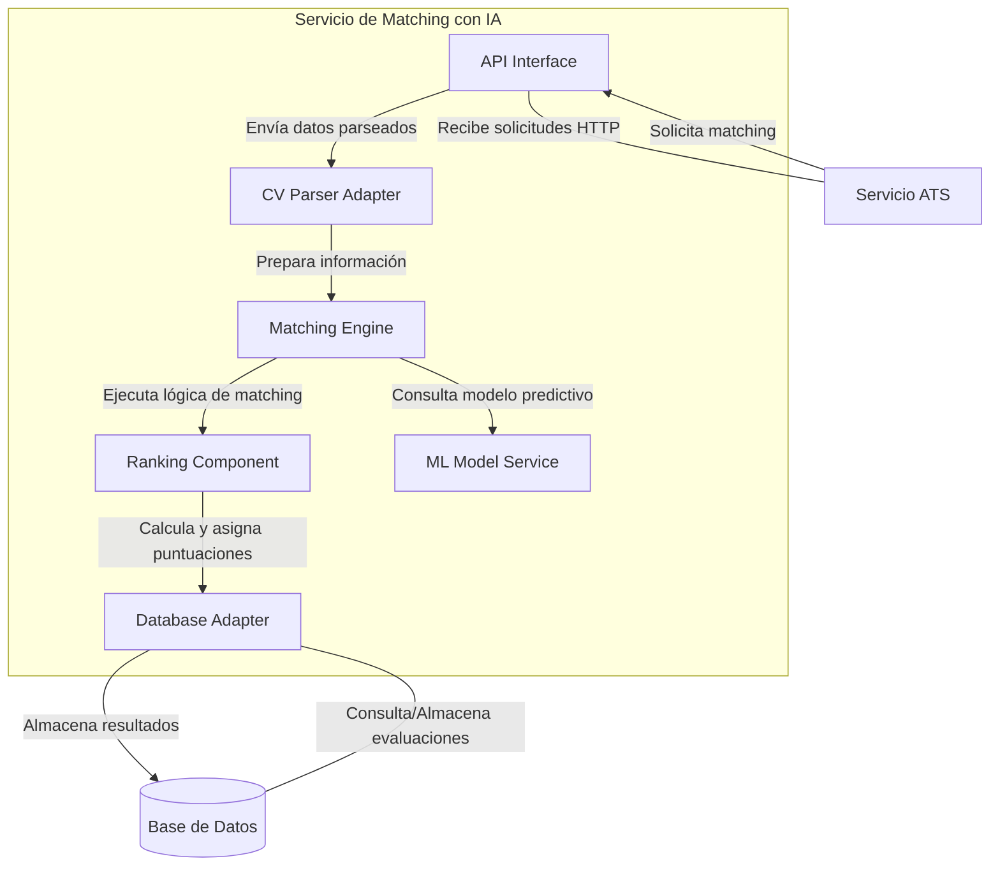

# Prompt inicial

LTI es una startup que quiere desarrollar el ATS (Applicant-Tracking System) del futuro tomando como referencia la imagen. Tu misión es actuar como product manager y definir esas funcionalidades clave que harán brillar a LTI por encima de los competidores: aumentar la eficiencia para los departamentos de HR, mejorar la colaboración en tiempo real entre reclutadores y managers, automatizaciones, asistencia de IA en diversas tareas y cualquier otro punto que consideres clave.

## Objetivo

Tu misión es diseñar la primera versión del sistema, entregando los siguientes artefactos:

- Descripción breve del software ATS de LTI, valor añadido y ventajas competitivas. Explicación de las funciones principales. Añadir un diagrama Lean Canvas para entender el modelo de negocio
- Descripción de los 3 casos de uso principales, con el diagrama asociado a cada uno
- Modelo de datos que cubra entidades, atributos (nombre y tipo) y relaciones
- Diseño del sistema a alto nivel, tanto explicado como diagrama adjunto
- Diagrama C4 que llegue en profundidad a uno de los componentes del sistema, el que prefieras

## Modo de proceder

Antes de empezar con cada uno de los puntos, haremos un brainstorming, investigando cuáles pueden ser las claves del éxito respondiendo a una serie de preguntas. Después de este brainstorming, se procederá a la creación de los artefactos solicitados, yendo paso a paso dándote más contexto de lo que espero en cada uno de ellos. Cada artefacto deberá ser revisado y validado por mí para realizar cualquier modificación que se considere necesaria, antes de proceder al siguiente. Sugiéreme como validar cada punto y pregúntame lo que consideres necesario para poder proceder.

## Salida

- Todos los artefactos solicitados, en formato markdown, con los diagramas incluidos en el mismo fichero en formato mermaid.

Si has entendido lo que vamos a hacer, házmelo saber y procederemos con el brainstorming.

# Respuesta Chat GPT 4.5

He entendido perfectamente la misión y el procedimiento que deseas seguir.

Procederemos paso a paso comenzando con un brainstorming enfocado en identificar cuáles son las funcionalidades clave y aspectos críticos para destacar al ATS de LTI frente a sus competidores.

Antes de comenzar con el brainstorming, me gustaría confirmar contigo lo siguiente:

1. ¿El ATS estará orientado principalmente a empresas medianas, grandes o startups? ¿O es una solución escalable para cualquier tamaño de empresa?
2. ¿Buscas que alguna característica o tecnología en particular destaque sobre otras, por ejemplo, la IA generativa, análisis predictivo o colaboración en tiempo real? ¿O todas ellas deben estar equilibradas en importancia?
3. ¿Se espera integración con otras plataformas empresariales (por ejemplo: sistemas de gestión de personal como SAP, Workday o SuccessFactors; herramientas de productividad como Slack o Teams)?
4. ¿Existe algún competidor en particular que quisieras tomar como referencia para entender mejor lo que actualmente está funcionando en el mercado?
   Una vez me confirmes estas preguntas, iniciamos inmediatamente con el brainstorming.

# Yo

5. el ATS debe ser escalable para cualquier tamaño de empresa
6. la característica o tecnología que debería destacar será aquella que identifiquemos en el brainstorming. No dudes en retomar y desarrollar estas ideas durante el mismo, además de cualquier otra que pueda surgir.
7. En principio no, hagámoslo simple por ahora considerando que lo que buscamos, aunque competitivo, es un MVP.
8. No conozco la competencia, pero si tu la conoces, cuando nos adentremos en el brainstorming puedes usar ese conocimiento para ir un paso más allá o buscar un factor diferenciante.

# Chat GPT 4.5

Perfecto, tu aclaración es muy útil. Procedamos entonces con el brainstorming.

Para ello, abordaré preguntas clave para definir los elementos fundamentales del producto y así identificar la característica o tecnología diferenciadora que buscas.

## 🔍 Preguntas para el Brainstorming:

Responderemos estas preguntas iniciales para determinar funcionalidades clave y posibles diferenciadores. Después de tu retroalimentación, procederemos con los artefactos solicitados.

## 💡 Propuesta de Valor y Diferenciación

- ¿Cuáles son los mayores problemas que enfrentan actualmente los departamentos de Recursos Humanos al utilizar ATS convencionales?
- ¿Qué tareas repetitivas y lentas podrían automatizarse de forma eficiente mediante IA o tecnología similar?
- ¿En qué procesos específicos la colaboración en tiempo real sería especialmente valiosa para los reclutadores y managers?
- ¿Hay algún aspecto especialmente frustrante para candidatos durante su interacción con los ATS que podría mejorarse?

## 🚀 Automatización e Inteligencia Artificial

- ¿Qué procesos podrían beneficiarse claramente del uso de IA generativa (ejemplo: redacción automática de ofertas de empleo, preguntas para entrevistas o respuestas personalizadas)?
- ¿En qué etapas consideras más efectivo implementar recomendaciones automáticas o predicciones (por ejemplo, predicción del ajuste cultural o técnico del candidato)?
- ¿Qué tareas relacionadas con la revisión de aplicaciones pueden automatizarse sin sacrificar la calidad o la equidad?

## 📌 Mejora de la Experiencia de Usuario (UX)

- ¿Qué aspectos podrían hacer que el sistema fuera extremadamente fácil de usar, incluso sin formación técnica previa?
- ¿Cómo podríamos mejorar la transparencia del proceso de selección tanto para candidatos como para reclutadores?
- ¿Qué información relevante necesitan ver inmediatamente los usuarios cuando ingresan al sistema?

## 🌐 Escalabilidad y Adaptabilidad

- ¿Qué aspectos del ATS deberían poder ajustarse fácilmente para adaptarse tanto a startups como a grandes empresas?
- ¿Qué tipo de métricas serían importantes visualizar en un dashboard general o analítico para el equipo de reclutamiento y gestión?

## 📢 Ideas adicionales:

Además, propongo algunas características avanzadas que podrían diferenciar considerablemente nuestro ATS:

- Chatbot inteligente: Interacción personalizada con candidatos, gestión de preguntas frecuentes, seguimiento automático.
- Analítica Predictiva: Modelos que identifiquen automáticamente a los candidatos con mayor probabilidad de éxito según distintos criterios predefinidos.
- Entrevistas basadas en IA: Análisis automático de respuestas de candidatos, proporcionando insights emocionales, lingüísticos o técnicos para preselección más precisa.
- Pipeline visual en tiempo real: Tableros Kanban dinámicos para una visualización clara del proceso de selección y la colaboración simultánea entre reclutadores y managers.
- Generación automática de pruebas técnicas personalizadas: Basadas en la descripción específica del trabajo.
- CV parsing avanzado: Lectura inteligente de CVs, extracción automática y estructuración de la información relevante.
- Automatización en la creación y distribución de vacantes: Un clic para publicar automáticamente en diversas plataformas (LinkedIn, Indeed, Glassdoor, etc.).
  Por favor, revisa estas preguntas e ideas, dime cuáles de estas áreas o funcionalidades te parecen más prometedoras, añade otras si crees que son necesarias o indica cualquier aspecto adicional que consideres relevante.

Tras recibir tu feedback, definiremos claramente la propuesta diferenciadora y comenzaremos a generar los artefactos solicitados.

# Yo

Es muy interesante todo lo que planteas y me ha dado varias ideas para seguir con el proceso de brainstorming, pero para no perder el foco e intentar simplificar el diseño inicial del sistema y, teniendo en cuenta que lo que estamos buscando en primer lugar es validar un MVP, vamos a centrarnos en una única propuesta de valor y diferenciación, que haga uso de la IA o no pero que tanga posibilidades de escalar con una alta eficiencia de costes inicial. Obviamente también queremos mejorar la experiencia de usuario y que sea un sistema extremadamente fácil de usar, transparente y con funcionalidades relevantes para los usuarios.

Para poder poder focalizar la propuesta y diseño del sistema inicial, voy a activar tu función de investigación en profundidad y analizaremos la competencia y el mercado actual tratando de responder a estas preguntas preguntas:

- ¿cuales deberían ser las funcionalidades básicas de un ATS ordenadas por prioridad?
- ¿cuales son las funcionalidades que harían que LTI se diferencie de sus competidores?
- ¿cuales son las funcionalidades que harían que LTI fuera más atractivo que sus competidores?
- ¿cuales son las funcionalidades que harían que LTI fuera más atractivo para los usuarios?
- ¿cuales son las funcionalidades que harían que LTI fuera más atractivo para los inversores?
- ¿cuales son las alternativas a utilizar un ATS?
- ¿Cómo es el customer journey normal de un cliente que usa un ATS?
- ¿podrías describir el customer journey de un cliente que usa un ATS?
- ¿Qué ATS open source son más conocidos?
- ¿Qué ATS comerciales son más conocidos?

# Chat GPT 4.5 con investigación en prundidad

Voy a realizar una investigación en profundidad sobre el mercado de los sistemas ATS para responder a todas las preguntas planteadas.

Antes de comenzar, ¿hay algún enfoque o región específica en la que te gustaría que nos centremos? (Por ejemplo, mercado global, América Latina, Europa, etc.)

Además, ¿te gustaría priorizar alguna de las preguntas en caso de que el volumen de información sea muy grande, o prefieres una visión lo más completa posible en todos los puntos?

# Yo

Vamos a priorizar España y estas preguntas:

- ¿cuales deberían ser las funcionalidades básicas de un ATS ordenadas por prioridad?
- ¿cuales son las funcionalidades que harían que LTI se diferencie de sus competidores?
- ¿cuales son las funcionalidades que harían que LTI fuera más atractivo que sus competidores?
- ¿Cómo es el customer journey normal de un cliente que usa un ATS?

# Chat GPT 4.5 con investigación en prundidad

Voy a investigar el mercado de ATS en España para responder a las preguntas clave que has planteado:

Identificar las funcionalidades básicas de un ATS, ordenadas por prioridad.
Explorar qué funcionalidades podrían diferenciar a LTI de sus competidores.
Analizar qué características harían a LTI más atractivo en comparación con la competencia.
Describir el customer journey típico de un usuario que utiliza un ATS.
Te informaré cuando tenga los resultados listos para tu revisión.

Research completed in 4m· 18 fuentes
Análisis del mercado de ATS en España

1. Funcionalidades básicas de un ATS (ordenadas por prioridad)
   Centralización de candidatos en una base de datos: el ATS recopila y almacena todos los CVs y datos de candidatos en un repositorio único. Esto crea una base de datos de talento reutilizable para posiciones futuras​
   BLOG.KENJO.IO
   , asegurando que ningún perfil se pierda y facilitando el seguimiento de cada candidato.
   Publicación multicanal de ofertas (multiposting): permite difundir ofertas de empleo en múltiples portales de trabajo y redes sociales desde una misma plataforma y con un solo clic​
   BLOG.KENJO.IO
   . Al publicar simultáneamente en distintos canales (LinkedIn, InfoJobs, etc.), se aumenta la visibilidad de la oferta y se atraen más candidatos.
   Filtrado y búsqueda eficiente de candidatos: el ATS automatiza la criba curricular mediante parsing de CVs (extracción de datos) y ofrece un buscador con palabras clave y filtros por habilidades, experiencia u otros criterios​
   BLOG.KENJO.IO
   . Esto permite identificar rápidamente los candidatos que mejor encajan en la posición y descartar los no aptos de forma objetiva.
   Seguimiento del candidato en el proceso (pipeline): proporciona un tablero visual de etapas donde se puede ver en qué fase está cada candidato (preselección, entrevista, oferta, etc.)​
   ISMARTRECRUIT.COM
   . El reclutador puede mover candidatos de una fase a otra y añadir notas o evaluaciones, garantizando que todos avanzan por el proceso de forma organizada.
   Comunicación automatizada con candidatos: la herramienta envía correos electrónicos y notificaciones automáticas en cada etapa del proceso (confirmación de recepción de CV, invitaciones a entrevista, actualización de estado)​
   ISMARTRECRUIT.COM
   . Esto mantiene informados a los candidatos de su progreso sin esfuerzo manual por parte de RR.HH., mejorando su experiencia.
   Portal de empleo y experiencia de candidato: muchos ATS incluyen un portal de candidatos (career site) personalizado con la marca de la empresa, optimizado para móvil, que ofrece un proceso de aplicación sencillo​
   BLOG.KENJO.IO
   . Los candidatos pueden inscribirse fácilmente (por ejemplo, aplicando con perfil de LinkedIn o adjuntando CV) reduciendo la fricción para inscribirse a las vacantes.
   Analítica y reportes: el ATS recopila métricas del proceso de selección (tiempo de cobertura, fuente de los candidatos, tasa de conversión por etapa, etc.) y genera informes personalizables​
   BLOG.KENJO.IO
   . La analítica permite evaluar la eficacia del reclutamiento e identificar mejoras (por ejemplo, qué canales traen mejores candidatos, cuántos días promedio toma contratar, etc.).
2. Funcionalidades diferenciadoras potenciales para LTI
   Para destacar sobre otros ATS del mercado, LTI podría incorporar funcionalidades avanzadas poco comunes en todos los competidores:
   Algoritmos de IA para matching inteligente: utilización de inteligencia artificial para analizar CVs y vacantes y emparejar automáticamente a los candidatos con las posiciones más adecuadas, generando rankings de idoneidad​
   ISMARTRECRUIT.COM
   . Esto agiliza la identificación de talento y va más allá del filtrado por palabras clave tradicional.
   Videoentrevistas integradas: herramientas integradas para realizar entrevistas por video, tanto en vivo como en diferido, e incluso permitir a los candidatos enviar una video-presentación en lugar de la carta de motivación​
   SOFTWAREDOIT.ES
   . Estas funcionalidades innovadoras agilizan la evaluación y ofrecen una experiencia más moderna, diferenciando la plataforma.
   Comunicación omnicanal con candidatos: integración de canales como SMS, WhatsApp y emails desde el ATS para contactar y dar seguimiento a los candidatos​
   BEETWEEN.ES
   . Por ejemplo, enviar recordatorios de entrevistas por WhatsApp o SMS complementando el email tradicional mejora los tiempos de respuesta y la cercanía con el candidato.
   Alta personalización y soporte consultivo: capacidad de adaptar el flujo de trabajo del ATS a los procesos específicos de cada empresa (etapas, permisos, formularios personalizados)​
   SOFTWAREDOIT.ES
   , contando además con soporte y asesoría especializada para implementar esas personalizaciones. Un ATS que se moldee a las necesidades del cliente (y no viceversa) aportará un valor diferencial.
   Integración y extensibilidad del sistema: ofrecer una API abierta e integraciones nativas con otras herramientas de RR.HH. (ERP de nóminas, evaluaciones psicométricas, sistemas de BI, etc.) para lograr un proceso de reclutamiento unificado​
   SOFTWAREDOIT.ES
   . Por ejemplo, conectar el ATS con plataformas de Business Intelligence permitiría combinar datos de selección con datos de desempeño posteriormente, algo que no todos los ATS facilitan.
3. Características que harían a LTI más atractivo frente a otros ATS
   Además de funcionalidades, existen atributos clave que podrían posicionar a LTI como una solución más atractiva en el mercado español:
   Facilidad de uso y buen soporte: una interfaz intuitiva y en español, de rápida adopción por parte de reclutadores y managers, combinada con soporte local ágil, son factores muy valorados. Los mejores ATS del mercado puntúan alto en usabilidad y atención al cliente (e.g. 4.8/5 en facilidad de uso y 4.7/5 en soporte en evaluaciones de usuarios)​
   SOFTWAREDOIT.ES
   , por lo que LTI debería sobresalir en este aspecto.
   Mayor eficiencia en tiempo y costes: demostrar que la herramienta reduce drásticamente el tiempo de contratación y el trabajo manual. Por ejemplo, el uso de un ATS puede acortar el time-to-hire y reducir el coste por contratación gracias a la automatización​
   BLOG.KENJO.IO
   . Si LTI puede respaldar con datos (como contratos un 86% más rápidos, según estudios) este ahorro de tiempo y dinero, será muy atractivo para los clientes.
   Mejor calidad de las contrataciones: garantizar que, con LTI, la empresa encuentra candidatos de mayor adecuación al puesto. El uso de tecnología de filtrado avanzado e IA suele traducirse en incorporaciones de mayor calidad​
   BLOG.KENJO.IO
   , lo cual es un argumento de peso (por ejemplo, 78% de profesionales dicen que un ATS mejora la calidad de los candidatos contratados).
   Experiencia del candidato superior y refuerzo de marca empleadora: LTI sería más atractivo si ayuda a las empresas a ofrecer una experiencia fluida y positiva a los candidatos, manteniéndolos informados y comprometidos en todo momento. Un ATS que automatiza comunicaciones y provee un portal amigable mejora la satisfacción del candidato y proyecta una imagen de marca empleadora sólida​
   BLOG.KENJO.IO
   . Esto no solo ayuda a conseguir al mejor candidato, sino a que este acepte la oferta y hable bien de la empresa.
   Colaboración interna y proceso transparente: la posibilidad de que todo el equipo de selección colabore dentro de LTI (compartiendo evaluaciones, puntuando candidatos, añadiendo comentarios) mejora la toma de decisiones​
   SOFTWAREDOIT.ES
   . Si LTI ofrece funciones de reclutamiento colaborativo fáciles de usar, los responsables de RR.HH. y los gerentes de contratación podrán trabajar alineados, lo que se traduce en decisiones más acertadas y clientes más satisfechos con el software.
4. Customer journey típico al utilizar un ATS
   El recorrido típico de un cliente (empresa) al implementar y usar un ATS como LTI abarca varias etapas, desde la creación de la vacante hasta la contratación final:
   Creación de la oferta de empleo: el proceso comienza cuando RR.HH. o el manager crea en el ATS la descripción del puesto (título, requisitos, etc.) y la publica en múltiples canales (portal corporativo, bolsas de empleo, LinkedIn, etc.) con un solo paso​
   ISMARTRECRUIT.COM
   . Esto garantiza una difusión amplia de la vacante sin esfuerzo duplicado.
   Recepción y recopilación de candidaturas: los candidatos interesados aplican a la oferta a través de formularios en línea o integraciones (por ejemplo, formulario del portal de empleo de la empresa). Toda la información enviada se almacena automáticamente en el ATS​
   ISMARTRECRUIT.COM
   , creando un expediente digital por candidato (CV, datos de contacto, respuestas a preguntas de filtro, etc.).
   Criba inicial automática: una vez llegan las candidaturas, el ATS analiza cada CV y extrae información clave (educación, experiencia, habilidades) mediante procesamiento de lenguaje natural​
   ISMARTRECRUIT.COM
   . Acto seguido, aplica filtros automáticos para descartar a quienes no cumplen requisitos básicos (p. ej., preguntas de knock-out sobre disponibilidad, experiencia mínima)​
   ISMARTRECRUIT.COM
   . De este modo, el sistema preselecciona a los candidatos que encajan en los criterios fundamentales, ahorrando tiempo al reclutador.
   Búsqueda y selección de candidatos idóneos: con el pool de candidatos cualificados en la base de datos, el reclutador puede buscar perfiles específicos mediante palabras clave o filtros avanzados (por ejemplo, años de experiencia, conocimientos de un software) para identificar a los mejores candidatos de forma rápida​
   BLOG.KENJO.IO
   . Muchos ATS incluyen funciones de puntuación o coincidencia que ayudan a priorizar a los aspirantes más adecuados.
   Entrevistas y gestión del pipeline: a medida que se seleccionan candidatos para siguientes fases, el ATS facilita la programación de entrevistas, integrándose con calendarios (como Google/Outlook) para encontrar disponibilidades y enviar invitaciones automáticas​
   ISMARTRECRUIT.COM
   . Conforme avanzan, cada candidato se mueve por las distintas etapas del pipeline (entrevista telefónica, técnica, entrevista final, etc.) dentro del sistema. El equipo de reclutamiento puede seguir el progreso en tiempo real, añadiendo comentarios o valoraciones en la ficha del candidato​
   ISMARTRECRUIT.COM
   para una evaluación colaborativa.
   Comunicación constante y feedback: durante todo el recorrido, el ATS mantiene la comunicación con los candidatos de forma automatizada. Por ejemplo, envía emails de confirmación al recibir la candidatura, avisos de avance o agradecimiento tras una entrevista, y notificaciones si el proceso se alarga​
   ISMARTRECRUIT.COM
   . Esta transparencia mejora la experiencia del candidato y reduce la carga de trabajo manual en comunicaciones.
   Decisión final y contratación: finalmente, tras las evaluaciones, el equipo selecciona al candidato ideal. El ATS puede entonces gestionar la generación de la oferta laboral y los documentos necesarios para la contratación, asegurando el cumplimiento normativo (documentación de consentimiento, RGPD, contratos digitales, etc.)​
   ISMARTRECRUIT.COM
   . En algunos casos, el ATS se integra con sistemas de onboarding para trasladar automáticamente la información del nuevo empleado al área de RR.HH., completando así el ciclo de contratación de forma fluida.
   Cada uno de estos pasos forma parte del journey típico de uso de un ATS, optimizando la labor de reclutamiento de principio a fin. Un cliente que utiliza LTI u otra solución ATS en España esperaría transitar por estas etapas de forma ágil, centralizada y con mejoras tangibles en tiempos y calidad de contratación gracias al apoyo de la tecnología.

# Yo

Perfecto! LTI incorporará todas las funcionalidades básicas y se diseñará en base a las características que harían a LTI más atractivo frente a otros ATS. Como funcionalidades diferenciadoras frente a la competencia incorporará algoritmos de IA para matching inteligente y comunicación omnicanal con candidatos. ¿Todo claro para proceder a la generación de los artefactos?

# Chat GPT 4.5

¡Está todo muy claro! 🎯

Para resumir brevemente la dirección del proyecto antes de pasar a generar los artefactos:

📌 Enfoque Seleccionado:

- Funcionalidades básicas esenciales:
  - Repositorio centralizado de candidatos.
  - Multipublicación automática de ofertas de empleo.
  - Parsing inteligente de CV y filtrado automático.
  - Comunicación automatizada y transparente con candidatos.
  - Gestión sencilla del proceso completo de selección (pipeline visual).
- Valor añadido (factor diferenciador principal):
  - Asistencia de IA:
    - Matching inteligente de candidatos a vacantes (con scoring automatizado).
    - Comunicación omnicanal (WhatsApp, Email) personalizada y automatizada.
    - Experiencia de usuario extremadamente sencilla y amigable, con dashboard claro y transparente.
- Competitividad y valor: - Reducción de tiempos y costes en contratación. - Mejora tangible en calidad de contrataciones. - Alta adaptabilidad y escalabilidad para cualquier tipo de empresa.
  Si esto está correcto y alineado con lo que buscas, ahora procederé a desarrollar secuencialmente los artefactos solicitados:

🔧 Artefactos que generaremos en orden:

1. Descripción breve del software ATS de LTI, destacando:

   - Valor añadido y ventajas competitivas.
     Funciones principales.
   - Diagrama Lean Canvas del modelo de negocio.

1. Casos de uso principales (3 casos):
   - Descripción detallada de cada caso.
   - Diagramas de casos de uso (UML).
1. Modelo de datos, incluyendo:
   - Entidades principales.
   - Atributos (nombre y tipo).
   - Relaciones entre entidades.
1. Diseño del sistema a alto nivel:
   - Explicación clara de componentes clave.
   - Diagrama del diseño global del sistema.
1. Diagrama C4 profundizando en uno de los componentes del sistema.

✅ Propuesta para validación de cada artefacto:
Al finalizar cada uno de estos puntos, te propondré una revisión. En cada punto, validarás la propuesta, indicando ajustes o sugerencias necesarias antes de pasar al siguiente artefacto.

Si estás conforme con esta propuesta, podemos iniciar directamente con el primer artefacto: la descripción breve del software ATS de LTI y su Lean Canvas.

¿Quieres añadir algún comentario o procedemos?

# Yo

Procedemos. Para el primer artefacto se priorizan las características mínimas necesarias para abordar el problema identificado y se desarrolla un MVP (Minimum Viable Product) funcional. El objetivo es obtener feedback rápido de los usuarios, y a partir de ahí LTI iterarça y mejorará el producto. Intentaremos seguir la filosofía Lean Startup generando el mayor valor entregado con la menor cantidad de funciones posible.
Recuerda que todos los diagramas deben tener formato mermaid.

# Chat GPT 4.5

## 🚀 ATS de LTI: Applicant-Tracking System del Futuro

El Applicant-Tracking System (ATS) desarrollado por LTI es una solución innovadora diseñada para facilitar la gestión del reclutamiento, mejorando la eficiencia de los departamentos de Recursos Humanos mediante inteligencia artificial y un diseño centrado en el usuario. Se presenta como un sistema escalable, adaptado tanto a startups como grandes empresas, destacando por su simplicidad de uso y automatización inteligente en cada paso del proceso.

#### 🌟 Valor añadido y ventajas competitivas:

- Matching inteligente con IA: Emparejamiento automático preciso entre candidatos y vacantes.

- Comunicación Omnicanal Automática: Automatización del contacto personalizado con candidatos por WhatsApp y Email.

- Experiencia de usuario (UX) intuitiva, clara y amigable tanto para reclutadores como candidatos.

#### 🛠️ Funciones Principales (MVP):

- Publicación automática de ofertas de trabajo en múltiples canales (multiposting).

- Parsing inteligente de CVs para extracción automática de información clave.

- Matching automatizado candidato-vacante basado en IA con puntuación de idoneidad.

- Gestión centralizada y visual del pipeline de reclutamiento.

- Comunicación automatizada y seguimiento omnicanal (WhatsApp, Email) con los candidatos.

- Dashboard sencillo y transparente mostrando métricas clave del reclutamiento.

### 🗒️ Lean Canvas

| Elemento                     | Descripción                                                                                                                     |
| ---------------------------- | ------------------------------------------------------------------------------------------------------------------------------- |
| **Problema**                 | - Procesos lentos y repetitivos - Filtrado de candidatos ineficiente - Mala experiencia del usuario                       |
| **Solución**                 | Publicación automática multicanal, Parsing inteligente de CV, Matching automatizado con IA, Comunicación omnicanal automatizada |
| **Propuesta Única de Valor** | ATS intuitivo con IA para acelerar procesos y mejorar la experiencia del usuario                                                |
| **Ventaja Competitiva**      | IA accesible, UX superior, automatizaciones eficaces                                                                            |
| **Segmentos de Clientes**    | Startups, PYMEs y grandes empresas                                                                                              |
| **Canales**                  | Sitio web propio, Marketing digital, Demo y prueba gratuita                                                                     |
| **Estructura de Costes**     | Desarrollo del software, Mantenimiento de infraestructura tecnológica, Soporte técnico y atención al cliente                    |
| **Fuentes de Ingreso**       | Suscripción mensual, Modelo freemium, Planes escalables por uso                                                                 |

Validación:

- Revisión interna del artefacto para asegurar claridad y completitud.
- Posible presentación a stakeholders o usuarios potenciales para obtener feedback temprano.

Dime si deseas realizar ajustes o si validas este primer artefacto. Cuando des el visto bueno, procedemos al segundo artefacto: los 3 casos de uso principales y sus diagramas asociados.

# Mi prompt

Procedamos al siguiente artefacto, en este caso será en formato plantUML. Acorde a la sintaxis y buenas prácticas UML, define y describe lo que sea necesario.

# Chat GPT 4.5

Procedamos con el segundo artefacto: los 3 casos de uso principales con sus descripciones y diagramas asociados en formato Mermaid (adaptado a plantUML para Markdown).

Sugiero estos tres casos de uso principales para LTI, basándonos en las funcionalidades esenciales definidas y priorizando claridad y valor para los usuarios:

- Publicación de ofertas en múltiples canales (multiposting)
- Matching inteligente automático (IA)
- Comunicación omnicanal con candidatos
  Confírmame si estás de acuerdo con estos casos de uso o si deseas ajustarlos o cambiar alguno. Luego, procederé a desarrollar estos casos en detalle con sus diagramas correspondientes.

# Yo

Aunque la publicación de ofertas multiposting es relevante, me gustaría que el primer caso de uso fuese la gestión y seguimiento del candidato durante todo su customer journey

# Chat GPT 4.5

📌 Caso de Uso 1: Gestión y seguimiento del candidato durante todo su Customer Journey
Descripción:
El usuario (reclutador o responsable de selección) realiza el seguimiento completo del candidato durante todo el proceso de reclutamiento, desde que la aplicación es recibida hasta la decisión final de contratación o descarte. El sistema permite mover al candidato entre distintas etapas del proceso, registrar observaciones y evaluaciones, visualizar en tiempo real el progreso de cada candidato, y acceder fácilmente al historial completo del mismo.

#### Actores:

- Reclutador (usuario principal)
- Manager (usuario secundario, consultivo)

#### Flujo básico del caso de uso:

- El usuario accede al sistema y visualiza el tablero de candidatos.
- El usuario consulta información detallada del candidato (perfil, CV, evaluaciones previas).
- El usuario mueve al candidato entre etapas (preselección, entrevista, pruebas técnicas, oferta laboral, contratación, descarte).
- El usuario añade notas o evaluaciones sobre el candidato.
- El sistema registra automáticamente todos los cambios y mantiene actualizado el historial.

#### 🔹 Diagrama UML (formato PlantUML)

plantuml
Copiar
Editar
@startuml
title Caso de Uso: Gestión y seguimiento del candidato

Actor Reclutador
Actor Manager

rectangle ATS_LTI {
usecase "Consultar información del candidato" as UC1
usecase "Mover candidato entre etapas del proceso" as UC2
usecase "Registrar notas y evaluaciones" as UC3
usecase "Visualizar historial del candidato" as UC4
}

Reclutador --> UC1
Reclutador --> UC2
Reclutador --> UC3
Reclutador --> UC4

Manager --> UC1 : consulta
Manager --> UC4 : consulta

UC2 --> UC4 : actualiza
UC3 --> UC4 : actualiza
@enduml
Por favor, revisa este primer caso de uso en detalle y confírmame que el formato y la descripción son adecuados. Si estás conforme, procederemos con el segundo caso de uso: Matching inteligente automático basado en IA.

# Yo

Falta el candidato y sus interacciones en este primer caso de uso

# Chat GPT 4.5

## ✅ Caso de Uso 1: Gestión y seguimiento del candidato durante todo su customer journey (versión actualizada con candidato)

### 📌 Descripción del Caso de Uso

El sistema ATS de LTI permite gestionar de forma integral todo el proceso de reclutamiento desde la perspectiva interna (reclutadores y managers) y desde la perspectiva externa (candidato). El reclutador maneja el seguimiento de los candidatos a través de las distintas fases del proceso (preselección, entrevistas, pruebas técnicas, oferta laboral, contratación o descarte), añadiendo evaluaciones y notas. El candidato, por su parte, puede interactuar con el sistema consultando el estado actual de su candidatura, proporcionando información adicional si es solicitada, y recibiendo comunicaciones automáticas sobre cambios o novedades en su proceso.

### 🎯 Actores:

Reclutador (usuario principal del ATS)
Manager (consulta y evaluación)
Candidato (consulta estado de candidatura, recibe comunicaciones)

### 📌 Diagrama UML (formato PlantUML actualizado con el actor Candidato):

plantuml
Copiar
Editar
@startuml
actor Reclutador
actor Manager
actor Candidato

rectangle ATS_LTI {
usecase "Consultar candidatos en proceso" as UC1
usecase "Mover candidato entre etapas del pipeline" as UC2
usecase "Añadir notas y evaluaciones" as UC3
usecase "Visualizar historial del candidato" as UC4
usecase "Consultar estado de la candidatura" as UC5
usecase "Recibir comunicaciones automáticas" as UC6
}

Reclutador --> UC1
Reclutador --> UC2
Reclutador --> UC3
Reclutador --> UC4

Manager --> UC1 : consulta
Manager --> UC4 : consulta
Manager --> UC3 : evaluación

Candidato --> UC5
Candidato --> UC6

note right of UC5
Permite al candidato revisar en qué fase se encuentra su proceso
end note

note right of UC6
El candidato recibe emails o WhatsApp automáticos de seguimiento
end note
@enduml

### 📋 Explicación de las interacciones del candidato:

- Consultar estado de la candidatura:
  El candidato accede fácilmente a información sobre el estado actual de su aplicación a través de un portal online, mejorando la transparencia del proceso.

- Recibir comunicaciones automáticas:
  El candidato recibe automáticamente notificaciones en tiempo real (WhatsApp, email), informándole sobre cambios en su estatus, próximos pasos o actualizaciones relevantes.

Si estás de acuerdo con esta versión actualizada y completa del primer caso de uso, confírmamelo y avanzaremos al siguiente: Matching inteligente automático basado en IA.

# Yo

ahora el diagrama está mejor, ahora junta todos los actores y flujos de caso de uso en una única descripción

## 📌 Caso de Uso 1: Gestión y seguimiento integral del candidato durante todo su Customer Journey

Descripción:
El sistema ATS de LTI facilita la gestión integral del proceso de reclutamiento, cubriendo todas las interacciones clave entre reclutadores, managers y candidatos. Desde que la candidatura es recibida hasta la decisión final, el ATS simplifica y automatiza el seguimiento en tiempo real, la comunicación personalizada y la transparencia del proceso.

#### 🎯 Actores involucrados:

- Reclutador: Gestiona y coordina el proceso completo de reclutamiento.
- Manager: Participa consultando información y proporcionando feedback durante la evaluación de candidatos.
- Candidato: Recibe información constante sobre el estado de su proceso y puede consultar directamente el estado de su candidatura.

#### 🚦 Flujo de Caso de Uso (integrado):

- El candidato aplica a una oferta publicada y recibe automáticamente una confirmación inmediata (email/WhatsApp).
- El reclutador revisa la candidatura en el ATS, visualizando la información extraída automáticamente del CV (parsing inteligente).
- El ATS mueve automáticamente al candidato a la etapa inicial del pipeline, activando la comunicación automatizada.
- El candidato consulta el estado actual de su candidatura en el portal específico ofrecido por el ATS.
- El reclutador avanza al candidato a la siguiente fase (por ejemplo, entrevista inicial), y registra notas o evaluaciones.
- El candidato recibe una notificación automática con información de la siguiente etapa (entrevista, prueba técnica, etc.).
- El manager consulta los detalles del candidato antes de las entrevistas o evaluación, pudiendo añadir comentarios o valoraciones.
- El reclutador actualiza el estado de la candidatura tras evaluar conjuntamente con el manager, moviendo al candidato hacia fases finales o al descarte.
- Finalmente, el candidato recibe una comunicación automática sobre el resultado final del proceso (selección o rechazo), garantizando la transparencia total.

#### 📌 Diagrama UML completo (formato PlantUML):

plantuml
Copiar
Editar
@startuml
left to right direction
skinparam actorStyle awesome

actor Reclutador
actor Manager
actor Candidato

rectangle ATS_LTI {
usecase "Consultar candidaturas recibidas" as UC1
usecase "Gestionar etapas del pipeline" as UC2
usecase "Registrar notas/evaluaciones" as UC3
usecase "Consultar historial completo del candidato" as UC4
usecase "Consultar estado de candidatura" as UC5
usecase "Recibir comunicaciones automáticas" as UC6
usecase "Aplicar a una vacante" as UC7

Candidato --> UC7
Candidato --> UC5
Candidato --> UC6

Reclutador --> UC1 : accede a candidaturas
Reclutador --> UC2
Reclutador --> UC3
Reclutador --> UC4

Manager --> UC1 : consulta candidatos
Manager --> UC4 : consulta historial y notas
@enduml

#### 📍 Validación propuesta:

- Asegúrate que esta integración del flujo y actores refleje claramente la experiencia integral de los usuarios.
- Indícame cualquier aspecto que consideres que necesita modificación o si apruebas esta versión completa.
  Cuando me confirmes que el caso de uso es correcto, procederemos con el segundo artefacto: Matching inteligente automático basado en IA.

# Mi prompt

Sigamos

# Chat GPT 4.5

## Caso de Uso 2: Matching Inteligente Automático basado en IA

Descripción del Caso de Uso:
El ATS de LTI usa algoritmos de inteligencia artificial para emparejar automáticamente candidatos y ofertas laborales, asignando una puntuación precisa a cada candidato según la adecuación de su perfil a los requisitos de la vacante publicada. Esto permite al reclutador centrarse en los candidatos más prometedores desde el principio, reduciendo considerablemente el tiempo del proceso.

#### 🎯 Actores involucrados:

- eclutador: Recibe automáticamente una lista priorizada de candidatos adecuados para cada vacante.
- Manager: Consulta y revisa candidatos sugeridos.
- Candidato: Envía su candidatura y recibe una puntuación de adecuación automática.
- Sistema IA (Sistema): Realiza el análisis automático y matching inteligente.

#### 🔄 Flujo del caso de uso integrado:

- El Reclutador crea y publica una nueva vacante en el ATS, indicando claramente requisitos y habilidades clave.
- El Candidato envía su candidatura a través del portal del ATS, adjuntando su CV.
- El ATS (IA) procesa automáticamente el CV mediante parsing inteligente, extrae información clave (habilidades, experiencia, estudios).
- El ATS (IA) compara automáticamente los datos extraídos del CV con los requisitos de la oferta laboral recién creada, generando una puntuación o ranking de adecuación.
- El ATS actualiza automáticamente el pipeline de candidatos, indicando la puntuación de cada uno.
- El Reclutador consulta el ranking generado por el sistema para priorizar la revisión de los candidatos mejor puntuados.
- El Manager puede acceder al ranking y la información relevante, colaborando en la toma de decisiones sobre entrevistas o siguiente fase.
  Basándose en la información proporcionada por el sistema, el Reclutador mueve candidatos al siguiente paso o los descarta con rapidez.

#### 📌 Diagrama UML (PlantUML):

@startuml
left to right direction
skinparam actorStyle awesome

actor Reclutador
actor Manager
actor Candidato

rectangle ATS_LTI {
usecase "Publicar vacante con requisitos específicos" as UC1
usecase "Enviar candidatura con CV" as UC2
usecase "Matching automático candidato-vacante mediante IA" as UC3
usecase "Visualizar ranking de candidatos según puntuación de idoneidad" as UC4
usecase "Consultar perfil del candidato" as UC5

Reclutador --> UC1
Reclutador --> UC4
Reclutador --> UC3 : uso indirecto

Candidato --> UC2

Manager --> UC4 : consulta ranking
Manager --> UC1 : colabora en definición de requisitos

UC2 --> UC3 : usa CV candidato
UC1 --> UC3 : usa requisitos vacante
UC3 --> UC4 : genera resultados
@enduml

#### 📋 Validación sugerida:

- Verifica la claridad del flujo presentado.
- Asegúrate que el rol de cada actor quede claramente identificado.
  Si lo ves correcto, indícame para avanzar al tercer caso de uso: Comunicación omnicanal automatizada con candidatos.
  ¿Aprobarías este segundo artefacto, o necesitas hacer alguna modificación adicional?

# Yo

Vamos a por el caso 3, recuerda utilizar sintaxis correcta y buenas prácticas de UML

# Chat GPT 4.5

## Caso de Uso 3: Comunicación Omnicanal Automatizada con Candidatos

#### 📌 Descripción del Caso de Uso:

El ATS de LTI automatiza la comunicación con los candidatos durante todo el proceso de reclutamiento mediante múltiples canales (principalmente Email y WhatsApp). Esto asegura una comunicación constante, personalizada y transparente, mejorando la experiencia del candidato y optimizando el trabajo del reclutador al reducir tareas repetitivas.

#### 🎯 Actores implicados:

- Reclutador (usuario que gestiona las interacciones automatizadas)
- Candidato (recibe comunicaciones automatizadas)
- ATS (Sistema) (automatiza y ejecuta las comunicaciones)

#### 🔄 Flujo integrado del caso de uso:

- El Reclutador configura los mensajes automatizados predeterminados en el ATS para distintas etapas del proceso de selección (confirmación recepción CV, invitaciones entrevistas, comunicaciones de seguimiento, decisión final).
- El Candidato aplica a una vacante, y recibe inmediatamente una confirmación automática personalizada por el canal elegido (email, WhatsApp).
- Al avanzar en las etapas del proceso (entrevista, pruebas técnicas, oferta), el ATS envía automáticamente mensajes personalizados de actualización del estado del candidato.
- El Candidato interactúa con los mensajes recibidos, pudiendo responder directamente a través del canal seleccionado si se requiere confirmación o aclaración adicional.
- El Reclutador tiene acceso a un historial completo de comunicaciones entre el candidato y el ATS, asegurando trazabilidad completa y transparencia en todo momento.

#### 📌 Diagrama UML (PlantUML correcto y buenas prácticas):

plantuml
Copiar
Editar
@startuml
left to right direction
skinparam actorStyle awesome

actor Reclutador
actor Candidato

rectangle "ATS - Comunicación Automatizada" {
usecase "Configurar plantillas automáticas de comunicación" as UC1
usecase "Enviar confirmación automática al aplicar" as UC2
usecase "Enviar actualizaciones automáticas sobre estado candidatura" as UC3
usecase "Recibir mensajes automáticos (WhatsApp/Email)" as UC4
usecase "Consultar historial de comunicaciones enviadas" as UC5
usecase "Enviar respuestas o información adicional" as UC6
}

Reclutador --> UC1
Reclutador --> UC5

Candidato --> UC6
Candidato <-- UC2 : recibe confirmación inmediata
Candidato <-- UC3 : recibe actualización automática

UC1 --> UC2 : utiliza plantillas definidas
UC1 --> UC3 : utiliza plantillas configuradas
UC2 --> UC5 : registra comunicación
UC3 --> UC5 : registra comunicación enviada
UC6 --> UC5 : registra respuesta candidato

note right of UC2
Email o WhatsApp inmediato tras aplicar
end note

note right of UC3
Actualizaciones automáticas según avance en proceso
end note

@enduml

#### 📋 Validación propuesta:

- Asegúrate de que todas las interacciones esenciales estén claramente definidas y sean intuitivas.
- Revisa si los actores implicados y sus roles son precisos y suficientes.
  Si todo está correcto, confírmamelo y procederemos al siguiente artefacto solicitado: Modelo de datos del sistema.

# Yo

Seguimos con el modelo de datos, para ello volvemos a mermaid

# Chat GPT 4.5

## 📚 Modelo de Datos del ATS (MVP)

#### 🗃️ Entidades y atributos principales:

- Candidato
  - id_candidato: UUID
  - nombre: String
  - email: String
  - telefono: String
  - CV (archivo, texto extraído): Texto
  - Estado_actual: Enum (Postulado, Entrevista, Evaluación técnica, Oferta, Contratado, Descartado)
  - fecha_aplicacion: Fecha
- Vacante
  - id_vacante: UUID
  - titulo: Texto
  - descripcion: Texto
  - habilidades_requeridas: Texto
  - fecha_publicacion: Fecha
  - estado: Enum (Abierta, Cerrada)
- Evaluacion
  - id_evaluacion: UUID
  - comentarios: Texto
  - puntuacion: Entero (1-10)
  - fecha_evaluacion: Fecha
- Comunicacion
  - id_comunicacion: UUID
  - tipo: Enum (WhatsApp, Email)
  - contenido: Texto
  - fecha_envio: Fecha
- Usuario (Reclutador/Manager)
  - id_usuario: UUID
  - nombre: Texto
  - rol: Enum (Reclutador, Manager)
  - email: String
  - password: Texto (encriptado)

#### 🖥️ Relaciones entre entidades principales

- Un Candidato puede aplicar a muchas Vacantes (N:M).
- Una Vacante puede tener múltiples Evaluaciones (1:N).
- Cada Evaluación está asociada a un Candidato específico (N:1).
- Un Candidato recibe múltiples Comunicaciones automáticas durante el proceso (1:N).
- Un Usuario (Reclutador/Manager) realiza múltiples Evaluaciones y envía múltiples Comunicaciones (1:N).

#### 📌 Diagrama ER del modelo de datos (formato Mermaid):

#### 📝 Validación del Modelo de Datos propuesto:

- Revisa si las entidades están claramente definidas, y si sus relaciones reflejan correctamente el funcionamiento del MVP.
- Confirma que todos los atributos mínimos necesarios estén presentes y sean adecuados para cubrir las funcionalidades descritas en casos de uso previos.
  Si lo ves correcto, valida este modelo de datos y procederemos al próximo artefacto: Diseño del sistema a alto nivel.

# Yo

echo en falta que la evaluación tenga algún tipo de relación con la vacante

# Chat GPT 4.5

## 📚 Modelo de datos del ATS de LTI (MVP) – Revisado y Correcto

#### 🗃️ Entidades y atributos principales:

- Candidato
  - id_candidato: UUID
  - nombre: String
  - email: String
  - telefono: String
  - CV: Texto
  - estado_actual: Enum (Postulado, Entrevista, Evaluación técnica, Oferta, Contratado, Descartado)
  - fecha_aplicacion: Fecha
- Vacante
  - id_vacante: UUID
  - titulo: String
  - descripcion: Texto
  - habilidades_requeridas: Texto
  - fecha_publicacion: Fecha
  - estado: Enum (Abierta, Cerrada)
- Evaluacion
  - id_evaluacion: UUID
  - id_candidato: UUID (referencia al candidato)
  - id_vacante: UUID (vacante específica para la cual se evalúa)
  - comentarios: Texto
  - puntuacion: Entero (0-100) [Puntuación asignada por IA]
  - fecha_evaluacion: Fecha
  - tipo: Enum (Automática IA, Manual Usuario)
- Comunicacion
  - id_comunicacion: UUID
  - id_candidato: UUID
  - tipo: Enum (WhatsApp, Email)
  - contenido: Texto
  - fecha_envio: Fecha
- Usuario (Reclutador/Manager)
  - id_usuario: UUID
  - nombre: Texto
  - rol: Enum (Reclutador, Manager)
  - email: String
  - password: Texto (encriptado)

#### 🔄 Relaciones entre entidades principales (correctas y completas)

- Un Candidato aplica a múltiples Vacantes (relación N:M).
- Cada Evaluacion está asociada a exactamente un - Candidato y una Vacante específica (relación N:1 con ambas entidades).
- Un Candidato recibe múltiples Comunicaciones automáticas (relación 1:N).
- Un Usuario (Reclutador o Manager) puede realizar múltiples evaluaciones manuales o revisar evaluaciones automáticas generadas por IA (relación opcional).
- La IA del ATS genera evaluaciones automáticas para candidatos según la vacante a la que aplican.

#### 📌 Diagrama actualizado en Mermaid (plantUML compatible con Markdown)

#### 📋 Explicación clave (ajustes realizados):

- Se añade la entidad Evaluacion con campos específicos para indicar claramente:
  id_candidato y id_vacante: relaciones explícitas que asocian la evaluación directamente a un candidato y una vacante.
- Atributo tipo para diferenciar evaluaciones realizadas automáticamente por la IA o manualmente por usuarios.
- Se añade la tabla intermedia Candidato_Vacante para gestionar claramente la relación muchos a muchos (N:M) entre candidatos y vacantes.

#### ✅ Validación propuesta:

- Asegúrate que ahora queda claramente definida la asociación del matching automático (evaluación IA) y las relaciones entre entidades.
- Si este modelo ya refleja adecuadamente tu expectativa, confírmamelo para proceder al siguiente artefacto: Diseño del sistema a alto nivel.

# Yo

seguimos

# Chat GPT o3-mini-high (no se por qué me ha cambiado el modelo, mi idea era seleccionar o3-mini-high en el primer caso de uso pero no me dejaba)

Ha razonado durante 29 segundos

> El usuario mencionó que "seguimos" significa "let's continue". Ahora tenemos que generar el artefacto "Diseño del sistema a alto nivel". Se debe crear un diseño de sistema de alto nivel, tanto en formato Markdown con un diagrama en mermaid, como una explicación detallada de la arquitectura. Ya tenemos el Lean canvas, tres casos de uso y modelo de datos. Ahora el siguiente paso es proporcionar la descripción y diagrama de la arquitectura del sistema ATS.
> El sistema tiene varias funcionalidades: los candidatos aplican a empleos y el ATS utiliza un algoritmo de matchmaking. Ahora debemos generar un diseño de alto nivel para estas funcionalidades. El diseño incluirá un diagrama en mermaid con los componentes clave: "Portal web", "Servidor de aplicaciones", "Base de datos", "Servicio de IA para matching", entre otros. Voy a crear un diagrama que muestre cómo interactúan estos elementos, con explicaciones de cómo se desarrollan y operan dentro del sistema.

Aquí tienes el siguiente artefacto: el Diseño del Sistema a Alto Nivel. He preparado una descripción detallada de la arquitectura junto con un diagrama en Mermaid que ilustra las principales capas y servicios.

## Diseño del Sistema a Alto Nivel

El ATS de LTI está diseñado con una arquitectura de microservicios que permite escalabilidad, mantenibilidad y evolución modular. A continuación se describen las principales capas y componentes:

1. Interfaz de Usuario (Frontend):

   - Portal Web / App Móvil:
     - Proporciona una experiencia intuitiva y personalizada para candidatos, reclutadores y managers.
     - Permite consultar el estado de la candidatura, gestionar el pipeline y visualizar informes de desempeño.

2. API Gateway:
   - Punto de entrada único para todas las solicitudes (HTTP/REST) provenientes de la interfaz de usuario.
   - Encargado de la autenticación, autorización, enrutamiento y balanceo de carga.
3. Servicio ATS (Core Service):
   - Lógica central que gestiona la creación y actualización de vacantes, candidatos, evaluaciones y comunicaciones.
   - Proporciona endpoints para la gestión del proceso de selección y orquesta la interacción con otros servicios.
4. Servicio de Matching con IA:
   - Servicio especializado que ejecuta algoritmos de inteligencia artificial para analizar CVs y requisitos de vacantes.
   - Genera un ranking o puntuación de idoneidad para cada candidato, facilitando la toma de decisiones.
5. Servicio de Comunicación:
   - Gestiona el envío de mensajes automatizados (Emails y WhatsApp) a lo largo del proceso de selección.
   - Registra las comunicaciones enviadas y permite el seguimiento y trazabilidad del proceso.
6. Base de Datos:
   - Almacena de forma centralizada todas las entidades críticas: candidatos, vacantes, evaluaciones, comunicaciones y usuarios.
   - Garantiza la persistencia y consulta rápida de la información.

#### Diagrama del Diseño a Alto Nivel

#### Beneficios de este Diseño

- Escalabilidad: Cada servicio puede escalarse de forma independiente según la carga.
- Mantenibilidad: La arquitectura modular facilita futuras iteraciones, integraciones y mejoras.
- Eficiencia: El API Gateway centraliza la gestión de solicitudes y permite una respuesta rápida a través de servicios especializados.
  Revisa este diseño y, si lo validas, avanzaremos al siguiente artefacto: el Diagrama C4 en el que profundizaremos en uno de los componentes del sistema. ¿Te parece correcto o necesitas algún ajuste?

# Yo

vamos con el diagrama c4

# Chat GPT o3-mini-high

Ha razonado durante 8 segundos

> Estoy comenzando con la tarea: "Vamos con el diagrama C4". Esto significa que debemos crear un diagrama C4 detallado de un componente del sistema. La elección es "Servicio de Matching con IA". Necesitamos decidir si hacer un diagrama de contenedores o un diagrama de componentes para ese servicio. Usaremos Mermaid, aunque ya sé que no soporta diagramas C4 por defecto, pero puedo crear un flujo que represente contenedores y sus relaciones. Vamos a probar con un diagrama que sea lo más cercano posible.
> En este caso, quiero crear un diagrama C4 en Mermaid. Aunque Mermaid no tiene un soporte oficial para C4, podemos usar flujos o diagramas de clases para emular la notación. He visto que con "graph LR" de Mermaid se puede hacer un diagrama tipo C4, pero aún no es oficial. Mi opción elegida es el "Servicio de Matching con IA" y quiero profundizar en un diagrama con componentes internos de este servicio. Podría presentarlo usando contenedores y relaciones, siguiendo más detalles.

A continuación se presenta el Diagrama C4 que profundiza en el componente Servicio de Matching con IA. Este diagrama detalla la arquitectura interna de dicho servicio, mostrando sus principales módulos, cómo se integran y se comunican tanto con otros componentes internos como con elementos externos del sistema.

#### Diagrama C4: Profundización en el Servicio de Matching con IA

#### Explicación del Diagrama:

- API Interface (MI):
  Punto de entrada del servicio, que recibe solicitudes del Servicio ATS. Se encarga de validar y dirigir la información interna.

- CV Parser Adapter (CP):
  Interpreta y transforma los datos del CV previamente procesados (por un servicio de parsing) para su uso en el matching.

- Matching Engine (ME):
  Núcleo del servicio, donde se aplica la lógica de comparación entre los datos del candidato y los requisitos de la vacante.

- Ranking Component (RC):
  Procesa los resultados del Matching Engine para asignar una puntuación o ranking de idoneidad a cada candidato.

- ML Model Service (ML):
  Componente que integra modelos de machine learning para refinar la precisión del matching, proporcionando predicciones y sugerencias.

- Database Adapter (DA):
  Se encarga de interactuar con la Base de Datos, almacenando los resultados de las evaluaciones y consultando información necesaria para el matching.

- Interacción externa:
  El Servicio ATS envía la solicitud de matching al componente, y este flujo se extiende hasta almacenar las evaluaciones en la Base de Datos.

Revisa este diagrama y, si está alineado con tus expectativas, podemos continuar o realizar los ajustes que consideres necesarios.

# Yo

El diagrama C4 debe representar todo el sistema aunque hagas foco en el servicio de matching por IA conforme amplias las 4 capas. Como mermaid no fue la mejor elección para representarlo, puedes usar plantUML (recuerda las buenas prácticas) o cualquier otro formato que consideres más adecuado.

# Chat GPT o3-mini-high

Ha razonado durante 22 segundos

> Necesito crear un diagrama C4 que muestre todo el sistema, con énfasis en el servicio de matching por IA, utilizando PlantUML. El diagrama debe incluir los cuatro niveles del modelo C4:
> Diagrama de contexto del sistema.
> Diagrama de contenedores.
> Diagrama de componentes.
> Voy a seguir las buenas prácticas para representar la información en cada capa y asegurar que el servicio de matching por IA esté claramente destacado.
> El diagrama C4 debe representar todo el sistema, pero con énfasis en el servicio de matching por IA, mostrando 4 capas. Usaré PlantUML y consideraré usar la notación C4-PlantUML, aunque también podría crear un diagrama personalizado con la sintaxis de PlantUML convencional.
> Mostraré los siguientes elementos: personas (Candidato, Reclutador, Gerente), el sistema (ATS con su portal web y app móvil), y los contenedores (API Gateway, Service Core ATS, Matching Service, Communication Service, Base de Datos).
> Incluiré las 4 capas y me enfocaré en el servicio de matching por IA.
> Debo crear un conjunto de diagramas en capas para el sistema ATS:
> Diagrama de contexto del sistema (que muestre usuarios y sistemas externos como los candidatos y reclutadores).
> Diagrama de contenedores (para mostrar los contenedores dentro del sistema ATS).
> Diagrama de componentes (enfocado en el servicio de matching, detallando sus componentes internos).
> Posiblemente un diagrama de código, pero tal vez no sea necesario.
> Creo que podríamos hacer diagramas separados para cada nivel, usando la sintaxis C4-PlantUML en PlantUML.
> Voy a crear cuatro diagramas C4 para representar el sistema completo con enfoque en el servicio de matching con IA:
> Nivel 1: Diagrama de Contexto del Sistema: Representa el sistema ATS y sus usuarios.
> Nivel 2: Diagrama de Contenedores: Muestra los diferentes contenedores en el sistema ATS.
> Nivel 3: Diagrama de Componentes: Detalla el servicio de matching con IA.
> Nivel 4: Diagrama de Código: Posiblemente un diagrama simple de clases para el servicio de matching.
> Utilizaré PlantUML para cada nivel, separando los bloques de código.

A continuación, te presento el Diagrama C4 completo del sistema, abarcando las 4 capas (niveles) del C4 y haciendo foco en el Servicio de Matching con IA. He utilizado PlantUML con la librería C4-PlantUML para asegurar que cada nivel se representa de forma clara y siguiendo las buenas prácticas.

#### Nivel 1: Contexto del Sistema

plantuml
Copiar
@startuml SystemContext
!include https://raw.githubusercontent.com/plantuml-stdlib/C4-PlantUML/master/C4_Context.puml

Person(admin, "Reclutador/Manager", "Gestor de RRHH que utiliza el ATS para gestionar procesos de selección")
Person(candidate, "Candidato", "Solicitante que aplica y consulta el estado de su candidatura")

System(ats, "ATS de LTI", "Sistema de seguimiento de candidatos con automatización y asistencia de IA")

Rel(admin, ats, "Utiliza para gestionar procesos de selección")
Rel(candidate, ats, "Aplica y consulta estado de candidatura")

@enduml

#### Nivel 2: Diagrama de Contenedores

plantuml
Copiar
@startuml ContainerDiagram
!include https://raw.githubusercontent.com/plantuml-stdlib/C4-PlantUML/master/C4_Container.puml

Person(admin, "Reclutador/Manager", "Gestor de RRHH")
Person(candidate, "Candidato", "Solicitante de empleo")

System_Boundary(ats, "ATS de LTI") {
Container(web, "Portal Web / App Móvil", "Web Application", "Interfaz de usuario para candidatos y RRHH")
Container(api, "API Gateway", "REST API", "Punto de entrada para todas las solicitudes")
Container(core, "Servicio ATS Core", "Microservicio", "Gestión central de vacantes, candidatos, evaluaciones y comunicaciones")
Container(match, "Servicio de Matching con IA", "Microservicio", "Ejecuta algoritmos de IA para matching y ranking de candidatos")
Container(comm, "Servicio de Comunicación", "Microservicio", "Gestiona el envío de comunicaciones automatizadas (Email/WhatsApp)")
Container(db, "Base de Datos", "SQL/NoSQL", "Almacenamiento de datos críticos del sistema")
}

Rel(admin, web, "Utiliza")
Rel(candidate, web, "Interactúa")
Rel(web, api, "HTTP/REST")
Rel(api, core, "HTTP/REST")
Rel(api, match, "HTTP/REST")
Rel(api, comm, "HTTP/REST")
Rel(core, db, "Lee/Escribe")
Rel(match, db, "Lee/Escribe")
Rel(comm, db, "Lee/Escribe")

@enduml

#### Nivel 3: Diagrama de Componentes (Servicio de Matching con IA)

plantuml
Copiar
@startuml MatchingComponentDiagram
!include https://raw.githubusercontent.com/plantuml-stdlib/C4-PlantUML/master/C4_Component.puml

System_Boundary(match, "Servicio de Matching con IA") {
Component(apiInterface, "API Interface", "Exponer endpoints", "Recibe solicitudes de matching desde el API Gateway")
Component(cvParser, "CV Parser Adapter", "Transformador", "Prepara y adapta los datos del CV para el motor de matching")
Component(matchingEngine, "Matching Engine", "Lógica de Matching", "Compara datos del candidato con los requisitos de la vacante")
Component(rankingComp, "Ranking Component", "Cálculo de Ranking", "Genera puntuaciones de idoneidad para cada candidato")
Component(mlModel, "ML Model Service", "Modelos de Machine Learning", "Provee predicciones y sugerencias para refinar el matching")
Component(dbAdapter, "Database Adapter", "Interfaz de Datos", "Comunica los resultados de matching con la Base de Datos")
}

Rel(apiInterface, cvParser, "Envía datos de CV")
Rel(cvParser, matchingEngine, "Transforma y reenvía datos")
Rel(matchingEngine, rankingComp, "Genera ranking")
Rel(matchingEngine, mlModel, "Consulta modelo predictivo")
Rel(rankingComp, dbAdapter, "Almacena resultados")
Note top of dbAdapter
Interactúa con la Base de Datos del sistema
end note

@enduml

#### Nivel 4: Diagrama de Código (Nivel Detallado para el Matching Engine)

plantuml
Copiar
@startuml MatchingCodeDiagram
' Diagrama de clases simplificado para el Matching Engine del Servicio de Matching con IA

class MatchingEngine {
+match(candidateData, vacancyRequirements): Score
+calculateScore(): int
}

class RankingService {
+assignRank(scores): Ranking
}

class MLModel {
+predict(candidateData): Prediction
}

MatchingEngine --> RankingService : utiliza
MatchingEngine --> MLModel : consulta
@enduml

#### Explicación General

- Nivel 1 (Contexto del Sistema): Se identifican los actores externos (Reclutador/Manager y Candidato) y se sitúa el ATS de LTI en su contexto, mostrando cómo interactúan con él.
- Nivel 2 (Contenedores): Se detalla la arquitectura de alto nivel del sistema, dividiéndolo en contenedores (Frontend, API Gateway, Servicios Core, Servicio de Matching, Servicio de Comunicación y Base de Datos) y se muestran sus interacciones.
- Nivel 3 (Componentes): Se profundiza en el Servicio de Matching con IA, descomponiéndolo en componentes clave que gestionan el parsing de CV, el matching propiamente dicho, el cálculo de ranking y la integración con modelos de ML, junto con la comunicación con la base de datos.
- Nivel 4 (Código): Se muestra un diagrama de clases simplificado que ilustra la estructura interna del Matching Engine, destacando la relación con el Ranking Service y el ML Model Service.
  Revisa estos diagramas y confírmame si cumplen con tus expectativas o si necesitas algún ajuste adicional.
