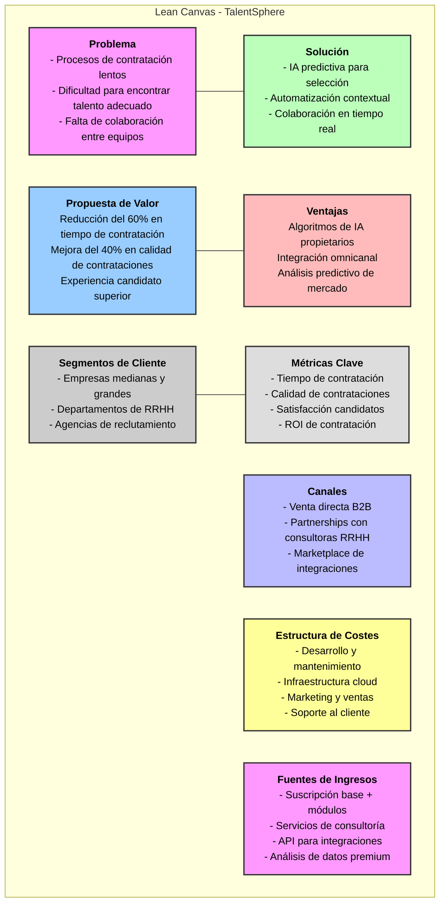
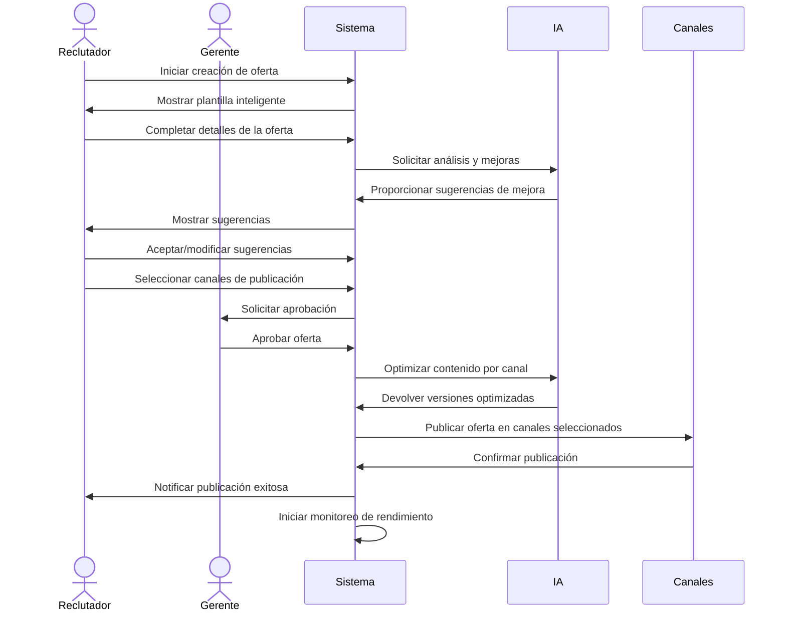
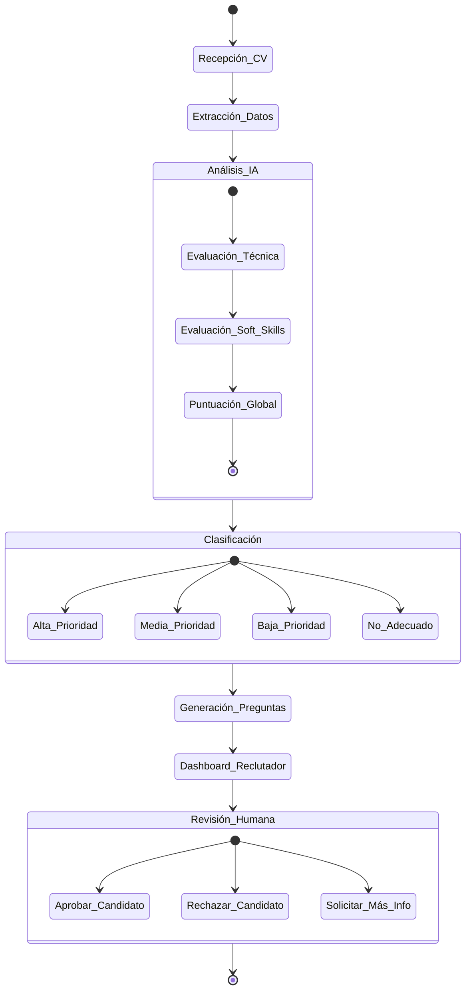
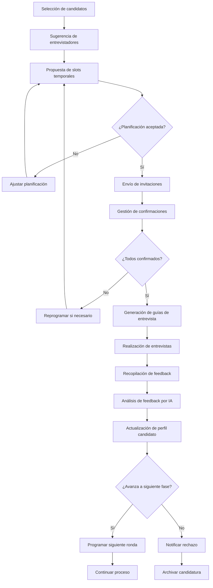
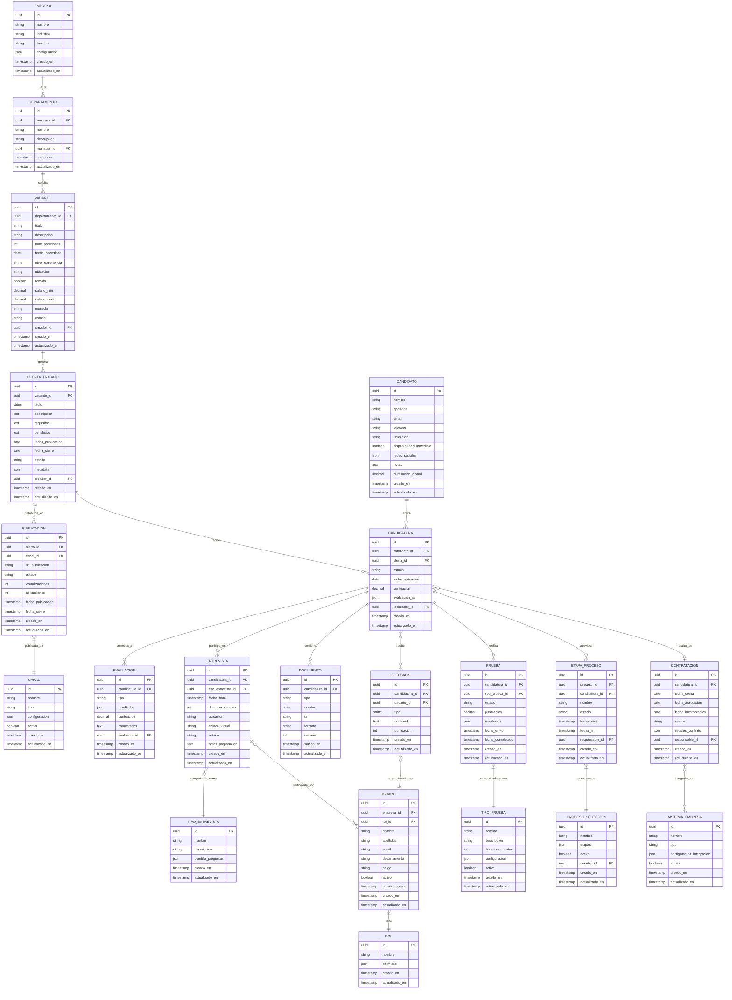
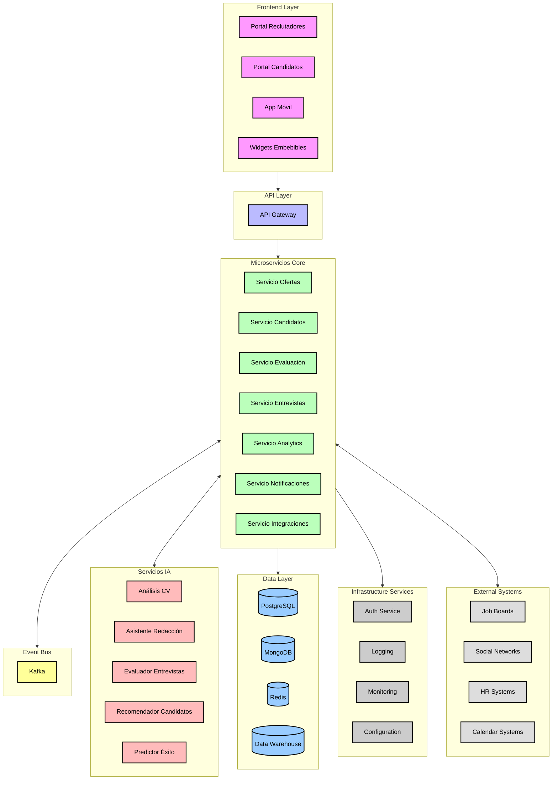
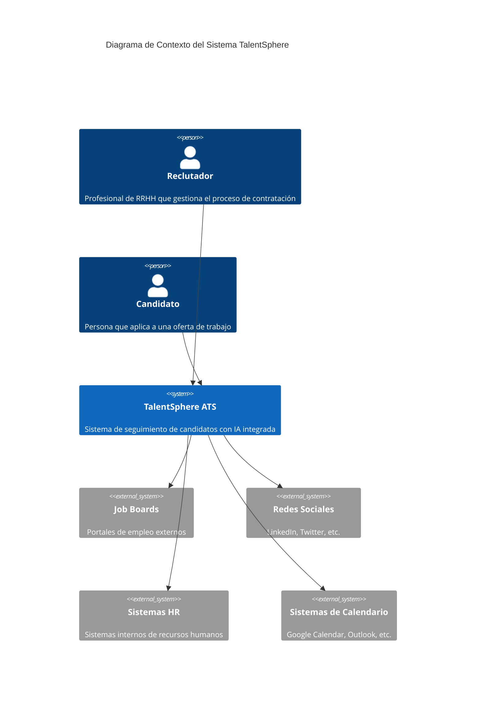
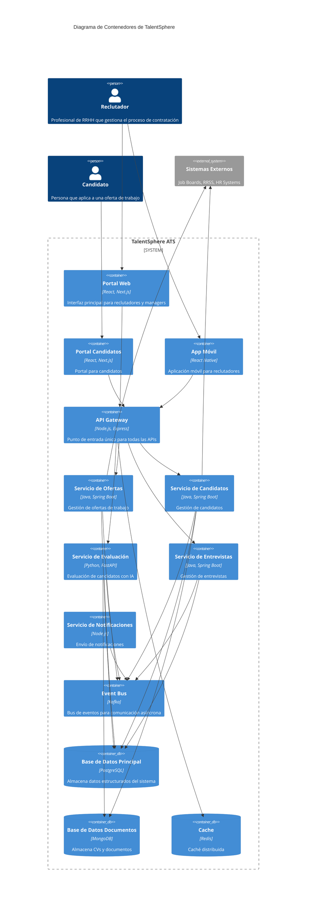
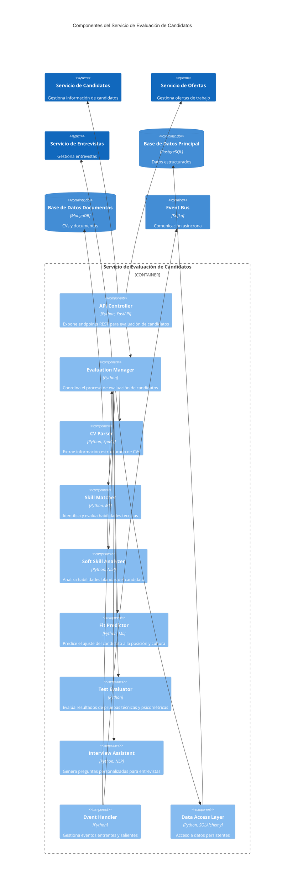
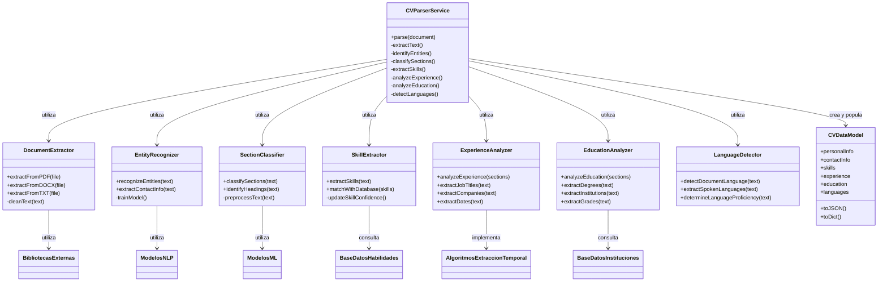

# Diseño del Sistema ATS del Futuro

## 1. Descripción del Software

### TalentSphere: El ATS del Futuro

**TalentSphere** es un sistema de seguimiento de candidatos (ATS) de próxima generación que revoluciona el proceso de contratación mediante la integración de inteligencia artificial avanzada, automatización inteligente y colaboración en tiempo real. A diferencia de los ATS tradicionales, TalentSphere no solo gestiona el flujo de trabajo de contratación, sino que actúa como un asistente inteligente que optimiza cada etapa del proceso.

### Valor Añadido y Ventajas Competitivas

- **IA Predictiva**: Algoritmos que identifican a los mejores candidatos basándose no solo en palabras clave, sino en potencial, trayectoria y ajuste cultural.
- **Automatización Contextual**: Automatiza tareas según el contexto específico de cada proceso de contratación.
- **Colaboración Omnicanal**: Permite a reclutadores y gerentes colaborar en tiempo real desde cualquier dispositivo o plataforma.
- **Análisis Predictivo**: Proporciona insights sobre tendencias del mercado laboral y predice necesidades futuras de contratación.
- **Experiencia Candidato Personalizada**: Crea recorridos personalizados para cada candidato, mejorando la imagen de marca empleadora.

### Funciones Principales

1. **Creación y Publicación Inteligente**: Asistente de IA para redactar ofertas atractivas y publicación multicanal automatizada.
2. **Evaluación Cognitiva de Candidatos**: Análisis automático de CV con comprensión contextual y evaluación de soft skills.
3. **Entrevistas Asistidas por IA**: Preparación, programación y análisis post-entrevista con insights de IA.
4. **Onboarding Integrado**: Conexión fluida con sistemas internos para incorporación sin fricciones.
5. **Analytics Avanzados**: Métricas en tiempo real sobre eficiencia de contratación y calidad de fuentes de talento.

### Lean Canvas

## 2. Casos de Uso Principales

### Caso de Uso 1: Creación y Publicación de Ofertas de Trabajo

**Descripción**: Un reclutador necesita crear una nueva oferta de trabajo para un puesto de desarrollador senior y publicarla en múltiples canales.

**Flujo Principal**:

1. El reclutador inicia la creación de una nueva oferta
2. El sistema proporciona una plantilla inteligente basada en ofertas similares exitosas
3. La IA sugiere mejoras en la redacción para maximizar la atracción de candidatos
4. El reclutador selecciona canales de publicación (web corporativa, LinkedIn, InfoJobs, etc.)
5. El sistema optimiza automáticamente el contenido para cada canal
6. La oferta se programa para publicación y se distribuye automáticamente
7. El sistema comienza a monitorear el rendimiento de la oferta en cada canal

**Actores**: Reclutador, Gerente de contratación, Sistema IA

### Caso de Uso 2: Evaluación Automática de Candidatos

**Descripción**: El sistema recibe múltiples aplicaciones para una oferta y debe evaluarlas automáticamente, clasificarlas y presentar un análisis al reclutador.

**Flujo Principal**:

1. El candidato envía su aplicación (CV, carta, perfil)
2. El sistema extrae y estructura la información relevante
3. La IA analiza la idoneidad del candidato basándose en requisitos técnicos y soft skills
4. El sistema asigna una puntuación y clasifica al candidato
5. Se generan preguntas personalizadas para una posible entrevista
6. El reclutador recibe un dashboard con candidatos clasificados
7. El reclutador revisa y toma decisiones sobre los candidatos

**Actores**: Candidato, Sistema IA, Reclutador

### Caso de Uso 3: Planificación y Gestión de Entrevistas

**Descripción**: Un reclutador necesita programar entrevistas con múltiples candidatos, involucrando a diferentes miembros del equipo y gestionando todo el proceso.

**Flujo Principal**:

1. El reclutador selecciona candidatos para entrevista
2. El sistema sugiere entrevistadores basándose en el perfil y disponibilidad
3. El sistema propone slots de tiempo óptimos
4. El reclutador confirma la planificación
5. El sistema envía invitaciones y gestiona confirmaciones
6. La IA proporciona guías de entrevista personalizadas
7. Tras la entrevista, el sistema recopila feedback estructurado
8. El sistema analiza el feedback y actualiza el perfil del candidato

**Actores**: Reclutador, Entrevistadores, Candidato, Sistema IA

## 3. Modelo de Datos

El modelo de datos de TalentSphere está diseñado para capturar todas las entidades relevantes del proceso de contratación, sus atributos y las relaciones entre ellas.

## 4. Diseño del Sistema a Alto Nivel

TalentSphere está diseñado como una arquitectura de microservicios orientada a eventos, con un enfoque cloud-native que permite escalabilidad, resiliencia y flexibilidad.

### Componentes Principales

1. **Frontend Layer**
   - Portal de Reclutadores/Managers
   - Portal de Candidatos
   - Aplicación Móvil
   - Widgets Embebibles

2. **API Gateway**
   - Gestión de autenticación y autorización
   - Enrutamiento de solicitudes
   - Rate limiting y seguridad

3. **Microservicios Core**
   - Servicio de Gestión de Ofertas
   - Servicio de Gestión de Candidatos
   - Servicio de Evaluación y Pruebas
   - Servicio de Entrevistas
   - Servicio de Análisis y Reportes
   - Servicio de Notificaciones
   - Servicio de Integraciones

4. **Servicios de IA**
   - Motor de Análisis de CV
   - Asistente de Redacción
   - Evaluador de Entrevistas
   - Recomendador de Candidatos
   - Predictor de Éxito de Contratación

5. **Event Bus**
   - Comunicación asíncrona entre servicios
   - Procesamiento de eventos en tiempo real

6. **Data Layer**
   - Base de datos principal (PostgreSQL)
   - Almacenamiento de documentos (MongoDB)
   - Cache distribuido (Redis)
   - Data Warehouse para analytics

7. **Infrastructure Services**
   - Servicio de Autenticación
   - Servicio de Logging
   - Servicio de Monitoreo
   - Servicio de Configuración

### Diagrama de Arquitectura

### Principios de Diseño

1. **Desacoplamiento**: Cada microservicio tiene su propia base de datos y lógica de negocio.
2. **Comunicación Asíncrona**: Uso de eventos para comunicación entre servicios, reduciendo dependencias.
3. **Stateless**: Los servicios no mantienen estado, facilitando la escalabilidad horizontal.
4. **API-First**: Todas las funcionalidades están expuestas a través de APIs bien documentadas.
5. **Seguridad por Diseño**: Implementación de seguridad en cada capa del sistema.
6. **Observabilidad**: Monitoreo y logging integrados en todos los componentes.
7. **Resiliencia**: Diseño para fallos parciales sin afectar todo el sistema.

## 5. Diagrama C4 - Profundización en el Servicio de Evaluación de Candidatos

El Servicio de Evaluación de Candidatos es uno de los componentes más críticos y diferenciadores de TalentSphere, ya que implementa la inteligencia artificial para analizar y evaluar candidatos de manera objetiva y eficiente.

### Explicación del Diagrama C4

El Diagrama C4 es un enfoque para visualizar la arquitectura de software que consta de cuatro niveles de detalle, cada uno proporcionando una perspectiva diferente del sistema. Vamos a explicar cada nivel y cómo se aplica en nuestro diseño de TalentSphere:

### Nivel 1: Contexto del Sistema

Este nivel muestra el sistema completo (TalentSphere) y cómo interactúa con usuarios y sistemas externos.

**Lo que muestra:**

- **Personas**: Reclutadores y candidatos que interactúan con el sistema.
- **Sistema principal**: TalentSphere como una caja negra.
- **Sistemas externos**: Job boards, redes sociales, sistemas HR y calendarios.
- **Relaciones**: Cómo estos elementos se conectan entre sí.

**Propósito**: Dar una visión general de alto nivel para entender el ecosistema completo donde opera TalentSphere.

### Nivel 2: Contenedores

Este nivel "abre" la caja negra del sistema TalentSphere y muestra sus principales componentes o "contenedores".

**Lo que muestra:**

- **Aplicaciones frontend**: Portal web, portal de candidatos, app móvil.
- **API Gateway**: Punto de entrada para todas las comunicaciones.
- **Microservicios**: Ofertas, candidatos, evaluación, entrevistas, notificaciones.
- **Infraestructura de datos**: Bases de datos, caché, bus de eventos.

**Propósito**: Mostrar la arquitectura de alto nivel del sistema, cómo se divide en componentes y cómo estos se comunican entre sí.

### Nivel 3: Componentes del Servicio de Evaluación

Este nivel profundiza en un contenedor específico (en nuestro caso, el Servicio de Evaluación de Candidatos) para mostrar sus componentes internos.

**Lo que muestra:**

- **Componentes internos**: API Controller, Evaluation Manager, CV Parser, etc.
- **Relaciones internas**: Cómo estos componentes trabajan juntos.
- **Conexiones externas**: Cómo este servicio se conecta con otros servicios y bases de datos.

**Propósito**: Entender la estructura interna de un servicio específico y cómo implementa su funcionalidad.

### Nivel 4: Código del Componente CV Parser

Este nivel muestra la estructura interna de un componente específico (en nuestro caso, el CV Parser) a nivel de clases y código.

**Lo que muestra:**

- **Clases principales**: CVParserService, DocumentExtractor, EntityRecognizer, etc.
- **Relaciones entre clases**: Cómo estas clases colaboran.
- **Dependencias externas**: Bibliotecas y servicios que utiliza.

**Propósito**: Proporcionar detalles de implementación para desarrolladores que trabajarán en este componente.

## Características Clave del Servicio de Evaluación

1. **Procesamiento Inteligente de CV**
   - Extracción de información estructurada de documentos en múltiples formatos
   - Identificación de habilidades técnicas y experiencia relevante
   - Análisis semántico para comprender el contexto y relevancia

2. **Evaluación Holística**
   - Análisis de habilidades técnicas mediante matching con requisitos
   - Evaluación de soft skills a través de análisis de lenguaje
   - Predicción de ajuste cultural y potencial de rendimiento

3. **Asistencia para Entrevistas**
   - Generación de preguntas personalizadas basadas en el perfil
   - Identificación de áreas a profundizar durante la entrevista
   - Sugerencias para validar habilidades específicas

4. **Análisis Predictivo**
   - Predicción de éxito del candidato basado en datos históricos
   - Identificación de patrones de éxito en contrataciones previas
   - Recomendaciones para mejorar el proceso de selección

5. **Integración con el Ecosistema**
   - Comunicación bidireccional con otros servicios mediante eventos
   - Actualización en tiempo real del perfil del candidato
   - Alimentación de datos para el sistema de analytics

Este servicio representa el corazón de la inteligencia artificial de TalentSphere, proporcionando evaluaciones objetivas y consistentes que ayudan a los reclutadores a tomar mejores decisiones de contratación, reduciendo sesgos y mejorando la eficiencia del proceso.
