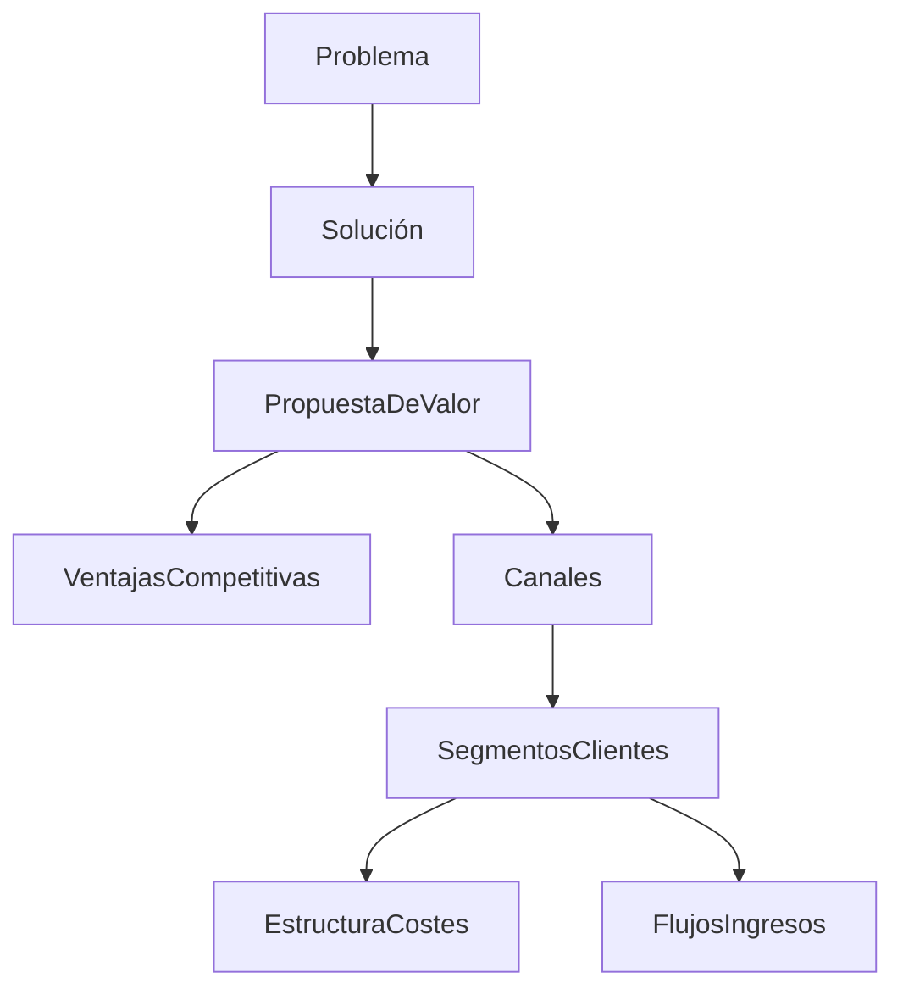
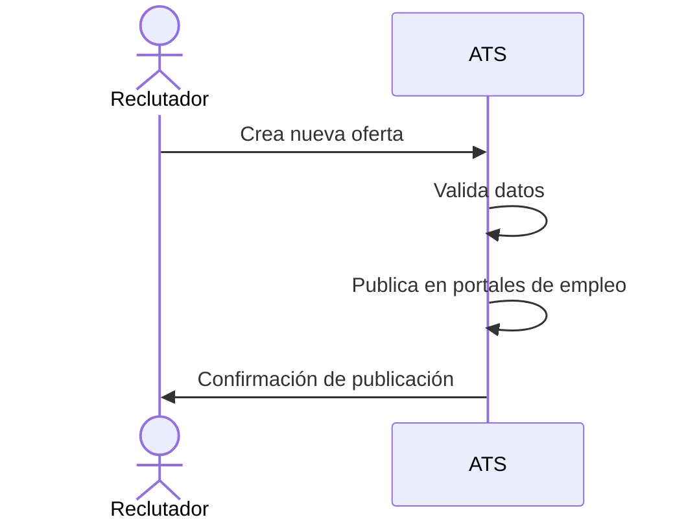
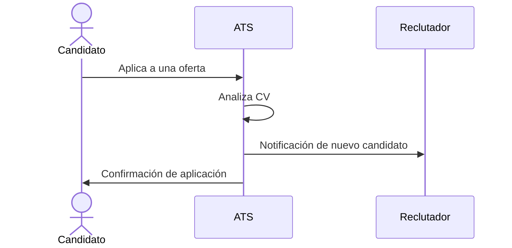
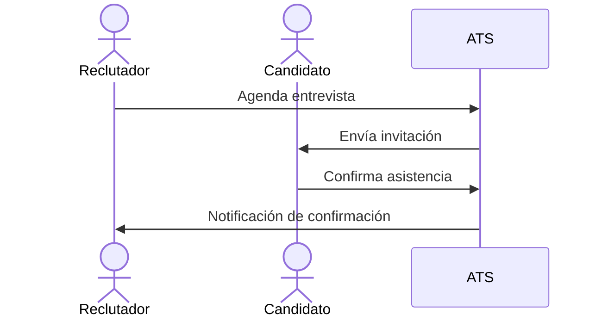
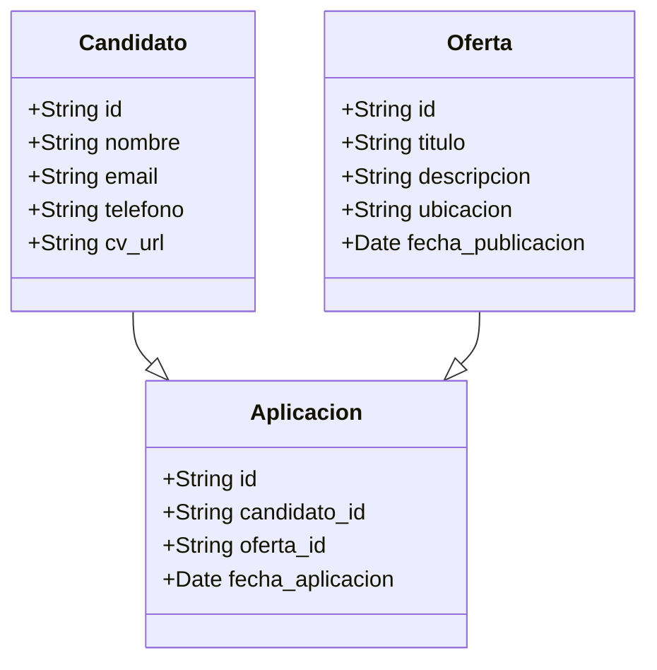
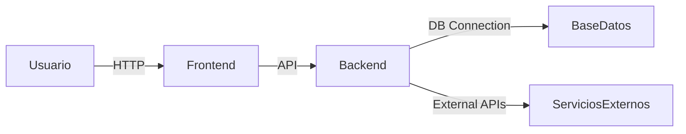
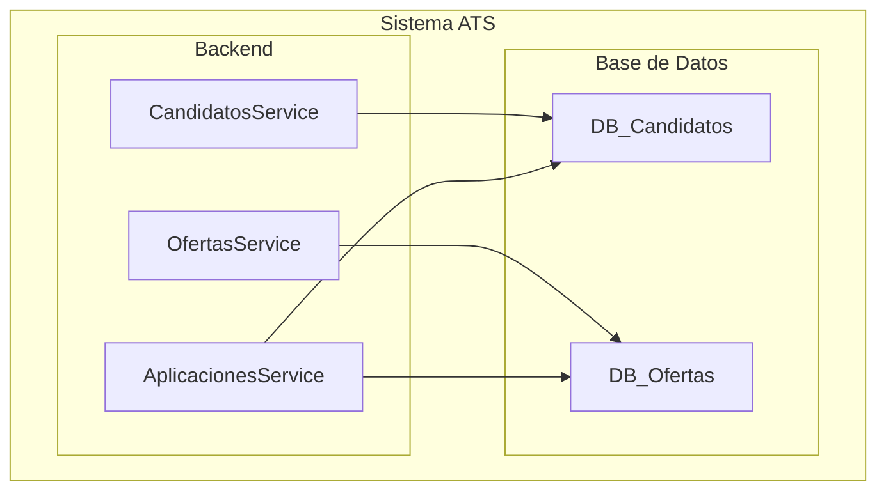

# Diseño de Software para un ATS (Applicant Tracking System)

## 1. Descripción breve del software

El sistema ATS (Applicant Tracking System) es una solución SaaS que automatiza y optimiza el proceso de reclutamiento, permitiendo a las empresas gestionar eficazmente sus ofertas de empleo, candidatos y procesos de selección.

## 2. Valor añadido

- Reducción del tiempo de contratación gracias a la automatización del filtrado de candidatos.
- Mejora de la experiencia del candidato con comunicación fluida y transparente.
- Centralización de toda la información del proceso de selección en una única plataforma.

## 3. Ventajas competitivas

- **IA y Machine Learning**: Filtrado automático de CVs basado en palabras clave y criterios personalizados.
- **Integraciones**: Compatible con LinkedIn, Indeed y herramientas de evaluación.
- **Análisis y métricas avanzadas**: Reportes detallados sobre desempeño y tiempos de contratación.

---

## 4. Lean Canvas

---

## 5. Casos de uso principales

### Caso de Uso 1: Publicación de Oferta de Empleo

**Descripción**: Un reclutador crea y publica una oferta de empleo en múltiples plataformas.

### Caso de Uso 2: Aplicación de Candidato

**Descripción**: Un candidato aplica a una oferta de empleo y su CV es analizado automáticamente.

### Caso de Uso 3: Gestión de Entrevistas

**Descripción**: Un reclutador agenda y gestiona entrevistas con los candidatos seleccionados.

---

## 6. Modelo de Datos

---

## 7. Diseño del sistema a alto nivel

**Explicación:**
El sistema se basa en una arquitectura de microservicios con módulos independientes para gestión de ofertas, candidatos y análisis de datos. Utiliza una API REST para la comunicación entre servicios y un frontend basado en React.js.

---

## 8. Diagrama C4 (Zoom en el componente de Gestión de Candidatos)

