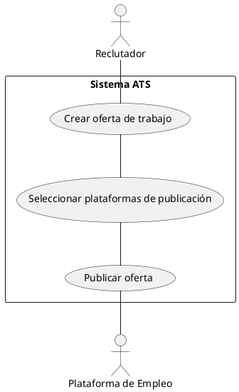
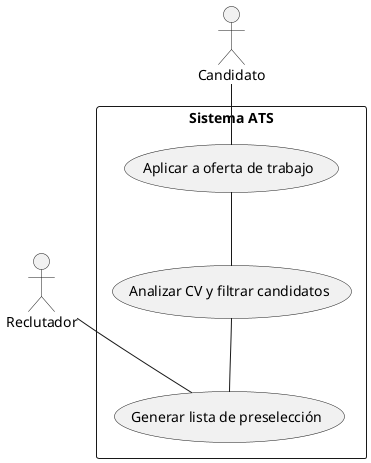
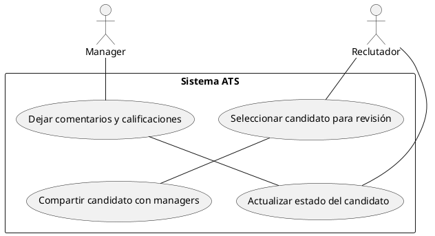
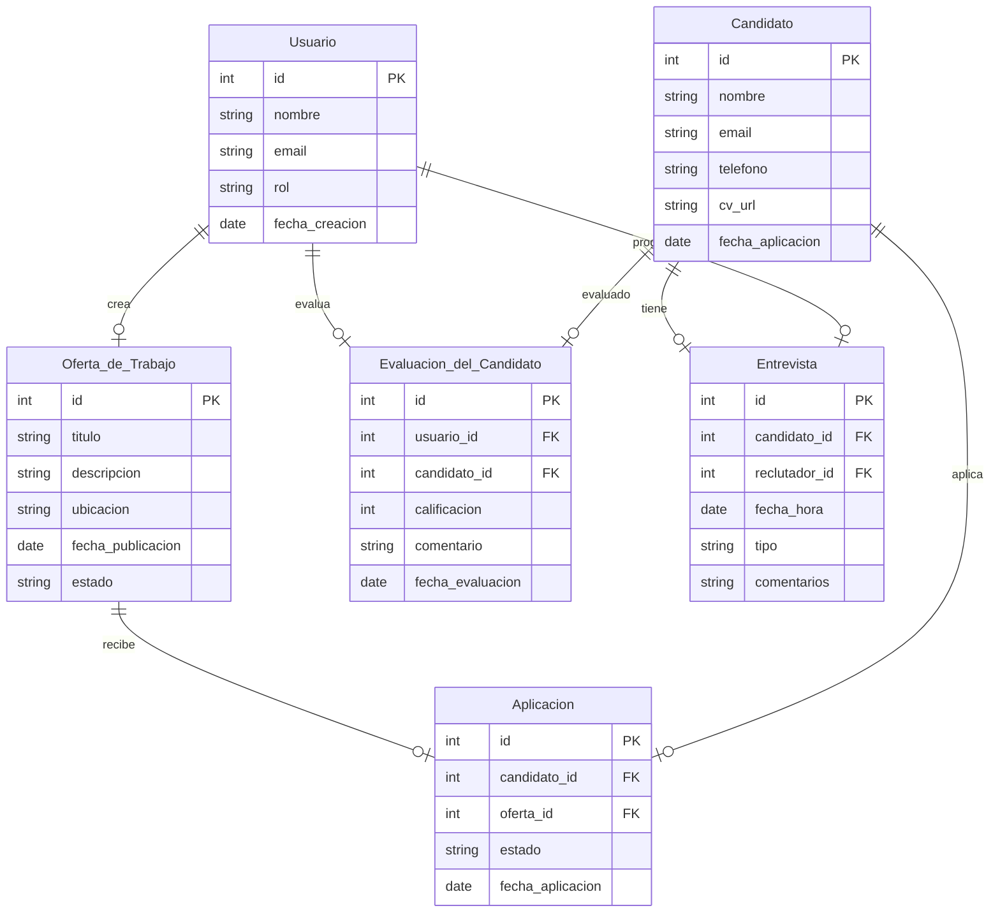
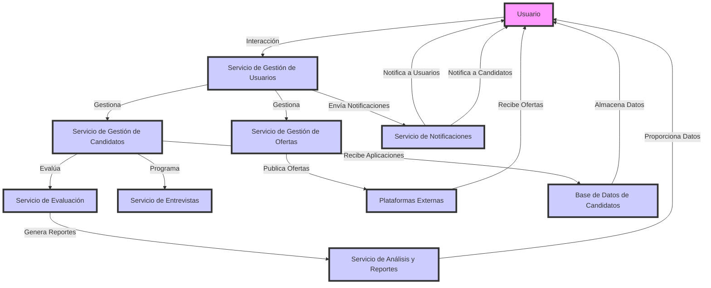
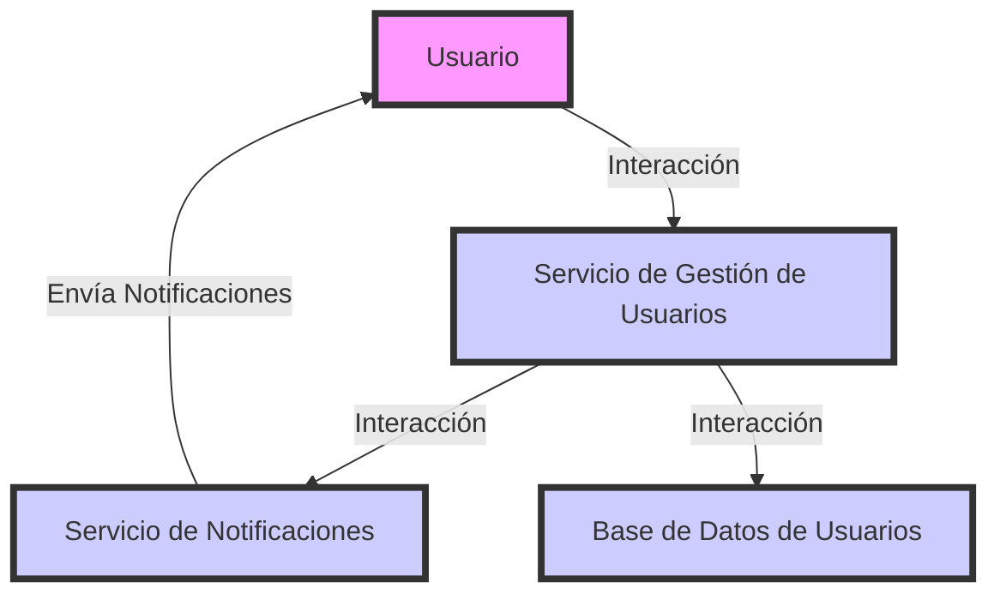
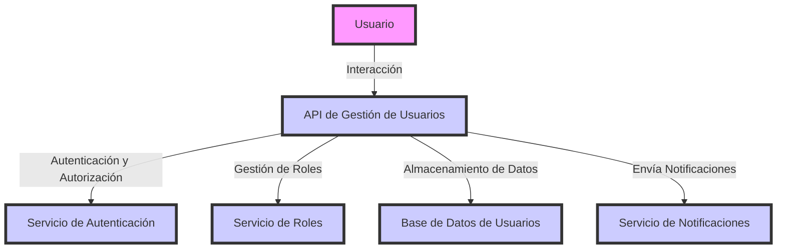
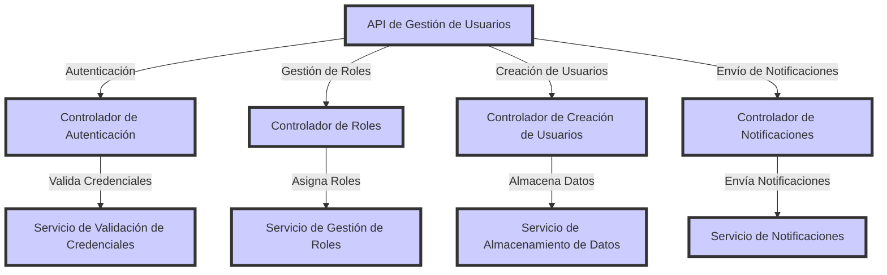
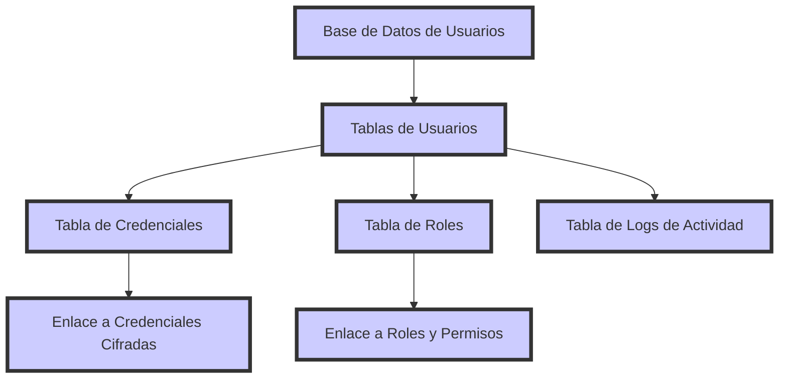

# Descripción Breve del Software LTI

El ATS de LTI es un sistema de gestión de candidatos diseñado para optimizar el proceso de selección de talento en empresas tecnológicas y startups. Su objetivo es reducir tiempos de contratación, mejorar la colaboración entre reclutadores y managers, y automatizar tareas clave del reclutamiento.

## Valor Añadido y Ventajas Competitivas

- **Publicación Multi-Canal:** Agiliza la difusión de vacantes en diferentes plataformas desde un solo lugar.
- **Colaboración en Tiempo Real:** Facilita la toma de decisiones con feedback compartido entre reclutadores y managers.
- **Automatización del Workflow:** Reduce tareas manuales y mejora la organización del proceso de selección.
- **IA para Filtrado de Candidatos:** Ayuda a identificar los mejores perfiles sin revisión manual intensiva.
- **Reportes y Analítica Básica:** Permite evaluar fuentes de reclutamiento y optimizar estrategias de contratación.

## Funciones Principales del ATS para LTI

| **Función**                  | **Descripción** |
|------------------------------|----------------|
| **Publicación Multi-Canal**  | Permite publicar vacantes automáticamente en portales de empleo, redes sociales y la web de la empresa. |
| **Colaboración en Tiempo Real** | Espacio compartido donde reclutadores y managers pueden evaluar candidatos y dejar comentarios. |
| **Automatización del Workflow** | Define flujos de trabajo automáticos para mover candidatos entre etapas y programar entrevistas. |
| **IA para Filtrado de Candidatos** | Analiza CVs, genera resúmenes y asigna puntuaciones a los candidatos según criterios de selección. |
| **Reportes y Analítica Básica** | Medición del desempeño de fuentes de reclutamiento y tiempos de contratación. |

## Lean Canvas - ATS para LTI

### 1. Problema
- Los procesos de reclutamiento son ineficientes y manuales.
- Falta de colaboración en tiempo real entre reclutadores y managers.
- Dificultad para filtrar y priorizar candidatos de manera efectiva.
- Tiempos de contratación elevados.

### 2. Segmento de Clientes
- Empresas de tecnología y startups en crecimiento.
- Departamentos de Recursos Humanos.
- Agencias de reclutamiento.
- Managers y líderes de equipo que participan en la selección.

### 3. Propuesta de Valor Única
- Un ATS inteligente con IA que automatiza la selección de candidatos y acelera el proceso de contratación.
- Plataforma colaborativa en tiempo real para evaluar candidatos con feedback centralizado.
- Algoritmo de matching avanzado para encontrar los mejores talentos rápidamente.
- Reportes predictivos para optimizar la estrategia de reclutamiento.

### 4. Solución
- **Publicación Multi-Canal:** Vacantes en LinkedIn, Indeed y otras plataformas desde un solo lugar.
- **Automatización del Workflow:** Flujos de trabajo inteligentes para avanzar candidatos en el proceso.
- **Colaboración en Tiempo Real:** Feedback compartido en la plataforma.
- **IA en Filtrado y Matching:** Evaluación automática de CVs y recomendación de candidatos.
- **Reportes y Analítica Básica:** Medición del desempeño de fuentes de reclutamiento.

### 5. Canales
- Ventas directas a empresas de tecnología.
- Alianzas con consultoras de RRHH.
- Marketing digital (SEO, LinkedIn Ads, Webinars).
- Participación en eventos de tecnología y recursos humanos.

### 6. Flujo de Ingresos
- Suscripción mensual por empresa (SaaS).
- Planes escalables según el tamaño de la empresa y volumen de contrataciones.
- Tarifas por integraciones premium con sistemas de terceros.

### 7. Estructura de Costos
- Desarrollo y mantenimiento del software.
- Infraestructura en la nube (AWS, Azure, Google Cloud).
- Marketing y adquisición de clientes.
- Soporte técnico y servicio al cliente.

### 8. Métricas Claves
- Tiempo promedio de contratación reducido.
- Incremento en la colaboración entre reclutadores y managers.
- Nivel de automatización de tareas de RRHH.
- Tasa de retención de clientes.

### 9. Ventaja Injusta
- IA avanzada para predecir el éxito de un candidato en la empresa.
- Integración perfecta con herramientas de RRHH y CRMs.
- Plataforma diseñada específicamente para empresas tecnológicas y startups.

## Descripción de los Tres Casos de Uso Principales

### 1. Publicación de Oferta de Trabajo

**Descripción:**  
Un reclutador crea y publica una vacante en múltiples plataformas de empleo (LinkedIn, Indeed, portal de la empresa).

**Flujo básico:**  
1. El reclutador ingresa los detalles de la vacante (título, requisitos, ubicación, salario, etc.).  
2. Selecciona las plataformas donde desea publicarla.  
3. El sistema envía la oferta a los canales seleccionados.  
4. Se guarda un historial de publicaciones para futuras referencias.  

**Valor agregado:**  
- Reduce el tiempo manual de publicación en distintos portales.  
- Mantiene un registro centralizado de vacantes activas.  

**Diagrama:**  

### 2. Filtrado y Preselección de Candidatos

**Descripción:**  
El sistema analiza automáticamente los CVs y sugiere los candidatos más adecuados según los criterios definidos por el reclutador.

**Flujo básico:**  
1. Candidatos aplican a la oferta desde diferentes plataformas.  
2. El ATS analiza los CVs y clasifica a los candidatos según su experiencia y habilidades clave.  
3. Se genera un ranking de los mejores perfiles.  
4. El reclutador revisa los candidatos preseleccionados y avanza los más relevantes a la siguiente etapa.  

**Valor agregado:**  
- Ahorra tiempo al evitar revisiones manuales extensas.  
- Mejora la calidad de los candidatos seleccionados.  

**Diagrama:**  

### 3. Evaluación y Feedback Colaborativo

**Descripción:**  
Reclutadores y managers pueden evaluar candidatos y compartir comentarios dentro del ATS.

**Flujo básico:**  
1. Un reclutador selecciona a un candidato y lo comparte con los managers involucrados.  
2. Los managers dejan comentarios y calificaciones sobre el candidato.  
3. El sistema centraliza el feedback y actualiza el estado del candidato.  
4. El equipo toma una decisión informada sobre si avanzar al candidato a la siguiente fase.  

**Valor agregado:**  
- Facilita la toma de decisiones en equipo.  
- Reduce el número de reuniones necesarias para evaluar candidatos.  

**Diagrama:**  

## Entidades del Modelo de Datos

### 1. Usuario (User)

Representa a cualquier persona que use el sistema, ya sea un reclutador, un manager o un administrador.

**Campos principales:**

- `id (PK)`: Identificador único.
- `nombre`: Nombre completo del usuario.
- `email`: Correo electrónico del usuario.
- `rol`: Rol en el sistema (reclutador, manager, admin).
- `fecha_creacion`: Fecha de creación del usuario.

**Relaciones:**

- Un usuario puede crear múltiples ofertas de trabajo.
- Un usuario puede realizar múltiples evaluaciones de candidatos.
- Un usuario puede programar múltiples entrevistas con candidatos.

### 2. Oferta de Trabajo (JobPosting)

Una Oferta de Trabajo es una vacante publicada por un reclutador para atraer candidatos.

**Campos principales:**

- `id (PK)`: Identificador único de la oferta.
- `titulo`: Nombre del puesto.
- `descripcion`: Descripción del trabajo.
- `ubicacion`: Ubicación del trabajo (ciudad o remoto).
- `fecha_publicacion`: Fecha en que se publicó la oferta.
- `estado`: Estado de la oferta (Abierta, Cerrada, En proceso).

**Relaciones:**

- Una oferta de trabajo pertenece a un reclutador (usuario).
- Una oferta de trabajo recibe múltiples aplicaciones de candidatos.

### 3. Candidato (Candidate)

El Candidato es la persona que aplica a una oferta de trabajo.

**Campos principales:**

- `id (PK)`: Identificador único del candidato.
- `nombre`: Nombre completo del candidato.
- `email`: Correo electrónico del candidato.
- `telefono`: Teléfono de contacto del candidato.
- `cv_url`: Enlace al currículum del candidato.
- `fecha_aplicacion`: Fecha en que el candidato aplicó a la oferta.

**Relaciones:**

- Un candidato puede aplicar a múltiples ofertas de trabajo.
- Un candidato puede recibir múltiples evaluaciones de reclutadores y managers.
- Un candidato puede tener múltiples entrevistas.

### 4. Aplicación a la Oferta (Application)

La Aplicación a la Oferta es el registro que almacena la aplicación de un candidato a una oferta de trabajo.

**Campos principales:**

- `id (PK)`: Identificador único de la aplicación.
- `candidato_id (FK)`: Relacionado con Candidato.
- `oferta_id (FK)`: Relacionado con Oferta de Trabajo.
- `estado`: Estado de la aplicación (Pendiente, En revisión, Rechazado, Aceptado).
- `fecha_aplicacion`: Fecha en la que el candidato aplicó.

**Relaciones:**

- Relaciona un candidato con una oferta de trabajo.
- Un candidato puede recibir evaluaciones de managers y reclutadores.

### 5. Evaluación del Candidato (Evaluation)

La Evaluación del Candidato es el registro de la evaluación que hacen los reclutadores y managers sobre un candidato.

**Campos principales:**

- `id (PK)`: Identificador único de la evaluación.
- `usuario_id (FK)`: Relacionado con Usuario (quién hizo la evaluación).
- `candidato_id (FK)`: Relacionado con Candidato (a quién se evaluó).
- `calificacion`: Puntuación (ejemplo: 1-5 estrellas).
- `comentario`: Feedback sobre el candidato.
- `fecha_evaluacion`: Fecha de la evaluación.

**Relaciones:**

- Un usuario (reclutador o manager) puede evaluar múltiples candidatos.
- Un candidato puede tener múltiples evaluaciones de diferentes usuarios.

### 6. Entrevista (Interview)

La Entrevista es el registro de las entrevistas programadas con los candidatos.

**Campos principales:**

- `id (PK)`: Identificador único de la entrevista.
- `candidato_id (FK)`: Relacionado con Candidato.
- `reclutador_id (FK)`: Relacionado con Reclutador (quién programa la entrevista).
- `fecha_hora`: Fecha y hora de la entrevista.
- `tipo`: Tipo de entrevista (Presencial, Virtual).
- `comentarios`: Notas sobre la entrevista.

**Relaciones:**

- Un candidato puede tener múltiples entrevistas.
- Un reclutador puede programar múltiples entrevistas.

### Diagrama de Relaciones (Simplificado)

## Diseño del Sistema

### Arquitectura de Microservicios

Para el diseño del Sistema de Gestión de Candidatos (ATS) propuesto, se recomienda una Arquitectura de Microservicios. Esta arquitectura permite descomponer el sistema en servicios independientes que pueden desarrollarse, desplegarse y escalarse de manera autónoma, facilitando la agilidad y flexibilidad en el desarrollo.

#### Componentes Principales:

- **Servicio de Gestión de Usuarios:** Encargado de la autenticación, autorización y gestión de perfiles de usuarios (reclutadores, managers, administradores). Comunica con el Servicio de Notificaciones para enviar alertas o actualizaciones a los usuarios.
- **Servicio de Gestión de Ofertas:** Permite la creación, publicación y seguimiento de ofertas de trabajo. Se integra con el Servicio de Publicación Multi-Canal para difundir las ofertas en diversas plataformas.
- **Servicio de Gestión de Candidatos:** Administra la recepción y seguimiento de aplicaciones de candidatos. Interactúa con el Servicio de Filtrado de Candidatos para evaluar y clasificar aplicaciones.
- **Servicio de Evaluación:** Facilita la evaluación colaborativa de candidatos por parte de reclutadores y managers. Se comunica con el Servicio de Gestión de Candidatos para acceder a perfiles y estados actuales.
- **Servicio de Entrevistas:** Gestiona la programación, seguimiento y registro de entrevistas con candidatos. Se integra con el Servicio de Gestión de Candidatos y el Servicio de Notificaciones.
- **Servicio de Notificaciones:** Envía comunicaciones a usuarios y candidatos a través de múltiples canales (correo electrónico, SMS, notificaciones push). Recibe solicitudes de otros servicios para enviar mensajes específicos.
- **Servicio de Análisis y Reportes:** Proporciona métricas y análisis sobre el proceso de reclutamiento. Recopila datos de otros servicios y genera reportes personalizados.

#### Diagrama de Arquitectura:

#### Consideraciones Adicionales:

- **Comunicación entre Servicios:** Se recomienda utilizar una arquitectura basada en eventos o colas de mensajes para la comunicación asíncrona entre microservicios, garantizando escalabilidad y resiliencia.
- **Gestión de Datos:** Cada microservicio debe tener su propia base de datos para asegurar independencia y facilitar el escalado.
- **Seguridad:** Implementar mecanismos de autenticación y autorización robustos, como OAuth 2.0, para proteger las interfaces y datos sensibles.
- **Monitorización y Logging:** Incorporar herramientas de monitorización y logging centralizado para facilitar la detección y resolución de problemas.

Esta arquitectura modular y escalable permitirá al ATS adaptarse a las necesidades cambiantes del negocio, facilitando la incorporación de nuevas funcionalidades y la adaptación a diferentes volúmenes de usuarios y datos.

## Diagrama C4 para el Componente Servicio de Gestión de Usuarios

### Nivel 1 - Diagrama de Contexto

Este diagrama muestra cómo interactúa el Servicio de Gestión de Usuarios con otros sistemas y actores externos.

- **Actor externo:** El Usuario puede ser un reclutador, manager o administrador.
- **Servicio de Gestión de Usuarios:** Gestiona la creación de usuarios, autenticación, autorización, roles, etc.
- **Servicio de Notificaciones:** Envia mensajes a los usuarios.
- **Base de Datos de Usuarios:** Almacena información sobre usuarios (credenciales, roles, preferencias).

### Nivel 2 - Diagrama de Contenedor

En este diagrama, se muestra la estructura interna del Servicio de Gestión de Usuarios y sus principales componentes.

- **API de Gestión de Usuarios:** Expondrá las API que permiten crear, autenticar, autorizar y gestionar usuarios.
- **Servicio de Autenticación:** Gestiona el proceso de autenticación de los usuarios (inicio de sesión, validación de credenciales).
- **Servicio de Roles:** Maneja los roles y permisos de los usuarios (reclutador, manager, administrador).
- **Base de Datos de Usuarios:** Almacena la información de los usuarios (nombre, correo electrónico, credenciales cifradas, roles).
- **Servicio de Notificaciones:** Envia alertas a los usuarios sobre su estado en el sistema (confirmación de registro, recuperación de contraseña, cambios de rol, etc.).

### Nivel 3 - Diagrama de Componente

Este diagrama desglosa el componente API de Gestión de Usuarios, mostrando cómo interactúan los diferentes módulos internos.

- **Controlador de Autenticación:** Procesa las solicitudes de inicio de sesión y valida las credenciales de los usuarios.
- **Controlador de Roles:** Permite la gestión de roles de los usuarios, asignando permisos específicos según el tipo de usuario.
- **Controlador de Creación de Usuarios:** Gestiona el proceso de alta de nuevos usuarios.
- **Controlador de Notificaciones:** Administra el envío de alertas y notificaciones.
- **Servicio de Validación de Credenciales:** Valida las credenciales (usuario y contraseña).
- **Servicio de Gestión de Roles:** Administra los roles y permisos de los usuarios.
- **Servicio de Almacenamiento de Datos:** Interactúa con la base de datos para almacenar y recuperar información de los usuarios.
- **Servicio de Notificaciones:** Responsable de enviar mensajes de confirmación, alertas y notificaciones.

### Nivel 4 - Diagrama de Detalles Técnicos (Opcional)

Este nivel muestra los detalles técnicos de los componentes individuales, como bases de datos, protocolos, APIs, y más.

- **Tablas de Usuarios:** Almacena los datos del usuario (nombre, correo, etc.).
- **Tabla de Credenciales:** Almacena las credenciales cifradas del usuario.
- **Tabla de Roles:** Contiene los roles de los usuarios, vinculados con sus permisos.
- **Tabla de Logs de Actividad:** Registra las actividades del usuario para auditoría y seguimiento.

Cada uno de estos componentes y relaciones puede evolucionar de acuerdo con los requerimientos específicos y el crecimiento del sistema.