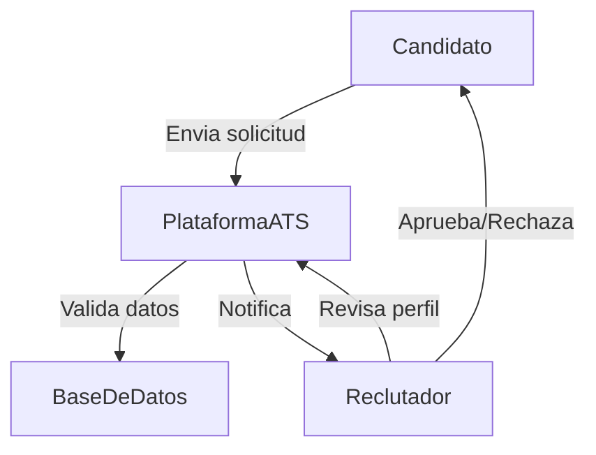
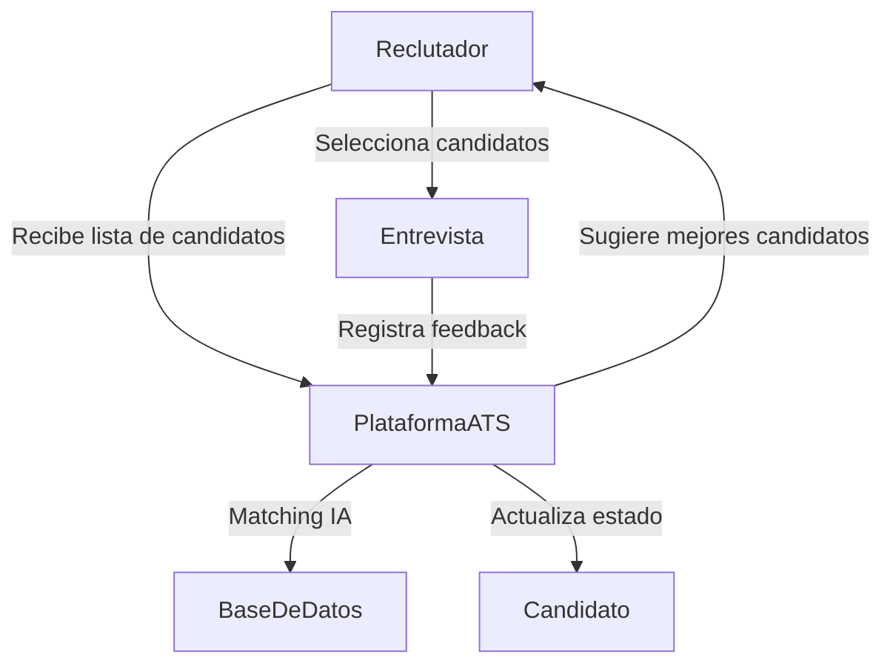
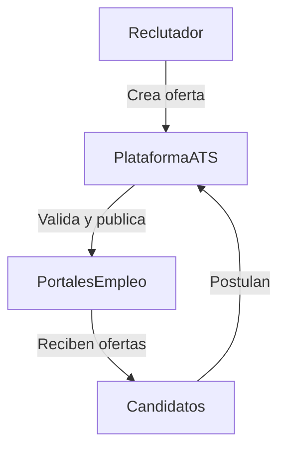
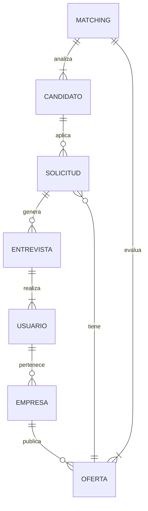
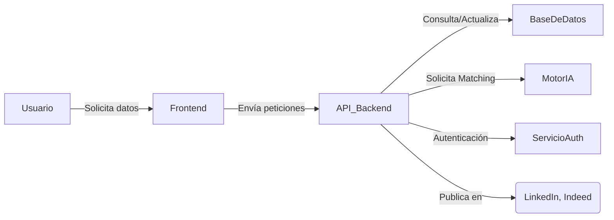
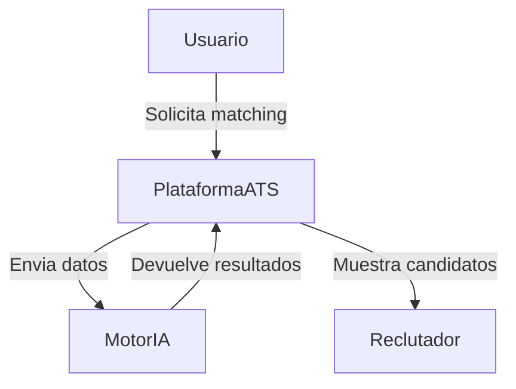
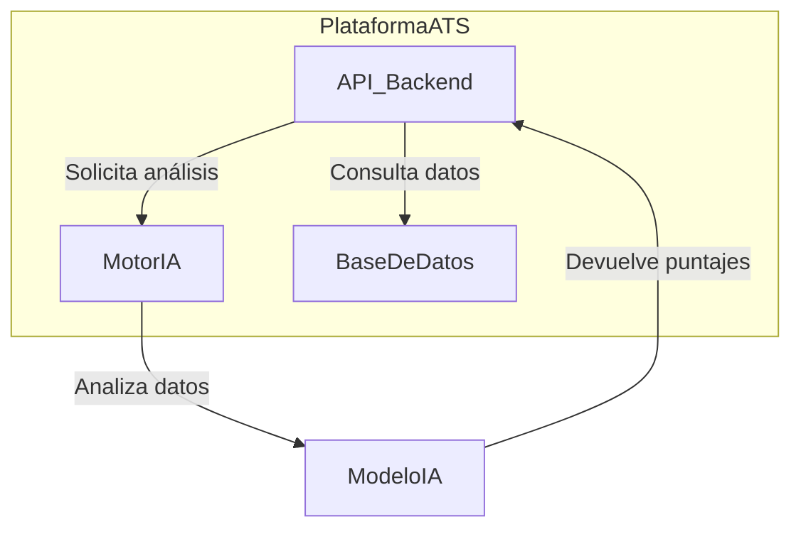
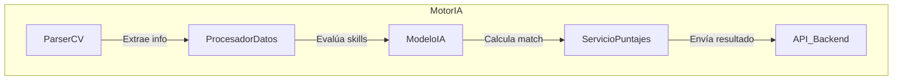

# Descripción del Software LTI

## 1. Descripción Breve y Valor Añadido
LTI es un sistema de seguimiento de candidatos (ATS) especializado en el sector IT, diseñado para optimizar el proceso de selección mediante inteligencia artificial avanzada. Su valor diferencial radica en su motor de *matching* automático, que analiza las características de los candidatos y las compara con los requisitos de la oferta para maximizar la precisión en la contratación.

### **Ventajas Competitivas**
- **Matching Inteligente:** Utiliza IA avanzada para evaluar la compatibilidad entre candidatos y vacantes, reduciendo el tiempo de selección.
- **Enfoque en IT:** Adaptado a las necesidades del sector tecnológico, considerando habilidades específicas y certificaciones.
- **Integraciones Clave:** Conexión con LinkedIn e Indeed para automatizar la captación de talento.
- **Gestón Multiempresa y Multirol:** Permite a diferentes organizaciones y usuarios gestionar procesos de selección con niveles de acceso personalizados.
- **SaaS Escalable:** Infraestructura en la nube con capacidad de integrarse con otros sistemas y expandirse según las necesidades del mercado.

## 2. Funciones Principales
- **Gestión de Candidatos:** Creación y seguimiento de perfiles con CV estructurado y archivos adjuntos.
- **Publicación de Ofertas:** Automatización de la difusión en portales de empleo.
- **Matching Automático:** Recomendaciones basadas en IA para agilizar la selección.
- **Historial de Interacciones:** Registro de entrevistas, evaluaciones y feedback.
- **Roles y Permisos:** Diferentes niveles de acceso según el tipo de usuario.
- **Autenticación Segura:** Sistema robusto de inicio de sesión con control de roles.

## 3. Lean Canvas

| Sección              | Descripción |
|----------------------|-------------|
| **Problema**        | Reclutadores de IT tienen dificultades para encontrar rápidamente el talento adecuado. Los candidatos no siempre reciben retroalimentación sobre sus aplicaciones. |
| **Segmentos de Clientes** | Empresas tecnológicas, agencias de reclutamiento IT, startups en crecimiento. |
| **Propuesta de Valor** | Matching inteligente con IA, integración con portales de empleo y gestión multiempresa. |
| **Solución**        | ATS basado en IA que automatiza el filtrado y selección de talento IT. |
| **Canales**         | Venta directa, asociaciones con portales de empleo, marketing digital. |
| **Fuentes de Ingreso** | Modelo SaaS con suscripción mensual. |
| **Estructura de Costos** | Desarrollo y mantenimiento de software, infraestructura en la nube, IA y data processing. |
| **Métricas Clave** | Tiempo de contratación reducido, precisión del *matching*, cantidad de vacantes cubiertas. |

## 4. Diagramas de Casos de Uso

### **1. Aplicación de un Candidato**

### **2. Evaluación y Selección de Candidatos**

### **3. Publicación de Ofertas**

## 5. Modelo de Datos

### **Entidades y Atributos**
- **Candidato** (id, nombre, email, teléfono, experiencia, habilidades, CV, archivos adjuntos)
- **Oferta** (id, título, empresa, requisitos, ubicación, salario, beneficios, estado)
- **Solicitud** (id, candidato_id, oferta_id, estado, fecha_aplicación)
- **Empresa** (id, nombre, descripción, sector)
- **Usuario** (id, nombre, email, rol, empresa_id)
- **Entrevista** (id, solicitud_id, reclutador_id, fecha, feedback)
- **Matching** (id, candidato_id, oferta_id, puntaje)

### **Diagrama de Modelo de Datos**

## 6. Diseño del Sistema a Alto Nivel

El sistema sigue una arquitectura basada en microservicios para garantizar escalabilidad y modularidad.

### **Componentes Principales:**
- **Frontend:** Aplicación web en React.
- **Backend:** API en Node.js con Express.
- **Base de Datos:** PostgreSQL para datos estructurados y MongoDB para almacenamiento de CVs.
- **Motor de Matching:** Servicio en Python con modelos de IA.
- **Autenticación:** OAuth 2.0 con JWT para control de acceso.
- **Integraciones:** APIs de LinkedIn e Indeed.

### **Diagrama de Arquitectura**

## 7. Diagrama C4 - Motor de Matching

### **Nivel 1: Contexto**

### **Nivel 2: Contenedores**

### **Nivel 3: Componentes del MotorIA**

## 8. Conclusión
El motor de matching es un servicio modular basado en IA que permite evaluar candidatos de manera automatizada, optimizando el proceso de selección para empresas tecnológicas.

