# 1. Descripción del software LTI (Let Talent In)
## ¿Qué es LTI?
LTI (Let Talent In) es un sistema ATS (Applicant Tracking System) de nueva generación, diseñado para transformar digitalmente el proceso de selección de talento en las organizaciones. Su objetivo es ofrecer a los departamentos de Recursos Humanos y managers de contratación una plataforma ágil, inteligente y colaborativa que permita optimizar cada etapa del ciclo de reclutamiento, desde la publicación de ofertas hasta la contratación final del candidato ideal.

A diferencia de los ATS tradicionales, LTI no se limita a ser una base de datos de candidatos: se convierte en un socio estratégico en la toma de decisiones de talento, integrando automatización, analítica avanzada e inteligencia artificial para facilitar procesos, reducir tiempos, eliminar sesgos y mejorar la calidad de las contrataciones.

## Valor añadido de LTI frente a otros ATS
- Transformación digital real del proceso de selección, no solo una mejora superficial.
- Asistencia con IA predictiva y generativa para tareas clave como filtrado, redacción de ofertas o análisis de soft skills.
- Evaluaciones estructuradas y personalizadas, con herramientas basadas en evidencia y modelos adaptables a cada organización.
- Gestión multicanal automatizada de ofertas y candidatos, evitando la fragmentación de plataformas.
- Experiencia del candidato excepcional, con comunicación proactiva, claridad y trazabilidad.
- Integración con sistemas externos (Slack, Notion, Zoom, calendarios, ERPs o CRMs) para mantener flujos unificados.
## Ventajas competitivas de LTI
- IA avanzada que predice rendimiento futuro y encaje cultural, no solo coincidencias técnicas.
- Sistema de aprendizaje continuo que mejora los algoritmos con cada proceso realizado.
- Interfaz de usuario moderna y colaborativa, pensada para equipos multifuncionales.
- Arquitectura modular, personalizable y escalable: cada cliente puede construir su ATS ideal sin pagar por funciones innecesarias.
- Enfoque consultivo y no solo tecnológico: LTI se adapta a la estrategia de cada organización y mejora los procesos, no solo los digitaliza.
- Despliegue ágil y acompañamiento personalizado, asegurando adopción y resultados rápidos.
## Funcionalidades destacadas
- Definición de perfiles asistida por IA, incluyendo competencias técnicas y soft skills.
- Publicación automática y multicanal de ofertas de empleo.
- Screening inteligente de CVs con análisis semántico y scoring predictivo.
- Evaluaciones personalizadas (psicometría, entrevistas por competencias, simulaciones).
- Análisis de encaje cultural mediante IA.
- Panel colaborativo entre reclutadores y managers, con tareas asignadas y visibilidad compartida.
- Gestión automatizada de entrevistas (propuestas de horarios, integraciones con calendarios, videollamadas).
- Comunicación automatizada con candidatos, seguimiento del estado y feedback.
- Dashboards de KPIs personalizados, para evaluar procesos, tiempos y calidad de contrataciones.
- Integración con sistemas de RRHH, CRMs y herramientas internas mediante APIs.

# 2. Funciones principales del sistema LTI (Let Talent In)

LTI es un sistema modular que integra múltiples funcionalidades avanzadas orientadas a digitalizar, automatizar y optimizar el proceso completo de reclutamiento. A continuación se detallan las funciones clave del sistema:

### 🔍 Publicación de ofertas de empleo
- Creación rápida de ofertas con plantillas personalizables.
- Asistente de IA para redacción optimizada según el perfil buscado.
- Publicación simultánea en múltiples bolsas de trabajo y plataformas (LinkedIn, InfoJobs, Indeed, web corporativa, etc.).
- Programación de fechas de publicación y expiración.
- Seguimiento del rendimiento de cada canal.

### 📥 Gestión integral de candidaturas
- Recepción automática de candidaturas centralizadas desde múltiples canales.
- Visualización del perfil completo del candidato con parsing de CV automático.
- Historial de interacciones y acciones anteriores del candidato.
- Sistema de etiquetado y clasificación personalizado.

### ⚙️ Automatización del screening
- Filtro automático de candidaturas basado en criterios definidos.
- Scoring predictivo generado por IA (compatibilidad técnica y cultural).
- Detección de palabras clave, soft skills y análisis semántico del CV.
- Alertas de candidatos destacados o fuera del perfil esperado.

### 🤖 Asistente de IA para el proceso de selección
- Generación automática de ofertas optimizadas por sector y rol.
- Recomendaciones de candidatos más alineados según procesos previos.
- Análisis predictivo del rendimiento futuro y encaje cultural.
- Asistencia en la preparación de preguntas de entrevista personalizadas.

### 👥 Colaboración entre reclutadores y managers
- Dashboard compartido con visibilidad en tiempo real de cada etapa del proceso.
- Notificaciones automáticas para tareas pendientes o cambios en estado de candidatos.
- Comentarios internos y evaluaciones conjuntas por parte de managers.
- Gestión de aprobaciones para contratación directa o pase a entrevista.

### 🗓️ Coordinación y programación de entrevistas
- Propuesta automática de horarios compatibles con agendas de entrevistadores.
- Envío de invitaciones al candidato con confirmación directa.
- Integración con calendarios (Google Calendar, Outlook, etc.).
- Enlace automático a videollamadas (Zoom, Teams, Meet).

### ✉️ Comunicación automatizada con candidatos
- Envío automático de mensajes según estado del proceso.
- Seguimiento proactivo: confirmación de recepción, recordatorios, feedback.
- Plantillas de comunicación personalizables.
- Mejora de la experiencia del candidato y la marca empleadora.

### 📊 Paneles de control y analítica avanzada
- Visualización de KPIs del proceso de selección: tiempo medio de contratación, tasa de aceptación, rendimiento por canal, etc.
- Métricas específicas por rol, manager, equipo o fuente de reclutamiento.
- Análisis del ROI por proceso y evolución temporal.
- Exportación de informes personalizados.

### 🔗 Integraciones y adaptabilidad
- Conexión vía API con sistemas externos (ERP, CRM, plataformas de onboarding, herramientas de RRHH).
- Arquitectura modular: activación/desactivación de funcionalidades por cliente.
- Panel de configuración intuitivo para ajustar procesos según estructura organizacional.

# 3. Lean Canvas – LTI (Let Talent In) – ATS Innovador 2025

## 1. Problema
- Definición poco precisa de perfiles de puesto, causando contrataciones desalineadas.
- Evaluaciones subjetivas y sesgos en entrevistas por falta de metodología estructurada.
- Ausencia de herramientas de evaluación objetivas (psicometría, simulaciones, assessments).
- Falta de consideración del encaje cultural como factor clave de contratación sostenible.
- Experiencia deficiente del candidato: comunicación ineficaz, falta de transparencia y abandono del proceso.
- Gestión fragmentada del reclutamiento entre múltiples plataformas y herramientas no integradas.
- Débil marca empleadora, dificultando la atracción de talento cualificado.
- Alcance limitado de las ofertas de empleo por publicar en canales poco diversificados.

## 2. Segmentos de Clientes
- Empresas medianas (50-250 empleados) con procesos de reclutamiento poco estructurados.
- Corporaciones grandes (250+ empleados) que requieren integración, escalabilidad y análisis avanzado.
- Consultoras de RRHH que buscan eficiencia en la gestión de múltiples procesos de selección.
- Directores de RRHH (decisores): interesados en ROI, métricas, calidad de contrataciones y reducción de tiempo.
- Reclutadores y técnicos de selección (usuarios): necesitan automatización y herramientas intuitivas.
- Managers de contratación (colaboradores): valoran visibilidad, colaboración y procesos claros.

## 3. Propuesta de Valor Única
Una plataforma ATS predictiva, automatizada y colaborativa, que transforma digitalmente el proceso de selección con IA avanzada, mejorando la calidad de las contrataciones, acelerando los procesos y optimizando la experiencia del candidato.

## 4. Solución
- Definición de perfiles asistida por IA (técnicas y soft skills).
- Scoring inteligente y análisis predictivo del rendimiento futuro del candidato.
- Evaluaciones estructuradas con pruebas psicométricas y simulaciones personalizadas.
- Publicación simultánea en múltiples bolsas de empleo y gestión centralizada.
- Comunicación automatizada y seguimiento transparente del candidato.
- Análisis de encaje cultural con algoritmos especializados.
- Interfaz moderna e intuitiva para colaboración en tiempo real.
- Automatización de tareas repetitivas (screening, programación, recordatorios).

## 5. Canales
- Marketing de contenidos (blog, white papers, webinars).
- LinkedIn y redes sociales profesionales con segmentación avanzada.
- Alianzas con consultoras de RRHH y asociaciones sectoriales.
- Participación en ferias y eventos de talento y tecnología.
- Programa de referidos y estrategia de inbound marketing.
- Proceso de ventas consultivo con demos personalizadas.

## 6. Fuentes de Ingresos
- Suscripción SaaS escalable por número de usuarios y volumen de contrataciones.
- Planes: Básico, Profesional y Enterprise.
- Ingresos adicionales por:
  - Servicios premium (implementación, consultoría, formación).
  - Marketplace de evaluaciones y pruebas por uso.
  - Análisis personalizados y auditorías de procesos.
  - Licencias globales para corporaciones multinacionales.
  - Programa de partners certificados.

## 7. Estructura de Costes
- Desarrollo de software y mantenimiento continuo.
- Infraestructura cloud escalable y servicios de terceros.
- Personal técnico (devs, IA, UX/UI, QA, ciberseguridad).
- Marketing y adquisición de clientes.
- Equipo comercial especializado y consultores funcionales.
- Servicios de soporte e implementación para clientes.

## 8. Métricas Clave
- Tasa de adopción de usuarios vs licencias.
- Tiempo medio de contratación por oferta.
- Precisión de predicciones de IA vs resultados reales.
- NPS del candidato y del cliente.
- Coste de adquisición de cliente (CAC) vs Valor del ciclo de vida (LTV).
- Tasa de conversión por etapa del funnel.
- Retención y expansión de ingresos por cuenta (NRR).
- Tiempo hasta el primer valor entregado (Time to First Value).

## 9. Ventajas Competitivas
- IA predictiva adaptada a cada cliente, con aprendizaje continuo.
- Evaluación integral de encaje cultural y soft skills.
- Arquitectura modular adaptable a cada necesidad empresarial.
- Integración nativa multicanal y experiencia omnicanal para candidatos.
- Enfoque consultivo centrado en transformación del talento.
- Ciclos cortos de desarrollo con iteración constante basada en feedback real.
- Comunidad de usuarios, casos de éxito y métricas abiertas para generar confianza.

# 4. Casos de Uso – Sistema LTI (ATS)

A continuación se describen los tres casos de uso principales del sistema LTI. Cada caso incluye:

- Una descripción general del proceso.
- Los actores que intervienen.
- El objetivo del proceso.
- Los pasos típicos del flujo de trabajo.
- Un diagrama de caso de uso representado en lenguaje Mermaid.

---

### 4.1 Publicar una oferta de empleo

#### 📌 Descripción:
El reclutador accede al sistema para crear una nueva oferta de empleo. Puede redactarla manualmente o con la asistencia del módulo de inteligencia artificial. La oferta puede ser validada por el manager de contratación antes de publicarse en múltiples plataformas de forma automática.

#### 👤 Actores:
- Reclutador  
- Asistente de IA  
- Manager de contratación (opcional)

#### 🎯 Objetivo:
Aumentar la calidad y velocidad en la publicación de ofertas de empleo, reducir los errores de redacción y facilitar su difusión multicanal.

#### 🔁 Flujo de pasos:
1. El reclutador inicia el proceso de creación de oferta.
2. El sistema ofrece sugerencias de redacción mediante IA.
3. El reclutador revisa y edita el contenido si lo desea.
4. El manager de contratación puede validar la oferta antes de publicarla (opcional).
5. El reclutador selecciona los canales de publicación.
6. La oferta se publica automáticamente.

#### 🖼 Diagrama de caso de uso (Mermaid):

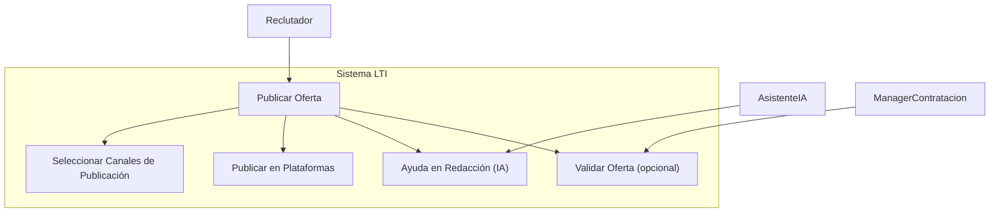

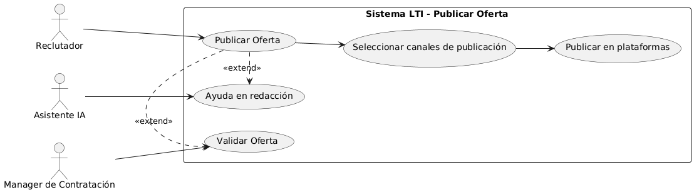

## 4.2 Filtrar y seleccionar candidatos

### 📌 Descripción:
Una vez recibidas las candidaturas, el sistema permite al reclutador aplicar filtros automáticos y manuales para clasificar los perfiles más aptos. La IA asigna puntuaciones a los candidatos en función de su compatibilidad técnica y cultural. El manager de contratación puede revisar los candidatos seleccionados.

### 👤 Actores:
- Reclutador  
- Sistema de IA  
- Manager de contratación

### 🎯 Objetivo:
Mejorar la eficiencia del proceso de preselección, reducir carga operativa y aumentar la calidad de los candidatos filtrados.

### 🔁 Flujo de pasos:
1. El sistema recopila y clasifica automáticamente las candidaturas.  
2. El reclutador accede a la bandeja de candidatos y aplica filtros adicionales.  
3. La IA analiza los perfiles y genera un scoring predictivo.  
4. El reclutador selecciona los mejores candidatos.  
5. El manager de contratación revisa y valida la preselección.

### 🖼 Diagrama de caso de uso (Mermaid):

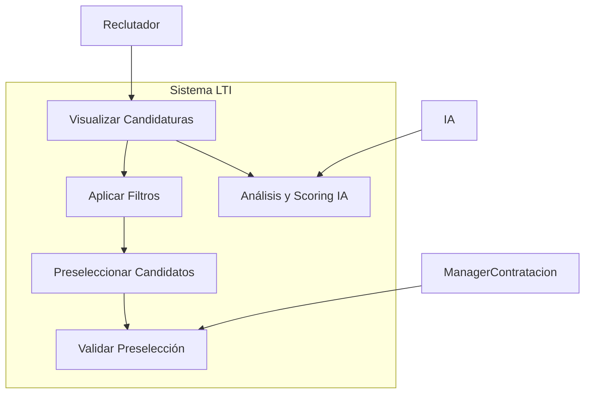
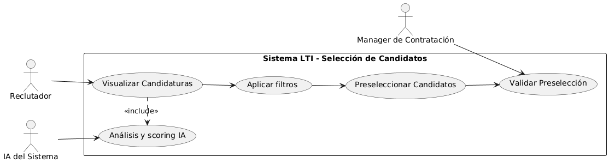

## 4.3 Programar y coordinar entrevistas

### 📌 Descripción:
El reclutador organiza entrevistas con los candidatos seleccionados, coordinando las agendas con los managers de contratación y los propios candidatos. El sistema propone horarios disponibles, gestiona las invitaciones, genera eventos en los calendarios y envía recordatorios.

### 👤 Actores:
- Reclutador  
- Candidato  
- Manager de contratación  
- Calendario externo (Google Calendar, Outlook, etc.)

### 🎯 Objetivo:
Automatizar y facilitar la coordinación de entrevistas, reduciendo tiempos de espera y mejorando la experiencia del candidato y del equipo interno.

### 🔁 Flujo de pasos:
1. El reclutador inicia el proceso de programación de entrevista.  
2. El sistema consulta la disponibilidad del manager.  
3. Se envía una invitación al candidato con horarios sugeridos.  
4. El candidato confirma su disponibilidad.  
5. El sistema genera el evento automáticamente en el calendario.  
6. Todos los actores reciben notificaciones y recordatorios.

### 🖼 Diagrama de caso de uso (Mermaid):

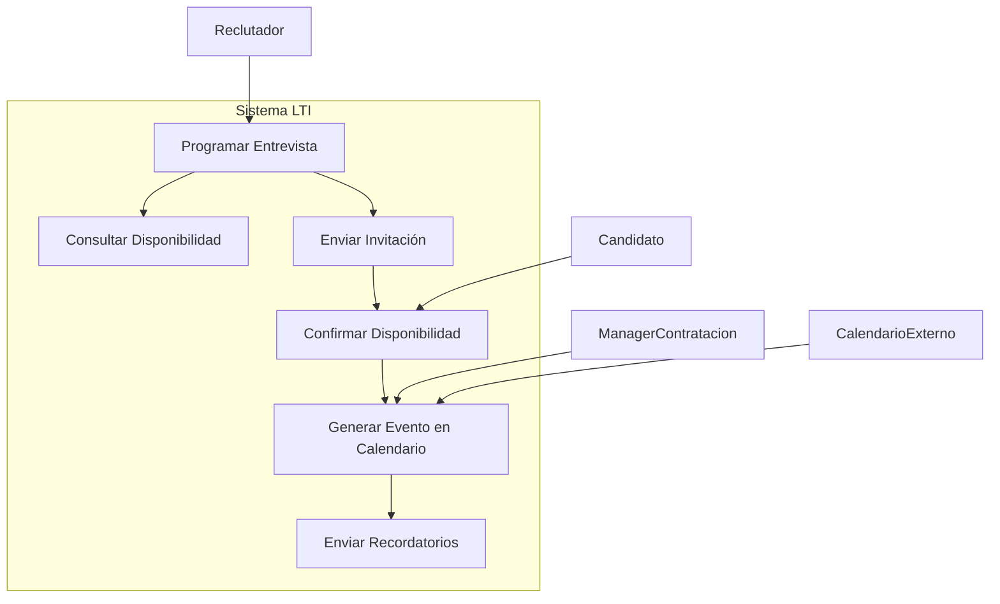

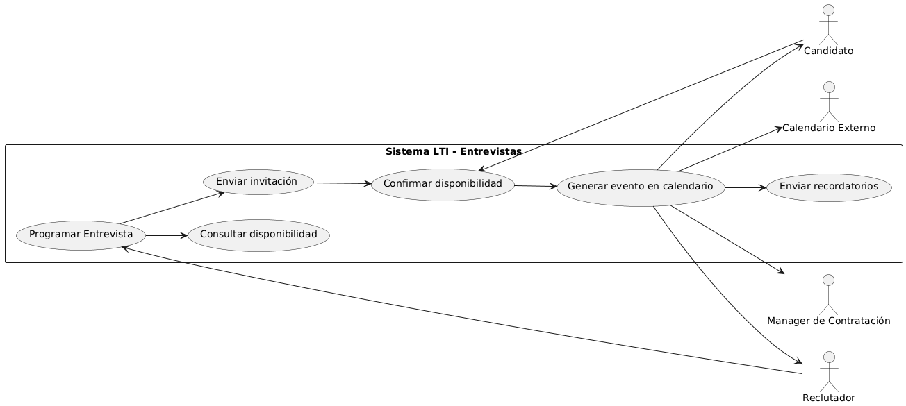

# 5. Modelo de datos

### 📌 Descripción:
Debes diseñar el **modelo de datos del sistema**, que incluya la definición de entidades clave, sus atributos y las relaciones entre ellas. Este modelo será la base estructural que permitirá almacenar y gestionar eficientemente la información del proceso de selección de personal.

### 🧩 Entidades principales y atributos:

#### 📄 Usuario
- `id_usuario` (Integer, PK)
- `nombre` (String)
- `apellido` (String)
- `email` (String)
- `rol` (Enum: Reclutador, Manager, Admin)
- `fecha_creacion` (DateTime)

#### 📄 Candidato
- `id_candidato` (Integer, PK)
- `nombre` (String)
- `apellido` (String)
- `email` (String)
- `telefono` (String)
- `estado_proceso` (Enum: Preseleccionado, En entrevista, Finalista, Rechazado)
- `curriculum_url` (String)
- `score_tecnico` (Float)
- `score_cultural` (Float)
- `fecha_aplicacion` (DateTime)

#### 📄 Oferta
- `id_oferta` (Integer, PK)
- `titulo` (String)
- `descripcion` (Text)
- `ubicacion` (String)
- `tipo_contrato` (String)
- `fecha_publicacion` (DateTime)
- `estado_oferta` (Enum: Activa, Cerrada, En pausa)

#### 📄 Aplicación (Postulación)
- `id_aplicacion` (Integer, PK)
- `id_candidato` (FK → Candidato)
- `id_oferta` (FK → Oferta)
- `fecha_postulacion` (DateTime)
- `estado_aplicacion` (Enum: En revisión, Entrevista agendada, Rechazada, Aceptado)

#### 📄 Entrevista
- `id_entrevista` (Integer, PK)
- `id_aplicacion` (FK → Aplicación)
- `id_reclutador` (FK → Usuario)
- `id_manager` (FK → Usuario)
- `fecha_hora` (DateTime)
- `tipo_entrevista` (Enum: Online, Presencial)
- `estado` (Enum: Programada, Realizada, Cancelada)

#### 📄 Evento Calendario
- `id_evento` (Integer, PK)
- `id_entrevista` (FK → Entrevista)
- `id_candidato` (FK → Candidato)
- `id_usuario` (FK → Usuario)
- `fecha_evento` (DateTime)
- `plataforma` (String: Google Calendar, Outlook, etc.)
- `enlace_evento` (String)

---

### 🔗 Relaciones entre entidades:
- **Un Usuario** puede tener **muchas Entrevistas** (como Reclutador o Manager).
- **Un Candidato** puede aplicar a **muchas Ofertas** → relación muchos a muchos a través de la entidad **Aplicación**.
- **Una Oferta** puede tener **muchas Aplicaciones**.
- **Una Aplicación** puede tener **muchas Entrevistas** asociadas.
- **Una Entrevista** puede tener **un Evento de calendario** asociado.

---

### 🖼 Diagrama Entidad-Relación (ER) (Mermaid):
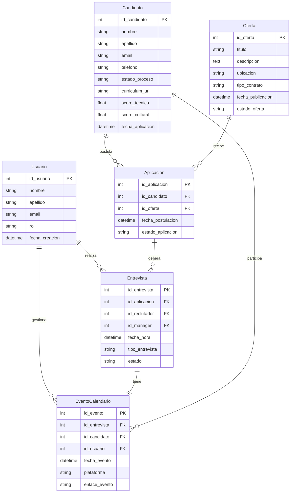

# 6. Diseño del sistema a alto nivel

### 🧱 Organización técnica del sistema LTI (ATS)

El sistema LTI estará compuesto por una arquitectura modular y escalable basada en una arquitectura clásica de tres capas, complementada con módulos especializados para IA y analítica avanzada. Esta organización facilita el mantenimiento, escalabilidad y la incorporación de nuevas funcionalidades en el futuro.

A continuación se describen los principales componentes del sistema:

### 🔹 1. Frontend
- Interfaz de usuario accesible vía navegador.
- Framework moderno (ej. React, Vue o similar).
- Interfaces diferenciadas por rol: Reclutador, Manager, Candidato, Administrador.
- Comunicación con el backend a través de APIs REST/GraphQL.
- Experiencia optimizada para escritorio y móvil (responsive design).

### 🔹 2. Backend
- Motor principal de procesamiento del sistema.
- Desarrollado con frameworks robustos (ej. Django, Node.js o similar).
- Exposición de APIs REST/GraphQL para interacción con el frontend.
- Gestión de reglas de negocio, lógica de selección, flujos de entrevistas y usuarios.
- Autenticación y control de acceso según roles.

### 🔹 3. Módulo de Inteligencia Artificial
- Servicios específicos para:
  - Scoring de candidatos.
  - Recomendación de perfiles.
  - Análisis semántico de CVs.
  - Asistente IA para redacción y sugerencias.
- Integración vía microservicios o endpoints internos especializados.

### 🔹 4. Base de Datos Principal
- Almacenamiento estructurado de:
  - Usuarios, ofertas, candidaturas, entrevistas, logs, configuraciones.
- Motor de base de datos relacional (ej. PostgreSQL).
- Módulos adicionales para bases de datos vectoriales (para IA) si se requiere NLP avanzado.

### 🔹 5. Sistema de Notificaciones y Automatizaciones
- Motor de eventos para enviar correos, recordatorios, tareas automatizadas.
- Integración con herramientas externas (ej. Calendario, Email, Slack, Teams).

### 🔹 6. Integraciones externas (APIs de terceros)
- Publicación automática de ofertas en plataformas de empleo.
- Sincronización de calendarios (Google/Outlook).
- Videollamadas (Zoom, Teams).
- Herramientas de RRHH (ERPs, CRMs).

---

### 🖼 Diagrama de arquitectura a alto nivel (Mermaid)

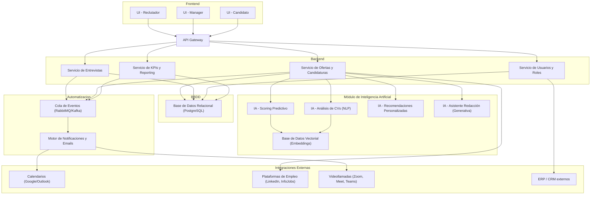

### 🖼 Diagrama de arquitectura a alto nivel (DrawIO)

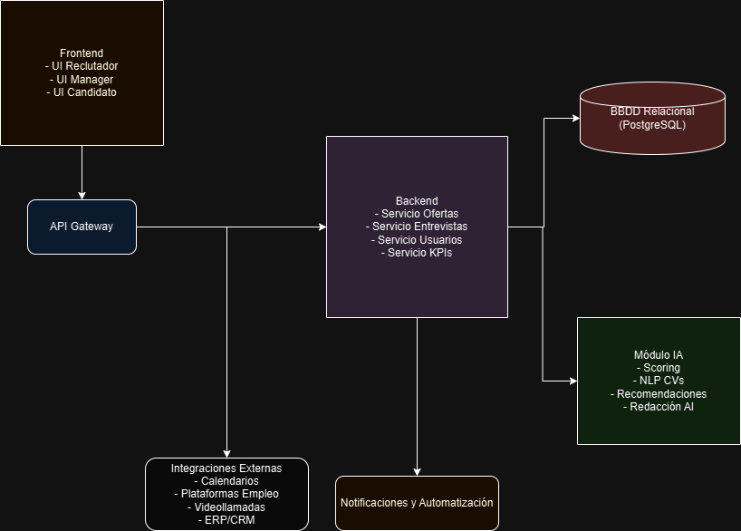

# 7. C4 Model – Sistema LTI (Applicant Tracking System)

---

## 🔷 C1: Diagrama de Contexto

### 📄 ¿Qué muestra?
Una visión general del sistema LTI, quién lo usa y con qué otros sistemas se comunica.

### 🧠 Explicación:
| Elemento              | Descripción                                                      |
|-----------------------|------------------------------------------------------------------|
| **Usuarios del sistema** | Reclutadores, Managers, Candidatos, Administradores             |
| **Sistema LTI**          | El sistema central que gestiona procesos de selección           |
| **Sistemas externos**    | Plataformas de empleo, Calendarios, CRM/ERP, Herramientas de videollamadas |

### 🖼 Diagrama C4 – Nivel 1 – Contexto (Mermaid)
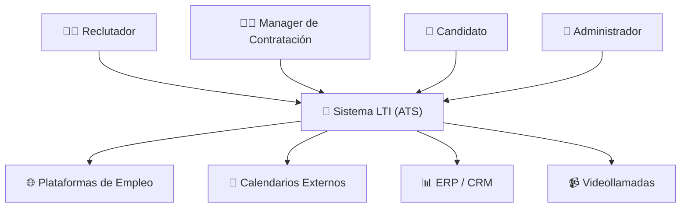

## 🔷 C2: Diagrama de Contenedores

### 📄 ¿Qué muestra?
La estructura técnica general: Frontend, Backend, IA, Bases de Datos, etc.

### 🧠 Explicación:

| Contenedor         | Función                                                       |
|--------------------|---------------------------------------------------------------|
| **Frontend**        | Interfaz web para cada tipo de usuario                        |
| **API Gateway**     | Punto central de entrada a los servicios                      |
| **Backend**         | Lógica de negocio (Ofertas, Candidatos, Entrevistas, KPIs)    |
| **Base de Datos**   | PostgreSQL                                                    |
| **IA Services**     | Screening, Scoring, NLP, Recomendaciones                      |
| **Notificaciones**  | Emails, recordatorios, integraciones                          |
| **Integraciones**   | LinkedIn, Google Calendar, Zoom, ERPs                         |

### 🖼 Diagrama C4 – Nivel 2 – Contenedores (Mermaid)

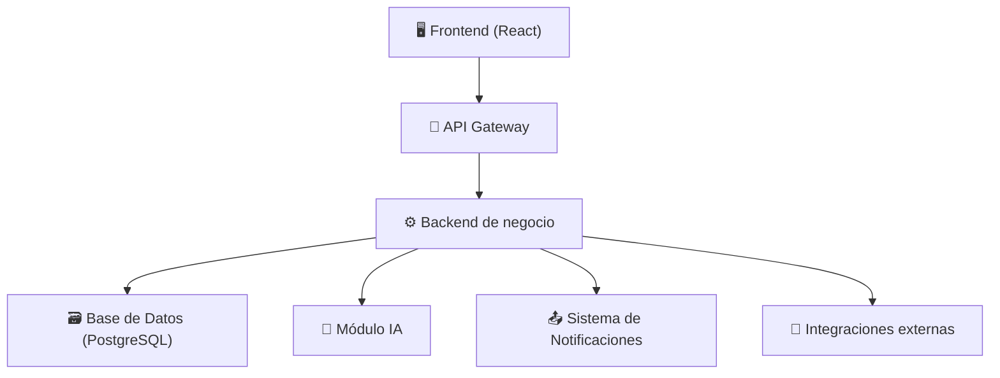

## 🔷 C3: Diagrama de Componentes (Backend)

### 📄 ¿Qué muestra?
Qué módulos internos componen el Backend.

### 🧠 Explicación:

| Componente                      | Función                                         |
|-------------------------------|--------------------------------------------------|
| **Servicio de Ofertas**        | Gestión y publicación de vacantes               |
| **Servicio de Candidaturas**   | Gestión de postulaciones y estado               |
| **Servicio de Entrevistas**    | Coordinación y planificación                    |
| **Servicio de KPIs y Reporting** | Métricas del proceso de selección            |
| **Servicio de Usuarios y Roles** | Gestión de accesos y permisos                |

### 🖼 Diagrama C4 – Nivel 3 – Componentes del Backend (Mermaid)

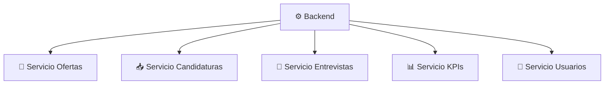

## 🔷 C4: Diagrama de Código – Servicio de Ofertas

### 📄 ¿Qué muestra?
La estructura interna de clases o módulos de un componente específico. Aquí lo hacemos para el **Servicio de Ofertas**.

### 🧠 Ejemplo de estructura interna:

| Elemento            | Tipo              | Descripción                                 |
|---------------------|-------------------|---------------------------------------------|
| `OfertaController`  | Clase / Módulo    | Exposición de endpoints REST                |
| `OfertaService`     | Clase             | Lógica de negocio de las ofertas            |
| `OfertaRepository`  | Clase             | Acceso a base de datos                      |
| `Oferta`            | Entidad           | Modelo de datos de oferta                   |
| `CanalPublicacion`  | Entidad           | Dónde se publica la oferta                  |
| `ValidadorOferta`   | Servicio          | Lógica de validación personalizada          |

### 🖼 Diagrama C4 – Nivel 4 – Código interno del Servicio de Ofertas (Mermaid)

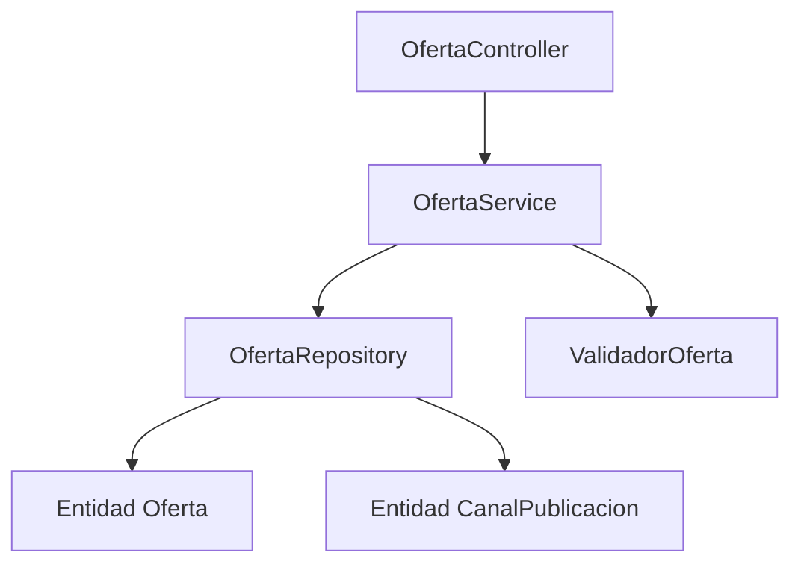