# Sistemas de Gestión de Talento (ATS): Análisis de Mercado y Oportunidades

## Descripción General de un ATS

Un Applicant Tracking System (ATS) es una solución de software que automatiza y optimiza el proceso de reclutamiento y selección de personal. Funciona como una plataforma centralizada que permite a las organizaciones gestionar todo el ciclo de contratación: desde la publicación de vacantes, recepción y filtrado de candidaturas, hasta la selección final y preparación para la incorporación del nuevo empleado. El ATS elimina procesos manuales, reduce tiempos de contratación, mejora la calidad de los candidatos y proporciona datos analíticos para optimizar las estrategias de reclutamiento.

## Funcionalidades básicas de un Applicant Tracking System (ATS)

1. Publicación y distribución de ofertas laborales: Capacidad para crear y publicar vacantes en múltiples canales (sitio web corporativo, portales de empleo, redes sociales) desde una única plataforma, facilitando mayor alcance y visibilidad de las ofertas.
2. Base de datos de candidatos centralizada: Almacenamiento organizado de perfiles, currículums y documentación de candidatos, con capacidades de búsqueda avanzada y filtrado para facilitar la consulta de información histórica y actual.
3. Seguimiento del proceso de selección: Visualización clara del estado de cada candidato a través de las diferentes etapas del proceso (aplicación recibida, revisión curricular, entrevistas, pruebas, oferta, contratación), permitiendo conocer el avance en tiempo real.
4. Evaluación y filtrado de candidatos: Herramientas para clasificar automáticamente los perfiles según requisitos predefinidos, implementar cuestionarios preliminares y filtrar candidatos mediante palabras clave o criterios específicos.
5. Comunicación con candidatos: Sistema integrado para enviar correos electrónicos, mensajes de texto o notificaciones automatizadas, mantener la comunicación durante el proceso y programar entrevistas o pruebas.
6. Gestión de entrevistas: Coordinación de agendas de entrevistadores, envío de invitaciones, recordatorios automáticos y registro de resultados de entrevistas con sistemas de calificación estructurados.
7. Colaboración entre reclutadores: Funcionalidades para compartir notas, evaluaciones y comentarios entre miembros del equipo de selección, facilitando la toma de decisiones colectiva sobre candidatos.
8. Informes y analíticas de reclutamiento: Generación de métricas y estadísticas sobre fuentes de reclutamiento efectivas, tiempos del proceso, tasas de conversión y otros indicadores relevantes para optimizar estrategias.
9. Integración con otras plataformas: Capacidad de conexión con sistemas de nómina, HRIS (Sistema de Información de Recursos Humanos), correo electrónico, calendarios y otras herramientas corporativas para mantener la consistencia de información.
10. Gestión de referencias y verificación de antecedentes: Automatización de solicitudes de referencias, seguimiento de verificaciones pendientes y almacenamiento seguro de resultados.
11. Portal de candidatos: Interfaz para que los aspirantes puedan actualizar su información, verificar el estado de sus aplicaciones y completar tareas pendientes del proceso de selección.
12. Onboarding inicial: Funcionalidades básicas para iniciar el proceso de incorporación una vez seleccionado el candidato, como envío de documentación preliminar o recopilación de datos necesarios para la contratación.
13. Optimización para dispositivos móviles: Acceso a funcionalidades principales desde teléfonos inteligentes y tabletas, tanto para reclutadores como para candidatos.
14. Personalización y marca empleadora: Opciones para adaptar la apariencia del sistema según la identidad corporativa, reforzando la imagen de marca en todas las interacciones con candidatos.
15. Cumplimiento normativo y protección de datos: Herramientas para garantizar el cumplimiento de legislaciones sobre protección de datos personales, no discriminación y otras regulaciones aplicables al reclutamiento.


## Análisis Comparativo de Soluciones ATS en el Mercado

| Característica | Soluciones de Pago |  | | Soluciones Open Source | |
|----------------|-------------------|-------------------|-------------------|-------------------|-------------------|
|                | **Workday Recruiting** | **Greenhouse** | **SmartRecruiters** | **JobScore** | **OpenCATS** |
| **Precio** | Alto (Enterprise) | Medio-Alto | Medio | Versión gratuita limitada + planes de pago | Gratuito |
| **Publicación multisitio** | Excelente | Excelente | Excelente | Buena | Básica |
| **Base de datos de candidatos** | Avanzada | Avanzada | Avanzada | Intermedia | Básica |
| **Seguimiento del proceso** | Completo con workflows personalizables | Completo con estructura de etapas flexible | Completo con evaluación colaborativa | Intermedio | Básico |
| **IA para filtrado** | Avanzada | Intermedia | Avanzada | Limitada | No disponible |
| **Comunicación con candidatos** | Completa con automatizaciones | Completa con plantillas personalizables | Completa con engagement scoring | Básica | Limitada |
| **Analíticas y reportes** | Avanzados con predictivos | Avanzados | Avanzados | Básicos | Mínimos |
| **Integración con ecosistema** | Extensa (HRIS, nómina, evaluaciones) | Muy buena (+200 integraciones) | Muy buena (marketplace de apps) | Limitada | Mínima |
| **Experiencia móvil** | Completa | Completa | Completa | Parcial | No disponible |
| **Onboarding integrado** | Completo | Parcial | Completo | No disponible | No disponible |
| **Cumplimiento normativo** | Global avanzado (GDPR, CCPA) | Global | Global | Básico | Limitado |

## Oportunidades de Innovación: Ventajas Competitivas Potenciales

1. **Sistema de Inteligencia Predictiva de Permanencia**
   - Análisis avanzado que predice no solo el ajuste del candidato al puesto, sino también su probable permanencia en la empresa, basado en patrones históricos de retención y factores correlacionados con longevidad laboral.
   - Diferencial: Mientras las soluciones actuales se enfocan en encontrar al mejor candidato, pocas analizan factores de retención a largo plazo.

2. **Marketplace de Evaluación de Habilidades Técnicas Específicas por Industria**
   - Plataforma integrada con evaluaciones prácticas específicas por sector industrial que simulan entornos de trabajo reales.
   - Diferencial: Las evaluaciones actuales suelen ser genéricas o requieren integraciones complejas con terceros.

3. **Planificación Estratégica de Talento Basada en Proyecciones de Negocio**
   - Integración con sistemas de planificación empresarial para anticipar necesidades de contratación basadas en proyecciones de crecimiento, expansión geográfica o desarrollo de nuevos productos.
   - Diferencial: Transformar el ATS de herramienta reactiva a plataforma estratégica predictiva.

4. **Programa de Candidatos Silver Medalists**
   - Sistema automatizado para mantener relaciones con candidatos finalistas no seleccionados, nutriendo relaciones para futuras oportunidades mediante contenido personalizado y actualizaciones periódicas.
   - Diferencial: Las soluciones actuales generalmente "abandonan" a los candidatos no seleccionados.

5. **Análisis de Cultura Organizacional y Compatibilidad**
   - Evaluación científica de compatibilidad cultural mediante análisis lingüístico de comunicaciones del candidato, comportamientos durante el proceso y preferencias declaradas.
   - Diferencial: Va más allá de las evaluaciones de personalidad estándar, enfocándose en el ajuste específico con la cultura de la organización.

6. **Mitigación Avanzada de Sesgos con Auditoría IA**
   - Sistema que detecta y corrige proactivamente sesgos en todas las etapas del reclutamiento, desde la redacción de ofertas hasta las decisiones finales.
   - Diferencial: Mientras muchos sistemas tienen funciones básicas anti-sesgos, pocos implementan corrección activa y mejora continua.

7. **Ecosistema de Microformación Integrada**
   - Plataforma que identifica brechas específicas de habilidades en candidatos prometedores y ofrece microformación personalizada para cerrarlas durante el proceso de selección.
   - Diferencial: Transforma el ATS de sistema de filtrado a plataforma de desarrollo de talento desde la fase de candidatura.

8. **Sistema de Referidos mediante Análisis de Redes Profesionales**
   - Tecnología que analiza redes profesionales de empleados actuales para identificar candidatos pasivos de alto potencial, facilitando recomendaciones personalizadas.
   - Diferencial: Automatiza el proceso de referidos más allá de los sistemas básicos actuales, utilizando IA para encontrar coincidencias ideales.


## Diagrama Lean Canvas

```
classDiagram
    class LeanCanvas {
        <<Lean Canvas: ATS Innovador>>
    }
    
    class Problema {
        1. Altas tasas de rotación por contrataciones incompatibles
        2. Procesos de selección ineficientes y costosos
        3. Dificultad para evaluar habilidades técnicas específicas
        4. Pérdida de candidatos talentosos no seleccionados
    }
    
    class Solución {
        1. Sistema de predicción de permanencia con IA
        2. Evaluación de compatibilidad cultural
        3. Marketplace de evaluaciones técnicas por industria
        4. Programa Silver Medalists automatizado
    }
    
    class PropuestaValor {
        "Transformamos el reclutamiento predictivo
        reduciendo hasta un 35% la rotación temprana
        y acortando ciclos de contratación en un 40%,
        con evaluaciones específicas por industria
        que garantizan el ajuste técnico y cultural"
    }
    
    class VentajaInjusta {
        1. Algoritmos propietarios de predicción de permanencia
        2. Base de datos de patrones de éxito por industria
        3. Sistema de microformación integrado
        4. Auditoría IA de sesgos en procesos de selección
    }
    
    class SegmentosClientes {
        1. Empresas medianas en crecimiento (100-500 empleados)
        2. Sectores con alta rotación (tecnología, retail)
        3. Organizaciones con equipos distribuidos
        4. Empresas con contratación basada en proyectos
    }
    
    class IndicadoresClave {
        1. Reducción en tasa de rotación temprana (<6 meses)
        2. Tiempo promedio para cubrir vacantes
        3. Calidad de contrataciones (evaluación a 90 días)
        4. Tasa de conversión de candidatos silver medalists
        5. ROI de contratación (coste vs rendimiento)
    }
    
    class CanalesDistribución {
        1. Venta directa consultiva
        2. Eventos/webinars de RRHH
        3. Marketplace de integraciones ATS
        4. Programa de partners con consultoras RRHH
        5. SEO especializado en reclutamiento predictivo
    }
    
    class EstructuraCostos {
        1. Desarrollo y mantenimiento de plataforma
        2. Equipo de ciencia de datos e IA
        3. Infraestructura cloud y seguridad de datos
        4. Adquisición de clientes
        5. Soporte y éxito del cliente
    }
    
    class FuentesIngresos {
        1. Suscripción base (por usuario/mes)
        2. Complementos premium (módulos predictivos)
        3. API para integraciones empresariales
        4. Consultoría de implementación
        5. Marketplace de evaluaciones (comisión)
    }
    
    LeanCanvas --> Problema
    LeanCanvas --> Solución
    LeanCanvas --> PropuestaValor
    LeanCanvas --> VentajaInjusta
    LeanCanvas --> SegmentosClientes
    LeanCanvas --> IndicadoresClave
    LeanCanvas --> CanalesDistribución
    LeanCanvas --> EstructuraCostos
    LeanCanvas --> FuentesIngresos
```

## Principales Casos de Uso de un ATS


### Caso de Uso 1: Publicación y Gestión de Vacantes

Este caso de uso representa el punto de inicio del proceso de reclutamiento. El diagrama muestra la secuencia completa desde la creación de una vacante hasta su distribución multicanal y el monitoreo de su rendimiento.

**Características principales:**

- Creación centralizada de la vacante con todos los detalles relevantes
- Distribución automática a múltiples canales (bolsas de trabajo, redes sociales, sitio corporativo)
- Ciclo de retroalimentación continua sobre el rendimiento de la publicación
- Capacidad para realizar ajustes en tiempo real basados en métricas de desempeño

La eficiencia de este proceso es fundamental, ya que determina la calidad y cantidad del talento que ingresa al embudo de selección. El sistema automatiza la distribución multicanal, eliminando tareas manuales y garantizando consistencia en la comunicación de la marca empleadora.

```
sequenceDiagram
    actor RH as Reclutador RH
    participant ATS as Sistema ATS
    participant JB as Bolsas de Trabajo
    participant SM as Redes Sociales
    participant Corp as Sitio Corporativo
    
    RH->>ATS: Crear nueva vacante
    activate RH
    activate ATS
    RH->>ATS: Completar detalles del puesto
    RH->>ATS: Definir requisitos y competencias
    RH->>ATS: Configurar flujo de selección
    RH->>ATS: Seleccionar canales de publicación
    ATS-->>RH: Previsualizar anuncio
    RH->>ATS: Aprobar y solicitar publicación
    ATS->>JB: Distribuir vacante automáticamente
    ATS->>SM: Publicar en canales sociales
    ATS->>Corp: Actualizar sitio de carreras
    JB-->>ATS: Confirmar publicación
    SM-->>ATS: Confirmar publicación
    Corp-->>ATS: Confirmar publicación
    ATS-->>RH: Notificar publicación exitosa
    deactivate ATS
    
    loop Monitoreo de Rendimiento
        RH->>ATS: Consultar métricas de la vacante
        activate ATS
        ATS-->>RH: Mostrar estadísticas de visualización
        ATS-->>RH: Mostrar tasa de conversión
        ATS-->>RH: Mostrar calidad de aplicaciones
        deactivate ATS
    end
    
    RH->>ATS: Modificar parámetros de la vacante
    activate ATS
    ATS->>JB: Actualizar anuncio
    ATS->>SM: Actualizar anuncio
    ATS->>Corp: Actualizar anuncio
    ATS-->>RH: Confirmar actualizaciones
    deactivate ATS
    deactivate RH
```

### Caso de Uso 2: Evaluación y Filtrado de Candidatos

Este caso de uso representa el núcleo del proceso de selección, donde se implementan las innovaciones más significativas propuestas para el sistema. El diagrama muestra el flujo completo desde la recepción de una aplicación hasta la decisión sobre el avance del candidato en el proceso.

**Características principales:**

- Evaluación preliminar automatizada mediante inteligencia artificial
- Análisis predictivo de permanencia y compatibilidad cultural
- Gestión de evaluaciones técnicas específicas por puesto
- Flujo de trabajo colaborativo entre reclutadores y gerentes contratantes
- Programa Silver Medalists para candidatos no seleccionados con potencial futuro

Este caso de uso incorpora las ventajas competitivas más importantes del sistema propuesto: la predicción de permanencia, evaluación de compatibilidad cultural y evaluaciones técnicas específicas por industria, transformando el proceso de filtrado tradicional en un sistema inteligente de selección.

```
sequenceDiagram
    actor RH as Reclutador RH
    actor MGR as Gerente Contratante
    participant ATS as Sistema ATS
    participant IA as Motor IA de Evaluación
    participant CAN as Candidato
    
    CAN->>ATS: Enviar aplicación
    activate ATS
    ATS->>CAN: Confirmar recepción
    ATS->>IA: Solicitar análisis preliminar
    activate IA
    IA->>IA: Evaluar match con requisitos
    IA->>IA: Analizar predicción de permanencia
    IA->>IA: Calcular compatibilidad cultural
    IA-->>ATS: Entregar score de evaluación
    deactivate IA
    
    ATS-->>RH: Notificar nueva aplicación
    activate RH
    RH->>ATS: Revisar evaluación automática
    ATS-->>RH: Mostrar dashboard de candidato
    RH->>ATS: Clasificar candidato (apto/no apto)
    
    alt Candidato Preseleccionado
        RH->>ATS: Programar evaluación técnica
        ATS->>CAN: Enviar invitación a prueba técnica
        CAN->>ATS: Completar evaluación técnica
        ATS->>IA: Procesar resultados
        activate IA
        IA-->>ATS: Entregar análisis de competencias
        deactivate IA
        ATS-->>RH: Mostrar resultados técnicos
        RH->>ATS: Avanzar candidato a entrevista
        ATS->>MGR: Notificar candidato para entrevista
        activate MGR
        MGR->>ATS: Agendar entrevista
        ATS->>CAN: Enviar invitación a entrevista
        ATS->>MGR: Confirmar programación
        ATS->>RH: Confirmar programación
        deactivate MGR
    else Candidato No Apto
        RH->>ATS: Registrar motivo de rechazo
        RH->>ATS: Clasificar para futuras vacantes
        ATS->>CAN: Enviar notificación de estado
        ATS->>ATS: Almacenar en programa Silver Medalists
    end
    
    RH->>ATS: Actualizar estado del proceso
    deactivate RH
    ATS->>ATS: Actualizar métricas de reclutamiento
    deactivate ATS
```

### Caso de Uso 3: Onboarding e Integración con HRIS

Este caso de uso representa la transición crítica de candidato a empleado, fase que frecuentemente es subestimada en sistemas ATS tradicionales. El diagrama muestra el flujo desde la aceptación de la oferta hasta la completa integración en la organización.

**Características principales:**

-  Gestión automatizada de documentación y verificaciones legales
- Integración fluida con sistemas de HRIS para transferencia de datos
- Coordinación entre departamentos para la preparación de la incorporación
- Programa estructurado de seguimiento durante los primeros 90 días
- Generación de métricas de calidad de contratación para optimización continua

Este caso de uso cierra el ciclo completo de reclutamiento, implementando un puente efectivo entre la selección y la gestión del talento, lo que contribuye significativamente a mejorar las tasas de retención temprana y acortar el tiempo hasta la productividad óptima del nuevo empleado.
Estos tres casos de uso representan el ciclo vital completo dentro de un ATS innovador, desde la atracción del talento hasta su incorporación exitosa, destacando las ventajas competitivas propuestas que transforman un sistema transaccional en una plataforma estratégica para la gestión del capital humano.

```
sequenceDiagram
    actor RH as Reclutador RH
    actor MGR as Gerente Contratante
    participant ATS as Sistema ATS
    participant HRIS as Sistema HRIS
    participant CAN as Candidato Seleccionado
    participant LEGAL as Departamento Legal
    
    RH->>ATS: Marcar candidato como seleccionado
    activate RH
    activate ATS
    ATS->>CAN: Enviar notificación de selección
    CAN->>ATS: Confirmar aceptación de oferta
    
    ATS->>ATS: Iniciar proceso de onboarding
    ATS->>CAN: Solicitar documentación necesaria
    CAN->>ATS: Cargar documentos personales
    
    ATS->>LEGAL: Enviar documentos para verificación
    activate LEGAL
    LEGAL->>ATS: Confirmar validez de documentos
    deactivate LEGAL
    
    ATS->>HRIS: Transferir datos del candidato
    activate HRIS
    HRIS-->>ATS: Confirmar creación de perfil empleado
    deactivate HRIS
    
    ATS->>CAN: Enviar programa de inducción
    ATS->>MGR: Notificar fecha de incorporación
    activate MGR
    
    ATS->>ATS: Generar plan de capacitación inicial
    ATS->>CAN: Compartir accesos preliminares
    ATS->>MGR: Compartir perfil completo de nuevo empleado
    
    MGR->>ATS: Confirmar preparativos completados
    deactivate MGR
    
    ATS->>HRIS: Activar ciclo de nómina
    activate HRIS
    HRIS-->>ATS: Confirmar integración completa
    deactivate HRIS
    
    ATS->>RH: Notificar finalización del proceso
    ATS->>ATS: Activar seguimiento post-incorporación
    
    loop Seguimiento 90 días
        ATS->>CAN: Solicitar feedback de incorporación
        ATS->>MGR: Solicitar evaluación de desempeño
        ATS->>ATS: Actualizar métricas de calidad de contratación
    end
    
    ATS-->>RH: Generar informe de efectividad del proceso
    deactivate ATS
    deactivate RH
```

## Modelo de Datos

### Entidades Principales y Sus Propósitos

#### Gestión Organizacional
- **EMPRESA**: Almacena información de la organización cliente y sus configuraciones específicas. Permite la personalización del sistema según industria y necesidades.
- **USUARIO**: Registra todos los usuarios del sistema con sus roles diferenciados (reclutadores, gerentes, administradores), controlando accesos y responsabilidades.

#### Gestión de Vacantes
- **VACANTE**: Núcleo del proceso de publicación, contiene toda la información del puesto, incluyendo requisitos, competencias requeridas y configuración del flujo de selección.
- **CANAL_PUBLICACION**: Catálogo de plataformas donde distribuir las vacantes, con su configuración técnica asociada.
- **PUBLICACION_VACANTE**: Relación que documenta dónde se ha publicado cada vacante, facilitando el seguimiento de métricas por canal.

#### Gestión de Candidatos
- **CANDIDATO**: Almacena el perfil completo de cada aspirante, incorporando los scores predictivos de permanencia y compatibilidad cultural.
- **APLICACION**: Registro del proceso específico de un candidato para una vacante, con su progreso a través de las diferentes etapas.
- **DOCUMENTO**: Gestiona todos los archivos asociados al proceso (CV, certificaciones, documentos legales).

#### Evaluación y Selección
- **EVALUACION_TECNICA**: Catálogo de pruebas técnicas categorizadas por industria y competencias.
- **RESULTADO_EVALUACION**: Registra el desempeño del candidato en cada evaluación con análisis detallado de competencias.
- **ENTREVISTA**: Gestiona la programación y resultados de cada entrevista en el proceso.
- **ENTREVISTADOR**: Registra los colaboradores que participan en entrevistas con sus áreas de especialización.
- **PARTICIPACION_ENTREVISTA**: Documenta evaluaciones específicas de cada entrevistador para un candidato.

#### Comunicación y Seguimiento
- **PLANTILLA_CORREO**: Repositorio de comunicaciones estandarizadas para cada etapa del proceso.
- **COMUNICACION**: Registro de todas las interacciones con el candidato durante el proceso.

#### Onboarding e Integración
- **ONBOARDING**: Gestiona el proceso de incorporación desde la oferta aceptada hasta la plena integración del empleado.
- **INTEGRACION_SISTEMA**: Configura las conexiones con sistemas externos como HRIS y nómina.

#### Analítica y Optimización
- **METRICAS_RECLUTAMIENTO**: Almacena indicadores de rendimiento para análisis y mejora continua.

```

erDiagram
    EMPRESA {
        int empresa_id PK
        varchar nombre
        varchar industria
        varchar tamano
        datetime fecha_registro
        boolean activo
        jsonb configuracion_personalizada
    }
    
    USUARIO {
        int usuario_id PK
        int empresa_id FK
        varchar nombre
        varchar apellido
        varchar email
        varchar contrasena_hash
        varchar rol
        datetime ultimo_acceso
        boolean activo
        jsonb preferencias
    }
    
    VACANTE {
        int vacante_id PK
        int empresa_id FK
        int creador_id FK
        varchar titulo
        text descripcion
        varchar departamento
        varchar ubicacion
        varchar modalidad
        varchar nivel_experiencia
        decimal salario_min
        decimal salario_max
        varchar tipo_contrato
        datetime fecha_publicacion
        datetime fecha_cierre
        varchar estado
        jsonb requisitos
        jsonb competencias_requeridas
        jsonb etapas_proceso
        jsonb metricas_rendimiento
    }
    
    CANAL_PUBLICACION {
        int canal_id PK
        varchar nombre
        varchar tipo
        text configuracion_api
        boolean activo
    }
    
    PUBLICACION_VACANTE {
        int publicacion_id PK
        int vacante_id FK
        int canal_id FK
        datetime fecha_publicacion
        varchar estado
        varchar url_publicacion
        int visualizaciones
        int aplicaciones
        jsonb metricas_canal
    }
    
    CANDIDATO {
        int candidato_id PK
        varchar nombre
        varchar apellido
        varchar email
        varchar telefono
        text resumen
        varchar linkedin_url
        varchar ubicacion
        decimal salario_esperado
        datetime fecha_registro
        varchar fuente_origen
        jsonb experiencia_laboral
        jsonb formacion_academica
        jsonb habilidades
        jsonb certificaciones
        float score_permanencia
        float score_cultural
        boolean silver_medalist
        jsonb datos_demograficos
    }
    
    APLICACION {
        int aplicacion_id PK
        int vacante_id FK
        int candidato_id FK
        datetime fecha_aplicacion
        varchar estado_actual
        int etapa_actual
        jsonb respuestas_preguntas
        jsonb evaluaciones_tecnicas
        jsonb entrevistas
        jsonb notas_evaluacion
        float score_global
        varchar decision_final
        datetime fecha_decision
        jsonb historial_estados
    }
    
    EVALUACION_TECNICA {
        int evaluacion_id PK
        varchar nombre
        varchar descripcion
        varchar tipo
        text contenido
        int duracion_minutos
        float puntaje_minimo
        varchar categoria
        int industria_id FK
        boolean activo
        jsonb parametros_evaluacion
    }
    
    RESULTADO_EVALUACION {
        int resultado_id PK
        int aplicacion_id FK
        int evaluacion_id FK
        datetime fecha_inicio
        datetime fecha_fin
        float puntaje_obtenido
        jsonb respuestas_detalladas
        jsonb analisis_competencias
        text comentarios
    }
    
    ENTREVISTA {
        int entrevista_id PK
        int aplicacion_id FK
        varchar tipo_entrevista
        datetime fecha_programada
        int duracion_minutos
        varchar modalidad
        varchar ubicacion
        varchar estado
        jsonb participantes
        jsonb plantilla_preguntas
        jsonb resultado
    }
    
    ENTREVISTADOR {
        int entrevistador_id PK
        int usuario_id FK
        varchar departamento
        varchar cargo
        jsonb areas_especialidad
        jsonb disponibilidad
        float valoracion_promedio
    }
    
    PARTICIPACION_ENTREVISTA {
        int participacion_id PK
        int entrevista_id FK
        int entrevistador_id FK
        varchar rol
        jsonb evaluacion
        text feedback
        int calificacion
    }
    
    PLANTILLA_CORREO {
        int plantilla_id PK
        int empresa_id FK
        varchar nombre
        varchar tipo
        text contenido
        jsonb variables_disponibles
        boolean activo
    }
    
    COMUNICACION {
        int comunicacion_id PK
        int aplicacion_id FK
        int plantilla_id FK
        int remitente_id FK
        datetime fecha_envio
        varchar tipo
        text contenido
        varchar estado
        datetime fecha_lectura
    }
    
    ONBOARDING {
        int onboarding_id PK
        int aplicacion_id FK
        datetime fecha_inicio
        datetime fecha_incorporacion
        varchar estado
        jsonb documentos_requeridos
        jsonb actividades_completadas
        jsonb actividades_pendientes
        int gerente_id FK
        int mentor_id FK
        jsonb evaluaciones_seguimiento
    }
    
    DOCUMENTO {
        int documento_id PK
        int entidad_id
        varchar tipo_entidad
        varchar nombre
        varchar tipo_documento
        varchar url_almacenamiento
        datetime fecha_subida
        varchar estado_validacion
        varchar notas_validacion
    }
    
    METRICAS_RECLUTAMIENTO {
        int metrica_id PK
        int empresa_id FK
        int vacante_id FK
        datetime periodo_inicio
        datetime periodo_fin
        int total_aplicaciones
        int candidatos_entrevistados
        int ofertas_realizadas
        int contrataciones_completadas
        float tiempo_promedio_contratacion
        float costo_contratacion
        float calidad_contratacion
        jsonb metricas_por_fuente
        jsonb metricas_por_etapa
    }
    
    INTEGRACION_SISTEMA {
        int integracion_id PK
        int empresa_id FK
        varchar nombre_sistema
        varchar tipo_sistema
        text configuracion_api
        boolean activo
        datetime ultima_sincronizacion
        jsonb mapeo_campos
    }
    
    EMPRESA ||--o{ USUARIO : tiene
    EMPRESA ||--o{ VACANTE : publica
    EMPRESA ||--o{ PLANTILLA_CORREO : posee
    EMPRESA ||--o{ METRICAS_RECLUTAMIENTO : genera
    EMPRESA ||--o{ INTEGRACION_SISTEMA : configura
    
    USUARIO ||--o{ VACANTE : crea
    USUARIO ||--o{ ENTREVISTADOR : es
    USUARIO }|--o{ COMUNICACION : envia
    
    VACANTE ||--o{ PUBLICACION_VACANTE : tiene
    VACANTE ||--o{ APLICACION : recibe
    VACANTE }|--o{ METRICAS_RECLUTAMIENTO : genera
    
    CANAL_PUBLICACION ||--o{ PUBLICACION_VACANTE : aloja
    
    CANDIDATO ||--o{ APLICACION : realiza
    CANDIDATO ||--o{ DOCUMENTO : sube
    
    APLICACION ||--o{ RESULTADO_EVALUACION : genera
    APLICACION ||--o{ ENTREVISTA : programa
    APLICACION ||--o{ COMUNICACION : recibe
    APLICACION ||--o{ ONBOARDING : avanza_a
    
    EVALUACION_TECNICA ||--o{ RESULTADO_EVALUACION : produce
    
    ENTREVISTA ||--o{ PARTICIPACION_ENTREVISTA : incluye
    ENTREVISTADOR ||--o{ PARTICIPACION_ENTREVISTA : participa_en
    
    PLANTILLA_CORREO ||--o{ COMUNICACION : formatea
    
    ONBOARDING ||--o{ DOCUMENTO : requiere

```

## Diseño del Sistema a Alto Nivel

### Capa de Presentación

La interfaz de usuario del sistema se presenta a través de múltiples canales para satisfacer las necesidades de diferentes tipos de usuarios:

- **Portal Web Responsive**: Interfaz principal que se adapta a diferentes dispositivos y tamaños de pantalla, proporcionando acceso completo a todas las funcionalidades del sistema tanto para reclutadores como para gerentes contratantes.

- **Aplicación Móvil**: Versión optimizada para dispositivos móviles que permite a los reclutadores y gerentes gestionar procesos críticos en movimiento, como revisión de candidatos, programación de entrevistas y aprobaciones.

- **API Gateway**: Punto de entrada unificado para todas las solicitudes de los clientes, que gestiona la autenticación, autorización, limitación de velocidad y enrutamiento a los microservicios apropiados.

### Capa de Microservicios

El núcleo funcional del sistema se divide en servicios especializados y autónomos:

- **Servicio de Gestión de Vacantes**: Administra el ciclo de vida completo de las vacantes, incluyendo creación, publicación en múltiples canales, seguimiento de métricas y cierre.

- **Servicio de Gestión de Candidatos**: Gestiona los perfiles de candidatos, aplicaciones, y la base de datos de talento, incluyendo el programa Silver Medalists para candidatos valiosos no seleccionados.

- **Servicio de Evaluación y Selección**: Coordina los procesos de evaluación técnica, entrevistas y toma de decisiones, integrándose con el motor de IA para análisis predictivo.

- **Servicio de Comunicaciones**: Gestiona todas las interacciones con candidatos, incluyendo notificaciones, mensajes personalizados y seguimiento de respuestas.

- **Servicio de Onboarding**: Facilita la transición del candidato seleccionado a empleado, gestionando documentación, integraciones con HRIS y programas de incorporación personalizados.

- **Servicio de Analítica y Reportes**: Proporciona inteligencia de negocio mediante dashboards en tiempo real, informes personalizados y análisis predictivo de tendencias de contratación.

- **Servicio de Inteligencia Predictiva**: Coordina el acceso a los modelos de IA y ML, sirviendo como intermediario entre los servicios operativos y la capa de inteligencia.

### Capa de Datos

La persistencia y gestión de información se estructura en múltiples almacenes especializados:

- **Base de Datos Principal**: Almacenamiento relacional que mantiene la estructura de datos normalizada definida en el modelo entidad-relación, asegurando la integridad referencial.

- **Almacenamiento de Documentos**: Sistema especializado para gestionar archivos y documentos como currículums, certificaciones y contratos, con capacidades de búsqueda por contenido.

- **Base de Datos Analítica**: Almacén columnar optimizado para consultas analíticas complejas y procesamiento de grandes volúmenes de datos históricos.

- **Caché Distribuida**: Sistema de memoria distribuida para mejorar el rendimiento mediante el almacenamiento temporal de datos frecuentemente consultados.

### Capa de Inteligencia

El núcleo diferenciador del sistema que implementa las capacidades predictivas avanzadas:

- **Motor IA Predictivo**: Orquestador central que coordina el proceso de análisis predictivo, aplicando los modelos apropiados según el contexto.

- **Modelos de Aprendizaje**: Conjunto de algoritmos entrenados para predecir permanencia, compatibilidad cultural y éxito laboral, segmentados por industria y tipo de puesto.

- **Procesamiento de Lenguaje Natural**: Capacidades de análisis de texto para evaluación semántica de currículums, respuestas de candidatos y compatibilidad con descripciones de puesto.

- **Sistema de Entrenamiento Continuo**: Mecanismo de retroalimentación que utiliza los resultados reales para mejorar continuamente la precisión de los modelos predictivos.

### Integración con Servicios Externos

El sistema se conecta con múltiples plataformas externas para ampliar su funcionalidad:

- **Bolsas de Trabajo**: Integración bidireccional con portales de empleo para publicación automática de vacantes y recepción de aplicaciones.

- **Servicios de Email y SMS**: Canales de comunicación para notificaciones y mensajes a candidatos y partes interesadas internas.

- **Sistemas HRIS**: Integración con sistemas de información de recursos humanos para transferencia eficiente de datos de candidatos contratados.

- **Servicios de Calendario**: Sincronización con sistemas de agenda para coordinación de entrevistas y actividades de onboarding.

### Consideraciones de Implementación

La arquitectura propuesta adopta principios modernos de desarrollo de software:

- **Despliegue en Contenedores**: Cada microservicio se empaqueta como un contenedor independiente, facilitando el despliegue y la escalabilidad.

- **Orquestación con Kubernetes**: Gestión automatizada de contenedores para garantizar alta disponibilidad y recuperación ante fallos.

- **Enfoque DevOps**: Integración y despliegue continuos (CI/CD) para actualizaciones frecuentes y controladas del sistema.

- **Seguridad por Diseño**: Implementación de prácticas de seguridad en cada capa, incluyendo cifrado de datos en tránsito y en reposo, autenticación multifactor y auditoría completa.

```
flowchart TB
    subgraph "Capa de Presentación"
        UI["Portal Web Responsive"]
        MOBILE["Aplicación Móvil"]
        API_GATEWAY["API Gateway"]
    end
    
    subgraph "Capa de Microservicios"
        direction LR
        VAC_SVC["Servicio de\nGestión de Vacantes"]
        CAN_SVC["Servicio de\nGestión de Candidatos"]
        EVAL_SVC["Servicio de\nEvaluación y Selección"]
        COMM_SVC["Servicio de\nComunicaciones"]
        ONBOARD_SVC["Servicio de\nOnboarding"]
        METRICS_SVC["Servicio de\nAnalítica y Reportes"]
        IA_SVC["Servicio de\nInteligencia Predictiva"]
    end
    
    subgraph "Capa de Datos"
        direction LR
        DB_MAIN[(Base de Datos\nPrincipal)]
        DOC_STORE[(Almacenamiento\nde Documentos)]
        ANALYTICS_DB[(Base de Datos\nAnalítica)]
        CACHE["Caché\nDistribuida"]
    end
    
    subgraph "Servicios Externos"
        direction LR
        JOB_BOARDS["Bolsas de\nTrabajo"]
        EMAIL["Servicios\nde Email"]
        SMS["Servicios\nde SMS"]
        HRIS["Sistemas\nHRIS"]
        CAL["Servicios de\nCalendario"]
    end
    
    subgraph "Capa de Inteligencia"
        IA_ENGINE["Motor IA\nPredictivo"]
        ML_MODELS["Modelos de\nAprendizaje"]
        NLP["Procesamiento de\nLenguaje Natural"]
        IA_TRAINING["Sistema de\nEntrenamiento\nContinuo"]
    end
    
    UI --> API_GATEWAY
    MOBILE --> API_GATEWAY
    
    API_GATEWAY --> VAC_SVC
    API_GATEWAY --> CAN_SVC
    API_GATEWAY --> EVAL_SVC
    API_GATEWAY --> COMM_SVC
    API_GATEWAY --> ONBOARD_SVC
    API_GATEWAY --> METRICS_SVC
    
    VAC_SVC --> DB_MAIN
    CAN_SVC --> DB_MAIN
    EVAL_SVC --> DB_MAIN
    COMM_SVC --> DB_MAIN
    ONBOARD_SVC --> DB_MAIN
    METRICS_SVC --> ANALYTICS_DB
    
    CAN_SVC --> DOC_STORE
    ONBOARD_SVC --> DOC_STORE
    
    VAC_SVC --> JOB_BOARDS
    COMM_SVC --> EMAIL
    COMM_SVC --> SMS
    ONBOARD_SVC --> HRIS
    EVAL_SVC --> CAL
    
    CAN_SVC --> IA_SVC
    EVAL_SVC --> IA_SVC
    METRICS_SVC --> IA_SVC
    
    IA_SVC --> IA_ENGINE
    IA_ENGINE --> ML_MODELS
    IA_ENGINE --> NLP
    IA_ENGINE <--> IA_TRAINING
    
    METRICS_SVC --> IA_TRAINING
    
    VAC_SVC <--> CACHE
    CAN_SVC <--> CACHE
    EVAL_SVC <--> CACHE
    METRICS_SVC <--> ANALYTICS_DB
    
    classDef presentation fill:#3498db,stroke:#333,stroke-width:1px,color:white;
    classDef microservices fill:#2ecc71,stroke:#333,stroke-width:1px,color:white;
    classDef data fill:#f39c12,stroke:#333,stroke-width:1px,color:white;
    classDef external fill:#e74c3c,stroke:#333,stroke-width:1px,color:white;
    classDef intelligence fill:#9b59b6,stroke:#333,stroke-width:1px,color:white;
    
    class UI,MOBILE,API_GATEWAY presentation;
    class VAC_SVC,CAN_SVC,EVAL_SVC,COMM_SVC,ONBOARD_SVC,METRICS_SVC,IA_SVC microservices;
    class DB_MAIN,DOC_STORE,ANALYTICS_DB,CACHE data;
    class JOB_BOARDS,EMAIL,SMS,HRIS,CAL external;
    class IA_ENGINE,ML_MODELS,NLP,IA_TRAINING intelligence;
```

## Diagrama C4

### Diagrama de Contexto

```
C4Context
    title Diagrama de Contexto del Sistema ATS Innovador
    
    Person(reclutador, "Reclutador", "Profesional de RH que gestiona el proceso de selección")
    Person(gerente, "Gerente Contratante", "Responsable del departamento que solicita la contratación")
    Person(candidato, "Candidato", "Persona que aplica a una posición abierta")
    Person(administrador, "Administrador del Sistema", "Gestiona configuraciones y permisos")
    
    System(ats, "Sistema ATS Innovador", "Plataforma integral de gestión del talento con inteligencia predictiva")
    
    System_Ext(bolsasTrabajo, "Bolsas de Trabajo", "Portales de empleo externos donde se publican vacantes")
    System_Ext(hris, "Sistema HRIS", "Sistema de información de RH que gestiona empleados")
    System_Ext(proveedorEmail, "Proveedor de Email", "Servicio para envío de comunicaciones")
    System_Ext(proveedorSMS, "Proveedor de SMS", "Servicio para envío de mensajes de texto")
    System_Ext(servicioCalendario, "Servicio de Calendario", "Plataforma de gestión de agendas y citas")
    
    Rel(reclutador, ats, "Gestiona vacantes, evalúa candidatos y administra procesos de selección")
    Rel(gerente, ats, "Solicita contrataciones, participa en evaluación y toma decisiones finales")
    Rel(candidato, ats, "Aplica a vacantes, realiza pruebas y proporciona documentación")
    Rel(administrador, ats, "Configura el sistema, gestiona usuarios y monitoriza rendimiento")
    
    Rel(ats, bolsasTrabajo, "Publica vacantes y recibe aplicaciones", "APIs REST")
    Rel(ats, hris, "Transfiere datos de nuevos empleados", "APIs REST/SOAP")
    Rel(ats, proveedorEmail, "Envía notificaciones y comunicaciones", "SMTP/API")
    Rel(ats, proveedorSMS, "Envía alertas y recordatorios", "API")
    Rel(ats, servicioCalendario, "Programa entrevistas y eventos", "API")
    
    UpdateRelStyle(reclutador, ats, $textColor="black", $lineColor="#2563eb", $offsetY="-40")
    UpdateRelStyle(gerente, ats, $textColor="black", $lineColor="#2563eb", $offsetX="-40")
    UpdateRelStyle(candidato, ats, $textColor="black", $lineColor="#2563eb", $offsetY="40")
    UpdateRelStyle(administrador, ats, $textColor="black", $lineColor="#2563eb", $offsetX="40")
```


### Diagrama de Contenedores

```
C4Container
    title Diagrama de Contenedores del Sistema ATS Innovador
    
    Person(reclutador, "Reclutador", "Profesional de RH que gestiona el proceso de selección")
    Person(gerente, "Gerente Contratante", "Responsable del departamento que solicita la contratación")
    Person(candidato, "Candidato", "Persona que aplica a una posición abierta")
    Person(administrador, "Administrador del Sistema", "Gestiona configuraciones y permisos")
    
    System_Boundary(ats, "Sistema ATS Innovador") {
        Container(webApp, "Aplicación Web", "React, NextJS", "Portal responsivo para reclutadores, gerentes y administradores")
        Container(mobileApp, "Aplicación Móvil", "React Native", "Aplicación para acceso móvil con funcionalidades esenciales")
        Container(candidatoPortal, "Portal del Candidato", "React, NextJS", "Interfaz para candidatos que aplican y realizan pruebas")
        
        Container(apiGateway, "API Gateway", "Node.js, Express", "Puerta de entrada unificada para todas las APIs")
        
        Container(vacantesService, "Servicio de Vacantes", "Java, Spring Boot", "Gestiona creación y publicación de vacantes")
        Container(candidatosService, "Servicio de Candidatos", "Java, Spring Boot", "Administra perfiles y aplicaciones")
        Container(evaluacionService, "Servicio de Evaluación", "Python, FastAPI", "Coordina pruebas y entrevistas")
        Container(comunicacionService, "Servicio de Comunicación", "Node.js, NestJS", "Gestiona notificaciones y mensajes")
        Container(onboardingService, "Servicio de Onboarding", "Java, Spring Boot", "Facilita incorporación de nuevos empleados")
        Container(analiticaService, "Servicio de Analítica", "Python, FastAPI", "Genera reportes y métricas")
        
        Container(iaEngine, "Motor de IA", "Python, TensorFlow, PyTorch", "Ejecuta modelos predictivos y análisis avanzados")
        
        ContainerDb(mainDB, "Base de Datos Principal", "PostgreSQL", "Almacenamiento relacional para datos operativos")
        ContainerDb(documentDB, "Almacén de Documentos", "MongoDB", "Gestión de CVs y documentación")
        ContainerDb(analyticsDB, "Base de Datos Analítica", "ClickHouse", "Almacenamiento optimizado para análisis")
        Container(cache, "Caché Distribuida", "Redis", "Mejora rendimiento almacenando datos frecuentes")
        
        Container(integrationService, "Servicio de Integración", "Go", "Orquesta conexiones con sistemas externos")
    }
    
    System_Ext(bolsasTrabajo, "Bolsas de Trabajo", "Portales de empleo externos")
    System_Ext(hris, "Sistema HRIS", "Sistema de información de RH")
    System_Ext(proveedorEmail, "Proveedor de Email", "Servicio para envío de comunicaciones")
    System_Ext(proveedorSMS, "Proveedor de SMS", "Servicio para envío de mensajes de texto")
    System_Ext(servicioCalendario, "Servicio de Calendario", "Plataforma de gestión de agendas")
    
    Rel(reclutador, webApp, "Utiliza", "HTTPS")
    Rel(reclutador, mobileApp, "Utiliza", "HTTPS")
    Rel(gerente, webApp, "Utiliza", "HTTPS")
    Rel(gerente, mobileApp, "Utiliza", "HTTPS")
    Rel(candidato, candidatoPortal, "Utiliza", "HTTPS")
    Rel(administrador, webApp, "Utiliza", "HTTPS")
    
    Rel(webApp, apiGateway, "Realiza peticiones a", "HTTPS, JSON")
    Rel(mobileApp, apiGateway, "Realiza peticiones a", "HTTPS, JSON")
    Rel(candidatoPortal, apiGateway, "Realiza peticiones a", "HTTPS, JSON")
    
    Rel(apiGateway, vacantesService, "Enruta peticiones a", "JSON/HTTP")
    Rel(apiGateway, candidatosService, "Enruta peticiones a", "JSON/HTTP")
    Rel(apiGateway, evaluacionService, "Enruta peticiones a", "JSON/HTTP")
    Rel(apiGateway, comunicacionService, "Enruta peticiones a", "JSON/HTTP")
    Rel(apiGateway, onboardingService, "Enruta peticiones a", "JSON/HTTP")
    Rel(apiGateway, analiticaService, "Enruta peticiones a", "JSON/HTTP")
    
    Rel(vacantesService, mainDB, "Lee/escribe", "SQL/JDBC")
    Rel(candidatosService, mainDB, "Lee/escribe", "SQL/JDBC")
    Rel(evaluacionService, mainDB, "Lee/escribe", "SQL/JDBC")
    Rel(comunicacionService, mainDB, "Lee/escribe", "SQL/JDBC")
    Rel(onboardingService, mainDB, "Lee/escribe", "SQL/JDBC")
    
    Rel(candidatosService, documentDB, "Almacena documentos", "MongoDB API")
    Rel(onboardingService, documentDB, "Almacena documentos", "MongoDB API")
    
    Rel(analiticaService, analyticsDB, "Lee/escribe", "SQL")
    Rel(analiticaService, mainDB, "Lee datos", "SQL/JDBC")
    
    Rel(vacantesService, cache, "Utiliza", "Redis API")
    Rel(candidatosService, cache, "Utiliza", "Redis API")
    Rel(evaluacionService, cache, "Utiliza", "Redis API")
    
    Rel(candidatosService, iaEngine, "Utiliza para análisis", "gRPC")
    Rel(evaluacionService, iaEngine, "Utiliza para análisis", "gRPC")
    Rel(analiticaService, iaEngine, "Utiliza para predicciones", "gRPC")
    
    Rel(iaEngine, analyticsDB, "Lee datos históricos", "SQL")
    
    Rel(vacantesService, integrationService, "Solicita publicación", "JSON/HTTP")
    Rel(comunicacionService, integrationService, "Solicita envío de mensajes", "JSON/HTTP")
    Rel(onboardingService, integrationService, "Solicita transferencia de datos", "JSON/HTTP")
    Rel(evaluacionService, integrationService, "Solicita programación", "JSON/HTTP")
    
    Rel(integrationService, bolsasTrabajo, "Publica vacantes", "APIs específicas")
    Rel(integrationService, hris, "Transfiere datos", "API/SOAP")
    Rel(integrationService, proveedorEmail, "Envía emails", "SMTP/API")
    Rel(integrationService, proveedorSMS, "Envía SMS", "API")
    Rel(integrationService, servicioCalendario, "Gestiona eventos", "API")
```

### Diagrama de Código para el Servicio de Candidatos

El diagrama C4 de nivel de código muestra la estructura interna detallada del Servicio de Candidatos del sistema ATS

#### Controladores REST

- **CandidatoController**: Expone endpoints para la gestión de perfiles de candidatos, permitiendo crear, consultar, actualizar y eliminar información personal, experiencia y formación.
- **AplicacionController**: Maneja las aplicaciones de candidatos a vacantes específicas, gestionando todo el proceso desde la aplicación inicial hasta la decisión final.
- **SilverMedalistController**: Implementa la funcionalidad diferenciadora del programa de "Silver Medalists", que mantiene relaciones con candidatos finalistas no seleccionados.
- **DocumentosController**: Gestiona la subida, descarga y manipulación de documentos asociados a candidatos.

#### Servicios de Negocio

- **CandidatoService**: Encapsula la lógica de negocio para la gestión de perfiles, incluyendo la implementación del scoring predictivo de permanencia y compatibilidad cultural.
- **AplicacionService**: Gestiona el flujo de trabajo de las aplicaciones, las evaluaciones técnicas y el avance de candidatos por las distintas etapas del proceso.
- **SilverMedalistService**: Implementa la estrategia de seguimiento de candidatos valiosos no seleccionados para futuras oportunidades.
- **DocumentosService**: Coordina el almacenamiento y recuperación de documentos en MongoDB.
- **NotificacionService**: Gestiona las comunicaciones con candidatos a través del servicio de integración.
- **PrediccionService**: Actúa como cliente para el motor de IA, solicitando análisis predictivos para candidatos.

#### Repositorios de Datos

- **CandidatoRepository**: Acceso a datos relacionados con perfiles de candidatos en PostgreSQL.
- **AplicacionRepository**: Acceso a datos de aplicaciones y procesos de selección en PostgreSQL.
- **DocumentoRepository**: Acceso a documentos y archivos almacenados en MongoDB.

#### Clientes para Servicios Externos

- **VacantesClient**: Cliente para el servicio de vacantes, permitiendo consultar detalles de puestos abiertos.
- **IAClient**: Cliente gRPC para comunicación con el motor de IA predictiva.
- **IntegrationClient**: Cliente para el servicio de integración, utilizado para comunicaciones externas.

#### Componentes Transversales

- **CandidatosCacheManager**: Gestiona el caché de datos frecuentemente accedidos para mejorar el rendimiento.
- **SecurityFilter**: Implementa la autenticación y autorización para los endpoints del servicio.
- **ValidationAspect**: Proporciona validación de datos transversal mediante programación orientada a aspectos.
- **AuditAspect**: Registra auditorías de todas las operaciones críticas en el sistema.

Este diseño de componentes permite implementar las funcionalidades diferenciadoras clave del ATS propuesto, especialmente el sistema de predicción de permanencia, el análisis de compatibilidad cultural y el programa de Silver Medalists, siguiendo principios modernos de arquitectura de software como separación de responsabilidades, diseño por capas y microservicios.

```mermaid
C4Component
    title Diagrama C4 de Código - Servicio de Candidatos ATS
    
    Container_Boundary(candidatosService, "Servicio de Candidatos") {
        Component(candidatoController, "CandidatoController", "Spring RestController", "API REST para gestión de perfiles de candidatos")
        Component(aplicacionController, "AplicacionController", "Spring RestController", "API REST para gestión de aplicaciones a vacantes")
        Component(silverMedalistController, "SilverMedalistController", "Spring RestController", "API REST para el programa de candidatos destacados no seleccionados")
        Component(documentosController, "DocumentosController", "Spring RestController", "API REST para gestión de currículums y documentación")
        
        Component(candidatoService, "CandidatoService", "Spring Service", "Lógica de negocio para gestión de perfiles de candidatos")
        Component(aplicacionService, "AplicacionService", "Spring Service", "Lógica de negocio para aplicaciones y procesos de selección")
        Component(silverMedalistService, "SilverMedalistService", "Spring Service", "Gestión del programa de candidatos destacados para futuras oportunidades")
        Component(documentosService, "DocumentosService", "Spring Service", "Gestión de archivos y documentación de candidatos")
        Component(notificacionService, "NotificacionService", "Spring Service", "Envío de comunicaciones a candidatos")
        Component(prediccionService, "PrediccionService", "Spring Service", "Cliente para el servicio de IA predictiva")
        
        Component(candidatoRepository, "CandidatoRepository", "Spring Data JPA", "Acceso a datos de candidatos")
        Component(aplicacionRepository, "AplicacionRepository", "Spring Data JPA", "Acceso a datos de aplicaciones")
        Component(documentoRepository, "DocumentoRepository", "Spring Data MongoDB", "Acceso a documentos y archivos")
        
        Component(vacantesClient, "VacantesClient", "FeignClient", "Cliente para servicio de vacantes")
        Component(iaClient, "IAClient", "gRPC Client", "Cliente para motor de IA")
        Component(integrationClient, "IntegrationClient", "RestTemplate", "Cliente para servicio de integración")
        
        Component(cacheManager, "CandidatosCacheManager", "Spring Cache", "Gestión de caché para datos frecuentes")
        Component(securityFilter, "SecurityFilter", "Spring Security", "Filtro de autenticación y autorización")
        Component(validationAspect, "ValidationAspect", "Spring AOP", "Validación de datos transversal")
        Component(auditAspect, "AuditAspect", "Spring AOP", "Registro de auditoría de operaciones")
    }
    
    ContainerDb(mainDB, "Base de Datos Principal", "PostgreSQL", "Almacenamiento de candidatos y aplicaciones")
    ContainerDb(documentDB, "Almacén de Documentos", "MongoDB", "Almacenamiento de CVs y documentación")
    Container(cache, "Caché Distribuida", "Redis", "Caché para perfiles y listas frecuentes")
    Container(iaEngine, "Motor de IA", "Python", "Análisis predictivo y compatibilidad")
    Container(vacantesService, "Servicio de Vacantes", "Java/Spring", "Gestión de vacantes")
    Container(apiGateway, "API Gateway", "Node.js", "Puerta de entrada a servicios")
    Container(integrationService, "Servicio de Integración", "Go", "Integración con sistemas externos")
    
    Rel(apiGateway, candidatoController, "Solicitudes REST", "JSON/HTTPS")
    Rel(apiGateway, aplicacionController, "Solicitudes REST", "JSON/HTTPS")
    Rel(apiGateway, silverMedalistController, "Solicitudes REST", "JSON/HTTPS")
    Rel(apiGateway, documentosController, "Solicitudes REST", "JSON/HTTPS")
    
    Rel(candidatoController, securityFilter, "Pasa a través de", "HTTP Request")
    Rel(aplicacionController, securityFilter, "Pasa a través de", "HTTP Request")
    Rel(silverMedalistController, securityFilter, "Pasa a través de", "HTTP Request")
    Rel(documentosController, securityFilter, "Pasa a través de", "HTTP Request")
    
    Rel(candidatoController, candidatoService, "Usa", "Java Method Call")
    Rel(aplicacionController, aplicacionService, "Usa", "Java Method Call")
    Rel(silverMedalistController, silverMedalistService, "Usa", "Java Method Call")
    Rel(documentosController, documentosService, "Usa", "Java Method Call")
    
    Rel(candidatoService, validationAspect, "Interceptado por", "AOP")
    Rel(aplicacionService, validationAspect, "Interceptado por", "AOP")
    Rel(documentosService, validationAspect, "Interceptado por", "AOP")
    
    Rel(candidatoService, auditAspect, "Registrado por", "AOP")
    Rel(aplicacionService, auditAspect, "Registrado por", "AOP")
    Rel(silverMedalistService, auditAspect, "Registrado por", "AOP")
    
    Rel(candidatoService, candidatoRepository, "Usa", "Java Method Call")
    Rel(candidatoService, prediccionService, "Solicita análisis", "Java Method Call")
    Rel(candidatoService, notificacionService, "Envía comunicaciones", "Java Method Call")
    Rel(candidatoService, cacheManager, "Usa", "Java Method Call")
    
    Rel(aplicacionService, aplicacionRepository, "Usa", "Java Method Call")
    Rel(aplicacionService, candidatoRepository, "Usa", "Java Method Call")
    Rel(aplicacionService, vacantesClient, "Consulta vacantes", "HTTP/JSON")
    Rel(aplicacionService, prediccionService, "Solicita evaluación", "Java Method Call")
    Rel(aplicacionService, notificacionService, "Notifica estado", "Java Method Call")
    
    Rel(silverMedalistService, candidatoRepository, "Usa", "Java Method Call")
    Rel(silverMedalistService, aplicacionRepository, "Usa", "Java Method Call")
    Rel(silverMedalistService, vacantesClient, "Busca coincidencias", "HTTP/JSON")
    Rel(silverMedalistService, notificacionService, "Envía comunicaciones", "Java Method Call")
    
    Rel(documentosService, documentoRepository, "Usa", "MongoDB Client")
    Rel(documentosService, candidatoRepository, "Usa", "Java Method Call")
    
    Rel(prediccionService, iaClient, "Solicita análisis", "gRPC")
    Rel(notificacionService, integrationClient, "Solicita envío", "HTTP/JSON")
    
    Rel(candidatoRepository, mainDB, "Lee/Escribe", "JDBC")
    Rel(aplicacionRepository, mainDB, "Lee/Escribe", "JDBC")
    Rel(documentoRepository, documentDB, "Lee/Escribe", "MongoDB Driver")
    Rel(cacheManager, cache, "Lee/Escribe", "Redis Client")
    
    Rel(iaClient, iaEngine, "Solicita análisis predictivo", "gRPC")
    Rel(vacantesClient, vacantesService, "Consulta datos", "REST API")
    Rel(integrationClient, integrationService, "Solicita integraciones", "REST API")

```




