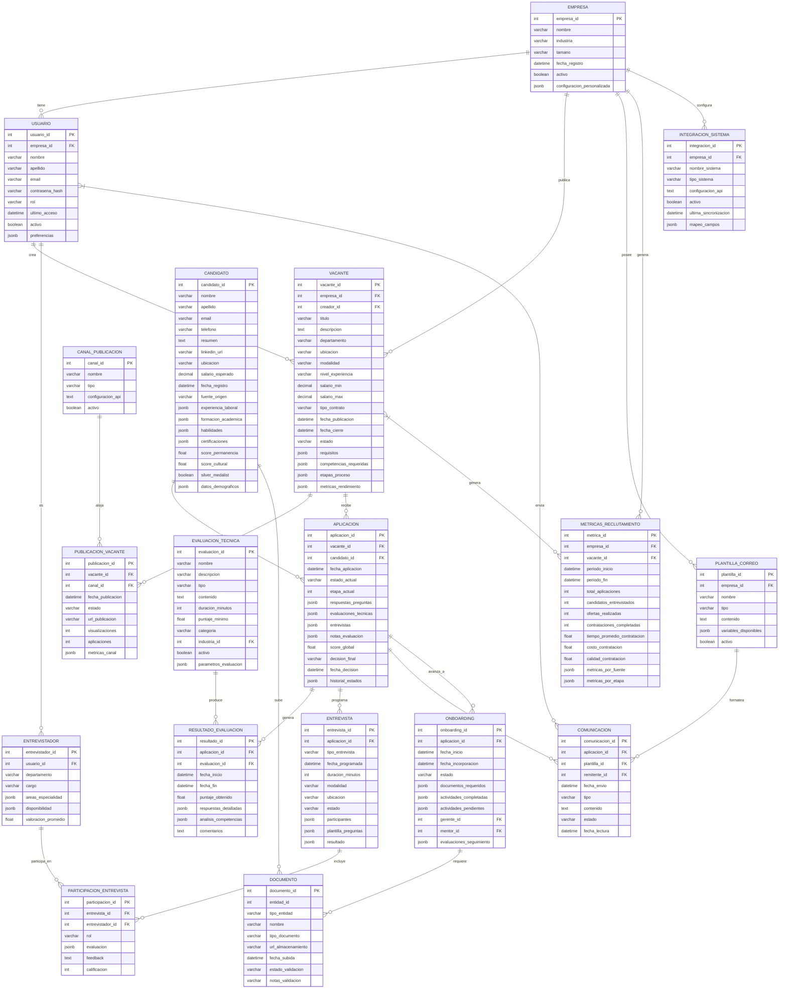
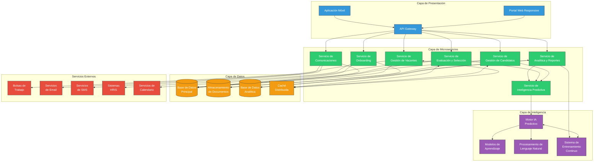
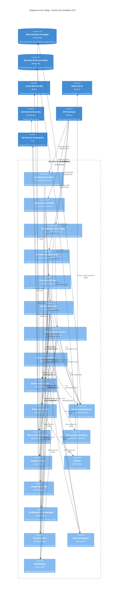

Claude 3.7 Sonnet | Style: Explanatory


> Eres un experto en producto, con experiencia en Sistemas de gestión de talento (Applicant Tracking System - ATS). ¿Qué funcionalidades básicas tiene un Applicant Tracking System?. Descríbemelas en un listado, ordenado de mayor a menor prioridad. 
```
Funcionalidades básicas de un Applicant Tracking System (ATS)
Como experto en sistemas de gestión de talento, puedo compartir las funcionalidades esenciales que debe tener un ATS efectivo, ordenadas de mayor a menor prioridad según su impacto en el proceso de reclutamiento:

1. Publicación y distribución de ofertas laborales: Capacidad para crear y publicar vacantes en múltiples canales (sitio web corporativo, portales de empleo, redes sociales) desde una única plataforma, facilitando mayor alcance y visibilidad de las ofertas.
2. Base de datos de candidatos centralizada: Almacenamiento organizado de perfiles, currículums y documentación de candidatos, con capacidades de búsqueda avanzada y filtrado para facilitar la consulta de información histórica y actual.
3. Seguimiento del proceso de selección: Visualización clara del estado de cada candidato a través de las diferentes etapas del proceso (aplicación recibida, revisión curricular, entrevistas, pruebas, oferta, contratación), permitiendo conocer el avance en tiempo real.
4. Evaluación y filtrado de candidatos: Herramientas para clasificar automáticamente los perfiles según requisitos predefinidos, implementar cuestionarios preliminares y filtrar candidatos mediante palabras clave o criterios específicos.
5. Comunicación con candidatos: Sistema integrado para enviar correos electrónicos, mensajes de texto o notificaciones automatizadas, mantener la comunicación durante el proceso y programar entrevistas o pruebas.
6. Gestión de entrevistas: Coordinación de agendas de entrevistadores, envío de invitaciones, recordatorios automáticos y registro de resultados de entrevistas con sistemas de calificación estructurados.
7. Colaboración entre reclutadores: Funcionalidades para compartir notas, evaluaciones y comentarios entre miembros del equipo de selección, facilitando la toma de decisiones colectiva sobre candidatos.
8. Informes y analíticas de reclutamiento: Generación de métricas y estadísticas sobre fuentes de reclutamiento efectivas, tiempos del proceso, tasas de conversión y otros indicadores relevantes para optimizar estrategias.
9. Integración con otras plataformas: Capacidad de conexión con sistemas de nómina, HRIS (Sistema de Información de Recursos Humanos), correo electrónico, calendarios y otras herramientas corporativas para mantener la consistencia de información.
10. Gestión de referencias y verificación de antecedentes: Automatización de solicitudes de referencias, seguimiento de verificaciones pendientes y almacenamiento seguro de resultados.
11. Portal de candidatos: Interfaz para que los aspirantes puedan actualizar su información, verificar el estado de sus aplicaciones y completar tareas pendientes del proceso de selección.
12. Onboarding inicial: Funcionalidades básicas para iniciar el proceso de incorporación una vez seleccionado el candidato, como envío de documentación preliminar o recopilación de datos necesarios para la contratación.
13. Optimización para dispositivos móviles: Acceso a funcionalidades principales desde teléfonos inteligentes y tabletas, tanto para reclutadores como para candidatos.
14. Personalización y marca empleadora: Opciones para adaptar la apariencia del sistema según la identidad corporativa, reforzando la imagen de marca en todas las interacciones con candidatos.
15. Cumplimiento normativo y protección de datos: Herramientas para garantizar el cumplimiento de legislaciones sobre protección de datos personales, no discriminación y otras regulaciones aplicables al reclutamiento.

¿Le gustaría profundizar en alguna de estas funcionalidades o conocer cómo se implementan en la práctica?
```
----

Claude 3.7 Sonnet | Style: Professional

> Con base en las funcionalidades descritas, dame una descripción breve de lo que hace un software ATS. Explora soluciones existentes en el mercado (tanto de paga como opensource), realiza una tabla comparativa y determina algunas características que las soluciones actuales no tienen implementadas, de tal manera que al implementarlas en un ATS, sean una ventaja competitiva respecto a las soluciones existentes.

```
# Sistemas de Gestión de Talento (ATS): Análisis de Mercado y Oportunidades

## Descripción General de un ATS

Un Applicant Tracking System (ATS) es una solución de software que automatiza y optimiza el proceso de reclutamiento y selección de personal. Funciona como una plataforma centralizada que permite a las organizaciones gestionar todo el ciclo de contratación: desde la publicación de vacantes, recepción y filtrado de candidaturas, hasta la selección final y preparación para la incorporación del nuevo empleado. El ATS elimina procesos manuales, reduce tiempos de contratación, mejora la calidad de los candidatos y proporciona datos analíticos para optimizar las estrategias de reclutamiento.

## Análisis Comparativo de Soluciones ATS en el Mercado

| Característica | Soluciones de Pago |  | | Soluciones Open Source | |
|----------------|-------------------|-------------------|-------------------|-------------------|-------------------|
|                | **Workday Recruiting** | **Greenhouse** | **SmartRecruiters** | **JobScore** | **OpenCATS** |
| **Precio** | Alto (Enterprise) | Medio-Alto | Medio | Versión gratuita limitada + planes de pago | Gratuito |
| **Publicación multisitio** | Excelente | Excelente | Excelente | Buena | Básica |
| **Base de datos de candidatos** | Avanzada | Avanzada | Avanzada | Intermedia | Básica |
| **Seguimiento del proceso** | Completo con workflows personalizables | Completo con estructura de etapas flexible | Completo con evaluación colaborativa | Intermedio | Básico |
| **IA para filtrado** | Avanzada | Intermedia | Avanzada | Limitada | No disponible |
| **Comunicación con candidatos** | Completa con automatizaciones | Completa con plantillas personalizables | Completa con engagement scoring | Básica | Limitada |
| **Analíticas y reportes** | Avanzados con predictivos | Avanzados | Avanzados | Básicos | Mínimos |
| **Integración con ecosistema** | Extensa (HRIS, nómina, evaluaciones) | Muy buena (+200 integraciones) | Muy buena (marketplace de apps) | Limitada | Mínima |
| **Experiencia móvil** | Completa | Completa | Completa | Parcial | No disponible |
| **Onboarding integrado** | Completo | Parcial | Completo | No disponible | No disponible |
| **Cumplimiento normativo** | Global avanzado (GDPR, CCPA) | Global | Global | Básico | Limitado |

## Oportunidades de Innovación: Ventajas Competitivas Potenciales

1. **Sistema de Inteligencia Predictiva de Permanencia**
   - Análisis avanzado que predice no solo el ajuste del candidato al puesto, sino también su probable permanencia en la empresa, basado en patrones históricos de retención y factores correlacionados con longevidad laboral.
   - Diferencial: Mientras las soluciones actuales se enfocan en encontrar al mejor candidato, pocas analizan factores de retención a largo plazo.

2. **Marketplace de Evaluación de Habilidades Técnicas Específicas por Industria**
   - Plataforma integrada con evaluaciones prácticas específicas por sector industrial que simulan entornos de trabajo reales.
   - Diferencial: Las evaluaciones actuales suelen ser genéricas o requieren integraciones complejas con terceros.

3. **Planificación Estratégica de Talento Basada en Proyecciones de Negocio**
   - Integración con sistemas de planificación empresarial para anticipar necesidades de contratación basadas en proyecciones de crecimiento, expansión geográfica o desarrollo de nuevos productos.
   - Diferencial: Transformar el ATS de herramienta reactiva a plataforma estratégica predictiva.

4. **Programa de Candidatos Silver Medalists**
   - Sistema automatizado para mantener relaciones con candidatos finalistas no seleccionados, nutriendo relaciones para futuras oportunidades mediante contenido personalizado y actualizaciones periódicas.
   - Diferencial: Las soluciones actuales generalmente "abandonan" a los candidatos no seleccionados.

5. **Análisis de Cultura Organizacional y Compatibilidad**
   - Evaluación científica de compatibilidad cultural mediante análisis lingüístico de comunicaciones del candidato, comportamientos durante el proceso y preferencias declaradas.
   - Diferencial: Va más allá de las evaluaciones de personalidad estándar, enfocándose en el ajuste específico con la cultura de la organización.

6. **Mitigación Avanzada de Sesgos con Auditoría IA**
   - Sistema que detecta y corrige proactivamente sesgos en todas las etapas del reclutamiento, desde la redacción de ofertas hasta las decisiones finales.
   - Diferencial: Mientras muchos sistemas tienen funciones básicas anti-sesgos, pocos implementan corrección activa y mejora continua.

7. **Ecosistema de Microformación Integrada**
   - Plataforma que identifica brechas específicas de habilidades en candidatos prometedores y ofrece microformación personalizada para cerrarlas durante el proceso de selección.
   - Diferencial: Transforma el ATS de sistema de filtrado a plataforma de desarrollo de talento desde la fase de candidatura.

8. **Sistema de Referidos mediante Análisis de Redes Profesionales**
   - Tecnología que analiza redes profesionales de empleados actuales para identificar candidatos pasivos de alto potencial, facilitando recomendaciones personalizadas.
   - Diferencial: Automatiza el proceso de referidos más allá de los sistemas básicos actuales, utilizando IA para encontrar coincidencias ideales.

```
----
> Crea un diagrama Lean Canvas  utilizando el diagrama más adecuado en formato  mermaid para entender el modelo de negocio

```

He creado un diagrama Lean Canvas utilizando Mermaid para visualizar el modelo de negocio de un ATS innovador con las ventajas competitivas identificadas. El Lean Canvas es particularmente adecuado para este propósito porque permite capturar de manera concisa los elementos clave del modelo de negocio en un formato visual estructurado.
El modelo de negocio propuesto se centra en transformar el concepto tradicional de ATS hacia una plataforma predictiva que no solo optimice los procesos de contratación sino que también mejore significativamente los resultados a largo plazo. Los elementos más destacados incluyen:
Problema y Solución: El diagrama aborda los problemas críticos del reclutamiento actual (alta rotación, procesos ineficientes) con soluciones innovadoras como el sistema de predicción de permanencia y la evaluación de compatibilidad cultural.
Propuesta de Valor: La propuesta central combina la reducción de rotación temprana y ciclos de contratación más cortos mediante evaluaciones específicas que garantizan tanto el ajuste técnico como cultural.
Ventaja Injusta: Los algoritmos propietarios de predicción de permanencia y la base de datos de patrones de éxito por industria constituyen defensas competitivas significativas difíciles de replicar.
Segmentos de Clientes: El enfoque principal está en empresas medianas en crecimiento y sectores con alta rotación, donde el impacto del sistema sería más valioso y medible.
Modelo de Ingresos: La estructura contempla una base de suscripción con complementos premium para funcionalidades avanzadas, creando un modelo escalable con múltiples fuentes de ingresos.
Este Lean Canvas proporciona una visión integral del potencial modelo de negocio, destacando cómo las innovaciones tecnológicas identificadas pueden traducirse en una propuesta comercial viable y diferenciada en el competitivo mercado de soluciones ATS.
¿Le gustaría profundizar en algún elemento específico del modelo de negocio o explorar aspectos adicionales como el plan de implementación o la estrategia de entrada al mercado?

```
----

> Describe los 3 casos de uso principales de un ATS y crea el diagrama asociado a cada uno de los casos de uso en formato mermaid.
```
Principales Casos de Uso de un ATS
He creado tres diagramas de secuencia en formato Mermaid que representan los casos de uso fundamentales de un Sistema de Gestión de Talento (ATS) innovador. A continuación, describo cada uno de estos casos de uso críticos y su relevancia para el proceso de reclutamiento.
Caso de Uso 1: Publicación y Gestión de Vacantes
Este caso de uso representa el punto de inicio del proceso de reclutamiento. El diagrama muestra la secuencia completa desde la creación de una vacante hasta su distribución multicanal y el monitoreo de su rendimiento.
Características principales:

Creación centralizada de la vacante con todos los detalles relevantes
Distribución automática a múltiples canales (bolsas de trabajo, redes sociales, sitio corporativo)
Ciclo de retroalimentación continua sobre el rendimiento de la publicación
Capacidad para realizar ajustes en tiempo real basados en métricas de desempeño

La eficiencia de este proceso es fundamental, ya que determina la calidad y cantidad del talento que ingresa al embudo de selección. El sistema automatiza la distribución multicanal, eliminando tareas manuales y garantizando consistencia en la comunicación de la marca empleadora.
Caso de Uso 2: Evaluación y Filtrado de Candidatos
Este caso de uso representa el núcleo del proceso de selección, donde se implementan las innovaciones más significativas propuestas para el sistema. El diagrama muestra el flujo completo desde la recepción de una aplicación hasta la decisión sobre el avance del candidato en el proceso.
Características principales:

Evaluación preliminar automatizada mediante inteligencia artificial
Análisis predictivo de permanencia y compatibilidad cultural
Gestión de evaluaciones técnicas específicas por puesto
Flujo de trabajo colaborativo entre reclutadores y gerentes contratantes
Programa Silver Medalists para candidatos no seleccionados con potencial futuro

Este caso de uso incorpora las ventajas competitivas más importantes del sistema propuesto: la predicción de permanencia, evaluación de compatibilidad cultural y evaluaciones técnicas específicas por industria, transformando el proceso de filtrado tradicional en un sistema inteligente de selección.
Caso de Uso 3: Onboarding e Integración con HRIS
Este caso de uso representa la transición crítica de candidato a empleado, fase que frecuentemente es subestimada en sistemas ATS tradicionales. El diagrama muestra el flujo desde la aceptación de la oferta hasta la completa integración en la organización.
Características principales:

Gestión automatizada de documentación y verificaciones legales
Integración fluida con sistemas de HRIS para transferencia de datos
Coordinación entre departamentos para la preparación de la incorporación
Programa estructurado de seguimiento durante los primeros 90 días
Generación de métricas de calidad de contratación para optimización continua

Este caso de uso cierra el ciclo completo de reclutamiento, implementando un puente efectivo entre la selección y la gestión del talento, lo que contribuye significativamente a mejorar las tasas de retención temprana y acortar el tiempo hasta la productividad óptima del nuevo empleado.
Estos tres casos de uso representan el ciclo vital completo dentro de un ATS innovador, desde la atracción del talento hasta su incorporación exitosa, destacando las ventajas competitivas propuestas que transforman un sistema transaccional en una plataforma estratégica para la gestión del capital humano.
```
----

> crea el modelo de datos base usando un diagrama Entidad Relación en formato mermaid que cubra entidades, atributos (nombre y tipo) y relaciones necesarios para la implementación de este sistema ATS

```


# Modelo de Datos para Sistema ATS Innovador

He diseñado un modelo de datos completo para el sistema ATS propuesto, utilizando un diagrama Entidad-Relación que captura todas las funcionalidades clave identificadas anteriormente y permite implementar las ventajas competitivas propuestas.

## Entidades Principales y Sus Propósitos

### Gestión Organizacional
- **EMPRESA**: Almacena información de la organización cliente y sus configuraciones específicas. Permite la personalización del sistema según industria y necesidades.
- **USUARIO**: Registra todos los usuarios del sistema con sus roles diferenciados (reclutadores, gerentes, administradores), controlando accesos y responsabilidades.

### Gestión de Vacantes
- **VACANTE**: Núcleo del proceso de publicación, contiene toda la información del puesto, incluyendo requisitos, competencias requeridas y configuración del flujo de selección.
- **CANAL_PUBLICACION**: Catálogo de plataformas donde distribuir las vacantes, con su configuración técnica asociada.
- **PUBLICACION_VACANTE**: Relación que documenta dónde se ha publicado cada vacante, facilitando el seguimiento de métricas por canal.

### Gestión de Candidatos
- **CANDIDATO**: Almacena el perfil completo de cada aspirante, incorporando los scores predictivos de permanencia y compatibilidad cultural.
- **APLICACION**: Registro del proceso específico de un candidato para una vacante, con su progreso a través de las diferentes etapas.
- **DOCUMENTO**: Gestiona todos los archivos asociados al proceso (CV, certificaciones, documentos legales).

### Evaluación y Selección
- **EVALUACION_TECNICA**: Catálogo de pruebas técnicas categorizadas por industria y competencias.
- **RESULTADO_EVALUACION**: Registra el desempeño del candidato en cada evaluación con análisis detallado de competencias.
- **ENTREVISTA**: Gestiona la programación y resultados de cada entrevista en el proceso.
- **ENTREVISTADOR**: Registra los colaboradores que participan en entrevistas con sus áreas de especialización.
- **PARTICIPACION_ENTREVISTA**: Documenta evaluaciones específicas de cada entrevistador para un candidato.

### Comunicación y Seguimiento
- **PLANTILLA_CORREO**: Repositorio de comunicaciones estandarizadas para cada etapa del proceso.
- **COMUNICACION**: Registro de todas las interacciones con el candidato durante el proceso.

### Onboarding e Integración
- **ONBOARDING**: Gestiona el proceso de incorporación desde la oferta aceptada hasta la plena integración del empleado.
- **INTEGRACION_SISTEMA**: Configura las conexiones con sistemas externos como HRIS y nómina.

### Analítica y Optimización
- **METRICAS_RECLUTAMIENTO**: Almacena indicadores de rendimiento para análisis y mejora continua.

## Características Innovadoras del Modelo

El diseño incorpora elementos específicos para soportar las ventajas competitivas propuestas:

1. **Sistema de Predicción de Permanencia**: Implementado mediante los campos `score_permanencia` y `score_cultural` en la entidad CANDIDATO, que almacenan los resultados del análisis predictivo.

2. **Programa Silver Medalists**: Mediante el campo `silver_medalist` en CANDIDATO, que identifica talento valioso para futuras oportunidades.

3. **Evaluaciones Específicas por Industria**: La entidad EVALUACION_TECNICA incluye clasificación por industria y categoría, permitiendo evaluaciones altamente específicas.

4. **Análisis de Compatibilidad Cultural**: Implementado mediante el análisis detallado en RESULTADO_EVALUACION y el cálculo de `score_cultural`.

5. **Microformación Integrada**: El modelo permite registrar brechas específicas en la entidad RESULTADO_EVALUACION y vincularlas con recursos formativos.

6. **Seguimiento Post-Contratación**: La entidad ONBOARDING incluye `evaluaciones_seguimiento` para monitorear la adaptación y rendimiento inicial.

## Consideraciones Técnicas

- El modelo utiliza tipos de datos optimizados para cada atributo.
- Se implementan campos JSON/JSONB para elementos que requieren flexibilidad y evolución sin modificar la estructura de la base de datos.
- Las relaciones están claramente definidas con cardinalidades apropiadas para mantener la integridad referencial.
- Se han incluido campos para auditoría (fechas de creación/modificación) y control de estado en las entidades principales.

Este modelo de datos proporciona la base sólida necesaria para implementar todas las funcionalidades descritas en los casos de uso, mientras mantiene la flexibilidad requerida para adaptarse a diferentes industrias y tamaños de organización.
```
----

> Explica el diseño del sistema a alto nivel y crea el diagrama apropiado en formato mermaid


```


# Diseño de Arquitectura del Sistema ATS Innovador

El sistema ATS propuesto sigue una arquitectura moderna de microservicios basada en la nube, diseñada para ofrecer escalabilidad, alta disponibilidad y capacidad de evolución continua. La arquitectura se ha estructurado en capas bien diferenciadas para facilitar el desarrollo, mantenimiento y escalado independiente de cada componente.

## Capa de Presentación

La interfaz de usuario del sistema se presenta a través de múltiples canales para satisfacer las necesidades de diferentes tipos de usuarios:

- **Portal Web Responsive**: Interfaz principal que se adapta a diferentes dispositivos y tamaños de pantalla, proporcionando acceso completo a todas las funcionalidades del sistema tanto para reclutadores como para gerentes contratantes.

- **Aplicación Móvil**: Versión optimizada para dispositivos móviles que permite a los reclutadores y gerentes gestionar procesos críticos en movimiento, como revisión de candidatos, programación de entrevistas y aprobaciones.

- **API Gateway**: Punto de entrada unificado para todas las solicitudes de los clientes, que gestiona la autenticación, autorización, limitación de velocidad y enrutamiento a los microservicios apropiados.

## Capa de Microservicios

El núcleo funcional del sistema se divide en servicios especializados y autónomos:

- **Servicio de Gestión de Vacantes**: Administra el ciclo de vida completo de las vacantes, incluyendo creación, publicación en múltiples canales, seguimiento de métricas y cierre.

- **Servicio de Gestión de Candidatos**: Gestiona los perfiles de candidatos, aplicaciones, y la base de datos de talento, incluyendo el programa Silver Medalists para candidatos valiosos no seleccionados.

- **Servicio de Evaluación y Selección**: Coordina los procesos de evaluación técnica, entrevistas y toma de decisiones, integrándose con el motor de IA para análisis predictivo.

- **Servicio de Comunicaciones**: Gestiona todas las interacciones con candidatos, incluyendo notificaciones, mensajes personalizados y seguimiento de respuestas.

- **Servicio de Onboarding**: Facilita la transición del candidato seleccionado a empleado, gestionando documentación, integraciones con HRIS y programas de incorporación personalizados.

- **Servicio de Analítica y Reportes**: Proporciona inteligencia de negocio mediante dashboards en tiempo real, informes personalizados y análisis predictivo de tendencias de contratación.

- **Servicio de Inteligencia Predictiva**: Coordina el acceso a los modelos de IA y ML, sirviendo como intermediario entre los servicios operativos y la capa de inteligencia.

## Capa de Datos

La persistencia y gestión de información se estructura en múltiples almacenes especializados:

- **Base de Datos Principal**: Almacenamiento relacional que mantiene la estructura de datos normalizada definida en el modelo entidad-relación, asegurando la integridad referencial.

- **Almacenamiento de Documentos**: Sistema especializado para gestionar archivos y documentos como currículums, certificaciones y contratos, con capacidades de búsqueda por contenido.

- **Base de Datos Analítica**: Almacén columnar optimizado para consultas analíticas complejas y procesamiento de grandes volúmenes de datos históricos.

- **Caché Distribuida**: Sistema de memoria distribuida para mejorar el rendimiento mediante el almacenamiento temporal de datos frecuentemente consultados.

## Capa de Inteligencia

El núcleo diferenciador del sistema que implementa las capacidades predictivas avanzadas:

- **Motor IA Predictivo**: Orquestador central que coordina el proceso de análisis predictivo, aplicando los modelos apropiados según el contexto.

- **Modelos de Aprendizaje**: Conjunto de algoritmos entrenados para predecir permanencia, compatibilidad cultural y éxito laboral, segmentados por industria y tipo de puesto.

- **Procesamiento de Lenguaje Natural**: Capacidades de análisis de texto para evaluación semántica de currículums, respuestas de candidatos y compatibilidad con descripciones de puesto.

- **Sistema de Entrenamiento Continuo**: Mecanismo de retroalimentación que utiliza los resultados reales para mejorar continuamente la precisión de los modelos predictivos.

## Integración con Servicios Externos

El sistema se conecta con múltiples plataformas externas para ampliar su funcionalidad:

- **Bolsas de Trabajo**: Integración bidireccional con portales de empleo para publicación automática de vacantes y recepción de aplicaciones.

- **Servicios de Email y SMS**: Canales de comunicación para notificaciones y mensajes a candidatos y partes interesadas internas.

- **Sistemas HRIS**: Integración con sistemas de información de recursos humanos para transferencia eficiente de datos de candidatos contratados.

- **Servicios de Calendario**: Sincronización con sistemas de agenda para coordinación de entrevistas y actividades de onboarding.

## Consideraciones de Implementación

La arquitectura propuesta adopta principios modernos de desarrollo de software:

- **Despliegue en Contenedores**: Cada microservicio se empaqueta como un contenedor independiente, facilitando el despliegue y la escalabilidad.

- **Orquestación con Kubernetes**: Gestión automatizada de contenedores para garantizar alta disponibilidad y recuperación ante fallos.

- **Enfoque DevOps**: Integración y despliegue continuos (CI/CD) para actualizaciones frecuentes y controladas del sistema.

- **Seguridad por Diseño**: Implementación de prácticas de seguridad en cada capa, incluyendo cifrado de datos en tránsito y en reposo, autenticación multifactor y auditoría completa.

Esta arquitectura proporciona la base técnica necesaria para implementar todas las ventajas competitivas identificadas, especialmente las capacidades predictivas avanzadas que diferencian al sistema en el mercado de soluciones ATS.

```
----

> Crea el conjunto de diagrama C4 para visualizar la arquitectura del sistema. Lo harás por separado, es decir, crea un diagrama para Context, otro para Containers de cada elemento del diagrama de Context, otro para Components de cada elemento del diagrama de Containers y otro para Code de cada elemento del diagrama de Components, utilizando el formato mermaid. De tal manera que lleguemos a profundidad de cada uno de los componentes del sistema.

**No terminó, la respuesta fue más extensa y quedó inconclusa. Tuve que iniciar un nuevo chat para continuar.**


---
> Estoy construyendo un sistema ATS descrito en el archivo LTI-NC.md. Crea el diagrama de C4 Code para los componentes del Servicio de Candidatos

``` 
A continuación presento el diagrama C4 de nivel de código para el Servicio de Candidatos del sistema ATS, basado en la arquitectura descrita en el documento.



## Explicación del Diagrama

El diagrama C4 de nivel de código muestra la estructura interna detallada del Servicio de Candidatos del sistema ATS, siguiendo la arquitectura propuesta en el documento. A continuación, se describe cada uno de los componentes clave:

### Controladores REST

- **CandidatoController**: Expone endpoints para la gestión de perfiles de candidatos, permitiendo crear, consultar, actualizar y eliminar información personal, experiencia y formación.
- **AplicacionController**: Maneja las aplicaciones de candidatos a vacantes específicas, gestionando todo el proceso desde la aplicación inicial hasta la decisión final.
- **SilverMedalistController**: Implementa la funcionalidad diferenciadora del programa de "Silver Medalists", que mantiene relaciones con candidatos finalistas no seleccionados.
- **DocumentosController**: Gestiona la subida, descarga y manipulación de documentos asociados a candidatos.

### Servicios de Negocio

- **CandidatoService**: Encapsula la lógica de negocio para la gestión de perfiles, incluyendo la implementación del scoring predictivo de permanencia y compatibilidad cultural.
- **AplicacionService**: Gestiona el flujo de trabajo de las aplicaciones, las evaluaciones técnicas y el avance de candidatos por las distintas etapas del proceso.
- **SilverMedalistService**: Implementa la estrategia de seguimiento de candidatos valiosos no seleccionados para futuras oportunidades.
- **DocumentosService**: Coordina el almacenamiento y recuperación de documentos en MongoDB.
- **NotificacionService**: Gestiona las comunicaciones con candidatos a través del servicio de integración.
- **PrediccionService**: Actúa como cliente para el motor de IA, solicitando análisis predictivos para candidatos.

### Repositorios de Datos

- **CandidatoRepository**: Acceso a datos relacionados con perfiles de candidatos en PostgreSQL.
- **AplicacionRepository**: Acceso a datos de aplicaciones y procesos de selección en PostgreSQL.
- **DocumentoRepository**: Acceso a documentos y archivos almacenados en MongoDB.

### Clientes para Servicios Externos

- **VacantesClient**: Cliente para el servicio de vacantes, permitiendo consultar detalles de puestos abiertos.
- **IAClient**: Cliente gRPC para comunicación con el motor de IA predictiva.
- **IntegrationClient**: Cliente para el servicio de integración, utilizado para comunicaciones externas.

### Componentes Transversales

- **CandidatosCacheManager**: Gestiona el caché de datos frecuentemente accedidos para mejorar el rendimiento.
- **SecurityFilter**: Implementa la autenticación y autorización para los endpoints del servicio.
- **ValidationAspect**: Proporciona validación de datos transversal mediante programación orientada a aspectos.
- **AuditAspect**: Registra auditorías de todas las operaciones críticas en el sistema.

Este diseño de componentes permite implementar las funcionalidades diferenciadoras clave del ATS propuesto, especialmente el sistema de predicción de permanencia, el análisis de compatibilidad cultural y el programa de Silver Medalists, siguiendo principios modernos de arquitectura de software como separación de responsabilidades, diseño por capas y microservicios.
```


