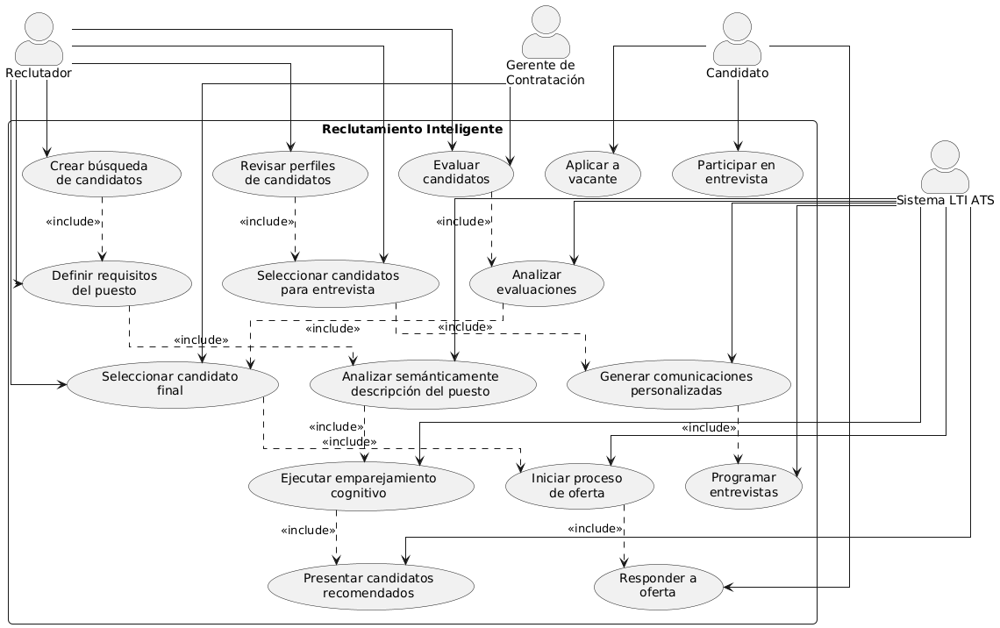
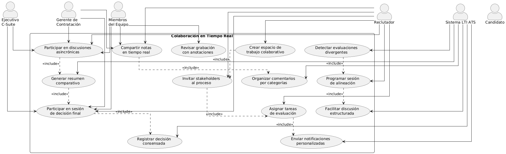
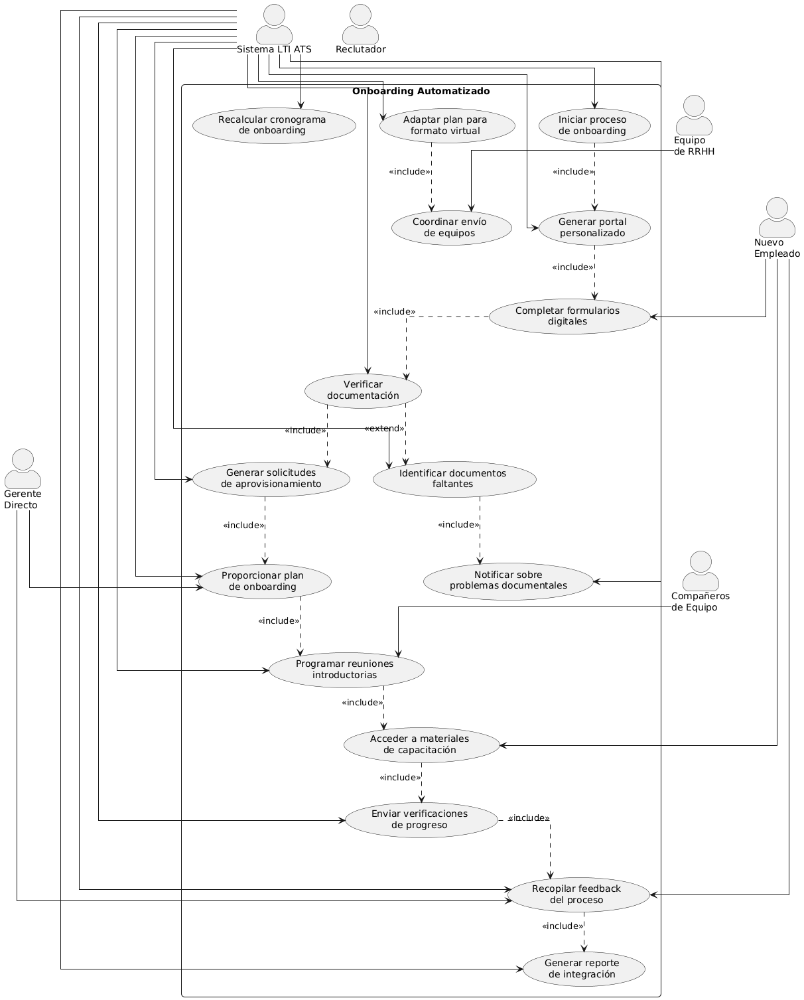
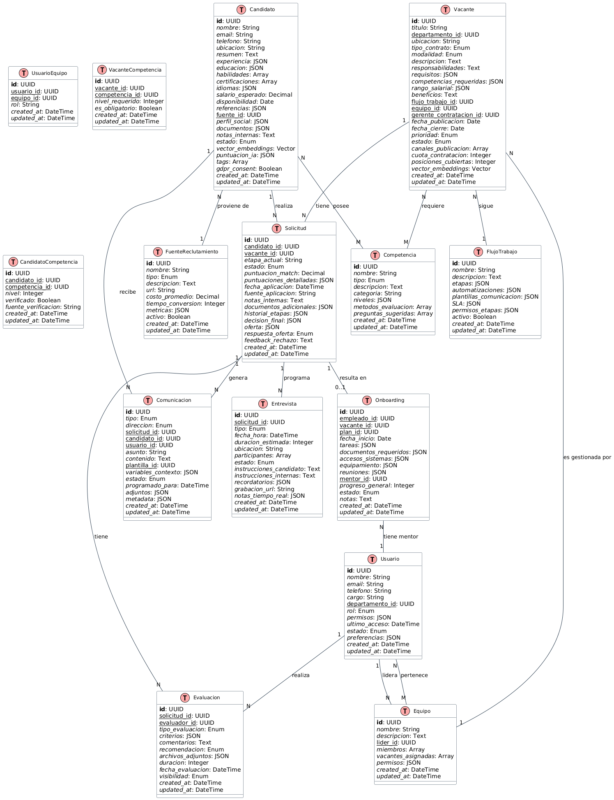
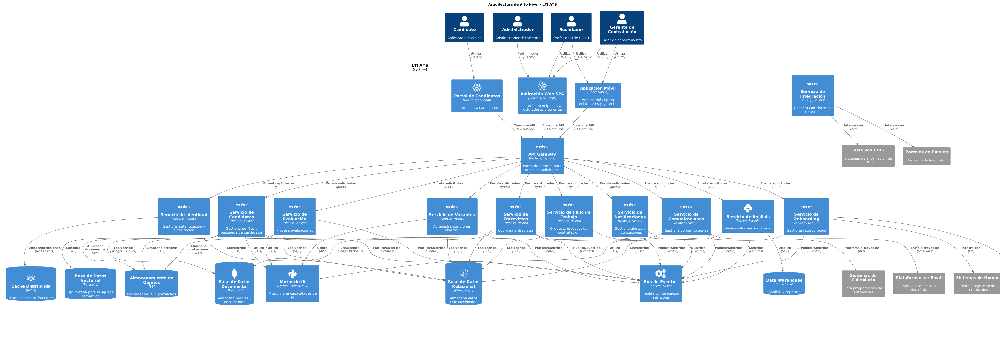
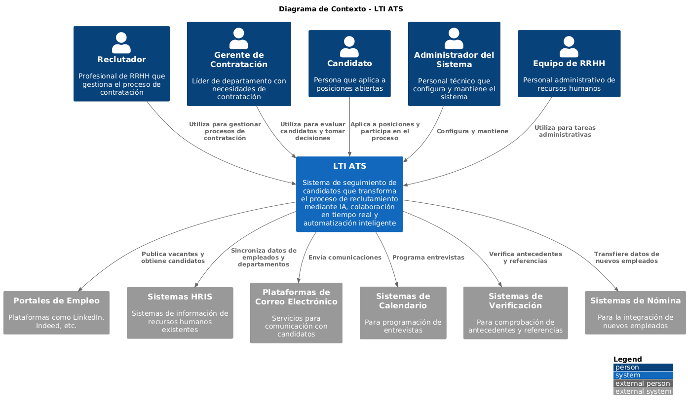
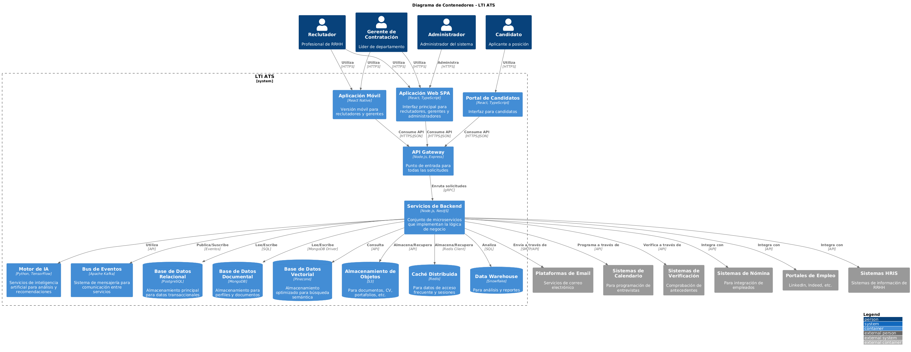
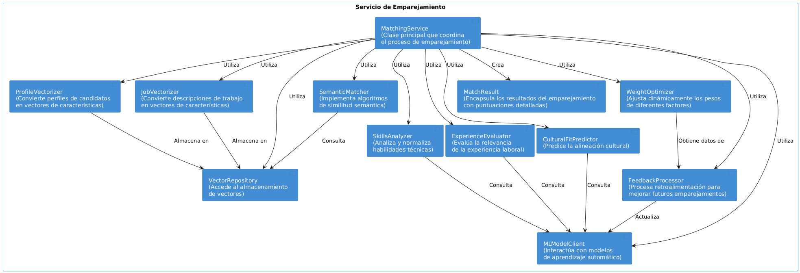

# LTI ATS: Sistema Revolucionario de Seguimiento de Candidatos

## Tabla de Contenidos
- [1. Concepto del Producto](#1-concepto-del-producto)
  - [1.1 Descripción del Software](#11-descripción-del-software)
  - [1.2 Propuesta de Valor Única](#12-propuesta-de-valor-única)
  - [1.3 Funcionalidades Principales](#13-funcionalidades-principales)
  - [1.4 Lean Canvas](#14-lean-canvas)
- [2. Análisis de Casos de Uso](#2-análisis-de-casos-de-uso)
  - [2.1 Caso de Uso 1: Reclutamiento Inteligente](#21-caso-de-uso-1-reclutamiento-inteligente)
  - [2.2 Caso de Uso 2: Colaboración en Tiempo Real](#22-caso-de-uso-2-colaboración-en-tiempo-real)
  - [2.3 Caso de Uso 3: Onboarding Automatizado](#23-caso-de-uso-3-onboarding-automatizado)
- [3. Modelo de Datos](#3-modelo-de-datos)
  - [3.1 Entidades Principales](#31-entidades-principales)
  - [3.2 Atributos de Entidades](#32-atributos-de-entidades)
  - [3.3 Relaciones entre Entidades](#33-relaciones-entre-entidades)
  - [3.4 Diagrama ERD](#34-diagrama-erd)
- [4. Arquitectura del Sistema](#4-arquitectura-del-sistema)
  - [4.1 Arquitectura de Alto Nivel](#41-arquitectura-de-alto-nivel)
  - [4.2 Justificación de Decisiones Arquitectónicas](#42-justificación-de-decisiones-arquitectónicas)
  - [4.3 Tecnologías Recomendadas](#43-tecnologías-recomendadas)
  - [4.4 Diagrama Arquitectónico](#44-diagrama-arquitectónico)
- [5. Diagrama C4](#5-diagrama-c4)
  - [5.1 Nivel 1: Diagrama de Contexto](#51-nivel-1-diagrama-de-contexto)
  - [5.2 Nivel 2: Diagrama de Contenedores](#52-nivel-2-diagrama-de-contenedores)
  - [5.3 Nivel 3: Diagrama de Componentes](#53-nivel-3-diagrama-de-componentes)
  - [5.4 Nivel 4: Diagrama de Código](#54-nivel-4-diagrama-de-código)

## 1. Concepto del Producto

### 1.1 Descripción del Software

LTI ATS es una plataforma de seguimiento de candidatos de próxima generación que transforma radicalmente el proceso de reclutamiento mediante la integración de inteligencia artificial avanzada, colaboración en tiempo real y automatización inteligente. A diferencia de los sistemas ATS tradicionales que funcionan como simples bases de datos, LTI ATS actúa como un asistente estratégico que potencia cada fase del ciclo de contratación, desde la atracción de talento hasta la incorporación.

La plataforma está diseñada para eliminar los cuellos de botella habituales en el reclutamiento, reduciendo significativamente el tiempo de contratación mientras mejora la calidad de las incorporaciones. Con una interfaz intuitiva y adaptable, LTI ATS permite a los equipos de RRHH y gerentes de contratación colaborar sin fricciones, tomar decisiones basadas en datos y crear experiencias excepcionales tanto para reclutadores como para candidatos.

### 1.2 Propuesta de Valor Única

LTI ATS se distingue en el mercado por su enfoque revolucionario en tres pilares fundamentales:

1. **IA Contextual y Predictiva**: A diferencia de los ATS tradicionales que utilizan simples coincidencias de palabras clave, LTI ATS emplea algoritmos de aprendizaje profundo que comprenden el contexto y la semántica de las habilidades y experiencias. El sistema no solo identifica candidatos adecuados para roles actuales, sino que predice su potencial de crecimiento y adaptabilidad a la cultura organizacional.

2. **Colaboración Omnicanal en Tiempo Real**: Mientras que los sistemas convencionales mantienen a los equipos de contratación en silos, LTI ATS integra herramientas de comunicación sincrónica y asincrónica directamente en el flujo de trabajo. Esto permite evaluaciones colaborativas instantáneas y reduce drásticamente los tiempos de respuesta en cada etapa del proceso.

3. **Experiencia Humanizada por Diseño**: LTI ATS rompe con la impersonalidad de los sistemas tradicionales al ofrecer interacciones personalizadas y transparentes para los candidatos. El sistema mantiene a los aplicantes informados en tiempo real, proporciona retroalimentación constructiva automatizada y crea un recorrido del candidato que refleja los valores de la organización.

### 1.3 Funcionalidades Principales

#### 1.3.1 Motor de Emparejamiento Cognitivo

El núcleo de LTI ATS es un motor de IA que va más allá del simple filtrado por palabras clave. Esta funcionalidad:

- Analiza semánticamente los currículos para comprender habilidades, experiencias y potencial
- Identifica candidatos que podrían no coincidir perfectamente en términos de palabras clave pero poseen capacidades transferibles relevantes
- Aprende continuamente de las decisiones de contratación para mejorar sus recomendaciones
- Elimina sesgos inconscientes mediante técnicas de IA ética y auditable
- Proporciona puntuaciones de compatibilidad multidimensionales (habilidades técnicas, habilidades blandas, alineación cultural)

#### 1.3.2 Espacio de Trabajo Colaborativo Integrado

Una plataforma unificada donde todos los interesados en la contratación pueden:

- Participar en evaluaciones sincrónicas o asincrónicas de candidatos
- Utilizar anotaciones de video/audio en entrevistas grabadas
- Compartir impresiones y evaluaciones en tiempo real durante entrevistas en vivo
- Mantener conversaciones contextuales vinculadas a perfiles específicos
- Acceder a paneles de decisión con métricas comparativas entre candidatos
- Recibir notificaciones inteligentes basadas en prioridades y plazos

#### 1.3.3 Automatización de Flujos de Trabajo Adaptativos

Un sistema que automatiza procesos repetitivos pero se adapta a las necesidades específicas:

- Crea flujos de trabajo personalizados para diferentes departamentos y roles
- Automatiza la programación de entrevistas con reconocimiento de disponibilidad
- Genera comunicaciones personalizadas en cada etapa del proceso
- Adapta dinámicamente los requisitos de evaluación según el perfil del candidato
- Proporciona recomendaciones procesables para mejorar la eficiencia del proceso
- Integra verificación de antecedentes y referencias de forma fluida

#### 1.3.4 Análisis Predictivo y Cuadros de Mando

Una suite completa de herramientas analíticas que:

- Predice tiempos de contratación y tasas de conversión por canal de reclutamiento
- Identifica cuellos de botella en el proceso de contratación en tiempo real
- Proporciona análisis comparativo con benchmarks de la industria
- Ofrece insights sobre la diversidad e inclusión en el proceso de contratación
- Calcula el ROI de diferentes estrategias de reclutamiento
- Genera informes personalizados para diferentes stakeholders

#### 1.3.5 Plataforma de Experiencia del Candidato

Un portal centrado en el candidato que:

- Ofrece un proceso de aplicación simplificado y adaptable a dispositivos móviles
- Proporciona actualizaciones automáticas sobre el estado de la aplicación
- Facilita la programación de entrevistas según la disponibilidad del candidato
- Ofrece preparación personalizada para cada etapa del proceso
- Recopila feedback estructurado de los candidatos para mejorar el proceso
- Mantiene relaciones con candidatos no seleccionados para futuras oportunidades

### 1.4 Lean Canvas

| **Problema** | **Solución** | **Propuesta de Valor Única** | **Ventaja Injusta** | **Segmentos de Cliente** |
|--------------|--------------|------------------------------|---------------------|--------------------------|
| 1. Procesos de reclutamiento lentos e ineficientes | 1. Motor de IA para emparejamiento cognitivo | Plataforma de reclutamiento impulsada por IA que transforma la contratación de un proceso transaccional a una experiencia estratégica, reduciendo el tiempo de contratación en un 60% mientras mejora la calidad y retención de talento. | Algoritmos de IA propietarios con capacidad de aprendizaje contextual y comprensión semántica avanzada | **Primario**:  - Empresas medianas (100-1000 empleados) en crecimiento - Sectores tecnológicos y de servicios profesionales |
| 2. Pérdida de candidatos de calidad por falta de comunicación | 2. Colaboración en tiempo real entre stakeholders | | | **Secundario**:  - Grandes empresas (1000+ empleados) - Agencias de reclutamiento especializado |
| 3. Evaluación superficial basada solo en palabras clave | 3. Experiencia del candidato humanizada y transparente | | | |
| 4. Silos de información entre equipos de contratación | 4. Análisis predictivo para optimización continua | | | |
| **Métricas Clave** | | | | **Canales** |
| - Tiempo de contratación - Calidad de contrataciones (retención a 1 año) - Tasa de conversión de candidatos - NPS de candidatos - Adopción por reclutadores | | | | - Ventas directa consultiva - Asociaciones con consultoras de RRHH - Marketing de contenidos especializado - Demostraciones virtuales personalizadas - Programa de referidos |
| **Estructura de Costos** | | | | **Fuentes de Ingresos** |
| - Desarrollo y mantenimiento de plataforma - Infraestructura cloud y procesamiento de IA - Equipo de ventas y customer success - Marketing y adquisición de clientes - Soporte técnico y capacitación | | | | - Suscripción base por organización - Tarifa por usuario/reclutador - Módulos premium (análisis avanzado, integraciones) - Servicios de implementación y personalización - API para desarrolladores (marketplace) |

## 2. Análisis de Casos de Uso

### 2.1 Caso de Uso 1: Reclutamiento Inteligente

#### Descripción Narrativa

El caso de uso "Reclutamiento Inteligente" representa el proceso central mediante el cual el sistema LTI ATS utiliza inteligencia artificial para transformar la manera en que los reclutadores identifican, evalúan y seleccionan candidatos para posiciones abiertas. Este proceso elimina las limitaciones de los sistemas tradicionales basados en palabras clave, permitiendo un enfoque más holístico y preciso para encontrar el talento adecuado.

#### Actores Involucrados

- **Reclutador**: Profesional de RRHH responsable de gestionar el proceso de contratación.
- **Gerente de Contratación**: Líder del departamento con la vacante que necesita ser cubierta.
- **Candidato**: Persona que aplica o es considerada para la posición.
- **Sistema LTI ATS**: Plataforma que ejecuta los algoritmos de IA y gestiona el proceso.

#### Precondiciones

1. El reclutador ha creado una descripción de puesto en el sistema.
2. El sistema tiene acceso a la base de datos de candidatos (internos y externos).
3. Los perfiles de los candidatos contienen información suficiente para el análisis.
4. Los parámetros de búsqueda y criterios de evaluación han sido configurados.

#### Flujo Principal

1. El reclutador inicia el proceso creando una nueva búsqueda para una posición específica.
2. El reclutador ingresa los requisitos esenciales y deseables para el puesto.
3. El sistema analiza semánticamente la descripción del puesto para identificar habilidades, competencias y requisitos implícitos.
4. El sistema ejecuta el algoritmo de emparejamiento cognitivo contra la base de datos de candidatos.
5. El sistema presenta una lista priorizada de candidatos con puntuaciones multidimensionales (habilidades técnicas, habilidades blandas, alineación cultural).
6. El reclutador revisa los perfiles recomendados y selecciona candidatos para la siguiente fase.
7. El sistema genera automáticamente comunicaciones personalizadas para los candidatos seleccionados.
8. El sistema programa entrevistas basadas en la disponibilidad del reclutador, gerente y candidatos.
9. Después de las entrevistas, el reclutador y gerente ingresan evaluaciones en el sistema.
10. El sistema analiza las evaluaciones y proporciona recomendaciones para la decisión final.
11. El reclutador selecciona al candidato final y el sistema inicia el proceso de oferta.

#### Flujos Alternativos

**A. No se encuentran candidatos adecuados en la base de datos interna:**
1. El sistema sugiere modificar los criterios de búsqueda o ampliar el alcance.
2. El sistema recomienda canales externos específicos para publicar la vacante.
3. El sistema monitorea continuamente nuevas aplicaciones y notifica cuando aparecen candidatos relevantes.

**B. El candidato rechaza la oferta:**
1. El sistema registra el rechazo y solicita retroalimentación al candidato.
2. El sistema analiza la retroalimentación para mejorar futuras ofertas.
3. El sistema propone automáticamente al siguiente candidato mejor calificado.
4. El reclutador decide si proceder con el candidato alternativo o reiniciar el proceso.

**C. Necesidad de búsqueda proactiva de candidatos pasivos:**
1. El reclutador activa el modo de "sourcing proactivo".
2. El sistema utiliza IA para identificar candidatos potenciales en plataformas externas.
3. El sistema genera mensajes de acercamiento personalizados para cada candidato.
4. El sistema programa seguimiento automático para candidatos que muestran interés.

#### Postcondiciones

1. La posición es cubierta con un candidato que cumple o supera los requisitos.
2. El sistema actualiza su base de conocimiento con los resultados del proceso.
3. El sistema genera métricas sobre la efectividad del proceso de reclutamiento.
4. Los candidatos no seleccionados son categorizados para futuras oportunidades.
5. El sistema proporciona recomendaciones para mejorar futuros procesos similares.

#### Diagrama UML de Caso de Uso

### 2.2 Caso de Uso 2: Colaboración en Tiempo Real

#### Descripción Narrativa

El caso de uso "Colaboración en Tiempo Real" describe cómo LTI ATS facilita la comunicación y toma de decisiones sincrónica y asincrónica entre todos los stakeholders involucrados en el proceso de contratación. Este enfoque elimina los silos de información y los retrasos en la comunicación que típicamente obstaculizan los procesos de reclutamiento tradicionales.

#### Actores Involucrados

- **Reclutador**: Profesional de RRHH que coordina el proceso de contratación.
- **Gerente de Contratación**: Líder del departamento con la necesidad de contratación.
- **Miembros del Equipo**: Colegas que participan en el proceso de evaluación.
- **Ejecutivo de C-Suite**: Directivos que aprueban contrataciones estratégicas.
- **Candidato**: Persona que está siendo evaluada para la posición.

#### Precondiciones

1. Existe un proceso de contratación activo en el sistema.
2. Los diferentes stakeholders tienen acceso al sistema con roles y permisos apropiados.
3. El flujo de trabajo de evaluación ha sido configurado para la posición específica.
4. Los candidatos han sido preseleccionados para la fase de evaluación colaborativa.

#### Flujo Principal

1. El reclutador crea un espacio de trabajo colaborativo para una posición específica.
2. El sistema envía invitaciones automáticas a todos los stakeholders relevantes.
3. El reclutador asigna tareas específicas de evaluación a cada participante.
4. Los stakeholders reciben notificaciones personalizadas según su rol y responsabilidad.
5. Durante una entrevista en vivo, múltiples evaluadores pueden compartir notas en tiempo real.
6. El sistema captura y organiza automáticamente los comentarios por categorías predefinidas.
7. Los evaluadores que no pudieron asistir a la entrevista en vivo revisan la grabación con anotaciones.
8. El sistema facilita discusiones asincrónicas sobre candidatos específicos.
9. El sistema agrega evaluaciones individuales y genera un resumen comparativo.
10. Los stakeholders participan en una sesión de decisión final con toda la información centralizada.
11. El sistema registra la decisión consensuada y notifica a todos los participantes.

#### Flujos Alternativos

**A. Desacuerdo entre evaluadores:**
1. El sistema detecta evaluaciones significativamente divergentes.
2. El sistema sugiere áreas específicas para discusión adicional.
3. El reclutador programa una sesión de alineación entre los evaluadores en desacuerdo.
4. El sistema facilita la discusión estructurada hasta alcanzar consenso.

**B. Necesidad de evaluación adicional:**
1. Durante la revisión colaborativa, se identifica la necesidad de evaluar competencias adicionales.
2. El reclutador crea una nueva ronda de evaluación con criterios específicos.
3. El sistema notifica al candidato y a los nuevos evaluadores asignados.
4. Los resultados de la evaluación adicional se integran al perfil consolidado del candidato.

**C. Participante no disponible en momento crítico:**
1. El sistema detecta que un stakeholder clave no ha completado su evaluación.
2. El sistema envía recordatorios escalonados según la urgencia.
3. Si persiste la no disponibilidad, el sistema sugiere evaluadores alternativos.
4. El reclutador decide si esperar o proceder con evaluaciones parciales.

#### Postcondiciones

1. Todos los stakeholders han contribuido a la evaluación del candidato.
2. Existe un registro completo y transparente del proceso de toma de decisiones.
3. La decisión final está documentada con justificaciones claras.
4. El sistema ha aprendido de las interacciones para mejorar futuras colaboraciones.
5. Los candidatos reciben comunicación oportuna sobre los resultados.

#### Diagrama UML de Caso de Uso

### 2.3 Caso de Uso 3: Onboarding Automatizado

#### Descripción Narrativa

El caso de uso "Onboarding Automatizado" describe cómo LTI ATS extiende su valor más allá del proceso de selección, facilitando una transición fluida del candidato seleccionado a empleado productivo. Este proceso integra la información recopilada durante la selección para personalizar la experiencia de incorporación, automatizar tareas administrativas y acelerar el tiempo hasta la productividad.

#### Actores Involucrados

- **Nuevo Empleado**: Candidato seleccionado que ha aceptado la oferta.
- **Reclutador**: Profesional de RRHH que facilita la transición.
- **Gerente Directo**: Supervisor responsable del nuevo empleado.
- **Equipo de RRHH**: Personal encargado de procesos administrativos.
- **Compañeros de Equipo**: Colegas que participan en la integración del nuevo miembro.

#### Precondiciones

1. El candidato ha aceptado la oferta de trabajo.
2. El perfil del candidato contiene información completa en el sistema.
3. Existe un plan de onboarding configurable para el rol específico.
4. Los sistemas de RRHH y TI están integrados con LTI ATS.

#### Flujo Principal

1. El sistema inicia automáticamente el proceso de onboarding cuando el candidato acepta la oferta.
2. El sistema genera un portal personalizado de onboarding para el nuevo empleado.
3. El nuevo empleado recibe credenciales de acceso y completa formularios digitales pre-llenados.
4. El sistema verifica automáticamente la documentación y solicita correcciones si es necesario.
5. El sistema genera solicitudes de aprovisionamiento para equipos, accesos y recursos.
6. El gerente recibe un plan de onboarding sugerido basado en el perfil del empleado.
7. El sistema programa reuniones introductorias con stakeholders clave.
8. El nuevo empleado accede a materiales de capacitación personalizados según su experiencia previa.
9. El sistema envía verificaciones periódicas de progreso al empleado y al gerente.
10. El sistema recopila feedback del empleado sobre el proceso de onboarding.
11. Al finalizar el período de onboarding, el sistema genera un reporte de integración.

#### Flujos Alternativos

**A. Documentación incompleta o incorrecta:**
1. El sistema identifica documentos faltantes o con errores.
2. El sistema notifica al nuevo empleado con instrucciones específicas.
3. El equipo de RRHH recibe alertas sobre problemas persistentes.
4. El sistema prioriza tareas que pueden avanzar mientras se resuelven los problemas documentales.

**B. Necesidad de onboarding remoto:**
1. El sistema detecta que el empleado trabajará remotamente.
2. El plan de onboarding se adapta automáticamente para un formato virtual.
3. El sistema coordina el envío de equipos a la ubicación del empleado.
4. Se programan sesiones virtuales adicionales para compensar la falta de interacción presencial.

**C. Cambios en la fecha de inicio:**
1. Se registra un cambio en la fecha de inicio del empleado.
2. El sistema recalcula automáticamente todo el cronograma de onboarding.
3. Todos los stakeholders reciben notificaciones sobre las nuevas fechas.
4. El sistema ajusta la disponibilidad de recursos según el nuevo cronograma.

#### Postcondiciones

1. El nuevo empleado ha completado todos los requisitos administrativos.
2. El empleado tiene acceso a todos los sistemas y recursos necesarios.
3. El empleado ha sido introducido a los miembros clave del equipo y la organización.
4. El gerente tiene visibilidad sobre el progreso de integración del empleado.
5. El sistema ha recopilado datos para optimizar futuros procesos de onboarding.

#### Diagrama UML de Caso de Uso

## 3. Modelo de Datos

### 3.1 Entidades Principales

El modelo de datos de LTI ATS está diseñado para soportar todas las funcionalidades del sistema mientras mantiene la flexibilidad necesaria para adaptarse a diferentes industrias y procesos de contratación. A continuación se presentan las entidades principales del sistema:

#### 1. Usuario

Representa a cualquier persona que interactúa con el sistema, incluyendo reclutadores, gerentes de contratación, miembros del equipo y administradores.

#### 2. Candidato

Almacena información detallada sobre las personas que aplican o son consideradas para posiciones dentro de la organización.

#### 3. Vacante

Contiene información sobre posiciones abiertas, incluyendo requisitos, responsabilidades y detalles del departamento.

#### 4. Solicitud

Representa la conexión entre un Candidato y una Vacante, registrando el estado y progreso del candidato en el proceso.

#### 5. Evaluación

Almacena las valoraciones y comentarios realizados por los evaluadores sobre los candidatos.

#### 6. Entrevista

Contiene información sobre sesiones de evaluación programadas, incluyendo tipo, participantes y resultados.

#### 7. Competencia

Define habilidades, conocimientos y atributos que pueden ser requeridos para vacantes o poseídos por candidatos.

#### 8. Flujo de Trabajo

Configura las etapas y reglas para diferentes tipos de procesos de contratación.

#### 9. Comunicación

Registra todas las interacciones con candidatos, incluyendo correos electrónicos, mensajes y llamadas.

#### 10. Onboarding

Gestiona el proceso de incorporación de nuevos empleados, incluyendo tareas, documentos y progreso.

#### 11. Fuente de Reclutamiento

Identifica los canales a través de los cuales los candidatos son descubiertos o atraídos.

#### 12. Equipo

Agrupa usuarios que colaboran en procesos de contratación específicos.

### 3.2 Atributos de Entidades

A continuación se detallan los atributos principales para cada entidad del sistema:

#### Usuario
- **id** (UUID): Identificador único del usuario
- **nombre** (String): Nombre completo
- **email** (String): Correo electrónico corporativo
- **telefono** (String): Número de contacto
- **cargo** (String): Posición en la empresa
- **departamento_id** (UUID): Departamento al que pertenece
- **rol** (Enum): Rol en el sistema (Administrador, Reclutador, Gerente, Miembro)
- **permisos** (JSON): Permisos específicos asignados
- **ultimo_acceso** (DateTime): Última vez que accedió al sistema
- **estado** (Enum): Activo, Inactivo, Suspendido
- **preferencias** (JSON): Configuraciones personalizadas
- **created_at** (DateTime): Fecha de creación
- **updated_at** (DateTime): Fecha de última actualización

#### Candidato
- **id** (UUID): Identificador único del candidato
- **nombre** (String): Nombre completo
- **email** (String): Correo electrónico principal
- **telefono** (String): Número de contacto principal
- **ubicacion** (String): Ubicación geográfica
- **resumen** (Text): Resumen profesional
- **experiencia** (JSON): Historial laboral detallado
- **educacion** (JSON): Formación académica
- **habilidades** (Array): Lista de habilidades y niveles
- **certificaciones** (Array): Certificaciones obtenidas
- **idiomas** (JSON): Idiomas y niveles de dominio
- **salario_esperado** (Decimal): Expectativa salarial
- **disponibilidad** (Date): Fecha de disponibilidad para comenzar
- **referencias** (JSON): Referencias profesionales
- **fuente_id** (UUID): Fuente de reclutamiento
- **perfil_social** (JSON): Enlaces a perfiles en redes profesionales
- **documentos** (JSON): Referencias a CV, portafolio, etc.
- **notas_internas** (Text): Observaciones privadas
- **estado** (Enum): Activo, Inactivo, En Blacklist
- **vector_embeddings** (Vector): Representación vectorial para búsqueda semántica
- **puntuacion_ia** (JSON): Evaluaciones automáticas por IA
- **tags** (Array): Etiquetas para categorización
- **gdpr_consent** (Boolean): Consentimiento para procesamiento de datos
- **created_at** (DateTime): Fecha de creación
- **updated_at** (DateTime): Fecha de última actualización

#### Vacante
- **id** (UUID): Identificador único de la vacante
- **titulo** (String): Título del puesto
- **departamento_id** (UUID): Departamento solicitante
- **ubicacion** (String): Ubicación del puesto
- **tipo_contrato** (Enum): Tiempo completo, Parcial, Temporal, etc.
- **modalidad** (Enum): Presencial, Remoto, Híbrido
- **descripcion** (Text): Descripción detallada
- **responsabilidades** (Text): Responsabilidades principales
- **requisitos** (JSON): Requisitos obligatorios y deseables
- **competencias_requeridas** (JSON): Competencias con niveles mínimos
- **rango_salarial** (JSON): Mínimo y máximo ofrecido
- **beneficios** (Text): Beneficios adicionales
- **flujo_trabajo_id** (UUID): Flujo de trabajo asignado
- **equipo_id** (UUID): Equipo de contratación
- **gerente_contratacion_id** (UUID): Gerente responsable
- **fecha_publicacion** (Date): Fecha de publicación
- **fecha_cierre** (Date): Fecha límite de aplicación
- **prioridad** (Enum): Alta, Media, Baja
- **estado** (Enum): Borrador, Publicada, En Proceso, Cerrada, Cancelada
- **canales_publicacion** (Array): Canales donde se publica
- **cuota_contratacion** (Integer): Número de posiciones a cubrir
- **posiciones_cubiertas** (Integer): Posiciones ya cubiertas
- **vector_embeddings** (Vector): Representación vectorial para emparejamiento
- **created_at** (DateTime): Fecha de creación
- **updated_at** (DateTime): Fecha de última actualización

#### Solicitud
- **id** (UUID): Identificador único de la solicitud
- **candidato_id** (UUID): Referencia al candidato
- **vacante_id** (UUID): Referencia a la vacante
- **etapa_actual** (String): Etapa actual en el proceso
- **estado** (Enum): En Proceso, Aprobada, Rechazada, En Espera
- **puntuacion_match** (Decimal): Puntuación de compatibilidad (0-100)
- **puntuaciones_detalladas** (JSON): Desglose por categorías
- **fecha_aplicacion** (DateTime): Fecha de aplicación
- **fuente_aplicacion** (String): Cómo aplicó el candidato
- **notas_internas** (Text): Notas privadas sobre la solicitud
- **documentos_adicionales** (JSON): Documentos específicos para esta solicitud
- **historial_etapas** (JSON): Registro de cambios de etapa con timestamps
- **decision_final** (JSON): Decisión final con justificación
- **oferta** (JSON): Detalles de la oferta si fue realizada
- **respuesta_oferta** (Enum): Aceptada, Rechazada, En Consideración
- **feedback_rechazo** (Text): Razón si el candidato rechazó
- **created_at** (DateTime): Fecha de creación
- **updated_at** (DateTime): Fecha de última actualización

#### Evaluación
- **id** (UUID): Identificador único de la evaluación
- **solicitud_id** (UUID): Referencia a la solicitud
- **evaluador_id** (UUID): Usuario que realiza la evaluación
- **tipo_evaluacion** (Enum): Entrevista, Prueba Técnica, Assessment, etc.
- **criterios** (JSON): Criterios evaluados con puntuaciones
- **comentarios** (Text): Comentarios generales
- **recomendacion** (Enum): Avanzar, Rechazar, Considerar
- **archivos_adjuntos** (JSON): Referencias a archivos relacionados
- **duracion** (Integer): Duración en minutos
- **fecha_evaluacion** (DateTime): Cuándo se realizó
- **visibilidad** (Enum): Pública, Equipo, Privada
- **created_at** (DateTime): Fecha de creación
- **updated_at** (DateTime): Fecha de última actualización

#### Entrevista
- **id** (UUID): Identificador único de la entrevista
- **solicitud_id** (UUID): Referencia a la solicitud
- **tipo** (Enum): Telefónica, Video, Presencial, Técnica, etc.
- **fecha_hora** (DateTime): Fecha y hora programada
- **duracion_estimada** (Integer): Duración estimada en minutos
- **ubicacion** (String): Lugar físico o enlace virtual
- **participantes** (Array): IDs de usuarios participantes
- **estado** (Enum): Programada, Completada, Cancelada, Reprogramada
- **instrucciones_candidato** (Text): Instrucciones enviadas al candidato
- **instrucciones_internas** (Text): Guía para entrevistadores
- **recordatorios** (JSON): Configuración de recordatorios
- **grabacion_url** (String): Enlace a grabación si existe
- **notas_tiempo_real** (JSON): Notas tomadas durante la entrevista
- **created_at** (DateTime): Fecha de creación
- **updated_at** (DateTime): Fecha de última actualización

#### Competencia
- **id** (UUID): Identificador único de la competencia
- **nombre** (String): Nombre de la competencia
- **tipo** (Enum): Técnica, Blanda, Conocimiento, Certificación
- **descripcion** (Text): Descripción detallada
- **categoria** (String): Categoría para agrupación
- **niveles** (JSON): Definición de niveles (1-5)
- **metodos_evaluacion** (Array): Métodos recomendados para evaluar
- **preguntas_sugeridas** (Array): Preguntas para evaluar esta competencia
- **created_at** (DateTime): Fecha de creación
- **updated_at** (DateTime): Fecha de última actualización

#### Flujo de Trabajo
- **id** (UUID): Identificador único del flujo
- **nombre** (String): Nombre descriptivo
- **descripcion** (Text): Descripción del propósito
- **etapas** (JSON): Definición de etapas y transiciones
- **automatizaciones** (JSON): Reglas de automatización
- **plantillas_comunicacion** (JSON): Plantillas asociadas a etapas
- **SLA** (JSON): Tiempos objetivo para cada etapa
- **permisos_etapas** (JSON): Roles que pueden gestionar cada etapa
- **activo** (Boolean): Si está activo para uso
- **created_at** (DateTime): Fecha de creación
- **updated_at** (DateTime): Fecha de última actualización

#### Comunicación
- **id** (UUID): Identificador único de la comunicación
- **tipo** (Enum): Email, SMS, Llamada, Mensaje interno
- **direccion** (Enum): Entrante, Saliente
- **solicitud_id** (UUID): Referencia a la solicitud relacionada
- **candidato_id** (UUID): Referencia al candidato
- **usuario_id** (UUID): Usuario que envía o recibe
- **asunto** (String): Asunto del mensaje
- **contenido** (Text): Contenido del mensaje
- **plantilla_id** (UUID): Plantilla utilizada si aplica
- **variables_contexto** (JSON): Variables utilizadas en la plantilla
- **estado** (Enum): Enviado, Entregado, Leído, Fallido
- **programado_para** (DateTime): Si está programado a futuro
- **adjuntos** (JSON): Referencias a archivos adjuntos
- **metadata** (JSON): Datos adicionales (IP, dispositivo, etc.)
- **created_at** (DateTime): Fecha de creación
- **updated_at** (DateTime): Fecha de última actualización

#### Onboarding
- **id** (UUID): Identificador único del proceso
- **empleado_id** (UUID): Referencia al candidato contratado
- **vacante_id** (UUID): Vacante cubierta
- **plan_id** (UUID): Referencia al plan de onboarding
- **fecha_inicio** (Date): Fecha de inicio laboral
- **tareas** (JSON): Lista de tareas con estados
- **documentos_requeridos** (JSON): Documentos con estados
- **accesos_sistemas** (JSON): Sistemas y permisos a provisionar
- **equipamiento** (JSON): Equipos a asignar
- **reuniones** (JSON): Reuniones programadas
- **mentor_id** (UUID): Usuario asignado como mentor
- **progreso_general** (Integer): Porcentaje de completitud
- **estado** (Enum): No Iniciado, En Proceso, Completado, Cancelado
- **notas** (Text): Observaciones generales
- **created_at** (DateTime): Fecha de creación
- **updated_at** (DateTime): Fecha de última actualización

#### Fuente de Reclutamiento
- **id** (UUID): Identificador único de la fuente
- **nombre** (String): Nombre de la fuente
- **tipo** (Enum): Portal Empleo, Referido, Redes Sociales, Agencia, etc.
- **descripcion** (Text): Descripción detallada
- **url** (String): URL asociada si aplica
- **costo_promedio** (Decimal): Costo promedio por contratación
- **tiempo_conversion** (Integer): Tiempo promedio hasta contratación
- **metricas** (JSON): Métricas de rendimiento
- **activo** (Boolean): Si está activo para uso
- **created_at** (DateTime): Fecha de creación
- **updated_at** (DateTime): Fecha de última actualización

#### Equipo
- **id** (UUID): Identificador único del equipo
- **nombre** (String): Nombre del equipo
- **descripcion** (Text): Descripción del propósito
- **lider_id** (UUID): Usuario líder del equipo
- **miembros** (Array): IDs de usuarios miembros
- **vacantes_asignadas** (Array): IDs de vacantes asignadas
- **permisos** (JSON): Permisos especiales del equipo
- **created_at** (DateTime): Fecha de creación
- **updated_at** (DateTime): Fecha de última actualización

### 3.3 Relaciones entre Entidades

El modelo de datos de LTI ATS establece las siguientes relaciones clave entre entidades:

1. **Usuario - Equipo** (Muchos a Muchos):
   - Un usuario puede pertenecer a múltiples equipos.
   - Un equipo está compuesto por múltiples usuarios.

2. **Candidato - Solicitud - Vacante** (Relación ternaria):
   - Un candidato puede tener múltiples solicitudes.
   - Una vacante puede tener múltiples solicitudes.
   - Una solicitud conecta exactamente un candidato con una vacante.

3. **Vacante - Flujo de Trabajo** (Muchos a Uno):
   - Una vacante sigue un flujo de trabajo específico.
   - Un flujo de trabajo puede ser utilizado por múltiples vacantes.

4. **Solicitud - Evaluación** (Uno a Muchos):
   - Una solicitud puede tener múltiples evaluaciones.
   - Cada evaluación pertenece a una única solicitud.

5. **Solicitud - Entrevista** (Uno a Muchos):
   - Una solicitud puede tener múltiples entrevistas programadas.
   - Cada entrevista está asociada a una única solicitud.

6. **Solicitud - Comunicación** (Uno a Muchos):
   - Una solicitud puede tener múltiples comunicaciones asociadas.
   - Cada comunicación está vinculada a una solicitud específica.

7. **Vacante - Competencia** (Muchos a Muchos):
   - Una vacante requiere múltiples competencias con niveles específicos.
   - Una competencia puede ser requerida por múltiples vacantes.

8. **Candidato - Competencia** (Muchos a Muchos):
   - Un candidato posee múltiples competencias con niveles específicos.
   - Una competencia puede ser poseída por múltiples candidatos.

9. **Candidato - Fuente de Reclutamiento** (Muchos a Uno):
   - Un candidato proviene de una fuente de reclutamiento.
   - Una fuente puede proporcionar múltiples candidatos.

10. **Solicitud - Onboarding** (Uno a Uno):
    - Una solicitud exitosa genera un proceso de onboarding.
    - Un proceso de onboarding está asociado a una única solicitud.

11. **Vacante - Equipo** (Muchos a Uno):
    - Una vacante es gestionada por un equipo de contratación.
    - Un equipo puede gestionar múltiples vacantes.

12. **Usuario - Evaluación** (Uno a Muchos):
    - Un usuario puede realizar múltiples evaluaciones.
    - Cada evaluación es realizada por un único usuario.

### 3.4 Diagrama ERD

El siguiente diagrama muestra las entidades principales del sistema y sus relaciones:

## 4. Arquitectura del Sistema

### 4.1 Arquitectura de Alto Nivel

La arquitectura de LTI ATS está diseñada para proporcionar escalabilidad, flexibilidad y rendimiento, mientras permite una experiencia de usuario fluida y responsiva. Se basa en un enfoque de microservicios con una arquitectura orientada a eventos, lo que facilita la integración con sistemas externos y la adaptación a diferentes necesidades organizacionales.

#### Visión General

LTI ATS se estructura en capas lógicas bien definidas:

1. **Capa de Presentación**: Interfaces de usuario para diferentes tipos de usuarios (reclutadores, gerentes, candidatos, administradores).

2. **Capa de API**: Servicios RESTful y GraphQL que exponen la funcionalidad del sistema a las interfaces de usuario y sistemas externos.

3. **Capa de Microservicios**: Servicios independientes que implementan la lógica de negocio específica para diferentes dominios funcionales.

4. **Capa de Eventos**: Bus de eventos que facilita la comunicación asíncrona entre microservicios.

5. **Capa de Datos**: Almacenamiento persistente optimizado para diferentes tipos de datos y patrones de acceso.

6. **Capa de IA**: Servicios especializados para análisis de datos, procesamiento de lenguaje natural y aprendizaje automático.

7. **Capa de Integración**: Conectores y adaptadores para sistemas externos (HRIS, calendarios, email, etc.).

#### Componentes Principales

1. **Frontend SPA**: Aplicación de página única construida con tecnologías modernas que proporciona una experiencia de usuario fluida y responsiva.

2. **API Gateway**: Punto de entrada único para todas las solicitudes de clientes, maneja autenticación, autorización, limitación de tasa y enrutamiento.

3. **Servicio de Identidad**: Gestiona autenticación, autorización y perfiles de usuario.

4. **Servicio de Candidatos**: Gestiona perfiles de candidatos, búsqueda y emparejamiento.

5. **Servicio de Vacantes**: Administra la creación y gestión de posiciones abiertas.

6. **Servicio de Flujo de Trabajo**: Orquesta los procesos de contratación y automatizaciones.

7. **Servicio de Comunicaciones**: Gestiona todas las comunicaciones con candidatos y stakeholders.

8. **Servicio de Entrevistas**: Coordina la programación y gestión de entrevistas.

9. **Servicio de Evaluación**: Procesa y analiza evaluaciones de candidatos.

10. **Servicio de Onboarding**: Gestiona el proceso de incorporación de nuevos empleados.

11. **Motor de IA**: Proporciona capacidades de análisis semántico, emparejamiento y recomendaciones.

12. **Servicio de Análisis**: Recopila y procesa datos para generar informes y cuadros de mando.

13. **Servicio de Notificaciones**: Gestiona alertas y notificaciones a través de múltiples canales.

14. **Servicio de Integración**: Facilita la conexión con sistemas externos.

### 4.2 Justificación de Decisiones Arquitectónicas

#### Arquitectura de Microservicios

**Decisión**: Adoptar una arquitectura basada en microservicios en lugar de un monolito tradicional.

**Justificación**:
- **Escalabilidad independiente**: Permite escalar componentes específicos según la demanda (por ejemplo, el servicio de candidatos durante campañas de reclutamiento masivo).
- **Resiliencia**: El fallo de un servicio no compromete todo el sistema.
- **Flexibilidad tecnológica**: Cada servicio puede utilizar la tecnología más adecuada para su función específica.
- **Desarrollo paralelo**: Equipos diferentes pueden trabajar en servicios distintos simultáneamente.
- **Despliegue independiente**: Facilita la entrega continua y reduce el riesgo de despliegues.

#### Arquitectura Orientada a Eventos

**Decisión**: Implementar un bus de eventos para la comunicación entre microservicios.

**Justificación**:
- **Desacoplamiento**: Los servicios no necesitan conocerse entre sí, solo los eventos que les interesan.
- **Asincronía**: Permite operaciones no bloqueantes que mejoran la experiencia del usuario.
- **Trazabilidad**: Facilita el seguimiento de acciones a través del sistema.
- **Reactividad**: Permite responder automáticamente a cambios de estado.
- **Extensibilidad**: Nuevos servicios pueden suscribirse a eventos existentes sin modificar los emisores.

#### Almacenamiento Poliglota

**Decisión**: Utilizar diferentes tecnologías de almacenamiento para distintos tipos de datos.

**Justificación**:
- **Optimización por caso de uso**: Cada tipo de dato tiene diferentes patrones de acceso y requisitos.
- **Búsqueda semántica**: Bases de datos vectoriales para el emparejamiento cognitivo de candidatos.
- **Datos estructurados**: Bases de datos relacionales para información transaccional.
- **Datos no estructurados**: Almacenamiento de objetos para documentos y multimedia.
- **Datos en tiempo real**: Bases de datos en memoria para colaboración en tiempo real.

#### API Gateway Centralizado

**Decisión**: Implementar un API Gateway como punto de entrada único al sistema.

**Justificación**:
- **Seguridad centralizada**: Gestión unificada de autenticación y autorización.
- **Simplificación del cliente**: Los clientes solo necesitan conocer un endpoint.
- **Políticas globales**: Aplicación consistente de políticas como limitación de tasa.
- **Analítica**: Punto único para recopilar métricas de uso.
- **Transformación**: Capacidad para adaptar respuestas según el cliente.

#### Arquitectura Serverless para Componentes de IA

**Decisión**: Utilizar arquitectura serverless para los componentes de inteligencia artificial.

**Justificación**:
- **Escalabilidad automática**: Adaptación a picos de demanda sin provisión manual.
- **Eficiencia de costos**: Pago solo por el tiempo de computación utilizado.
- **Enfoque en la lógica**: Eliminación de la gestión de infraestructura.
- **Procesamiento por lotes**: Ideal para tareas como análisis de currículos o generación de informes.
- **Integración con servicios de IA**: Facilita el uso de servicios cloud de IA.

### 4.3 Tecnologías Recomendadas

#### Frontend
- **Framework**: React con TypeScript
- **Gestión de Estado**: Redux Toolkit
- **UI Components**: Material-UI o Tailwind CSS
- **Cliente API**: Apollo Client (GraphQL) y Axios (REST)
- **Visualización de Datos**: D3.js o Recharts
- **Testing**: Jest, React Testing Library

#### Backend
- **Lenguajes**: Node.js (TypeScript) para servicios orientados a API, Python para servicios de IA
- **Frameworks API**: NestJS (REST), Apollo Server (GraphQL)
- **Comunicación entre Servicios**: gRPC para comunicación síncrona
- **Bus de Eventos**: Apache Kafka o AWS EventBridge
- **Serverless**: AWS Lambda o Google Cloud Functions

#### Bases de Datos
- **Relacional**: PostgreSQL para datos transaccionales
- **Documental**: MongoDB para perfiles y documentos flexibles
- **Vectorial**: Pinecone o Weaviate para búsqueda semántica
- **En Memoria**: Redis para caché y datos en tiempo real
- **Analítica**: Snowflake o BigQuery para data warehouse

#### IA y Machine Learning
- **NLP**: Hugging Face Transformers, SpaCy
- **Vectorización**: Sentence-BERT para embeddings semánticos
- **ML Frameworks**: TensorFlow o PyTorch
- **Servicios Cloud**: Google Vertex AI, AWS SageMaker o Azure ML

#### DevOps e Infraestructura
- **Contenedorización**: Docker
- **Orquestación**: Kubernetes
- **CI/CD**: GitHub Actions o GitLab CI
- **Infraestructura como Código**: Terraform
- **Monitoreo**: Prometheus, Grafana, ELK Stack
- **Cloud Provider**: AWS, Google Cloud o Azure

#### Seguridad
- **Autenticación**: OAuth 2.0 / OpenID Connect
- **Gestión de Secretos**: HashiCorp Vault o AWS Secrets Manager
- **WAF**: Cloudflare o AWS WAF
- **Análisis de Seguridad**: SonarQube, Snyk

### 4.4 Diagrama Arquitectónico

El siguiente diagrama ilustra la arquitectura de alto nivel del sistema LTI ATS:

## 5. Diagrama C4

El modelo C4 proporciona un enfoque estructurado para visualizar la arquitectura de software a diferentes niveles de abstracción. A continuación, se presentan los cuatro niveles del modelo C4 para el sistema LTI ATS.

### 5.1 Nivel 1: Diagrama de Contexto

El diagrama de contexto muestra LTI ATS y cómo se relaciona con los usuarios y sistemas externos.

#### Actores Principales

- **Reclutadores**: Profesionales de RRHH que gestionan el proceso de contratación.
- **Gerentes de Contratación**: Líderes de departamento con necesidades de contratación.
- **Candidatos**: Personas que aplican a posiciones abiertas.
- **Administradores del Sistema**: Personal técnico que configura y mantiene el sistema.
- **Equipo de RRHH**: Personal administrativo de recursos humanos.

#### Sistemas Externos

- **Portales de Empleo**: Plataformas como LinkedIn, Indeed, etc.
- **Sistemas HRIS**: Sistemas de información de recursos humanos existentes.
- **Plataformas de Correo Electrónico**: Servicios para comunicación con candidatos.
- **Sistemas de Calendario**: Para programación de entrevistas.
- **Sistemas de Verificación**: Para comprobación de antecedentes y referencias.
- **Sistemas de Nómina**: Para la integración de nuevos empleados.

#### Diagrama

### 5.2 Nivel 2: Diagrama de Contenedores

El diagrama de contenedores descompone el sistema LTI ATS en aplicaciones y almacenes de datos interconectados.

#### Contenedores

1. **Aplicación Web SPA**: Interfaz de usuario principal para reclutadores y gerentes.
2. **Portal de Candidatos**: Interfaz web para candidatos.
3. **Aplicación Móvil**: Versión móvil para reclutadores y gerentes.
4. **API Gateway**: Punto de entrada para todas las solicitudes de clientes.
5. **Servicios de Backend**: Conjunto de microservicios que implementan la lógica de negocio.
6. **Motor de IA**: Servicios de inteligencia artificial para análisis y recomendaciones.
7. **Bus de Eventos**: Sistema de mensajería para comunicación entre servicios.
8. **Base de Datos Relacional**: Almacenamiento principal para datos transaccionales.
9. **Base de Datos Documental**: Almacenamiento para perfiles y documentos.
10. **Base de Datos Vectorial**: Almacenamiento optimizado para búsqueda semántica.
11. **Almacenamiento de Objetos**: Para documentos, CV, portafolios, etc.
12. **Caché Distribuida**: Para datos de acceso frecuente y sesiones.
13. **Data Warehouse**: Para análisis y reportes.

#### Diagrama

### 5.3 Nivel 3: Diagrama de Componentes

El diagrama de componentes desglosa los servicios de backend en componentes más detallados. A continuación, se muestra el desglose para el servicio de candidatos, uno de los más críticos del sistema.

#### Componentes del Servicio de Candidatos

1. **API de Candidatos**: Expone endpoints RESTful para operaciones CRUD sobre candidatos.
2. **Gestor de Perfiles**: Maneja la creación y actualización de perfiles de candidatos.
3. **Motor de Búsqueda**: Implementa la búsqueda avanzada de candidatos.
4. **Analizador de CV**: Extrae información estructurada de currículos.
5. **Servicio de Emparejamiento**: Implementa el algoritmo de matching entre candidatos y vacantes.
6. **Gestor de Documentos**: Administra los documentos asociados a candidatos.
7. **Servicio de Enriquecimiento**: Enriquece perfiles con datos de fuentes externas.
8. **Repositorio de Candidatos**: Capa de acceso a datos para candidatos.
9. **Cliente de Eventos**: Publica y suscribe a eventos relacionados con candidatos.
10. **Servicio de Vectorización**: Convierte perfiles a representaciones vectoriales para búsqueda semántica.

#### Diagrama

### 5.4 Nivel 4: Diagrama de Código

El diagrama de código muestra la implementación detallada del Motor de Emparejamiento Cognitivo, el componente más innovador y diferencial del sistema.

#### Clases y Relaciones

1. **MatchingService**: Clase principal que coordina el proceso de emparejamiento.
2. **ProfileVectorizer**: Convierte perfiles de candidatos en vectores de características.
3. **JobVectorizer**: Convierte descripciones de trabajo en vectores de características.
4. **SemanticMatcher**: Implementa algoritmos de similitud semántica.
5. **SkillsAnalyzer**: Analiza y normaliza habilidades técnicas.
6. **ExperienceEvaluator**: Evalúa la relevancia de la experiencia laboral.
7. **CulturalFitPredictor**: Predice la alineación cultural.
8. **WeightOptimizer**: Ajusta dinámicamente los pesos de diferentes factores.
9. **MatchResult**: Encapsula los resultados del emparejamiento con puntuaciones detalladas.
10. **FeedbackProcessor**: Procesa retroalimentación para mejorar futuros emparejamientos.
11. **VectorRepository**: Accede al almacenamiento de vectores.
12. **MLModelClient**: Interactúa con modelos de aprendizaje automático.

#### Diagrama

 