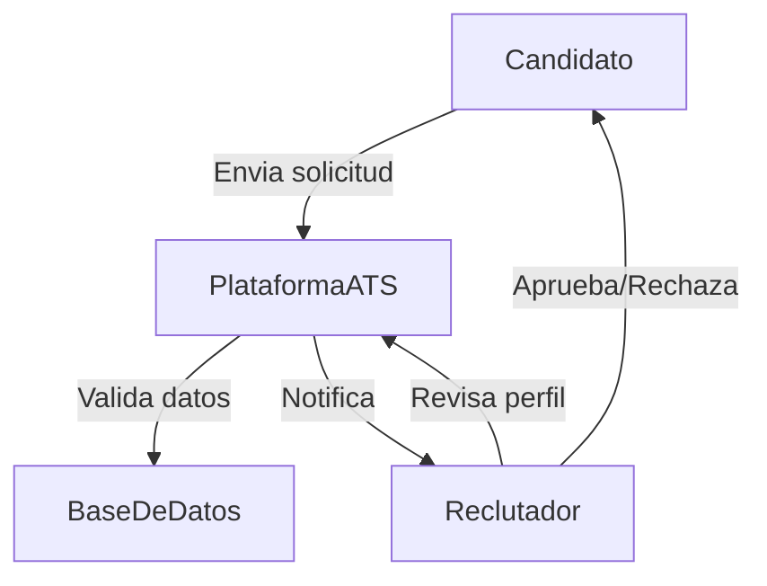
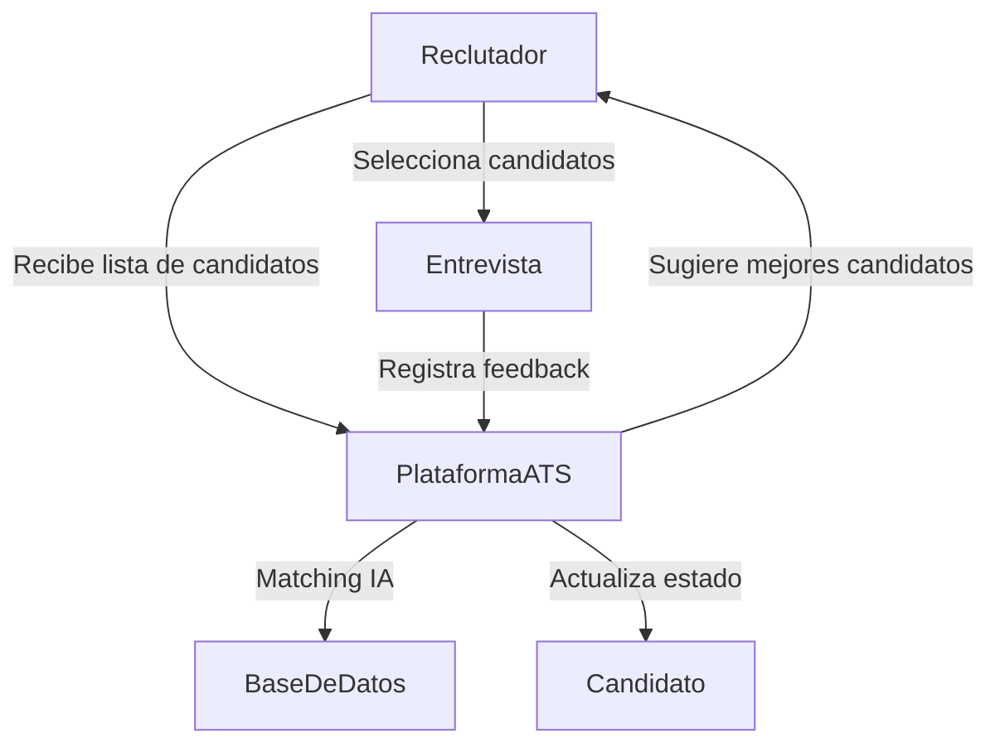
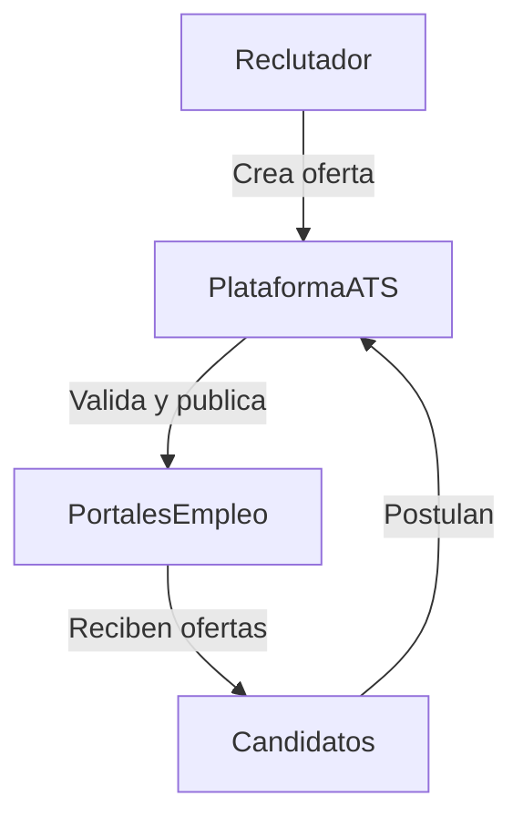
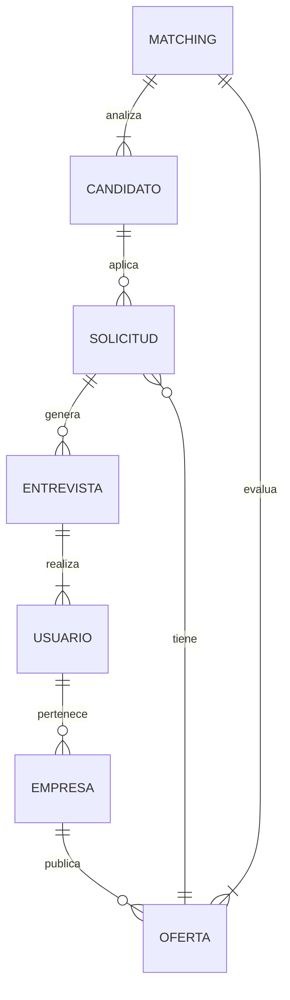
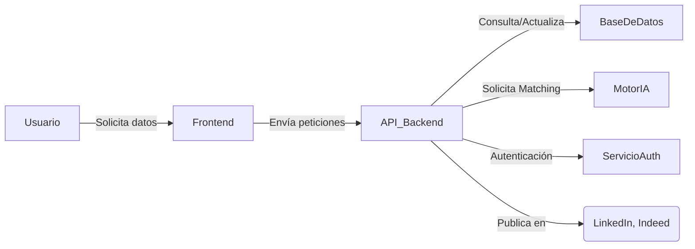
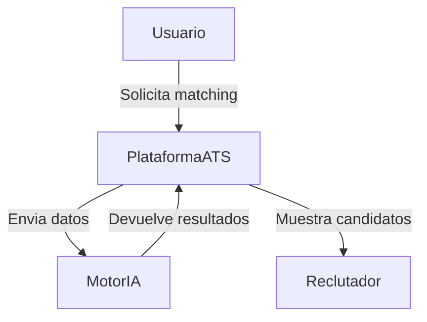
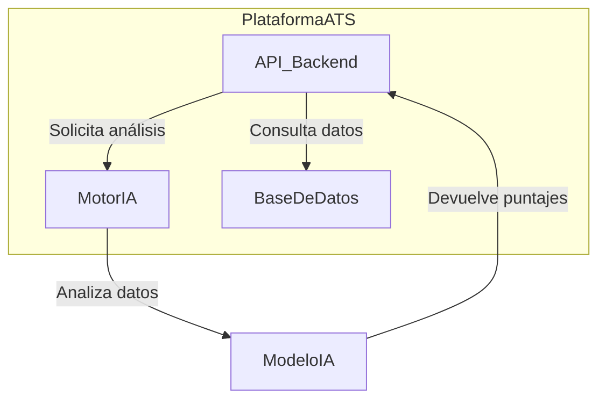
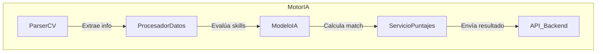

# Descripción del Software LTI

## 1. Descripción Breve y Valor Añadido

LTI es un sistema de seguimiento de candidatos (ATS) especializado en el sector IT, diseñado para optimizar el proceso de selección mediante inteligencia artificial avanzada. Su valor diferencial radica en su motor de _matching_ automático, que analiza las características de los candidatos y las compara con los requisitos de la oferta para maximizar la precisión en la contratación.

### **Comentarios Victor**

- Considerar incluir estadísticas concretas sobre la mejora en tiempos de contratación (ej. "reduce hasta un 40% el tiempo de selección").
- Mencionar la capacidad de adaptación a diferentes mercados IT (desarrollo, ciberseguridad, data science, etc.).
- Destacar el análisis predictivo para anticipar necesidades de contratación basado en tendencias del mercado.

### **Ventajas Competitivas**

- **Matching Inteligente:** Utiliza IA avanzada para evaluar la compatibilidad entre candidatos y vacantes, reduciendo el tiempo de selección.
- **Enfoque en IT:** Adaptado a las necesidades del sector tecnológico, considerando habilidades específicas y certificaciones.
- **Integraciones Clave:** Conexión con LinkedIn e Indeed para automatizar la captación de talento.
- **Gestón Multiempresa y Multirol:** Permite a diferentes organizaciones y usuarios gestionar procesos de selección con niveles de acceso personalizados.
- **SaaS Escalable:** Infraestructura en la nube con capacidad de integrarse con otros sistemas y expandirse según las necesidades del mercado.

## 2. Funciones Principales

- **Gestión de Candidatos:** Creación y seguimiento de perfiles con CV estructurado y archivos adjuntos.
- **Publicación de Ofertas:** Automatización de la difusión en portales de empleo.
- **Matching Automático:** Recomendaciones basadas en IA para agilizar la selección.
- **Historial de Interacciones:** Registro de entrevistas, evaluaciones y feedback.
- **Roles y Permisos:** Diferentes niveles de acceso según el tipo de usuario.
- **Autenticación Segura:** Sistema robusto de inicio de sesión con control de roles.

### **Comentarios Victor**

- **Análisis de Competencias Técnicas:** Incorporar evaluaciones técnicas automatizadas para validar habilidades declaradas.
- **Dashboard Analítico:** Visualización de KPIs de contratación y rendimiento del proceso de selección.
- **Sistema de Alertas:** Notificaciones personalizables para seguimiento de candidatos prioritarios.
- **Gestión de Onboarding:** Seguimiento post-contratación para asegurar una incorporación exitosa.
- **Integración con Calendarios:** Sincronización con Google Calendar y Outlook para programación de entrevistas.

## 3. Lean Canvas

| Sección                   | Descripción                                                                                                                                                        |
| ------------------------- | ------------------------------------------------------------------------------------------------------------------------------------------------------------------ |
| **Problema**              | Reclutadores de IT tienen dificultades para encontrar rápidamente el talento adecuado. Los candidatos no siempre reciben retroalimentación sobre sus aplicaciones. |
| **Segmentos de Clientes** | Empresas tecnológicas, agencias de reclutamiento IT, startups en crecimiento.                                                                                      |
| **Propuesta de Valor**    | Matching inteligente con IA, integración con portales de empleo y gestión multiempresa.                                                                            |
| **Solución**              | ATS basado en IA que automatiza el filtrado y selección de talento IT.                                                                                             |
| **Canales**               | Venta directa, asociaciones con portales de empleo, marketing digital.                                                                                             |
| **Fuentes de Ingreso**    | Modelo SaaS con suscripción mensual.                                                                                                                               |
| **Estructura de Costos**  | Desarrollo y mantenimiento de software, infraestructura en la nube, IA y data processing.                                                                          |
| **Métricas Clave**        | Tiempo de contratación reducido, precisión del _matching_, cantidad de vacantes cubiertas.                                                                         |

### **Comentarios Victor**

| Sección                   | Comentarios Adicionales                                                                                                 |
| ------------------------- | ----------------------------------------------------------------------------------------------------------------------- |
| **Problema**              | Añadir: Alta rotación en el sector IT y dificultad para retener talento. Competencia feroz por perfiles especializados. |
| **Segmentos de Clientes** | Incluir: Departamentos de RRHH de empresas no tecnológicas que necesitan contratar perfiles IT.                         |
| **Propuesta de Valor**    | Destacar: Reducción de sesgos en la contratación mediante evaluación objetiva basada en datos.                          |
| **Ventaja Injusta**       | Algoritmo de matching entrenado con datos reales de contrataciones exitosas en el sector IT.                            |
| **Fuentes de Ingreso**    | Considerar: Modelo freemium para pequeñas empresas y planes enterprise con funcionalidades avanzadas.                   |
| **Métricas Clave**        | Añadir: Tasa de retención de empleados contratados y satisfacción de los reclutadores con la plataforma.                |

## 4. Diagramas de Casos de Uso

### **1. Aplicación de un Candidato**

### **Comentarios Victor - Caso de Uso 1**

- Añadir un paso de "Evaluación Preliminar Automática" entre la validación de datos y la notificación al reclutador.
- Incluir una rama para "Candidato Recomendado" cuando el sistema detecta un match excepcional.
- Considerar un flujo alternativo para candidatos que aplican a través de portales externos.

### **2. Evaluación y Selección de Candidatos**

### **Comentarios Victor - Caso de Uso 2**

- Incorporar un nodo para "Prueba Técnica Automatizada" antes de la entrevista.
- Añadir un ciclo de retroalimentación donde el sistema aprende de las decisiones del reclutador.
- Incluir un paso de "Comparación con Candidatos Anteriores" para mejorar la precisión del matching.

### **3. Publicación de Ofertas**

### **Comentarios Victor - Caso de Uso 3**

- Agregar un paso de "Optimización SEO" para mejorar la visibilidad de las ofertas.
- Incluir un flujo para "Recomendación de Candidatos Pasivos" en la base de datos.
- Considerar un proceso de "Validación de Requisitos" para asegurar ofertas realistas y atractivas.

## 5. Modelo de Datos

### **Entidades y Atributos**

- **Candidato** (id, nombre, email, teléfono, experiencia, habilidades, CV, archivos adjuntos)
- **Oferta** (id, título, empresa, requisitos, ubicación, salario, beneficios, estado)
- **Solicitud** (id, candidato_id, oferta_id, estado, fecha_aplicación)
- **Empresa** (id, nombre, descripción, sector)
- **Usuario** (id, nombre, email, rol, empresa_id)
- **Entrevista** (id, solicitud_id, reclutador_id, fecha, feedback)
- **Matching** (id, candidato_id, oferta_id, puntaje)

### **Comentarios Victor - Entidades y Atributos**

- **Candidato**: Añadir atributos como disponibilidad, expectativa salarial, preferencia de trabajo remoto/presencial, idiomas, certificaciones.
- **Oferta**: Incluir modalidad (remoto/híbrido/presencial), duración del contrato, proceso de selección (etapas).
- **Nueva Entidad - Skill**: (id, nombre, categoría, nivel) para normalizar y estandarizar habilidades técnicas.
- **Nueva Entidad - Feedback**: (id, entrevista_id, aspecto_evaluado, puntuación, comentario) para estructurar mejor las evaluaciones.
- **Nueva Entidad - Actividad**: (id, usuario_id, tipo_actividad, fecha, descripción) para auditoría y seguimiento de acciones.

### **Diagrama de Modelo de Datos**

## 6. Diseño del Sistema a Alto Nivel

El sistema sigue una arquitectura basada en microservicios para garantizar escalabilidad y modularidad.

### **Componentes Principales:**

- **Frontend:** Aplicación web en React.
- **Backend:** API en Node.js con Express.
- **Base de Datos:** PostgreSQL para datos estructurados y MongoDB para almacenamiento de CVs.
- **Motor de Matching:** Servicio en Python con modelos de IA.
- **Autenticación:** OAuth 2.0 con JWT para control de acceso.
- **Integraciones:** APIs de LinkedIn e Indeed.

### **Comentarios Victor - Componentes Adicionales**

- **Servicio de Análisis**: Implementado en Python con bibliotecas de ciencia de datos para generar reportes y visualizaciones.
- **Sistema de Notificaciones**: Microservicio dedicado para gestionar alertas por email, SMS y push notifications.
- **API Gateway**: Implementación de un gateway con Kong o AWS API Gateway para gestionar el tráfico y seguridad.
- **CDN**: Utilización de una red de distribución de contenido para optimizar la entrega de recursos estáticos.
- **Servicio de Búsqueda**: Implementación de Elasticsearch para búsquedas avanzadas y filtrado de candidatos/ofertas.
- **Capa de Caché**: Redis para mejorar el rendimiento y reducir la carga en la base de datos principal.

### **Diagrama de Arquitectura**

## 7. Diagrama C4 - Motor de Matching

### **Nivel 1: Contexto**

### **Comentarios Victor - Nivel 1**

- Añadir un actor "Sistema de Aprendizaje" que recibe feedback sobre la calidad del matching para mejorar el modelo.
- Incluir un flujo de "Configuración de Parámetros" donde el reclutador puede ajustar la importancia de diferentes criterios.
- Considerar la integración con sistemas externos de evaluación técnica.

### **Nivel 2: Contenedores**

### **Comentarios Victor - Nivel 2**

- Añadir un contenedor "Sistema de Caché" para almacenar resultados frecuentes y mejorar el rendimiento.
- Incluir un contenedor "Servicio de Logging" para registrar todas las operaciones del motor de matching.
- Considerar un contenedor "Gestor de Versiones" para mantener diferentes versiones del modelo de IA.

### **Nivel 3: Componentes del MotorIA**

### **Comentarios Victor - Nivel 3**

- Añadir un componente "Normalizador de Habilidades" que estandarice diferentes formas de expresar la misma competencia.
- Incluir un componente "Detector de Sesgos" que identifique y corrija posibles sesgos en el proceso de matching.
- Agregar un componente "Analizador de Tendencias" que identifique patrones en las contrataciones exitosas.
- Considerar un componente "Evaluador de Soft Skills" basado en el análisis de lenguaje natural de las descripciones.

## 8. Conclusión

El motor de matching es un servicio modular basado en IA que permite evaluar candidatos de manera automatizada, optimizando el proceso de selección para empresas tecnológicas.

### **Comentarios Victor - Conclusión y Próximos Pasos**

- **Implementación Gradual**: Priorizar el desarrollo del core del sistema (matching básico) y luego incorporar funcionalidades avanzadas.
- **Validación con Usuarios**: Establecer un programa de beta testers con reclutadores reales para obtener feedback temprano.
- **Métricas de Éxito**: Definir KPIs claros para medir el impacto del sistema en los procesos de contratación.
- **Escalabilidad**: Diseñar desde el inicio pensando en el crecimiento, con una arquitectura que soporte altos volúmenes de datos.
- **Cumplimiento Normativo**: Asegurar que el sistema cumpla con regulaciones de protección de datos (GDPR, CCPA) y evite discriminación algorítmica.
- **Roadmap de Producto**: Establecer un plan claro de evolución del producto con hitos definidos para los próximos 12-24 meses.
