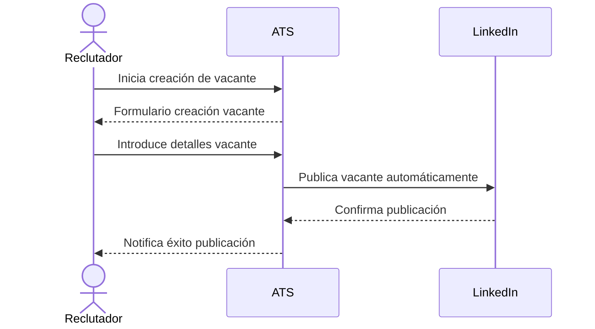

🔖 Caso de Uso #1: **Creación y publicación de vacantes**
---------------------------------------------------------

### 📌 **Descripción del Caso de Uso:**

| Campo                | Detalle del Caso de Uso                                                                                                                                                                                                                                                                                                                                 |
|----------------------|---------------------------------------------------------------------------------------------------------------------------------------------------------------------------------------------------------------------------------------------------------------------------------------------------------------------------------------------------------|
| **Nombre**           | Creación y publicación de vacantes                                                                                                                                                                                                                                                                                                                      |
| **Actores**          | • Reclutador Interno (Recruiter) • Plataforma ATS • LinkedIn                                                                                                                                                                                                                                                                                      |
| **Precondiciones**   | • Reclutador autenticado en la plataforma ATS. • El usuario tiene rol y permisos necesarios para crear y publicar vacantes. • Integración previa con LinkedIn activada y configurada.                                                                                                                                                             |
| **Disparador**       | El reclutador pulsa el botón "**Nueva Vacante**".                                                                                                                                                                                                                                                                                                       |
| **Flujo Principal**  | 1. Reclutador accede al sistema. 2. Selecciona "Nueva Vacante". 3. Introduce título, descripción, requisitos, habilidades, salario y otra información clave. 4. Selecciona los canales externos de publicación (LinkedIn Jobs, web corporativa). 5. Publica la vacante. 6. ATS confirma la publicación y sincroniza con los canales externos automáticamente. 7. ATS recibe candidaturas automáticamente. |
| **Flujos Alternativos** | • **Vacante incompleta o error en datos:** ATS muestra alerta al usuario para corrección. • **Fallo al publicar en canales externos:** ATS muestra notificación automática al usuario para corregir el error y volver a intentar la publicación.                                                                                                                                                    |
| **Postcondiciones**  | • La vacante queda publicada exitosamente en ATS y canales externos. • ATS comienza automáticamente a recibir candidaturas.                                                                                                                                                                                                                          |
| **Reglas de negocio** | • Una vacante no puede publicarse sin título, descripción básica y requisitos mínimos. • El usuario debe disponer de permisos específicos para publicar vacantes. • La integración con LinkedIn debe estar activa para la publicación automática.                                                                                                 |

### 📌 **Diagrama UML:**

