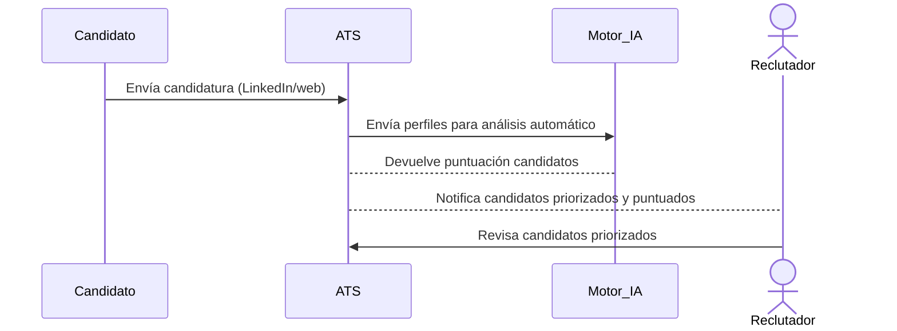

🔖 Caso de Uso #2: **Automatización del screening con IA**
---------------------------------------------------------

### 📌 **Descripción del Caso de Uso:**

| Campo                             | Detalle del Caso de Uso                                                                                                                                                                                                                             |
|-----------------------------------|-----------------------------------------------------------------------------------------------------------------------------------------------------------------------------------------------------------------------------------------------------|
| **Nombre**                        | Automatización del screening con IA                                                                                                                                                                                                                |
| **Actores**                       | • ATS (IA interna) • Reclutador Interno (Recruiter) • Candidato (Indirecto, aplica por canales externos)                                                                                                                                     |
| **Actores secundarios (indirectos)** | • LinkedIn u otros portales integrados                                                                                                                                                                                                             |
| **Precondiciones**                | • El ATS ha recibido candidaturas para la vacante. • Modelo IA entrenado y configurado con criterios específicos del puesto.                                                                                                                     |
| **Disparadores (Triggers)**       | • Recepción automática de nuevas candidaturas en el ATS.                                                                                                                                                                                           |
| **Flujo principal (Main Flow)**   | 1. El ATS recibe automáticamente candidaturas para la vacante. 2. La IA analiza automáticamente los perfiles recibidos (CVs). 3. La IA asigna una puntuación de relevancia a cada candidato. 4. El ATS ordena automáticamente los candidatos según puntuación. 5. El Reclutador recibe una notificación automática y visualiza los candidatos ordenados por relevancia. |
| **Flujos alternativos**           | • CV no legible por IA: El ATS notifica al reclutador para revisión manual. • Perfil incompleto o con datos faltantes: El ATS genera alerta al reclutador indicando necesidad de revisión manual.                                               |
| **Postcondiciones**               | • Candidatos quedan priorizados y disponibles para revisión por parte del reclutador.                                                                                                                                                               |
| **Reglas de negocio**             | • Todo candidato recibido debe tener una puntuación asignada por el modelo IA. • Todo candidato no procesable por IA requiere revisión manual inmediata del reclutador.                                                                          |

### 📌 **Diagrama UML:**

