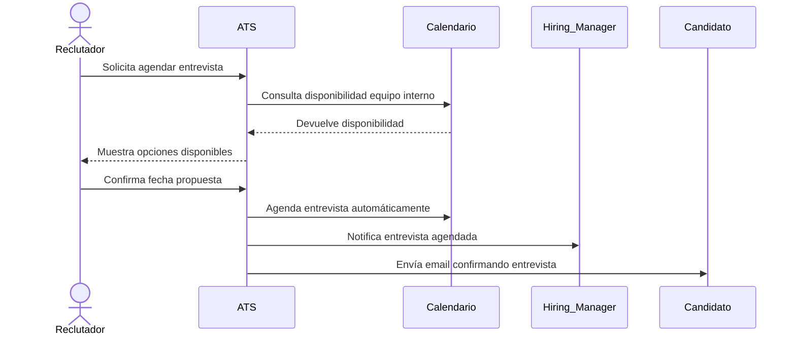

🔖 Caso de Uso #3: **Coordinación automática de entrevistas**
---------------------------------------------------------

### 📌 **Descripción del Caso de Uso:**

| Campo                                  | Detalle del Caso de Uso                                                                                                                                                                                                                                                                                  |
|----------------------------------------|-----------------------------------------------------------------------------------------------------------------------------------------------------------------------------------------------------------------------------------------------------------------------------------------------------------|
| **Nombre**                             | Coordinación automática de entrevistas                                                                                                                                                                                                                                                                  |
| **Actores principales**                | • Reclutador interno (Recruiter) • Hiring Manager • Candidato                                                                                                                                                                                                                                    |
| **Actores secundarios (sistemas externos)** | • Calendario externo (Google Calendar, Microsoft Outlook)                                                                                                                                                                                                                                          |
| **Precondiciones**                     | • Reclutador ha seleccionado candidatos para entrevistar. • Integración con calendarios externos configurada.                                                                                                                                                                                           |
| **Triggers** (Disparador)              | • Reclutador selecciona opción "Agendar entrevista" en ATS.                                                                                                                                                                                                                                              |
| **Flujo Principal (Main Flow)**        | 1. Reclutador selecciona candidatos y opción "Agendar entrevista". 2. ATS consulta disponibilidad en calendarios del equipo interno (Recruiter, Hiring Manager). 3. ATS muestra fechas disponibles al reclutador. 4. Reclutador confirma la fecha propuesta. 5. ATS agenda automáticamente entrevista en calendarios del equipo y candidato. 6. ATS envía email automático al candidato con detalles. 7. ATS envía recordatorios automáticos antes de la entrevista. |
| **Alternative Flows** (Flujos alternativos)  | • Calendario externo no sincronizado (ATS avisa para reintentar conexión). • Reclutador selecciona manualmente la fecha si no acepta sugerencia automática del ATS. • El candidato solicita cambio de fecha (requiere nueva aprobación del recruiter).                                        |
| **Postcondiciones**                    | • Entrevista correctamente programada en calendario de recruiters, managers y candidato.                                                                                                                                                                                                                  |
| **Reglas de negocio**                  | • El ATS siempre verificará disponibilidad antes de agendar la entrevista. • Todos los participantes reciben notificación automática con confirmación de entrevista. • Los cambios o reprogramaciones requieren confirmación por parte del reclutador.                                                                                                |
                                                                         |

### 📌 **Diagrama UML:**

