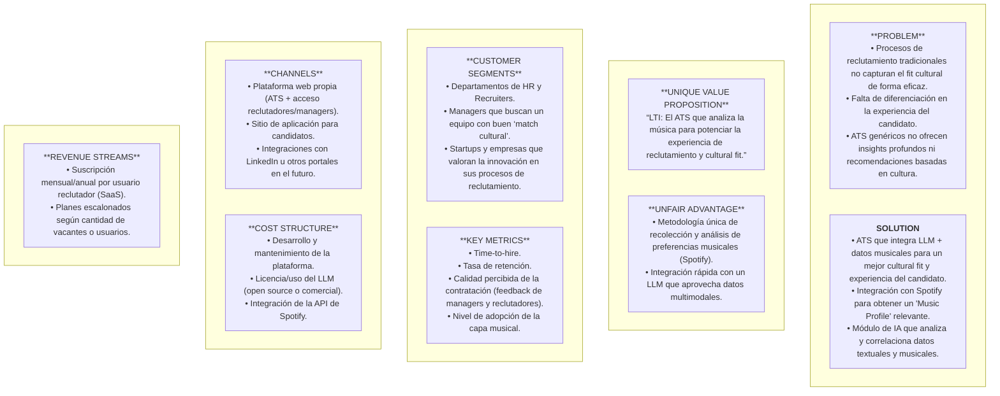
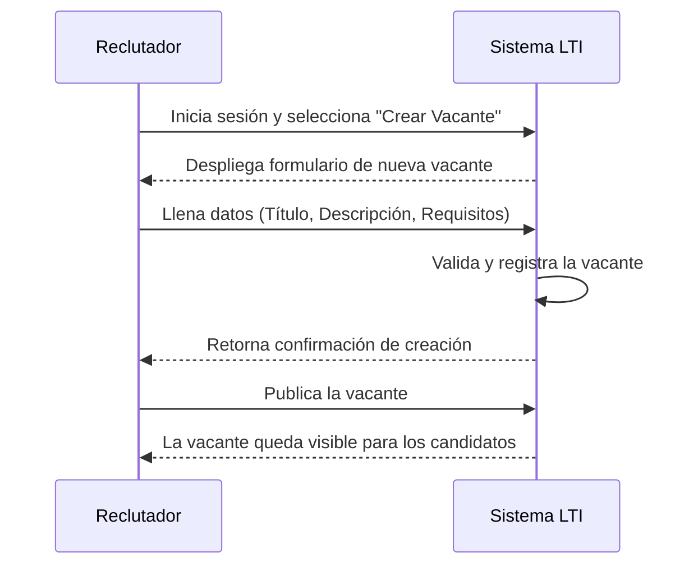
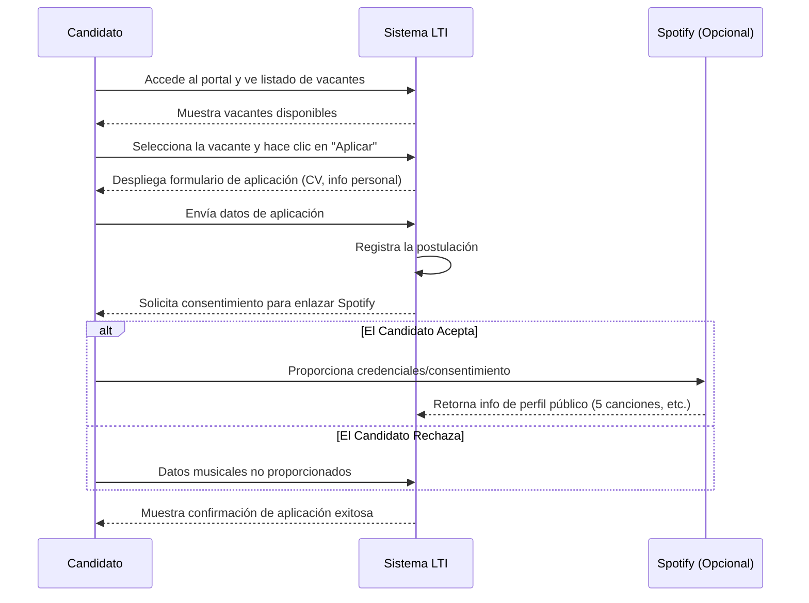
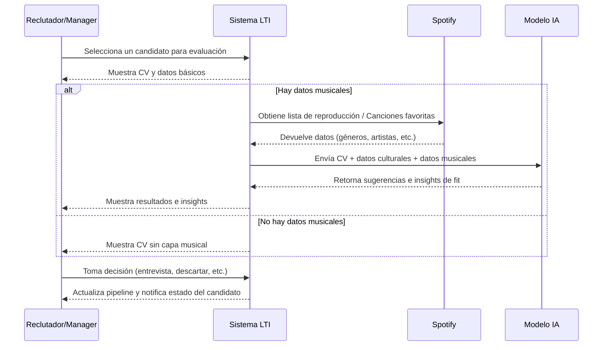
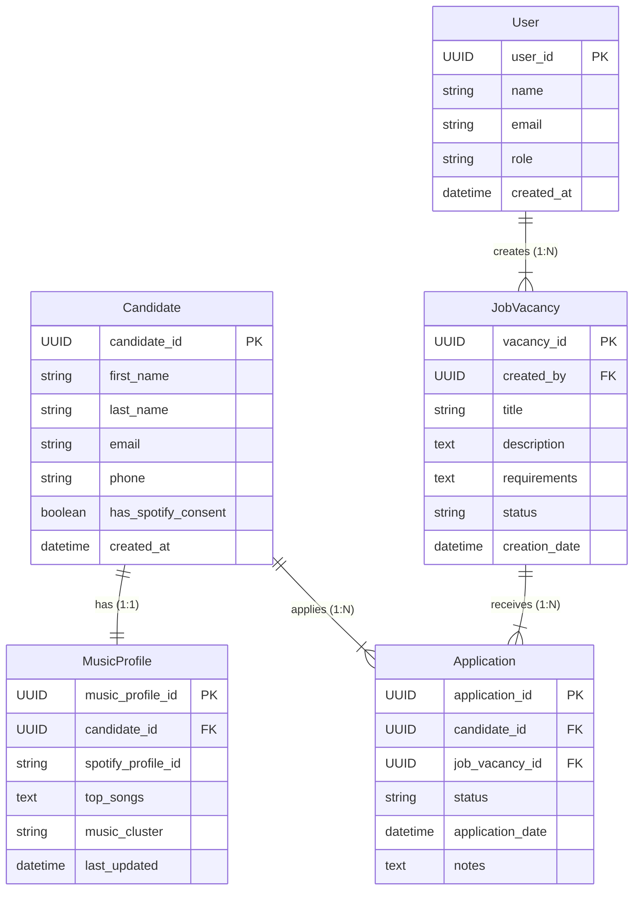

## 1. Descripción Breve del Software LTI

LTI es un sistema de seguimiento de candidatos (Applicant Tracking System, ATS) que integra un enfoque innovador de **análisis musical** para lograr un **mejor entendimiento cultural y de afinidad de cada candidato con la empresa**.

A través de la conexión con Spotify y el uso de un LLM (Large Language Model) alimentado con datos textuales y musicales, LTI otorga a los reclutadores y managers **insights más profundos sobre cómo el candidato podría encajar con los equipos de trabajo, la cultura organizacional y las dinámicas internas**.

### Valor Añadido Principal

- Enriquecimiento del perfil del candidato: La información musical ayuda a reflejar aspectos de personalidad, preferencias creativas y rasgos culturales que típicamente no se capturan en un CV.
- Capacidad Multimodal con IA: Se combina texto (CV, descripciones de vacantes, políticas culturales de la empresa) con data musical (géneros, playlists, canciones favoritas) para dar sugerencias más asertivas de “fit”.
- Experiencia diferenciada: Destaca ante otros ATS por la posibilidad de obtener no solo un skill match, sino también un cultural match, fomentando la armonía y productividad en el equipo.

### Ventajas Competitivas

- Integración Musical como Factor Clave
Ningún ATS convencional ofrece una capa tan específica y contextual de musicalidad para el cultural fit.
- LLM con Input Enriquecido
Emplear la música como factor adicional de contexto permite que el LLM genere recomendaciones más personalizadas.
- Optimización del Tiempo de Reclutamiento
El ATS incorpora funcionalidades esenciales (publicación de vacantes, pipeline de selección, evaluaciones), aprovechando IA para reducir las tareas manuales y repetitivas.
- Diferenciación en la Experiencia del Candidato
Al pedirles compartir sus gustos y preferencias musicales, se crea un proceso más cercano y genuino, mejorando la percepción y el engagement de los postulantes.
## 2. Explicación de las Funciones Principales

### Gestión de Vacantes y Candidatos

- Crear, editar y cerrar vacantes de forma centralizada.
- Visualizar, filtrar y gestionar candidatos en cada etapa del proceso.

### Pipeline de Reclutamiento

- Definir etapas personalizadas (ej. Screening, Entrevista, Oferta) y mover candidatos en el pipeline de manera visual.

### Integración con Spotify para el Candidato
- Solicitar autorización para obtener el perfil público de Spotify y/o un conjunto de playlists/canciones favoritas.
- Recopilar 5 canciones más representativas y una breve descripción del uso de la música en diferentes contextos (trabajo, productividad, ocio).

### Módulo de Análisis Musical

- Creación de un “music personality cluster” básico que agrupe a los candidatos según sus afinidades musicales.
- Visualización de estos clusters en el perfil del candidato.

### Asistencia de IA (LLM)

- Análisis y procesamiento de datos textuales (CV, requisitos de vacantes, cultura de la empresa) y datos musicales para dar sugerencias sobre el fit cultural y recomendaciones de vacante.
- Sugerir preguntas de entrevista personalizadas en base a la información textual y musical.

### Automatizaciones Esenciales

- Notificaciones automáticas a reclutadores y managers al pasar un candidato de una etapa a otra.
- Reportes rápidos sobre el estado del pipeline y métricas básicas (tiempo promedio de contratación, tasa de conversión, etc.).

### Privacidad y Consentimiento

Obtención de consentimiento explícito por parte del candidato para el uso de sus datos musicales y su vinculación con el perfil.

## 3. Lean Canvas

| **PROBLEM**                                                                                                                                                | **SOLUTION**                                                                                                                                                                                     |
|------------------------------------------------------------------------------------------------------------------------------------------------------------|--------------------------------------------------------------------------------------------------------------------------------------------------------------------------------------------------|
| - Procesos de reclutamiento tradicionales no capturan el *fit cultural* de forma eficaz. - Falta de diferenciación en la experiencia del candidato. - ATS genéricos no ofrecen *insights* profundos ni recomendaciones basadas en cultura. | - ATS que integra **LLM + datos musicales** para un mejor *cultural fit* y experiencia del candidato. - **Integración con Spotify** para obtener un “Music Profile” relevante. - Módulo de **IA** que analiza y correlaciona datos textuales y musicales. |

| **UNIQUE VALUE PROPOSITION**                                                                                                  | **UNFAIR ADVANTAGE**                                                                                                                        |
|------------------------------------------------------------------------------------------------------------------------------|----------------------------------------------------------------------------------------------------------------------------------------------|
| **“LTI: El ATS que analiza la música para potenciar la experiencia de reclutamiento y cultural fit.”**                       | - **Metodología única** de recolección y análisis de preferencias musicales (Spotify). - Integración rápida con un **LLM** que aprovecha datos multimodales. |

| **CUSTOMER SEGMENTS**                                                                                                              | **KEY METRICS**                                                                                                                                           |
|------------------------------------------------------------------------------------------------------------------------------------|-----------------------------------------------------------------------------------------------------------------------------------------------------------|
| - Departamentos de HR y Recruiters. - Managers que buscan un equipo con buen “match cultural”. - Startups y empresas que valoran la innovación en sus procesos de reclutamiento. | - **Time-to-hire** - **Tasa de retención** - **Calidad percibida** de la contratación (feedback de managers y reclutadores) - Nivel de **adopción de la capa musical** por parte de reclutadores |

| **CHANNELS**                                                                                                                                                                   | **COST STRUCTURE**                                                                                                                                                           |
|---------------------------------------------------------------------------------------------------------------------------------------------------------------------------------|---------------------------------------------------------------------------------------------------------------------------------------------------------------------------------------------------------------------|
| - **Plataforma web** propia (ATS + acceso reclutadores/managers). - Sitio de aplicación para candidatos. - Integraciones con LinkedIn u otros portales en el futuro. | - **Desarrollo y mantenimiento** de la plataforma. - **Licencia/uso** del LLM (open source o comercial). - **Integración** de la API de Spotify.                                                              |

| **REVENUE STREAMS**                                                                                     |
|---------------------------------------------------------------------------------------------------------|
| - **Suscripción** mensual/anual por usuario reclutador (SaaS). - **Planes escalonados** según cantidad de vacantes o usuarios. | 

### Mermaid 

## 4. Casos de uso principales

### 1. Caso de Uso: “Publicar Vacante”

#### Descripción

- El Reclutador inicia sesión en el sistema LTI para crear y publicar una nueva vacante.
- El sistema valida la información y confirma la publicación.

#### Actores Involucrados

- Reclutador
- Sistema LTI (ATS)

#### Flujo Principal

- El Reclutador inicia sesión en LTI.
- Selecciona la opción “Crear Vacante”.
- Completa el formulario con título, descripción, requisitos, etc.
- Confirma la creación de la vacante.
- LTI valida y registra la nueva vacante en la base de datos.
- LTI muestra confirmación y la vacante queda visible para candidatos.

### 2. Caso de Uso: “Aplicar a Vacante”

#### Descripción
- El Candidato ingresa al portal de LTI, revisa las vacantes disponibles y decide aplicar a una de ellas. El sistema solicita datos personales, CV y permiso para integrar su información musical.

#### Actores Involucrados

- Candidato
- Sistema LTI (ATS)
- Spotify (opcional para este paso, pero se menciona al final)

#### Flujo Principal

- El Candidato accede al portal de LTI (página de vacantes).
- Selecciona la vacante de interés.
- LTI muestra los detalles de la vacante y un botón para aplicar.
- El Candidato completa la información solicitada (CV, preguntas básicas).
- LTI registra la aplicación en la base de datos.
- LTI solicita consentimiento para vincular la cuenta de Spotify (opcional, si no hay otro mecanismo de verificación).
- El Candidato da su consentimiento y, si procede, se vincula la cuenta de Spotify o ingresa sus 5 canciones favoritas.
- LTI confirma la aplicación exitosa.

#### Diagrama (Mermaid)

### 3. Caso de Uso: “Evaluar Candidato con Capa Musical”

#### Descripción
- El Reclutador/Manager revisa un candidato que ya ha aplicado y, si ha proporcionado datos musicales (ya sea la conexión a Spotify o la lista de canciones), el sistema LTI aprovecha el LLM para generar insights sobre compatibilidad cultural.

#### Actores Involucrados

- Reclutador/Manager
- Sistema LTI (ATS)
- Spotify (para recuperar datos musicales)
- LLM (para procesar datos textuales y musicales)

#### Flujo Principal

- El Reclutador/Manager entra a LTI para ver detalles de un candidato.
- LTI muestra información del CV, experiencia y, si está disponible, la información musical.
- LTI realiza una llamada al LLM con datos textuales (CV, requerimientos de la vacante, cultura empresarial) y datos musicales (géneros, 5 canciones favoritas, etc.).
- El LLM devuelve sugerencias e insights sobre el fit cultural (p. ej., “Cluster Musical: Rock/Indie, probable afinidad con equipos creativos”).
- LTI presenta estos insights al Reclutador/Manager.
- El Reclutador/Manager decide si avanza con la entrevista o pasa al siguiente paso en el pipeline.
- LTI registra la decisión tomada en el perfil del candidato.

#### Diagrama (Mermaid)

## 5. Modelo de Datos - LTI

A continuación se presenta el **Modelo de Datos** que cubre las principales entidades, atributos y relaciones del MVP de LTI. Incluye:

1. **Listado de Entidades y Atributos** (con posibles tipos de datos).  
2. **Diagrama ER en Mermaid** (*Diagram as Code*).

Puedes revisar y validar si esto se ajusta a tu visión. Si deseas modificaciones, ¡házmelo saber antes de pasar al diseño de sistema a alto nivel!

---

### 1. Entidades y Atributos Principales

#### 1.1. **User** 
Representa a cualquier usuario interno del sistema (Reclutador, Manager, Admin, etc.).

| Atributo       | Tipo de Dato (Ejemplo) | Descripción                                                     |
| -------------- | ---------------------- | --------------------------------------------------------------- |
| **user_id**    | `UUID` (PK)           | Identificador único del usuario.                                |
| **name**       | `VARCHAR(100)`        | Nombre completo del usuario.                                    |
| **email**      | `VARCHAR(100)`        | Correo electrónico del usuario (único).                         |
| **role**       | `VARCHAR(50)`         | Rol del usuario dentro de LTI (e.g., “Recruiter”, “Manager”).   |
| **created_at** | `TIMESTAMP`           | Fecha y hora de creación del registro.                          |

---

#### 1.2. **Candidate**
Información de cada postulante que se registra o aplica a alguna vacante en el sistema.

| Atributo             | Tipo de Dato (Ejemplo) | Descripción                                                                    |
| -------------------- | ---------------------- | ------------------------------------------------------------------------------ |
| **candidate_id**     | `UUID` (PK)           | Identificador único del candidato.                                             |
| **first_name**       | `VARCHAR(100)`        | Nombre.                                                                        |
| **last_name**        | `VARCHAR(100)`        | Apellido.                                                                      |
| **email**            | `VARCHAR(100)`        | Correo electrónico del candidato (único).                                      |
| **phone**            | `VARCHAR(20)`         | Teléfono de contacto (opcional).                                              |
| **has_spotify_consent** | `BOOLEAN`          | Indica si el candidato ha dado consentimiento para usar sus datos de Spotify. |
| **created_at**       | `TIMESTAMP`           | Fecha y hora de creación del registro.                                        |

---

#### 1.3. **MusicProfile**
Contiene la capa musical que diferencia a LTI, asociada a un candidato con consentimiento.

| Atributo             | Tipo de Dato (Ejemplo) | Descripción                                                                                            |
| -------------------- | ---------------------- | ------------------------------------------------------------------------------------------------------ |
| **music_profile_id** | `UUID` (PK)           | Identificador único del perfil musical.                                                                |
| **candidate_id**     | `UUID` (FK)           | Relación 1:1 con `Candidate`.                                                                          |
| **spotify_profile_id** | `VARCHAR(100)`      | ID de la cuenta de Spotify (si procede) o cualquier referencia al usuario de Spotify.                 |
| **top_songs**        | `TEXT / JSON`         | Lista de las 5 canciones favoritas o datos de playlists (formato JSON, CSV, etc.).                    |
| **music_cluster**    | `VARCHAR(100)`        | Cluster o categorización musical (ej. “Rock Enthusiast”, “Indie & Chill”).                             |
| **last_updated**     | `TIMESTAMP`           | Fecha y hora de la última actualización de la info musical.                                           |

> **Nota**: En un MVP, podemos guardar las 5 canciones como un texto estructurado (JSON). A futuro, se puede normalizar más si se requiere.

---

#### 1.4. **JobVacancy**
Define la vacante publicada en el sistema, creada por un usuario (reclutador).

| Atributo          | Tipo de Dato (Ejemplo) | Descripción                                                        |
| ----------------- | ---------------------- | ------------------------------------------------------------------ |
| **vacancy_id**    | `UUID` (PK)           | Identificador único de la vacante.                                 |
| **created_by**    | `UUID` (FK -> User)   | ID del usuario que crea la vacante (generalmente un reclutador).   |
| **title**         | `VARCHAR(200)`        | Título de la vacante.                                              |
| **description**   | `TEXT`                | Descripción detallada de la posición.                              |
| **requirements**  | `TEXT`                | Lista de requisitos y habilidades necesarias.                      |
| **status**        | `VARCHAR(50)`         | Estado de la vacante (ej. “OPEN”, “CLOSED”).                       |
| **creation_date** | `TIMESTAMP`           | Fecha y hora de creación.                                          |

---

#### 1.5. **Application**
Registra la postulación de un candidato a una vacante y su estado en el proceso.

| Atributo            | Tipo de Dato (Ejemplo) | Descripción                                                                                         |
| ------------------- | ---------------------- | --------------------------------------------------------------------------------------------------- |
| **application_id**  | `UUID` (PK)           | Identificador único de la postulación.                                                              |
| **candidate_id**    | `UUID` (FK -> Candidate) | ID del candidato que se está postulando.                                                          |
| **job_vacancy_id**  | `UUID` (FK -> JobVacancy) | ID de la vacante a la que se aplica.                                                              |
| **status**          | `VARCHAR(50)`         | Etapa de la postulación (ej. “APPLIED”, “SCREENING”, “INTERVIEW”, “OFFER”, “HIRED”, “REJECTED”).    |
| **application_date** | `TIMESTAMP`          | Fecha y hora en la que se realizó la postulación.                                                  |
| **notes**           | `TEXT` (Opcional)     | Notas adicionales del reclutador, comentarios del manager, etc.                                    |

---

### 2. Diagrama ER (Mermaid)

