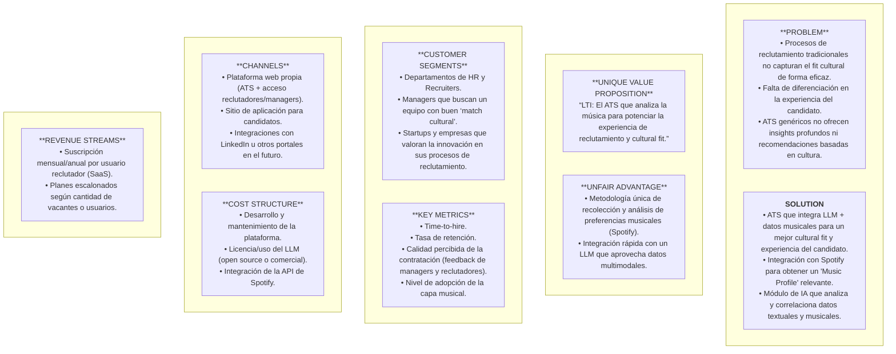
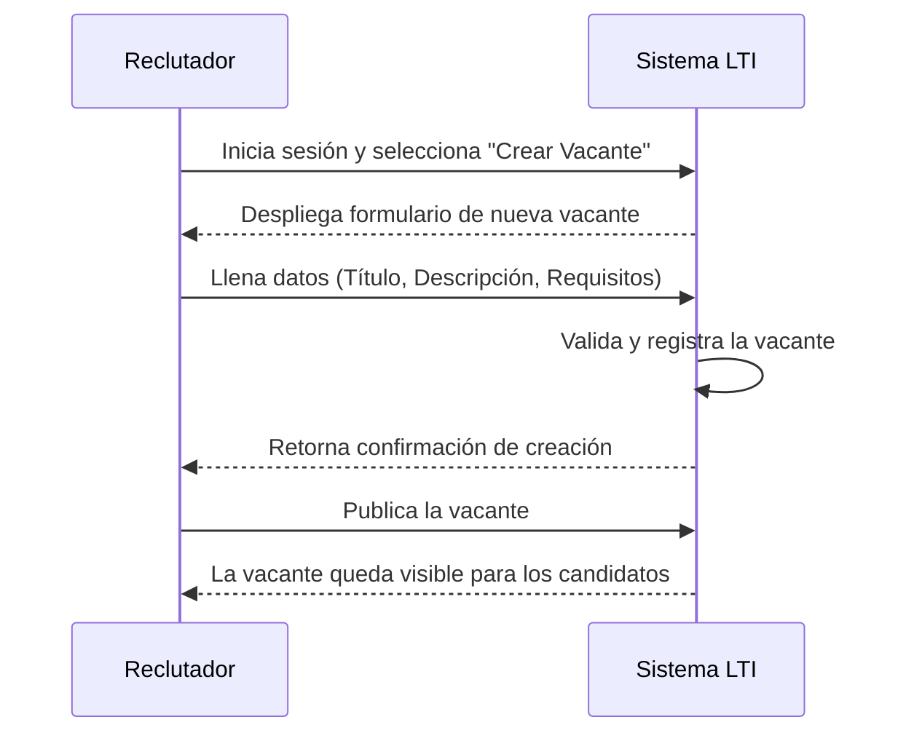
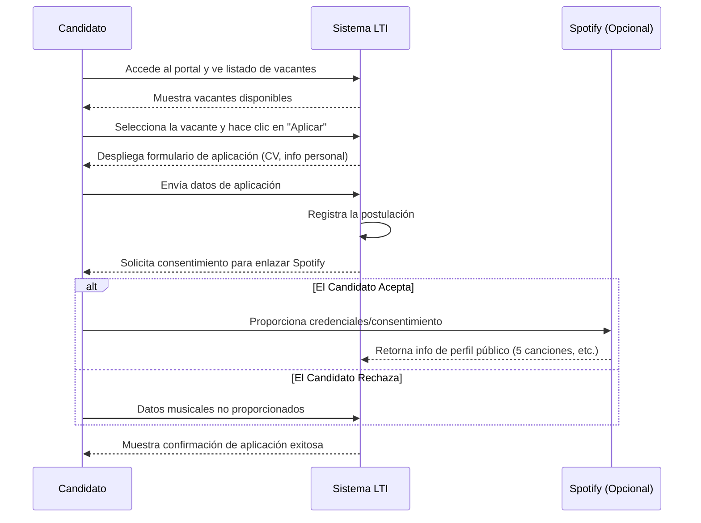
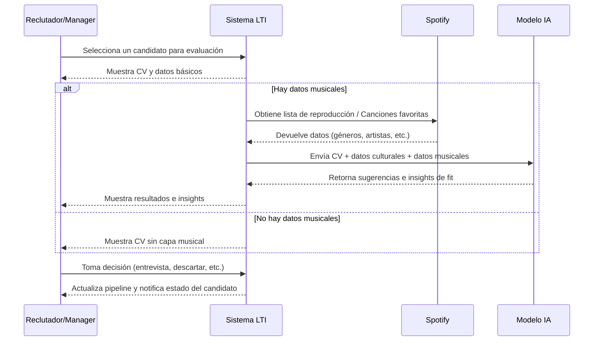
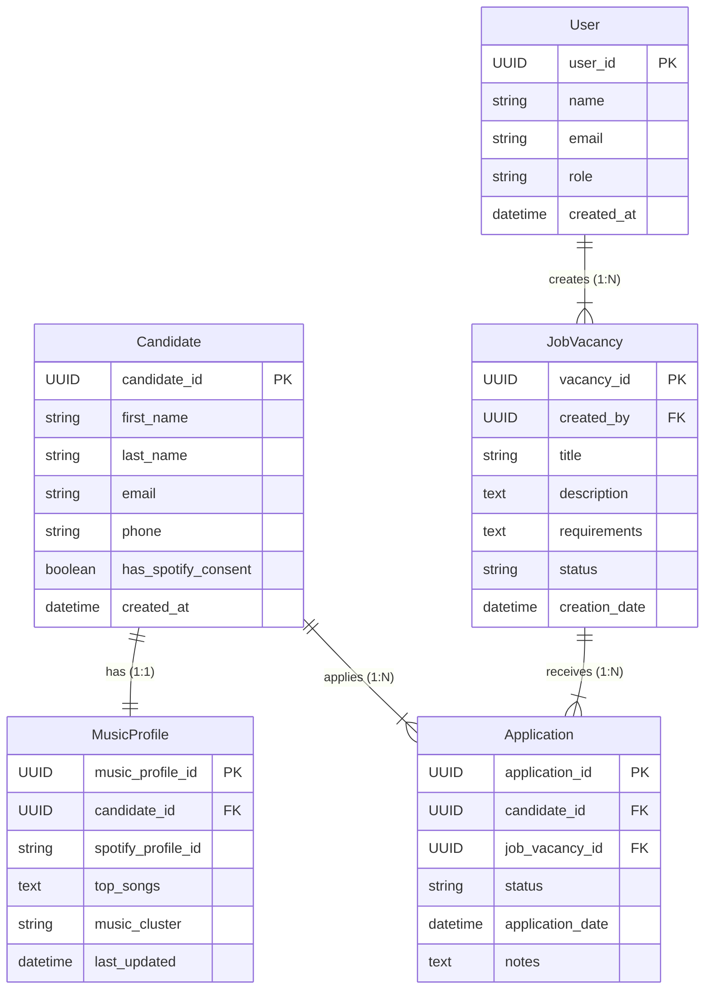
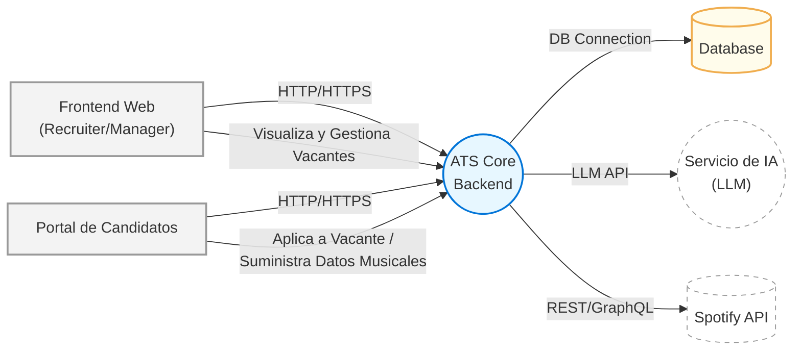
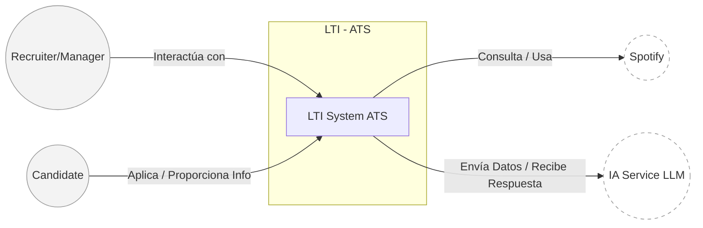
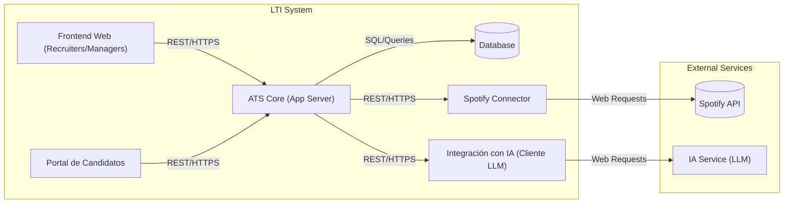
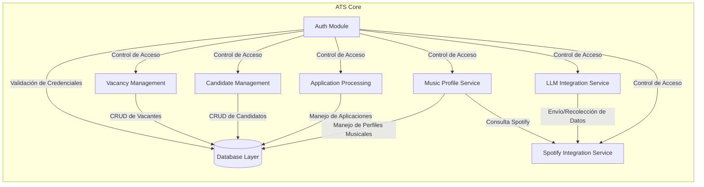

## 1. Descripción Breve del Software LTI

LTI es un sistema de seguimiento de candidatos (Applicant Tracking System, ATS) que integra un enfoque innovador de **análisis musical** para lograr un **mejor entendimiento cultural y de afinidad de cada candidato con la empresa**.

A través de la conexión con Spotify y el uso de un LLM (Large Language Model) alimentado con datos textuales y musicales, LTI otorga a los reclutadores y managers **insights más profundos sobre cómo el candidato podría encajar con los equipos de trabajo, la cultura organizacional y las dinámicas internas**.

### Valor Añadido Principal

- Enriquecimiento del perfil del candidato: La información musical ayuda a reflejar aspectos de personalidad, preferencias creativas y rasgos culturales que típicamente no se capturan en un CV.
- Capacidad Multimodal con IA: Se combina texto (CV, descripciones de vacantes, políticas culturales de la empresa) con data musical (géneros, playlists, canciones favoritas) para dar sugerencias más asertivas de “fit”.
- Experiencia diferenciada: Destaca ante otros ATS por la posibilidad de obtener no solo un skill match, sino también un cultural match, fomentando la armonía y productividad en el equipo.

### Ventajas Competitivas

- Integración Musical como Factor Clave
Ningún ATS convencional ofrece una capa tan específica y contextual de musicalidad para el cultural fit.
- LLM con Input Enriquecido
Emplear la música como factor adicional de contexto permite que el LLM genere recomendaciones más personalizadas.
- Optimización del Tiempo de Reclutamiento
El ATS incorpora funcionalidades esenciales (publicación de vacantes, pipeline de selección, evaluaciones), aprovechando IA para reducir las tareas manuales y repetitivas.
- Diferenciación en la Experiencia del Candidato
Al pedirles compartir sus gustos y preferencias musicales, se crea un proceso más cercano y genuino, mejorando la percepción y el engagement de los postulantes.
## 2. Explicación de las Funciones Principales

### Gestión de Vacantes y Candidatos

- Crear, editar y cerrar vacantes de forma centralizada.
- Visualizar, filtrar y gestionar candidatos en cada etapa del proceso.

### Pipeline de Reclutamiento

- Definir etapas personalizadas (ej. Screening, Entrevista, Oferta) y mover candidatos en el pipeline de manera visual.

### Integración con Spotify para el Candidato
- Solicitar autorización para obtener el perfil público de Spotify y/o un conjunto de playlists/canciones favoritas.
- Recopilar 5 canciones más representativas y una breve descripción del uso de la música en diferentes contextos (trabajo, productividad, ocio).

### Módulo de Análisis Musical

- Creación de un “music personality cluster” básico que agrupe a los candidatos según sus afinidades musicales.
- Visualización de estos clusters en el perfil del candidato.

### Asistencia de IA (LLM)

- Análisis y procesamiento de datos textuales (CV, requisitos de vacantes, cultura de la empresa) y datos musicales para dar sugerencias sobre el fit cultural y recomendaciones de vacante.
- Sugerir preguntas de entrevista personalizadas en base a la información textual y musical.

### Automatizaciones Esenciales

- Notificaciones automáticas a reclutadores y managers al pasar un candidato de una etapa a otra.
- Reportes rápidos sobre el estado del pipeline y métricas básicas (tiempo promedio de contratación, tasa de conversión, etc.).

### Privacidad y Consentimiento

Obtención de consentimiento explícito por parte del candidato para el uso de sus datos musicales y su vinculación con el perfil.

## 3. Lean Canvas

| **PROBLEM**                                                                                                                                                | **SOLUTION**                                                                                                                                                                                     |
|------------------------------------------------------------------------------------------------------------------------------------------------------------|--------------------------------------------------------------------------------------------------------------------------------------------------------------------------------------------------|
| - Procesos de reclutamiento tradicionales no capturan el *fit cultural* de forma eficaz. - Falta de diferenciación en la experiencia del candidato. - ATS genéricos no ofrecen *insights* profundos ni recomendaciones basadas en cultura. | - ATS que integra **LLM + datos musicales** para un mejor *cultural fit* y experiencia del candidato. - **Integración con Spotify** para obtener un “Music Profile” relevante. - Módulo de **IA** que analiza y correlaciona datos textuales y musicales. |

| **UNIQUE VALUE PROPOSITION**                                                                                                  | **UNFAIR ADVANTAGE**                                                                                                                        |
|------------------------------------------------------------------------------------------------------------------------------|----------------------------------------------------------------------------------------------------------------------------------------------|
| **“LTI: El ATS que analiza la música para potenciar la experiencia de reclutamiento y cultural fit.”**                       | - **Metodología única** de recolección y análisis de preferencias musicales (Spotify). - Integración rápida con un **LLM** que aprovecha datos multimodales. |

| **CUSTOMER SEGMENTS**                                                                                                              | **KEY METRICS**                                                                                                                                           |
|------------------------------------------------------------------------------------------------------------------------------------|-----------------------------------------------------------------------------------------------------------------------------------------------------------|
| - Departamentos de HR y Recruiters. - Managers que buscan un equipo con buen “match cultural”. - Startups y empresas que valoran la innovación en sus procesos de reclutamiento. | - **Time-to-hire** - **Tasa de retención** - **Calidad percibida** de la contratación (feedback de managers y reclutadores) - Nivel de **adopción de la capa musical** por parte de reclutadores |

| **CHANNELS**                                                                                                                                                                   | **COST STRUCTURE**                                                                                                                                                           |
|---------------------------------------------------------------------------------------------------------------------------------------------------------------------------------|---------------------------------------------------------------------------------------------------------------------------------------------------------------------------------------------------------------------|
| - **Plataforma web** propia (ATS + acceso reclutadores/managers). - Sitio de aplicación para candidatos. - Integraciones con LinkedIn u otros portales en el futuro. | - **Desarrollo y mantenimiento** de la plataforma. - **Licencia/uso** del LLM (open source o comercial). - **Integración** de la API de Spotify.                                                              |

| **REVENUE STREAMS**                                                                                     |
|---------------------------------------------------------------------------------------------------------|
| - **Suscripción** mensual/anual por usuario reclutador (SaaS). - **Planes escalonados** según cantidad de vacantes o usuarios. | 

### Mermaid 

## 4. Casos de uso principales

### 1. Caso de Uso: “Publicar Vacante”

#### Descripción

- El Reclutador inicia sesión en el sistema LTI para crear y publicar una nueva vacante.
- El sistema valida la información y confirma la publicación.

#### Actores Involucrados

- Reclutador
- Sistema LTI (ATS)

#### Flujo Principal

- El Reclutador inicia sesión en LTI.
- Selecciona la opción “Crear Vacante”.
- Completa el formulario con título, descripción, requisitos, etc.
- Confirma la creación de la vacante.
- LTI valida y registra la nueva vacante en la base de datos.
- LTI muestra confirmación y la vacante queda visible para candidatos.

### 2. Caso de Uso: “Aplicar a Vacante”

#### Descripción
- El Candidato ingresa al portal de LTI, revisa las vacantes disponibles y decide aplicar a una de ellas. El sistema solicita datos personales, CV y permiso para integrar su información musical.

#### Actores Involucrados

- Candidato
- Sistema LTI (ATS)
- Spotify (opcional para este paso, pero se menciona al final)

#### Flujo Principal

- El Candidato accede al portal de LTI (página de vacantes).
- Selecciona la vacante de interés.
- LTI muestra los detalles de la vacante y un botón para aplicar.
- El Candidato completa la información solicitada (CV, preguntas básicas).
- LTI registra la aplicación en la base de datos.
- LTI solicita consentimiento para vincular la cuenta de Spotify (opcional, si no hay otro mecanismo de verificación).
- El Candidato da su consentimiento y, si procede, se vincula la cuenta de Spotify o ingresa sus 5 canciones favoritas.
- LTI confirma la aplicación exitosa.

#### Diagrama (Mermaid)

### 3. Caso de Uso: “Evaluar Candidato con Capa Musical”

#### Descripción
- El Reclutador/Manager revisa un candidato que ya ha aplicado y, si ha proporcionado datos musicales (ya sea la conexión a Spotify o la lista de canciones), el sistema LTI aprovecha el LLM para generar insights sobre compatibilidad cultural.

#### Actores Involucrados

- Reclutador/Manager
- Sistema LTI (ATS)
- Spotify (para recuperar datos musicales)
- LLM (para procesar datos textuales y musicales)

#### Flujo Principal

- El Reclutador/Manager entra a LTI para ver detalles de un candidato.
- LTI muestra información del CV, experiencia y, si está disponible, la información musical.
- LTI realiza una llamada al LLM con datos textuales (CV, requerimientos de la vacante, cultura empresarial) y datos musicales (géneros, 5 canciones favoritas, etc.).
- El LLM devuelve sugerencias e insights sobre el fit cultural (p. ej., “Cluster Musical: Rock/Indie, probable afinidad con equipos creativos”).
- LTI presenta estos insights al Reclutador/Manager.
- El Reclutador/Manager decide si avanza con la entrevista o pasa al siguiente paso en el pipeline.
- LTI registra la decisión tomada en el perfil del candidato.

#### Diagrama (Mermaid)

## 5. Modelo de Datos - LTI

A continuación se presenta el **Modelo de Datos** que cubre las principales entidades, atributos y relaciones del MVP de LTI. Incluye:

1. **Listado de Entidades y Atributos** (con posibles tipos de datos).  
2. **Diagrama ER en Mermaid** (*Diagram as Code*).

Puedes revisar y validar si esto se ajusta a tu visión. Si deseas modificaciones, ¡házmelo saber antes de pasar al diseño de sistema a alto nivel!

---

### 1. Entidades y Atributos Principales

#### 1.1. **User** 
Representa a cualquier usuario interno del sistema (Reclutador, Manager, Admin, etc.).

| Atributo       | Tipo de Dato (Ejemplo) | Descripción                                                     |
| -------------- | ---------------------- | --------------------------------------------------------------- |
| **user_id**    | `UUID` (PK)           | Identificador único del usuario.                                |
| **name**       | `VARCHAR(100)`        | Nombre completo del usuario.                                    |
| **email**      | `VARCHAR(100)`        | Correo electrónico del usuario (único).                         |
| **role**       | `VARCHAR(50)`         | Rol del usuario dentro de LTI (e.g., “Recruiter”, “Manager”).   |
| **created_at** | `TIMESTAMP`           | Fecha y hora de creación del registro.                          |

---

#### 1.2. **Candidate**
Información de cada postulante que se registra o aplica a alguna vacante en el sistema.

| Atributo             | Tipo de Dato (Ejemplo) | Descripción                                                                    |
| -------------------- | ---------------------- | ------------------------------------------------------------------------------ |
| **candidate_id**     | `UUID` (PK)           | Identificador único del candidato.                                             |
| **first_name**       | `VARCHAR(100)`        | Nombre.                                                                        |
| **last_name**        | `VARCHAR(100)`        | Apellido.                                                                      |
| **email**            | `VARCHAR(100)`        | Correo electrónico del candidato (único).                                      |
| **phone**            | `VARCHAR(20)`         | Teléfono de contacto (opcional).                                              |
| **has_spotify_consent** | `BOOLEAN`          | Indica si el candidato ha dado consentimiento para usar sus datos de Spotify. |
| **created_at**       | `TIMESTAMP`           | Fecha y hora de creación del registro.                                        |

---

#### 1.3. **MusicProfile**
Contiene la capa musical que diferencia a LTI, asociada a un candidato con consentimiento.

| Atributo             | Tipo de Dato (Ejemplo) | Descripción                                                                                            |
| -------------------- | ---------------------- | ------------------------------------------------------------------------------------------------------ |
| **music_profile_id** | `UUID` (PK)           | Identificador único del perfil musical.                                                                |
| **candidate_id**     | `UUID` (FK)           | Relación 1:1 con `Candidate`.                                                                          |
| **spotify_profile_id** | `VARCHAR(100)`      | ID de la cuenta de Spotify (si procede) o cualquier referencia al usuario de Spotify.                 |
| **top_songs**        | `TEXT / JSON`         | Lista de las 5 canciones favoritas o datos de playlists (formato JSON, CSV, etc.).                    |
| **music_cluster**    | `VARCHAR(100)`        | Cluster o categorización musical (ej. “Rock Enthusiast”, “Indie & Chill”).                             |
| **last_updated**     | `TIMESTAMP`           | Fecha y hora de la última actualización de la info musical.                                           |

> **Nota**: En un MVP, podemos guardar las 5 canciones como un texto estructurado (JSON). A futuro, se puede normalizar más si se requiere.

---

#### 1.4. **JobVacancy**
Define la vacante publicada en el sistema, creada por un usuario (reclutador).

| Atributo          | Tipo de Dato (Ejemplo) | Descripción                                                        |
| ----------------- | ---------------------- | ------------------------------------------------------------------ |
| **vacancy_id**    | `UUID` (PK)           | Identificador único de la vacante.                                 |
| **created_by**    | `UUID` (FK -> User)   | ID del usuario que crea la vacante (generalmente un reclutador).   |
| **title**         | `VARCHAR(200)`        | Título de la vacante.                                              |
| **description**   | `TEXT`                | Descripción detallada de la posición.                              |
| **requirements**  | `TEXT`                | Lista de requisitos y habilidades necesarias.                      |
| **status**        | `VARCHAR(50)`         | Estado de la vacante (ej. “OPEN”, “CLOSED”).                       |
| **creation_date** | `TIMESTAMP`           | Fecha y hora de creación.                                          |

---

#### 1.5. **Application**
Registra la postulación de un candidato a una vacante y su estado en el proceso.

| Atributo            | Tipo de Dato (Ejemplo) | Descripción                                                                                         |
| ------------------- | ---------------------- | --------------------------------------------------------------------------------------------------- |
| **application_id**  | `UUID` (PK)           | Identificador único de la postulación.                                                              |
| **candidate_id**    | `UUID` (FK -> Candidate) | ID del candidato que se está postulando.                                                          |
| **job_vacancy_id**  | `UUID` (FK -> JobVacancy) | ID de la vacante a la que se aplica.                                                              |
| **status**          | `VARCHAR(50)`         | Etapa de la postulación (ej. “APPLIED”, “SCREENING”, “INTERVIEW”, “OFFER”, “HIRED”, “REJECTED”).    |
| **application_date** | `TIMESTAMP`          | Fecha y hora en la que se realizó la postulación.                                                  |
| **notes**           | `TEXT` (Opcional)     | Notas adicionales del reclutador, comentarios del manager, etc.                                    |

---

### 2. Diagrama ER (Mermaid)

## 6. Diseño de Sistema a Alto Nivel

En esta sección describiremos la **arquitectura general** de LTI y los principales componentes que la conforman. El objetivo es ofrecer una **vista panorámica** de cómo las distintas piezas interactúan entre sí, sin aún entrar en los niveles de detalle que veremos posteriormente en el **Diagrama C4**.

---

### 1. Explicación General

#### 1.1. Objetivos de la Arquitectura
- **Escalabilidad y Modularidad**: Permitir que la aplicación crezca de forma orgánica, agregando nuevas integraciones (p. ej., otros servicios de música) o expandiendo la lógica de IA sin afectar al núcleo.
- **Mantenimiento Sencillo**: Favorecer la separación de responsabilidades (frontend, lógica de negocio, integración con IA, persistencia de datos, etc.).
- **Rapidez de Implementación (MVP)**: Emplear un enfoque que sea ágil de desarrollar y desplegar, evitando una sobreingeniería innecesaria.

#### 1.2. Principales Componentes

1. **Frontend Web (Recruiters/Managers)**  
   - Aplicación web dirigida a los reclutadores y managers para gestionar vacantes, evaluar candidatos y ver insights de la IA.  
   - Acceso seguro mediante roles de usuario.

2. **Portal de Candidatos**  
   - Interfaz donde los postulantes pueden registrarse, aplicar a vacantes y, de manera opcional, conectar su cuenta de Spotify (o proveer su “Top 5 Songs”).

3. **ATS Core (LTI Backend)**  
   - Contiene la **lógica de negocio** principal, incluyendo la gestión de vacantes, candidatos, aplicaciones y pipeline de reclutamiento.  
   - Integra módulos para comunicarse con el modelo de IA (LLM) y con servicios externos (Spotify).  
   - Responsable de la **autenticación** y **autorización** de usuarios.

4. **Servicio de IA (LLM)**  
   - Puede ser un servicio externo (API de un tercero) o un módulo interno con un modelo open-source.  
   - Recibe datos textuales (CV, descripción de vacante, cultura empresarial) y datos musicales (géneros, playlists) para generar insights de “fit cultural”.

5. **Integración con Spotify**  
   - Se encarga de la interacción con la **API de Spotify**, previa autorización del candidato.  
   - Obtiene información pública del perfil musical y/o playlists.

6. **Base de Datos (persistencia)**  
   - Almacena la información de Usuarios, Candidatos, Vacantes, Aplicaciones, Perfiles Musicales, etc.  
   - Puede ser una base de datos relacional (p. ej., PostgreSQL, MySQL) o NoSQL, según el caso de uso.  
   - Es clave mantener la trazabilidad de los datos y el consentimiento del candidato en cuanto a su información musical.

7. **Servicios de Notificaciones (Opcional en MVP)**  
   - Pueden emplearse para mandar correos o mensajes automáticos a reclutadores y candidatos (al cambiar de etapa en el proceso, etc.).  
   - No es crítico para el MVP, pero se suele considerar en un ATS robusto.

---

### 2. Diagrama de Alto Nivel (Mermaid)

Este diagrama muestra los componentes lógicos y el flujo de información principal:

#### Descripción del Diagrama

**Frontend Web (Recruiter/Manager) [A]**  
Se conecta al ATS Core vía HTTPS para crear vacantes, mover candidatos en el pipeline y ver recomendaciones.

**Portal de Candidatos [B]**  
Permite a los postulantes registrarse, aplicar a vacantes y, opcionalmente, conectar con Spotify o introducir manualmente sus canciones favoritas.

**ATS Core [C]**  
- Lógica de negocio del sistema.  
- Gestiona solicitudes de reclutadores y candidatos.  
- Administra la Base de Datos [D] para guardar entidades principales (Users, Candidates, MusicProfile, JobVacancy, Application).  
- Cuando un reclutador solicita “insights culturales” o “match”:  
  1. Envía datos (CV, música, cultura empresarial) al Servicio de IA [E].  
  2. El Servicio de IA procesa y responde con sugerencias de *fit*.  
- Cuando un candidato da consentimiento, obtiene la info musical de la Spotify API [F].

**Database [D]**  
Almacena de forma persistente los datos de la aplicación.

**Servicio de IA (LLM) [E]**  
- Proveedor de capacidades de Inteligencia Artificial, puede ser interno o externo (API).  
- Maneja el análisis multimodal (texto + música).

**Spotify API [F]**  
Servicio externo para obtener la información pública o playlists del candidato, previo consentimiento.

---

### 3. Consideraciones Clave

#### Autenticación y Roles
- Es fundamental garantizar que solo Reclutadores/Managers tengan acceso a la administración de vacantes.  
- Los Candidatos tienen acceso limitado (ver vacantes, aplicar, gestionar su perfil).

#### Permisos y Consentimiento para Datos Musicales
- El sistema debe registrar el consentimiento del candidato antes de integrar Spotify.  
- En caso de no obtener consentimiento, se crea un perfil sin datos musicales.

#### Comunicación con el LLM
- Puede hacerse vía API REST, gRPC u otra interfaz.  
- Se debería considerar la latencia y los costes asociados al consumo de la IA en cada evaluación.

#### Escalabilidad del Backend
- Usar contenedores (Docker/Kubernetes) o un PaaS (Heroku, AWS, GCP) para escalar sin complejidad extra.  
- Mantener la flexibilidad: si el volumen de datos musicales crece, podría agregarse un servicio especializado.

#### Seguridad y Protección de Datos
- Cifrado en tránsito (HTTPS/TLS) y, si es necesario, cifrado en reposo.  
- Políticas de retención de datos conforme a regulaciones de privacidad.

## 7. Diagrama C4 de LTI

A continuación se muestra una propuesta de modelo **C4** para el sistema LTI. Recuerda que el C4 se compone de cuatro niveles:

1. **Context** (Sistema en su entorno)  
2. **Container** (Contenedores lógicos/del sistema)  
3. **Component** (Módulos internos de cada contenedor)  
4. **Code** (Nivel de detalle en implementación, opcional en esta etapa)

En este documento nos enfocaremos en **los tres primeros niveles**, profundizando en el tercer nivel sobre el **“ATS Core”** como componente principal.

---

### 1. System Context (Nivel 1)

En este primer diagrama se ilustra el sistema **LTI** como una “caja negra”, resaltando sus principales actores y sistemas externos.

> **Nota**: Mermaid no ofrece una notación oficial de C4, pero usaremos `flowchart` para capturar la esencia. 

#### Descripción

- Recruiter/Manager: Usuario interno que publica vacantes, revisa candidatos y obtiene insights del LLM.
- Candidate: Persona que aplica a la vacante, provee CV y (opcionalmente) su información musical.
- Spotify: Servicio externo para obtener la información musical de los candidatos (previo consentimiento).
- IA Service (LLM): Motor de recomendación y análisis multimodal (texto + música).
- Objetivo: Mostrar cómo LTI se relaciona con actores humanos y externos, sin detallar la composición interna.

### 2. Container Diagram (Nivel 2)

Ahora vemos los contenedores internos del sistema LTI y cómo se comunican.

Cada contenedor representa un área funcional o proceso independiente (aunque en el MVP puedan convivir en un mismo servidor).

#### Descripción de los Contenedores

##### Objetivo

Visualizar los “bloques” internos de LTI y las dependencias externas (Spotify API y IA Service).

##### Frontend Web (Recruiters/Managers)

- Interfaz principal para creación de vacantes, gestión de candidatos, visualización de insights.

##### Portal de Candidatos

- Interfaz para candidatos: registro, aplicación a vacantes y configuración musical (permiso Spotify o top 5 canciones).

##### ATS Core (App Server)

- Lógica principal del negocio.
- Procesa solicitudes de Frontend y Portal.
- Administra las entidades (Vacantes, Candidatos, Aplicaciones, MusicProfile).
- Se comunica con la base de datos y los conectores externos (IA, Spotify).

##### Database

- Almacena la información relacional (Users, Candidates, MusicProfile, JobVacancy, Application, etc.).

##### Integración con IA (Cliente LLM)

- Módulo especializado para llamar a la API del LLM.
- Se encarga de formatear y enviar la data (CV, datos musicales, requisitos).
- Recibe y procesa las respuestas del modelo IA.

##### Spotify Connector

- Módulo para interactuar con la API de Spotify (obtener playlists, top tracks, etc.).
- Solo se activa si el candidato otorga consentimiento.

### 3. Component Diagram (Nivel 3) - Profundizando en ATS Core

En este nivel, nos sumergimos en el contenedor “ATS Core (App Server)” para exponer sus componentes clave. Cada componente implementa una parte concreta de la lógica de negocio.

#### Descripción de los Componentes

##### Objetivo
Mostrar cómo está estructurado internamente el ATS Core, evidenciando los componentes principales y su comunicación interna.

##### Auth Module

- Responsable de la autenticación (login) y autorización (roles: Recruiter, Manager, etc.).
- Valida la sesión y controla el acceso a otros componentes.

##### Vacancy Management

- Maneja toda la lógica CRUD de las vacantes (crear, leer, actualizar, cerrar).
- Asocia las vacantes con el reclutador que las crea.

##### Candidate Management

- Maneja el registro de candidatos y la actualización de su información (datos personales, CV, etc.).

##### Application Processing

- Encargado de las postulaciones y su pipeline (screening, entrevista, oferta, etc.).
- Actualiza el estado de cada aplicación.

##### Music Profile Service

- Lógica para crear/actualizar el perfil musical de un candidato (Top 5 canciones, cluster musical, etc.).
- Interactúa con Spotify Integration Service si el candidato otorga consentimiento.

##### LLM Integration Service

- Gestiona la comunicación con el IA Service.
- Envía los datos relevantes (perfil del candidato, información musical, requisitos) y obtiene los insights de fit cultural.

##### Spotify Integration Service

- En caso de que el candidato conecte su cuenta de Spotify, se encarga de llamar a la Spotify API y retornar los datos relevantes.

##### Database Layer

- Abstracción para consultas y operaciones en la base de datos.
- Cada componente realiza sus operaciones a través de este layer (usando repositorios, DAOs, etc.).
