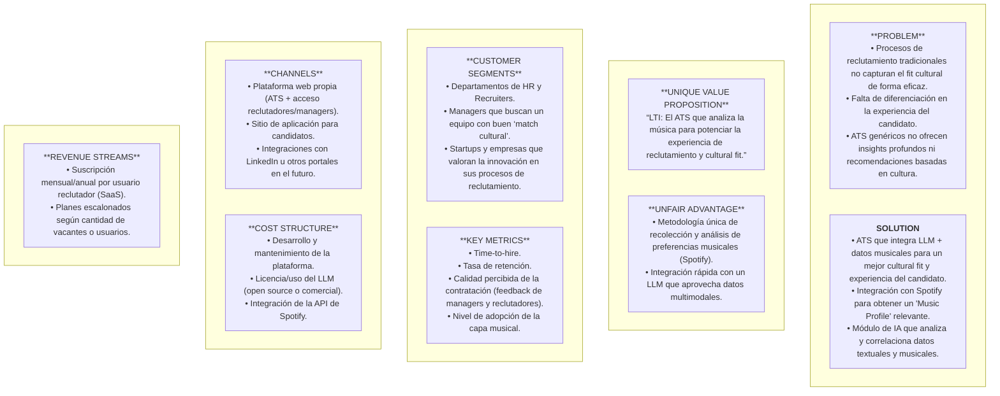

## 1. Descripción Breve del Software LTI

LTI es un sistema de seguimiento de candidatos (Applicant Tracking System, ATS) que integra un enfoque innovador de **análisis musical** para lograr un **mejor entendimiento cultural y de afinidad de cada candidato con la empresa**.

A través de la conexión con Spotify y el uso de un LLM (Large Language Model) alimentado con datos textuales y musicales, LTI otorga a los reclutadores y managers **insights más profundos sobre cómo el candidato podría encajar con los equipos de trabajo, la cultura organizacional y las dinámicas internas**.

### Valor Añadido Principal

- Enriquecimiento del perfil del candidato: La información musical ayuda a reflejar aspectos de personalidad, preferencias creativas y rasgos culturales que típicamente no se capturan en un CV.
- Capacidad Multimodal con IA: Se combina texto (CV, descripciones de vacantes, políticas culturales de la empresa) con data musical (géneros, playlists, canciones favoritas) para dar sugerencias más asertivas de “fit”.
- Experiencia diferenciada: Destaca ante otros ATS por la posibilidad de obtener no solo un skill match, sino también un cultural match, fomentando la armonía y productividad en el equipo.

### Ventajas Competitivas

- Integración Musical como Factor Clave
Ningún ATS convencional ofrece una capa tan específica y contextual de musicalidad para el cultural fit.
- LLM con Input Enriquecido
Emplear la música como factor adicional de contexto permite que el LLM genere recomendaciones más personalizadas.
- Optimización del Tiempo de Reclutamiento
El ATS incorpora funcionalidades esenciales (publicación de vacantes, pipeline de selección, evaluaciones), aprovechando IA para reducir las tareas manuales y repetitivas.
- Diferenciación en la Experiencia del Candidato
Al pedirles compartir sus gustos y preferencias musicales, se crea un proceso más cercano y genuino, mejorando la percepción y el engagement de los postulantes.
## 2. Explicación de las Funciones Principales

### Gestión de Vacantes y Candidatos

- Crear, editar y cerrar vacantes de forma centralizada.
- Visualizar, filtrar y gestionar candidatos en cada etapa del proceso.

### Pipeline de Reclutamiento

- Definir etapas personalizadas (ej. Screening, Entrevista, Oferta) y mover candidatos en el pipeline de manera visual.

### Integración con Spotify para el Candidato
- Solicitar autorización para obtener el perfil público de Spotify y/o un conjunto de playlists/canciones favoritas.
- Recopilar 5 canciones más representativas y una breve descripción del uso de la música en diferentes contextos (trabajo, productividad, ocio).

### Módulo de Análisis Musical

- Creación de un “music personality cluster” básico que agrupe a los candidatos según sus afinidades musicales.
- Visualización de estos clusters en el perfil del candidato.

### Asistencia de IA (LLM)

- Análisis y procesamiento de datos textuales (CV, requisitos de vacantes, cultura de la empresa) y datos musicales para dar sugerencias sobre el fit cultural y recomendaciones de vacante.
- Sugerir preguntas de entrevista personalizadas en base a la información textual y musical.

### Automatizaciones Esenciales

- Notificaciones automáticas a reclutadores y managers al pasar un candidato de una etapa a otra.
- Reportes rápidos sobre el estado del pipeline y métricas básicas (tiempo promedio de contratación, tasa de conversión, etc.).

### Privacidad y Consentimiento

Obtención de consentimiento explícito por parte del candidato para el uso de sus datos musicales y su vinculación con el perfil.

## 3. Lean Canvas

| **PROBLEM**                                                                                                                                                | **SOLUTION**                                                                                                                                                                                     |
|------------------------------------------------------------------------------------------------------------------------------------------------------------|--------------------------------------------------------------------------------------------------------------------------------------------------------------------------------------------------|
| - Procesos de reclutamiento tradicionales no capturan el *fit cultural* de forma eficaz. - Falta de diferenciación en la experiencia del candidato. - ATS genéricos no ofrecen *insights* profundos ni recomendaciones basadas en cultura. | - ATS que integra **LLM + datos musicales** para un mejor *cultural fit* y experiencia del candidato. - **Integración con Spotify** para obtener un “Music Profile” relevante. - Módulo de **IA** que analiza y correlaciona datos textuales y musicales. |

| **UNIQUE VALUE PROPOSITION**                                                                                                  | **UNFAIR ADVANTAGE**                                                                                                                        |
|------------------------------------------------------------------------------------------------------------------------------|----------------------------------------------------------------------------------------------------------------------------------------------|
| **“LTI: El ATS que analiza la música para potenciar la experiencia de reclutamiento y cultural fit.”**                       | - **Metodología única** de recolección y análisis de preferencias musicales (Spotify). - Integración rápida con un **LLM** que aprovecha datos multimodales. |

| **CUSTOMER SEGMENTS**                                                                                                              | **KEY METRICS**                                                                                                                                           |
|------------------------------------------------------------------------------------------------------------------------------------|-----------------------------------------------------------------------------------------------------------------------------------------------------------|
| - Departamentos de HR y Recruiters. - Managers que buscan un equipo con buen “match cultural”. - Startups y empresas que valoran la innovación en sus procesos de reclutamiento. | - **Time-to-hire** - **Tasa de retención** - **Calidad percibida** de la contratación (feedback de managers y reclutadores) - Nivel de **adopción de la capa musical** por parte de reclutadores |

| **CHANNELS**                                                                                                                                                                   | **COST STRUCTURE**                                                                                                                                                           |
|---------------------------------------------------------------------------------------------------------------------------------------------------------------------------------|---------------------------------------------------------------------------------------------------------------------------------------------------------------------------------------------------------------------|
| - **Plataforma web** propia (ATS + acceso reclutadores/managers). - Sitio de aplicación para candidatos. - Integraciones con LinkedIn u otros portales en el futuro. | - **Desarrollo y mantenimiento** de la plataforma. - **Licencia/uso** del LLM (open source o comercial). - **Integración** de la API de Spotify.                                                              |

| **REVENUE STREAMS**                                                                                     |
|---------------------------------------------------------------------------------------------------------|
| - **Suscripción** mensual/anual por usuario reclutador (SaaS). - **Planes escalonados** según cantidad de vacantes o usuarios. | 

### Mermaid 
