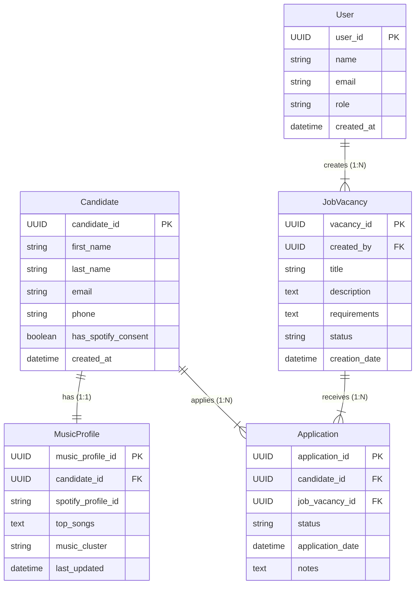
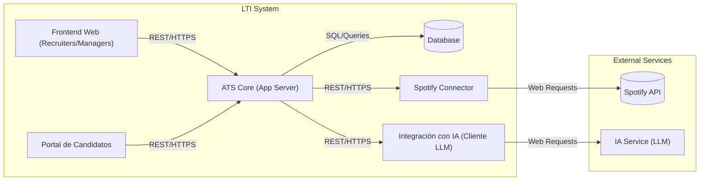
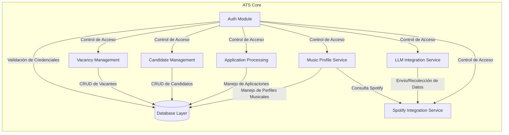

# Yoberty Alej Garcia - ChatGPT o1

## 1. Prompt
```md

## Rol

Eres un experto en product development brillante, comprendes a la perfección lo que se necesita para crear un MVP desde la definición y diseño del sistema, la investigación y análisis de requisitos, la definición de casos de usos, el modelado de datos, la arquitectura de alto nivel y los artefactos de documentación relevantes (c4, adr, uml, mermaid, entidad-relacion, casos de usos, diagramas de flujos, diagramas de secuencia), y tienes una atención y habilidad especial en la generación de valor a partir de la gestión de pocos features, para esto tomas en cuenta la inspiración del mercado pero sobre todo la mitigación de las problematicas experimentadas por los usuarios finales en su customer journey, eres capaz de identificar, entender, enumerar y describir los beneficios que obtiene el cliente para considerar el uso del producto, las funcionalidades basicas necesarias y el valor agregado del mismo, y a su vez eres capaz de plasmar toda esta información en artefactos que permiten entender la vision integral del producto, mostrando distintos niveles de abstracción para que todos los actores en todos los niveles de la organización posean claridad sobre el producto, permitiendo una eficaz toma de decisiones, una comunicación excepcional y consistencia entre las revisiones y cambios, en un entorno de alta incertidumbre como son las start-ups y lean enviroments

```
## 1. Output
```md
¡Claro, Yoberty! Aquí me presentaré bajo este rol y mi enfoque será técnico, detallado y con mentalidad de Tech Lead. Estoy listo para profundizar y discutir sobre las mejores prácticas para el desarrollo de un MVP, desde la definición, investigación y validación de requisitos, hasta la documentación y el modelado de la arquitectura de alto nivel. Todo esto con el objetivo de que los diferentes stakeholders (negocio, producto, desarrollo, QA y hasta el usuario final) tengan claridad y entendimiento común de la visión y el propósito del producto.

¿En qué punto del proceso de desarrollo de un MVP deseas que comencemos la conversación? Puedo empezar con el diseño de la arquitectura, documentación, o bien la definición y priorización de features y casos de uso, lo que prefieras.
```

## 2. Prompt

```md
## Producto

El producto que se desea obtener es un ATS, el nombre del producto es LTI, quiero aumentar la eficiencia para los departamentos de HR, mejorar la colaboración en tiempo real entre reclutadores y managers, automatizaciones, asistencia de IA en diversas tareas

## Objetivo

Tu misión es diseñar la primera versión del sistema, entregando los siguientes artefactos:

Descripción breve del software LTI, valor añadido y ventajas competitivas. Explicación de las funciones principales. Añadir un diagrama Lean Canvas para entender el modelo de negocio
Descripción de los 3 casos de uso principales, con el diagrama asociado a cada uno
Modelo de datos que cubra entidades, atributos (nombre y tipo) y relaciones
Diseño del sistema a alto nivel, tanto explicado como diagrama adjunto
Diagrama C4 que llegue en profundidad a uno de los componentes del sistema, el que prefieras

## Feedback

Ya teniendo claro cual sera el objetivo final y los entregables, en este momento me interesa discutir las primeras etapas de la definición y diseño del sistema, para esto quiero que generemos una discusión constante en la que me proveeras de todas las preguntas que creas pertinentes y asi mismo me confirmaras tus ideas antes de proceder a la creación de los artefactos, esta ultima parte es extremadamente importante.

## Valor Agregado

Mi enfoque es explotar la creatividad para encontrar un valor agregado que nos diferencie de los competidores, se de antemano que toda la competencia intentara usar LLMs para optimizar los tiempos y la calidad de sus sistemas, pero en mi caso quiero que el valor agregado se encuentre en la forma en la que alimentemos el LLM, aprovechando el concepto de multimodalidad y anclandonos en el valor creativo que los candidatos pueden poseer.

Creo que la musica es una herramienta poderosa que puede funcionar como una capa contextual extra para entender con mayor claridad el perfil del candidato, como encaja en la empresa, en que departamento su perfil puede ser de mayor relevancia, con que equipo de personas se podria relacionar mejor etc

Quiero que exploremos este concepto como factor diferenciador
```

## 2. Ouput

```md
¡Claro, Yoberty! Encantado de impulsar esta conversación técnica desde la perspectiva de un Senior Software Engineer y Tech Lead. Antes de proceder a la generación de los artefactos formales (diagramas, modelos de datos y demás), necesitamos recolectar y aclarar toda la información que nos permita diseñar un MVP con un diferencial sólido —especialmente aprovechando el concepto de multimodalidad e integrando la música como capa contextual.

A continuación, propongo una serie de preguntas y confirmaciones que nos ayudarán a alinear la visión, definir el alcance y entender mejor el uso de la música como factor diferenciador. Me interesa saber tu punto de vista y validaciones antes de consolidar cualquier artefacto.

1. Preguntas de Alta Prioridad (Enfoque de Negocio y Valor)
Definición de target de usuarios:

¿Quiénes serán los principales usuarios del ATS LTI? (Reclutadores, managers, candidatos, HR generalists, etc.)
¿El sistema se enfocará en todos por igual o hay un perfil prioritario para la primera versión?
Alcance específico de la música como factor diferenciador:

¿Cómo envisionas la recolección de esta información musical? ¿Será por autorreporte del candidato, por audios grabados, por playlists compartidas, por análisis de sus hábitos en plataformas de streaming, etc.?
¿El objetivo principal es tener un “perfil musical” que ayude a ubicar culturalmente al candidato dentro de equipos (para mejorar compatibilidad), o hay otras aplicaciones que te gustaría explorar?
Metodología de recomendación/perfilamiento:

¿Ya tienes definido cómo se interpretará la afinidad musical en el contexto de valores, dinámica de equipos y cultura empresarial?
¿Buscas algo más estadístico (ej. data-driven matching, factorización de preferencias musicales) o más cualitativo (ej. estilo, estado de ánimo musical) para la comparación candidato-equipo?
Integración de la IA y multimodalidad:

¿Cuáles son los límites y requisitos de la “multimodalidad” que deseas? (Texto, audio, posiblemente imágenes relacionadas con la marca personal del candidato, etc.)
¿Se planea usar embeddings especializados para texto y audio, o prefieres explorar una primera versión más manual/heurística para no sobrecomplicar el MVP?
Valor agregado y ventaja competitiva:

¿Cómo comunicas esta “capa musical” y la propuesta de valor a los HR managers y reclutadores? (Esto es clave para la adopción interna.)
¿Estás planteando este feature como un complemento diferenciador “nice to have” o realmente como el core del MVP?
Alcance de Automatizaciones e Integraciones en el MVP:

¿Cuáles son las automatizaciones mínimas que quieres ver en esta primera versión? (Por ejemplo: screening automático de CVs, scheduling de entrevistas, recomendaciones de perfiles basados en vacantes.)
¿Necesitas integraciones con otras plataformas HR (LinkedIn, Glassdoor, Indeed, etc.) y con plataformas de streaming musical (Spotify, YouTube Music, Apple Music, etc.)?
Compliance, privacidad y manejo de datos:

¿Existen restricciones de compliance en la recolección de datos musicales o de conducta del candidato?
¿Debemos contemplar algún tipo de consentimiento adicional para la recolección de esta información?
Indicadores de éxito inicial:

¿Cuáles métricas demostrarán que el valor aportado por la “capa musical” realmente impacta en la eficiencia del reclutamiento? (Ej. Time-to-hire, retención, satisfacción del manager, fit cultural a largo plazo.)
2. Confirmaciones de Alcance y Entendimiento
Primera versión del producto (MVP)

Queremos algo funcional, con los core features de un ATS (tracking de candidatos, pipeline de reclutamiento, roles y permisos para reclutador/manager).
A esto le sumamos la capa de IA y la capa musical (aunque sea de forma básica y acotada).
Integración con LLM

Confirmamos que la apuesta de valor es en cómo alimentamos al LLM y no tanto en el LLM en sí (que seguramente será un modelo existente, ya sea open source o uno con licencia).
La idea es que nuestra fuente de datos sea multimodal (texto: CV, información de la vacante, cultura empresarial; audio: preferencias o muestras musicales, etc.), y se use para un mejor “fit analysis”.
Roadmap de funcionalidades

En el MVP no podemos cubrir la totalidad de un ATS sofisticado (gestión de nóminas, integraciones con ERP, etc.), pero sí las funcionalidades de reclutamiento esenciales (crear vacantes, subir perfiles, mover candidato en pipeline, gestionar entrevistas y feedback).
La capa musical, en su MVP, podría ser un cuestionario básico o un upload de playlists —pero la idea es prototipar la lógica de matching y dar un “insight” al manager.
Bases tecnológicas

Asumiendo que necesitamos un backend escalable, con servicios que puedan crecer (quizá microservicios o un monolito modular, según el costo/beneficio).
El sistema debe poseer un frontend que permita la interacción de reclutadores, managers y, en menor medida, candidatos.
De entrada, consideraremos que la modularidad y la escalabilidad son claves, especialmente si planeamos integrar IA y análisis de audio.
3. Próximos Pasos
Con estas preguntas y confirmaciones, podremos empezar a:

Definir con mayor claridad el MVP, priorizando las funcionalidades de ATS indispensables vs. el factor musical y la IA.
Diseñar la arquitectura y el modelo de datos (definiendo entidades base: Candidate, Job, Application, Recruiter, Manager, MusicProfile, etc.).
Diseñar los casos de uso principales (por ejemplo, un “Posting de Vacante”, “Aplicación del Candidato” y “Evaluación Musical/Cultural”).
Configurar la lógica de negocio para la plataforma (al menos en su forma inicial).
Elaborar prototipos y diagramas (Lean Canvas, C4, UML, etc.) a partir de la claridad que obtengamos en estos primeros debates.
Preguntas de Validación Inmediata
Para avanzar de forma ágil, Yoberty, te agradecería me confirmes o retroalimentes sobre:

Importancia del factor musical:

¿Es obligatorio para cada candidato entregar información musical, o lo manejamos como un feature opt-in?
Profundidad del análisis musical:

¿Te gustaría una primera versión que asigne un “music personality cluster” (ej. Rock Enthusiast, Pop & Energetic, Classical & Thoughtful), o prefieres un approach más libre?
Alcance de la IA en el MVP:

¿Qué nivel de “asistencia de IA” es fundamental en la primera versión? (Análisis de CV semántico, sugerencia de preguntas en entrevistas, ranking básico de candidatos vs. vacantes.)
Usuarios principales para probar el MVP:

¿Reclutadores y managers de un departamento de HR real? ¿O un piloto con un equipo pequeño para iterar rápido?
Con tus respuestas, definimos una lista más ajustada de requisitos y un backlog inicial. Así evitamos documentación redundante y producimos diagramas que respondan directamente a las necesidades reales del producto. Quedo atento a tu retroalimentación para confirmar los puntos y luego pasar a diseñar la solución de manera más concreta.

¡Adelante, Yoberty! ¿Qué opinas de este enfoque y de las preguntas planteadas?
```

## 3. Prompt

```md
## Preguntas de alta prioridad 

1. Recruiters y Candidates por igual  
2. Información publica de Spotify del candidato a partir de su usuario o correo, preguntarle cuales son 5 canciones favoritas y pedirle una pequeña descripción de que musica oye regularmente cuando esta en el trabajo, cuando quiere promover su productividad y cuando esta en ocio  Si, el objetivo es obtener un perfil mucho mas avanzado del candidato gracias a la capa contextual extra que proporcionan sus preferencias musicales  
3. Ambos enfoques deben tomarse en cuenta en este MVP, tanto el enfoque estadistico como el cualitativo, ya que el enfoque humano y cultural de este producto es una de sus mayores propuestas de valor  
4. De momento solo añadieremos como factor adicional a la multimodalidad la capa extra que representa la musica, de momento mantengamos la version inicial sin sobrecomplicar  
5. El LLM utilizara la información cultural obtenida para indicarle al recruiter sobre las conexiones culturales con la empresa, los departamentos y los empleados de las mismas, para dar mejores insights sobre como podria relacionarse con sus compañeros, este seria el core del MVP
6. Utilicemos los features minimos y esenciales de una ATS que añadan mayor valor a la propuesta de producto, la recomendación de perfiles para vacantes es una buena iniciativa, utilizaremos solo spotify para este MVP
7. Se debe solicitar el consentimiento del manejo de los datos al usuario para continuar con el proceso de selección
8. Utilizaremos las metricas mas usadas en las empresas que utilizan los ATS mas comunes

## Confirmaciones de alcance

1. Si, algo funcional con solo lo escencial donde el valor agregado es esta capa musical en un LLM
2. Correcto, la propuesta de valor radica en el uso de la capa contextual musical como input para un mejor fit analysis
3.  Correcto, enfoquemonos en el MVP, en el que la forma de solicitar la información puede ser experimental e iterativa, la importancia radica en el insight obtenido del mismo para mejorar el entendimiento del perfil del candidato
4. Utilicemos las decisiones de arquitectura mas sencillas y escalables que permitan validar la hipotesis en un mejor costo/beneficio, debe poseer un frontend para que los candidatos y los recruiters puedan interactuar con la data y con la información obtenida de esta

## Preguntas de Validación inmediata

1. Es obligatorio entregar la información musical ya que en esta radica el valor agregado
2. Exploremos este "music personality cluster" en la version inicial pero consideremos a futuro otros approaches
3. Añadamos y exploremos diferentes niveles de asistencia de IA para extraer la mayor cantidad de infromación posible sobre el perfil del candidato y como podria hacer buen fit en la empresa
4. No esta definido, abarquemos un enfoque generalizado para este MVP

## Implementación e iteración

Es importante que cada artefacto lo validemos de forma iterativa, no avances con el siguiente artefacto hasta que hayamos validado y confirmado el mismo
```
## 3. Output

```md
¡Perfecto, Yoberty! Con las respuestas y confirmaciones que has brindado, podemos dar el primer paso en la generación de los artefactos. Recuerda que validaremos cada uno de forma iterativa, así que me enfocaré únicamente en la Descripción del software (LTI), valor añadido, ventajas competitivas, explicación de funciones principales y el Lean Canvas.

Si algo no te parece o deseas ajustarlo, ¡no dudes en indicármelo antes de que avancemos al siguiente artefacto!

1. Descripción Breve del Software LTI
LTI es un sistema de seguimiento de candidatos (Applicant Tracking System, ATS) que integra un enfoque innovador de análisis musical para lograr un mejor entendimiento cultural y de afinidad de cada candidato con la empresa. A través de la conexión con Spotify y el uso de un LLM (Large Language Model) alimentado con datos textuales y musicales, LTI otorga a los reclutadores y managers insights más profundos sobre cómo el candidato podría encajar con los equipos de trabajo, la cultura organizacional y las dinámicas internas.

Valor Añadido Principal
Enriquecimiento del perfil del candidato: La información musical ayuda a reflejar aspectos de personalidad, preferencias creativas y rasgos culturales que típicamente no se capturan en un CV.
Capacidad Multimodal con IA: Se combina texto (CV, descripciones de vacantes, políticas culturales de la empresa) con data musical (géneros, playlists, canciones favoritas) para dar sugerencias más asertivas de “fit”.
Experiencia diferenciada: Destaca ante otros ATS por la posibilidad de obtener no solo un skill match, sino también un cultural match, fomentando la armonía y productividad en el equipo.
Ventajas Competitivas
Integración Musical como Factor Clave
Ningún ATS convencional ofrece una capa tan específica y contextual de musicalidad para el cultural fit.
LLM con Input Enriquecido
Emplear la música como factor adicional de contexto permite que el LLM genere recomendaciones más personalizadas.
Optimización del Tiempo de Reclutamiento
El ATS incorpora funcionalidades esenciales (publicación de vacantes, pipeline de selección, evaluaciones), aprovechando IA para reducir las tareas manuales y repetitivas.
Diferenciación en la Experiencia del Candidato
Al pedirles compartir sus gustos y preferencias musicales, se crea un proceso más cercano y genuino, mejorando la percepción y el engagement de los postulantes.
2. Explicación de las Funciones Principales
Gestión de Vacantes y Candidatos

Crear, editar y cerrar vacantes de forma centralizada.
Visualizar, filtrar y gestionar candidatos en cada etapa del proceso.
Pipeline de Reclutamiento

Definir etapas personalizadas (ej. Screening, Entrevista, Oferta) y mover candidatos en el pipeline de manera visual.
Integración con Spotify para el Candidato

Solicitar autorización para obtener el perfil público de Spotify y/o un conjunto de playlists/canciones favoritas.
Recopilar 5 canciones más representativas y una breve descripción del uso de la música en diferentes contextos (trabajo, productividad, ocio).
Módulo de Análisis Musical

Creación de un “music personality cluster” básico que agrupe a los candidatos según sus afinidades musicales.
Visualización de estos clusters en el perfil del candidato.
Asistencia de IA (LLM)

Análisis y procesamiento de datos textuales (CV, requisitos de vacantes, cultura de la empresa) y datos musicales para dar sugerencias sobre el fit cultural y recomendaciones de vacante.
Sugerir preguntas de entrevista personalizadas en base a la información textual y musical.
Automatizaciones Esenciales

Notificaciones automáticas a reclutadores y managers al pasar un candidato de una etapa a otra.
Reportes rápidos sobre el estado del pipeline y métricas básicas (tiempo promedio de contratación, tasa de conversión, etc.).
Privacidad y Consentimiento

Obtención de consentimiento explícito por parte del candidato para el uso de sus datos musicales y su vinculación con el perfil.
3. Lean Canvas de LTI
A continuación, presento un Lean Canvas simplificado que describe la propuesta de negocio y la validación del producto.
(Para mayor claridad en texto, lo desglosamos por secciones.)


| **PROBLEM**                                                                                                                                                | **SOLUTION**                                                                                                                                                                                     |
|------------------------------------------------------------------------------------------------------------------------------------------------------------|--------------------------------------------------------------------------------------------------------------------------------------------------------------------------------------------------|
| - Procesos de reclutamiento tradicionales no capturan el *fit cultural* de forma eficaz.<br/>- Falta de diferenciación en la experiencia del candidato.<br/>- ATS genéricos no ofrecen *insights* profundos ni recomendaciones basadas en cultura. | - ATS que integra **LLM + datos musicales** para un mejor *cultural fit* y experiencia del candidato.<br/>- **Integración con Spotify** para obtener un “Music Profile” relevante.<br/>- Módulo de **IA** que analiza y correlaciona datos textuales y musicales. |

| **UNIQUE VALUE PROPOSITION**                                                                                                  | **UNFAIR ADVANTAGE**                                                                                                                        |
|------------------------------------------------------------------------------------------------------------------------------|----------------------------------------------------------------------------------------------------------------------------------------------|
| **“LTI: El ATS que analiza la música para potenciar la experiencia de reclutamiento y cultural fit.”**                       | - **Metodología única** de recolección y análisis de preferencias musicales (Spotify).<br/>- Integración rápida con un **LLM** que aprovecha datos multimodales. |

| **CUSTOMER SEGMENTS**                                                                                                              | **KEY METRICS**                                                                                                                                           |
|------------------------------------------------------------------------------------------------------------------------------------|-----------------------------------------------------------------------------------------------------------------------------------------------------------|
| - Departamentos de HR y Recruiters.<br/>- Managers que buscan un equipo con buen “match cultural”.<br/>- Startups y empresas que valoran la innovación en sus procesos de reclutamiento. | - **Time-to-hire**<br/>- **Tasa de retención**<br/>- **Calidad percibida** de la contratación (feedback de managers y reclutadores)<br/>- Nivel de **adopción de la capa musical** por parte de reclutadores |

| **CHANNELS**                                                                                                                                                                   | **COST STRUCTURE**                                                                                                                                                           |
|---------------------------------------------------------------------------------------------------------------------------------------------------------------------------------|---------------------------------------------------------------------------------------------------------------------------------------------------------------------------------------------------------------------|
| - **Plataforma web** propia (ATS + acceso reclutadores/managers).<br/>- Sitio de aplicación para candidatos.<br/>- Integraciones con LinkedIn u otros portales en el futuro. | - **Desarrollo y mantenimiento** de la plataforma.<br/>- **Licencia/uso** del LLM (open source o comercial).<br/>- **Integración** de la API de Spotify.                                                              |

| **REVENUE STREAMS**                                                                                     |
|---------------------------------------------------------------------------------------------------------|
| - **Suscripción** mensual/anual por usuario reclutador (SaaS).<br/>- **Planes escalonados** según cantidad de vacantes o usuarios. | 

```
## 4. Prompt

```md
Estoy de acuerdo con lo que me has entregado, prioricemos la entrega de los artefactos usando Mermaid para incorporar el concepto de Diagram as Code como parte de los entregables
```

## 4. Output

```md
2. Casos de Uso Principales
2.1. Caso de Uso: “Publicar Vacante”
Descripción
El Reclutador inicia sesión en el sistema LTI para crear y publicar una nueva vacante. El sistema valida la información y confirma la publicación.

Actores Involucrados

Reclutador
Sistema LTI (ATS)
Flujo Principal

El Reclutador inicia sesión en LTI.
Selecciona la opción “Crear Vacante”.
Completa el formulario con título, descripción, requisitos, etc.
Confirma la creación de la vacante.
LTI valida y registra la nueva vacante en la base de datos.
LTI muestra confirmación y la vacante queda visible para candidatos.
Diagrama (Mermaid)

mermaid
Copiar
Editar
sequenceDiagram
    participant R as Reclutador
    participant LTI as Sistema LTI

    R->>LTI: Inicia sesión y selecciona "Crear Vacante"
    LTI-->>R: Despliega formulario de nueva vacante
    R->>LTI: Llena datos (Título, Descripción, Requisitos)
    LTI->>LTI: Valida y registra la vacante
    LTI-->>R: Retorna confirmación de creación
    R->>LTI: Publica la vacante
    LTI-->>R: La vacante queda visible para los candidatos
2.2. Caso de Uso: “Aplicar a Vacante”
Descripción
El Candidato ingresa al portal de LTI, revisa las vacantes disponibles y decide aplicar a una de ellas. El sistema solicita datos personales, CV y permiso para integrar su información musical.

Actores Involucrados

Candidato
Sistema LTI (ATS)
Spotify (opcional para este paso, pero se menciona al final)
Flujo Principal

El Candidato accede al portal de LTI (página de vacantes).
Selecciona la vacante de interés.
LTI muestra los detalles de la vacante y un botón para aplicar.
El Candidato completa la información solicitada (CV, preguntas básicas).
LTI registra la aplicación en la base de datos.
LTI solicita consentimiento para vincular la cuenta de Spotify (opcional, si no hay otro mecanismo de verificación).
El Candidato da su consentimiento y, si procede, se vincula la cuenta de Spotify o ingresa sus 5 canciones favoritas.
LTI confirma la aplicación exitosa.
Diagrama (Mermaid)

mermaid
Copiar
Editar
sequenceDiagram
    participant C as Candidato
    participant LTI as Sistema LTI
    participant S as Spotify (Opcional)

    C->>LTI: Accede al portal y ve listado de vacantes
    LTI-->>C: Muestra vacantes disponibles
    C->>LTI: Selecciona la vacante y hace clic en "Aplicar"
    LTI-->>C: Despliega formulario de aplicación (CV, info personal)
    C->>LTI: Envía datos de aplicación
    LTI->>LTI: Registra la postulación
    LTI-->>C: Solicita consentimiento para enlazar Spotify
    alt El Candidato Acepta
        C->>S: Proporciona credenciales/consentimiento
        S-->>LTI: Retorna info de perfil público (5 canciones, etc.)
    else El Candidato Rechaza
        C->>LTI: Datos musicales no proporcionados
    end
    LTI-->>C: Muestra confirmación de aplicación exitosa
2.3. Caso de Uso: “Evaluar Candidato con Capa Musical”
Descripción
El Reclutador/Manager revisa un candidato que ya ha aplicado y, si ha proporcionado datos musicales (ya sea la conexión a Spotify o la lista de canciones), el sistema LTI aprovecha el LLM para generar insights sobre compatibilidad cultural.

Actores Involucrados

Reclutador/Manager
Sistema LTI (ATS)
Spotify (para recuperar datos musicales)
LLM (para procesar datos textuales y musicales)
Flujo Principal

El Reclutador/Manager entra a LTI para ver detalles de un candidato.
LTI muestra información del CV, experiencia y, si está disponible, la información musical.
LTI realiza una llamada al LLM con datos textuales (CV, requerimientos de la vacante, cultura empresarial) y datos musicales (géneros, 5 canciones favoritas, etc.).
El LLM devuelve sugerencias e insights sobre el fit cultural (p. ej., “Cluster Musical: Rock/Indie, probable afinidad con equipos creativos”).
LTI presenta estos insights al Reclutador/Manager.
El Reclutador/Manager decide si avanza con la entrevista o pasa al siguiente paso en el pipeline.
LTI registra la decisión tomada en el perfil del candidato.
Diagrama (Mermaid)

mermaid
Copiar
Editar
sequenceDiagram
    participant R as Reclutador/Manager
    participant LTI as Sistema LTI
    participant S as Spotify
    participant LLM as Modelo IA

    R->>LTI: Selecciona un candidato para evaluación
    LTI-->>R: Muestra CV y datos básicos
    alt Hay datos musicales
        LTI->>S: Obtiene lista de reproducción / Canciones favoritas
        S-->>LTI: Devuelve datos (géneros, artistas, etc.)
        LTI->>LLM: Envía CV + datos culturales + datos musicales
        LLM-->>LTI: Retorna sugerencias e insights de fit
        LTI-->>R: Muestra resultados e insights
    else No hay datos musicales
        LTI-->>R: Muestra CV sin capa musical
    end
    R->>LTI: Toma decisión (entrevista, descartar, etc.)
    LTI-->>R: Actualiza pipeline y notifica estado del candidato
Revisión y Siguientes Pasos
Confirma si estos tres casos de uso y sus respectivos diagramas en Mermaid cumplen con tus expectativas para el MVP.
Valida el Lean Canvas en formato Markdown.
Cuando lo consideres aprobado, procedemos a los próximos artefactos:

Modelo de Datos
Diseño de Sistema a Alto Nivel
Diagrama C4 profundizando en uno de los componentes.
¡Quedo atento a tu retroalimentación para continuar, Yoberty!
```

## 5. Prompt

```md
Queda aprobado, procedamos al modelo de datos
```
## 5. Output

```md
# Modelo de Datos - LTI

A continuación se presenta el **Modelo de Datos** que cubre las principales entidades, atributos y relaciones del MVP de LTI. Incluye:

1. **Listado de Entidades y Atributos** (con posibles tipos de datos).  
2. **Diagrama ER en Mermaid** (*Diagram as Code*).

Puedes revisar y validar si esto se ajusta a tu visión. Si deseas modificaciones, ¡házmelo saber antes de pasar al diseño de sistema a alto nivel!

---

## 1. Entidades y Atributos Principales

### 1.1. **User** 
Representa a cualquier usuario interno del sistema (Reclutador, Manager, Admin, etc.).

| Atributo       | Tipo de Dato (Ejemplo) | Descripción                                                     |
| -------------- | ---------------------- | --------------------------------------------------------------- |
| **user_id**    | `UUID` (PK)           | Identificador único del usuario.                                |
| **name**       | `VARCHAR(100)`        | Nombre completo del usuario.                                    |
| **email**      | `VARCHAR(100)`        | Correo electrónico del usuario (único).                         |
| **role**       | `VARCHAR(50)`         | Rol del usuario dentro de LTI (e.g., “Recruiter”, “Manager”).   |
| **created_at** | `TIMESTAMP`           | Fecha y hora de creación del registro.                          |

---

### 1.2. **Candidate**
Información de cada postulante que se registra o aplica a alguna vacante en el sistema.

| Atributo             | Tipo de Dato (Ejemplo) | Descripción                                                                    |
| -------------------- | ---------------------- | ------------------------------------------------------------------------------ |
| **candidate_id**     | `UUID` (PK)           | Identificador único del candidato.                                             |
| **first_name**       | `VARCHAR(100)`        | Nombre.                                                                        |
| **last_name**        | `VARCHAR(100)`        | Apellido.                                                                      |
| **email**            | `VARCHAR(100)`        | Correo electrónico del candidato (único).                                      |
| **phone**            | `VARCHAR(20)`         | Teléfono de contacto (opcional).                                              |
| **has_spotify_consent** | `BOOLEAN`          | Indica si el candidato ha dado consentimiento para usar sus datos de Spotify. |
| **created_at**       | `TIMESTAMP`           | Fecha y hora de creación del registro.                                        |

---

### 1.3. **MusicProfile**
Contiene la capa musical que diferencia a LTI, asociada a un candidato con consentimiento.

| Atributo             | Tipo de Dato (Ejemplo) | Descripción                                                                                            |
| -------------------- | ---------------------- | ------------------------------------------------------------------------------------------------------ |
| **music_profile_id** | `UUID` (PK)           | Identificador único del perfil musical.                                                                |
| **candidate_id**     | `UUID` (FK)           | Relación 1:1 con `Candidate`.                                                                          |
| **spotify_profile_id** | `VARCHAR(100)`      | ID de la cuenta de Spotify (si procede) o cualquier referencia al usuario de Spotify.                 |
| **top_songs**        | `TEXT / JSON`         | Lista de las 5 canciones favoritas o datos de playlists (formato JSON, CSV, etc.).                    |
| **music_cluster**    | `VARCHAR(100)`        | Cluster o categorización musical (ej. “Rock Enthusiast”, “Indie & Chill”).                             |
| **last_updated**     | `TIMESTAMP`           | Fecha y hora de la última actualización de la info musical.                                           |

> **Nota**: En un MVP, podemos guardar las 5 canciones como un texto estructurado (JSON). A futuro, se puede normalizar más si se requiere.

---

### 1.4. **JobVacancy**
Define la vacante publicada en el sistema, creada por un usuario (reclutador).

| Atributo          | Tipo de Dato (Ejemplo) | Descripción                                                        |
| ----------------- | ---------------------- | ------------------------------------------------------------------ |
| **vacancy_id**    | `UUID` (PK)           | Identificador único de la vacante.                                 |
| **created_by**    | `UUID` (FK -> User)   | ID del usuario que crea la vacante (generalmente un reclutador).   |
| **title**         | `VARCHAR(200)`        | Título de la vacante.                                              |
| **description**   | `TEXT`                | Descripción detallada de la posición.                              |
| **requirements**  | `TEXT`                | Lista de requisitos y habilidades necesarias.                      |
| **status**        | `VARCHAR(50)`         | Estado de la vacante (ej. “OPEN”, “CLOSED”).                       |
| **creation_date** | `TIMESTAMP`           | Fecha y hora de creación.                                          |

---

### 1.5. **Application**
Registra la postulación de un candidato a una vacante y su estado en el proceso.

| Atributo            | Tipo de Dato (Ejemplo) | Descripción                                                                                         |
| ------------------- | ---------------------- | --------------------------------------------------------------------------------------------------- |
| **application_id**  | `UUID` (PK)           | Identificador único de la postulación.                                                              |
| **candidate_id**    | `UUID` (FK -> Candidate) | ID del candidato que se está postulando.                                                          |
| **job_vacancy_id**  | `UUID` (FK -> JobVacancy) | ID de la vacante a la que se aplica.                                                              |
| **status**          | `VARCHAR(50)`         | Etapa de la postulación (ej. “APPLIED”, “SCREENING”, “INTERVIEW”, “OFFER”, “HIRED”, “REJECTED”).    |
| **application_date** | `TIMESTAMP`          | Fecha y hora en la que se realizó la postulación.                                                  |
| **notes**           | `TEXT` (Opcional)     | Notas adicionales del reclutador, comentarios del manager, etc.                                    |

---

## 2. Diagrama ER (Mermaid)



## 6. Prompt

```md
Queda aprobado, procedamos al Diseño de sistema a alto nivel
```
## 6. Output

```md
# Diseño de Sistema a Alto Nivel

En esta sección describiremos la **arquitectura general** de LTI y los principales componentes que la conforman. El objetivo es ofrecer una **vista panorámica** de cómo las distintas piezas interactúan entre sí, sin aún entrar en los niveles de detalle que veremos posteriormente en el **Diagrama C4**.

---

## 1. Explicación General

### 1.1. Objetivos de la Arquitectura
- **Escalabilidad y Modularidad**: Permitir que la aplicación crezca de forma orgánica, agregando nuevas integraciones (p. ej., otros servicios de música) o expandiendo la lógica de IA sin afectar al núcleo.
- **Mantenimiento Sencillo**: Favorecer la separación de responsabilidades (frontend, lógica de negocio, integración con IA, persistencia de datos, etc.).
- **Rapidez de Implementación (MVP)**: Emplear un enfoque que sea ágil de desarrollar y desplegar, evitando una sobreingeniería innecesaria.

### 1.2. Principales Componentes

1. **Frontend Web (Recruiters/Managers)**  
   - Aplicación web dirigida a los reclutadores y managers para gestionar vacantes, evaluar candidatos y ver insights de la IA.  
   - Acceso seguro mediante roles de usuario.

2. **Portal de Candidatos**  
   - Interfaz donde los postulantes pueden registrarse, aplicar a vacantes y, de manera opcional, conectar su cuenta de Spotify (o proveer su “Top 5 Songs”).

3. **ATS Core (LTI Backend)**  
   - Contiene la **lógica de negocio** principal, incluyendo la gestión de vacantes, candidatos, aplicaciones y pipeline de reclutamiento.  
   - Integra módulos para comunicarse con el modelo de IA (LLM) y con servicios externos (Spotify).  
   - Responsable de la **autenticación** y **autorización** de usuarios.

4. **Servicio de IA (LLM)**  
   - Puede ser un servicio externo (API de un tercero) o un módulo interno con un modelo open-source.  
   - Recibe datos textuales (CV, descripción de vacante, cultura empresarial) y datos musicales (géneros, playlists) para generar insights de “fit cultural”.

5. **Integración con Spotify**  
   - Se encarga de la interacción con la **API de Spotify**, previa autorización del candidato.  
   - Obtiene información pública del perfil musical y/o playlists.

6. **Base de Datos (persistencia)**  
   - Almacena la información de Usuarios, Candidatos, Vacantes, Aplicaciones, Perfiles Musicales, etc.  
   - Puede ser una base de datos relacional (p. ej., PostgreSQL, MySQL) o NoSQL, según el caso de uso.  
   - Es clave mantener la trazabilidad de los datos y el consentimiento del candidato en cuanto a su información musical.

7. **Servicios de Notificaciones (Opcional en MVP)**  
   - Pueden emplearse para mandar correos o mensajes automáticos a reclutadores y candidatos (al cambiar de etapa en el proceso, etc.).  
   - No es crítico para el MVP, pero se suele considerar en un ATS robusto.

---

## 2. Diagrama de Alto Nivel (Mermaid)

Este diagrama muestra los componentes lógicos y el flujo de información principal:

    ```mermaid
    flowchart LR
        A[Frontend Web <br/>(Recruiter/Manager)] -- HTTP/HTTPS --> C((ATS Core<br/>Backend))
        B[Portal de Candidatos] -- HTTP/HTTPS --> C
        C -- DB Connection --> D[(Database)]
        C -- LLM API --> E((Servicio de IA <br/>(LLM)))
        C -- REST/GraphQL --> F[(Spotify API)]
        
        A -- Visualiza y Gestiona Vacantes --> C
        B -- Aplica a Vacante / <br/> Suministra Datos Musicales --> C
        
        style A fill:#f3f3f3,stroke:#999,stroke-width:2px
        style B fill:#f3f3f3,stroke:#999,stroke-width:2px
        style C fill:#e7f7ff,stroke:#0275d8,stroke-width:2px
        style D fill:#fffceb,stroke:#f0ad4e,stroke-width:2px
        style E fill:#ffffff,stroke:#999,stroke-dasharray: 5 5
        style F fill:#ffffff,stroke:#999,stroke-dasharray: 5 5
    ```
## Descripción del Diagrama

**Frontend Web (Recruiter/Manager) [A]**  
Se conecta al ATS Core vía HTTPS para crear vacantes, mover candidatos en el pipeline y ver recomendaciones.

**Portal de Candidatos [B]**  
Permite a los postulantes registrarse, aplicar a vacantes y, opcionalmente, conectar con Spotify o introducir manualmente sus canciones favoritas.

**ATS Core [C]**  
- Lógica de negocio del sistema.  
- Gestiona solicitudes de reclutadores y candidatos.  
- Administra la Base de Datos [D] para guardar entidades principales (Users, Candidates, MusicProfile, JobVacancy, Application).  
- Cuando un reclutador solicita “insights culturales” o “match”:  
  1. Envía datos (CV, música, cultura empresarial) al Servicio de IA [E].  
  2. El Servicio de IA procesa y responde con sugerencias de *fit*.  
- Cuando un candidato da consentimiento, obtiene la info musical de la Spotify API [F].

**Database [D]**  
Almacena de forma persistente los datos de la aplicación.

**Servicio de IA (LLM) [E]**  
- Proveedor de capacidades de Inteligencia Artificial, puede ser interno o externo (API).  
- Maneja el análisis multimodal (texto + música).

**Spotify API [F]**  
Servicio externo para obtener la información pública o playlists del candidato, previo consentimiento.

---

### 3. Consideraciones Clave

#### Autenticación y Roles
- Es fundamental garantizar que solo Reclutadores/Managers tengan acceso a la administración de vacantes.  
- Los Candidatos tienen acceso limitado (ver vacantes, aplicar, gestionar su perfil).

#### Permisos y Consentimiento para Datos Musicales
- El sistema debe registrar el consentimiento del candidato antes de integrar Spotify.  
- En caso de no obtener consentimiento, se crea un perfil sin datos musicales.

#### Comunicación con el LLM
- Puede hacerse vía API REST, gRPC u otra interfaz.  
- Se debería considerar la latencia y los costes asociados al consumo de la IA en cada evaluación.

#### Escalabilidad del Backend
- Usar contenedores (Docker/Kubernetes) o un PaaS (Heroku, AWS, GCP) para escalar sin complejidad extra.  
- Mantener la flexibilidad: si el volumen de datos musicales crece, podría agregarse un servicio especializado.

#### Seguridad y Protección de Datos
- Cifrado en tránsito (HTTPS/TLS) y, si es necesario, cifrado en reposo.  
- Políticas de retención de datos conforme a regulaciones de privacidad.

---

### Siguientes Pasos
Una vez confirmes que este **Diseño de Sistema a Alto Nivel** cumple con tus expectativas, avanzaremos con el **Diagrama C4**, profundizando en uno de los componentes (por ejemplo, en la integración del LLM o la capa de Spotify).

¡Quedo atento a tu retroalimentación, Yoberty!

```

## 7. Prompt

```md
Queda aprobado, procedamos al diagrama C4, si tienes alguna duda en este proceso pudes confirmarlo conmigo
```
## 7. Output

```md
# Diagrama C4 de LTI

A continuación se muestra una propuesta de modelo **C4** para el sistema LTI. Recuerda que el C4 se compone de cuatro niveles:

1. **Context** (Sistema en su entorno)  
2. **Container** (Contenedores lógicos/del sistema)  
3. **Component** (Módulos internos de cada contenedor)  
4. **Code** (Nivel de detalle en implementación, opcional en esta etapa)

En este documento nos enfocaremos en **los tres primeros niveles**, profundizando en el tercer nivel sobre el **“ATS Core”** como componente principal.

---

## 1. System Context (Nivel 1)

En este primer diagrama se ilustra el sistema **LTI** como una “caja negra”, resaltando sus principales actores y sistemas externos.

> **Nota**: Mermaid no ofrece una notación oficial de C4, pero usaremos `flowchart` para capturar la esencia. 

    ```mermaid
    flowchart LR
        A((Recruiter/Manager)):::actor
        B((Candidate)):::actor
        S((Spotify)):::extern
        E((IA Service<br>(LLM))):::extern
        
        subgraph LTI - ATS
        LTI[LTI System<br>(ATS)]
        end

        A -- Interactúa con --> LTI
        B -- Aplica / Proporciona Info --> LTI
        LTI -- Consulta / Usa --> S
        LTI -- Envía Datos / Recibe Respuesta --> E

        classDef actor fill:#f3f3f3,stroke:#999,stroke-width:1px
        classDef extern fill:#ffffff,stroke:#999,stroke-dasharray: 5 5

    ```
### Descripción

- Recruiter/Manager: Usuario interno que publica vacantes, revisa candidatos y obtiene insights del LLM.
- Candidate: Persona que aplica a la vacante, provee CV y (opcionalmente) su información musical.
- Spotify: Servicio externo para obtener la información musical de los candidatos (previo consentimiento).
- IA Service (LLM): Motor de recomendación y análisis multimodal (texto + música).
- Objetivo: Mostrar cómo LTI se relaciona con actores humanos y externos, sin detallar la composición interna.


## 2. Container Diagram (Nivel 2)

Ahora vemos los contenedores internos del sistema LTI y cómo se comunican.

Cada contenedor representa un área funcional o proceso independiente (aunque en el MVP puedan convivir en un mismo servidor).



### Descripción de los Contenedores

#### Objetivo

Visualizar los “bloques” internos de LTI y las dependencias externas (Spotify API y IA Service).

#### Frontend Web (Recruiters/Managers)

- Interfaz principal para creación de vacantes, gestión de candidatos, visualización de insights.

#### Portal de Candidatos

- Interfaz para candidatos: registro, aplicación a vacantes y configuración musical (permiso Spotify o top 5 canciones).

#### ATS Core (App Server)

- Lógica principal del negocio.
- Procesa solicitudes de Frontend y Portal.
- Administra las entidades (Vacantes, Candidatos, Aplicaciones, MusicProfile).
- Se comunica con la base de datos y los conectores externos (IA, Spotify).

#### Database

- Almacena la información relacional (Users, Candidates, MusicProfile, JobVacancy, Application, etc.).

#### Integración con IA (Cliente LLM)

- Módulo especializado para llamar a la API del LLM.
- Se encarga de formatear y enviar la data (CV, datos musicales, requisitos).
- Recibe y procesa las respuestas del modelo IA.

#### Spotify Connector

- Módulo para interactuar con la API de Spotify (obtener playlists, top tracks, etc.).
- Solo se activa si el candidato otorga consentimiento.

## 3. Component Diagram (Nivel 3) - Profundizando en ATS Core

En este nivel, nos sumergimos en el contenedor “ATS Core (App Server)” para exponer sus componentes clave. Cada componente implementa una parte concreta de la lógica de negocio.



### Descripción de los Componentes

#### Objetivo
Mostrar cómo está estructurado internamente el ATS Core, evidenciando los componentes principales y su comunicación interna.

#### Auth Module

- Responsable de la autenticación (login) y autorización (roles: Recruiter, Manager, etc.).
- Valida la sesión y controla el acceso a otros componentes.

#### Vacancy Management

- Maneja toda la lógica CRUD de las vacantes (crear, leer, actualizar, cerrar).
- Asocia las vacantes con el reclutador que las crea.

#### Candidate Management

- Maneja el registro de candidatos y la actualización de su información (datos personales, CV, etc.).

#### Application Processing

- Encargado de las postulaciones y su pipeline (screening, entrevista, oferta, etc.).
- Actualiza el estado de cada aplicación.

#### Music Profile Service

- Lógica para crear/actualizar el perfil musical de un candidato (Top 5 canciones, cluster musical, etc.).
- Interactúa con Spotify Integration Service si el candidato otorga consentimiento.

#### LLM Integration Service

- Gestiona la comunicación con el IA Service.
- Envía los datos relevantes (perfil del candidato, información musical, requisitos) y obtiene los insights de fit cultural.

#### Spotify Integration Service

- En caso de que el candidato conecte su cuenta de Spotify, se encarga de llamar a la Spotify API y retornar los datos relevantes.

#### Database Layer

- Abstracción para consultas y operaciones en la base de datos.
- Cada componente realiza sus operaciones a través de este layer (usando repositorios, DAOs, etc.).