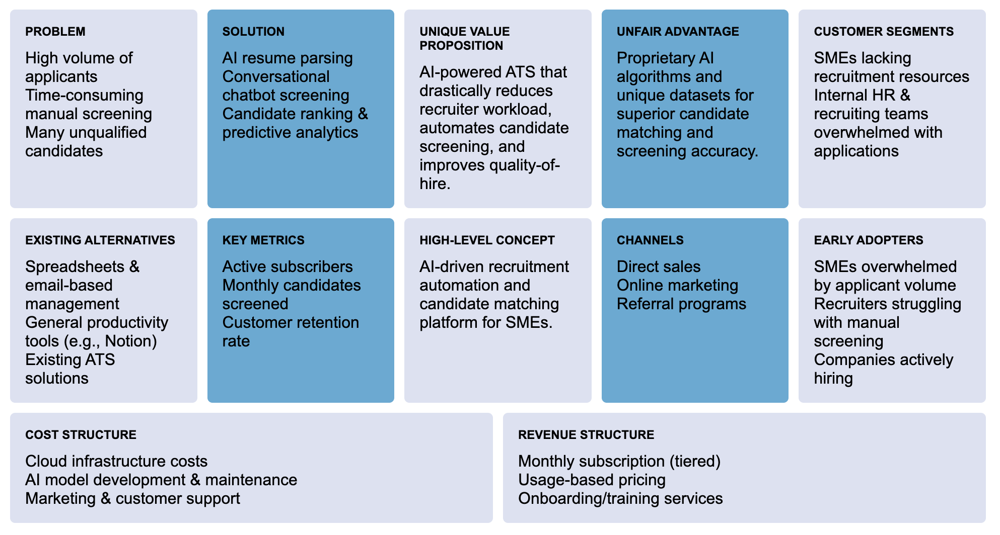
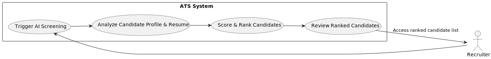
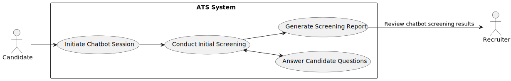
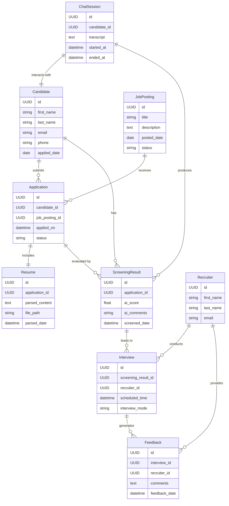
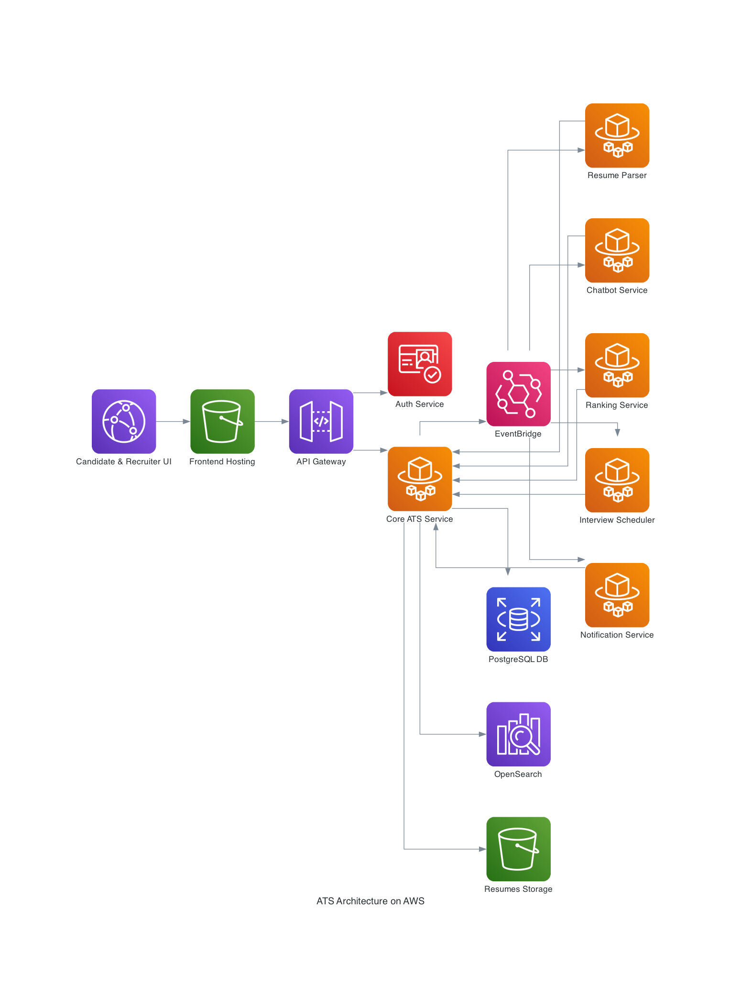
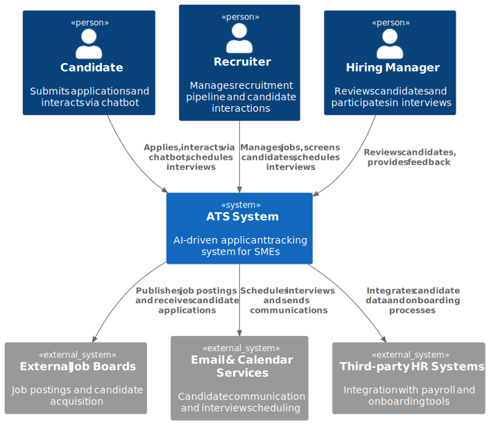
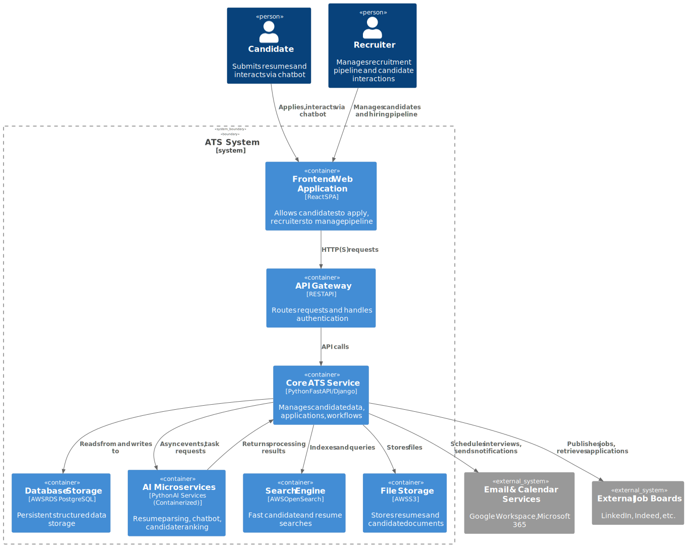
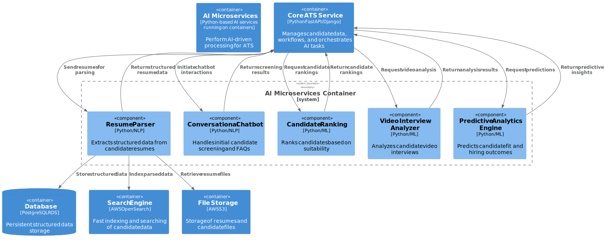

# Introduction to ATS by LTI

ATS/LTI is an innovative Applicant Tracking System developed specifically for small to medium-sized enterprises (SMEs) facing high volumes of applicants and significant recruitment workloads. Leveraging cutting-edge artificial intelligence, ATS/LTI streamlines candidate processing, significantly reduces manual screening efforts, and enhances hiring decisions. By automating complex recruitment tasks, ATS/LTI empowers SMEs to efficiently manage their talent acquisition process, enabling recruiters to focus more strategically on quality hires and less on administrative overhead.

## Competitive Advantages & Value Added:
- Proprietary AI models and unique datasets that enhance candidate matching accuracy.
- Significant reduction in recruiter workload through intelligent automation.
- Superior candidate experience via conversational AI and intuitive interfaces.
- Real-time predictive analytics improving quality-of-hire.

## Core Functionalities

1. **AI-driven resume parsing & candidate profiling**: Automated extraction and structuring of candidate information from resumes using AI, ensuring quick and accurate candidate evaluations.
2. **Candidate pipeline management**: Intuitive visualization and tracking of candidates through the recruitment stages, improving workflow efficiency.
3. **Candidate search & advanced filtering**: Powerful, semantic-based search and filtering capabilities to quickly identify top candidates.
4. **Integrated candidate communication**: Centralized platform for seamless communication with candidates, including email and messaging integration.
5. **Interview scheduling and management**: Automated interview scheduling integrated with popular calendars (Google, Outlook), reducing coordination efforts.
6. **Collaboration & role-based access control**: Controlled collaborative workspace enabling recruitment teams to securely share, review, and manage candidate data.
7. **Job posting and distribution**: Single-click job posting across multiple job boards and social media platforms, maximizing job visibility.
8. **Career page builder**: Easy-to-use tool for creating branded, responsive career pages without technical expertise, enhancing employer branding.
9. **Customizable workflows & automation**: Configurable recruitment workflows with automated notifications, reminders, and task handling to streamline processes.
10. **Real-time analytics & reporting**: Insightful analytics dashboards tracking hiring metrics and providing actionable recruitment insights for data-driven decisions.
11. **Mobile optimization & accessibility**: Fully mobile-friendly ATS interfaces allowing candidates and recruiters access on any device, improving user experience.
12. **Integration with HR & third-party systems**: Seamless connectivity with existing HRIS, payroll, and other enterprise tools to streamline processes and data flow.
13. **Compliance and GDPR management**: Built-in compliance tools ensuring candidate data is managed securely according to privacy regulations, protecting both candidates and employers.
14. **Talent pool & candidate sourcing**: Efficient management and nurturing of passive candidate talent pools for future opportunities, enhancing recruitment strategies.
15. **Predictive hiring analytics**: AI-driven insights predicting candidate performance, tenure, and hiring outcomes, aiding in more informed hiring decisions.
16. **Offer letter generation & e-signatures**: Automated creation and secure digital signing of employment offer letters for enhanced candidate experiences and quicker onboarding.

## Lean Canvas

## Principal use cases

### Use Case 1: Candidate Resume Submission & Parsing

Explanation:
* The Candidate uploads their resume into the ATS system.
* The system automatically parses the resume using AI/NLP to extract structured data such as candidate name, contact info, skills, and experience.
* The extracted data is then validated for accuracy and completeness.
* Once validated, a candidate profile is automatically created and made available for the Recruiter to review and act upon.

This process significantly reduces manual effort, minimizes errors, and accelerates initial candidate evaluation.

### Use Case 2: AI-driven Candidate Screening & Ranking

Explanation:
* The Recruiter initiates AI-driven screening within the ATS.
* The system analyzes candidate profiles and resumes, applying AI and machine learning algorithms to assess qualifications and match job requirements.
* Candidates are automatically scored and ranked based on AI analysis.
* A clearly organized and prioritized list of candidates is generated, allowing the Recruiter to quickly review and focus on the most promising applicants.

This AI-driven process significantly streamlines candidate evaluation and prioritization, ensuring recruiters spend their time efficiently on high-quality candidates.

### Use Case 3: Conversational Chatbot Screening

Explanation:
* The Candidate initiates interaction with the ATS via an AI-powered conversational chatbot.
* The chatbot conducts an initial screening, asking tailored questions to gather candidate details, clarify skills, and evaluate basic qualifications.
* The chatbot also answers candidate queries, providing immediate support and information, enhancing candidate experience.
* After the interaction, the system automatically generates a structured screening report, which is provided to the Recruiter for efficient review and further action.

This conversational screening method greatly enhances candidate engagement and significantly reduces manual recruiter workload at the earliest stage of recruitment.

## Entity-relationship diagram

Key Relationships:
* Candidate applies through an Application for a specific JobPosting.
* Resume is attached to each Application.
* ChatSession generates initial ScreeningResults.
* ScreeningResults lead to Interviews conducted by Recruiters.
* Recruiters provide Feedback after Interviews.

## System architecture @ AWS

## System architecture per the C4 model

### Context Diagram

Here’s a concise, clear top-level Context (C1) diagram of the ATS system, following the C4 model approach:

Explanation:

This Context (C1) diagram shows a high-level overview of the ATS system’s interactions with key user roles (Candidate, Recruiter, Hiring Manager) and external systems (Job Boards, Email/Calendar services, Third-party HR systems). It clearly illustrates the system’s role within the broader environment, outlining how users and external services interact with the ATS.

### Container Diagram

Here’s a clear, detailed C4 Container Diagram for the ATS system:

Explanation:

This Container (C2) diagram clearly details the ATS system components, including:
* Frontend Application: Provides interaction points for candidates and recruiters.
* API Gateway: Centralized API routing, security, and authentication.
* Core ATS Service: Centralized logic, candidate management, and workflow orchestration.
* AI Microservices: Handle computationally intensive AI tasks.
* Databases and Storage: Structured data storage, search capabilities, and file storage.

External integrations like Email/Calendar and Job Boards are also shown explicitly.

### Component Diagram – AI Microservices

Here’s a detailed C4 Component Diagram specifically for the “AI Microservices” component of your ATS system, rendered clearly using PlantUML’s built-in C4 library:

Explanation:

This Component (C3) diagram dives deep into the AI Microservices container, illustrating individual AI-powered services:
* Resume Parser: Parses resumes using NLP.
* Conversational Chatbot: Conducts initial candidate screenings.
* Candidate Ranking: Scores candidates based on their suitability.
* Video Interview Analyzer: Analyzes candidate interviews for soft skills.
* Predictive Analytics Engine: Provides insights on candidate success likelihood.

Interactions between these components and the Core ATS Service are clearly outlined, as well as their direct integration with data storage and search services.
