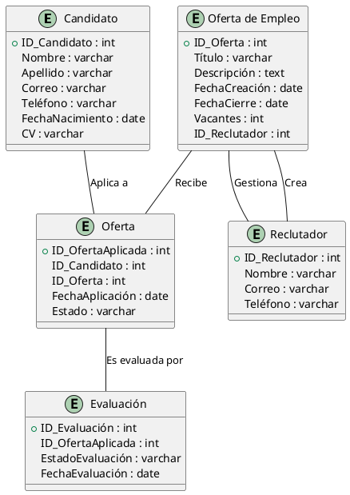

# LTI: Applicant Tracking System (ATS)

## Descripción del software
LTI es un sistema ATS (Applicant Tracking System) diseñado para revolucionar la gestión de procesos de selección mediante tecnología avanzada. Su enfoque innovador se basa en la inteligencia artificial para filtrar y recomendar candidatos, la automatización de procesos repetitivos y una interfaz altamente intuitiva que reduce la curva de aprendizaje.


## Valor añadido y ventajas competitivas
- **IA y Machine Learning**: Filtrado inteligente de candidatos según patrones de éxito anteriores.
- **Automatización avanzada**: Reducción del tiempo de contratación con flujos de trabajo personalizables.
- **Integraciones flexibles**: Conexión con LinkedIn, Indeed y APIs de RRHH.
- **Colaboración en tiempo real**: Panel de control compartido para reclutadores y managers.
- **Métricas y analíticas**: Reportes detallados para optimizar decisiones de selección.


## Funciones principales
1. **Gestor de candidaturas**: Panel de control con pipeline visual para seguimiento de candidatos.
2. **Parser de CVs con IA**: Extracción automática de información relevante.
3. **Entrevistas automatizadas**: Videoentrevistas con evaluación automática por IA.
4. **Publicación de ofertas multi-plataforma**: Sincronización con portales de empleo.
5. **Automatización de flujos de trabajo**: Reglas personalizables para notificaciones y seguimientos.
6. **Análisis y reportes**: KPIs de contratación, tasa de conversión y eficiencia de selección.
7. **Integración con herramientas de RRHH**: Conexión con ERP y CRM.


## Lean Canvas

Este diseño provee una visión clara del modelo de negocio y funcionalidad de LTI, permitiendo su desarrollo ágil y enfocado en el MVP.


## Principales casos de uso del sistema LTI

# LTI: Applicant Tracking System (ATS)

## Descripción del software
LTI es un sistema ATS (Applicant Tracking System) diseñado para revolucionar la gestión de procesos de selección mediante tecnología avanzada. Su enfoque innovador se basa en la inteligencia artificial para filtrar y recomendar candidatos, la automatización de procesos repetitivos y una interfaz altamente intuitiva que reduce la curva de aprendizaje.

### Valor añadido y ventajas competitivas
- **IA y Machine Learning**: Filtrado inteligente de candidatos según patrones de éxito anteriores.
- **Automatización avanzada**: Reducción del tiempo de contratación con flujos de trabajo personalizables.
- **Integraciones flexibles**: Conexión con LinkedIn, Indeed y APIs de RRHH.
- **Colaboración en tiempo real**: Panel de control compartido para reclutadores y managers.
- **Métricas y analíticas**: Reportes detallados para optimizar decisiones de selección.

## Funciones principales
1. **Gestor de candidaturas**: Panel de control con pipeline visual para seguimiento de candidatos.
2. **Parser de CVs con IA**: Extracción automática de información relevante.
3. **Entrevistas automatizadas**: Videoentrevistas con evaluación automática por IA.
4. **Publicación de ofertas multi-plataforma**: Sincronización con portales de empleo.
5. **Automatización de flujos de trabajo**: Reglas personalizables para notificaciones y seguimientos.
6. **Análisis y reportes**: KPIs de contratación, tasa de conversión y eficiencia de selección.
7. **Integración con herramientas de RRHH**: Conexión con ERP y CRM.

## Lean Canvas

Este diseño provee una visión clara del modelo de negocio y funcionalidad de LTI, permitiendo su desarrollo ágil y enfocado en el MVP:


---

## Casos de Uso para el MVP

Para un proyecto ATS innovador como LTI, los tres casos de uso más importantes, de mayor a menor prioridad, serían:

Entendido. A continuación, te presento versiones más detalladas de los diagramas UML para los tres casos de uso, donde se incluyen más actores, interacciones y pasos involucrados. 

### 1. **Registrar Candidatos**
   **Descripción Detallada**: 
   - El candidato ingresa su información personal (nombre, dirección, teléfono, correo, etc.).
   - Adjunta su CV en un formato permitido.
   - El sistema valida la entrada de datos y guarda la información del candidato en la base de datos.
   - El candidato recibe una confirmación de registro exitoso.

   **Diagrama PlantUML**:
   ```plantuml
   @startuml
   actor "Candidato" as C
   actor "Sistema de Validación" as V
   actor "Base de Datos" as DB
   rectangle "Sistema ATS" {
       usecase "Registrar Candidato" as UC1
       usecase "Validar Datos del Candidato" as UC1A
       usecase "Guardar Datos en Base de Datos" as UC1B
       usecase "Confirmar Registro" as UC1C
   }
   
   C -> UC1 : Ingresa datos personales y CV
   UC1 -> UC1A : Valida los datos del candidato
   UC1A -> V : Verifica formato y requisitos
   V --> UC1A : Datos válidos
   UC1A --> UC1B : Guarda datos en la base de datos
   UC1B --> DB : Almacena datos del candidato
   UC1B --> UC1C : Envia confirmación al candidato
   UC1C --> C : Muestra confirmación de registro exitoso
   @enduml
   ```

   

### 2. **Gestionar Ofertas de Empleo**
   **Descripción Detallada**: 
   - El reclutador crea una oferta de empleo, ingresando título, descripción, requisitos y fecha límite de la oferta.
   - El sistema guarda la oferta en la base de datos.
   - El reclutador puede ver todas las ofertas publicadas y gestionar su estado (abierta, cerrada, etc.).
   - Los candidatos pueden aplicar a las ofertas.

   **Diagrama PlantUML**:
   ```plantuml
   @startuml
   actor "Reclutador" as R
   actor "Sistema de Publicación" as SP
   actor "Base de Datos" as DB
   actor "Candidato" as C
   rectangle "Sistema ATS" {
       usecase "Crear Oferta de Empleo" as UC2
       usecase "Guardar Oferta" as UC2A
       usecase "Ver Ofertas Publicadas" as UC2B
       usecase "Aplicar a Oferta" as UC2C
   }
   
   R -> UC2 : Ingresa detalles de la oferta
   UC2 -> UC2A : Guarda oferta en la base de datos
   UC2A --> DB : Almacena oferta en la base de datos
   UC2 --> UC2B : Muestra lista de ofertas publicadas
   C -> UC2C : Aplica a la oferta
   UC2C --> DB : Almacena aplicación del candidato
   @enduml
   ```

   

### 3. **Evaluar y Filtrar Candidatos**
   **Descripción Detallada**: 
   - El reclutador accede a la lista de candidatos que han aplicado a una oferta.
   - El reclutador puede aplicar filtros (por experiencia, habilidades, etc.) para encontrar candidatos adecuados.
   - El sistema muestra los candidatos filtrados.
   - El reclutador puede revisar el perfil de cada candidato y asignar una evaluación (aprobado, rechazado, en espera).

   **Diagrama PlantUML**:
   ```plantuml
   @startuml
   actor "Reclutador" as R
   actor "Sistema de Filtrado" as SF
   actor "Base de Datos" as DB
   actor "Candidato" as C
   rectangle "Sistema ATS" {
       usecase "Filtrar Candidatos" as UC3
       usecase "Aplicar Filtros" as UC3A
       usecase "Mostrar Resultados Filtrados" as UC3B
       usecase "Evaluar Candidato" as UC3C
   }
   
   R -> UC3 : Accede a la lista de candidatos
   UC3 -> UC3A : Aplica filtros de selección
   UC3A --> SF : Filtra candidatos por criterios
   SF --> UC3B : Muestra los candidatos filtrados
   R -> UC3C : Asigna evaluación a candidato
   UC3C --> DB : Guarda la evaluación
   @enduml
   ```

   

### Explicación de los Diagramas:

1. **Registrar Candidatos**: Aquí hemos detallado el proceso de validación de datos y el almacenamiento en la base de datos, que es un paso clave en la gestión de la información del candidato.
2. **Gestionar Ofertas de Empleo**: Se incluyen las interacciones entre el reclutador, el sistema y la base de datos, mostrando tanto la creación de ofertas como la gestión de aplicaciones.
3. **Evaluar y Filtrar Candidatos**: Este caso de uso destaca cómo el reclutador puede aplicar filtros y realizar evaluaciones, con la información guardada en la base de datos.

Estos diagramas proporcionan un flujo más detallado de cada uno de los procesos y cómo interactúan los actores y el sistema para llevar a cabo las tareas de un ATS efectivo.

## Modelo Entidad-Relación

Aquí tienes el modelo de datos actualizado utilizando **"Oferta"** en lugar de **"Aplicación"**. He modificado el diagrama en consecuencia.

### Diagrama PlantUML actualizado:




